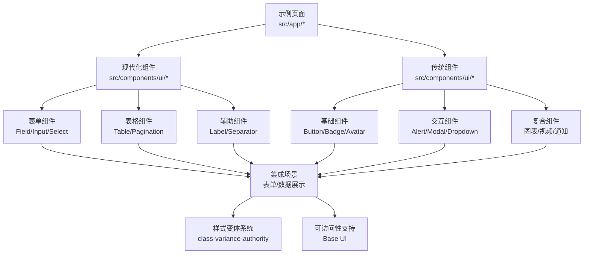
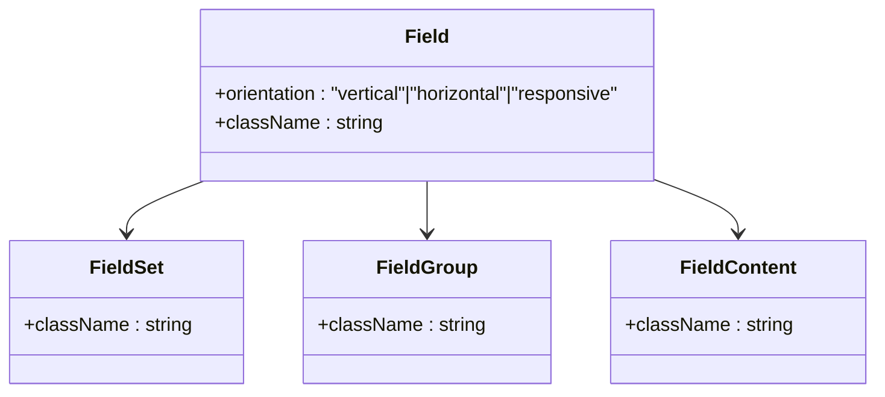
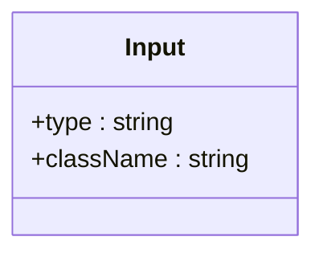
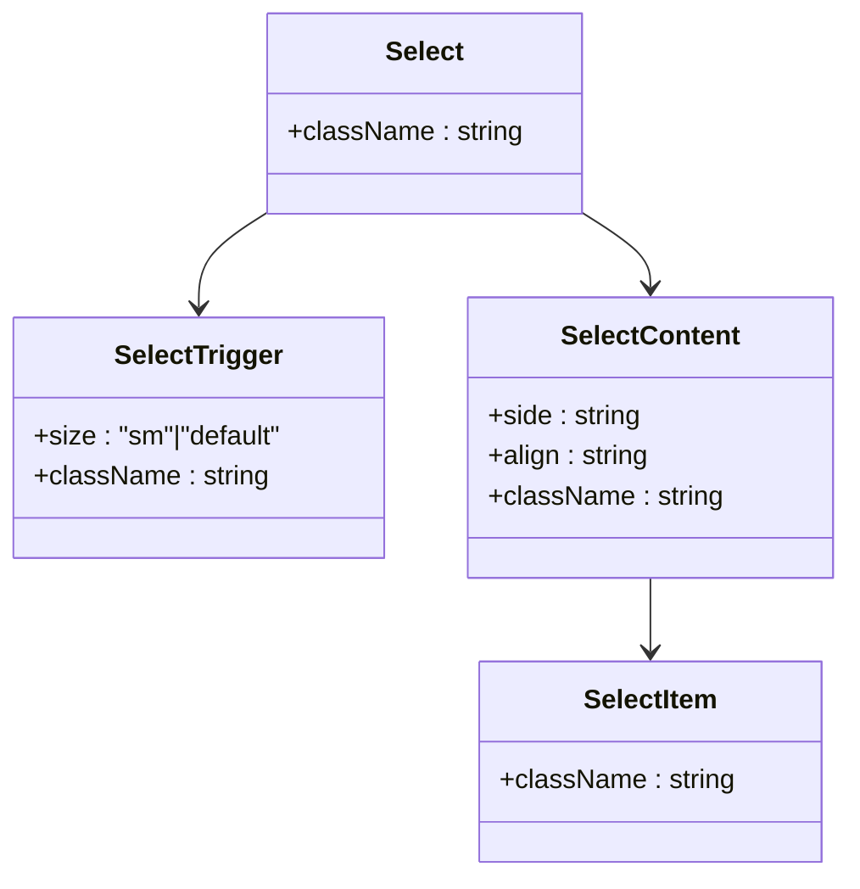
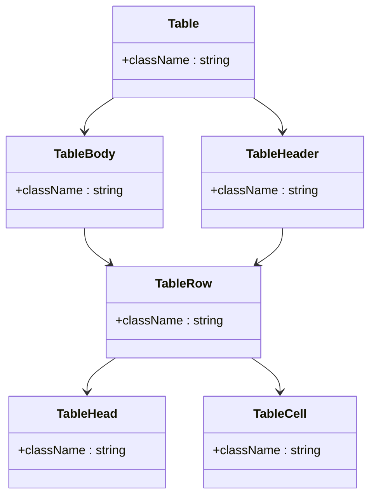
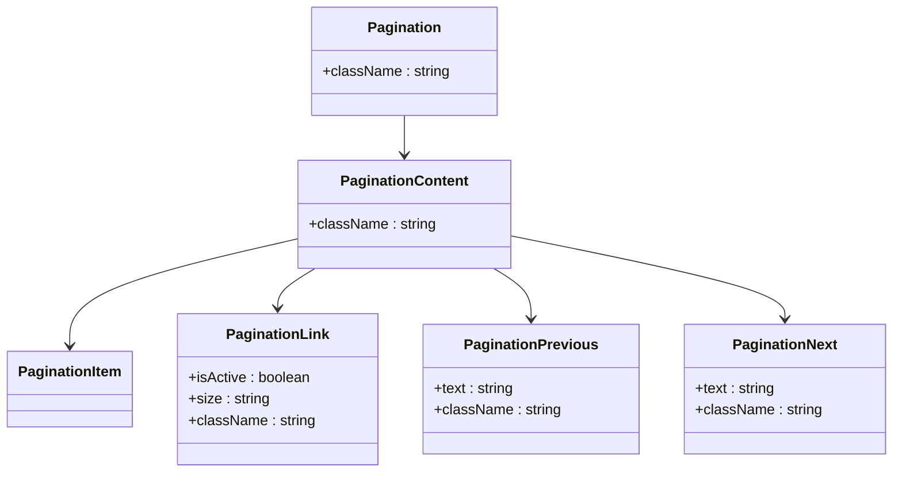
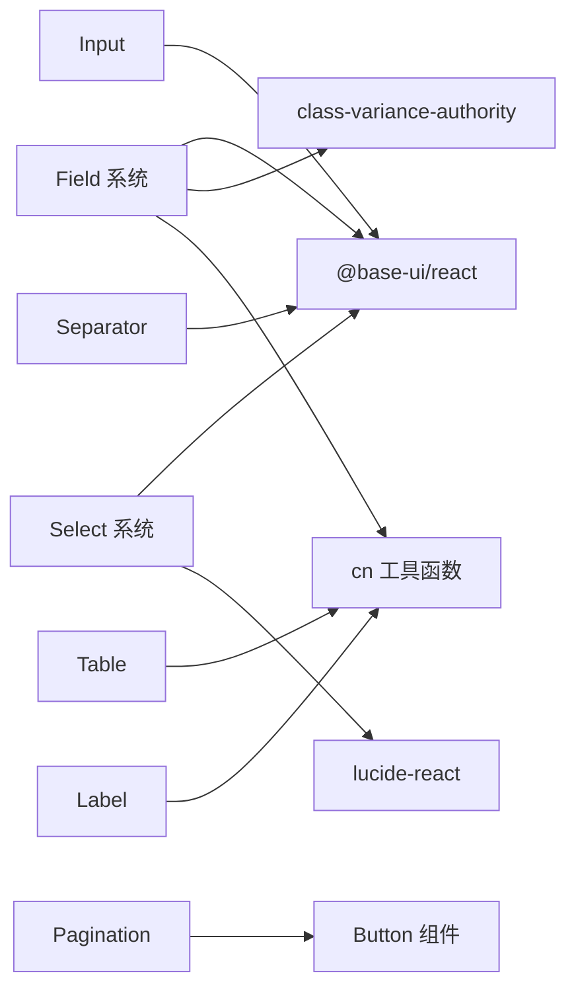

# UI 组件库

<cite>
**本文引用的文件**
- [src/components/ui/button/Button.tsx](file://src/components/ui/button/Button.tsx)
- [src/components/ui/badge/Badge.tsx](file://src/components/ui/badge/Badge.tsx)
- [src/components/ui/avatar/Avatar.tsx](file://src/components/ui/avatar/Avatar.tsx)
- [src/components/ui/avatar/AvatarText.tsx](file://src/components/ui/avatar/AvatarText.tsx)
- [src/components/ui/alert/Alert.tsx](file://src/components/ui/alert/Alert.tsx)
- [src/components/ui/modal/index.tsx](file://src/components/ui/modal/index.tsx)
- [src/components/ui/dropdown/Dropdown.tsx](file://src/components/ui/dropdown/Dropdown.tsx)
- [src/components/ui/table/index.tsx](file://src/components/ui/table/index.tsx)
- [src/components/ui/video/YoutubeEmbed.tsx](file://src/components/ui/video/YoutubeEmbed.tsx)
- [src/components/ui/sonner.tsx](file://src/components/ui/sonner.tsx)
- [src/components/ui/button.tsx](file://src/components/ui/button.tsx)
- [src/components/form/input/InputField.tsx](file://src/components/form/input/InputField.tsx)
- [src/components/form/Select.tsx](file://src/components/form/Select.tsx)
- [src/components/user-profile/UserInfoCard.tsx](file://src/components/user-profile/UserInfoCard.tsx)
- [src/components/user-profile/UserAddressCard.tsx](file://src/components/user-profile/UserAddressCard.tsx)
- [src/components/ui/field.tsx](file://src/components/ui/field.tsx)
- [src/components/ui/input.tsx](file://src/components/ui/input.tsx)
- [src/components/ui/select.tsx](file://src/components/ui/select.tsx)
- [src/components/ui/table.tsx](file://src/components/ui/table.tsx)
- [src/components/ui/pagination.tsx](file://src/components/ui/pagination.tsx)
- [src/components/ui/label.tsx](file://src/components/ui/label.tsx)
- [src/components/ui/separator.tsx](file://src/components/ui/separator.tsx)
- [src/app/(admin)/(ui-elements)/buttons/page.tsx](file://src/app/(admin)/(ui-elements)/buttons/page.tsx)
- [src/app/(admin)/(ui-elements)/badge/page.tsx](file://src/app/(admin)/(ui-elements)/badge/page.tsx)
- [src/app/(admin)/(ui-elements)/avatars/page.tsx](file://src/app/(admin)/(ui-elements)/avatars/page.tsx)
- [src/app/(admin)/(ui-elements)/alerts/page.tsx](file://src/app/(admin)/(ui-elements)/alerts/page.tsx)
- [src/app/(admin)/(ui-elements)/modals/page.tsx](file://src/app/(admin)/(ui-elements)/modals/page.tsx)
- [src/app/(admin)/(ui-elements)/videos/page.tsx](file://src/app/(admin)/(ui-elements)/videos/page.tsx)
- [src/app/(admin)/(others-pages)/(forms)/form-elements/page.tsx](file://src/app/(admin)/(others-pages)/(forms)/form-elements/page.tsx)
- [src/app/(admin)/(others-pages)/(chart)/bar-chart/page.tsx](file://src/app/(admin)/(others-pages)/(chart)/bar-chart/page.tsx)
- [src/app/(admin)/(others-pages)/(chart)/line-chart/page.tsx](file://src/app/(admin)/(others-pages)/(chart)/line-chart/page.tsx)
- [src/app/(admin)/(others-pages)/(tables)/basic-tables/page.tsx](file://src/app/(admin)/(others-pages)/(tables)/basic-tables/page.tsx)
- [src/app/globals.css](file://src/app/globals.css)
</cite>

## 更新摘要
**变更内容**
- 新增现代化表单字段系统：Field、Input、Select 组件，提供更强大的表单构建能力
- 替换旧表格组件系统，引入全新的 Table 和 Pagination 组件
- 引入基于 Base UI 的现代化组件架构，提升可访问性和可维护性
- 新增 FieldSet、FieldGroup、FieldContent 等表单布局组件
- 统一使用 class-variance-authority 进行样式变体管理

## 目录
1. [简介](#简介)
2. [项目结构](#项目结构)
3. [核心组件](#核心组件)
4. [架构总览](#架构总览)
5. [详细组件分析](#详细组件分析)
6. [依赖关系分析](#依赖关系分析)
7. [性能考虑](#性能考虑)
8. [故障排查指南](#故障排查指南)
9. [结论](#结论)
10. [附录](#附录)

## 简介
本文件系统化梳理本仓库中的 UI 组件库，覆盖基础组件（按钮、输入框、徽章）、复合组件（图表、表格、模态框）、导航组件（下拉菜单、头像）、交互组件（提示、通知），并提供 API 文档、属性说明、使用示例与样式定制要点。文档同时关注响应式设计与无障碍访问兼容性，并给出组件组合与最佳实践建议。

**更新** 本版本重点反映了现代化组件架构的引入，包括全新的 Field 表单系统、基于 Base UI 的组件实现、以及更强大的表格和分页组件。

## 项目结构
UI 组件主要位于 src/components/ui 下，按功能域拆分：button、badge、avatar、alert、modal、dropdown、table、video、sonner 等；新增的现代化组件包括 field、input、select、table、pagination 等；示例页面位于 src/app 下的 UI 元素与示例区域，便于对照使用。

```mermaid
graph TB
subgraph "现代化组件"
field["表单字段系统<br/>Field/FieldSet/FieldGroup"]
input["输入框 Input<br/>基于 Base UI"]
select["选择框 Select<br/>基于 Base UI"]
table["表格 Table<br/>现代化实现"]
pagination["分页 Pagination<br/>完整实现"]
label["标签 Label<br/>语义化标签"]
separator["分隔线 Separator<br/>分割组件"]
end
subgraph "传统组件"
btn["按钮 Button"]
btn2["按钮 ButtonPrimitive"]
badge["徽章 Badge"]
avatar["头像 Avatar"]
avatarText["头像文本 AvatarText"]
alert["提示 Alert"]
modal["模态框 Modal"]
dropdown["下拉菜单 Dropdown"]
tableOld["旧表格 Table 系列"]
video["视频嵌入 YoutubeEmbed"]
toast["通知 Toaster"]
inputOld["输入框 InputField"]
selectOld["选择框 Select"]
userInfo["用户信息卡片"]
userAddress["用户地址卡片"]
end
subgraph "示例页面"
btnPage["UI 元素/按钮页"]
badgePage["UI 元素/徽章页"]
avatarPage["UI 元素/头像页"]
alertPage["UI 元素/提示页"]
modalPage["UI 元素/模态框页"]
videoPage["UI 元素/视频页"]
formPage["表单元素页"]
chartBarPage["柱状图页"]
chartLinePage["折线图页"]
tablePage["基础表格页"]
userInfoPage["用户信息页"]
userAddressPage["用户地址页"]
end
field --> formPage
input --> formPage
select --> formPage
table --> tablePage
pagination --> tablePage
label --> formPage
separator --> formPage
btnPage --> btn
badgePage --> badge
avatarPage --> avatar
avatarPage --> avatarText
alertPage --> alert
modalPage --> modal
videoPage --> video
formPage --> inputOld
formPage --> selectOld
formPage --> btn
formPage --> badge
chartBarPage --> video
chartLinePage --> video
tablePage --> tableOld
userInfoPage --> userInfo
userAddressPage --> userAddress
```

**图表来源**
- [src/components/ui/field.tsx:1-239](file://src/components/ui/field.tsx#L1-L239)
- [src/components/ui/input.tsx:1-21](file://src/components/ui/input.tsx#L1-L21)
- [src/components/ui/select.tsx:1-202](file://src/components/ui/select.tsx#L1-L202)
- [src/components/ui/table.tsx:1-117](file://src/components/ui/table.tsx#L1-L117)
- [src/components/ui/pagination.tsx:1-131](file://src/components/ui/pagination.tsx#L1-L131)
- [src/components/ui/label.tsx:1-21](file://src/components/ui/label.tsx#L1-L21)
- [src/components/ui/separator.tsx:1-26](file://src/components/ui/separator.tsx#L1-L26)

## 核心组件
- **现代化表单系统**：Field、Input、Select 组件，基于 Base UI 提供更好的可访问性和样式变体管理
- **增强表格系统**：全新的 Table 组件，支持容器化表格和现代化样式
- **完整分页系统**：Pagination 组件，提供完整的分页导航功能
- **语义化标签**：Label 组件，提供语义化的表单标签
- **分割组件**：Separator 组件，用于内容分隔
- **传统组件**：按钮、徽章、头像、提示、模态框、下拉菜单、通知等保持不变

**更新** 新增的现代化组件完全基于 Base UI 架构，提供更好的可访问性、样式变体管理和开发体验。

## 架构总览
组件库采用"现代化组件 + 传统组件并存"的混合架构。现代化组件基于 Base UI 和 class-variance-authority，提供更好的可访问性和样式管理；传统组件保持现有实现，确保向后兼容。

## 详细组件分析

### 表单字段系统 Field

#### Field 组件
- **功能概述**：表单字段容器，支持垂直、水平和响应式三种布局模式
- **关键属性**
  - orientation：vertical | horizontal | responsive（默认 vertical）
  - className：自定义样式类
- **交互行为**：作为语义化表单组容器，管理字段布局和状态
- **样式定制**：基于 class-variance-authority 的变体系统，支持响应式布局
- **无障碍与响应式**：使用 role="group" 和 data-slot 属性，支持 @container 查询

**图表来源**
- [src/components/ui/field.tsx:72-86](file://src/components/ui/field.tsx#L72-L86)
- [src/components/ui/field.tsx:10-21](file://src/components/ui/field.tsx#L10-L21)
- [src/components/ui/field.tsx:41-52](file://src/components/ui/field.tsx#L41-L52)
- [src/components/ui/field.tsx:88-99](file://src/components/ui/field.tsx#L88-L99)

**章节来源**
- [src/components/ui/field.tsx:72-86](file://src/components/ui/field.tsx#L72-L86)

#### FieldLabel 组件
- **功能概述**：表单字段标签，支持与输入组件的关联
- **关键属性**：继承 Label 组件的所有属性
- **交互行为**：与表单控件建立语义化关联
- **样式定制**：基于 peer/field-label 选择器的动态样式
- **无障碍与响应式**：支持禁用状态和焦点可见性

**章节来源**
- [src/components/ui/field.tsx:101-116](file://src/components/ui/field.tsx#L101-L116)

#### FieldDescription 组件
- **功能概述**：表单字段描述文本，提供额外的说明信息
- **关键属性**：标准段落元素属性
- **交互行为**：静态展示，支持链接样式
- **样式定制**：基于 text-sm 和 text-muted-foreground 的样式
- **无障碍与响应式**：支持链接样式和可访问性

**章节来源**
- [src/components/ui/field.tsx:131-144](file://src/components/ui/field.tsx#L131-L144)

#### FieldError 组件
- **功能概述**：表单字段错误信息展示，支持单个和多个错误
- **关键属性**
  - errors：错误对象数组
  - children：自定义错误内容
- **交互行为**：根据错误状态动态显示
- **样式定制**：基于 destructiv e颜色方案
- **无障碍与响应式**：使用 role="alert" 提供可访问性支持

**章节来源**
- [src/components/ui/field.tsx:176-225](file://src/components/ui/field.tsx#L176-L225)

### 现代化输入框 Input

#### Input 组件
- **功能概述**：现代化输入框组件，基于 Base UI 实现
- **关键属性**：继承原生 input 元素的所有属性
- **交互行为**：原生输入行为，支持各种输入类型
- **样式定制**：基于 data-slot="input" 的样式系统
- **无障碍与响应式**：支持禁用状态、无效状态和焦点环

**图表来源**
- [src/components/ui/input.tsx:6-18](file://src/components/ui/input.tsx#L6-L18)

**章节来源**
- [src/components/ui/input.tsx:1-21](file://src/components/ui/input.tsx#L1-L21)

### 现代化选择框 Select

#### Select 组件族
- **功能概述**：完整的现代化选择框组件系统，基于 Base UI
- **组件结构**
  - Select：根容器
  - SelectTrigger：触发器
  - SelectContent：下拉内容
  - SelectItem：选项项
  - SelectValue：选值显示
  - SelectLabel：分组标签
  - SelectSeparator：分隔线
  - SelectScrollUpButton/SelectScrollDownButton：滚动按钮

**图表来源**
- [src/components/ui/select.tsx:9-57](file://src/components/ui/select.tsx#L9-L57)
- [src/components/ui/select.tsx:111-137](file://src/components/ui/select.tsx#L111-L137)

**章节来源**
- [src/components/ui/select.tsx:1-202](file://src/components/ui/select.tsx#L1-L202)

### 现代化表格 Table

#### Table 组件族
- **功能概述**：现代化表格组件系统，提供容器化表格实现
- **组件结构**
  - Table：表格容器，支持溢出滚动
  - TableHeader/TableBody/TableFooter：表格各部分
  - TableRow：表格行
  - TableHead/TableCell：表头和单元格
  - TableCaption：表格标题

**图表来源**
- [src/components/ui/table.tsx:7-20](file://src/components/ui/table.tsx#L7-L20)
- [src/components/ui/table.tsx:22-40](file://src/components/ui/table.tsx#L22-L40)
- [src/components/ui/table.tsx:55-66](file://src/components/ui/table.tsx#L55-L66)
- [src/components/ui/table.tsx:68-92](file://src/components/ui/table.tsx#L68-L92)

**章节来源**
- [src/components/ui/table.tsx:1-117](file://src/components/ui/table.tsx#L1-L117)

### 分页 Pagination

#### Pagination 组件族
- **功能概述**：完整的分页导航组件系统
- **组件结构**
  - Pagination：分页容器
  - PaginationContent：分页内容容器
  - PaginationItem：分页项
  - PaginationLink：分页链接
  - PaginationPrevious/PaginationNext：前后页按钮
  - PaginationEllipsis：省略号

**图表来源**
- [src/components/ui/pagination.tsx:7-17](file://src/components/ui/pagination.tsx#L7-L17)
- [src/components/ui/pagination.tsx:19-30](file://src/components/ui/pagination.tsx#L19-L30)
- [src/components/ui/pagination.tsx:41-63](file://src/components/ui/pagination.tsx#L41-L63)
- [src/components/ui/pagination.tsx:65-99](file://src/components/ui/pagination.tsx#L65-L99)

**章节来源**
- [src/components/ui/pagination.tsx:1-131](file://src/components/ui/pagination.tsx#L1-L131)

### 语义化标签 Label

#### Label 组件
- **功能概述**：语义化的表单标签组件
- **关键属性**：继承原生 label 元素的所有属性
- **交互行为**：与表单控件建立关联
- **样式定制**：基于 peer 选择器的动态样式
- **无障碍与响应式**：支持禁用状态和焦点可见性

**章节来源**
- [src/components/ui/label.tsx:1-21](file://src/components/ui/label.tsx#L1-L21)

### 分隔线 Separator

#### Separator 组件
- **功能概述**：通用的分隔线组件
- **关键属性**
  - orientation：horizontal | vertical（默认 horizontal）
  - className：自定义样式类
- **交互行为**：静态展示，用于内容分隔
- **样式定制**：基于 data-horizontal 和 data-vertical 的样式
- **无障碍与响应式**：支持水平和垂直两种方向

**章节来源**
- [src/components/ui/separator.tsx:1-26](file://src/components/ui/separator.tsx#L1-L26)

### 传统组件（保持不变）

#### 按钮 Button
- **功能概述**：提供统一的按钮交互与视觉风格
- **关键属性**：与原有组件相同
- **交互行为**：与原有组件相同
- **样式定制**：与原有组件相同

**章节来源**
- [src/components/ui/button/Button.tsx:15-57](file://src/components/ui/button/Button.tsx#L15-L57)

#### 徽章 Badge
- **功能概述**：用于标记状态、标签或等级
- **关键属性**：与原有组件相同
- **交互行为**：与原有组件相同
- **样式定制**：与原有组件相同

**章节来源**
- [src/components/ui/badge/Badge.tsx:23-80](file://src/components/ui/badge/Badge.tsx#L23-L80)

#### 头像 Avatar
- **功能概述**：用户头像展示
- **关键属性**：与原有组件相同
- **交互行为**：与原有组件相同
- **样式定制**：与原有组件相同

**章节来源**
- [src/components/ui/avatar/Avatar.tsx:35-66](file://src/components/ui/avatar/Avatar.tsx#L35-L66)

#### 提示 Alert
- **功能概述**：用于展示成功/错误/警告/信息类提示
- **关键属性**：与原有组件相同
- **交互行为**：与原有组件相同
- **样式定制**：与原有组件相同

**章节来源**
- [src/components/ui/alert/Alert.tsx:13-146](file://src/components/ui/alert/Alert.tsx#L13-L146)

#### 模态框 Modal
- **功能概述**：弹出式对话框
- **关键属性**：与原有组件相同
- **交互行为**：与原有组件相同
- **样式定制**：与原有组件相同

**章节来源**
- [src/components/ui/modal/index.tsx:13-96](file://src/components/ui/modal/index.tsx#L13-L96)

#### 下拉菜单 Dropdown
- **功能概述**：从右上角弹出的菜单容器
- **关键属性**：与原有组件相同
- **交互行为**：与原有组件相同
- **样式定制**：与原有组件相同

**章节来源**
- [src/components/ui/dropdown/Dropdown.tsx:12-49](file://src/components/ui/dropdown/Dropdown.tsx#L12-L49)

#### 通知 Toaster
- **功能概述**：全局通知展示
- **关键属性**：与原有组件相同
- **交互行为**：与原有组件相同
- **样式定制**：与原有组件相同

**章节来源**
- [src/components/ui/sonner.tsx:8-32](file://src/components/ui/sonner.tsx#L8-L32)

## 依赖关系分析
- **现代化组件依赖**：基于 @base-ui/react-* 包，提供更好的可访问性
- **样式管理系统**：使用 class-variance-authority 进行变体管理
- **工具函数**：使用 cn 函数进行条件类名合并
- **传统组件**：保持原有依赖关系，确保向后兼容
- **新增依赖**：lucide-react 图标库，用于现代化组件的图标

**图表来源**
- [src/components/ui/field.tsx:3-8](file://src/components/ui/field.tsx#L3-L8)
- [src/components/ui/input.tsx:1-4](file://src/components/ui/input.tsx#L1-L4)
- [src/components/ui/select.tsx:3-7](file://src/components/ui/select.tsx#L3-L7)
- [src/components/ui/pagination.tsx:4](file://src/components/ui/pagination.tsx#L4)

## 性能考虑
- **现代化组件优化**：基于 Base UI 的组件具有更好的性能表现
- **样式变体管理**：class-variance-authority 提供高效的样式变体计算
- **条件渲染**：现代化组件使用 data-slot 属性，支持更精确的条件渲染
- **传统组件保持**：原有组件经过优化，性能稳定可靠
- **图标优化**：lucide-react 图标库支持 Tree Shaking

**更新** 新的现代化组件架构显著提升了组件的性能和开发体验。

## 故障排查指南
- **Field 组件布局问题**
  - 检查 orientation 属性设置是否正确
  - 确认子组件是否正确使用 data-slot 属性
  - 参考路径：[src/components/ui/field.tsx:54-70](file://src/components/ui/field.tsx#L54-L70)
- **Input 组件样式异常**
  - 检查 data-slot="input" 样式是否被覆盖
  - 确认禁用状态和无效状态的样式类
  - 参考路径：[src/components/ui/input.tsx:11-14](file://src/components/ui/input.tsx#L11-L14)
- **Select 组件下拉异常**
  - 检查 SelectTrigger 的 size 属性
  - 确认 Portal 渲染是否正常
  - 参考路径：[src/components/ui/select.tsx:31-57](file://src/components/ui/select.tsx#L31-L57)
- **Table 组件溢出问题**
  - 检查 Table 容器的 overflow-x-auto 设置
  - 确认表格内容是否超出容器宽度
  - 参考路径：[src/components/ui/table.tsx:9-19](file://src/components/ui/table.tsx#L9-L19)
- **Pagination 组件状态问题**
  - 检查 isActive 属性是否正确传递
  - 确认按钮变体是否根据状态切换
  - 参考路径：[src/components/ui/pagination.tsx:36-63](file://src/components/ui/pagination.tsx#L36-L63)
- **传统组件兼容性**
  - 确保原有组件仍能正常工作
  - 检查样式类名是否与新架构冲突
  - 参考路径：[src/components/ui/button/Button.tsx:15-57](file://src/components/ui/button/Button.tsx#L15-L57)

**章节来源**
- [src/components/ui/field.tsx:54-70](file://src/components/ui/field.tsx#L54-L70)
- [src/components/ui/input.tsx:11-14](file://src/components/ui/input.tsx#L11-L14)
- [src/components/ui/select.tsx:31-57](file://src/components/ui/select.tsx#L31-L57)
- [src/components/ui/table.tsx:9-19](file://src/components/ui/table.tsx#L9-L19)
- [src/components/ui/pagination.tsx:36-63](file://src/components/ui/pagination.tsx#L36-L63)
- [src/components/ui/button/Button.tsx:15-57](file://src/components/ui/button/Button.tsx#L15-L57)

## 结论
本 UI 组件库已成功引入现代化的组件架构，包括全新的 Field 表单系统、基于 Base UI 的 Input 和 Select 组件、现代化的 Table 和 Pagination 组件。新架构提供了更好的可访问性、样式管理和开发体验，同时保持了与传统组件的向后兼容性。通过示例页面与组件 API 的清晰分离，开发者可以灵活选择适合的组件进行使用。

**更新** 最新版本实现了从传统组件架构到现代化组件架构的重大升级，为未来的组件开发奠定了坚实的基础。

## 附录

### 组件使用示例与页面对照
- **现代化表单系统**：Field、Input、Select 组件的使用示例
- **现代化表格系统**：Table 和 Pagination 组件的使用示例
- **传统组件**：保持原有页面对照关系
- **新增页面**：现代化组件的专门示例页面

### 现代化组件架构详情
- **Base UI 集成**：所有现代化组件基于 @base-ui/react-* 包
- **class-variance-authority**：提供强大的样式变体管理
- **data-slot 属性**：统一的组件结构标识
- **可访问性支持**：完整的 ARIA 属性和键盘导航
- **响应式设计**：支持移动端和桌面端的适配

**章节来源**
- [src/components/ui/field.tsx:1-239](file://src/components/ui/field.tsx#L1-L239)
- [src/components/ui/input.tsx:1-21](file://src/components/ui/input.tsx#L1-L21)
- [src/components/ui/select.tsx:1-202](file://src/components/ui/select.tsx#L1-L202)
- [src/components/ui/table.tsx:1-117](file://src/components/ui/table.tsx#L1-L117)
- [src/components/ui/pagination.tsx:1-131](file://src/components/ui/pagination.tsx#L1-L131)