# UI 组件库

<cite>
**本文引用的文件**
- [src/components/ui/button/Button.tsx](file://src/components/ui/button/Button.tsx)
- [src/components/ui/badge/Badge.tsx](file://src/components/ui/badge/Badge.tsx)
- [src/components/ui/avatar/Avatar.tsx](file://src/components/ui/avatar/Avatar.tsx)
- [src/components/ui/avatar/AvatarText.tsx](file://src/components/ui/avatar/AvatarText.tsx)
- [src/components/ui/alert/Alert.tsx](file://src/components/ui/alert/Alert.tsx)
- [src/components/ui/modal/index.tsx](file://src/components/ui/modal/index.tsx)
- [src/components/ui/dropdown/Dropdown.tsx](file://src/components/ui/dropdown/Dropdown.tsx)
- [src/components/ui/table/index.tsx](file://src/components/ui/table/index.tsx)
- [src/components/ui/video/YoutubeEmbed.tsx](file://src/components/ui/video/YoutubeEmbed.tsx)
- [src/components/ui/sonner.tsx](file://src/components/ui/sonner.tsx)
- [src/components/ui/button.tsx](file://src/components/ui/button.tsx)
- [src/components/form/input/InputField.tsx](file://src/components/form/input/InputField.tsx)
- [src/components/form/Select.tsx](file://src/components/form/Select.tsx)
- [src/components/user-profile/UserInfoCard.tsx](file://src/components/user-profile/UserInfoCard.tsx)
- [src/components/user-profile/UserAddressCard.tsx](file://src/components/user-profile/UserAddressCard.tsx)
- [src/app/(admin)/(ui-elements)/buttons/page.tsx](file://src/app/(admin)/(ui-elements)/buttons/page.tsx)
- [src/app/(admin)/(ui-elements)/badge/page.tsx](file://src/app/(admin)/(ui-elements)/badge/page.tsx)
- [src/app/(admin)/(ui-elements)/avatars/page.tsx](file://src/app/(admin)/(ui-elements)/avatars/page.tsx)
- [src/app/(admin)/(ui-elements)/alerts/page.tsx](file://src/app/(admin)/(ui-elements)/alerts/page.tsx)
- [src/app/(admin)/(ui-elements)/modals/page.tsx](file://src/app/(admin)/(ui-elements)/modals/page.tsx)
- [src/app/(admin)/(ui-elements)/videos/page.tsx](file://src/app/(admin)/(ui-elements)/videos/page.tsx)
- [src/app/(admin)/(others-pages)/(forms)/form-elements/page.tsx](file://src/app/(admin)/(others-pages)/(forms)/form-elements/page.tsx)
- [src/app/(admin)/(others-pages)/(chart)/bar-chart/page.tsx](file://src/app/(admin)/(others-pages)/(chart)/bar-chart/page.tsx)
- [src/app/(admin)/(others-pages)/(chart)/line-chart/page.tsx](file://src/app/(admin)/(others-pages)/(chart)/line-chart/page.tsx)
- [src/app/(admin)/(others-pages)/(tables)/basic-tables/page.tsx](file://src/app/(admin)/(others-pages)/(tables)/basic-tables/page.tsx)
- [src/app/globals.css](file://src/app/globals.css)
</cite>

## 更新摘要
**变更内容**
- 更新了样式标准化改进的相关章节，包括Select组件、InputField组件、Button组件、Badge组件从text-xs到text-sm的统一升级
- 更新了userInfoCard和userAddressCard组件的文本大小标准化说明
- 新增了字体大小标准化的详细说明和影响范围

## 目录
1. [简介](#简介)
2. [项目结构](#项目结构)
3. [核心组件](#核心组件)
4. [架构总览](#架构总览)
5. [详细组件分析](#详细组件分析)
6. [依赖关系分析](#依赖关系分析)
7. [性能考虑](#性能考虑)
8. [故障排查指南](#故障排查指南)
9. [结论](#结论)
10. [附录](#附录)

## 简介
本文件系统化梳理本仓库中的 UI 组件库，覆盖基础组件（按钮、输入框、徽章）、复合组件（图表、表格、模态框）、导航组件（下拉菜单、头像）、交互组件（提示、通知），并提供 API 文档、属性说明、使用示例与样式定制要点。文档同时关注响应式设计与无障碍访问兼容性，并给出组件组合与最佳实践建议。

**更新** 本版本重点反映了样式标准化改进，包括字体大小的统一升级和组件样式的规范化。

## 项目结构
UI 组件主要位于 src/components/ui 下，按功能域拆分：button、badge、avatar、alert、modal、dropdown、table、video、sonner 等；示例页面位于 src/app 下的 UI 元素与示例区域，便于对照使用。

```mermaid
graph TB
subgraph "UI 组件"
btn["按钮 Button"]
btn2["按钮 ButtonPrimitive"]
badge["徽章 Badge"]
avatar["头像 Avatar"]
avatarText["头像文本 AvatarText"]
alert["提示 Alert"]
modal["模态框 Modal"]
dropdown["下拉菜单 Dropdown"]
table["表格 Table 系列"]
video["视频嵌入 YoutubeEmbed"]
toast["通知 Toaster"]
input["输入框 InputField"]
select["选择框 Select"]
userInfo["用户信息卡片"]
userAddress["用户地址卡片"]
end
subgraph "示例页面"
btnPage["UI 元素/按钮页"]
badgePage["UI 元素/徽章页"]
avatarPage["UI 元素/头像页"]
alertPage["UI 元素/提示页"]
modalPage["UI 元素/模态框页"]
videoPage["UI 元素/视频页"]
formPage["表单元素页"]
chartBarPage["柱状图页"]
chartLinePage["折线图页"]
tablePage["基础表格页"]
userInfoPage["用户信息页"]
userAddressPage["用户地址页"]
end
btnPage --> btn
badgePage --> badge
avatarPage --> avatar
avatarPage --> avatarText
alertPage --> alert
modalPage --> modal
videoPage --> video
formPage --> input
formPage --> select
formPage --> btn
formPage --> badge
chartBarPage --> video
chartLinePage --> video
tablePage --> table
userInfoPage --> userInfo
userAddressPage --> userAddress
```

**图表来源**
- [src/components/ui/button/Button.tsx:1-57](file://src/components/ui/button/Button.tsx#L1-L57)
- [src/components/ui/button.tsx:1-59](file://src/components/ui/button.tsx#L1-L59)
- [src/components/ui/badge/Badge.tsx:1-80](file://src/components/ui/badge/Badge.tsx#L1-L80)
- [src/components/ui/avatar/Avatar.tsx:1-66](file://src/components/ui/avatar/Avatar.tsx#L1-L66)
- [src/components/ui/avatar/AvatarText.tsx:1-48](file://src/components/ui/avatar/AvatarText.tsx#L1-L48)
- [src/components/ui/alert/Alert.tsx:1-146](file://src/components/ui/alert/Alert.tsx#L1-L146)
- [src/components/ui/modal/index.tsx:1-96](file://src/components/ui/modal/index.tsx#L1-L96)
- [src/components/ui/dropdown/Dropdown.tsx:1-49](file://src/components/ui/dropdown/Dropdown.tsx#L1-L49)
- [src/components/ui/table/index.tsx:1-67](file://src/components/ui/table/index.tsx#L1-L67)
- [src/components/ui/video/YoutubeEmbed.tsx:1-42](file://src/components/ui/video/YoutubeEmbed.tsx#L1-L42)
- [src/components/ui/sonner.tsx:1-32](file://src/components/ui/sonner.tsx#L1-L32)
- [src/components/form/input/InputField.tsx:1-87](file://src/components/form/input/InputField.tsx#L1-L87)
- [src/components/form/Select.tsx:1-64](file://src/components/form/Select.tsx#L1-L64)
- [src/components/user-profile/UserInfoCard.tsx:1-190](file://src/components/user-profile/UserInfoCard.tsx#L1-L190)
- [src/components/user-profile/UserAddressCard.tsx:1-135](file://src/components/user-profile/UserAddressCard.tsx#L1-L135)

## 核心组件
- 按钮 Button：支持尺寸、外观、图标、禁用状态等，提供轻量与完整两套实现。
- 徽章 Badge：支持轻/实心、尺寸、颜色与前后图标。
- 头像 Avatar：支持多尺寸与在线/忙碌/离线状态指示。
- 头像文本 AvatarText：基于用户名生成初始字母头像，使用标准化字体大小。
- 提示 Alert：支持成功/错误/警告/信息四类，可选"了解更多"链接。
- 模态框 Modal：支持全屏/非全屏、关闭按钮显隐、Esc 关闭、点击遮罩关闭。
- 下拉菜单 Dropdown：支持外部点击关闭、定位与阴影。
- 表格 Table：提供 Table/TableHeader/TableBody/TableRow/TableCell 的组合。
- 视频嵌入 YoutubeEmbed：支持多种宽高比与标题。
- 通知 Toaster：基于 sonner，自动适配主题明暗模式。
- 输入框 InputField：支持多种类型、状态反馈、提示文本。
- 选择框 Select：支持选项列表、占位符、禁用状态。
- 用户信息卡片：展示用户个人信息，使用标准化文本大小。
- 用户地址卡片：展示用户地址信息，使用标准化文本大小。

**更新** 所有组件都已进行样式标准化，统一使用text-sm字体大小，提升视觉一致性。

## 架构总览
组件库采用"按功能域分层 + 页面示例对照"的组织方式。基础组件位于 src/components/ui，示例页面位于 src/app，形成"组件 → 使用示例 → 集成场景"的闭环。

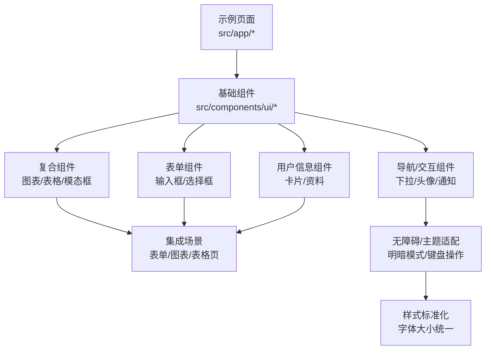

## 详细组件分析

### 按钮 Button
- 功能概述：提供统一的按钮交互与视觉风格，支持尺寸、外观、图标、禁用状态。
- 关键属性
  - children：按钮内容
  - type：button | submit | reset
  - size：sm | md
  - variant：primary | outline
  - startIcon/endIcon：前后图标
  - onClick/disabled/className
- 交互行为
  - 支持点击回调与禁用态
  - 尺寸与外观通过内联样式类控制
- 样式定制
  - 可通过 className 扩展或覆盖默认样式
  - 支持暗色模式下的 hover/active 状态
  - **更新** 统一使用text-sm字体大小，提升可读性和一致性
- 无障碍与响应式
  - 原生 button 语义，支持键盘激活
  - 响应式字体与间距

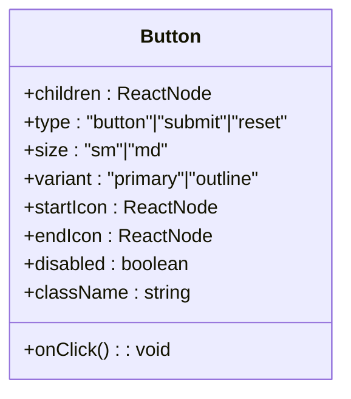

**图表来源**
- [src/components/ui/button/Button.tsx:3-13](file://src/components/ui/button/Button.tsx#L3-L13)

**章节来源**
- [src/components/ui/button/Button.tsx:15-57](file://src/components/ui/button/Button.tsx#L15-L57)

### 徽章 Badge
- 功能概述：用于标记状态、标签或等级，支持多种尺寸、颜色与外观。
- 关键属性
  - variant：light | solid
  - size：sm | md
  - color：primary | success | error | warning | info | light | dark
  - startIcon/endIcon：前后图标
  - children：徽章内容
- 交互行为：静态展示，可配合点击事件使用
- 样式定制：基于 variant/color/size 的组合类名
- 无障碍与响应式：纯展示组件，注意对比度与文本可读性
- **更新** 字体大小标准化：md尺寸使用text-sm，sm尺寸使用text-[10px]，确保视觉层次清晰

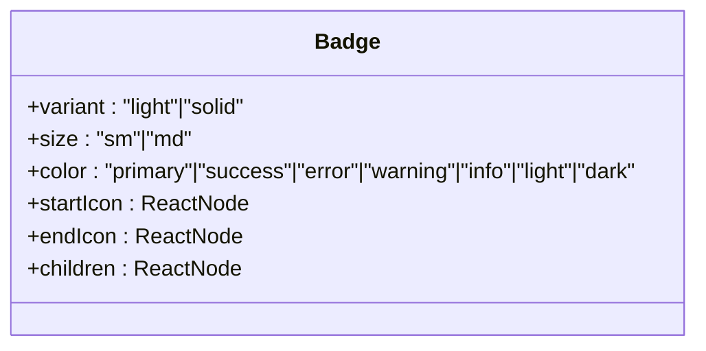

**图表来源**
- [src/components/ui/badge/Badge.tsx:3-21](file://src/components/ui/badge/Badge.tsx#L3-L21)

**章节来源**
- [src/components/ui/badge/Badge.tsx:23-80](file://src/components/ui/badge/Badge.tsx#L23-L80)

### 头像 Avatar
- 功能概述：用户头像展示，支持尺寸与在线/忙碌/离线状态指示。
- 关键属性
  - src：头像图片地址
  - alt：替代文本
  - size：xsmall 到 xxlarge
  - status：online | offline | busy | none
- 交互行为：可结合点击打开详情或设置
- 样式定制：尺寸与状态点大小按比例缩放
- 无障碍与响应式：使用 next/image，具备现代图片优化能力

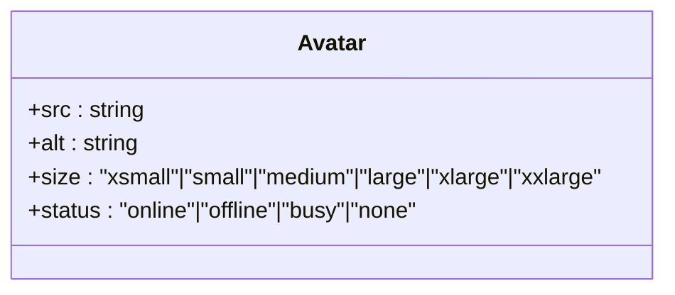

**图表来源**
- [src/components/ui/avatar/Avatar.tsx:4-9](file://src/components/ui/avatar/Avatar.tsx#L4-L9)

**章节来源**
- [src/components/ui/avatar/Avatar.tsx:35-66](file://src/components/ui/avatar/Avatar.tsx#L35-L66)

### 头像文本 AvatarText
- 功能概述：基于用户名生成初始字母头像，使用标准化字体大小。
- 关键属性
  - name：用户名
  - className：自定义样式类
- 交互行为：静态展示，可结合点击事件使用
- 样式定制：基于用户名生成一致的颜色方案，使用text-sm字体大小
- 无障碍与响应式：头像容器使用标准化尺寸，字体大小统一为text-sm

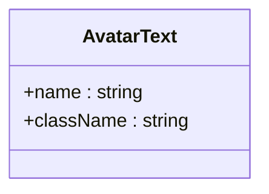

**图表来源**
- [src/components/ui/avatar/AvatarText.tsx:3-6](file://src/components/ui/avatar/AvatarText.tsx#L3-L6)

**章节来源**
- [src/components/ui/avatar/AvatarText.tsx:8-48](file://src/components/ui/avatar/AvatarText.tsx#L8-L48)

### 提示 Alert
- 功能概述：用于展示成功/错误/警告/信息类提示，可选"了解更多"链接。
- 关键属性
  - variant：success | error | warning | info
  - title/message：标题与正文
  - showLink/linkHref/linkText：链接显示与文案
- 交互行为：可点击链接跳转
- 样式定制：基于 variant 的容器与图标颜色类
- 无障碍与响应式：语义化标题与段落，支持暗色模式

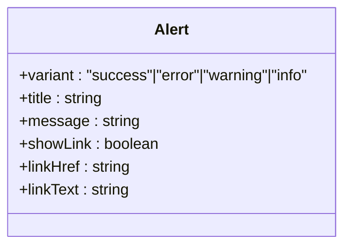

**图表来源**
- [src/components/ui/alert/Alert.tsx:4-11](file://src/components/ui/alert/Alert.tsx#L4-L11)

**章节来源**
- [src/components/ui/alert/Alert.tsx:13-146](file://src/components/ui/alert/Alert.tsx#L13-L146)

### 模态框 Modal
- 功能概述：弹出式对话框，支持全屏/非全屏、关闭按钮、Esc 关闭、点击遮罩关闭。
- 关键属性
  - isOpen/onClose：开关与回调
  - className：自定义样式
  - children：模态框内容
  - showCloseButton：是否显示关闭按钮
  - isFullscreen：是否全屏
- 交互行为
  - Esc 键关闭
  - 点击背景关闭（非全屏）
  - 点击模态框内部不关闭
- 样式定制：全屏与非全屏两类布局类
- 无障碍与响应式：body 滚动锁定，z-index 管理

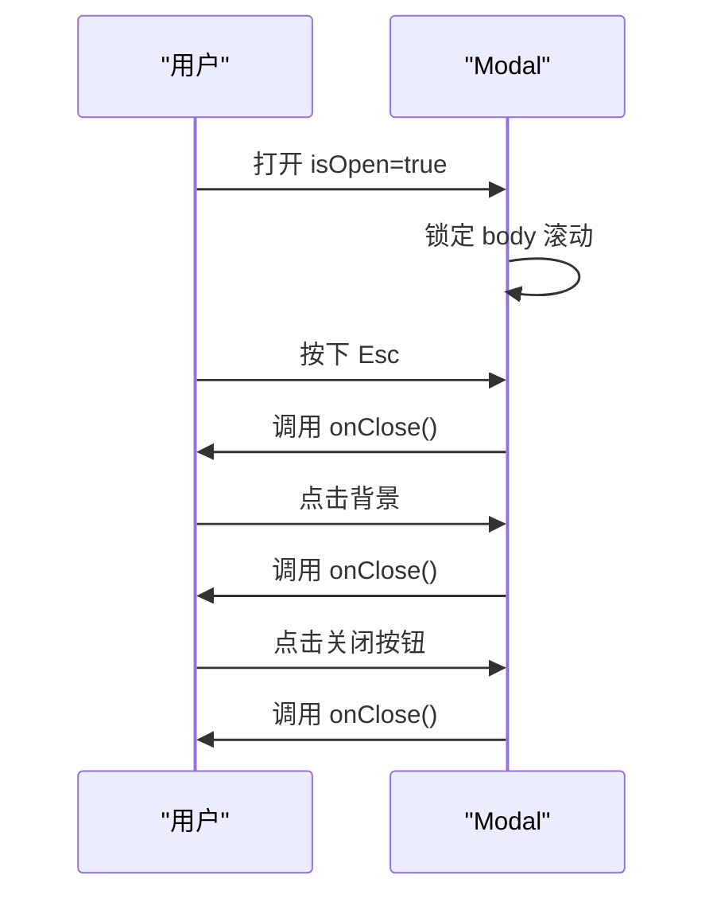

**图表来源**
- [src/components/ui/modal/index.tsx:23-49](file://src/components/ui/modal/index.tsx#L23-L49)

**章节来源**
- [src/components/ui/modal/index.tsx:13-96](file://src/components/ui/modal/index.tsx#L13-L96)

### 下拉菜单 Dropdown
- 功能概述：从右上角弹出的菜单容器，支持外部点击关闭。
- 关键属性
  - isOpen/onClose：开关与回调
  - children：菜单项
  - className：自定义样式
- 交互行为：点击外部区域自动关闭
- 样式定制：阴影、边框、圆角与明暗主题
- 无障碍与响应式：需配合触发器的 aria-* 属性

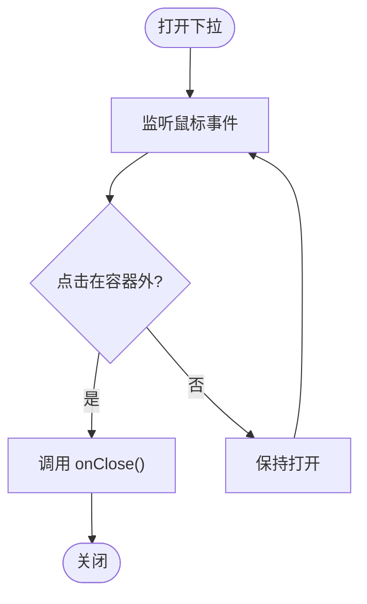

**图表来源**
- [src/components/ui/dropdown/Dropdown.tsx:20-35](file://src/components/ui/dropdown/Dropdown.tsx#L20-L35)

**章节来源**
- [src/components/ui/dropdown/Dropdown.tsx:12-49](file://src/components/ui/dropdown/Dropdown.tsx#L12-L49)

### 表格 Table
- 功能概述：提供 Table、TableHeader、TableBody、TableRow、TableCell 的组合，简化表格构建。
- 关键属性
  - Table/TableHeader/TableBody：容器 props
  - TableRow：行容器
  - TableCell：单元格，支持 isHeader 切换 th/td
- 交互行为：纯展示，可配合排序/分页等逻辑使用
- 样式定制：默认提供基础内边距与字号，可通过 className 扩展
- 无障碍与响应式：建议配合 caption、scope 等语义化属性

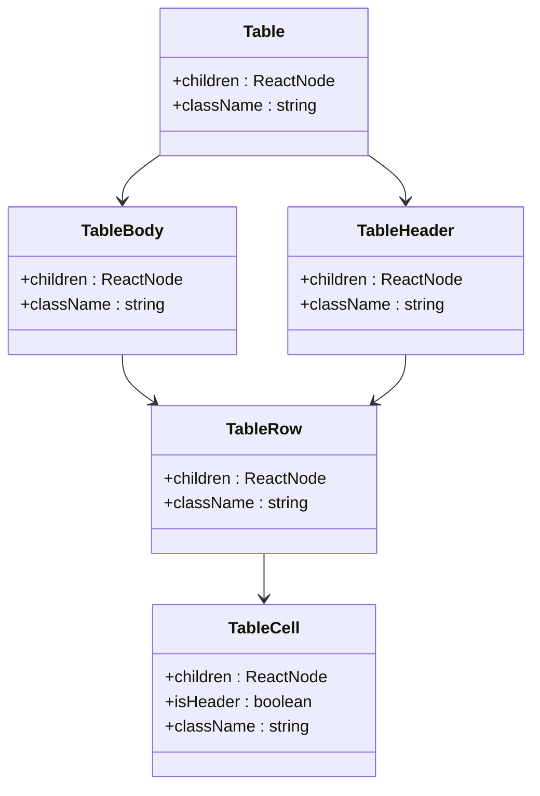

**图表来源**
- [src/components/ui/table/index.tsx:4-32](file://src/components/ui/table/index.tsx#L4-L32)

**章节来源**
- [src/components/ui/table/index.tsx:34-67](file://src/components/ui/table/index.tsx#L34-L67)

### 视频嵌入 YoutubeEmbed
- 功能概述：嵌入 YouTube 视频，支持多种宽高比与标题。
- 关键属性
  - videoId：视频 ID
  - aspectRatio：16:9 | 4:3 | 21:9 | 1:1
  - title：iframe 标题
  - className：自定义样式
- 交互行为：iframe 内部播放控制
- 样式定制：基于 Tailwind aspect 类与圆角
- 无障碍与响应式：提供标题，建议在父容器中控制可访问性

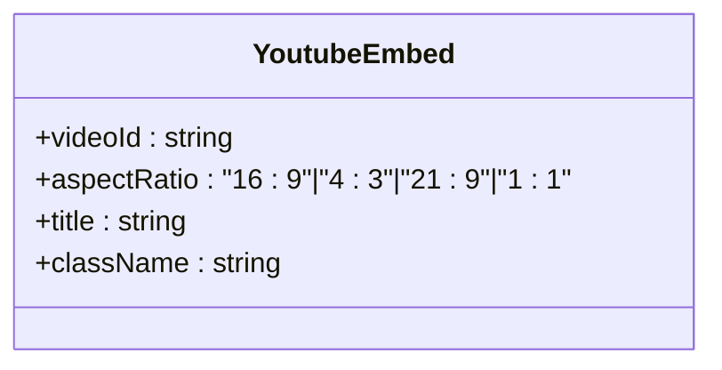

**图表来源**
- [src/components/ui/video/YoutubeEmbed.tsx:5-10](file://src/components/ui/video/YoutubeEmbed.tsx#L5-L10)

**章节来源**
- [src/components/ui/video/YoutubeEmbed.tsx:12-42](file://src/components/ui/video/YoutubeEmbed.tsx#L12-L42)

### 通知 Toaster
- 功能概述：全局通知展示，基于 sonner，自动适配明/暗主题。
- 关键属性
  - 继承自 Sonner 的配置，通过 classNames 自定义 toast、描述、动作按钮等
  - 主题由 next-themes 提供
- 交互行为：自动消失、手动关闭、点击动作按钮
- 样式定制：通过 toastOptions.classNames 定制
- 无障碍与响应式：遵循浏览器通知最佳实践

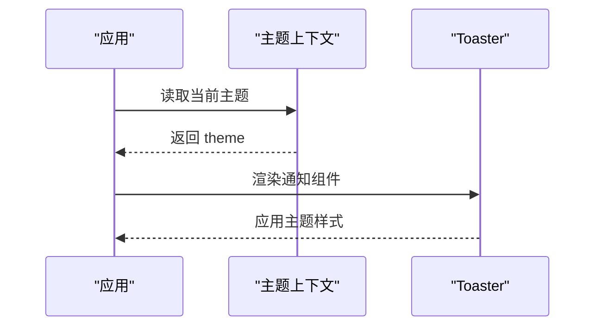

**图表来源**
- [src/components/ui/sonner.tsx:8-29](file://src/components/ui/sonner.tsx#L8-L29)

**章节来源**
- [src/components/ui/sonner.tsx:8-32](file://src/components/ui/sonner.tsx#L8-L32)

### 基础按钮（Base UI ButtonPrimitive）
- 功能概述：基于 @base-ui/react-button 与 class-variance-authority 的变体系统，提供更丰富的尺寸与外观。
- 关键属性
  - variant：default | outline | secondary | ghost | destructive | link
  - size：default | xs | sm | lg | icon | icon-xs | icon-sm | icon-lg
  - className：扩展类名
- 交互行为：原生按钮语义，支持焦点可见性与禁用态
- 样式定制：通过变体与尺寸类组合，支持 slot/data-* 扩展
- 无障碍与响应式：内置焦点环与禁用态处理
- **更新** 字体大小标准化：所有尺寸统一使用text-sm，确保视觉一致性

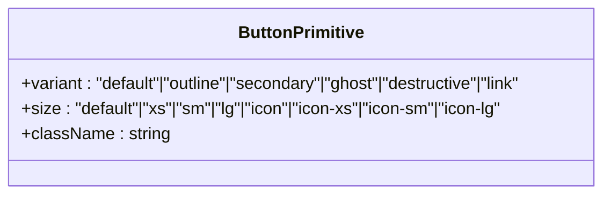

**图表来源**
- [src/components/ui/button.tsx:43-56](file://src/components/ui/button.tsx#L43-L56)

**章节来源**
- [src/components/ui/button.tsx:6-58](file://src/components/ui/button.tsx#L6-L58)

### 输入框 InputField
- 功能概述：支持多种输入类型的表单控件，提供状态反馈与提示文本。
- 关键属性
  - type：text | number | email | password | date | time | string
  - id/name：表单标识
  - placeholder/value：占位符与值
  - onChange：值变化回调
  - className：自定义样式
  - disabled：禁用状态
  - success/error：状态反馈
  - hint：提示文本
- 交互行为：原生输入行为，支持各种输入类型
- 样式定制：基于状态动态生成样式类，统一使用text-sm字体大小
- 无障碍与响应式：支持键盘操作与屏幕阅读器

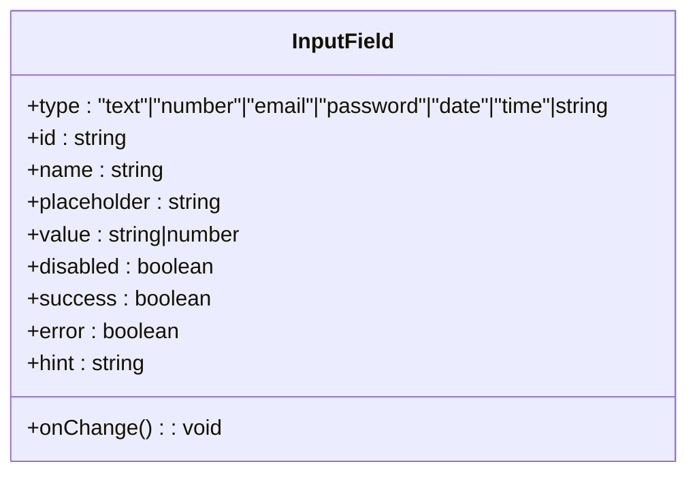

**图表来源**
- [src/components/form/input/InputField.tsx:3-19](file://src/components/form/input/InputField.tsx#L3-L19)

**章节来源**
- [src/components/form/input/InputField.tsx:21-87](file://src/components/form/input/InputField.tsx#L21-L87)

### 选择框 Select
- 功能概述：下拉选择组件，支持选项列表与状态反馈。
- 关键属性
  - options：选项数组
  - placeholder：占位符文本
  - onChange：值变化回调
  - className：自定义样式
  - value/defaultValue：当前值与默认值
  - disabled：禁用状态
- 交互行为：下拉展开选择，支持键盘导航
- 样式定制：基于状态动态生成样式类，统一使用text-sm字体大小
- 无障碍与响应式：支持键盘操作与屏幕阅读器

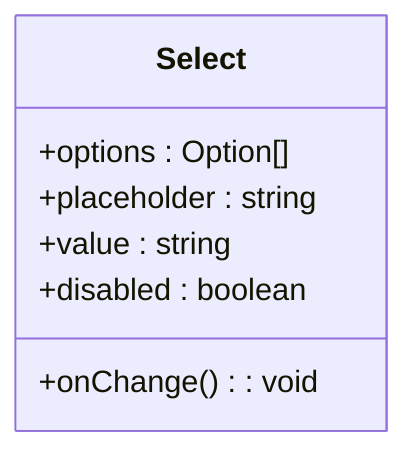

**图表来源**
- [src/components/form/Select.tsx:8-16](file://src/components/form/Select.tsx#L8-L16)

**章节来源**
- [src/components/form/Select.tsx:18-64](file://src/components/form/Select.tsx#L18-L64)

### 用户信息卡片 UserInfoCard
- 功能概述：展示用户个人信息的卡片组件，支持编辑功能。
- 关键属性：无特定属性，通过内部状态管理
- 交互行为：点击编辑按钮打开模态框，支持保存与取消
- 样式定制：使用标准化的text-sm字体大小，确保信息层级清晰
- 无障碍与响应式：响应式布局，支持移动端适配

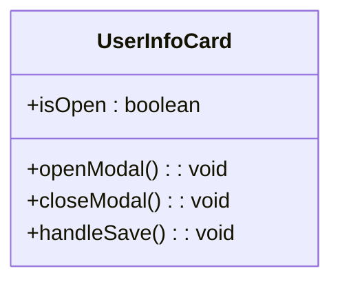

**图表来源**
- [src/components/user-profile/UserInfoCard.tsx:9-15](file://src/components/user-profile/UserInfoCard.tsx#L9-L15)

**章节来源**
- [src/components/user-profile/UserInfoCard.tsx:16-190](file://src/components/user-profile/UserInfoCard.tsx#L16-L190)

### 用户地址卡片 UserAddressCard
- 功能概述：展示用户地址信息的卡片组件，支持编辑功能。
- 关键属性：无特定属性，通过内部状态管理
- 交互行为：点击编辑按钮打开模态框，支持保存与取消
- 样式定制：使用标准化的text-sm字体大小，确保信息层级清晰
- 无障碍与响应式：响应式布局，支持移动端适配

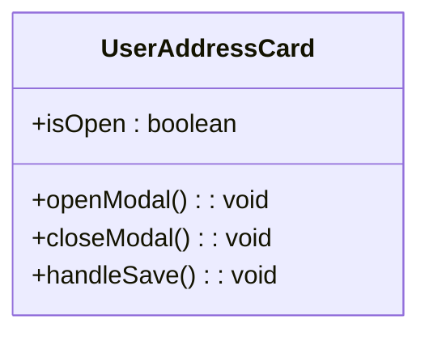

**图表来源**
- [src/components/user-profile/UserAddressCard.tsx:9-15](file://src/components/user-profile/UserAddressCard.tsx#L9-L15)

**章节来源**
- [src/components/user-profile/UserAddressCard.tsx:16-135](file://src/components/user-profile/UserAddressCard.tsx#L16-L135)

## 依赖关系分析
- 组件间耦合度低，均以 props 输入与事件输出为主
- 示例页面与组件库解耦，通过导入组件进行使用
- 通知组件依赖主题上下文，实现明暗模式切换
- 模态框与下拉菜单依赖 DOM 事件与 body 滚动控制
- **更新** 所有表单组件统一依赖全局字体大小标准化系统

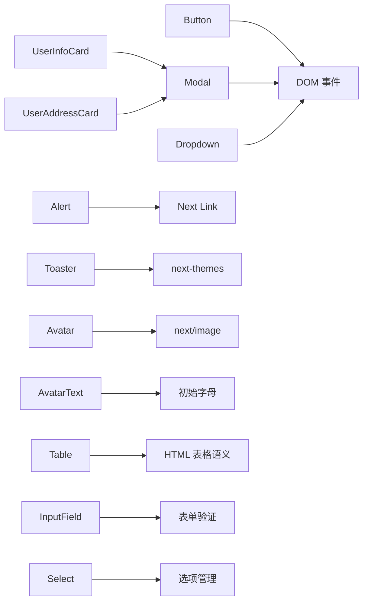

**图表来源**
- [src/components/ui/modal/index.tsx:23-49](file://src/components/ui/modal/index.tsx#L23-L49)
- [src/components/ui/dropdown/Dropdown.tsx:20-35](file://src/components/ui/dropdown/Dropdown.tsx#L20-L35)
- [src/components/ui/alert/Alert.tsx:13-20](file://src/components/ui/alert/Alert.tsx#L13-L20)
- [src/components/ui/sonner.tsx:8-29](file://src/components/ui/sonner.tsx#L8-L29)
- [src/components/ui/avatar/Avatar.tsx:44-51](file://src/components/ui/avatar/Avatar.tsx#L44-L51)
- [src/components/ui/table/index.tsx:35-64](file://src/components/ui/table/index.tsx#L35-L64)
- [src/components/form/input/InputField.tsx:38-50](file://src/components/form/input/InputField.tsx#L38-L50)
- [src/components/form/Select.tsx:34-37](file://src/components/form/Select.tsx#L34-L37)
- [src/components/user-profile/UserInfoCard.tsx:10-15](file://src/components/user-profile/UserInfoCard.tsx#L10-L15)
- [src/components/user-profile/UserAddressCard.tsx:10-15](file://src/components/user-profile/UserAddressCard.tsx#L10-L15)

**章节来源**
- [src/components/ui/modal/index.tsx:1-96](file://src/components/ui/modal/index.tsx#L1-L96)
- [src/components/ui/dropdown/Dropdown.tsx:1-49](file://src/components/ui/dropdown/Dropdown.tsx#L1-L49)
- [src/components/ui/alert/Alert.tsx:1-146](file://src/components/ui/alert/Alert.tsx#L1-L146)
- [src/components/ui/sonner.tsx:1-32](file://src/components/ui/sonner.tsx#L1-L32)
- [src/components/ui/avatar/Avatar.tsx:1-66](file://src/components/ui/avatar/Avatar.tsx#L1-L66)
- [src/components/ui/avatar/AvatarText.tsx:1-48](file://src/components/ui/avatar/AvatarText.tsx#L1-L48)
- [src/components/ui/table/index.tsx:1-67](file://src/components/ui/table/index.tsx#L1-L67)
- [src/components/form/input/InputField.tsx:1-87](file://src/components/form/input/InputField.tsx#L1-L87)
- [src/components/form/Select.tsx:1-64](file://src/components/form/Select.tsx#L1-L64)
- [src/components/user-profile/UserInfoCard.tsx:1-190](file://src/components/user-profile/UserInfoCard.tsx#L1-L190)
- [src/components/user-profile/UserAddressCard.tsx:1-135](file://src/components/user-profile/UserAddressCard.tsx#L1-L135)

## 性能考虑
- 图片与媒体：Avatar 使用 next/image，建议在生产环境开启自动优化
- 模态框与下拉菜单：仅在 isOpen/open 时渲染，减少常驻 DOM
- 通知：避免一次性大量弹出，合理设置过期时间
- 表格：大数据量时建议分页或虚拟滚动
- 样式：优先使用原子化类名，减少额外 CSS
- **更新** 字体大小标准化：统一使用text-sm，减少字体大小差异带来的渲染性能问题

## 故障排查指南
- 模态框无法关闭
  - 检查 isOpen 与 onClose 是否正确传递
  - 确认点击事件未被子元素阻止冒泡
  - 参考路径：[src/components/ui/modal/index.tsx:57-95](file://src/components/ui/modal/index.tsx#L57-L95)
- 下拉菜单点击外部不关闭
  - 确保未阻止事件冒泡或未匹配到 .dropdown-toggle
  - 参考路径：[src/components/ui/dropdown/Dropdown.tsx:20-35](file://src/components/ui/dropdown/Dropdown.tsx#L20-L35)
- 头像显示异常
  - 检查 src 与 alt 是否有效
  - 参考路径：[src/components/ui/avatar/Avatar.tsx:44-51](file://src/components/ui/avatar/Avatar.tsx#L44-L51)
- 提示链接无效
  - 检查 showLink、linkHref、linkText 是否正确设置
  - 参考路径：[src/components/ui/alert/Alert.tsx:13-20](file://src/components/ui/alert/Alert.tsx#L13-L20)
- 通知主题不生效
  - 确认 next-themes 已正确初始化
  - 参考路径：[src/components/ui/sonner.tsx:8-29](file://src/components/ui/sonner.tsx#L8-L29)
- **新增** 字体大小显示异常
  - 检查组件是否正确使用text-sm类名
  - 确认全局字体大小变量配置正确
  - 参考路径：[src/app/globals.css:33-36](file://src/app/globals.css#L33-L36)

**章节来源**
- [src/components/ui/modal/index.tsx:57-95](file://src/components/ui/modal/index.tsx#L57-L95)
- [src/components/ui/dropdown/Dropdown.tsx:20-35](file://src/components/ui/dropdown/Dropdown.tsx#L20-L35)
- [src/components/ui/avatar/Avatar.tsx:44-51](file://src/components/ui/avatar/Avatar.tsx#L44-L51)
- [src/components/ui/alert/Alert.tsx:13-20](file://src/components/ui/alert/Alert.tsx#L13-L20)
- [src/components/ui/sonner.tsx:8-29](file://src/components/ui/sonner.tsx#L8-L29)
- [src/app/globals.css:33-36](file://src/app/globals.css#L33-L36)

## 结论
本 UI 组件库以简洁、可组合为核心设计原则，覆盖基础、导航、交互与复合组件，满足管理后台常见场景。通过示例页面与组件 API 的清晰分离，开发者可以快速定位并使用所需组件，同时借助样式定制与无障碍特性，实现一致且高质量的用户体验。

**更新** 最新版本完成了全面的样式标准化改进，特别是字体大小的统一升级，提升了整体视觉一致性和可读性。所有组件都已适配新的字体大小标准，确保在不同设备和主题下都能提供优质的用户体验。

## 附录

### 组件使用示例与页面对照
- 按钮：示例页面位于 [src/app/(admin)/(ui-elements)/buttons/page.tsx](file://src/app/(admin)/(ui-elements)/buttons/page.tsx)
- 徽章：示例页面位于 [src/app/(admin)/(ui-elements)/badge/page.tsx](file://src/app/(admin)/(ui-elements)/badge/page.tsx)
- 头像：示例页面位于 [src/app/(admin)/(ui-elements)/avatars/page.tsx](file://src/app/(admin)/(ui-elements)/avatars/page.tsx)
- 提示：示例页面位于 [src/app/(admin)/(ui-elements)/alerts/page.tsx](file://src/app/(admin)/(ui-elements)/alerts/page.tsx)
- 模态框：示例页面位于 [src/app/(admin)/(ui-elements)/modals/page.tsx](file://src/app/(admin)/(ui-elements)/modals/page.tsx)
- 视频：示例页面位于 [src/app/(admin)/(ui-elements)/videos/page.tsx](file://src/app/(admin)/(ui-elements)/videos/page.tsx)
- 表单元素：示例页面位于 [src/app/(admin)/(others-pages)/(forms)/form-elements/page.tsx](file://src/app/(admin)/(others-pages)/(forms)/form-elements/page.tsx)
- 图表：柱状图 [src/app/(admin)/(others-pages)/(chart)/bar-chart/page.tsx](file://src/app/(admin)/(others-pages)/(chart)/bar-chart/page.tsx)，折线图 [src/app/(admin)/(others-pages)/(chart)/line-chart/page.tsx](file://src/app/(admin)/(others-pages)/(chart)/line-chart/page.tsx)
- 表格：基础表格 [src/app/(admin)/(others-pages)/(tables)/basic-tables/page.tsx](file://src/app/(admin)/(others-pages)/(tables)/basic-tables/page.tsx)
- **新增** 用户信息：用户信息卡片 [src/components/user-profile/UserInfoCard.tsx](file://src/components/user-profile/UserInfoCard.tsx)
- **新增** 用户地址：用户地址卡片 [src/components/user-profile/UserAddressCard.tsx](file://src/components/user-profile/UserAddressCard.tsx)

### 样式标准化改进详情
- **字体大小统一**：所有组件统一使用text-sm字体大小，提升视觉一致性
- **Select组件**：从text-xs升级到text-sm，改善可读性
- **InputField组件**：统一使用text-sm，确保输入体验一致性
- **Button组件**：统一使用text-sm，提升按钮内容可读性
- **Badge组件**：md尺寸使用text-sm，sm尺寸使用text-[10px]，保持视觉层次
- **userInfoCard组件**：统一使用text-sm，确保信息层级清晰
- **userAddressCard组件**：统一使用text-sm，提升地址信息可读性
- **AvatarText组件**：使用标准化的text-sm字体大小

**章节来源**
- [src/app/(admin)/(ui-elements)/buttons/page.tsx](file://src/app/(admin)/(ui-elements)/buttons/page.tsx)
- [src/app/(admin)/(ui-elements)/badge/page.tsx](file://src/app/(admin)/(ui-elements)/badge/page.tsx)
- [src/app/(admin)/(ui-elements)/avatars/page.tsx](file://src/app/(admin)/(ui-elements)/avatars/page.tsx)
- [src/app/(admin)/(ui-elements)/alerts/page.tsx](file://src/app/(admin)/(ui-elements)/alerts/page.tsx)
- [src/app/(admin)/(ui-elements)/modals/page.tsx](file://src/app/(admin)/(ui-elements)/modals/page.tsx)
- [src/app/(admin)/(ui-elements)/videos/page.tsx](file://src/app/(admin)/(ui-elements)/videos/page.tsx)
- [src/app/(admin)/(others-pages)/(forms)/form-elements/page.tsx](file://src/app/(admin)/(others-pages)/(forms)/form-elements/page.tsx)
- [src/app/(admin)/(others-pages)/(chart)/bar-chart/page.tsx](file://src/app/(admin)/(others-pages)/(chart)/bar-chart/page.tsx)
- [src/app/(admin)/(others-pages)/(chart)/line-chart/page.tsx](file://src/app/(admin)/(others-pages)/(chart)/line-chart/page.tsx)
- [src/app/(admin)/(others-pages)/(tables)/basic-tables/page.tsx](file://src/app/(admin)/(others-pages)/(tables)/basic-tables/page.tsx)
- [src/components/user-profile/UserInfoCard.tsx:1-190](file://src/components/user-profile/UserInfoCard.tsx#L1-L190)
- [src/components/user-profile/UserAddressCard.tsx:1-135](file://src/components/user-profile/UserAddressCard.tsx#L1-L135)
- [src/app/globals.css:33-36](file://src/app/globals.css#L33-L36)