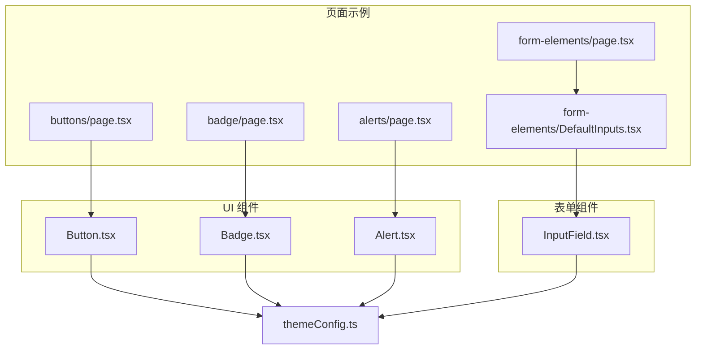
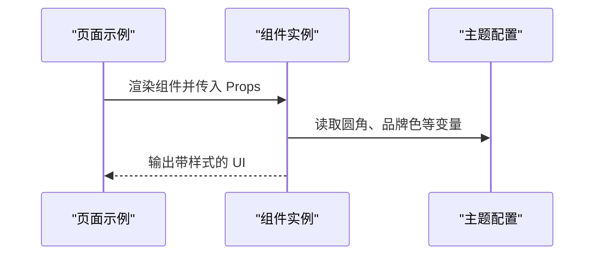
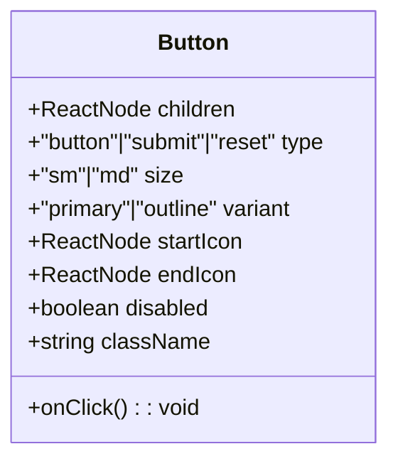
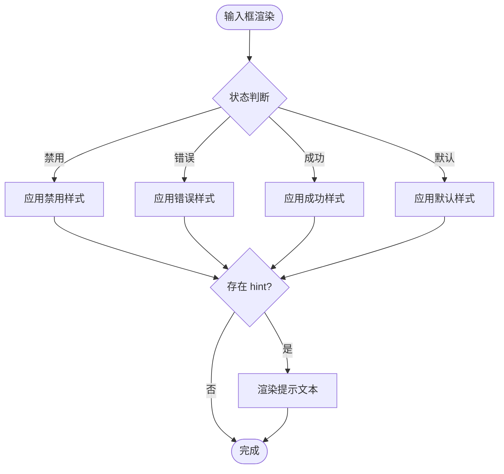
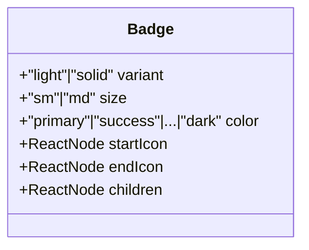
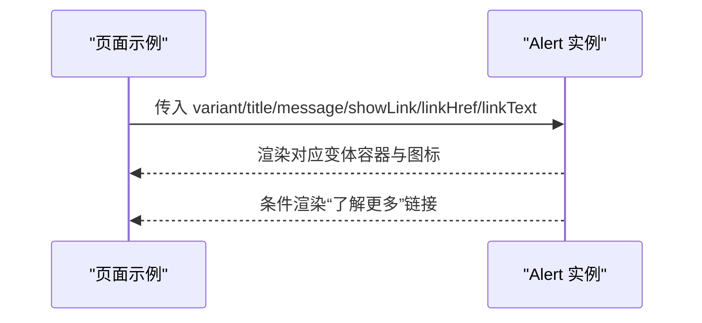
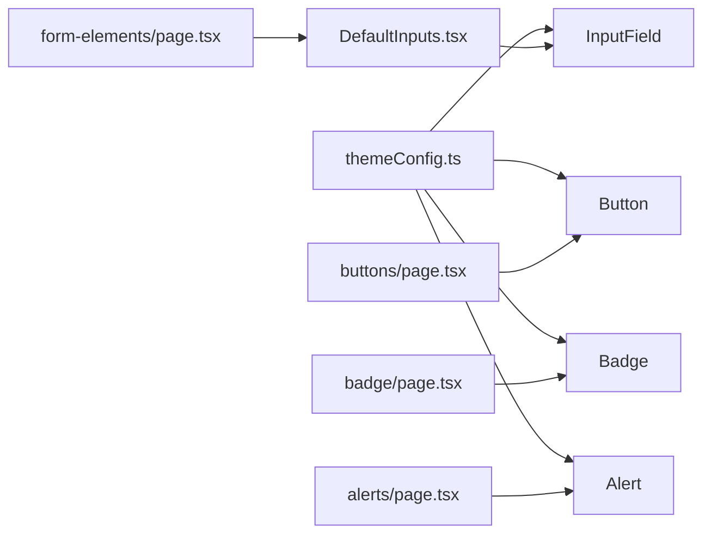

# 基础组件

<cite>
**本文引用的文件**
- [src/components/ui/button/Button.tsx](file://src/components/ui/button/Button.tsx)
- [src/components/ui/badge/Badge.tsx](file://src/components/ui/badge/Badge.tsx)
- [src/components/form/input/InputField.tsx](file://src/components/form/input/InputField.tsx)
- [src/components/ui/alert/Alert.tsx](file://src/components/ui/alert/Alert.tsx)
- [src/app/(admin)/(ui-elements)/buttons/page.tsx](file://src/app/(admin)/(ui-elements)/buttons/page.tsx)
- [src/app/(admin)/(ui-elements)/badge/page.tsx](file://src/app/(admin)/(ui-elements)/badge/page.tsx)
- [src/app/(admin)/(ui-elements)/alerts/page.tsx](file://src/app/(admin)/(ui-elements)/alerts/page.tsx)
- [src/app/(admin)/(others-pages)/(forms)/form-elements/page.tsx](file://src/app/(admin)/(others-pages)/(forms)/form-elements/page.tsx)
- [src/components/form/form-elements/DefaultInputs.tsx](file://src/components/form/form-elements/DefaultInputs.tsx)
- [src/config/themeConfig.ts](file://src/config/themeConfig.ts)
</cite>

## 目录
1. [简介](#简介)
2. [项目结构](#项目结构)
3. [核心组件](#核心组件)
4. [架构总览](#架构总览)
5. [详细组件分析](#详细组件分析)
6. [依赖关系分析](#依赖关系分析)
7. [性能考虑](#性能考虑)
8. [故障排查指南](#故障排查指南)
9. [结论](#结论)
10. [附录](#附录)

## 简介
本文件系统性地梳理并文档化本仓库中的基础 UI 组件：按钮（Button）、输入框（InputField）、徽章（Badge）与提示（Alert）。内容覆盖各组件的 TypeScript 接口定义、Props 说明、使用示例、样式定制、响应式行为、无障碍支持与性能优化建议。所有说明均基于仓库中实际实现与页面示例进行总结。

## 项目结构
基础组件位于 src/components/ui 与 src/components/form/input 下，页面示例位于 src/app/(admin)/(ui-elements) 与表单示例页中。整体采用按功能域分层组织：组件实现与页面示例分离，便于复用与维护。

图表来源
- [src/components/ui/button/Button.tsx:1-57](file://src/components/ui/button/Button.tsx#L1-L57)
- [src/components/ui/badge/Badge.tsx:1-80](file://src/components/ui/badge/Badge.tsx#L1-L80)
- [src/components/ui/alert/Alert.tsx:1-146](file://src/components/ui/alert/Alert.tsx#L1-L146)
- [src/components/form/input/InputField.tsx:1-87](file://src/components/form/input/InputField.tsx#L1-L87)
- [src/app/(admin)/(ui-elements)/buttons/page.tsx](file://src/app/(admin)/(ui-elements)/buttons/page.tsx#L1-L90)
- [src/app/(admin)/(ui-elements)/badge/page.tsx](file://src/app/(admin)/(ui-elements)/badge/page.tsx#L1-L222)
- [src/app/(admin)/(ui-elements)/alerts/page.tsx](file://src/app/(admin)/(ui-elements)/alerts/page.tsx#L1-L87)
- [src/app/(admin)/(others-pages)/(forms)/form-elements/page.tsx](file://src/app/(admin)/(others-pages)/(forms)/form-elements/page.tsx#L1-L44)
- [src/components/form/form-elements/DefaultInputs.tsx:1-121](file://src/components/form/form-elements/DefaultInputs.tsx#L1-L121)
- [src/config/themeConfig.ts:1-31](file://src/config/themeConfig.ts#L1-L31)

章节来源
- [src/app/(admin)/(ui-elements)/buttons/page.tsx](file://src/app/(admin)/(ui-elements)/buttons/page.tsx#L1-L90)
- [src/app/(admin)/(ui-elements)/badge/page.tsx](file://src/app/(admin)/(ui-elements)/badge/page.tsx#L1-L222)
- [src/app/(admin)/(ui-elements)/alerts/page.tsx](file://src/app/(admin)/(ui-elements)/alerts/page.tsx#L1-L87)
- [src/app/(admin)/(others-pages)/(forms)/form-elements/page.tsx](file://src/app/(admin)/(others-pages)/(forms)/form-elements/page.tsx#L1-L44)
- [src/components/form/form-elements/DefaultInputs.tsx:1-121](file://src/components/form/form-elements/DefaultInputs.tsx#L1-L121)

## 核心组件
本节对四个基础组件的接口、能力边界与典型用法进行概览，便于快速查阅与集成。

- 按钮（Button）
  - 支持尺寸：小（sm）、中（md）
  - 变体：主按钮（primary）、描边（outline）
  - 图标：起始图标（startIcon）、结束图标（endIcon）
  - 状态：禁用（disabled）、点击回调（onClick）
  - 类名扩展：className
  - 其他：type（button|submit|reset）

- 输入框（InputField）
  - 基础：type、id、name、placeholder、value/defaultValue、onChange、className
  - 范围与步进：min、max、step
  - 状态：disabled、success、error、hint（辅助提示文本）
  - 样式随状态变化：禁用、错误、成功、默认

- 徽章（Badge）
  - 变体：浅色背景（light）、实心（solid）
  - 尺寸：小（sm）、中（md）
  - 颜色：primary、success、error、warning、info、light、dark
  - 图标：startIcon、endIcon
  - 内容：children

- 提示（Alert）
  - 变体：success、error、warning、info
  - 结构：title、message
  - 行为：可选“了解更多”链接（showLink、linkHref、linkText）

章节来源
- [src/components/ui/button/Button.tsx:3-13](file://src/components/ui/button/Button.tsx#L3-L13)
- [src/components/form/input/InputField.tsx:3-19](file://src/components/form/input/InputField.tsx#L3-L19)
- [src/components/ui/badge/Badge.tsx:14-21](file://src/components/ui/badge/Badge.tsx#L14-L21)
- [src/components/ui/alert/Alert.tsx:4-11](file://src/components/ui/alert/Alert.tsx#L4-L11)

## 架构总览
下图展示页面示例如何组合基础组件，并通过全局主题配置统一风格。

图表来源
- [src/app/(admin)/(ui-elements)/buttons/page.tsx](file://src/app/(admin)/(ui-elements)/buttons/page.tsx#L14-L89)
- [src/app/(admin)/(ui-elements)/badge/page.tsx](file://src/app/(admin)/(ui-elements)/badge/page.tsx#L14-L221)
- [src/app/(admin)/(ui-elements)/alerts/page.tsx](file://src/app/(admin)/(ui-elements)/alerts/page.tsx#L14-L86)
- [src/config/themeConfig.ts:20-30](file://src/config/themeConfig.ts#L20-L30)

## 详细组件分析

### 按钮（Button）组件
- 接口与 Props
  - children: ReactNode
  - type?: "button" | "submit" | "reset"
  - size?: "sm" | "md"
  - variant?: "primary" | "outline"
  - startIcon?: ReactNode
  - endIcon?: ReactNode
  - onClick?: () => void
  - disabled?: boolean
  - className?: string

- 样式与状态
  - 尺寸类：sm、md 对应内边距与字号
  - 变体类：primary、outline 的前景、背景、边框与悬停态
  - 禁用态：禁用指针与半透明
  - 圆角：使用 CSS 变量 --border-radius-base
  - 暗色模式：通过暗色类适配

- 使用示例（页面示例）
  - 主按钮（含左右图标与不同尺寸）
  - 描边按钮（含左右图标与不同尺寸）

- 响应式与无障碍
  - 响应式：Flex 布局与 gap 控制间距；在页面示例中以容器与间距类实现响应式布局
  - 无障碍：按钮原生 type 与 disabled 属性确保可访问性

- 性能优化建议
  - 合理传递 startIcon/endIcon，避免重复渲染大组件
  - 使用 className 扩展而非内联样式，减少重排

图表来源
- [src/components/ui/button/Button.tsx:3-13](file://src/components/ui/button/Button.tsx#L3-L13)

章节来源
- [src/components/ui/button/Button.tsx:15-57](file://src/components/ui/button/Button.tsx#L15-L57)
- [src/app/(admin)/(ui-elements)/buttons/page.tsx](file://src/app/(admin)/(ui-elements)/buttons/page.tsx#L19-L85)

### 输入框（InputField）组件
- 接口与 Props
  - type?: "text" | "number" | "email" | "password" | "date" | "time" | string
  - id?: string
  - name?: string
  - placeholder?: string
  - value?: string | number
  - defaultValue?: string | number
  - onChange?: (e: React.ChangeEvent<HTMLInputElement>) => void
  - className?: string
  - min?: string
  - max?: string
  - step?: number
  - disabled?: boolean
  - success?: boolean
  - error?: boolean
  - hint?: string

- 状态与样式
  - 默认：浅色/深色模式下的边框与聚焦环
  - 成功：success 颜色系边框与聚焦环
  - 错误：error 颜色系边框与聚焦环
  - 禁用：禁用态文字与边框颜色

- 辅助提示
  - hint 文本在输入框下方显示，颜色随状态变化

- 使用示例（页面示例）
  - 表单元素页包含多种输入形态与交互（如密码显隐、时间选择器、支付卡号输入前置图标）

- 响应式与无障碍
  - 响应式：容器网格布局在页面示例中实现多列自适应
  - 无障碍：原生 input 属性、label 关联、占位符与值绑定

- 性能优化建议
  - 将 onChange 逻辑外置，避免在渲染期间创建新函数
  - 在受控场景仅在必要时更新 value

图表来源
- [src/components/form/input/InputField.tsx:38-50](file://src/components/form/input/InputField.tsx#L38-L50)
- [src/components/form/input/InputField.tsx:69-81](file://src/components/form/input/InputField.tsx#L69-L81)

章节来源
- [src/components/form/input/InputField.tsx:21-87](file://src/components/form/input/InputField.tsx#L21-L87)
- [src/app/(admin)/(others-pages)/(forms)/form-elements/page.tsx](file://src/app/(admin)/(others-pages)/(forms)/form-elements/page.tsx#L21-L43)
- [src/components/form/form-elements/DefaultInputs.tsx:10-120](file://src/components/form/form-elements/DefaultInputs.tsx#L10-L120)

### 徽章（Badge）组件
- 接口与 Props
  - variant?: "light" | "solid"
  - size?: "sm" | "md"
  - color?: "primary" | "success" | "error" | "warning" | "info" | "light" | "dark"
  - startIcon?: React.ReactNode
  - endIcon?: React.ReactNode
  - children: React.ReactNode

- 样式与变体
  - 基础：居中对齐、内边距、圆角、字体大小
  - 尺寸：sm、md 字号与内边距差异
  - 颜色：light 与 solid 两套调色方案，覆盖七种语义色
  - 图标：左右图标间距控制

- 使用示例（页面示例）
  - 展示 light/solid 两种变体与全部颜色的组合
  - 左右图标徽章示例

- 响应式与无障碍
  - 响应式：Flex 自动换行与居中对齐
  - 无障碍：纯装饰性徽章，无需额外 ARIA

- 性能优化建议
  - 复用图标组件，避免重复渲染
  - 合理使用 children，避免过长文本导致布局抖动

图表来源
- [src/components/ui/badge/Badge.tsx:14-21](file://src/components/ui/badge/Badge.tsx#L14-L21)

章节来源
- [src/components/ui/badge/Badge.tsx:23-79](file://src/components/ui/badge/Badge.tsx#L23-L79)
- [src/app/(admin)/(ui-elements)/badge/page.tsx](file://src/app/(admin)/(ui-elements)/badge/page.tsx#L18-L218)

### 提示（Alert）组件
- 接口与 Props
  - variant: "success" | "error" | "warning" | "info"
  - title: string
  - message: string
  - showLink?: boolean
  - linkHref?: string
  - linkText?: string

- 视觉与行为
  - 每个变体拥有独立容器边框与背景色
  - 对应图标与强调色
  - 可选“了解更多”链接，支持自定义链接文案与地址

- 使用示例（页面示例）
  - 展示四种变体的标题与消息，部分示例隐藏链接

- 响应式与无障碍
  - 响应式：Flex 布局与间距类保证在窄屏下仍可阅读
  - 无障碍：标题与段落语义明确，适合屏幕阅读器

- 性能优化建议
  - 链接组件按需渲染（showLink=false 时不渲染）
  - 变体样式集中管理，避免重复计算

图表来源
- [src/components/ui/alert/Alert.tsx:13-143](file://src/components/ui/alert/Alert.tsx#L13-L143)
- [src/app/(admin)/(ui-elements)/alerts/page.tsx](file://src/app/(admin)/(ui-elements)/alerts/page.tsx#L19-L82)

章节来源
- [src/components/ui/alert/Alert.tsx:13-146](file://src/components/ui/alert/Alert.tsx#L13-L146)
- [src/app/(admin)/(ui-elements)/alerts/page.tsx](file://src/app/(admin)/(ui-elements)/alerts/page.tsx#L14-L86)

## 依赖关系分析
- 组件到主题配置
  - Button、Badge、Alert、InputField 均使用圆角与品牌色等主题变量，确保视觉一致性
- 页面示例到组件
  - buttons/page.tsx、badge/page.tsx、alerts/page.tsx 分别演示各组件的多种用法
  - form-elements/page.tsx 与 DefaultInputs.tsx 展示输入框在真实表单中的组合使用

图表来源
- [src/config/themeConfig.ts:20-30](file://src/config/themeConfig.ts#L20-L30)
- [src/app/(admin)/(ui-elements)/buttons/page.tsx](file://src/app/(admin)/(ui-elements)/buttons/page.tsx#L1-L90)
- [src/app/(admin)/(ui-elements)/badge/page.tsx](file://src/app/(admin)/(ui-elements)/badge/page.tsx#L1-L222)
- [src/app/(admin)/(ui-elements)/alerts/page.tsx](file://src/app/(admin)/(ui-elements)/alerts/page.tsx#L1-L87)
- [src/components/form/form-elements/DefaultInputs.tsx:1-121](file://src/components/form/form-elements/DefaultInputs.tsx#L1-L121)
- [src/app/(admin)/(others-pages)/(forms)/form-elements/page.tsx](file://src/app/(admin)/(others-pages)/(forms)/form-elements/page.tsx#L1-L44)

章节来源
- [src/config/themeConfig.ts:1-31](file://src/config/themeConfig.ts#L1-L31)
- [src/app/(admin)/(ui-elements)/buttons/page.tsx](file://src/app/(admin)/(ui-elements)/buttons/page.tsx#L1-L90)
- [src/app/(admin)/(ui-elements)/badge/page.tsx](file://src/app/(admin)/(ui-elements)/badge/page.tsx#L1-L222)
- [src/app/(admin)/(ui-elements)/alerts/page.tsx](file://src/app/(admin)/(ui-elements)/alerts/page.tsx#L1-L87)
- [src/components/form/form-elements/DefaultInputs.tsx:1-121](file://src/components/form/form-elements/DefaultInputs.tsx#L1-L121)
- [src/app/(admin)/(others-pages)/(forms)/form-elements/page.tsx](file://src/app/(admin)/(others-pages)/(forms)/form-elements/page.tsx#L1-L44)

## 性能考虑
- 渲染优化
  - 将图标作为 props 传入，避免在组件内部创建闭包或重复实例化
  - 使用 className 扩展样式，减少内联样式的重排与重绘
- 事件处理
  - 将 onChange、onClick 等回调外置，避免在渲染过程中创建新函数
- 状态管理
  - 输入框在受控场景仅在必要时更新 value，减少不必要的重渲染
- 主题与样式
  - 通过主题配置集中管理圆角、品牌色等变量，降低样式切换成本

## 故障排查指南
- 按钮无法点击或视觉异常
  - 检查 disabled 与 className 是否正确传递
  - 确认变体与尺寸类是否与预期一致
  - 参考：[按钮实现:40-53](file://src/components/ui/button/Button.tsx#L40-L53)
- 输入框状态不生效
  - 确认 success/error/disabled 状态布尔值与 hint 文本是否正确设置
  - 检查容器包裹与样式拼接逻辑
  - 参考：[输入框实现:38-50](file://src/components/form/input/InputField.tsx#L38-L50)
- 徽章颜色或尺寸不正确
  - 校验 variant/size/color 与图标位置参数
  - 参考：[徽章实现:34-68](file://src/components/ui/badge/Badge.tsx#L34-L68)
- 提示链接未显示
  - 确认 showLink=true 且 linkHref/linkText 设置合理
  - 参考：[提示实现:131-138](file://src/components/ui/alert/Alert.tsx#L131-L138)

章节来源
- [src/components/ui/button/Button.tsx:40-53](file://src/components/ui/button/Button.tsx#L40-L53)
- [src/components/form/input/InputField.tsx:38-50](file://src/components/form/input/InputField.tsx#L38-L50)
- [src/components/ui/badge/Badge.tsx:34-68](file://src/components/ui/badge/Badge.tsx#L34-L68)
- [src/components/ui/alert/Alert.tsx:131-138](file://src/components/ui/alert/Alert.tsx#L131-L138)

## 结论
本仓库的基础 UI 组件以简洁的 Props 设计与主题化样式实现，覆盖了按钮、输入框、徽章与提示等常用场景。页面示例清晰展示了各组件的变体与组合用法，配合主题配置实现了统一的视觉语言。遵循本文档的接口说明、使用建议与性能优化策略，可在保证可访问性的前提下高效构建界面。

## 附录
- 使用示例参考路径
  - 按钮：[按钮页面](file://src/app/(admin)/(ui-elements)/buttons/page.tsx#L19-L85)
  - 徽章：[徽章页面](file://src/app/(admin)/(ui-elements)/badge/page.tsx#L26-L215)
  - 提示：[提示页面](file://src/app/(admin)/(ui-elements)/alerts/page.tsx#L19-L82)
  - 输入框：[表单元素页](file://src/app/(admin)/(others-pages)/(forms)/form-elements/page.tsx#L21-L43)、[默认输入示例:20-118](file://src/components/form/form-elements/DefaultInputs.tsx#L20-L118)
- 主题配置参考
  - [主题配置:20-30](file://src/config/themeConfig.ts#L20-L30)