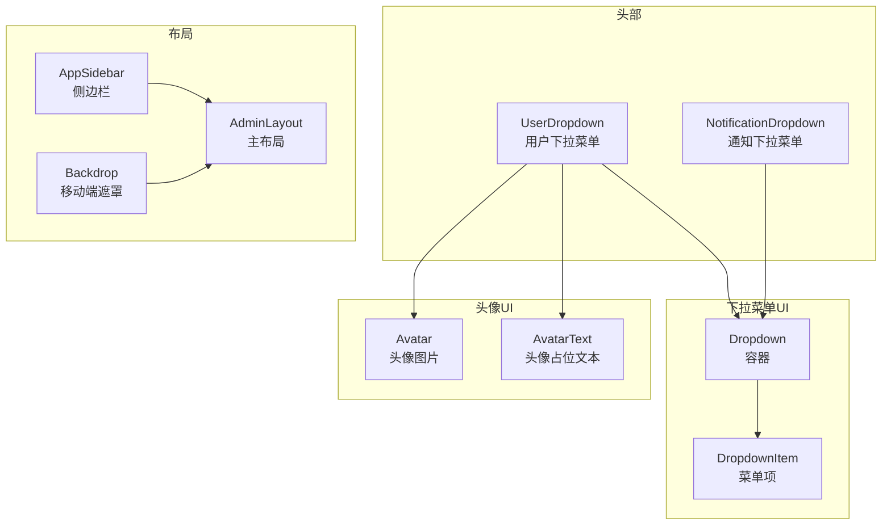
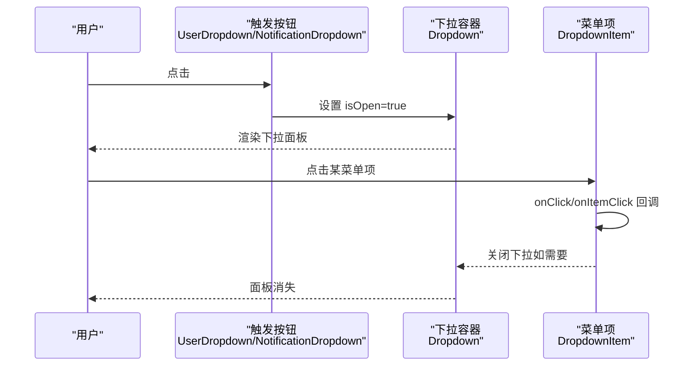
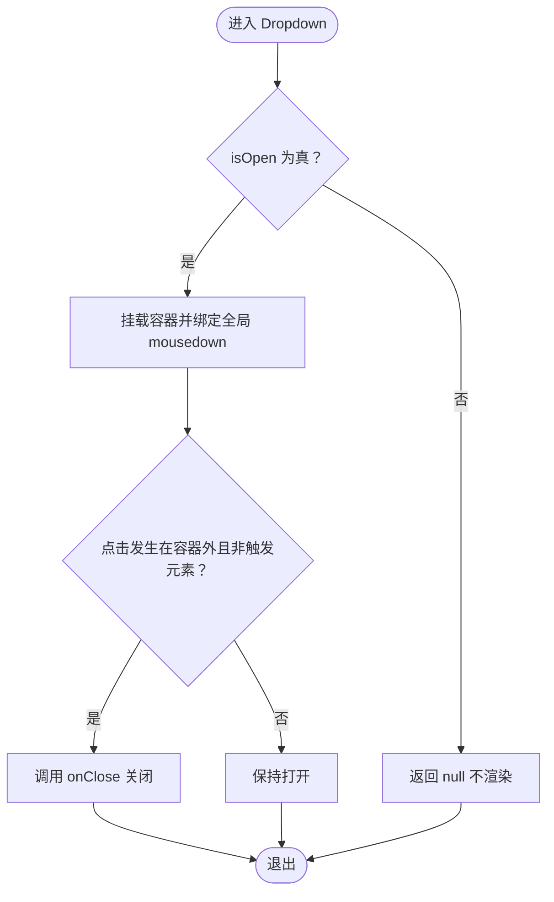
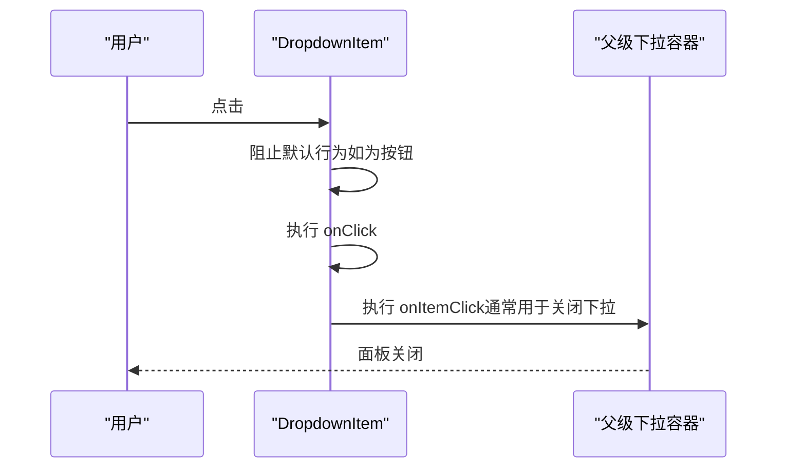
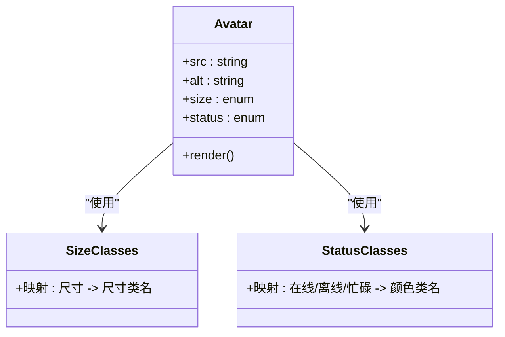
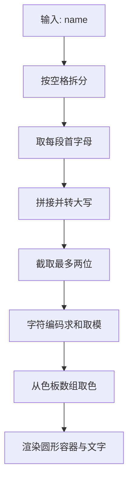
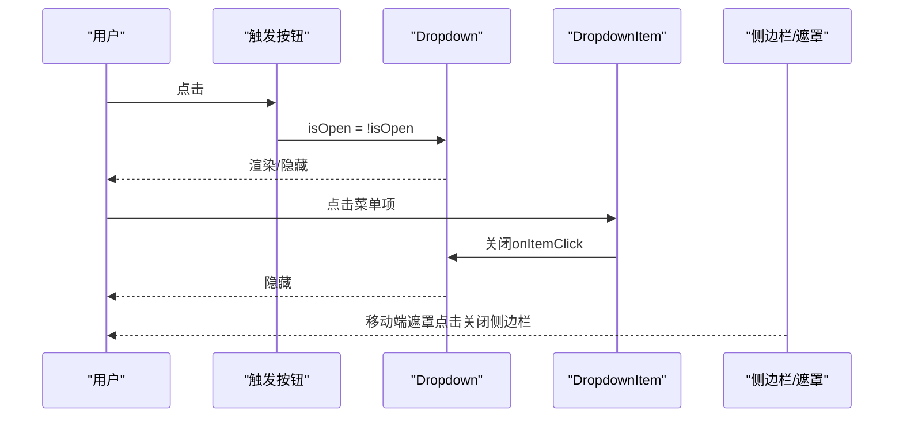
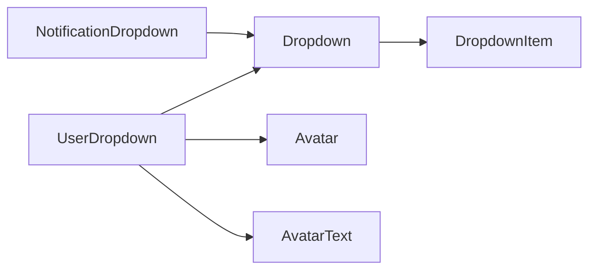

# 导航组件

<cite>
**本文引用的文件**
- [Dropdown.tsx](file://src/components/ui/dropdown/Dropdown.tsx)
- [DropdownItem.tsx](file://src/components/ui/dropdown/DropdownItem.tsx)
- [Avatar.tsx](file://src/components/ui/avatar/Avatar.tsx)
- [AvatarText.tsx](file://src/components/ui/avatar/AvatarText.tsx)
- [UserDropdown.tsx](file://src/components/header/UserDropdown.tsx)
- [NotificationDropdown.tsx](file://src/components/header/NotificationDropdown.tsx)
- [AppSidebar.tsx](file://src/layout/AppSidebar.tsx)
- [Backdrop.tsx](file://src/layout/Backdrop.tsx)
- [layout.tsx](file://src/app/(admin)/layout.tsx)
- [avatars/page.tsx](file://src/app/(admin)/(ui-elements)/avatars/page.tsx)
</cite>

## 目录
1. [简介](#简介)
2. [项目结构](#项目结构)
3. [核心组件](#核心组件)
4. [架构总览](#架构总览)
5. [详细组件分析](#详细组件分析)
6. [依赖关系分析](#依赖关系分析)
7. [性能考量](#性能考量)
8. [故障排查指南](#故障排查指南)
9. [结论](#结论)
10. [附录：属性与事件清单](#附录属性与事件清单)

## 简介
本文件聚焦导航相关的 UI 组件，系统性梳理下拉菜单与头像两大类组件的设计与实现，覆盖以下主题：
- 下拉菜单组件（Dropdown）的触发机制、菜单项配置、定位策略、键盘导航支持现状与建议
- 下拉菜单项组件（DropdownItem）的点击处理、状态管理、图标集成
- 头像组件（Avatar）的图片显示、占位符文本、尺寸控制、边界圆角设置
- 头像文本组件（AvatarText）的字符截取、颜色生成、字体大小适配
- 导航组件的交互行为、移动端适配、无障碍访问实现要点
- 完整的组件属性列表、事件回调、样式定制选项
- 基于现有代码的架构图、流程图与类图，帮助快速理解与扩展

## 项目结构
导航与头部相关组件主要分布在以下位置：
- 下拉菜单：src/components/ui/dropdown
- 头像：src/components/ui/avatar
- 头部下拉菜单：src/components/header
- 侧边栏与移动端遮罩：src/layout
- 示例页面：src/app/(admin)/(ui-elements)/avatars

图表来源
- [UserDropdown.tsx:1-173](file://src/components/header/UserDropdown.tsx#L1-L173)
- [NotificationDropdown.tsx:1-393](file://src/components/header/NotificationDropdown.tsx#L1-L393)
- [Dropdown.tsx:1-49](file://src/components/ui/dropdown/Dropdown.tsx#L1-L49)
- [DropdownItem.tsx:1-47](file://src/components/ui/dropdown/DropdownItem.tsx#L1-L47)
- [Avatar.tsx:1-66](file://src/components/ui/avatar/Avatar.tsx#L1-L66)
- [AvatarText.tsx:1-48](file://src/components/ui/avatar/AvatarText.tsx#L1-L48)
- [AppSidebar.tsx:1-375](file://src/layout/AppSidebar.tsx#L1-L375)
- [Backdrop.tsx:1-17](file://src/layout/Backdrop.tsx#L1-L17)
- [layout.tsx](file://src/app/(admin)/layout.tsx#L1-L45)

章节来源
- [UserDropdown.tsx:1-173](file://src/components/header/UserDropdown.tsx#L1-L173)
- [NotificationDropdown.tsx:1-393](file://src/components/header/NotificationDropdown.tsx#L1-L393)
- [Dropdown.tsx:1-49](file://src/components/ui/dropdown/Dropdown.tsx#L1-L49)
- [DropdownItem.tsx:1-47](file://src/components/ui/dropdown/DropdownItem.tsx#L1-L47)
- [Avatar.tsx:1-66](file://src/components/ui/avatar/Avatar.tsx#L1-L66)
- [AvatarText.tsx:1-48](file://src/components/ui/avatar/AvatarText.tsx#L1-L48)
- [AppSidebar.tsx:1-375](file://src/layout/AppSidebar.tsx#L1-L375)
- [Backdrop.tsx:1-17](file://src/layout/Backdrop.tsx#L1-L17)
- [layout.tsx](file://src/app/(admin)/layout.tsx#L1-L45)

## 核心组件
本节对四个核心组件进行概览式说明，便于快速定位职责与接口。

- Dropdown（下拉容器）
  - 职责：渲染绝对定位的下拉面板，处理“点击外部关闭”逻辑，暴露 isOpen/onClose 控制开关
  - 关键点：通过 ref 捕获容器节点；监听全局 mousedown；根据 isOpen 决定是否渲染
- DropdownItem（下拉菜单项）
  - 职责：统一菜单项的点击处理、标签类型（按钮/链接）、基础样式合并
  - 关键点：支持 tag="a" 或 "button"；onClick 与 onItemClick 双回调；Link 集成
- Avatar（头像图片）
  - 职责：展示用户头像图片，支持在线/离线/忙碌状态指示器，多尺寸映射
  - 关键点：尺寸类名映射表；状态指示器尺寸随尺寸联动；圆角与裁剪
- AvatarText（头像占位文本）
  - 职责：基于姓名生成首字母占位，按名称哈希选择柔和背景色
  - 关键点：首字母截取（最多两位）；颜色数组循环；字号适配

章节来源
- [Dropdown.tsx:1-49](file://src/components/ui/dropdown/Dropdown.tsx#L1-L49)
- [DropdownItem.tsx:1-47](file://src/components/ui/dropdown/DropdownItem.tsx#L1-L47)
- [Avatar.tsx:1-66](file://src/components/ui/avatar/Avatar.tsx#L1-L66)
- [AvatarText.tsx:1-48](file://src/components/ui/avatar/AvatarText.tsx#L1-L48)

## 架构总览
下拉菜单与头像组件在头部区域协同工作，形成“触发按钮 → 下拉面板 → 菜单项”的典型导航模式。侧边栏与移动端遮罩影响整体布局与交互体验。

图表来源
- [UserDropdown.tsx:8-18](file://src/components/header/UserDropdown.tsx#L8-L18)
- [NotificationDropdown.tsx:8-23](file://src/components/header/NotificationDropdown.tsx#L8-L23)
- [Dropdown.tsx:12-35](file://src/components/ui/dropdown/Dropdown.tsx#L12-L35)
- [DropdownItem.tsx:14-31](file://src/components/ui/dropdown/DropdownItem.tsx#L14-L31)

## 详细组件分析

### 下拉菜单组件（Dropdown）
- 触发机制
  - 由父组件维护 isOpen 状态，并在按钮点击时切换
  - 父组件负责阻止事件冒泡以避免意外关闭
- 关闭策略
  - 全局 mousedown 监听，若点击目标不在容器内且不在带有特定类名的触发元素上，则调用 onClose
- 定位策略
  - 使用绝对定位，右侧对齐，顶部留出间距，圆角与阴影统一风格
- 键盘导航支持
  - 当前未实现键盘焦点管理或方向键导航；建议补充 Tab 切换、Enter/Space 触发、Esc 关闭等

图表来源
- [Dropdown.tsx:12-35](file://src/components/ui/dropdown/Dropdown.tsx#L12-L35)

章节来源
- [Dropdown.tsx:1-49](file://src/components/ui/dropdown/Dropdown.tsx#L1-L49)

### 下拉菜单项组件（DropdownItem）
- 点击处理
  - 若 tag 为按钮，默认阻止默认行为；随后依次触发 onClick 与 onItemClick
- 状态管理
  - 由父组件（如 UserDropdown/NotificationDropdown）在 onItemClick 中决定是否关闭下拉
- 图标集成
  - 支持在菜单项中直接嵌入 SVG 图标，配合 hover 样式实现视觉反馈

图表来源
- [DropdownItem.tsx:25-31](file://src/components/ui/dropdown/DropdownItem.tsx#L25-L31)
- [UserDropdown.tsx:73-78](file://src/components/header/UserDropdown.tsx#L73-L78)
- [NotificationDropdown.tsx:84-87](file://src/components/header/NotificationDropdown.tsx#L84-L87)

章节来源
- [DropdownItem.tsx:1-47](file://src/components/ui/dropdown/DropdownItem.tsx#L1-L47)
- [UserDropdown.tsx:73-78](file://src/components/header/UserDropdown.tsx#L73-L78)
- [NotificationDropdown.tsx:84-87](file://src/components/header/NotificationDropdown.tsx#L84-L87)

### 头像组件（Avatar）
- 图片显示
  - 使用 Next.js Image 组件，支持响应式 sizes 与裁剪
- 占位符文本
  - 无图片时可结合 AvatarText 组件使用（见下文）
- 尺寸控制
  - 提供 xsmall 到 xxlarge 共六档，内部映射到高度/宽度类名
- 边界圆角设置
  - 外层容器使用圆角类名，确保图片裁剪为圆形

图表来源
- [Avatar.tsx:4-39](file://src/components/ui/avatar/Avatar.tsx#L4-L39)
- [Avatar.tsx:11-33](file://src/components/ui/avatar/Avatar.tsx#L11-L33)

章节来源
- [Avatar.tsx:1-66](file://src/components/ui/avatar/Avatar.tsx#L1-L66)

### 头像文本组件（AvatarText）
- 字符截取
  - 按空格拆分取每个词首字母，拼接后转大写，最多保留两位
- 颜色生成
  - 基于名称字符编码求和取模，从预设的柔和色板中循环选择
- 字体大小适配
  - 外层容器固定尺寸，内部文字使用中等偏小字号，保证视觉平衡

图表来源
- [AvatarText.tsx:8-44](file://src/components/ui/avatar/AvatarText.tsx#L8-L44)

章节来源
- [AvatarText.tsx:1-48](file://src/components/ui/avatar/AvatarText.tsx#L1-L48)

### 头部下拉菜单（UserDropdown 与 NotificationDropdown）
- 交互行为
  - 触发按钮点击切换 isOpen；点击菜单项通常会关闭下拉
  - 用户下拉菜单包含头像、用户名与操作项；通知下拉菜单包含多条通知项与滚动区域
- 移动端适配
  - 侧边栏与遮罩共同作用，移动端时主内容区边距动态调整，避免遮挡
- 无障碍访问
  - 当前未见明确的 ARIA 属性或键盘快捷键；建议补充 role、aria-haspopup、aria-expanded、tabindex 等

图表来源
- [UserDropdown.tsx:8-18](file://src/components/header/UserDropdown.tsx#L8-L18)
- [NotificationDropdown.tsx:8-23](file://src/components/header/NotificationDropdown.tsx#L8-L23)
- [AppSidebar.tsx:246-269](file://src/layout/AppSidebar.tsx#L246-L269)
- [Backdrop.tsx:4-14](file://src/layout/Backdrop.tsx#L4-L14)

章节来源
- [UserDropdown.tsx:1-173](file://src/components/header/UserDropdown.tsx#L1-L173)
- [NotificationDropdown.tsx:1-393](file://src/components/header/NotificationDropdown.tsx#L1-L393)
- [AppSidebar.tsx:1-375](file://src/layout/AppSidebar.tsx#L1-L375)
- [Backdrop.tsx:1-17](file://src/layout/Backdrop.tsx#L1-L17)
- [layout.tsx](file://src/app/(admin)/layout.tsx#L14-L23)

## 依赖关系分析
- 组件间依赖
  - UserDropdown/NotificationDropdown 依赖 Dropdown 与 DropdownItem
  - DropdownItem 可作为链接或按钮使用，内部集成 Next.js Link
  - Avatar 与 AvatarText 独立存在，可在需要时组合使用
- 外部依赖
  - Next.js Image 用于优化图片加载
  - Tailwind CSS 类名驱动样式与响应式

图表来源
- [UserDropdown.tsx:5-6](file://src/components/header/UserDropdown.tsx#L5-L6)
- [NotificationDropdown.tsx:5-6](file://src/components/header/NotificationDropdown.tsx#L5-L6)
- [Dropdown.tsx:1-10](file://src/components/ui/dropdown/Dropdown.tsx#L1-L10)
- [DropdownItem.tsx:1-12](file://src/components/ui/dropdown/DropdownItem.tsx#L1-L12)
- [Avatar.tsx:1-2](file://src/components/ui/avatar/Avatar.tsx#L1-L2)
- [AvatarText.tsx:1-2](file://src/components/ui/avatar/AvatarText.tsx#L1-L2)

章节来源
- [UserDropdown.tsx:1-173](file://src/components/header/UserDropdown.tsx#L1-L173)
- [NotificationDropdown.tsx:1-393](file://src/components/header/NotificationDropdown.tsx#L1-L393)
- [Dropdown.tsx:1-49](file://src/components/ui/dropdown/Dropdown.tsx#L1-L49)
- [DropdownItem.tsx:1-47](file://src/components/ui/dropdown/DropdownItem.tsx#L1-L47)
- [Avatar.tsx:1-66](file://src/components/ui/avatar/Avatar.tsx#L1-L66)
- [AvatarText.tsx:1-48](file://src/components/ui/avatar/AvatarText.tsx#L1-L48)

## 性能考量
- 图片优化
  - Avatar 使用 Next.js Image，自动启用响应式与懒加载，建议保持 sizes 与宽高比合理
- DOM 渲染
  - Dropdown 仅在 isOpen 为真时渲染，减少不必要的 DOM 节点
- 事件监听
  - 全局 mousedown 监听需在卸载时清理，避免内存泄漏（当前实现已正确清理）
- 动画与过渡
  - 触发按钮的旋转动画与下拉面板阴影均为轻量 CSS，对性能影响较小

## 故障排查指南
- 点击外部无法关闭下拉
  - 检查父组件是否正确传递 onClose 与 isOpen
  - 确认触发元素是否带有特定类名，否则会被误判为“外部点击”
- 菜单项点击无效
  - 确认 DropdownItem 的 tag 与 href 配置是否正确
  - 确保 onItemClick 回调在父组件中执行了关闭逻辑
- 头像不显示或变形
  - 检查 src 是否有效，sizes 与宽高比是否匹配
  - 圆形显示依赖外层容器的圆角类名，确认类名正确应用
- 移动端遮罩无效
  - 确认 Backdrop 的条件渲染与点击回调逻辑
  - 检查主内容区边距计算是否受侧边栏状态影响

章节来源
- [Dropdown.tsx:20-35](file://src/components/ui/dropdown/Dropdown.tsx#L20-L35)
- [DropdownItem.tsx:25-31](file://src/components/ui/dropdown/DropdownItem.tsx#L25-L31)
- [Avatar.tsx:44-51](file://src/components/ui/avatar/Avatar.tsx#L44-L51)
- [Backdrop.tsx:4-14](file://src/layout/Backdrop.tsx#L4-L14)
- [layout.tsx](file://src/app/(admin)/layout.tsx#L17-L23)

## 结论
本项目中的导航相关组件以简洁清晰的方式实现了常见的下拉菜单与头像功能。Dropdown 与 DropdownItem 提供了稳定的容器与菜单项抽象，Avatar 与 AvatarText 则满足了头像与占位符的多样化需求。建议后续增强键盘导航与无障碍属性，以进一步提升可用性与可访问性。

## 附录：属性与事件清单

- Dropdown（下拉容器）
  - 属性
    - isOpen: boolean（是否展开）
    - onClose: () => void（关闭回调）
    - children: ReactNode（下拉内容）
    - className?: string（自定义样式类）
  - 行为
    - 全局点击外部关闭
    - 绝对定位右对齐，带圆角与阴影

- DropdownItem（下拉菜单项）
  - 属性
    - tag?: "a" | "button"（渲染标签）
    - href?: string（当 tag 为 a 时生效）
    - onClick?: () => void（点击回调）
    - onItemClick?: () => void（父级关闭回调）
    - baseClassName?: string（基础样式）
    - className?: string（自定义样式）
    - children: ReactNode
  - 行为
    - 按钮模式默认阻止默认行为
    - 依次触发 onClick 与 onItemClick

- Avatar（头像图片）
  - 属性
    - src: string（图片地址）
    - alt?: string（替代文本）
    - size?: "xsmall" | "small" | "medium" | "large" | "xlarge" | "xxlarge"
    - status?: "online" | "offline" | "busy" | "none"
  - 行为
    - 圆形裁剪与状态指示器联动

- AvatarText（头像占位文本）
  - 属性
    - name: string（姓名）
    - className?: string（自定义样式）
  - 行为
    - 首字母占位与颜色生成

- UserDropdown（用户下拉菜单）
  - 属性
    - 无（内部状态管理）
  - 事件
    - toggleDropdown：切换 isOpen
    - closeDropdown：关闭下拉
  - 交互
    - 触发按钮包含头像与用户名
    - 菜单项支持跳转与关闭下拉

- NotificationDropdown（通知下拉菜单）
  - 属性
    - 无（内部状态管理）
  - 事件
    - toggleDropdown：切换 isOpen
    - closeDropdown：关闭下拉
  - 交互
    - 包含多条通知项与滚动区域
    - 支持点击后清除提示标记

章节来源
- [Dropdown.tsx:5-10](file://src/components/ui/dropdown/Dropdown.tsx#L5-L10)
- [DropdownItem.tsx:4-12](file://src/components/ui/dropdown/DropdownItem.tsx#L4-L12)
- [Avatar.tsx:4-9](file://src/components/ui/avatar/Avatar.tsx#L4-L9)
- [AvatarText.tsx:3-6](file://src/components/ui/avatar/AvatarText.tsx#L3-L6)
- [UserDropdown.tsx:8-18](file://src/components/header/UserDropdown.tsx#L8-L18)
- [NotificationDropdown.tsx:8-23](file://src/components/header/NotificationDropdown.tsx#L8-L23)