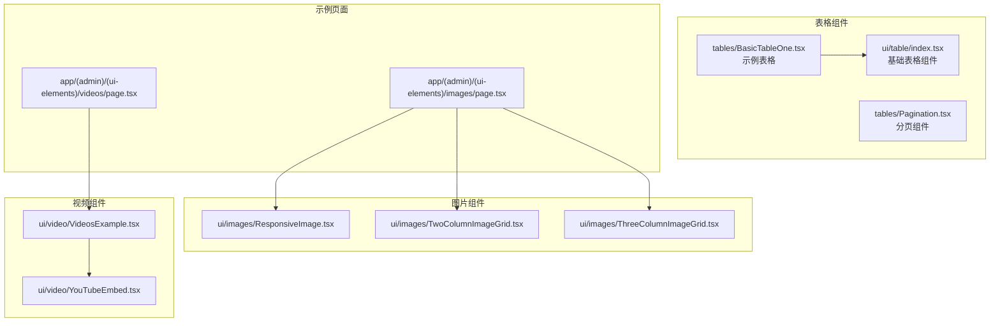
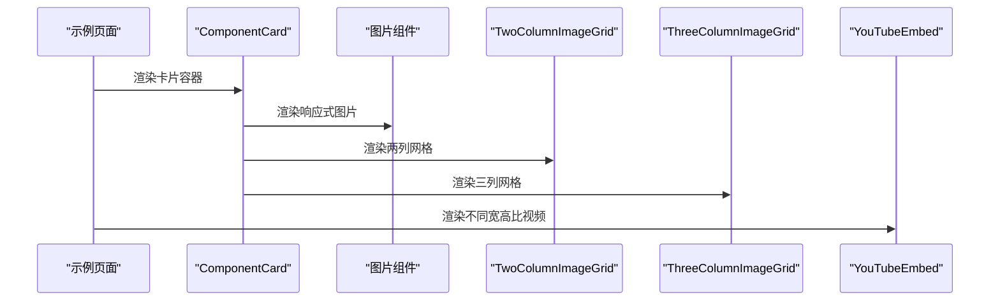
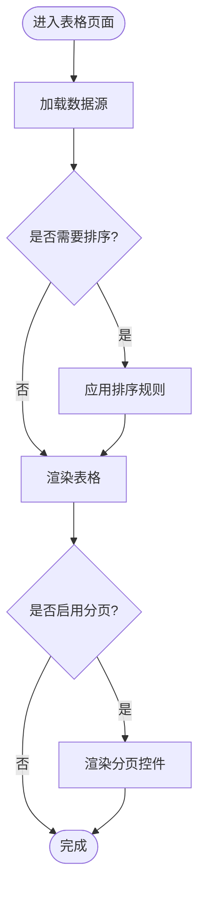
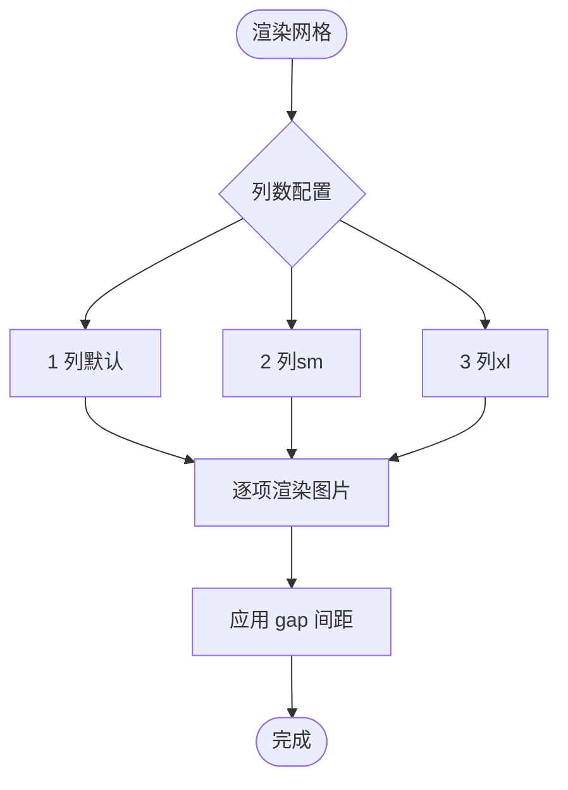
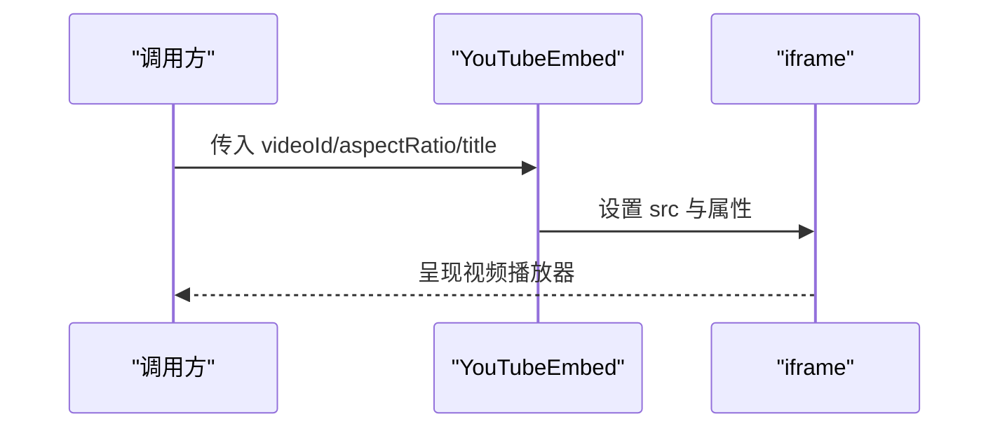
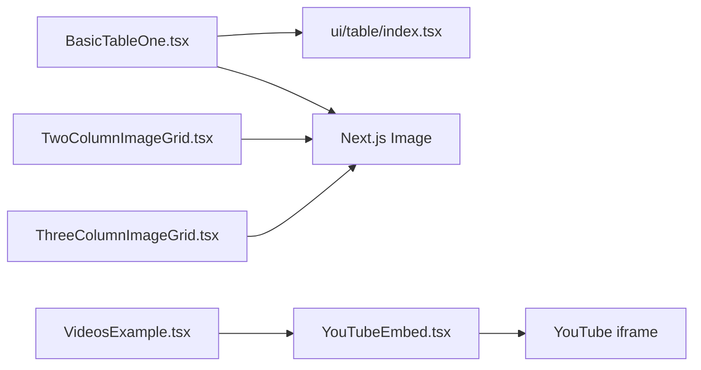

# 数据展示组件

<cite>
**本文引用的文件**
- [src/components/ui/table/index.tsx](file://src/components/ui/table/index.tsx)
- [src/components/tables/BasicTableOne.tsx](file://src/components/tables/BasicTableOne.tsx)
- [src/components/tables/Pagination.tsx](file://src/components/tables/Pagination.tsx)
- [src/components/ui/images/ResponsiveImage.tsx](file://src/components/ui/images/ResponsiveImage.tsx)
- [src/components/ui/images/TwoColumnImageGrid.tsx](file://src/components/ui/images/TwoColumnImageGrid.tsx)
- [src/components/ui/images/ThreeColumnImageGrid.tsx](file://src/components/ui/images/ThreeColumnImageGrid.tsx)
- [src/components/ui/video/YouTubeEmbed.tsx](file://src/components/ui/video/YouTubeEmbed.tsx)
- [src/components/ui/video/VideosExample.tsx](file://src/components/ui/video/VideosExample.tsx)
- [src/app/(admin)/(ui-elements)/images/page.tsx](file://src/app/(admin)/(ui-elements)/images/page.tsx)
- [src/app/(admin)/(ui-elements)/videos/page.tsx](file://src/app/(admin)/(ui-elements)/videos/page.tsx)
</cite>

## 目录
1. [简介](#简介)
2. [项目结构](#项目结构)
3. [核心组件](#核心组件)
4. [架构总览](#架构总览)
5. [组件详解](#组件详解)
6. [依赖关系分析](#依赖关系分析)
7. [性能考量](#性能考量)
8. [故障排查指南](#故障排查指南)
9. [结论](#结论)
10. [附录](#附录)

## 简介
本文件聚焦于数据展示类 UI 组件，系统性梳理以下能力与实现要点：
- 表格组件：数据绑定、排序（扩展建议）、分页处理、行选择机制（扩展建议）
- 响应式图片组件：尺寸适配、懒加载、占位符处理、格式转换
- 图片网格组件：两列与三列布局算法、间距控制、响应式断点
- 视频嵌入组件：YouTube iframe 集成、播放控制、尺寸适配
- 提供完整组件 API、数据格式要求、样式定制方案，并给出性能优化、SEO 友好性与跨浏览器兼容性建议。

## 项目结构
与数据展示相关的核心文件分布如下：
- 表格基础组件与示例：ui/table、tables/BasicTableOne、tables/Pagination
- 图片与网格：ui/images 下的 ResponsiveImage、TwoColumnImageGrid、ThreeColumnImageGrid
- 视频：ui/video 下的 YouTubeEmbed、VideosExample
- 示例页面：app/(admin)/(ui-elements)/images、videos

图表来源
- [src/components/ui/table/index.tsx:1-67](file://src/components/ui/table/index.tsx#L1-L67)
- [src/components/tables/BasicTableOne.tsx:1-227](file://src/components/tables/BasicTableOne.tsx#L1-L227)
- [src/components/tables/Pagination.tsx:1-55](file://src/components/tables/Pagination.tsx#L1-L55)
- [src/components/ui/images/ResponsiveImage.tsx:1-20](file://src/components/ui/images/ResponsiveImage.tsx#L1-L20)
- [src/components/ui/images/TwoColumnImageGrid.tsx:1-31](file://src/components/ui/images/TwoColumnImageGrid.tsx#L1-L31)
- [src/components/ui/images/ThreeColumnImageGrid.tsx:1-42](file://src/components/ui/images/ThreeColumnImageGrid.tsx#L1-L42)
- [src/components/ui/video/YouTubeEmbed.tsx:1-42](file://src/components/ui/video/YouTubeEmbed.tsx#L1-L42)
- [src/components/ui/video/VideosExample.tsx:1-29](file://src/components/ui/video/VideosExample.tsx#L1-L29)
- [src/app/(admin)/(ui-elements)/images/page.tsx](file://src/app/(admin)/(ui-elements)/images/page.tsx#L1-L34)
- [src/app/(admin)/(ui-elements)/videos/page.tsx](file://src/app/(admin)/(ui-elements)/videos/page.tsx#L1-L21)

章节来源
- [src/app/(admin)/(ui-elements)/images/page.tsx](file://src/app/(admin)/(ui-elements)/images/page.tsx#L1-L34)
- [src/app/(admin)/(ui-elements)/videos/page.tsx](file://src/app/(admin)/(ui-elements)/videos/page.tsx#L1-L21)

## 核心组件
本节概述各组件职责与使用方式，便于快速定位与集成。

- 表格基础组件（ui/table/index.tsx）
  - 提供 Table、TableHeader、TableBody、TableRow、TableCell 等基础单元，支持通过 isHeader 控制渲染为 th 或 td；支持 className 扩展样式。
  - 适用于构建自定义表格，配合业务数据进行数据绑定与交互。

- 分页组件（tables/Pagination.tsx）
  - 接收 currentPage、totalPages、onPageChange，渲染“上一页/下一页”与中间页码按钮，带省略号分段显示。
  - 适合与表格或列表组件组合使用，实现大数据量分页浏览。

- 响应式图片（ui/images/ResponsiveImage.tsx）
  - 使用 Next.js Image，基于容器宽度自适应，保持宽高比；提供边框与圆角样式。
  - 当前为固定图片路径示例，可扩展为动态 props。

- 两列图片网格（ui/images/TwoColumnImageGrid.tsx）
  - 使用 CSS Grid 在小屏单列、中屏双列布局；每项内嵌 Next.js Image，保持比例与圆角。

- 三列图片网格（ui/images/ThreeColumnImageGrid.tsx）
  - 在小屏单列、中屏双列、大屏三列之间切换；间距统一由 gap 控制。

- YouTube 嵌入（ui/video/YouTubeEmbed.tsx）
  - 支持多种宽高比（16:9、4:3、21:9、1:1），通过 aspect-* 类控制；iframe 源拼接 videoId，支持标题与全屏属性。

- 视频示例（ui/video/VideosExample.tsx）
  - 展示不同宽高比的 YouTubeEmbed 使用方式，便于对比与集成。

章节来源
- [src/components/ui/table/index.tsx:1-67](file://src/components/ui/table/index.tsx#L1-L67)
- [src/components/tables/Pagination.tsx:1-55](file://src/components/tables/Pagination.tsx#L1-L55)
- [src/components/ui/images/ResponsiveImage.tsx:1-20](file://src/components/ui/images/ResponsiveImage.tsx#L1-L20)
- [src/components/ui/images/TwoColumnImageGrid.tsx:1-31](file://src/components/ui/images/TwoColumnImageGrid.tsx#L1-L31)
- [src/components/ui/images/ThreeColumnImageGrid.tsx:1-42](file://src/components/ui/images/ThreeColumnImageGrid.tsx#L1-L42)
- [src/components/ui/video/YouTubeEmbed.tsx:1-42](file://src/components/ui/video/YouTubeEmbed.tsx#L1-L42)
- [src/components/ui/video/VideosExample.tsx:1-29](file://src/components/ui/video/VideosExample.tsx#L1-L29)

## 架构总览
下图展示页面到组件的调用关系与数据流向：

图表来源
- [src/app/(admin)/(ui-elements)/images/page.tsx](file://src/app/(admin)/(ui-elements)/images/page.tsx#L16-L33)
- [src/app/(admin)/(ui-elements)/videos/page.tsx](file://src/app/(admin)/(ui-elements)/videos/page.tsx#L12-L20)
- [src/components/ui/images/ResponsiveImage.tsx:4-19](file://src/components/ui/images/ResponsiveImage.tsx#L4-L19)
- [src/components/ui/images/TwoColumnImageGrid.tsx:4-30](file://src/components/ui/images/TwoColumnImageGrid.tsx#L4-L30)
- [src/components/ui/images/ThreeColumnImageGrid.tsx:4-41](file://src/components/ui/images/ThreeColumnImageGrid.tsx#L4-L41)
- [src/components/ui/video/YouTubeEmbed.tsx:12-39](file://src/components/ui/video/YouTubeEmbed.tsx#L12-L39)

## 组件详解

### 表格组件（index.tsx 与示例）
- 数据绑定
  - 示例表格通过静态数组定义数据模型，映射到表头与单元格渲染，体现字段到列的绑定关系。
  - 建议在实际应用中将数据源作为 props 注入，以支持动态更新与外部排序/过滤。

- 排序功能（扩展建议）
  - 当前未内置排序逻辑。可在外部维护排序状态（如按列键与方向），在渲染前对数据进行排序，再传入表格组件。

- 分页处理
  - 分页组件提供页码导航与回调，可与表格结合实现前后端分页或前端分页。

- 行选择机制（扩展建议）
  - 可引入多选框列，维护选中行集合；在表格外层提供批量操作入口。

图表来源
- [src/components/tables/BasicTableOne.tsx:114-226](file://src/components/tables/BasicTableOne.tsx#L114-L226)
- [src/components/tables/Pagination.tsx:7-52](file://src/components/tables/Pagination.tsx#L7-L52)

章节来源
- [src/components/ui/table/index.tsx:3-66](file://src/components/ui/table/index.tsx#L3-L66)
- [src/components/tables/BasicTableOne.tsx:13-226](file://src/components/tables/BasicTableOne.tsx#L13-L226)
- [src/components/tables/Pagination.tsx:1-55](file://src/components/tables/Pagination.tsx#L1-L55)

### 响应式图片组件（ResponsiveImage）
- 尺寸适配
  - 使用 Next.js Image 的 width/height 与容器宽度自适应，保持比例；通过父容器控制高度策略。

- 懒加载
  - Next.js Image 默认懒加载，无需额外配置；可结合 loading="lazy" 属性进一步明确。

- 占位符处理
  - 当前示例未使用占位符；可结合 blurDataURL 或占位背景色提升加载体验。

- 格式转换
  - Next.js Image 自动根据设备像素比与请求尺寸生成合适格式与大小；可结合 sizes 与 srcSet 进一步优化。

- API 与数据格式
  - 当前为固定资源路径示例；建议扩展为可接收 src、alt、width、height、sizes 等 props 的通用组件。

章节来源
- [src/components/ui/images/ResponsiveImage.tsx:4-19](file://src/components/ui/images/ResponsiveImage.tsx#L4-L19)

### 图片网格组件（TwoColumnImageGrid、ThreeColumnImageGrid）
- 布局算法
  - 基于 CSS Grid 的响应式列数：小屏单列，中屏双列，大屏三列；通过 gap 控制间距。

- 间距控制
  - 两列网格使用 gap-5；三列网格同样使用 gap-5，确保视觉一致性。

- 响应式断点
  - sm: grid-cols-2；xl: grid-cols-3；在两列与三列之间平滑过渡。

- 数据格式与复用
  - 当前为固定图片资源；建议接收图片数组（含 src、alt、尺寸等）进行渲染，提高复用性。

图表来源
- [src/components/ui/images/TwoColumnImageGrid.tsx:4-30](file://src/components/ui/images/TwoColumnImageGrid.tsx#L4-L30)
- [src/components/ui/images/ThreeColumnImageGrid.tsx:4-41](file://src/components/ui/images/ThreeColumnImageGrid.tsx#L4-L41)

章节来源
- [src/components/ui/images/TwoColumnImageGrid.tsx:1-31](file://src/components/ui/images/TwoColumnImageGrid.tsx#L1-L31)
- [src/components/ui/images/ThreeColumnImageGrid.tsx:1-42](file://src/components/ui/images/ThreeColumnImageGrid.tsx#L1-L42)

### 视频嵌入组件（YouTubeEmbed）
- iframe 集成
  - 通过 videoId 拼接 embed URL；iframe 支持全屏与权限声明，满足播放需求。

- 播放控制
  - 由 YouTube 平台控制播放行为；可通过参数扩展（如 autoplay、controls 等）在上层封装中注入。

- 尺寸适配
  - 通过 aspect-* 类控制容器宽高比，确保视频在不同断点下保持一致比例。

- API 与数据格式
  - 接收 videoId、aspectRatio、title、className 等；支持 16:9、4:3、21:9、1:1 四种比例。

图表来源
- [src/components/ui/video/YouTubeEmbed.tsx:12-39](file://src/components/ui/video/YouTubeEmbed.tsx#L12-L39)
- [src/components/ui/video/VideosExample.tsx:5-28](file://src/components/ui/video/VideosExample.tsx#L5-L28)

章节来源
- [src/components/ui/video/YouTubeEmbed.tsx:1-42](file://src/components/ui/video/YouTubeEmbed.tsx#L1-L42)
- [src/components/ui/video/VideosExample.tsx:1-29](file://src/components/ui/video/VideosExample.tsx#L1-L29)

## 依赖关系分析
- 组件间耦合
  - 表格组件为纯展示型，低耦合；与分页组件通过回调解耦。
  - 图片网格组件依赖 Next.js Image，样式依赖 Tailwind CSS 的 grid 与断点类。
  - 视频组件依赖 YouTube iframe 与 Tailwind 的 aspect-* 工具类。

- 外部依赖
  - Next.js Image：自动优化与懒加载。
  - Tailwind CSS：断点、间距、圆角、边框等样式工具类。

图表来源
- [src/components/tables/BasicTableOne.tsx:1-227](file://src/components/tables/BasicTableOne.tsx#L1-L227)
- [src/components/ui/table/index.tsx:1-67](file://src/components/ui/table/index.tsx#L1-L67)
- [src/components/ui/images/TwoColumnImageGrid.tsx:1-31](file://src/components/ui/images/TwoColumnImageGrid.tsx#L1-L31)
- [src/components/ui/images/ThreeColumnImageGrid.tsx:1-42](file://src/components/ui/images/ThreeColumnImageGrid.tsx#L1-L42)
- [src/components/ui/video/VideosExample.tsx:1-29](file://src/components/ui/video/VideosExample.tsx#L1-L29)
- [src/components/ui/video/YouTubeEmbed.tsx:1-42](file://src/components/ui/video/YouTubeEmbed.tsx#L1-L42)

章节来源
- [src/components/tables/BasicTableOne.tsx:1-227](file://src/components/tables/BasicTableOne.tsx#L1-L227)
- [src/components/ui/table/index.tsx:1-67](file://src/components/ui/table/index.tsx#L1-L67)
- [src/components/ui/images/TwoColumnImageGrid.tsx:1-31](file://src/components/ui/images/TwoColumnImageGrid.tsx#L1-L31)
- [src/components/ui/images/ThreeColumnImageGrid.tsx:1-42](file://src/components/ui/images/ThreeColumnImageGrid.tsx#L1-L42)
- [src/components/ui/video/VideosExample.tsx:1-29](file://src/components/ui/video/VideosExample.tsx#L1-L29)
- [src/components/ui/video/YouTubeEmbed.tsx:1-42](file://src/components/ui/video/YouTubeEmbed.tsx#L1-L42)

## 性能考量
- 图片优化
  - 使用 Next.js Image 自动压缩与懒加载；建议为关键图片设置 sizes 与质量参数，减少带宽占用。
  - 对首屏图片可考虑占位符或骨架屏，改善感知性能。

- 表格性能
  - 大数据量时优先后端分页与排序；前端分页建议限制单页条数并使用虚拟滚动（可选）。
  - 合理拆分渲染单元，避免不必要的重渲染。

- 视频优化
  - 仅在可见区域加载视频；可结合 IntersectionObserver 延迟初始化。
  - 使用合适的宽高比与容器尺寸，避免布局抖动。

- 样式与脚本
  - Tailwind 工具类按需使用，避免生成冗余样式。
  - 组件尽量无副作用，避免全局样式污染。

## 故障排查指南
- 表格无法横向滚动
  - 确认容器设置了最大宽度与溢出处理；示例中使用了容器包裹与最小宽度约束，确保横向滚动可用。

- 图片不显示或变形
  - 检查 width/height 是否与真实尺寸匹配；确认容器宽度与样式未强制改变比例。
  - 若出现加载闪烁，可增加占位符或骨架屏。

- 网格断点异常
  - 确认 sm/xl 断点类正确拼写；检查父容器是否具备响应式布局上下文。

- 视频播放异常
  - 确认 videoId 正确且网络可达；检查 iframe 权限声明与全屏属性。
  - 如需自动播放，需遵循平台策略并在上层封装中谨慎使用。

章节来源
- [src/components/tables/BasicTableOne.tsx:114-226](file://src/components/tables/BasicTableOne.tsx#L114-L226)
- [src/components/ui/images/ResponsiveImage.tsx:4-19](file://src/components/ui/images/ResponsiveImage.tsx#L4-L19)
- [src/components/ui/images/TwoColumnImageGrid.tsx:4-30](file://src/components/ui/images/TwoColumnImageGrid.tsx#L4-L30)
- [src/components/ui/images/ThreeColumnImageGrid.tsx:4-41](file://src/components/ui/images/ThreeColumnImageGrid.tsx#L4-L41)
- [src/components/ui/video/YouTubeEmbed.tsx:12-39](file://src/components/ui/video/YouTubeEmbed.tsx#L12-L39)

## 结论
本文档系统梳理了表格、图片与视频三大类数据展示组件的实现与使用方法，明确了当前版本的能力边界与可扩展点。建议在生产环境中：
- 将示例中的静态数据替换为可注入的 props；
- 为表格增加排序与行选择能力；
- 为图片组件增加懒加载与占位符配置；
- 为视频组件增加参数化与延迟加载策略；
- 强化 SEO 与无障碍访问（如 alt、title、结构化标记）。

## 附录

### 组件 API 一览（按文件）
- 表格基础组件（ui/table/index.tsx）
  - TableProps：children、className
  - TableHeaderProps：children、className
  - TableBodyProps：children、className
  - TableRowProps：children、className
  - TableCellProps：children、isHeader（布尔）、className

- 分页组件（tables/Pagination.tsx）
  - PaginationProps：currentPage、totalPages、onPageChange

- 响应式图片（ui/images/ResponsiveImage.tsx）
  - 当前为固定资源示例；建议扩展为接收 src、alt、width、height、className 等 props 的通用组件。

- 两列图片网格（ui/images/TwoColumnImageGrid.tsx）
  - 当前为固定资源示例；建议扩展为接收图片数组与间距配置的通用组件。

- 三列图片网格（ui/images/ThreeColumnImageGrid.tsx）
  - 当前为固定资源示例；建议扩展为接收图片数组与间距配置的通用组件。

- YouTube 嵌入（ui/video/YouTubeEmbed.tsx）
  - YouTubeEmbedProps：videoId（必填）、aspectRatio（可选，默认 16:9）、title（可选）、className（可选）

章节来源
- [src/components/ui/table/index.tsx:3-66](file://src/components/ui/table/index.tsx#L3-L66)
- [src/components/tables/Pagination.tsx:1-5](file://src/components/tables/Pagination.tsx#L1-L5)
- [src/components/ui/images/ResponsiveImage.tsx:4-19](file://src/components/ui/images/ResponsiveImage.tsx#L4-L19)
- [src/components/ui/images/TwoColumnImageGrid.tsx:4-30](file://src/components/ui/images/TwoColumnImageGrid.tsx#L4-L30)
- [src/components/ui/images/ThreeColumnImageGrid.tsx:4-41](file://src/components/ui/images/ThreeColumnImageGrid.tsx#L4-L41)
- [src/components/ui/video/YouTubeEmbed.tsx:5-10](file://src/components/ui/video/YouTubeEmbed.tsx#L5-L10)