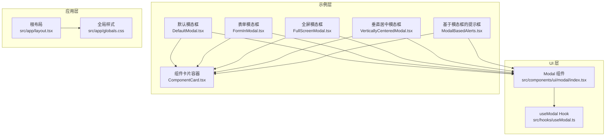
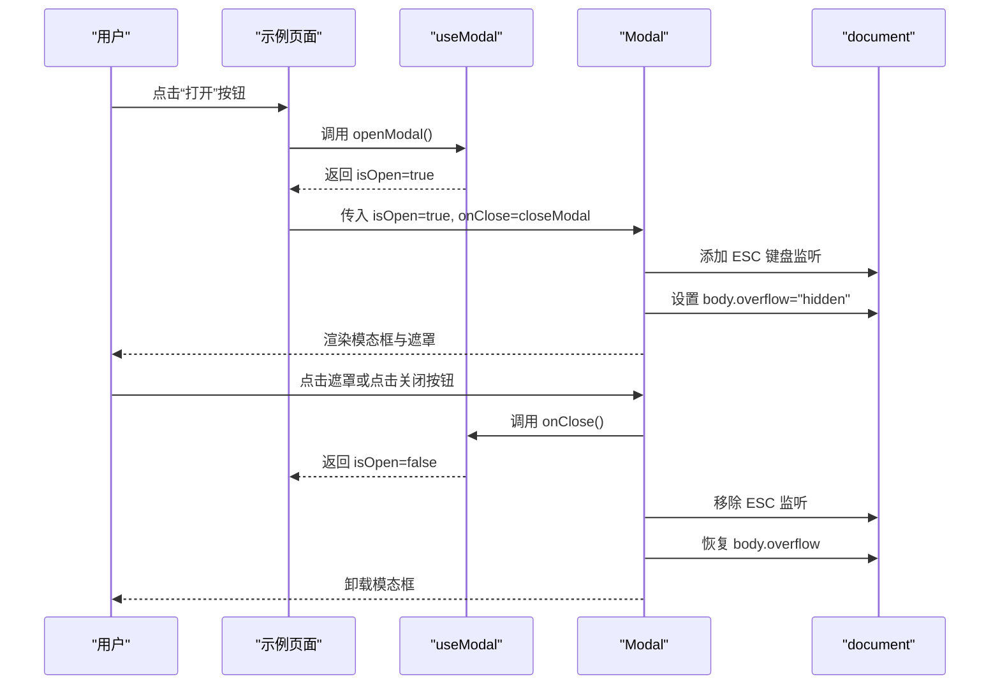
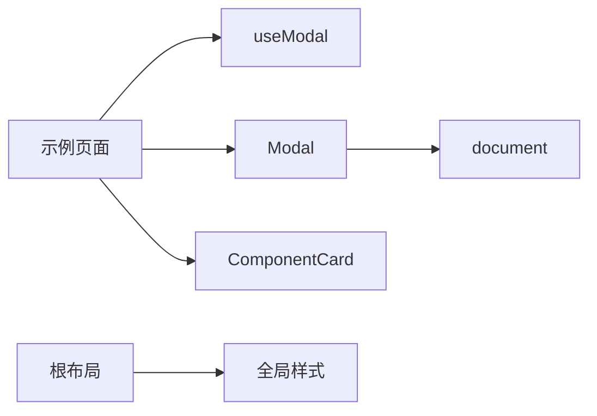

# 模态框组件

<cite>
**本文引用的文件**
- [src/components/ui/modal/index.tsx](file://src/components/ui/modal/index.tsx)
- [src/hooks/useModal.ts](file://src/hooks/useModal.ts)
- [src/components/example/ModalExample/DefaultModal.tsx](file://src/components/example/ModalExample/DefaultModal.tsx)
- [src/components/example/ModalExample/FormInModal.tsx](file://src/components/example/ModalExample/FormInModal.tsx)
- [src/components/example/ModalExample/FullScreenModal.tsx](file://src/components/example/ModalExample/FullScreenModal.tsx)
- [src/components/example/ModalExample/VerticallyCenteredModal.tsx](file://src/components/example/ModalExample/VerticallyCenteredModal.tsx)
- [src/components/example/ModalExample/ModalBasedAlerts.tsx](file://src/components/example/ModalExample/ModalBasedAlerts.tsx)
- [src/components/common/ComponentCard.tsx](file://src/components/common/ComponentCard.tsx)
- [src/app/layout.tsx](file://src/app/layout.tsx)
- [src/app/globals.css](file://src/app/globals.css)
</cite>

## 目录
1. [简介](#简介)
2. [项目结构](#项目结构)
3. [核心组件](#核心组件)
4. [架构总览](#架构总览)
5. [详细组件分析](#详细组件分析)
6. [依赖关系分析](#依赖关系分析)
7. [性能考量](#性能考量)
8. [故障排查指南](#故障排查指南)
9. [结论](#结论)
10. [附录](#附录)

## 简介
本文件系统性地记录了本仓库中的模态框组件（Modal）及其配套示例与工具钩子（useModal），覆盖以下主题：
- 核心实现原理与挂载机制
- 焦点管理与键盘事件处理
- 生命周期管理、打开/关闭动画与背景遮罩
- 不同类型模态框示例：默认模态框、表单模态框、全屏模态框、垂直居中模态框、基于模态框的提示框
- 配置选项、回调函数与事件处理机制
- TypeScript 类型定义、使用场景分析与最佳实践
- 响应式设计、无障碍访问支持与性能优化策略

## 项目结构
模态框组件位于 UI 组件层，配合自定义 Hook 提供状态管理，并在示例页面中演示多种使用方式。

图表来源
- [src/components/ui/modal/index.tsx:1-96](file://src/components/ui/modal/index.tsx#L1-L96)
- [src/hooks/useModal.ts:1-13](file://src/hooks/useModal.ts#L1-L13)
- [src/components/example/ModalExample/DefaultModal.tsx:1-54](file://src/components/example/ModalExample/DefaultModal.tsx#L1-L54)
- [src/components/example/ModalExample/FormInModal.tsx:1-72](file://src/components/example/ModalExample/FormInModal.tsx#L1-L72)
- [src/components/example/ModalExample/FullScreenModal.tsx:1-67](file://src/components/example/ModalExample/FullScreenModal.tsx#L1-L67)
- [src/components/example/ModalExample/VerticallyCenteredModal.tsx:1-48](file://src/components/example/ModalExample/VerticallyCenteredModal.tsx#L1-L48)
- [src/components/example/ModalExample/ModalBasedAlerts.tsx:1-283](file://src/components/example/ModalExample/ModalBasedAlerts.tsx#L1-L283)
- [src/components/common/ComponentCard.tsx:1-41](file://src/components/common/ComponentCard.tsx#L1-L41)
- [src/app/layout.tsx:1-33](file://src/app/layout.tsx#L1-L33)
- [src/app/globals.css:1-899](file://src/app/globals.css#L1-L899)

章节来源
- [src/components/ui/modal/index.tsx:1-96](file://src/components/ui/modal/index.tsx#L1-L96)
- [src/hooks/useModal.ts:1-13](file://src/hooks/useModal.ts#L1-L13)
- [src/components/example/ModalExample/DefaultModal.tsx:1-54](file://src/components/example/ModalExample/DefaultModal.tsx#L1-L54)
- [src/components/example/ModalExample/FormInModal.tsx:1-72](file://src/components/example/ModalExample/FormInModal.tsx#L1-L72)
- [src/components/example/ModalExample/FullScreenModal.tsx:1-67](file://src/components/example/ModalExample/FullScreenModal.tsx#L1-L67)
- [src/components/example/ModalExample/VerticallyCenteredModal.tsx:1-48](file://src/components/example/ModalExample/VerticallyCenteredModal.tsx#L1-L48)
- [src/components/example/ModalExample/ModalBasedAlerts.tsx:1-283](file://src/components/example/ModalExample/ModalBasedAlerts.tsx#L1-L283)
- [src/components/common/ComponentCard.tsx:1-41](file://src/components/common/ComponentCard.tsx#L1-L41)
- [src/app/layout.tsx:1-33](file://src/app/layout.tsx#L1-L33)
- [src/app/globals.css:1-899](file://src/app/globals.css#L1-L899)

## 核心组件
- Modal 组件：负责渲染模态框内容、处理 ESC 键盘事件、控制背景遮罩与滚动锁定、支持全屏模式与可选关闭按钮。
- useModal Hook：提供 isOpen、openModal、closeModal、toggleModal 四个状态与方法，便于在示例中快速管理模态框状态。

章节来源
- [src/components/ui/modal/index.tsx:4-20](file://src/components/ui/modal/index.tsx#L4-L20)
- [src/hooks/useModal.ts:4-12](file://src/hooks/useModal.ts#L4-L12)

## 架构总览
下图展示了 Modal 组件与其依赖的交互关系，包括键盘事件监听、DOM 挂载、背景遮罩与滚动控制等关键路径。

图表来源
- [src/components/ui/modal/index.tsx:23-49](file://src/components/ui/modal/index.tsx#L23-L49)
- [src/hooks/useModal.ts:4-12](file://src/hooks/useModal.ts#L4-L12)
- [src/components/example/ModalExample/DefaultModal.tsx:9-25](file://src/components/example/ModalExample/DefaultModal.tsx#L9-L25)

## 详细组件分析

### Modal 组件实现要点
- 类型定义与属性
  - isOpen: 控制是否显示
  - onClose: 关闭回调
  - className: 自定义样式类
  - children: 内容节点
  - showCloseButton: 是否显示关闭按钮（默认显示）
  - isFullscreen: 是否全屏模式（默认否）

- 挂载机制与卸载清理
  - 打开时添加 ESC 键盘监听；关闭时移除监听，避免内存泄漏
  - 打开时设置 document.body.overflow="hidden"；关闭时恢复；卸载时再次恢复

- 背景遮罩与点击行为
  - 非全屏模式下渲染半透明遮罩层，点击遮罩触发 onClose
  - 点击模态框内容阻止事件冒泡，避免误触关闭

- 全屏模式
  - isFullscreen=true 时，内容占满视口尺寸，关闭按钮仍可按需显示

- 可选关闭按钮
  - showCloseButton=true 时渲染带 SVG 的关闭按钮，点击触发 onClose

章节来源
- [src/components/ui/modal/index.tsx:4-20](file://src/components/ui/modal/index.tsx#L4-L20)
- [src/components/ui/modal/index.tsx:23-49](file://src/components/ui/modal/index.tsx#L23-L49)
- [src/components/ui/modal/index.tsx:57-94](file://src/components/ui/modal/index.tsx#L57-L94)

### useModal Hook 实现要点
- 状态：isOpen（布尔）
- 方法：
  - openModal：设为 true
  - closeModal：设为 false
  - toggleModal：取反

章节来源
- [src/hooks/useModal.ts:4-12](file://src/hooks/useModal.ts#L4-L12)

### 示例：默认模态框
- 使用场景：展示文本内容与操作按钮
- 关键点：通过 useModal 控制 isOpen/onClose；在 Modal 中传入自定义 className 限定宽度与内边距；保存逻辑在示例中处理后调用 closeModal

章节来源
- [src/components/example/ModalExample/DefaultModal.tsx:9-50](file://src/components/example/ModalExample/DefaultModal.tsx#L9-L50)

### 示例：表单模态框
- 使用场景：在模态框中嵌入表单输入控件
- 关键点：Modal 内部使用标签与输入组件；保存逻辑在示例中处理后调用 closeModal

章节来源
- [src/components/example/ModalExample/FormInModal.tsx:10-68](file://src/components/example/ModalExample/FormInModal.tsx#L10-L68)

### 示例：全屏模态框
- 使用场景：需要充分利用屏幕空间的场景
- 关键点：isFullscreen=true；showCloseButton=true；内部容器使用固定高度与滚动条样式

章节来源
- [src/components/example/ModalExample/FullScreenModal.tsx:8-63](file://src/components/example/ModalExample/FullScreenModal.tsx#L8-L63)

### 示例：垂直居中模态框
- 使用场景：信息确认类弹窗，强调视觉居中
- 关键点：showCloseButton=false；内容居中布局；保存逻辑在示例中处理后调用 closeModal

章节来源
- [src/components/example/ModalExample/VerticallyCenteredModal.tsx:8-44](file://src/components/example/ModalExample/VerticallyCenteredModal.tsx#L8-L44)

### 示例：基于模态框的提示框
- 使用场景：成功/信息/警告/错误等提示
- 关键点：每个提示类型独立使用一个 useModal 实例；在 Modal 中渲染对应图标与文案；统一使用 onClose 关闭

章节来源
- [src/components/example/ModalExample/ModalBasedAlerts.tsx:8-99](file://src/components/example/ModalExample/ModalBasedAlerts.tsx#L8-L99)
- [src/components/example/ModalExample/ModalBasedAlerts.tsx:100-159](file://src/components/example/ModalExample/ModalBasedAlerts.tsx#L100-L159)
- [src/components/example/ModalExample/ModalBasedAlerts.tsx:160-219](file://src/components/example/ModalExample/ModalBasedAlerts.tsx#L160-L219)
- [src/components/example/ModalExample/ModalBasedAlerts.tsx:220-279](file://src/components/example/ModalExample/ModalBasedAlerts.tsx#L220-L279)

### 类型定义与接口
- ModalProps 接口字段
  - isOpen: boolean
  - onClose: () => void
  - className?: string
  - children: React.ReactNode
  - showCloseButton?: boolean
  - isFullscreen?: boolean

章节来源
- [src/components/ui/modal/index.tsx:4-11](file://src/components/ui/modal/index.tsx#L4-L11)

### 生命周期管理
- 打开流程
  - 触发 openModal -> isOpen=true
  - Modal 渲染，注册 ESC 监听，锁定滚动
- 关闭流程
  - 触发 onClose -> isOpen=false
  - Modal 卸载，移除 ESC 监听，恢复滚动

章节来源
- [src/components/ui/modal/index.tsx:23-49](file://src/components/ui/modal/index.tsx#L23-L49)
- [src/hooks/useModal.ts:4-12](file://src/hooks/useModal.ts#L4-L12)

### 打开/关闭动画与背景遮罩
- 动画
  - 当前实现未包含显式的 CSS 过渡动画；如需动画，可在 Modal 容器上添加过渡类并在 isOpen 变化时切换类名
- 背景遮罩
  - 非全屏模式下渲染半透明遮罩层，点击遮罩触发 onClose
  - 全屏模式下不渲染遮罩，由 isFullscreen 控制

章节来源
- [src/components/ui/modal/index.tsx:57-94](file://src/components/ui/modal/index.tsx#L57-L94)

### 焦点管理与键盘事件处理
- ESC 键盘事件
  - 打开时添加监听；按下 ESC 调用 onClose
  - 卸载时移除监听，避免泄漏
- 点击遮罩关闭
  - 遮罩层 onClick 调用 onClose
- 点击内容阻止冒泡
  - Modal 内容容器 onClick(e) => e.stopPropagation()，避免误关

章节来源
- [src/components/ui/modal/index.tsx:23-37](file://src/components/ui/modal/index.tsx#L23-L37)
- [src/components/ui/modal/index.tsx:68-68](file://src/components/ui/modal/index.tsx#L68-L68)

### 配置选项与事件处理
- 配置选项
  - isOpen: 控制显示/隐藏
  - onClose: 关闭回调
  - className: 自定义样式
  - showCloseButton: 是否显示关闭按钮
  - isFullscreen: 是否全屏
- 事件处理
  - ESC 键盘事件
  - 遮罩点击事件
  - 关闭按钮点击事件
  - 内容点击阻止冒泡

章节来源
- [src/components/ui/modal/index.tsx:4-20](file://src/components/ui/modal/index.tsx#L4-L20)
- [src/components/ui/modal/index.tsx:57-94](file://src/components/ui/modal/index.tsx#L57-L94)

### 响应式设计与无障碍访问
- 响应式设计
  - 使用 Tailwind 工具类实现不同断点下的宽度与内边距调整
  - 全屏模式下使用视口单位占满屏幕
- 无障碍访问
  - 当前实现未包含 aria-modal、role、tabindex 等无障碍属性
  - 建议补充 aria-modal、aria-labelledby/aria-describedby、focus trap 等以提升可访问性

章节来源
- [src/app/globals.css:1-899](file://src/app/globals.css#L1-L899)
- [src/components/ui/modal/index.tsx:53-56](file://src/components/ui/modal/index.tsx#L53-L56)

### 性能优化策略
- 事件监听清理
  - 在 useEffect cleanup 中移除 ESC 监听，避免重复绑定
- 滚动锁定
  - 打开时设置 body.overflow，关闭时恢复，避免布局抖动
- 条件渲染
  - isOpen=false 时直接返回 null，避免渲染 DOM
- 事件冒泡控制
  - 内容容器阻止点击冒泡，减少不必要的事件处理

章节来源
- [src/components/ui/modal/index.tsx:23-49](file://src/components/ui/modal/index.tsx#L23-L49)
- [src/components/ui/modal/index.tsx:51-51](file://src/components/ui/modal/index.tsx#L51-L51)

## 依赖关系分析
- 组件耦合
  - Modal 依赖 document（键盘事件、滚动控制）
  - 示例页面依赖 useModal 提供的状态与方法
- 外部依赖
  - Tailwind CSS 用于样式与响应式断点
  - 根布局提供主题上下文与全局样式

图表来源
- [src/components/ui/modal/index.tsx:23-49](file://src/components/ui/modal/index.tsx#L23-L49)
- [src/hooks/useModal.ts:4-12](file://src/hooks/useModal.ts#L4-L12)
- [src/components/common/ComponentCard.tsx:10-36](file://src/components/common/ComponentCard.tsx#L10-L36)
- [src/app/layout.tsx:16-31](file://src/app/layout.tsx#L16-L31)
- [src/app/globals.css:1-899](file://src/app/globals.css#L1-L899)

章节来源
- [src/components/ui/modal/index.tsx:23-49](file://src/components/ui/modal/index.tsx#L23-L49)
- [src/hooks/useModal.ts:4-12](file://src/hooks/useModal.ts#L4-L12)
- [src/components/common/ComponentCard.tsx:10-36](file://src/components/common/ComponentCard.tsx#L10-L36)
- [src/app/layout.tsx:16-31](file://src/app/layout.tsx#L16-L31)
- [src/app/globals.css:1-899](file://src/app/globals.css#L1-L899)

## 性能考量
- 事件监听与清理：确保每次打开/关闭正确绑定/解绑，避免内存泄漏
- 滚动锁定：仅在 isOpen=true 时设置，避免不必要的样式变更
- 条件渲染：未打开时不渲染 DOM，降低首屏与重排成本
- 事件冒泡：阻止内容点击冒泡，减少无关事件处理
- 动画：如需过渡效果，建议使用 CSS 过渡而非复杂 JS 动画，以减少主线程压力

## 故障排查指南
- ESC 键无效
  - 检查 isOpen 是否为 true，ESC 监听是否已绑定
  - 确认未在父级容器中拦截键盘事件
- 点击遮罩无法关闭
  - 检查遮罩层 onClick 是否存在且调用了 onClose
  - 确认未在遮罩层上阻止事件冒泡
- 模态框打开后页面仍可滚动
  - 检查 body.overflow 是否被其他样式覆盖
  - 确认关闭时是否执行了恢复逻辑
- 全屏模式下遮罩仍然出现
  - 检查 isFullscreen 是否为 true
  - 确认非全屏分支的条件判断
- 关闭按钮不显示
  - 检查 showCloseButton 是否为 false
  - 确认按钮渲染条件

章节来源
- [src/components/ui/modal/index.tsx:23-49](file://src/components/ui/modal/index.tsx#L23-L49)
- [src/components/ui/modal/index.tsx:57-94](file://src/components/ui/modal/index.tsx#L57-L94)

## 结论
本模态框组件提供了简洁可靠的显示/隐藏控制、键盘事件处理与滚动锁定能力，并通过 useModal Hook 与多个示例页面展示了常见使用场景。若需进一步增强，建议补充无障碍属性、可选的过渡动画以及更完善的事件与状态管理。

## 附录
- 使用场景建议
  - 默认模态框：信息展示与简单确认
  - 表单模态框：数据录入与校验
  - 全屏模态框：内容较多或需要充分利用屏幕空间
  - 垂直居中模态框：强调视觉居中与简洁信息
  - 基于模态框的提示框：成功/信息/警告/错误等状态反馈
- 最佳实践
  - 明确关闭路径：ESC、遮罩、关闭按钮均应触发 onClose
  - 合理使用 isFullscreen 与 showCloseButton
  - 在示例中集中处理保存逻辑，保持 Modal 的职责单一
  - 如需动画，优先使用 CSS 过渡并结合 isOpen 切换类名
  - 增强无障碍：添加 aria-modal、role、focus trap 等属性