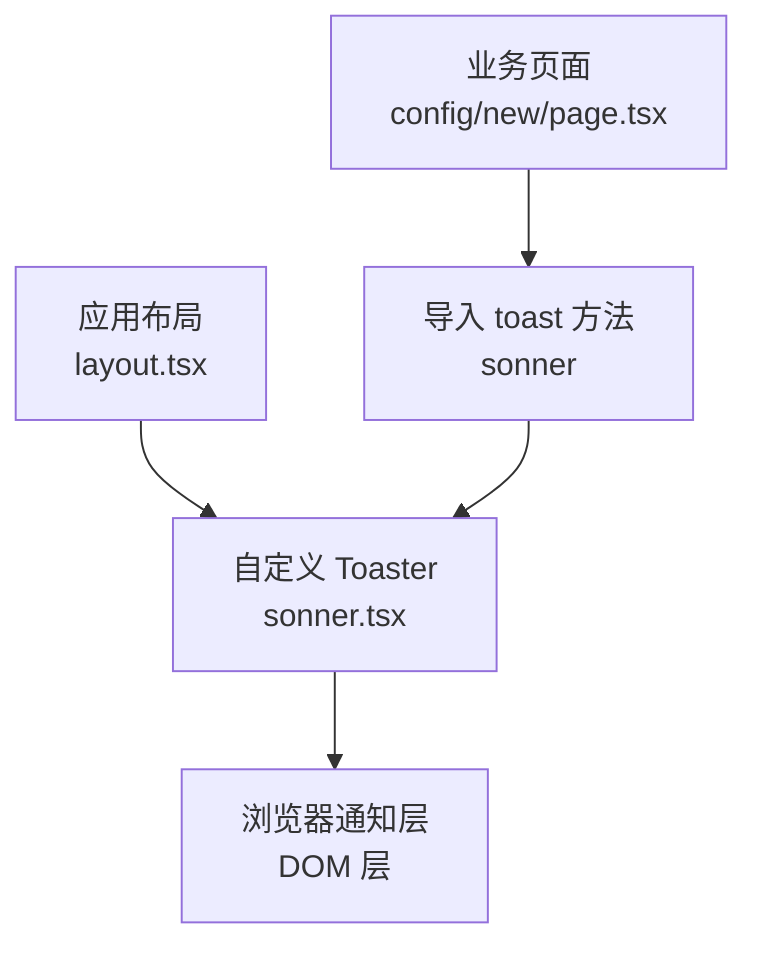
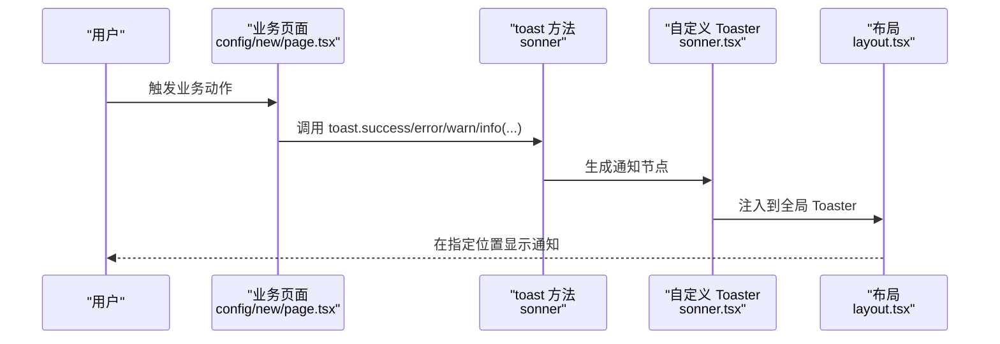
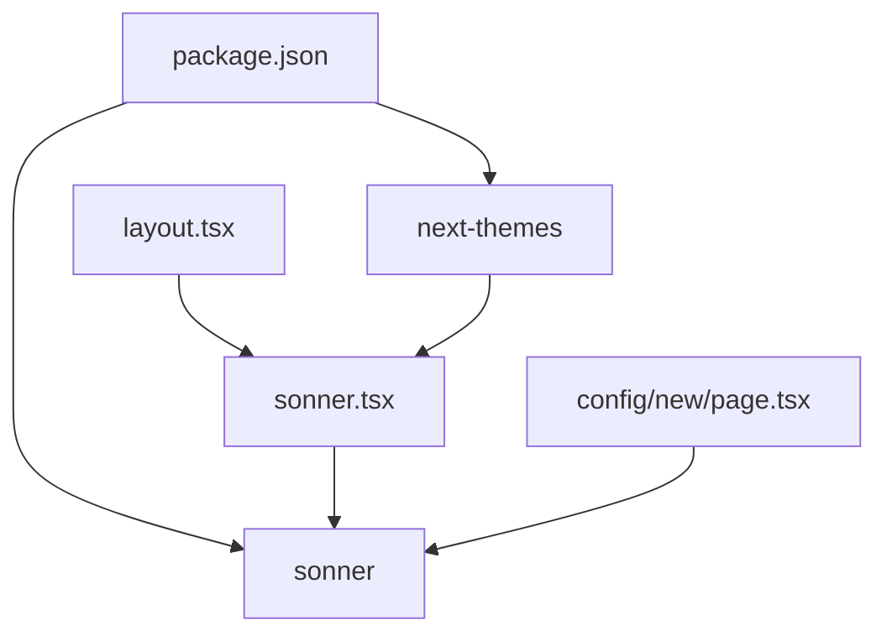
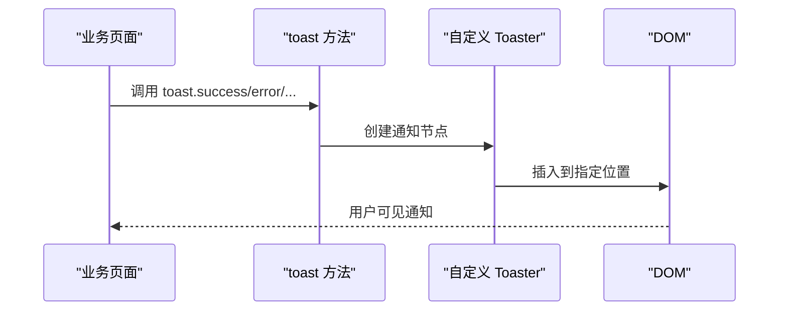

# 通知组件

<cite>
**本文档引用的文件**
- [src/components/ui/sonner.tsx](file://src/components/ui/sonner.tsx)
- [src/app/layout.tsx](file://src/app/layout.tsx)
- [src/app/(admin)/(others-pages)/(scene)/config/new/page.tsx](file://src/app/(admin)/(others-pages)/(scene)/config/new/page.tsx)
- [package.json](file://package.json)
- [src/app/globals.css](file://src/app/globals.css)
- [src/components/header/NotificationDropdown.tsx](file://src/components/header/NotificationDropdown.tsx)
</cite>

## 目录
1. [简介](#简介)
2. [项目结构](#项目结构)
3. [核心组件](#核心组件)
4. [架构总览](#架构总览)
5. [详细组件分析](#详细组件分析)
6. [依赖关系分析](#依赖关系分析)
7. [性能考虑](#性能考虑)
8. [故障排查指南](#故障排查指南)
9. [结论](#结论)
10. [附录](#附录)

## 简介
本文件系统性地文档化本项目的通知系统组件，基于 Sonner 通知库进行集成与配置，覆盖通知类型、显示位置、触发机制、自动消失、手动关闭、批量处理、样式定制、主题适配、动画效果、声音提示、优先级管理、去重机制、持久化存储、API 接口、配置选项、使用示例以及性能优化与用户体验最佳实践。文档同时结合仓库中的实际实现，确保可操作性和一致性。

## 项目结构
通知系统在本项目中的组织方式如下：
- 全局布局中引入通知托盘（Toaster），统一承载所有通知展示。
- 业务页面通过从 Sonner 导入的 toast 方法触发不同类型的通知。
- 自定义的 Toaster 组件封装了主题适配与默认样式类名，保证与项目整体设计一致。

图表来源
- [src/app/layout.tsx:27](file://src/app/layout.tsx#L27)
- [src/components/ui/sonner.tsx:8-29](file://src/components/ui/sonner.tsx#L8-L29)
- [src/app/(admin)/(others-pages)/(scene)/config/new/page.tsx:5](file://src/app/(admin)/(others-pages)/(scene)/config/new/page.tsx#L5)

章节来源
- [src/app/layout.tsx:16-31](file://src/app/layout.tsx#L16-L31)
- [src/components/ui/sonner.tsx:1-31](file://src/components/ui/sonner.tsx#L1-L31)

## 核心组件
- 自定义 Toaster 组件：封装主题适配、默认类名与样式映射，作为全局通知入口。
- 布局集成：在根布局中渲染 Toaster，并设置默认显示位置。
- 页面级触发：在业务页面中通过 toast 方法触发不同类型的用户反馈。

章节来源
- [src/components/ui/sonner.tsx:8-29](file://src/components/ui/sonner.tsx#L8-L29)
- [src/app/layout.tsx:27](file://src/app/layout.tsx#L27)
- [src/app/(admin)/(others-pages)/(scene)/config/new/page.tsx:55](file://src/app/(admin)/(others-pages)/(scene)/config/new/page.tsx#L55)

## 架构总览
下图展示了通知从触发到呈现的整体流程，包括主题适配、样式注入与 DOM 渲染：

图表来源
- [src/app/(admin)/(others-pages)/(scene)/config/new/page.tsx:55](file://src/app/(admin)/(others-pages)/(scene)/config/new/page.tsx#L55)
- [src/components/ui/sonner.tsx:8-29](file://src/components/ui/sonner.tsx#L8-L29)
- [src/app/layout.tsx:27](file://src/app/layout.tsx#L27)

## 详细组件分析

### 自定义 Toaster 组件（sonner.tsx）
- 功能要点
  - 使用 next-themes 的 useTheme 获取当前主题，动态传递给 Sonner 的 theme 属性，实现明暗主题适配。
  - 通过 toastOptions.classNames 对通知容器、描述文本、确认/取消按钮等关键元素进行样式映射，确保与项目设计系统一致。
  - 包装原生 Sonner 的 Toaster，导出统一的 Toaster 组件供全局使用。

- 关键配置
  - 主题：根据 useTheme 返回值设置 theme。
  - 类名映射：为 toast、description、actionButton、cancelButton 定义分组选择器类名，便于 Tailwind CSS 与项目主题联动。

- 适用场景
  - 全局通知入口，统一风格与交互体验。

章节来源
- [src/components/ui/sonner.tsx:8-29](file://src/components/ui/sonner.tsx#L8-L29)

### 布局集成（layout.tsx）
- 功能要点
  - 在根布局中引入自定义 Toaster，并设置 position 为 "top-center"，确保通知在页面顶部居中显示。
  - 将 Toaster 放置在 Provider 包裹范围内，保证主题上下文可用。

- 影响范围
  - 所有页面共享同一通知托盘，避免重复渲染与状态分散。

章节来源
- [src/app/layout.tsx:27](file://src/app/layout.tsx#L27)

### 页面级通知触发（config/new/page.tsx）
- 功能要点
  - 在数据获取、上传、下载、提交等异步操作中，使用 toast 方法反馈结果。
  - 错误场景统一调用 toast.error(...)，提升一致性与可维护性。

- 示例场景
  - 获取详情失败时：toast.error(...)。
  - 应用列表获取失败时：toast.error(...)。
  - 文件上传失败时：toast.error(...)。
  - 下载失败时：toast.error(...)。
  - 提交失败时：toast.error(...)。

- 注意事项
  - 避免在成功路径中滥用错误通知；建议使用 success 或 info 类型以区分语义。
  - 对于可预期的边界条件（如未选择文件），可在触发前校验并提示用户。

章节来源
- [src/app/(admin)/(others-pages)/(scene)/config/new/page.tsx:55](file://src/app/(admin)/(others-pages)/(scene)/config/new/page.tsx#L55)
- [src/app/(admin)/(others-pages)/(scene)/config/new/page.tsx:72](file://src/app/(admin)/(others-pages)/(scene)/config/new/page.tsx#L72)
- [src/app/(admin)/(others-pages)/(scene)/config/new/page.tsx:105](file://src/app/(admin)/(others-pages)/(scene)/config/new/page.tsx#L105)
- [src/app/(admin)/(others-pages)/(scene)/config/new/page.tsx:144](file://src/app/(admin)/(others-pages)/(scene)/config/new/page.tsx#L144)
- [src/app/(admin)/(others-pages)/(scene)/config/new/page.tsx:184](file://src/app/(admin)/(others-pages)/(scene)/config/new/page.tsx#L184)

### 通知类型与样式定制
- 类型支持
  - 通过 toast.success、toast.error、toast.warning、toast.info 等方法触发不同类型通知。
  - 可根据业务需要扩展或组合使用。

- 样式定制
  - 通过自定义 Toaster 的 toastOptions.classNames 对通知主体、描述、动作按钮等进行样式映射。
  - 结合项目主题变量与 Tailwind CSS，实现明暗模式下的视觉一致性。

- 动画与过渡
  - Sonner 默认提供平滑的进入/退出动画；可通过主题与类名进一步微调。
  - 若需更丰富的动画，可在全局样式中补充过渡类（参考项目已引入 tw-animate-css）。

章节来源
- [src/components/ui/sonner.tsx:15-25](file://src/components/ui/sonner.tsx#L15-L25)
- [src/app/globals.css:1-5](file://src/app/globals.css#L1-L5)

### 显示位置控制
- 位置策略
  - 在布局中设置 position="top-center"，使通知在页面顶部中央显示，适合通用反馈。
  - 如需更灵活的位置控制，可在多处页面分别设置不同的 position（例如 bottom-right、top-left 等）。

- 优先级与层级
  - 通知默认按出现顺序堆叠；可通过 zIndex 或自定义样式调整层级。
  - 对于关键提示（如错误），建议使用更醒目的位置与颜色。

章节来源
- [src/app/layout.tsx:27](file://src/app/layout.tsx#L27)

### 自动消失与手动关闭
- 自动消失
  - Sonner 默认会在一定时间后自动隐藏通知；可通过配置调整显示时长。
  - 对于重要信息（如错误或警告），可适当延长显示时间，确保用户充分注意到。

- 手动关闭
  - 用户点击“关闭”按钮或等待自动消失均可移除通知。
  - 对于可交互的通知（带操作按钮），建议在回调中明确关闭逻辑。

章节来源
- [src/components/ui/sonner.tsx:15-25](file://src/components/ui/sonner.tsx#L15-L25)

### 批量处理能力
- 同时展示多个通知
  - Sonner 支持并发展示多个通知，按队列顺序依次呈现。
  - 对高频事件（如批量上传、批量删除），建议合并为一条汇总通知，减少干扰。

- 去重机制
  - 当前实现未显式启用去重策略；若需要避免重复提示，可在业务层进行去重判断后再调用 toast。

章节来源
- [src/app/(admin)/(others-pages)/(scene)/config/new/page.tsx:55](file://src/app/(admin)/(others-pages)/(scene)/config/new/page.tsx#L55)

### 主题适配与样式映射
- 主题适配
  - 使用 next-themes 的 useTheme 获取系统/用户偏好主题，动态传入 Sonner 的 theme。
  - 自定义 Toaster 中对明暗模式下的背景、边框、文字颜色进行差异化映射。

- 样式映射
  - toast、description、actionButton、cancelButton 分别映射到对应的分组选择器类名，确保与项目主题一致。

章节来源
- [src/components/ui/sonner.tsx:8-29](file://src/components/ui/sonner.tsx#L8-L29)

### 声音提示
- 当前实现
  - 仓库未集成声音提示功能。
- 建议
  - 可在业务层监听 toast 回调，在特定类型（如 error）时播放简短提示音。
  - 注意避免频繁打断用户，仅在关键场景启用。

[本节为通用建议，不直接分析具体文件]

### 优先级管理与持久化存储
- 优先级管理
  - 可通过通知类型与显示时长区分优先级；错误类通知显示更久，成功类较短。
- 持久化存储
  - 通知本身不持久化；如需记录历史，可在业务层将关键事件写入本地存储或服务端日志。

[本节为通用建议，不直接分析具体文件]

### API 接口与配置选项
- toast 方法族
  - toast.success(message, options)
  - toast.error(message, options)
  - toast.warning(message, options)
  - toast.info(message, options)
  - toast.loading(message, options)
- Toaster 属性
  - theme: "light" | "dark" | "system"
  - position: "top-left" | "top-right" | "bottom-left" | "bottom-right" | "top-center" | "bottom-center"
  - toastOptions: 包含 classNames 等样式配置
- 自定义 Toaster
  - 在组件内部设置 theme 与 classNames，统一全局样式

章节来源
- [src/components/ui/sonner.tsx:8-29](file://src/components/ui/sonner.tsx#L8-L29)
- [src/app/layout.tsx:27](file://src/app/layout.tsx#L27)

### 使用示例
- 在页面中导入 toast 并在异步操作后调用：
  - 获取详情失败：toast.error(...)
  - 应用列表获取失败：toast.error(...)
  - 上传失败：toast.error(...)
  - 下载失败：toast.error(...)
  - 提交失败：toast.error(...)

章节来源
- [src/app/(admin)/(others-pages)/(scene)/config/new/page.tsx:55](file://src/app/(admin)/(others-pages)/(scene)/config/new/page.tsx#L55)
- [src/app/(admin)/(others-pages)/(scene)/config/new/page.tsx:72](file://src/app/(admin)/(others-pages)/(scene)/config/new/page.tsx#L72)
- [src/app/(admin)/(others-pages)/(scene)/config/new/page.tsx:105](file://src/app/(admin)/(others-pages)/(scene)/config/new/page.tsx#L105)
- [src/app/(admin)/(others-pages)/(scene)/config/new/page.tsx:144](file://src/app/(admin)/(others-pages)/(scene)/config/new/page.tsx#L144)
- [src/app/(admin)/(others-pages)/(scene)/config/new/page.tsx:184](file://src/app/(admin)/(others-pages)/(scene)/config/new/page.tsx#L184)

## 依赖关系分析
- 外部依赖
  - sonner：提供通知托盘与 toast 方法。
  - next-themes：提供主题上下文，用于动态切换明暗模式。
- 内部依赖
  - layout.tsx 依赖自定义 Toaster。
  - 各业务页面依赖 toast 方法进行通知触发。

图表来源
- [package.json:45](file://package.json#L45)
- [package.json:36](file://package.json#L36)
- [src/app/layout.tsx:8](file://src/app/layout.tsx#L8)
- [src/components/ui/sonner.tsx:3](file://src/components/ui/sonner.tsx#L3)
- [src/app/(admin)/(others-pages)/(scene)/config/new/page.tsx:5](file://src/app/(admin)/(others-pages)/(scene)/config/new/page.tsx#L5)

章节来源
- [package.json:45](file://package.json#L45)
- [package.json:36](file://package.json#L36)
- [src/app/layout.tsx:8](file://src/app/layout.tsx#L8)
- [src/components/ui/sonner.tsx:3](file://src/components/ui/sonner.tsx#L3)
- [src/app/(admin)/(others-pages)/(scene)/config/new/page.tsx:5](file://src/app/(admin)/(others-pages)/(scene)/config/new/page.tsx#L5)

## 性能考虑
- 渲染开销
  - 通知数量过多会增加 DOM 节点与重绘成本；建议合并同类项或限制最大并发数。
- 主题切换
  - 使用 next-themes 动态切换主题时，避免频繁强制刷新；保持组件层级稳定。
- 样式体积
  - 通过 classNames 精准映射关键元素，减少不必要的样式类，降低 CSS 体积。
- 动画与过渡
  - 合理使用过渡类，避免过度动画影响首屏性能；必要时延迟非关键动画。

[本节提供通用指导，不直接分析具体文件]

## 故障排查指南
- 通知不显示
  - 检查是否在根布局中正确引入自定义 Toaster。
  - 确认 position 设置合理且不被遮挡。
- 主题不生效
  - 确保 next-themes Provider 正常工作，useTheme 返回值有效。
  - 检查 classNames 是否与 Tailwind CSS 版本兼容。
- 样式错乱
  - 检查全局样式加载顺序，确保 tailwind 与自定义样式按预期合并。
- 动画异常
  - 确认 tw-animate-css 已正确引入，且未被覆盖。

章节来源
- [src/app/layout.tsx:27](file://src/app/layout.tsx#L27)
- [src/components/ui/sonner.tsx:8-29](file://src/components/ui/sonner.tsx#L8-L29)
- [src/app/globals.css:1-5](file://src/app/globals.css#L1-L5)

## 结论
本项目采用 Sonner 作为通知系统核心，通过自定义 Toaster 实现主题适配与样式统一，并在根布局集中管理通知托盘。业务页面通过 toast 方法实现各类反馈，整体架构清晰、易于扩展。建议后续在以下方面持续优化：增强去重与优先级策略、引入声音提示（按需）、完善批量处理与持久化记录、持续监控性能与用户体验。

## 附录

### 通知触发流程（代码级）

图表来源
- [src/app/(admin)/(others-pages)/(scene)/config/new/page.tsx:55](file://src/app/(admin)/(others-pages)/(scene)/config/new/page.tsx#L55)
- [src/components/ui/sonner.tsx:8-29](file://src/components/ui/sonner.tsx#L8-L29)