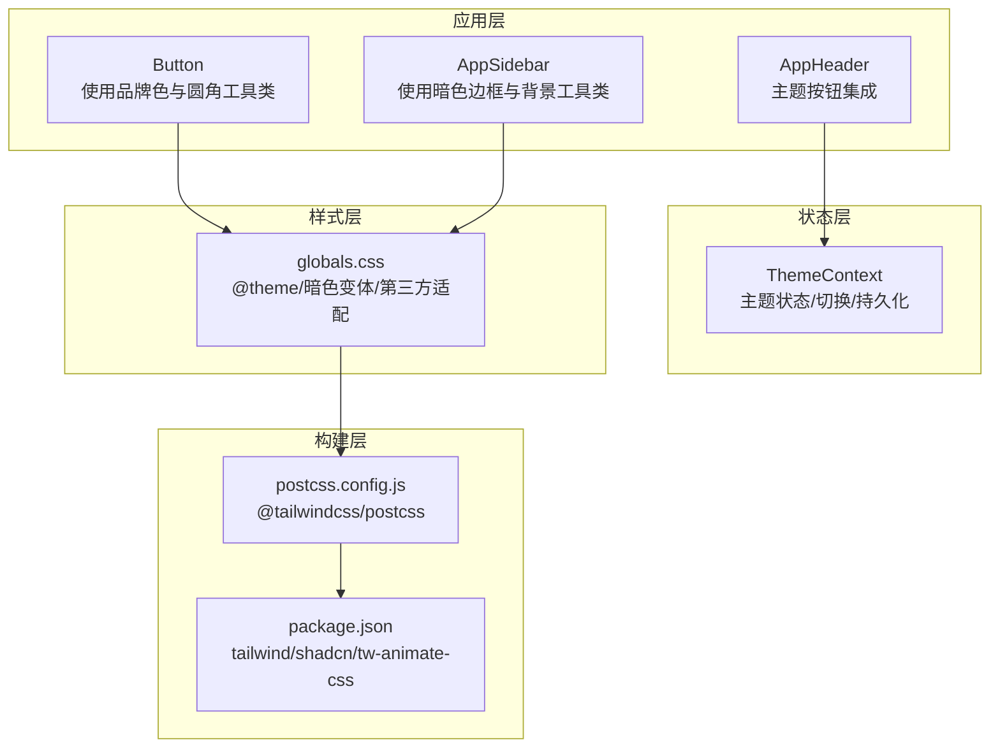
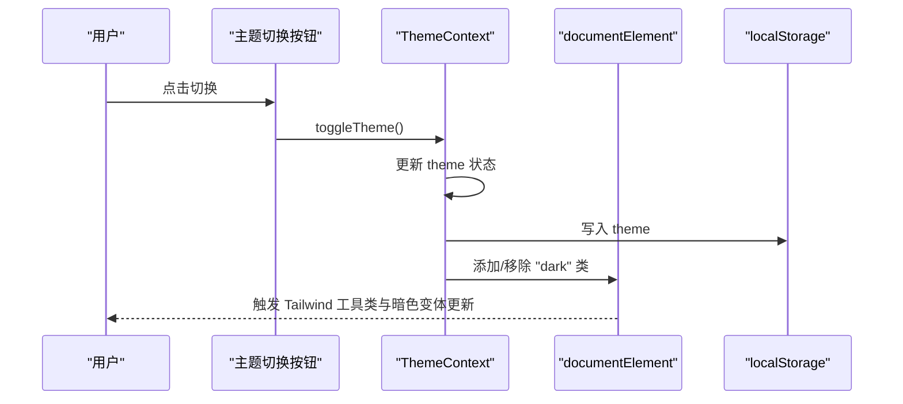
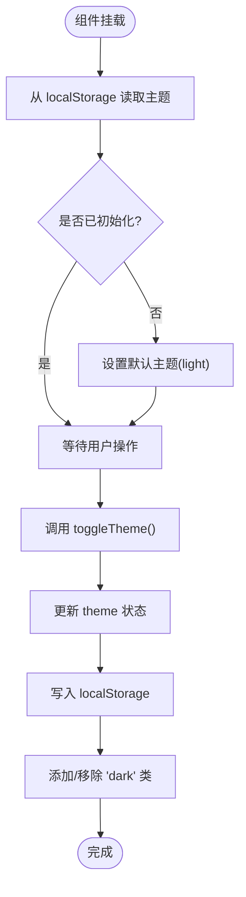
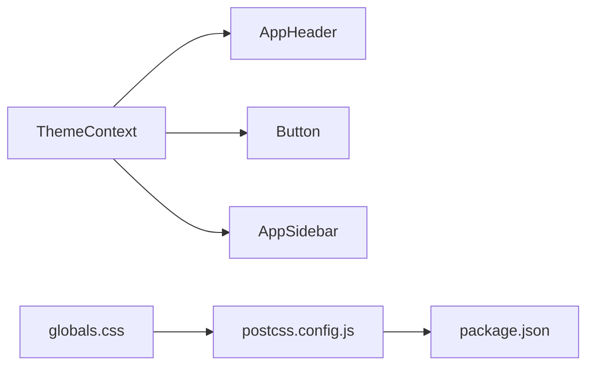

# 主题定制

<cite>
**本文引用的文件**
- [ThemeContext.tsx](file://src/context/ThemeContext.tsx)
- [ThemeToggleButton.tsx](file://src/components/common/ThemeToggleButton.tsx)
- [ThemeTogglerTwo.tsx](file://src/components/common/ThemeTogglerTwo.tsx)
- [AppHeader.tsx](file://src/layout/AppHeader.tsx)
- [AppSidebar.tsx](file://src/layout/AppSidebar.tsx)
- [Button.tsx](file://src/components/ui/button/Button.tsx)
- [globals.css](file://src/app/globals.css)
- [postcss.config.js](file://postcss.config.js)
- [package.json](file://package.json)
- [next.config.ts](file://next.config.ts)
</cite>

## 更新摘要
**变更内容**
- 移除了主题配置系统（themeConfig.ts 和 LayoutConfigHandler.tsx）的相关内容
- 更新了样式系统描述，改为直接使用Tailwind工具类而非CSS变量注入
- 修改了架构图和组件分析，反映新的主题实现方式
- 更新了性能考量和故障排查指南，移除CSS变量相关的内容

## 目录
1. [简介](#简介)
2. [项目结构](#项目结构)
3. [核心组件](#核心组件)
4. [架构总览](#架构总览)
5. [详细组件分析](#详细组件分析)
6. [依赖关系分析](#依赖关系分析)
7. [性能考量](#性能考量)
8. [故障排查指南](#故障排查指南)
9. [结论](#结论)
10. [附录](#附录)

## 简介
本文件系统性梳理该 Next.js 管理面板的主题定制体系，覆盖明暗主题切换机制、Tailwind CSS v4 配置、主题状态管理、组件主题适配、动态主题切换与本地存储持久化。同时提供自定义主题创建指南、颜色系统设计、响应式主题适配与无障碍支持建议、主题扩展开发与品牌定制方案，以及主题性能优化策略，帮助开发者快速定制或扩展主题功能。

## 项目结构
主题系统围绕"上下文状态 + Tailwind CSS v4 主题变量 + 组件适配"展开，关键文件分布如下：
- 上下文与状态：ThemeContext 提供主题状态与切换逻辑，并通过类名与本地存储实现持久化
- 组件入口：AppHeader 中集成主题切换按钮；多个 UI 组件直接消费 Tailwind 工具类
- 样式层：globals.css 定义 @theme 块、暗色变体与第三方库适配样式
- 构建层：postcss.config.js 使用 @tailwindcss/postcss 插件，package.json 指定 tailwind 与 shadcn/tailwind.css

**图表来源**
- [ThemeContext.tsx:15-50](file://src/context/ThemeContext.tsx#L15-L50)
- [AppHeader.tsx:167](file://src/layout/AppHeader.tsx#L167)
- [Button.tsx:43](file://src/components/ui/button/Button.tsx#L43)
- [AppSidebar.tsx:299](file://src/layout/AppSidebar.tsx#L299)
- [globals.css:5](file://src/app/globals.css#L5)
- [postcss.config.js:1](file://postcss.config.js#L1)
- [package.json:26](file://package.json#L26)

**章节来源**
- [ThemeContext.tsx:15-50](file://src/context/ThemeContext.tsx#L15-L50)
- [globals.css:5](file://src/app/globals.css#L5)
- [postcss.config.js:1](file://postcss.config.js#L1)
- [package.json:26](file://package.json#L26)

## 核心组件
- 主题上下文与切换
  - ThemeContext 提供 theme 与 toggleTheme，并在客户端初始化时从 localStorage 读取主题，设置 documentElement 的 dark 类名，同时写回 localStorage 实现持久化
- 主题切换按钮
  - ThemeToggleButton 与 ThemeTogglerTwo 通过 useTheme 调用 toggleTheme 切换明暗主题，图标随 dark 类名自动切换
- 样式与暗色适配
  - globals.css 使用 @theme 定义字体、断点、颜色、阴影、圆角等变量，并在 :root 与 .dark 中分别声明亮/暗两套 OKLCH 色彩空间变量
  - 通过 @custom-variant dark 与暗色类名组合，实现组件级暗色变体
  - 大量第三方组件（如 ApexCharts、Flatpickr、FullCalendar）在暗色下有专门的适配样式

**章节来源**
- [ThemeContext.tsx:15-50](file://src/context/ThemeContext.tsx#L15-L50)
- [ThemeToggleButton.tsx:4](file://src/components/common/ThemeToggleButton.tsx#L4)
- [ThemeTogglerTwo.tsx:5](file://src/components/common/ThemeTogglerTwo.tsx#L5)
- [globals.css:7](file://src/app/globals.css#L7)
- [globals.css:866](file://src/app/globals.css#L866)

## 架构总览
主题系统采用"状态驱动 + Tailwind 主题"的分层架构：
- 状态层：ThemeContext 管理主题状态与切换，localStorage 持久化
- 样式层：globals.css 定义 @theme，支持 OKLCH 色彩空间与暗色变体
- 组件层：UI 组件与页面组件直接消费 Tailwind 工具类，实现一致的主题表现

**图表来源**
- [ThemeContext.tsx:30](file://src/context/ThemeContext.tsx#L30)
- [ThemeContext.tsx:41](file://src/context/ThemeContext.tsx#L41)
- [ThemeToggleButton.tsx:9](file://src/components/common/ThemeToggleButton.tsx#L9)

**章节来源**
- [ThemeContext.tsx:30](file://src/context/ThemeContext.tsx#L30)
- [ThemeContext.tsx:41](file://src/context/ThemeContext.tsx#L41)
- [ThemeToggleButton.tsx:9](file://src/components/common/ThemeToggleButton.tsx#L9)

## 详细组件分析

### 主题上下文与持久化
- 初始化：客户端首次渲染时从 localStorage 读取主题，若无则默认 light
- 切换：toggleTheme 切换 theme，随后 effect 将主题写回 localStorage，并为 documentElement 添加/移除 "dark" 类
- 作用域：ThemeProvider 包裹整个应用，useTheme 在任意子组件中均可访问

**图表来源**
- [ThemeContext.tsx:21](file://src/context/ThemeContext.tsx#L21)
- [ThemeContext.tsx:30](file://src/context/ThemeContext.tsx#L30)
- [ThemeContext.tsx:41](file://src/context/ThemeContext.tsx#L41)

**章节来源**
- [ThemeContext.tsx:15-50](file://src/context/ThemeContext.tsx#L15-L50)

### 主题切换按钮组件
- ThemeToggleButton：小尺寸圆形按钮，内置太阳/月亮图标，点击触发切换
- ThemeTogglerTwo：大尺寸圆形品牌色按钮，同样点击触发切换
- 两者均通过 useTheme 获取 toggleTheme 并绑定 onClick

**章节来源**
- [ThemeToggleButton.tsx:4](file://src/components/common/ThemeToggleButton.tsx#L4)
- [ThemeTogglerTwo.tsx:5](file://src/components/common/ThemeTogglerTwo.tsx#L5)

### 页面头部与侧边栏的主题适配
- AppHeader：在工具区集成 ThemeToggleButton；头部容器使用 Tailwind 工具类控制高度；输入框、按钮等使用品牌色与暗色边框
- AppSidebar：侧边栏容器宽度由 Tailwind 工具类控制；暗色边框与背景与全局样式保持一致；菜单项使用 @utility 定义的激活/非激活态样式

**章节来源**
- [AppHeader.tsx:44](file://src/layout/AppHeader.tsx#L44)
- [AppHeader.tsx:167](file://src/layout/AppHeader.tsx#L167)
- [AppSidebar.tsx:299](file://src/layout/AppSidebar.tsx#L299)

### UI 组件的主题适配
- Button：使用品牌色与圆角工具类，支持 outline 与 primary 两种变体；在暗色下通过 ring 与 hover 背景色实现对比度提升

**章节来源**
- [Button.tsx:34](file://src/components/ui/button/Button.tsx#L34)
- [Button.tsx:43](file://src/components/ui/button/Button.tsx#L43)

### CSS 变量系统与暗色主题
- @theme：统一定义字体、断点、颜色、阴影、圆角等变量
- :root 与 .dark：分别定义亮/暗两套 OKLCH 色彩变量，确保明暗一致性
- @custom-variant dark：为组件提供暗色变体选择器
- 第三方组件适配：针对 ApexCharts、Flatpickr、FullCalendar 等在暗色下的文本、边框、阴影进行针对性样式覆盖

**章节来源**
- [globals.css:7](file://src/app/globals.css#L7)
- [globals.css:831](file://src/app/globals.css#L831)
- [globals.css:866](file://src/app/globals.css#L866)
- [globals.css:5](file://src/app/globals.css#L5)

### Tailwind CSS v4 配置与构建
- postcss.config.js：启用 @tailwindcss/postcss 插件以支持 @theme 与自定义变体
- package.json：引入 tailwind 与 shadcn/tailwind.css，保证组件库与主题变量协同工作

**章节来源**
- [postcss.config.js:1](file://postcss.config.js#L1)
- [package.json:26](file://package.json#L26)

## 依赖关系分析
- 组件依赖
  - AppHeader 依赖 ThemeContext 与 ThemeToggleButton
  - Button 依赖 globals.css 中的品牌色与圆角工具类
  - AppSidebar 依赖 globals.css 的暗色边框与背景工具类
- 配置依赖
  - globals.css 依赖 @tailwindcss/postcss 与 shadcn/tailwind.css
- 运行时依赖
  - ThemeContext 依赖浏览器 API（localStorage、classList）

**图表来源**
- [ThemeContext.tsx:15](file://src/context/ThemeContext.tsx#L15)
- [AppHeader.tsx:167](file://src/layout/AppHeader.tsx#L167)
- [Button.tsx:43](file://src/components/ui/button/Button.tsx#L43)
- [AppSidebar.tsx:299](file://src/layout/AppSidebar.tsx#L299)
- [postcss.config.js:1](file://postcss.config.js#L1)
- [package.json:26](file://package.json#L26)

**章节来源**
- [ThemeContext.tsx:15](file://src/context/ThemeContext.tsx#L15)
- [AppHeader.tsx:167](file://src/layout/AppHeader.tsx#L167)
- [Button.tsx:43](file://src/components/ui/button/Button.tsx#L43)
- [AppSidebar.tsx:299](file://src/layout/AppSidebar.tsx#L299)
- [postcss.config.js:1](file://postcss.config.js#L1)
- [package.json:26](file://package.json#L26)

## 性能考量
- CSS 变量与 @theme：集中定义变量，减少重复计算与样式体积
- 按需注入：移除 LayoutConfigHandler，避免不必要的变量注入
- 暗色切换：通过为 documentElement 添加/移除类名，避免重排与重绘成本
- 第三方组件：对暗色样式进行局部覆盖，避免全局样式污染
- 构建优化：Tailwind v4 与 PostCSS 插件配合，确保按需生成与变量解析

## 故障排查指南
- 切换后样式未生效
  - 检查 documentElement 是否正确添加/移除 "dark" 类
  - 确认 globals.css 中 :root 与 .dark 的变量值是否正确
- 按钮或输入框颜色异常
  - 检查 Button 是否使用了品牌色与圆角工具类
  - 确认暗色下 ring 与 hover 背景工具类是否加载
- 品牌色或布局不一致
  - 检查 globals.css 中的 @theme 变量定义
  - 确认 Tailwind 工具类是否正确应用
- 第三方组件暗色不兼容
  - 查看 globals.css 中对应组件的暗色适配规则
- 构建报错
  - 确认 postcss.config.js 已启用 @tailwindcss/postcss
  - 确认 package.json 中 tailwind 与 shadcn/tailwind.css 版本兼容

**章节来源**
- [ThemeContext.tsx:30](file://src/context/ThemeContext.tsx#L30)
- [globals.css:866](file://src/app/globals.css#L866)
- [Button.tsx:34](file://src/components/ui/button/Button.tsx#L34)
- [postcss.config.js:1](file://postcss.config.js#L1)
- [package.json:26](file://package.json#L26)

## 结论
该主题系统以 ThemeContext 为核心，结合 Tailwind CSS v4 的 @theme 机制，实现了可配置、可扩展、可持久化的明暗主题方案。通过直接使用 Tailwind 工具类，组件层无需感知具体颜色值即可获得一致的主题体验。同时，完善的暗色适配与第三方组件样式覆盖，确保在复杂业务场景中的可用性与一致性。

## 附录

### 自定义主题创建指南
- 设计阶段
  - 明确品牌色阶（主色、悬停色、强调色）与辅助色（成功/错误/警告）
  - 设计明/暗两套 OKLCH 变量，确保对比度与可读性
- 变量定义
  - 在 globals.css 的 @theme 块中定义品牌色与布局参数
  - 使用 Tailwind 工具类进行样式覆盖
- 样式覆盖
  - 在 globals.css 中补充第三方组件的暗色适配
  - 使用 @custom-variant dark 为组件提供暗色变体
- 组件适配
  - UI 组件优先使用 Tailwind 工具类，避免硬编码颜色
  - 对于特殊组件，提供暗色专用样式块

**章节来源**
- [globals.css:7](file://src/app/globals.css#L7)
- [globals.css:5](file://src/app/globals.css#L5)

### 颜色系统设计
- 使用 OKLCH 色彩空间，确保明暗两套变量具备一致的色相与亮度关系
- 为前景/背景/卡片/弹出层/输入框/边框/强调色等建立完整工具类族
- 为暗色模式提供独立的 ring/input/border 工具类，增强可读性与层次感

**章节来源**
- [globals.css:831](file://src/app/globals.css#L831)
- [globals.css:866](file://src/app/globals.css#L866)

### 响应式主题适配
- 使用 @theme 定义断点变量，确保在不同屏幕尺寸下主题表现一致
- 为移动端与桌面端提供不同的暗色边框与背景工具类，提升可读性

**章节来源**
- [globals.css:11](file://src/app/globals.css#L11)

### 无障碍主题支持
- 确保明/暗两套变量满足 WCAG 对比度要求
- 为交互元素提供清晰的焦点环与悬停反馈
- 避免纯色高亮，使用阴影与边框增强层次

**章节来源**
- [globals.css:139](file://src/app/globals.css#L139)
- [globals.css:153](file://src/app/globals.css#L153)

### 主题扩展开发
- 新增品牌色：在 globals.css 的 @theme 块中新增色阶
- 新增组件暗色样式：在 globals.css 中为组件补充暗色变体
- 新增布局参数：在 globals.css 的 @theme 块中新增参数

**章节来源**
- [globals.css:7](file://src/app/globals.css#L7)

### 品牌定制方案
- 通过 globals.css 调整品牌色与布局参数，统一全站风格
- 使用 Tailwind 工具类，确保组件与页面的一致性
- 为品牌专属组件提供暗色专用样式块

**章节来源**
- [Button.tsx:34](file://src/components/ui/button/Button.tsx#L34)

### 主题性能优化建议
- 合理拆分 @theme 块，避免冗余变量
- 使用 Tailwind v4 的按需生成能力，避免未使用样式的打包
- 对第三方组件的暗色样式进行局部覆盖，减少全局影响

**章节来源**
- [postcss.config.js:1](file://postcss.config.js#L1)
- [package.json:26](file://package.json#L26)