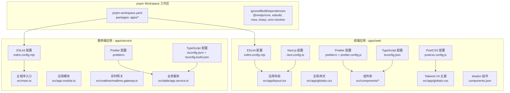
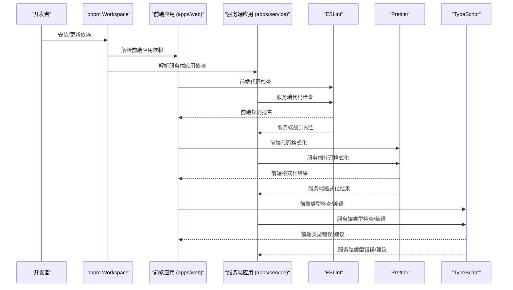
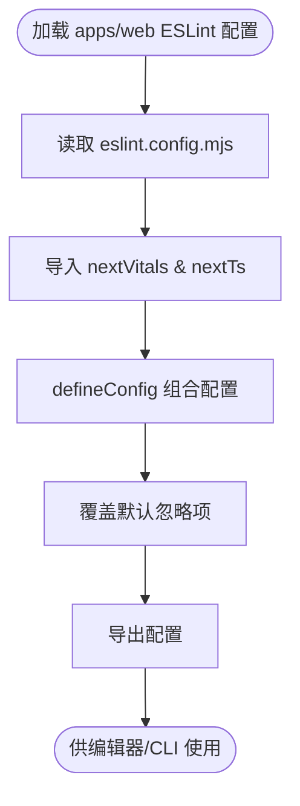
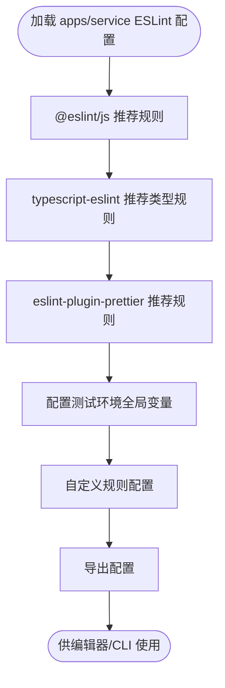
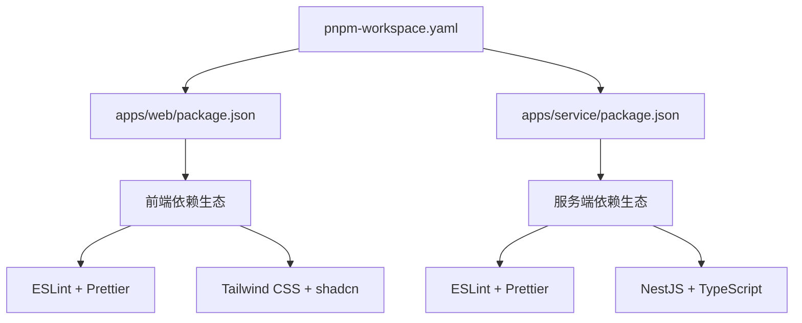

# 开发工具配置

<cite>
**本文引用的文件**
- [pnpm-workspace.yaml](file://pnpm-workspace.yaml)
- [apps/web/package.json](file://apps/web/package.json)
- [apps/service/package.json](file://apps/service/package.json)
- [apps/web/eslint.config.mjs](file://apps/web/eslint.config.mjs)
- [apps/service/eslint.config.mjs](file://apps/service/eslint.config.mjs)
- [apps/web/.prettierrc](file://apps/web/.prettierrc)
- [apps/service/.prettierrc](file://apps/service/.prettierrc)
- [apps/web/prettier.config.js](file://apps/web/prettier.config.js)
- [apps/web/tsconfig.json](file://apps/web/tsconfig.json)
- [apps/service/tsconfig.json](file://apps/service/tsconfig.json)
- [apps/service/tsconfig.build.json](file://apps/service/tsconfig.build.json)
- [apps/web/next.config.ts](file://apps/web/next.config.ts)
- [apps/web/postcss.config.js](file://apps/web/postcss.config.js)
- [apps/web/components.json](file://apps/web/components.json)
- [apps/web/.prettierignore](file://apps/web/.prettierignore)
- [apps/web/src/app/globals.css](file://apps/web/src/app/globals.css)
- [apps/web/src/app/layout.tsx](file://apps/web/src/app/layout.tsx)
- [apps/web/src/components/common/ComponentCard.tsx](file://apps/web/src/components/common/ComponentCard.tsx)
- [README.md](file://README.md)
</cite>

## 更新摘要
**所做更改**
- 新增 pnpm workspace 工作区配置分析
- 新增独立的前端应用 (apps/web) 开发工具配置
- 新增独立的服务端应用 (apps/service) 开发工具配置
- 更新工具链架构图为多包工作区结构
- 新增各应用独立的 ESLint、Prettier、TypeScript 配置分析
- 新增工作区依赖管理与包隔离机制说明

## 目录
1. [简介](#简介)
2. [项目结构](#项目结构)
3. [核心组件](#核心组件)
4. [架构总览](#架构总览)
5. [详细组件分析](#详细组件分析)
6. [依赖关系分析](#依赖关系分析)
7. [性能考量](#性能考量)
8. [故障排查指南](#故障排查指南)
9. [结论](#结论)
10. [附录](#附录)

## 简介
本文件面向需要完善开发环境或标准化团队工具链的开发者，系统梳理并解释该项目基于 pnpm workspace 的多包开发工具配置：ESLint 代码规范、Prettier 代码格式化、Tailwind CSS 样式与 shadcn 组件体系、TypeScript 编译配置。项目采用 pnpm workspace 管理多个独立应用，包括前端 Next.js 应用和 NestJS 服务端应用，每个应用都有独立的开发工具配置，确保团队协作效率与代码质量。

## 项目结构
该工程采用 pnpm workspace 多包架构，前端应用位于 apps/web，服务端应用位于 apps/service。每个应用都拥有独立的开发工具配置，包括 ESLint、Prettier、TypeScript 等，通过 workspace 配置实现依赖共享与包隔离。

**图表来源**
- [pnpm-workspace.yaml:1-10](file://pnpm-workspace.yaml#L1-L10)
- [apps/web/package.json:1-82](file://apps/web/package.json#L1-L82)
- [apps/service/package.json:1-79](file://apps/service/package.json#L1-L79)
- [apps/web/eslint.config.mjs:1-19](file://apps/web/eslint.config.mjs#L1-L19)
- [apps/service/eslint.config.mjs:1-36](file://apps/service/eslint.config.mjs#L1-L36)
- [apps/web/.prettierrc:1-10](file://apps/web/.prettierrc#L1-L10)
- [apps/service/.prettierrc:1-5](file://apps/service/.prettierrc#L1-L5)
- [apps/web/tsconfig.json:1-44](file://apps/web/tsconfig.json#L1-L44)
- [apps/service/tsconfig.json:1-25](file://apps/service/tsconfig.json#L1-L25)

**章节来源**
- [pnpm-workspace.yaml:1-10](file://pnpm-workspace.yaml#L1-L10)
- [apps/web/package.json:1-82](file://apps/web/package.json#L1-L82)
- [apps/service/package.json:1-79](file://apps/service/package.json#L1-L79)

## 核心组件
- **pnpm workspace 工作区管理**
  - packages: apps/* 定义工作区包范围
  - ignoredBuiltDependencies 配置跳过构建的依赖包
  - 实现跨包依赖共享与包隔离
- **前端应用 (apps/web) 开发工具**
  - Next.js 16 + React 19 + TypeScript 5.9
  - 独立 ESLint mjs 配置，继承 Next.js Core Web Vitals 与 TypeScript 规则
  - Prettier + Tailwind CSS 插件集成
  - Tailwind V4 + shadcn 组件体系
- **服务端应用 (apps/service) 开发工具**
  - NestJS 11 + TypeScript 5.7
  - 独立 ESLint mjs 配置，使用 typescript-eslint 推荐配置
  - Prettier + Jest 测试框架
  - TypeScript 严格模式与类型检查
- **工具链统一性**
  - 各应用独立配置但遵循统一的开发规范
  - 通过 workspace 实现依赖版本统一管理

**章节来源**
- [pnpm-workspace.yaml:1-10](file://pnpm-workspace.yaml#L1-L10)
- [apps/web/eslint.config.mjs:1-19](file://apps/web/eslint.config.mjs#L1-L19)
- [apps/service/eslint.config.mjs:1-36](file://apps/service/eslint.config.mjs#L1-L36)
- [apps/web/.prettierrc:1-10](file://apps/web/.prettierrc#L1-L10)
- [apps/service/.prettierrc:1-5](file://apps/service/.prettierrc#L1-L5)
- [apps/web/tsconfig.json:1-44](file://apps/web/tsconfig.json#L1-L44)
- [apps/service/tsconfig.json:1-25](file://apps/service/tsconfig.json#L1-L25)

## 架构总览
下图展示 pnpm workspace 多包架构下的工具链交互：

**图表来源**
- [pnpm-workspace.yaml:1-10](file://pnpm-workspace.yaml#L1-L10)
- [apps/web/eslint.config.mjs:1-19](file://apps/web/eslint.config.mjs#L1-L19)
- [apps/service/eslint.config.mjs:1-36](file://apps/service/eslint.config.mjs#L1-L36)
- [apps/web/prettier.config.js:1-3](file://apps/web/prettier.config.js#L1-L3)

## 详细组件分析

### pnpm workspace 工作区配置分析
- **包定义与管理**
  - packages: apps/* 自动发现 apps 目录下的所有包
  - ignoredBuiltDependencies 跳过特定依赖的原生构建过程
  - 实现跨包依赖共享与本地包链接
- **依赖隔离机制**
  - 每个应用拥有独立的 node_modules
  - 通过 symlinks 实现依赖共享
  - 支持 overrides 覆盖特定包版本
- **构建优化**
  - 跳过原生依赖的构建过程
  - 减少不必要的编译步骤
  - 提升整体构建性能

**章节来源**
- [pnpm-workspace.yaml:1-10](file://pnpm-workspace.yaml#L1-L10)

### 前端应用 (apps/web) 开发工具配置

#### ESLint 配置分析
- **配置形式与继承**
  - 使用 eslint.config.mjs 形式，采用 defineConfig 组合
  - 继承 eslint-config-next 的 core-web-vitals 与 typescript 规则
  - 显式覆盖默认忽略项，确保源码目录被检查
- **规则扩展**
  - 保持 Next.js 推荐的 Web Vitals 性能规则
  - 集成 TypeScript 类型安全检查
  - 支持现代 JavaScript 语法特性

**图表来源**
- [apps/web/eslint.config.mjs:1-19](file://apps/web/eslint.config.mjs#L1-L19)

**章节来源**
- [apps/web/eslint.config.mjs:1-19](file://apps/web/eslint.config.mjs#L1-L19)

#### Prettier 配置分析
- **前端专用配置**
  - .prettierrc 基础格式偏好：分号、单引号、尾随逗号、行长、缩进
  - prettier.config.js 集成 tailwind 插件，确保类名排序
  - .prettierignore 忽略静态资源与构建产物
- **格式化策略**
  - 统一前端代码风格
  - 与 Tailwind CSS 类名排序保持一致
  - 支持多文件格式化

**章节来源**
- [apps/web/.prettierrc:1-10](file://apps/web/.prettierrc#L1-L10)
- [apps/web/prettier.config.js:1-3](file://apps/web/prettier.config.js#L1-L3)
- [apps/web/.prettierignore:1-15](file://apps/web/.prettierignore#L1-L15)

#### TypeScript 配置分析
- **编译选项**
  - 目标 ES2017，支持 DOM/ESNext 库
  - 严格模式、跳过库检查、禁止 emit
  - ESNext 模块解析、JSX 运行时、路径映射
- **多端口支持**
  - 支持 .next 与 .next-3001 等多端口类型缓存
  - 适应开发环境的不同端口配置

**章节来源**
- [apps/web/tsconfig.json:1-44](file://apps/web/tsconfig.json#L1-L44)

### 服务端应用 (apps/service) 开发工具配置

#### ESLint 配置分析
- **配置形式与生态**
  - 使用 @eslint/js 与 typescript-eslint 推荐配置
  - 集成 eslint-plugin-prettier 的推荐规则
  - 支持 Jest 测试环境全局变量
- **规则定制**
  - 关闭 @typescript-eslint/no-explicit-any 规则
  - 将未处理 Promise 与不安全参数标记为警告
  - 集成 Prettier 规则，确保格式一致性

**图表来源**
- [apps/service/eslint.config.mjs:1-36](file://apps/service/eslint.config.mjs#L1-L36)

**章节来源**
- [apps/service/eslint.config.mjs:1-36](file://apps/service/eslint.config.mjs#L1-L36)

#### Prettier 配置分析
- **服务端专用配置**
  - 简化配置：单引号、尾随逗号
  - 专注于服务端代码格式化
  - 与 TypeScript 严格模式配合

**章节来源**
- [apps/service/.prettierrc:1-5](file://apps/service/.prettierrc#L1-L5)

#### TypeScript 配置分析
- **编译选项**
  - 目标 ES2023，支持 Node.js 环境
  - nodenext 模块解析，严格空值检查
  - 源码映射、增量编译、装饰器支持
- **构建配置**
  - tsconfig.build.json 扩展基础配置
  - 排除测试文件与 node_modules
  - 专门用于生产构建

**章节来源**
- [apps/service/tsconfig.json:1-25](file://apps/service/tsconfig.json#L1-L25)
- [apps/service/tsconfig.build.json:1-5](file://apps/service/tsconfig.build.json#L1-L5)

### Tailwind CSS 与 shadcn 组件配置
- **Tailwind V4 配置**
  - 通过 @tailwindcss/postcss 插件集成
  - 支持 @import 与 @theme 变量定义
  - 统一断点、颜色、阴影等设计令牌
- **shadcn 组件系统**
  - components.json 定义组件别名与路径映射
  - 支持 RSC 与 TSX 组件开发
  - 集成 lucide 图标库

**章节来源**
- [apps/web/postcss.config.js:1-6](file://apps/web/postcss.config.js#L1-L6)
- [apps/web/components.json:1-26](file://apps/web/components.json#L1-L26)
- [apps/web/src/app/globals.css:1-20](file://apps/web/src/app/globals.css#L1-L20)

### Next.js 构建与运行配置
- **SVG 处理**
  - Webpack 规则：@svgr/webpack 处理 .svg 文件
  - Turbopack 规则：同构处理 *.svg 映射为 *.js
  - 支持多端口开发环境 (.next 与 .next-3001)
- **开发服务器**
  - 动态 distDir 配置，支持端口切换
  - 热重载与类型检查集成

**章节来源**
- [apps/web/next.config.ts:1-30](file://apps/web/next.config.ts#L1-L30)

## 依赖关系分析
- **workspace 依赖管理**
  - pnpm-workspace.yaml 管理包发现与构建行为
  - ignoredBuiltDependencies 优化原生依赖构建
  - 支持 overrides 覆盖特定包版本
- **前端应用依赖**
  - Next.js 16 + React 19 + TypeScript 5.9
  - Tailwind CSS 4.1.17 + shadcn 组件
  - ESLint 9.39.1 + Prettier 3.8.3
- **服务端应用依赖**
  - NestJS 11.0.1 + TypeScript 5.7.3
  - ESLint 9.18.0 + Prettier 3.4.2
  - Jest 测试框架 + Drizzle ORM

**图表来源**
- [pnpm-workspace.yaml:1-10](file://pnpm-workspace.yaml#L1-L10)
- [apps/web/package.json:1-82](file://apps/web/package.json#L1-L82)
- [apps/service/package.json:1-79](file://apps/service/package.json#L1-L79)

**章节来源**
- [pnpm-workspace.yaml:1-10](file://pnpm-workspace.yaml#L1-L10)
- [apps/web/package.json:1-82](file://apps/web/package.json#L1-L82)
- [apps/service/package.json:1-79](file://apps/service/package.json#L1-L79)

## 性能考量
- **workspace 优化**
  - ignoredBuiltDependencies 跳过原生依赖构建
  - 通过 symlinks 实现依赖共享
  - 支持并行安装与构建
- **前端应用性能**
  - TypeScript 增量编译与严格模式平衡
  - Tailwind V4 变量集中管理
  - Next.js Turbopack 与 Webpack 并行配置
- **服务端应用性能**
  - nodenext 模块解析提升性能
  - 增量编译与严格空值检查
  - Jest 测试框架优化

**章节来源**
- [pnpm-workspace.yaml:1-10](file://pnpm-workspace.yaml#L1-L10)
- [apps/web/tsconfig.json:1-44](file://apps/web/tsconfig.json#L1-L44)
- [apps/service/tsconfig.json:1-25](file://apps/service/tsconfig.json#L1-L25)

## 故障排查指南
- **workspace 相关问题**
  - 确认 pnpm-workspace.yaml 配置正确
  - 检查 ignoredBuiltDependencies 是否影响必要依赖
  - 验证包发现是否正确识别 apps/* 目录
- **前端应用问题**
  - ESLint 冲突：确认 eslint-config-next 与 prettier-config 的兼容性
  - Prettier 格式异常：检查 tailwind 插件配置
  - TypeScript 类型错误：验证 tsconfig.json 的 include/exclude 配置
- **服务端应用问题**
  - ESLint 规则冲突：检查 typescript-eslint 与 prettier-plugin-prettier 的集成
  - TypeScript 编译错误：确认 nodenext 模块解析配置
  - Jest 测试失败：验证测试环境全局变量配置
- **通用问题**
  - 依赖版本冲突：检查 overrides 配置
  - 构建性能问题：确认 ignoredBuiltDependencies 的合理性

**章节来源**
- [pnpm-workspace.yaml:1-10](file://pnpm-workspace.yaml#L1-L10)
- [apps/web/eslint.config.mjs:1-19](file://apps/web/eslint.config.mjs#L1-L19)
- [apps/service/eslint.config.mjs:1-36](file://apps/service/eslint.config.mjs#L1-L36)
- [apps/web/tsconfig.json:1-44](file://apps/web/tsconfig.json#L1-L44)
- [apps/service/tsconfig.json:1-25](file://apps/service/tsconfig.json#L1-L25)

## 结论
本项目已建立完善的 pnpm workspace 多包开发工具链：前端应用使用 Next.js + Tailwind CSS + shadcn 组件体系，服务端应用使用 NestJS + TypeScript + Jest 测试框架。每个应用都有独立的 ESLint、Prettier、TypeScript 配置，通过 workspace 实现依赖共享与包隔离。建议团队在此基础上继续完善 CI/CD 流程、自动化检查与 IDE 集成，确保多包项目的开发效率与代码质量。

## 附录

### 团队协作规范与最佳实践
- **workspace 管理**
  - 统一 pnpm 版本，确保 workspace 功能正常
  - 在 pnpm-workspace.yaml 中明确包范围
  - 合理使用 ignoredBuiltDependencies 优化构建
- **独立应用开发**
  - 每个应用保持独立的开发工具配置
  - 通过 overrides 覆盖特定包版本冲突
  - 统一各应用的 ESLint 规则风格
- **代码审查**
  - PR 必须通过各应用的 lint 与类型检查
  - 跨包依赖变更需同步更新 workspace 配置
  - 对样式变更进行截图对比，确保视觉一致性

### CI/CD 集成建议
- **质量门禁**
  - 安装依赖后执行：lint、type-check、build
  - 各应用独立执行测试与构建
  - 可选：prettier --check 检查格式一致性
- **缓存策略**
  - 缓存 node_modules、.next、tsbuildinfo
  - workspace 级别的 pnpm store 缓存
  - 避免缓存构建产物中的锁文件
- **版本升级**
  - ESLint：遵循各应用生态升级节奏
  - Tailwind：参考官方升级指南
  - TypeScript：小步升级，配合严格模式

### 工具链升级指南
- **workspace 升级**
  - pnpm：关注 workspace 功能增强
  - ignoredBuiltDependencies：根据实际需求调整
  - overrides：定期清理过时覆盖规则
- **前端应用升级**
  - Next.js：同步升级相关依赖
  - Tailwind：适配新版本语法
  - TypeScript：逐步收紧严格选项
- **服务端应用升级**
  - NestJS：关注新版本特性
  - TypeScript：配合类型检查升级
  - Jest：适配测试框架新功能

**章节来源**
- [README.md:110-146](file://README.md#L110-L146)
- [pnpm-workspace.yaml:1-10](file://pnpm-workspace.yaml#L1-L10)
- [apps/web/package.json:1-82](file://apps/web/package.json#L1-L82)
- [apps/service/package.json:1-79](file://apps/service/package.json#L1-L79)