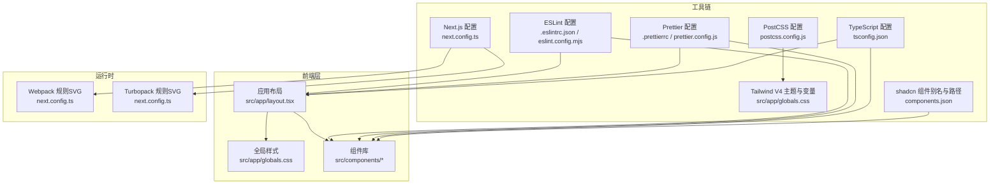
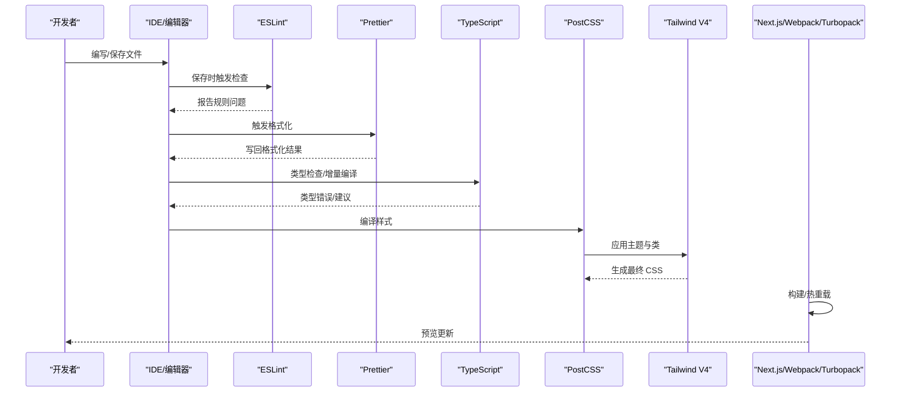
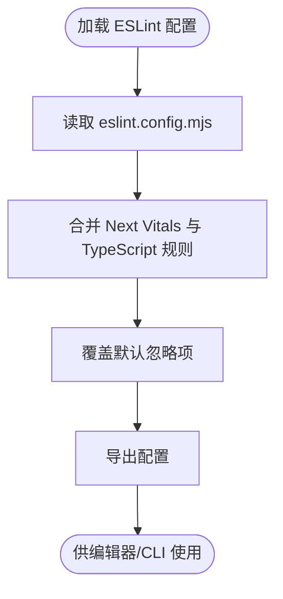
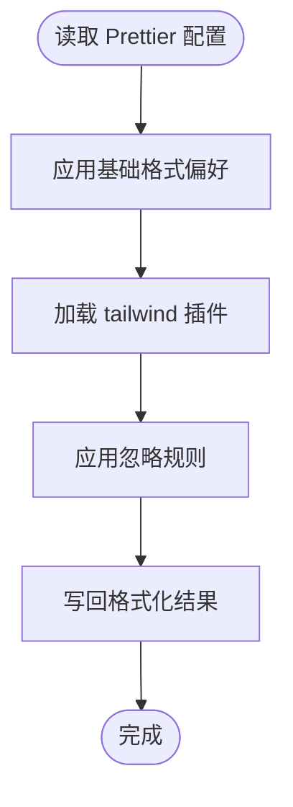
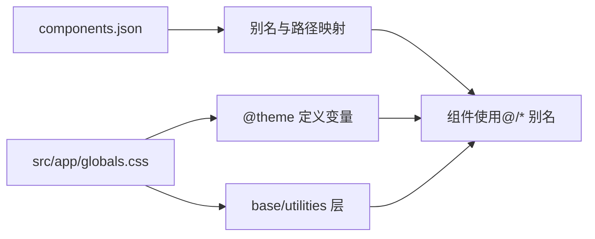
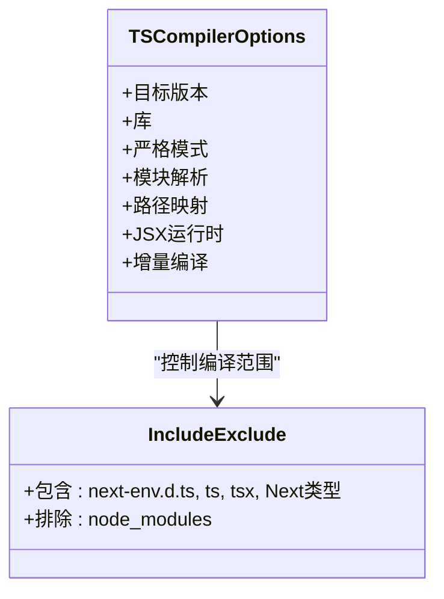
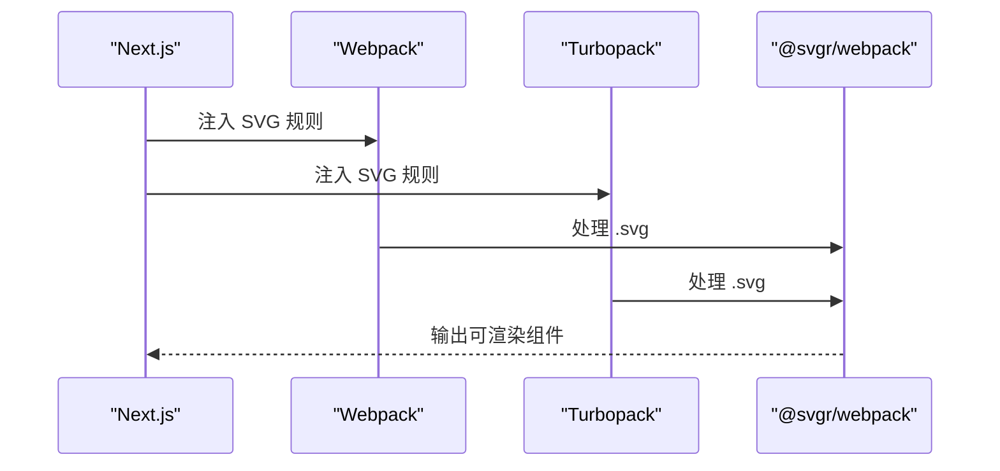
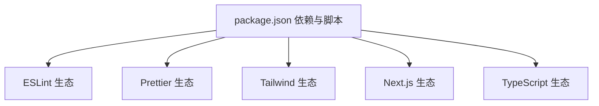

# 开发工具配置

<cite>
**本文引用的文件**
- [package.json](file://package.json)
- [.eslintrc.json](file://.eslintrc.json)
- [eslint.config.mjs](file://eslint.config.mjs)
- [.prettierrc](file://.prettierrc)
- [prettier.config.js](file://prettier.config.js)
- [tsconfig.json](file://tsconfig.json)
- [next.config.ts](file://next.config.ts)
- [postcss.config.js](file://postcss.config.js)
- [components.json](file://components.json)
- [.gitignore](file://.gitignore)
- [src/app/globals.css](file://src/app/globals.css)
- [src/app/layout.tsx](file://src/app/layout.tsx)
- [src/components/common/ComponentCard.tsx](file://src/components/common/ComponentCard.tsx)
- [README.md](file://README.md)
</cite>

## 目录
1. [简介](#简介)
2. [项目结构](#项目结构)
3. [核心组件](#核心组件)
4. [架构总览](#架构总览)
5. [详细组件分析](#详细组件分析)
6. [依赖关系分析](#依赖关系分析)
7. [性能考量](#性能考量)
8. [故障排查指南](#故障排查指南)
9. [结论](#结论)
10. [附录](#附录)

## 简介
本文件面向需要完善开发环境或标准化团队工具链的开发者，系统梳理并解释该项目的开发工具配置：ESLint 代码规范、Prettier 代码格式化、Tailwind CSS 样式与 shadcn 组件体系、TypeScript 编译配置，并给出 IDE 集成、CI/CD 流程建议、最佳实践与升级指南。文档以仓库现有配置为依据，结合代码结构进行说明，帮助团队统一工具链、提升代码质量与协作效率。

## 项目结构
该工程采用 Next.js App Router 架构，前端样式由 Tailwind CSS V4 驱动，配合 shadcn 组件库与 PostCSS 插件链；TypeScript 提供类型安全；ESLint 与 Prettier 贯穿开发期与 CI/CD 的质量门禁；构建与运行通过 Next.js 与 Webpack/Turbopack 配置完成。

图表来源
- [src/app/layout.tsx:1-33](file://src/app/layout.tsx#L1-L33)
- [src/app/globals.css:1-20](file://src/app/globals.css#L1-L20)
- [.eslintrc.json:1-4](file://.eslintrc.json#L1-L4)
- [eslint.config.mjs:1-19](file://eslint.config.mjs#L1-L19)
- [.prettierrc:1-10](file://.prettierrc#L1-L10)
- [prettier.config.js:1-3](file://prettier.config.js#L1-L3)
- [tsconfig.json:1-42](file://tsconfig.json#L1-L42)
- [next.config.ts:1-25](file://next.config.ts#L1-L25)
- [postcss.config.js:1-6](file://postcss.config.js#L1-L6)
- [components.json:1-26](file://components.json#L1-L26)

章节来源
- [package.json:1-79](file://package.json#L1-L79)
- [README.md:1-201](file://README.md#L1-L201)

## 核心组件
- ESLint 代码规范
  - 使用组合配置：Next.js Core Web Vitals 与 TypeScript 规则，并引入 Prettier 扩展以避免格式冲突。
  - 新版配置采用 mjs 形式，显式覆盖默认忽略项，确保源码目录被纳入检查范围。
- Prettier 代码格式化
  - 基础格式偏好：分号、单引号、尾随逗号、行长、缩进等。
  - 集成 Tailwind 插件，使格式化过程尊重 Tailwind 类顺序与排序。
- Tailwind CSS 样式与 shadcn 组件
  - Tailwind V4 通过 @import 与 @theme 定义主题变量、断点、颜色与阴影等。
  - shadcn 组件通过 components.json 统一别名与路径，支持 RSC 与 TSX。
- TypeScript 编译配置
  - 严格模式、ESNext 模块解析、JSX 运行时、路径映射、增量编译等。
- Next.js 构建与运行
  - 自定义 SVG 处理规则，兼容 Webpack 与 Turbopack。
  - PostCSS 链路集成 Tailwind V4 插件。

章节来源
- [.eslintrc.json:1-4](file://.eslintrc.json#L1-L4)
- [eslint.config.mjs:1-19](file://eslint.config.mjs#L1-L19)
- [.prettierrc:1-10](file://.prettierrc#L1-L10)
- [prettier.config.js:1-3](file://prettier.config.js#L1-L3)
- [tsconfig.json:1-42](file://tsconfig.json#L1-L42)
- [next.config.ts:1-25](file://next.config.ts#L1-L25)
- [postcss.config.js:1-6](file://postcss.config.js#L1-L6)
- [components.json:1-26](file://components.json#L1-L26)
- [src/app/globals.css:1-20](file://src/app/globals.css#L1-L20)

## 架构总览
下图展示从编辑器到构建与运行的关键工具链交互：

图表来源
- [.eslintrc.json:1-4](file://.eslintrc.json#L1-L4)
- [eslint.config.mjs:1-19](file://eslint.config.mjs#L1-L19)
- [.prettierrc:1-10](file://.prettierrc#L1-L10)
- [prettier.config.js:1-3](file://prettier.config.js#L1-L3)
- [tsconfig.json:1-42](file://tsconfig.json#L1-L42)
- [postcss.config.js:1-6](file://postcss.config.js#L1-L6)
- [src/app/globals.css:1-20](file://src/app/globals.css#L1-L20)
- [next.config.ts:1-25](file://next.config.ts#L1-L25)

## 详细组件分析

### ESLint 配置分析
- 配置形式
  - 传统 JSON：继承 Next.js Core Web Vitals 与 Prettier 扩展，快速启用基础规则。
  - 新版 mjs：使用 defineConfig 与 nextVitals/nextTs 组合，显式覆盖默认忽略列表，确保源码被检查。
- 忽略策略
  - 默认忽略 .next、out、build、next-env.d.ts 等产物与声明文件。
  - 可根据团队需求在 mjs 中调整 globalIgnores 或新增规则层。
- 规则扩展
  - 可在 mjs 中追加自定义规则层，实现团队特定约束（如禁用 console、限制导入层级等）。

图表来源
- [eslint.config.mjs:1-19](file://eslint.config.mjs#L1-L19)
- [.eslintrc.json:1-4](file://.eslintrc.json#L1-L4)

章节来源
- [.eslintrc.json:1-4](file://.eslintrc.json#L1-L4)
- [eslint.config.mjs:1-19](file://eslint.config.mjs#L1-L19)

### Prettier 配置分析
- 基础格式偏好
  - 分号、单引号、尾随逗号、行长、制表符宽度与换行符等。
- Tailwind 集成
  - 通过插件确保类名排序与 Tailwind 规则一致，避免因格式化导致的类顺序变化。
- 忽略文件
  - .prettierignore 控制不参与格式化的文件集合。

图表来源
- [.prettierrc:1-10](file://.prettierrc#L1-L10)
- [prettier.config.js:1-3](file://prettier.config.js#L1-L3)

章节来源
- [.prettierrc:1-10](file://.prettierrc#L1-L10)
- [prettier.config.js:1-3](file://prettier.config.js#L1-L3)
- [.gitignore:1-38](file://.gitignore#L1-L38)

### Tailwind CSS 与 shadcn 组件配置
- Tailwind V4
  - 通过 @import 引入核心与动画库。
  - 使用 @theme 定义字体、断点、颜色、阴影、z-index 等变量，并在 @layer base 中统一基础样式。
- shadcn 组件
  - components.json 定义组件风格、RSC/TSX 支持、Tailwind 配置路径、CSS 变量开关、别名映射（components/utils/ui/lib/hooks）。
- 实际使用
  - 全局样式文件集中引入 Tailwind 与第三方样式，组件中直接使用变量与工具类。

图表来源
- [src/app/globals.css:1-20](file://src/app/globals.css#L1-L20)
- [components.json:1-26](file://components.json#L1-L26)
- [src/app/layout.tsx:1-33](file://src/app/layout.tsx#L1-L33)

章节来源
- [src/app/globals.css:1-20](file://src/app/globals.css#L1-L20)
- [components.json:1-26](file://components.json#L1-L26)
- [src/app/layout.tsx:1-33](file://src/app/layout.tsx#L1-L33)

### TypeScript 编译配置
- 关键选项
  - 目标与库：ES2017 与 DOM/ESNext。
  - 严格模式、跳过库检查、禁止 emit、模块解析（bundler）、增量编译。
  - JSX 运行时、路径映射 @/* -> ./src/*。
- 包含/排除
  - include 覆盖 next-env.d.ts 与所有 ts/tsx，以及 Next 类型目录。
  - 排除 node_modules。

图表来源
- [tsconfig.json:1-42](file://tsconfig.json#L1-L42)

章节来源
- [tsconfig.json:1-42](file://tsconfig.json#L1-L42)

### Next.js 构建与运行配置
- SVG 处理
  - Webpack 规则：对 .svg 文件使用 @svgr/webpack loader。
  - Turbopack 规则：同构处理，将 *.svg 映射为 *.js。
- PostCSS 链路
  - postcss.config.js 引入 @tailwindcss/postcss 插件，驱动 Tailwind V4 生成样式。

图表来源
- [next.config.ts:1-25](file://next.config.ts#L1-L25)
- [postcss.config.js:1-6](file://postcss.config.js#L1-L6)

章节来源
- [next.config.ts:1-25](file://next.config.ts#L1-L25)
- [postcss.config.js:1-6](file://postcss.config.js#L1-L6)

## 依赖关系分析
- 工具链依赖
  - ESLint 生态：eslint-config-next、eslint-config-prettier、@eslint/eslintrc。
  - Prettier 生态：prettier、prettier-plugin-tailwindcss。
  - Tailwind 生态：tailwindcss、@tailwindcss/postcss、tw-animate-css。
  - Next.js 生态：next、@svgr/webpack。
  - TypeScript 生态：typescript、tsx。
- 脚本命令
  - dev/build/start/lint/db:* 等脚本贯穿开发与数据库工具链。

图表来源
- [package.json:1-79](file://package.json#L1-L79)

章节来源
- [package.json:1-79](file://package.json#L1-L79)

## 性能考量
- TypeScript
  - 启用增量编译与严格模式，平衡类型安全与编译速度。
  - 使用 bundler 模块解析，减少模块解析开销。
- Tailwind V4
  - 在 @theme 中集中定义变量，避免重复计算与无用类。
  - 合理拆分 @layer，减少样式重排。
- Next.js
  - SVG 作为组件处理，避免静态资源体积膨胀。
  - Turbopack 与 Webpack 并行配置，按需选择以获得更快的热重载体验。

章节来源
- [tsconfig.json:1-42](file://tsconfig.json#L1-L42)
- [src/app/globals.css:1-20](file://src/app/globals.css#L1-L20)
- [next.config.ts:1-25](file://next.config.ts#L1-L25)

## 故障排查指南
- ESLint 规则冲突
  - 若出现与 Prettier 的格式冲突，确认已启用 eslint-config-prettier 并保持 Prettier 优先。
  - 在 eslint.config.mjs 中检查是否正确覆盖默认忽略项，确保源码被纳入检查。
- Prettier 格式异常
  - 检查 .prettierrc 与 prettier.config.js 是否存在冲突配置。
  - 确认已安装并启用 tailwind 插件，避免类顺序被打乱。
- Tailwind 类无效
  - 确认 src/app/globals.css 正确引入 Tailwind 与 shadcn 样式。
  - 检查 components.json 中的 tailwind.css 路径与 cssVariables 设置。
- TypeScript 类型错误
  - 检查 tsconfig.json 的 include/exclude 与路径映射，确保源码被包含。
  - 如使用 Next 类型，确认 .next/types 目录未被排除。
- Next.js SVG 加载失败
  - 确认 next.config.ts 中 @svgr/webpack 规则已注入。
  - 检查 Turbopack 规则是否与 Webpack 规则一致。

章节来源
- [.eslintrc.json:1-4](file://.eslintrc.json#L1-L4)
- [eslint.config.mjs:1-19](file://eslint.config.mjs#L1-L19)
- [.prettierrc:1-10](file://.prettierrc#L1-L10)
- [prettier.config.js:1-3](file://prettier.config.js#L1-L3)
- [src/app/globals.css:1-20](file://src/app/globals.css#L1-L20)
- [components.json:1-26](file://components.json#L1-L26)
- [tsconfig.json:1-42](file://tsconfig.json#L1-L42)
- [next.config.ts:1-25](file://next.config.ts#L1-L25)

## 结论
本项目已建立完善的前端工具链：ESLint + Prettier 保障代码质量与一致性；Tailwind V4 + shadcn 组件提供可维护的样式体系；TypeScript 提供强类型支持；Next.js 与 PostCSS 链路确保构建与运行稳定。建议团队在此基础上补充自定义规则、CI/CD 质量门禁与 IDE 集成指南，持续迭代升级。

## 附录

### 团队协作规范与最佳实践
- 统一工具链
  - 团队成员使用相同版本的 Node.js、ESLint、Prettier、TypeScript 与 Tailwind。
  - 在 eslint.config.mjs 中沉淀团队规则层，避免个人差异。
- IDE 集成
  - VS Code：安装 ESLint、Prettier、Tailwind CSS IntelliSense、TypeScript TSServer。
  - 保存即格式化：prettier-vscode 的 “editor.formatOnSave” 与 “editor.defaultFormatter”。
  - ESLint 自动修复：配置 “eslint.validate” 与 “eslint.codeActionsOnSave”。
- 代码审查
  - PR 必须通过 lint 与类型检查。
  - 对样式变更进行截图对比，确保视觉一致性。

### CI/CD 集成建议
- 质量门禁
  - 安装依赖后执行：lint、type-check、build。
  - 可选：prettier 检查（prettier --check）。
- 缓存策略
  - 缓存 node_modules、.next、tsbuildinfo 与 pnpm/yarn 缓存目录。
- 版本升级
  - ESLint：遵循 eslint-config-next 升级节奏，逐步迁移至 mjs 配置。
  - Tailwind：参考官方升级指南，适配新版本语法与变量命名。
  - TypeScript：小步升级，配合严格模式与增量编译降低风险。

### 工具链升级指南
- ESLint
  - 从 .eslintrc.json 迁移到 eslint.config.mjs，逐步添加团队规则层。
- Prettier
  - 保持 .prettierrc 的核心偏好，仅在 prettier.config.js 添加插件。
- Tailwind V4
  - 更新 @import 与 @theme 语法，替换旧类名与兼容样式。
- TypeScript
  - 逐步收紧 strict 选项，修复类型问题。
- Next.js
  - 同步升级 @svgr/webpack 与 Turbopack 规则，确保 SVG 正常渲染。

章节来源
- [README.md:110-146](file://README.md#L110-L146)
- [package.json:1-79](file://package.json#L1-L79)