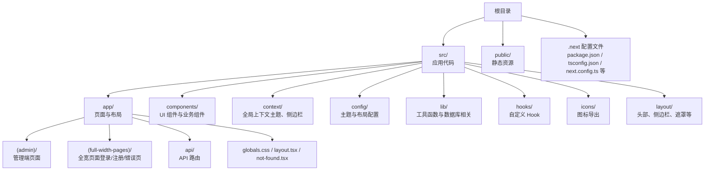
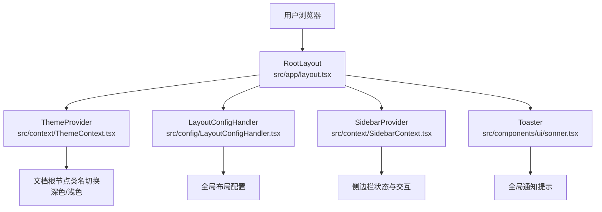
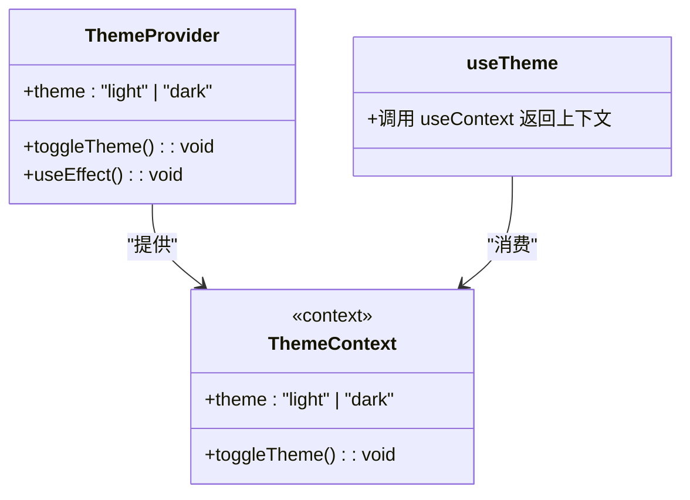
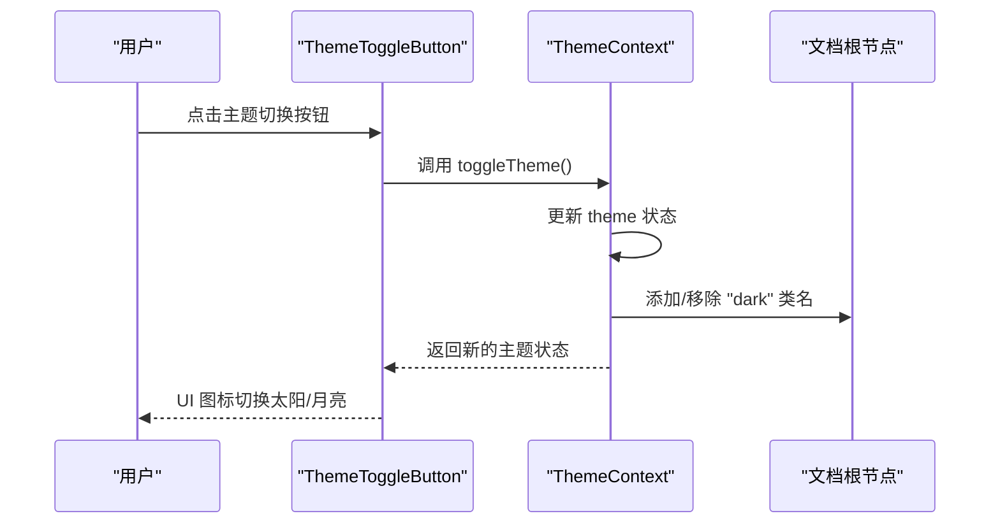
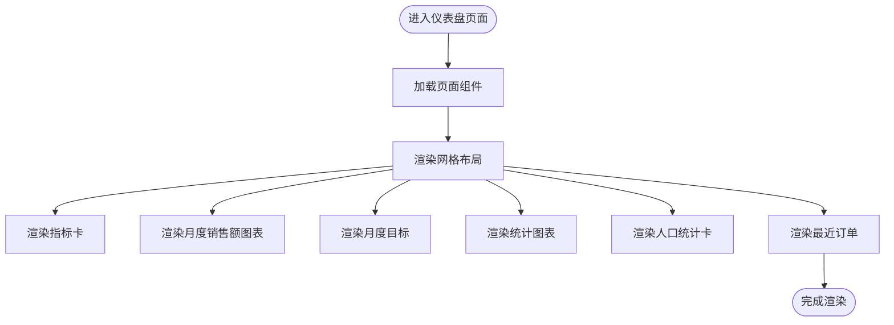
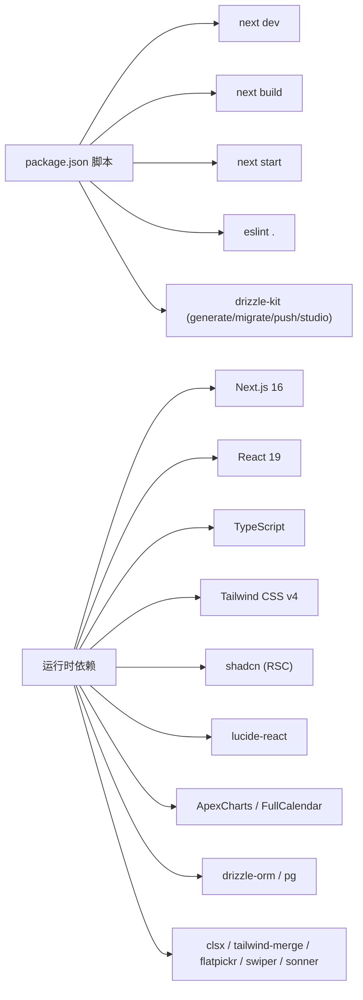

# 快速开始

<cite>
**本文引用的文件**
- [package.json](file://package.json)
- [README.md](file://README.md)
- [next.config.ts](file://next.config.ts)
- [tsconfig.json](file://tsconfig.json)
- [postcss.config.js](file://postcss.config.js)
- [components.json](file://components.json)
- [src/app/layout.tsx](file://src/app/layout.tsx)
- [src/config/themeConfig.ts](file://src/config/themeConfig.ts)
- [src/context/ThemeContext.tsx](file://src/context/ThemeContext.tsx)
- [src/app/(admin)/page.tsx](file://src/app/(admin)/page.tsx)
- [src/components/common/ThemeToggleButton.tsx](file://src/components/common/ThemeToggleButton.tsx)
- [src/lib/utils.ts](file://src/lib/utils.ts)
- [eslint.config.mjs](file://eslint.config.mjs)
- [.prettierrc](file://.prettierrc)
</cite>

## 目录
1. [简介](#简介)
2. [项目结构](#项目结构)
3. [核心组件](#核心组件)
4. [架构总览](#架构总览)
5. [详细组件分析](#详细组件分析)
6. [依赖关系分析](#依赖关系分析)
7. [性能注意事项](#性能注意事项)
8. [故障排除指南](#故障排除指南)
9. [结论](#结论)
10. [附录](#附录)

## 简介
本指南面向初学者，帮助你在本地从零开始快速搭建并运行该 Next.js 管理面板项目。你将学到：
- 技术栈与环境要求：Next.js 16、React 19、TypeScript、Tailwind CSS v4、Node.js 18+
- 安装与初始化：克隆仓库、安装依赖、启动开发服务器
- 常见问题与解决方案
- 项目结构概览与基础配置说明

## 项目结构
该项目采用 Next.js App Router 的目录组织方式，页面与组件分层清晰，便于扩展与维护。

图表来源
- [src/app/layout.tsx:1-33](file://src/app/layout.tsx#L1-L33)
- [src/config/themeConfig.ts:1-31](file://src/config/themeConfig.ts#L1-L31)
- [src/context/ThemeContext.tsx:1-59](file://src/context/ThemeContext.tsx#L1-L59)
- [src/lib/utils.ts:1-7](file://src/lib/utils.ts#L1-L7)

章节来源
- [src/app/layout.tsx:1-33](file://src/app/layout.tsx#L1-L33)
- [src/config/themeConfig.ts:1-31](file://src/config/themeConfig.ts#L1-L31)
- [src/context/ThemeContext.tsx:1-59](file://src/context/ThemeContext.tsx#L1-L59)
- [src/lib/utils.ts:1-7](file://src/lib/utils.ts#L1-L7)

## 核心组件
- 主题系统：通过上下文提供深浅主题切换，并持久化到本地存储。
- 布局与容器：全局根布局负责注入字体、样式与通知组件；主题配置集中管理尺寸与颜色。
- 工具函数：统一的类名合并工具，结合 Tailwind CSS v4 使用更灵活。
- 页面示例：仪表盘首页聚合多个业务卡片与图表组件，展示数据可视化能力。

章节来源
- [src/context/ThemeContext.tsx:1-59](file://src/context/ThemeContext.tsx#L1-L59)
- [src/config/themeConfig.ts:1-31](file://src/config/themeConfig.ts#L1-L31)
- [src/lib/utils.ts:1-7](file://src/lib/utils.ts#L1-L7)
- [src/app/(admin)/page.tsx](file://src/app/(admin)/page.tsx#L1-L43)

## 架构总览
下图展示了从浏览器请求到页面渲染的关键路径，以及主题与布局上下文如何贯穿整个应用。

图表来源
- [src/app/layout.tsx:1-33](file://src/app/layout.tsx#L1-L33)
- [src/context/ThemeContext.tsx:1-59](file://src/context/ThemeContext.tsx#L1-L59)

章节来源
- [src/app/layout.tsx:1-33](file://src/app/layout.tsx#L1-L33)
- [src/context/ThemeContext.tsx:1-59](file://src/context/ThemeContext.tsx#L1-L59)

## 详细组件分析

### 主题系统（ThemeContext）
- 功能要点
  - 提供当前主题（light/dark）与切换函数
  - 客户端初始化时读取本地存储，设置默认主题
  - 切换主题后更新文档根节点类名，驱动 Tailwind CSS 的暗色模式
  - 持久化主题偏好至 localStorage
- 典型用法
  - 在任意子组件中调用钩子获取主题状态与切换函数
  - 通过按钮组件触发切换，实现一键明暗切换

图表来源
- [src/context/ThemeContext.tsx:1-59](file://src/context/ThemeContext.tsx#L1-L59)

章节来源
- [src/context/ThemeContext.tsx:1-59](file://src/context/ThemeContext.tsx#L1-L59)

### 页面布局与主题开关
- 根布局负责注入字体、样式与通知组件，并包裹主题提供者与侧边栏提供者
- 主题开关组件通过上下文切换主题，并在 UI 中显示太阳/月亮图标

图表来源
- [src/components/common/ThemeToggleButton.tsx:1-43](file://src/components/common/ThemeToggleButton.tsx#L1-L43)
- [src/context/ThemeContext.tsx:1-59](file://src/context/ThemeContext.tsx#L1-L59)

章节来源
- [src/components/common/ThemeToggleButton.tsx:1-43](file://src/components/common/ThemeToggleButton.tsx#L1-L43)
- [src/context/ThemeContext.tsx:1-59](file://src/context/ThemeContext.tsx#L1-L59)

### 仪表盘首页（E-commerce Dashboard）
- 页面通过网格布局组合多个业务组件，包括指标卡、销售图表、目标完成度、统计数据与最近订单
- 展示了组件复用与响应式布局的实践

图表来源
- [src/app/(admin)/page.tsx](file://src/app/(admin)/page.tsx#L1-L43)

章节来源
- [src/app/(admin)/page.tsx](file://src/app/(admin)/page.tsx#L1-L43)

## 依赖关系分析
- 包管理与脚本
  - 开发：next dev
  - 构建：next build
  - 启动：next start
  - 代码检查：eslint .
  - 数据库工具链：drizzle-kit（生成/迁移/推送/打开 Studio）
- 关键依赖
  - 运行时：Next.js 16、React 19、TypeScript、Tailwind CSS v4
  - UI：shadcn（RSC 支持）、lucide-react 图标
  - 可视化：ApexCharts、FullCalendar
  - 数据库：drizzle-orm、pg（PostgreSQL）
  - 工具：clsx、tailwind-merge、flatpickr、swiper、sonner
- 开发依赖
  - ESLint、Prettier、Tailwind CSS v4、TypeScript

图表来源
- [package.json:1-79](file://package.json#L1-L79)

章节来源
- [package.json:1-79](file://package.json#L1-L79)

## 性能注意事项
- 使用 Next.js 16 的 App Router 与 React 19 的特性，可获得更好的并发与流式渲染体验
- Tailwind CSS v4 提升了样式编译效率，建议配合按需引入与 Tree Shaking
- 将大型第三方库（如图表、地图）按需加载或懒加载，减少首屏体积
- 合理拆分页面与组件，利用 React 19 的并发特性优化交互流畅度

## 故障排除指南
- Node.js 版本不匹配
  - 环境要求：Node.js 18 或更高版本（推荐 20+）
  - 症状：安装或启动时报错，或构建失败
  - 处理：升级到受支持的版本
- 依赖安装报错（peer dependency）
  - 症状：安装过程中出现 peer 依赖冲突
  - 处理：使用兼容标志或根据项目 overrides 配置处理
- SVG 加载异常
  - 症状：SVG 无法正确渲染
  - 处理：确认 Webpack 配置已启用 @svgr/webpack 规则
- Tailwind CSS v4 样式不生效
  - 症状：类名未被识别或样式未应用
  - 处理：检查 PostCSS 配置与全局样式入口，遵循 v4 语法规范
- ESLint/Prettier 冲突
  - 症状：格式化与规则冲突
  - 处理：参考项目提供的配置文件进行统一

章节来源
- [README.md:43-76](file://README.md#L43-L76)
- [next.config.ts:1-25](file://next.config.ts#L1-L25)
- [postcss.config.js:1-6](file://postcss.config.js#L1-L6)
- [eslint.config.mjs:1-19](file://eslint.config.mjs#L1-L19)
- [.prettierrc:1-10](file://.prettierrc#L1-L10)

## 结论
通过本指南，你可以基于 Next.js 16、React 19、TypeScript 与 Tailwind CSS v4 快速完成项目的克隆、安装与启动。建议在开发过程中关注主题系统、布局上下文与组件复用，以提升开发效率与用户体验。遇到问题时，优先核对 Node.js 版本、依赖安装与 Tailwind v4 配置。

## 附录

### 从零到运行：完整命令清单
- 克隆仓库
  - git clone https://github.com/TailAdmin/free-nextjs-admin-dashboard.git
- 安装依赖
  - npm install 或 yarn install
  - 若出现 peer 依赖冲突，可尝试添加兼容标志
- 启动开发服务器
  - npm run dev 或 yarn dev
- 构建与启动生产服务
  - npm run build && npm run start 或 yarn build && yarn start
- 代码质量
  - npm run lint 或 yarn lint
- 数据库工具链（可选）
  - npm run db:generate / db:migrate / db:push / db:studio

章节来源
- [README.md:49-76](file://README.md#L49-L76)
- [package.json:5-14](file://package.json#L5-L14)

### 环境与配置速览
- Node.js：18+（推荐 20+）
- Next.js：16.x
- React：19.x
- TypeScript：5.x
- Tailwind CSS：v4
- PostCSS：@tailwindcss/postcss
- shadcn：RSC 支持，TSX 启用

章节来源
- [README.md:13-19](file://README.md#L13-L19)
- [tsconfig.json:1-42](file://tsconfig.json#L1-L42)
- [postcss.config.js:1-6](file://postcss.config.js#L1-L6)
- [components.json:1-26](file://components.json#L1-L26)