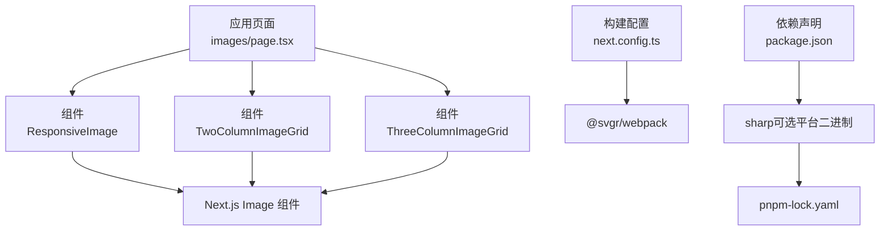
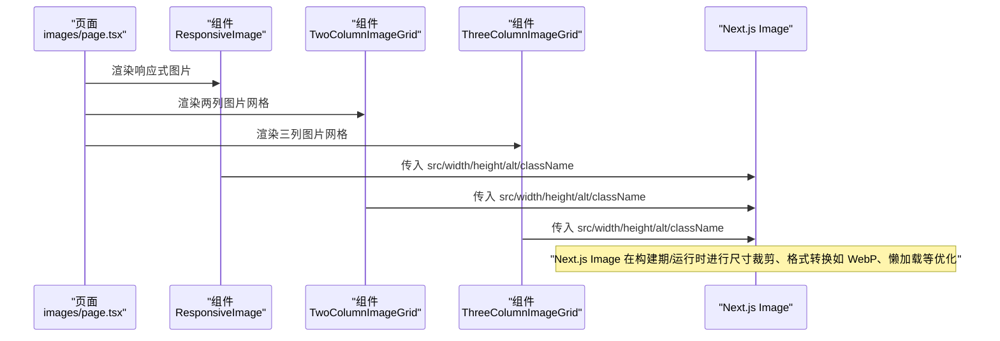
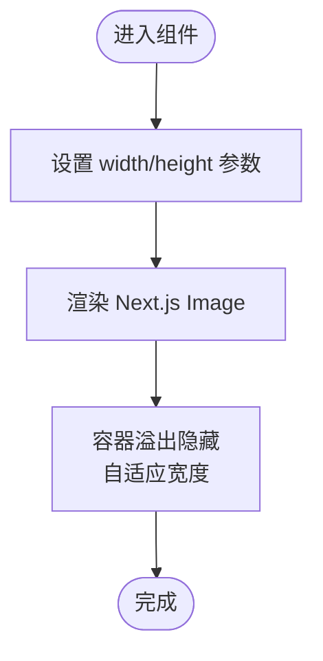
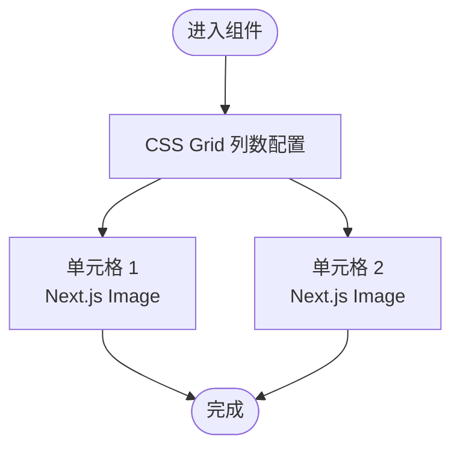
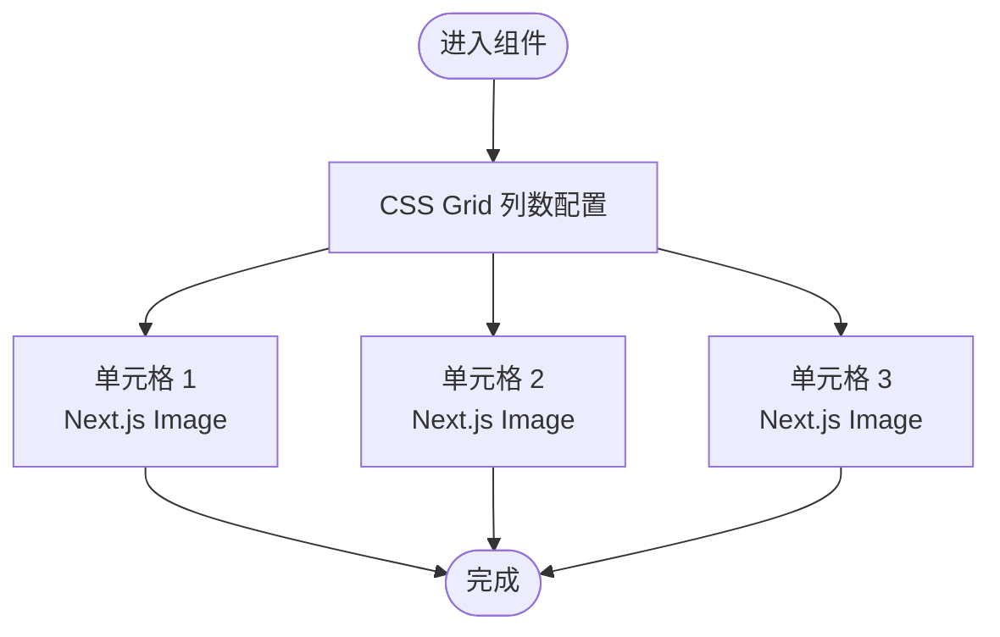
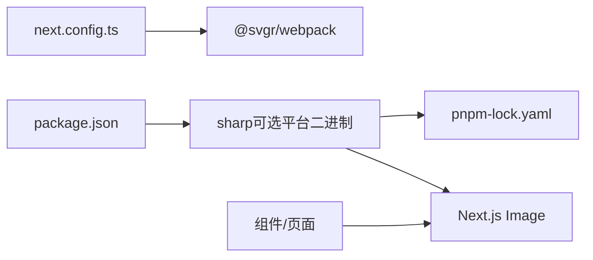

# 图片优化

<cite>
**本文引用的文件**
- [next.config.ts](file://next.config.ts)
- [package.json](file://package.json)
- [src/app/(admin)/(ui-elements)/images/page.tsx](file://src/app/(admin)/(ui-elements)/images/page.tsx)
- [src/components/ui/images/ResponsiveImage.tsx](file://src/components/ui/images/ResponsiveImage.tsx)
- [src/components/ui/images/TwoColumnImageGrid.tsx](file://src/components/ui/images/TwoColumnImageGrid.tsx)
- [src/components/ui/images/ThreeColumnImageGrid.tsx](file://src/components/ui/images/ThreeColumnImageGrid.tsx)
- [pnpm-lock.yaml](file://pnpm-lock.yaml)
- [README.md](file://README.md)
</cite>

## 目录
1. [简介](#简介)
2. [项目结构](#项目结构)
3. [核心组件](#核心组件)
4. [架构总览](#架构总览)
5. [详细组件分析](#详细组件分析)
6. [依赖关系分析](#依赖关系分析)
7. [性能考量](#性能考量)
8. [故障排查指南](#故障排查指南)
9. [结论](#结论)
10. [附录](#附录)

## 简介
本文件围绕本仓库中的图片优化实践进行系统化梳理，重点覆盖以下方面：
- Next.js Image 组件的使用与配置要点（尺寸、响应式、懒加载等）
- 自动格式转换与 WebP 支持现状
- 响应式图片生成与尺寸优化策略
- 质量控制、渐进式图片加载与占位符优化
- CDN 集成思路与缓存策略（结合现有配置）
- 图片压缩算法选择与性能监控方法
- 不同图片类型的优化策略与最佳实践

说明：当前仓库未启用独立的图片处理服务或运行时转换逻辑，主要通过 Next.js Image 组件与构建期依赖（sharp）实现基础优化能力。

## 项目结构
与图片优化直接相关的目录与文件如下：
- 构建配置：next.config.ts（SVG 处理与可选的 Turbopack 规则）
- 依赖声明：package.json（包含 @svgr/webpack、sharp 等）
- 图片示例页面：src/app/(admin)/(ui-elements)/images/page.tsx
- 图片组件：ResponsiveImage、TwoColumnImageGrid、ThreeColumnImageGrid
- 锁定文件：pnpm-lock.yaml（包含 sharp 及其平台二进制）



图表来源
- [src/app/(admin)/(ui-elements)/images/page.tsx:16-33](file://src/app/(admin)/(ui-elements)/images/page.tsx#L16-L33)
- [src/components/ui/images/ResponsiveImage.tsx:1-19](file://src/components/ui/images/ResponsiveImage.tsx#L1-L19)
- [src/components/ui/images/TwoColumnImageGrid.tsx:1-31](file://src/components/ui/images/TwoColumnImageGrid.tsx#L1-L31)
- [src/components/ui/images/ThreeColumnImageGrid.tsx:1-42](file://src/components/ui/images/ThreeColumnImageGrid.tsx#L1-L42)
- [next.config.ts:5-20](file://next.config.ts#L5-L20)
- [package.json:15-49](file://package.json#L15-L49)
- [pnpm-lock.yaml:8597-8627](file://pnpm-lock.yaml#L8597-L8627)

章节来源
- [src/app/(admin)/(ui-elements)/images/page.tsx:16-33](file://src/app/(admin)/(ui-elements)/images/page.tsx#L16-L33)
- [next.config.ts:5-20](file://next.config.ts#L5-L20)
- [package.json:15-49](file://package.json#L15-L49)
- [pnpm-lock.yaml:8597-8627](file://pnpm-lock.yaml#L8597-L8627)

## 核心组件
- 图片示例页：负责组织展示响应式图片与网格布局示例，便于验证 Next.js Image 的行为与样式表现。
- 响应式图片组件：以固定宽高比与容器自适应相结合的方式，确保图片在不同断点下的正确渲染。
- 两列/三列图片网格：通过 CSS Grid 实现多列布局，配合 Next.js Image 的尺寸参数，形成一致的视觉与性能体验。

章节来源
- [src/app/(admin)/(ui-elements)/images/page.tsx:16-33](file://src/app/(admin)/(ui-elements)/images/page.tsx#L16-L33)
- [src/components/ui/images/ResponsiveImage.tsx:1-19](file://src/components/ui/images/ResponsiveImage.tsx#L1-L19)
- [src/components/ui/images/TwoColumnImageGrid.tsx:1-31](file://src/components/ui/images/TwoColumnImageGrid.tsx#L1-L31)
- [src/components/ui/images/ThreeColumnImageGrid.tsx:1-42](file://src/components/ui/images/ThreeColumnImageGrid.tsx#L1-L42)

## 架构总览
下图展示了从页面到组件再到 Next.js Image 的调用链路，并标注了与图片优化相关的关键点（尺寸、响应式、懒加载、格式支持）：



图表来源
- [src/app/(admin)/(ui-elements)/images/page.tsx:16-33](file://src/app/(admin)/(ui-elements)/images/page.tsx#L16-L33)
- [src/components/ui/images/ResponsiveImage.tsx:8-15](file://src/components/ui/images/ResponsiveImage.tsx#L8-L15)
- [src/components/ui/images/TwoColumnImageGrid.tsx:8-15](file://src/components/ui/images/TwoColumnImageGrid.tsx#L8-L15)
- [src/components/ui/images/ThreeColumnImageGrid.tsx:8-15](file://src/components/ui/images/ThreeColumnImageGrid.tsx#L8-L15)

## 详细组件分析

### 响应式图片组件（ResponsiveImage）
- 使用 Next.js Image 组件，显式传入 width 与 height，确保布局稳定与无塌陷。
- 容器采用 overflow-hidden 与自适应宽度，结合样式属性保持比例与边框圆角。
- 该模式适合单张大图或封面图场景，优先保证视觉一致性。



图表来源
- [src/components/ui/images/ResponsiveImage.tsx:4-19](file://src/components/ui/images/ResponsiveImage.tsx#L4-L19)

章节来源
- [src/components/ui/images/ResponsiveImage.tsx:1-19](file://src/components/ui/images/ResponsiveImage.tsx#L1-L19)

### 两列图片网格（TwoColumnImageGrid）
- 通过 CSS Grid 在小屏为单列、中屏为双列，实现响应式布局。
- 每个格子内嵌 Next.js Image，统一传入尺寸参数，保证网格对齐与加载性能。



图表来源
- [src/components/ui/images/TwoColumnImageGrid.tsx:4-31](file://src/components/ui/images/TwoColumnImageGrid.tsx#L4-L31)

章节来源
- [src/components/ui/images/TwoColumnImageGrid.tsx:1-31](file://src/components/ui/images/TwoColumnImageGrid.tsx#L1-L31)

### 三列图片网格（ThreeColumnImageGrid）
- 在更大屏幕下扩展为三列，进一步提升信息密度。
- 同样基于 Next.js Image 的尺寸参数与容器自适应，确保在各断点下的一致体验。



图表来源
- [src/components/ui/images/ThreeColumnImageGrid.tsx:4-42](file://src/components/ui/images/ThreeColumnImageGrid.tsx#L4-L42)

章节来源
- [src/components/ui/images/ThreeColumnImageGrid.tsx:1-42](file://src/components/ui/images/ThreeColumnImageGrid.tsx#L1-L42)

### 图片示例页（Images 页面）
- 聚合展示响应式图片与网格组件，便于在开发与测试环境中观察效果。
- 提供面包屑导航与卡片容器，符合模板化组件风格。

```mermaid
sequenceDiagram
participant U as "用户"
participant P as "Images 页面"
participant R as "ResponsiveImage"
participant T as "TwoColumnImageGrid"
participant Th as "ThreeColumnImageGrid"
U->>P : 访问 Images 页面
P->>R : 渲染响应式图片
P->>T : 渲染两列网格
P->>Th : 渲染三列网格
Note over P,R,T,Th : "验证 Next.js Image 的尺寸、懒加载与格式支持"
```

图表来源
- [src/app/(admin)/(ui-elements)/images/page.tsx:16-33](file://src/app/(admin)/(ui-elements)/images/page.tsx#L16-L33)

章节来源
- [src/app/(admin)/(ui-elements)/images/page.tsx:1-34](file://src/app/(admin)/(ui-elements)/images/page.tsx#L1-L34)

## 依赖关系分析
- 构建期 SVG 处理：通过 @svgr/webpack 将 SVG 作为 React 组件引入，便于在组件中直接使用 SVG。
- 图片处理能力：项目依赖 sharp（可选平台二进制），用于在构建期进行图像编解码与格式转换（如 WebP）。锁定文件显示 sharp 的多种平台二进制存在，表明项目具备跨平台的图像处理能力。
- Next.js Image：作为官方图片组件，负责在构建期/运行时进行尺寸裁剪、格式转换（如 WebP）、懒加载与缓存策略协同。



图表来源
- [next.config.ts:5-20](file://next.config.ts#L5-L20)
- [package.json:15-49](file://package.json#L15-L49)
- [pnpm-lock.yaml:8597-8627](file://pnpm-lock.yaml#L8597-L8627)

章节来源
- [next.config.ts:5-20](file://next.config.ts#L5-L20)
- [package.json:15-49](file://package.json#L15-L49)
- [pnpm-lock.yaml:8597-8627](file://pnpm-lock.yaml#L8597-L8627)

## 性能考量
- 尺寸优化与响应式生成
  - 显式传入 width/height 可帮助浏览器计算布局，避免 FOIT/FOIC。
  - 结合容器自适应与 CSS Grid，可在不同断点下呈现合适尺寸的图片，减少带宽消耗。
- 质量控制
  - Next.js Image 默认会根据设备像素比与容器尺寸生成合适的尺寸变体；质量可通过构建配置或运行时参数调整（具体取决于版本与配置）。
- WebP 格式支持
  - 项目依赖 sharp，具备生成 WebP 等现代格式的能力；实际是否启用取决于运行环境与浏览器支持情况。
- 渐进式图片加载与占位符
  - 当前组件未显式传入 placeholder 或 blurDataURL，若需渐进式加载，可在组件中添加相应参数以提升感知性能。
- 懒加载
  - Next.js Image 默认启用懒加载，有助于首屏性能；请确保图片位于视窗外时不会阻塞首屏渲染。
- 缓存策略与浏览器缓存
  - 由于未配置独立的图片服务或 CDN，建议在生产部署时结合边缘缓存（如 Vercel Edge Cache 或反向代理缓存）与合理的 HTTP 缓存头，以降低重复请求成本。
- 压缩算法选择
  - 项目具备 sharp 能力，可在构建期对 PNG/JPEG/WebP 等格式进行压缩；建议根据图片类型与目标浏览器选择最优编码参数。
- 性能监控与加载时间分析
  - 建议在页面埋点记录图片首次绘制时间（FCP/FID/LCP）与加载耗时，结合浏览器开发者工具与网络面板进行分析。
- 用户体验优化建议
  - 为关键路径图片提供较小尺寸的占位符或骨架屏，减少感知延迟。
  - 对于长列表图片，优先使用虚拟滚动与按需加载，避免一次性渲染过多图片。

## 故障排查指南
- 图片不显示或尺寸异常
  - 检查组件中是否正确传入 width/height，以及容器样式是否限制了显示区域。
  - 确认资源路径有效且存在于 public/images 中。
- 格式不兼容或加载缓慢
  - 若目标浏览器不支持 WebP，可回退至 JPEG/PNG；同时确认构建是否启用了格式转换。
- 构建失败或缺少平台二进制
  - 检查 pnpm-lock.yaml 中 sharp 的平台二进制是否存在；必要时清理缓存并重新安装依赖。
- SVG 引用问题
  - 确认 next.config.ts 已配置 @svgr/webpack，以便将 SVG 作为组件使用。

章节来源
- [src/components/ui/images/ResponsiveImage.tsx:8-15](file://src/components/ui/images/ResponsiveImage.tsx#L8-L15)
- [src/components/ui/images/TwoColumnImageGrid.tsx:8-15](file://src/components/ui/images/TwoColumnImageGrid.tsx#L8-L15)
- [src/components/ui/images/ThreeColumnImageGrid.tsx:8-15](file://src/components/ui/images/ThreeColumnImageGrid.tsx#L8-L15)
- [next.config.ts:5-20](file://next.config.ts#L5-L20)
- [pnpm-lock.yaml:8597-8627](file://pnpm-lock.yaml#L8597-L8627)

## 结论
本仓库已具备使用 Next.js Image 进行图片优化的基础能力：显式尺寸、响应式布局与默认懒加载。结合 sharp 的平台二进制，项目可在构建期进行格式转换与压缩。为进一步提升性能与体验，建议：
- 在需要时启用占位符与渐进式加载
- 配置边缘缓存与合理的 HTTP 缓存头
- 根据图片类型与目标浏览器选择最优压缩参数
- 埋点监控图片加载性能并持续优化

## 附录
- 项目版本与技术栈概览可参考项目自述文件与依赖声明。

章节来源
- [README.md:1-201](file://README.md#L1-L201)
- [package.json:15-49](file://package.json#L15-L49)