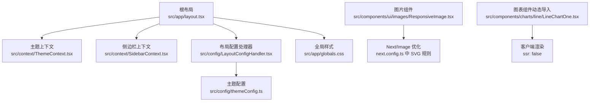
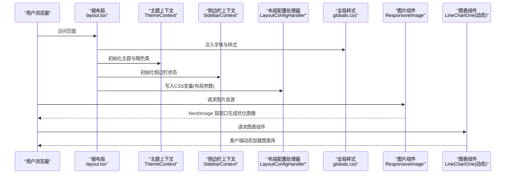
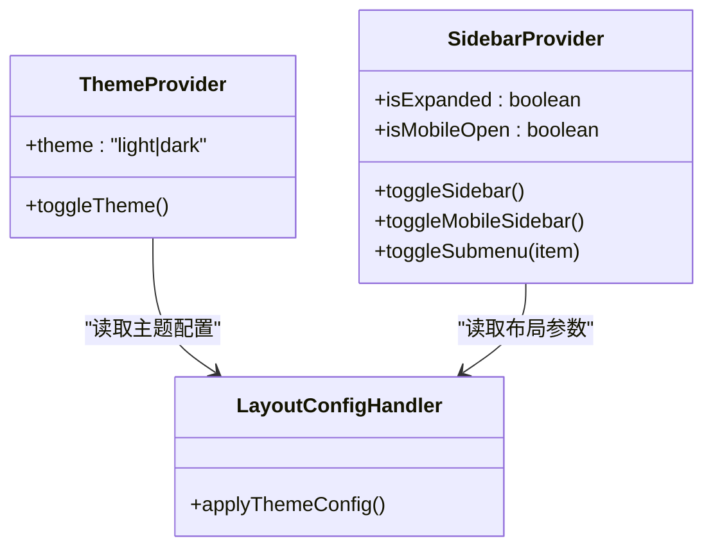
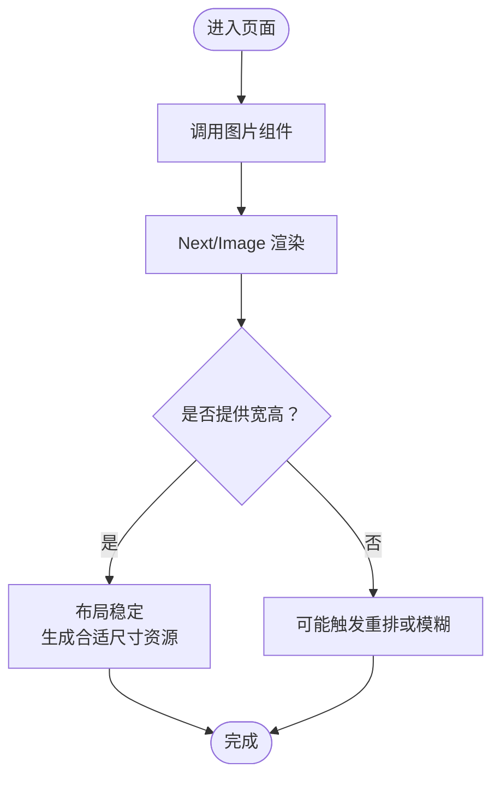
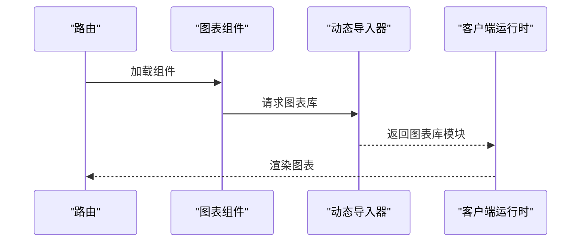
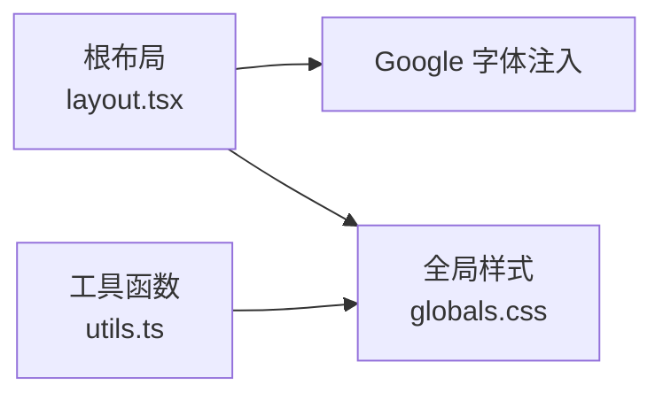
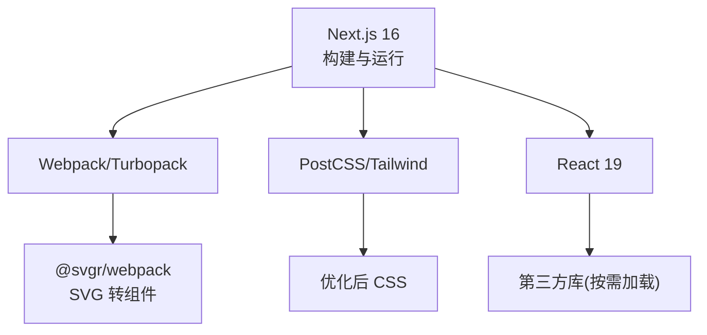

# 性能优化

<cite>
**本文引用的文件**
- [next.config.ts](file://next.config.ts)
- [package.json](file://package.json)
- [src/app/layout.tsx](file://src/app/layout.tsx)
- [src/app/globals.css](file://src/app/globals.css)
- [src/components/ui/images/ResponsiveImage.tsx](file://src/components/ui/images/ResponsiveImage.tsx)
- [src/components/charts/line/LineChartOne.tsx](file://src/components/charts/line/LineChartOne.tsx)
- [src/context/ThemeContext.tsx](file://src/context/ThemeContext.tsx)
- [src/context/SidebarContext.tsx](file://src/context/SidebarContext.tsx)
- [src/config/LayoutConfigHandler.tsx](file://src/config/LayoutConfigHandler.tsx)
- [src/config/themeConfig.ts](file://src/config/themeConfig.ts)
- [src/lib/utils.ts](file://src/lib/utils.ts)
- [postcss.config.js](file://postcss.config.js)
</cite>

## 目录
1. [简介](#简介)
2. [项目结构](#项目结构)
3. [核心组件](#核心组件)
4. [架构总览](#架构总览)
5. [详细组件分析](#详细组件分析)
6. [依赖关系分析](#依赖关系分析)
7. [性能考量](#性能考量)
8. [故障排查指南](#故障排查指南)
9. [结论](#结论)
10. [附录](#附录)

## 简介
本文件面向需要深入优化 Next.js 16 应用性能的高级开发者，系统梳理项目在构建与运行期的性能特性与优化策略，覆盖代码分割、图片优化、组件懒加载、SSR/ISR 缓存、预取与预渲染、性能监控与瓶颈分析、内存与网络优化、以及性能测试与评估方法。内容基于仓库现有配置与实现进行提炼，并提供可操作的改进建议与可视化图示。

## 项目结构
该项目采用 App Router 的目录组织方式，页面按功能域分组，组件按复用性拆分，样式通过 Tailwind CSS v4 与自定义变量统一管理。根布局负责字体、主题上下文与全局样式注入；图片组件使用 Next/Image 进行响应式优化；图表组件通过动态导入实现客户端侧渲染与代码分割；主题与布局配置通过上下文与 CSS 变量注入实现运行时切换与布局一致性。

**图表来源**
- [src/app/layout.tsx:16-32](file://src/app/layout.tsx#L16-L32)
- [src/context/ThemeContext.tsx:15-49](file://src/context/ThemeContext.tsx#L15-L49)
- [src/context/SidebarContext.tsx:27-82](file://src/context/SidebarContext.tsx#L27-L82)
- [src/config/LayoutConfigHandler.tsx:6-26](file://src/config/LayoutConfigHandler.tsx#L6-L26)
- [src/config/themeConfig.ts:4-30](file://src/config/themeConfig.ts#L4-L30)
- [src/app/globals.css:1-20](file://src/app/globals.css#L1-L20)
- [src/components/ui/images/ResponsiveImage.tsx:4-18](file://src/components/ui/images/ResponsiveImage.tsx#L4-L18)
- [next.config.ts:5-11](file://next.config.ts#L5-L11)
- [src/components/charts/line/LineChartOne.tsx:6-10](file://src/components/charts/line/LineChartOne.tsx#L6-L10)

**章节来源**
- [src/app/layout.tsx:16-32](file://src/app/layout.tsx#L16-L32)
- [src/app/globals.css:1-20](file://src/app/globals.css#L1-L20)
- [next.config.ts:5-11](file://next.config.ts#L5-L11)

## 核心组件
- 主题与布局上下文：提供主题切换、暗色类注入、侧边栏状态与移动端适配，减少不必要的重渲染并提升交互流畅度。
- 布局配置处理器：将主题配置映射为 CSS 变量，实现运行时布局参数调整，避免样式层反复计算。
- 图片组件：使用 Next/Image 并传入宽高，确保布局稳定与资源按视口尺寸生成，结合全局 SVG 处理规则提升图标加载效率。
- 动态图表组件：对重型图表库进行客户端侧动态导入，避免 SSR 期间加载大体积依赖，降低首屏 JS 体积。

**章节来源**
- [src/context/ThemeContext.tsx:15-49](file://src/context/ThemeContext.tsx#L15-L49)
- [src/context/SidebarContext.tsx:27-82](file://src/context/SidebarContext.tsx#L27-L82)
- [src/config/LayoutConfigHandler.tsx:6-26](file://src/config/LayoutConfigHandler.tsx#L6-L26)
- [src/config/themeConfig.ts:4-30](file://src/config/themeConfig.ts#L4-L30)
- [src/components/ui/images/ResponsiveImage.tsx:4-18](file://src/components/ui/images/ResponsiveImage.tsx#L4-L18)
- [src/components/charts/line/LineChartOne.tsx:6-10](file://src/components/charts/line/LineChartOne.tsx#L6-L10)

## 架构总览
下图展示从请求到渲染的关键路径，包括字体与样式注入、主题与布局上下文初始化、图片与图表组件的加载策略，以及构建期对 SVG 的处理。

**图表来源**
- [src/app/layout.tsx:16-32](file://src/app/layout.tsx#L16-L32)
- [src/context/ThemeContext.tsx:15-49](file://src/context/ThemeContext.tsx#L15-L49)
- [src/context/SidebarContext.tsx:27-82](file://src/context/SidebarContext.tsx#L27-L82)
- [src/config/LayoutConfigHandler.tsx:6-26](file://src/config/LayoutConfigHandler.tsx#L6-L26)
- [src/app/globals.css:1-20](file://src/app/globals.css#L1-L20)
- [src/components/ui/images/ResponsiveImage.tsx:4-18](file://src/components/ui/images/ResponsiveImage.tsx#L4-L18)
- [src/components/charts/line/LineChartOne.tsx:6-10](file://src/components/charts/line/LineChartOne.tsx#L6-L10)

## 详细组件分析

### 主题与布局上下文
- 主题上下文：在客户端初始化主题并持久化到本地存储，切换时仅更新根元素的暗色类，避免全量重绘。
- 侧边栏上下文：根据窗口宽度自动切换移动端状态，提供展开/收起与子菜单切换能力，减少服务端负担。
- 布局配置处理器：将主题配置映射为 CSS 变量，实现运行时布局参数调整，无需重新编译样式。

**图表来源**
- [src/context/ThemeContext.tsx:15-49](file://src/context/ThemeContext.tsx#L15-L49)
- [src/context/SidebarContext.tsx:27-82](file://src/context/SidebarContext.tsx#L27-L82)
- [src/config/LayoutConfigHandler.tsx:6-26](file://src/config/LayoutConfigHandler.tsx#L6-L26)
- [src/config/themeConfig.ts:4-30](file://src/config/themeConfig.ts#L4-L30)

**章节来源**
- [src/context/ThemeContext.tsx:15-49](file://src/context/ThemeContext.tsx#L15-L49)
- [src/context/SidebarContext.tsx:27-82](file://src/context/SidebarContext.tsx#L27-L82)
- [src/config/LayoutConfigHandler.tsx:6-26](file://src/config/LayoutConfigHandler.tsx#L6-L26)
- [src/config/themeConfig.ts:4-30](file://src/config/themeConfig.ts#L4-L30)

### 图片优化与代码分割
- 图片组件使用 Next/Image，并显式传入宽高，确保布局稳定与资源按视口生成，减少重排与放大失真。
- 构建期对 SVG 进行处理，将 SVG 转换为可直接导入的组件，降低运行期解析成本。

**图表来源**
- [src/components/ui/images/ResponsiveImage.tsx:4-18](file://src/components/ui/images/ResponsiveImage.tsx#L4-L18)
- [next.config.ts:5-11](file://next.config.ts#L5-L11)

**章节来源**
- [src/components/ui/images/ResponsiveImage.tsx:4-18](file://src/components/ui/images/ResponsiveImage.tsx#L4-L18)
- [next.config.ts:5-11](file://next.config.ts#L5-L11)

### 组件懒加载与 SSR 策略
- 图表组件通过动态导入并在客户端渲染，避免 SSR 期间加载重型依赖，降低首屏 JS 体积与首字节时间。
- 该策略适用于非关键路径的重型第三方库，建议对所有非首屏使用的重型组件采用相同模式。

**图表来源**
- [src/components/charts/line/LineChartOne.tsx:6-10](file://src/components/charts/line/LineChartOne.tsx#L6-L10)

**章节来源**
- [src/components/charts/line/LineChartOne.tsx:6-10](file://src/components/charts/line/LineChartOne.tsx#L6-L10)

### 样式与字体优化
- 根布局注入 Google 字体与全局样式，配合 Tailwind CSS v4 与 CSS 变量，减少重复样式与运行期计算。
- 使用工具函数合并类名，避免冗余样式叠加导致的重绘。

**图表来源**
- [src/app/layout.tsx:16-32](file://src/app/layout.tsx#L16-L32)
- [src/app/globals.css:1-20](file://src/app/globals.css#L1-L20)
- [src/lib/utils.ts:4-6](file://src/lib/utils.ts#L4-L6)

**章节来源**
- [src/app/layout.tsx:16-32](file://src/app/layout.tsx#L16-L32)
- [src/app/globals.css:1-20](file://src/app/globals.css#L1-L20)
- [src/lib/utils.ts:4-6](file://src/lib/utils.ts#L4-L6)

## 依赖关系分析
- 构建期：Next.js 16 配合 PostCSS 与 Tailwind 插件，构建阶段生成优化后的 CSS；SVG 在 Webpack/Turbopack 中被转换为组件，减少运行期开销。
- 运行期：React 19 与 React DOM 19 提供稳定的渲染与调度能力；大量第三方库（如图表、地图、日历等）按需加载，降低初始包体。

**图表来源**
- [package.json:35-42](file://package.json#L35-L42)
- [postcss.config.js:1-5](file://postcss.config.js#L1-L5)
- [next.config.ts:5-11](file://next.config.ts#L5-L11)

**章节来源**
- [package.json:35-42](file://package.json#L35-L42)
- [postcss.config.js:1-5](file://postcss.config.js#L1-L5)
- [next.config.ts:5-11](file://next.config.ts#L5-L11)

## 性能考量
- 代码分割与懒加载
  - 对重型第三方库采用动态导入，仅在客户端渲染时加载，降低首屏 JS 体积。
  - 将非关键路径组件（如图表、地图、日历）延迟加载，优先保证首屏内容可用。
- 图片优化
  - 使用 Next/Image 并提供宽高，确保布局稳定与资源按视口生成。
  - 构建期将 SVG 转换为组件，减少运行期解析与网络往返。
- SSR/ISR 与缓存
  - 利用 Next.js 的 SSR/ISR 能力，对静态页面采用 ISR 预渲染并设置合理的 revalidate 时间，平衡新鲜度与性能。
  - 对动态数据接口使用缓存策略（如边缘缓存、CDN 缓存），减少数据库压力。
- 预取与预渲染
  - 对用户即将访问的页面或关键资源进行预取（如链接预抓取、脚本预加载），缩短感知加载时间。
  - 对首屏关键路由启用预渲染，减少首次渲染等待。
- 性能监控与瓶颈分析
  - 使用浏览器性能面板（如长任务、内存、网络）与 Web Vitals 指标（LCP、FID、CLS）持续监控。
  - 结合应用埋点与 APM 工具（如自定义指标与错误追踪）定位瓶颈。
- 内存与网络优化
  - 合理使用 React 上下文与状态管理，避免深层订阅与频繁重渲染。
  - 控制第三方库体积，优先选择轻量替代品或按需引入。
  - 使用 HTTP/2 多路复用与压缩，减少网络往返与传输体积。
- 测试与评估
  - 使用 Lighthouse、WebPageTest、Pagespeed Insights 等工具进行自动化测试。
  - 建立性能基线与回归阈值，定期评估优化效果。

[本节为通用指导，不直接分析具体文件，故无“章节来源”]

## 故障排查指南
- 图片显示异常或闪烁
  - 检查图片组件是否提供宽高，确认 Next/Image 的尺寸与容器一致，避免布局抖动。
  - 确认构建期 SVG 处理未影响图片资源路径。
- 主题切换无效或闪烁
  - 检查主题上下文是否在客户端初始化，确认暗色类写入与本地存储同步逻辑。
- 侧边栏状态异常
  - 检查窗口尺寸监听与移动端状态切换逻辑，确保在不同断点下的行为一致。
- 图表不渲染或空白
  - 确认动态导入路径正确且 ssr 设置为关闭，确保仅在客户端执行。
- 样式错乱或字体不生效
  - 检查根布局的字体与样式注入顺序，确认 CSS 变量已在运行时写入。

**章节来源**
- [src/components/ui/images/ResponsiveImage.tsx:4-18](file://src/components/ui/images/ResponsiveImage.tsx#L4-L18)
- [next.config.ts:5-11](file://next.config.ts#L5-L11)
- [src/context/ThemeContext.tsx:15-49](file://src/context/ThemeContext.tsx#L15-L49)
- [src/context/SidebarContext.tsx:27-82](file://src/context/SidebarContext.tsx#L27-L82)
- [src/components/charts/line/LineChartOne.tsx:6-10](file://src/components/charts/line/LineChartOne.tsx#L6-L10)
- [src/app/layout.tsx:16-32](file://src/app/layout.tsx#L16-L32)

## 结论
本项目已具备良好的性能基础：通过 Next/Image 与 SVG 处理优化资源加载，通过动态导入与上下文管理降低首屏负担。建议在此基础上进一步完善 SSR/ISR 缓存策略、预取与预渲染、性能监控体系与回归测试流程，以实现更稳健的性能表现与用户体验。

[本节为总结性内容，不直接分析具体文件，故无“章节来源”]

## 附录
- 关键实现参考路径
  - 主题与布局上下文：[src/context/ThemeContext.tsx](file://src/context/ThemeContext.tsx)，[src/context/SidebarContext.tsx](file://src/context/SidebarContext.tsx)，[src/config/LayoutConfigHandler.tsx](file://src/config/LayoutConfigHandler.tsx)
  - 图片优化：[src/components/ui/images/ResponsiveImage.tsx](file://src/components/ui/images/ResponsiveImage.tsx)，[next.config.ts](file://next.config.ts)
  - 懒加载与 SSR：[src/components/charts/line/LineChartOne.tsx](file://src/components/charts/line/LineChartOne.tsx)
  - 样式与字体：[src/app/layout.tsx](file://src/app/layout.tsx)，[src/app/globals.css](file://src/app/globals.css)，[postcss.config.js](file://postcss.config.js)，[src/lib/utils.ts](file://src/lib/utils.ts)

[本节为索引性内容，不直接分析具体文件，故无“章节来源”]