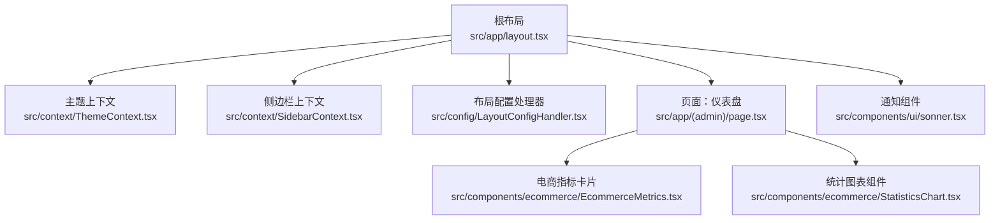
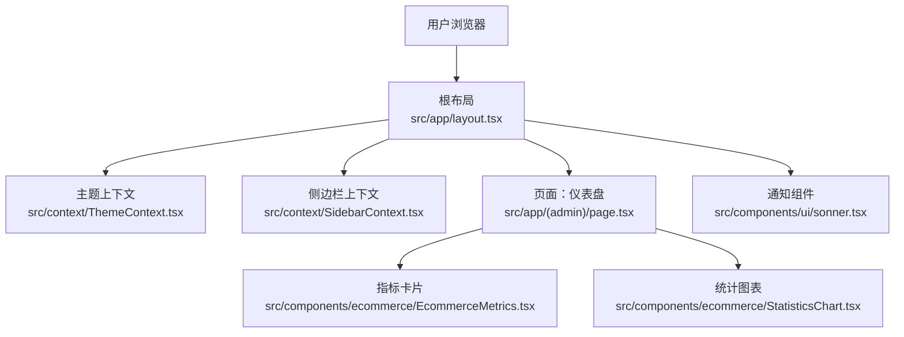
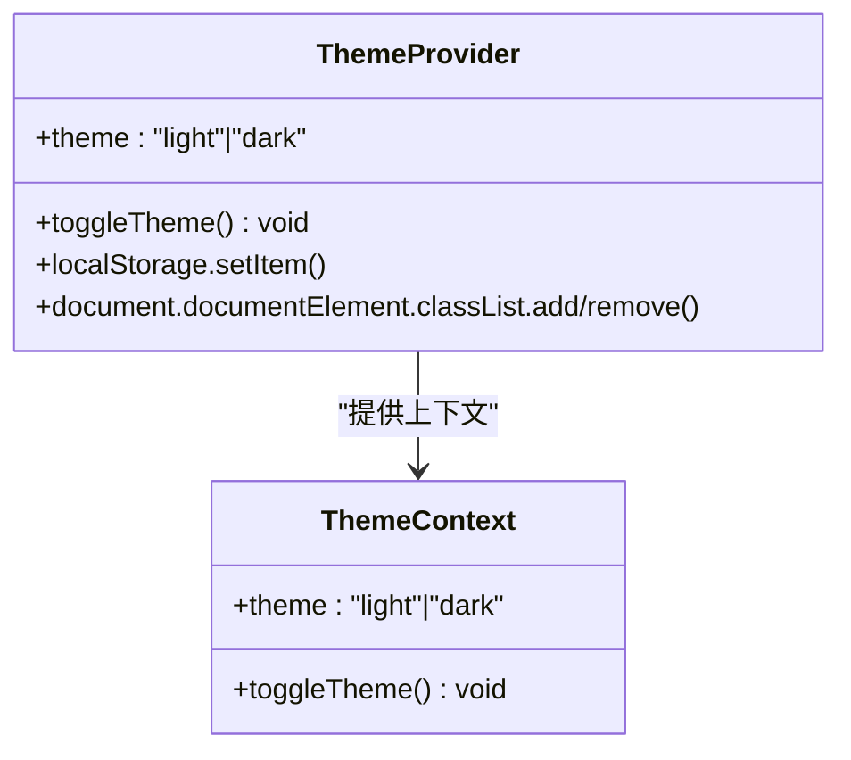
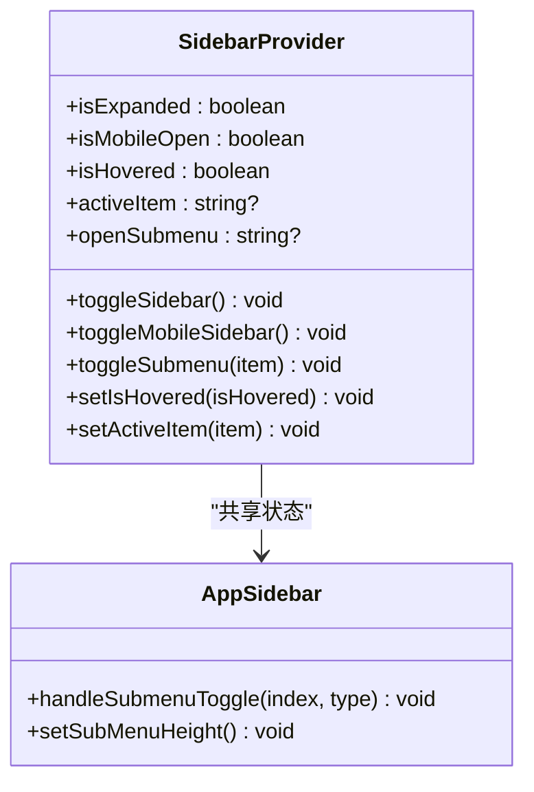
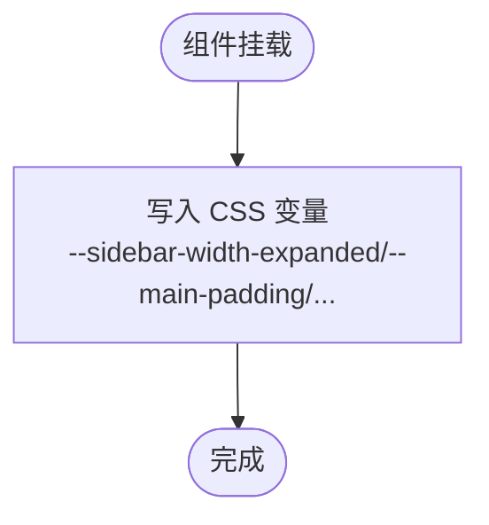
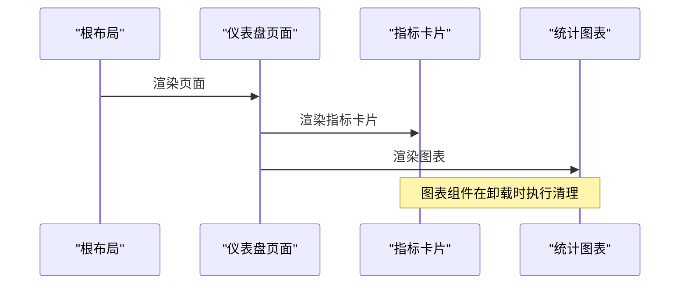
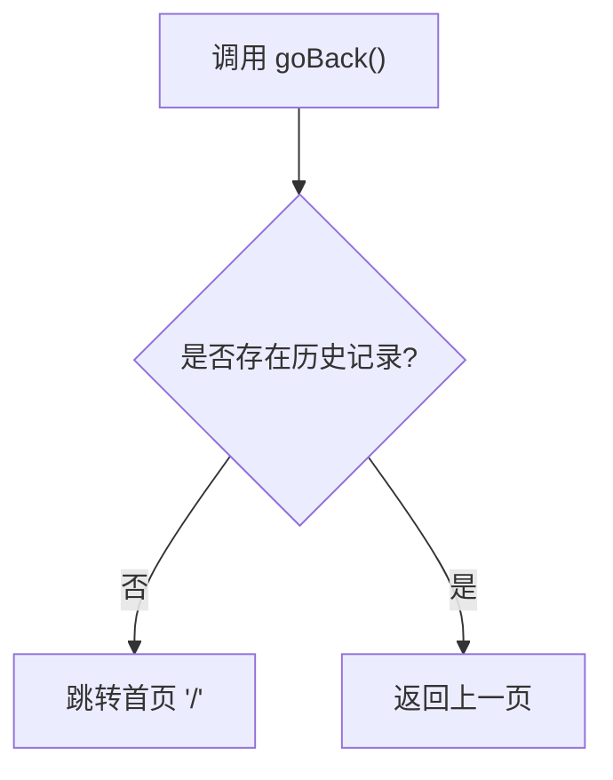
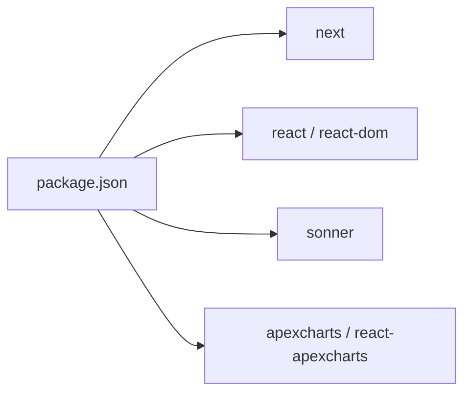

# 性能监控

<cite>
**本文引用的文件**
- [package.json](file://package.json)
- [next.config.ts](file://next.config.ts)
- [src/app/layout.tsx](file://src/app/layout.tsx)
- [src/context/ThemeContext.tsx](file://src/context/ThemeContext.tsx)
- [src/context/SidebarContext.tsx](file://src/context/SidebarContext.tsx)
- [src/config/LayoutConfigHandler.tsx](file://src/config/LayoutConfigHandler.tsx)
- [src/hooks/useGoBack.ts](file://src/hooks/useGoBack.ts)
- [src/hooks/useModal.ts](file://src/hooks/useModal.ts)
- [src/app/(admin)/page.tsx](file://src/app/(admin)/page.tsx)
- [src/components/ecommerce/EcommerceMetrics.tsx](file://src/components/ecommerce/EcommerceMetrics.tsx)
- [src/components/ecommerce/StatisticsChart.tsx](file://src/components/ecommerce/StatisticsChart.tsx)
- [src/layout/AppSidebar.tsx](file://src/layout/AppSidebar.tsx)
- [src/components/ui/sonner.tsx](file://src/components/ui/sonner.tsx)
</cite>

## 目录
1. [简介](#简介)
2. [项目结构](#项目结构)
3. [核心组件](#核心组件)
4. [架构总览](#架构总览)
5. [详细组件分析](#详细组件分析)
6. [依赖分析](#依赖分析)
7. [性能考量](#性能考量)
8. [故障排查指南](#故障排查指南)
9. [结论](#结论)
10. [附录](#附录)

## 简介
本文件面向生产级 Next.js 应用的性能监控与优化，结合当前仓库的前端结构与依赖，系统化阐述以下主题：
- Next.js 内置性能指标与构建优化
- APM 工具集成建议（以概念性方式呈现）
- 自定义性能指标采集与埋点策略
- 页面加载性能监控、用户行为分析、错误追踪配置
- Lighthouse 审计与 Core Web Vitals 监控
- 实时性能告警与趋势分析
- 性能基线建立、目标设定与回归检测
- 生产环境最佳实践与故障排查

本文件在不直接展示具体代码的前提下，通过“章节来源”定位到实际文件与片段路径，帮助读者快速定位实现位置。

## 项目结构
该仓库采用 Next.js App Router 的目录组织方式，页面按功能域分层放置于 app 目录下，公共上下文与通用组件位于 src 下。根布局负责全局主题、字体与通知等基础能力；页面组件通过组合多个业务组件完成数据可视化与交互。

**图示来源**
- [src/app/layout.tsx:16-31](file://src/app/layout.tsx#L16-L31)
- [src/context/ThemeContext.tsx:15-49](file://src/context/ThemeContext.tsx#L15-L49)
- [src/context/SidebarContext.tsx:27-83](file://src/context/SidebarContext.tsx#L27-L83)
- [src/config/LayoutConfigHandler.tsx:6-26](file://src/config/LayoutConfigHandler.tsx#L6-L26)
- [src/app/(admin)/page.tsx:16-42](file://src/app/(admin)/page.tsx#L16-L42)
- [src/components/ecommerce/EcommerceMetrics.tsx:6-56](file://src/components/ecommerce/EcommerceMetrics.tsx#L6-L56)
- [src/components/ecommerce/StatisticsChart.tsx:41-180](file://src/components/ecommerce/StatisticsChart.tsx#L41-L180)
- [src/components/ui/sonner.tsx](file://src/components/ui/sonner.tsx)

**章节来源**
- [src/app/layout.tsx:16-31](file://src/app/layout.tsx#L16-L31)
- [src/context/ThemeContext.tsx:15-49](file://src/context/ThemeContext.tsx#L15-L49)
- [src/context/SidebarContext.tsx:27-83](file://src/context/SidebarContext.tsx#L27-L83)
- [src/config/LayoutConfigHandler.tsx:6-26](file://src/config/LayoutConfigHandler.tsx#L6-L26)
- [src/app/(admin)/page.tsx:16-42](file://src/app/(admin)/page.tsx#L16-L42)
- [src/components/ecommerce/EcommerceMetrics.tsx:6-56](file://src/components/ecommerce/EcommerceMetrics.tsx#L6-L56)
- [src/components/ecommerce/StatisticsChart.tsx:41-180](file://src/components/ecommerce/StatisticsChart.tsx#L41-L180)
- [src/components/ui/sonner.tsx](file://src/components/ui/sonner.tsx)

## 核心组件
- 根布局与全局上下文
  - 负责注入主题、字体、通知与全局 Provider，为性能监控提供统一入口。
  - 参考：[src/app/layout.tsx:16-31](file://src/app/layout.tsx#L16-L31)
- 主题上下文
  - 提供主题切换与本地持久化，避免不必要的重渲染。
  - 参考：[src/context/ThemeContext.tsx:15-49](file://src/context/ThemeContext.tsx#L15-L49)
- 侧边栏上下文
  - 管理移动端/桌面端状态、展开/收起与子菜单高度计算，减少无关 DOM 更新。
  - 参考：[src/context/SidebarContext.tsx:27-83](file://src/context/SidebarContext.tsx#L27-L83)
- 布局配置处理器
  - 将主题变量注入 CSS 变量，降低样式层重排成本。
  - 参考：[src/config/LayoutConfigHandler.tsx:6-26](file://src/config/LayoutConfigHandler.tsx#L6-L26)
- 页面与业务组件
  - 仪表盘页面组合多个可视化组件，便于集中观测关键指标。
  - 参考：[src/app/(admin)/page.tsx:16-42](file://src/app/(admin)/page.tsx#L16-L42)
- 指标与图表组件
  - 指标卡片与统计图表用于展示业务 KPI，可扩展为性能指标面板。
  - 参考：[src/components/ecommerce/EcommerceMetrics.tsx:6-56](file://src/components/ecommerce/EcommerceMetrics.tsx#L6-L56), [src/components/ecommerce/StatisticsChart.tsx:41-180](file://src/components/ecommerce/StatisticsChart.tsx#L41-L180)

**章节来源**
- [src/app/layout.tsx:16-31](file://src/app/layout.tsx#L16-L31)
- [src/context/ThemeContext.tsx:15-49](file://src/context/ThemeContext.tsx#L15-L49)
- [src/context/SidebarContext.tsx:27-83](file://src/context/SidebarContext.tsx#L27-L83)
- [src/config/LayoutConfigHandler.tsx:6-26](file://src/config/LayoutConfigHandler.tsx#L6-L26)
- [src/app/(admin)/page.tsx:16-42](file://src/app/(admin)/page.tsx#L16-L42)
- [src/components/ecommerce/EcommerceMetrics.tsx:6-56](file://src/components/ecommerce/EcommerceMetrics.tsx#L6-L56)
- [src/components/ecommerce/StatisticsChart.tsx:41-180](file://src/components/ecommerce/StatisticsChart.tsx#L41-L180)

## 架构总览
下图展示了从浏览器到页面组件的典型渲染链路，以及与性能相关的关键节点（首屏、交互、滚动、主题切换）。

**图示来源**
- [src/app/layout.tsx:16-31](file://src/app/layout.tsx#L16-L31)
- [src/context/ThemeContext.tsx:15-49](file://src/context/ThemeContext.tsx#L15-L49)
- [src/context/SidebarContext.tsx:27-83](file://src/context/SidebarContext.tsx#L27-L83)
- [src/app/(admin)/page.tsx:16-42](file://src/app/(admin)/page.tsx#L16-L42)
- [src/components/ecommerce/EcommerceMetrics.tsx:6-56](file://src/components/ecommerce/EcommerceMetrics.tsx#L6-L56)
- [src/components/ecommerce/StatisticsChart.tsx:41-180](file://src/components/ecommerce/StatisticsChart.tsx#L41-L180)
- [src/components/ui/sonner.tsx](file://src/components/ui/sonner.tsx)

## 详细组件分析

### 主题上下文（ThemeContext）
- 设计要点
  - 使用本地存储持久化主题，避免每次刷新重算。
  - 切换主题时仅操作根元素类名，降低样式重排。
- 性能影响
  - 首次渲染后仅在切换时触发一次 DOM 类名变更，开销极低。
- 优化建议
  - 在 SSR 场景中，可通过服务端注入初始主题，减少客户端闪烁。

**图示来源**
- [src/context/ThemeContext.tsx:15-49](file://src/context/ThemeContext.tsx#L15-L49)

**章节来源**
- [src/context/ThemeContext.tsx:15-49](file://src/context/ThemeContext.tsx#L15-L49)

### 侧边栏上下文（SidebarContext）
- 设计要点
  - 统一管理展开/收起、移动端状态与子菜单高度，避免重复计算。
  - 使用 ref 记录子菜单高度，仅在打开时计算一次。
- 性能影响
  - 通过条件计算与事件解绑，减少不必要的重绘与回流。

**图示来源**
- [src/context/SidebarContext.tsx:27-83](file://src/context/SidebarContext.tsx#L27-L83)
- [src/layout/AppSidebar.tsx:285-296](file://src/layout/AppSidebar.tsx#L285-L296)

**章节来源**
- [src/context/SidebarContext.tsx:27-83](file://src/context/SidebarContext.tsx#L27-L83)
- [src/layout/AppSidebar.tsx:272-296](file://src/layout/AppSidebar.tsx#L272-L296)

### 布局配置处理器（LayoutConfigHandler）
- 设计要点
  - 将主题配置映射为 CSS 变量，供全局样式使用。
- 性能影响
  - 通过 CSS 变量减少 JS 层样式计算，提升响应速度。

**图示来源**
- [src/config/LayoutConfigHandler.tsx:6-26](file://src/config/LayoutConfigHandler.tsx#L6-L26)

**章节来源**
- [src/config/LayoutConfigHandler.tsx:6-26](file://src/config/LayoutConfigHandler.tsx#L6-L26)

### 页面与指标组件（仪表盘）
- 设计要点
  - 页面聚合多个指标与图表组件，便于集中观测业务与性能指标。
- 性能影响
  - 图表组件内部进行销毁清理，避免内存泄漏。

**图示来源**
- [src/app/(admin)/page.tsx:16-42](file://src/app/(admin)/page.tsx#L16-L42)
- [src/components/ecommerce/EcommerceMetrics.tsx:6-56](file://src/components/ecommerce/EcommerceMetrics.tsx#L6-L56)
- [src/components/ecommerce/StatisticsChart.tsx:34-39](file://src/components/ecommerce/StatisticsChart.tsx#L34-L39)

**章节来源**
- [src/app/(admin)/page.tsx:16-42](file://src/app/(admin)/page.tsx#L16-L42)
- [src/components/ecommerce/EcommerceMetrics.tsx:6-56](file://src/components/ecommerce/EcommerceMetrics.tsx#L6-L56)
- [src/components/ecommerce/StatisticsChart.tsx:34-39](file://src/components/ecommerce/StatisticsChart.tsx#L34-L39)

### 导航与交互钩子（useGoBack、useModal）
- 设计要点
  - useGoBack：根据历史长度决定返回或跳转首页，避免无效导航。
  - useModal：基于 useState 与 useCallback 返回稳定函数，减少重渲染。
- 性能影响
  - 稳定的回调引用有助于下游组件的 memo 化与优化。

**图示来源**
- [src/hooks/useGoBack.ts:6-12](file://src/hooks/useGoBack.ts#L6-L12)

**章节来源**
- [src/hooks/useGoBack.ts:1-18](file://src/hooks/useGoBack.ts#L1-L18)
- [src/hooks/useModal.ts:1-13](file://src/hooks/useModal.ts#L1-L13)

## 依赖分析
- 关键依赖
  - next：应用框架与构建工具链
  - react、react-dom：UI 渲染与生命周期
  - sonner：轻量通知组件，避免额外复杂度
  - apexcharts + react-apexcharts：图表渲染，注意在卸载时清理实例
- 与性能的关系
  - 依赖版本与打包策略直接影响包体积与运行时性能。
  - 图表组件需在卸载时销毁实例，防止内存泄漏。

**图示来源**
- [package.json:15-48](file://package.json#L15-L48)

**章节来源**
- [package.json:15-48](file://package.json#L15-L48)

## 性能考量
- 构建与打包
  - 使用 Next.js 默认打包器，确保 Tree Shaking 与按需加载生效。
  - SVG 处理通过 @svgr/webpack 加载器，减少运行时解析成本。
  - 参考：[next.config.ts:5-11](file://next.config.ts#L5-L11)
- 运行时渲染
  - 主题切换与侧边栏状态通过最小化 DOM 操作实现，降低重排与重绘。
  - 图表组件在卸载时清理实例，避免内存泄漏。
- 资源加载
  - 字体与第三方样式已引入，建议配合预连接与资源优先级策略优化首屏。
- 代码分割
  - 页面组件按路由自动分割，结合懒加载与骨架屏可进一步优化感知性能。

**章节来源**
- [next.config.ts:5-11](file://next.config.ts#L5-L11)
- [src/context/ThemeContext.tsx:30-39](file://src/context/ThemeContext.tsx#L30-L39)
- [src/context/SidebarContext.tsx:37-52](file://src/context/SidebarContext.tsx#L37-L52)
- [src/components/ecommerce/StatisticsChart.tsx:34-39](file://src/components/ecommerce/StatisticsChart.tsx#L34-L39)

## 故障排查指南
- 首屏性能异常
  - 检查根布局是否正确注入 Provider 与通知组件，避免阻塞主线程。
  - 参考：[src/app/layout.tsx:22-29](file://src/app/layout.tsx#L22-L29)
- 主题切换闪烁
  - 确认主题上下文初始化逻辑与本地存储读取顺序，避免重复渲染。
  - 参考：[src/context/ThemeContext.tsx:21-28](file://src/context/ThemeContext.tsx#L21-L28)
- 侧边栏交互卡顿
  - 检查窗口尺寸监听与子菜单高度计算是否在非必要时触发。
  - 参考：[src/context/SidebarContext.tsx:37-52](file://src/context/SidebarContext.tsx#L37-L52), [src/layout/AppSidebar.tsx:272-283](file://src/layout/AppSidebar.tsx#L272-L283)
- 图表内存泄漏
  - 确保图表组件在卸载时调用销毁逻辑。
  - 参考：[src/components/ecommerce/StatisticsChart.tsx:34-39](file://src/components/ecommerce/StatisticsChart.tsx#L34-L39)
- 导航行为异常
  - useGoBack 会根据历史长度决定返回或跳转首页，确认历史栈状态。
  - 参考：[src/hooks/useGoBack.ts:6-12](file://src/hooks/useGoBack.ts#L6-L12)

**章节来源**
- [src/app/layout.tsx:22-29](file://src/app/layout.tsx#L22-L29)
- [src/context/ThemeContext.tsx:21-28](file://src/context/ThemeContext.tsx#L21-L28)
- [src/context/SidebarContext.tsx:37-52](file://src/context/SidebarContext.tsx#L37-L52)
- [src/layout/AppSidebar.tsx:272-283](file://src/layout/AppSidebar.tsx#L272-L283)
- [src/components/ecommerce/StatisticsChart.tsx:34-39](file://src/components/ecommerce/StatisticsChart.tsx#L34-L39)
- [src/hooks/useGoBack.ts:6-12](file://src/hooks/useGoBack.ts#L6-L12)

## 结论
本项目在结构层面已具备良好的性能基础：上下文最小化更新、图表组件卸载清理、SVG 资源优化与通知组件轻量化。结合本文提供的监控与优化建议，可在生产环境中建立完善的性能监控体系，持续观测与改进用户体验。

## 附录
- 性能监控实施清单（概念性）
  - 页面加载性能：测量 First Contentful Paint、Largest Contentful Paint、First Input Delay、Cumulative Layout Shift，并在构建阶段使用 Lighthouse 审计。
  - 用户行为分析：对关键交互（如主题切换、侧边栏开关、图表缩放）进行埋点，统计点击热力与交互时延。
  - 错误追踪：在全局错误边界与网络请求拦截处记录错误堆栈与上下文信息。
  - APM 集成：接入 APM 平台（如 DataDog、New Relic、Sentry），采集分布式追踪与事务指标。
  - 实时告警：基于阈值与趋势变化设置告警，联动通知组件向团队推送。
  - 基线与目标：建立历史基线，设定 CWV 目标（如 LCP < 2.5s、FID < 100ms、CLS < 0.1），定期评估回归。
  - 优化评估：对比优化前后的指标变化，验证策略有效性。