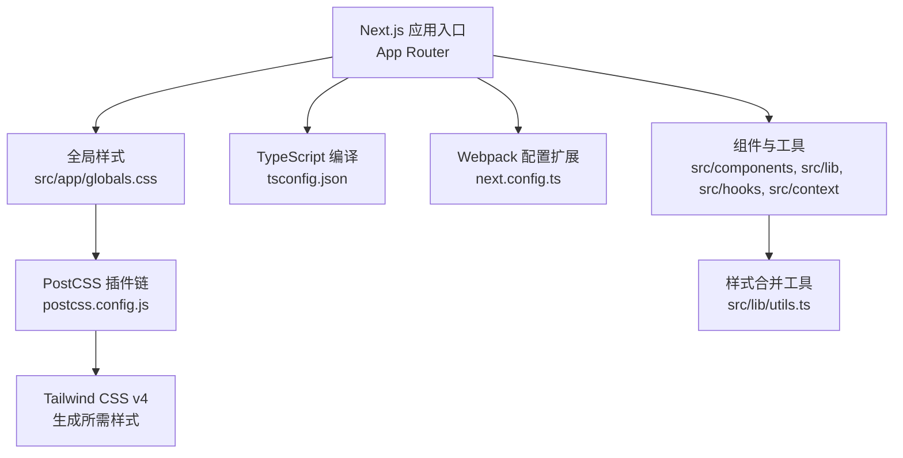
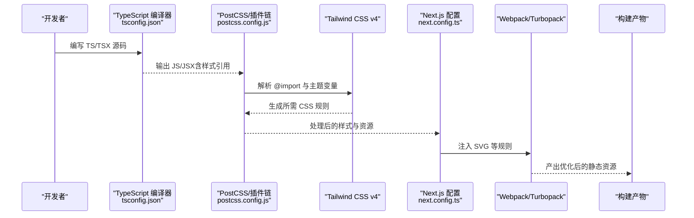
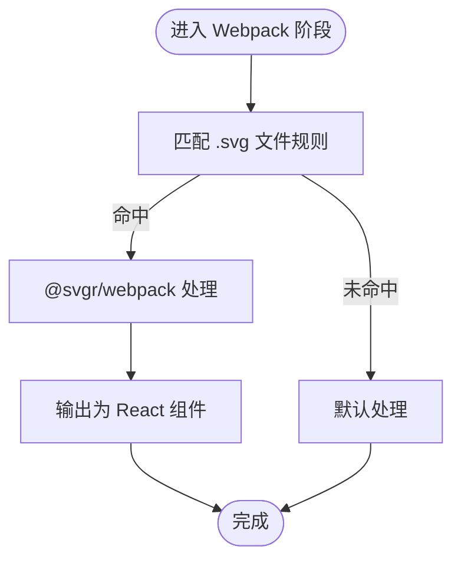
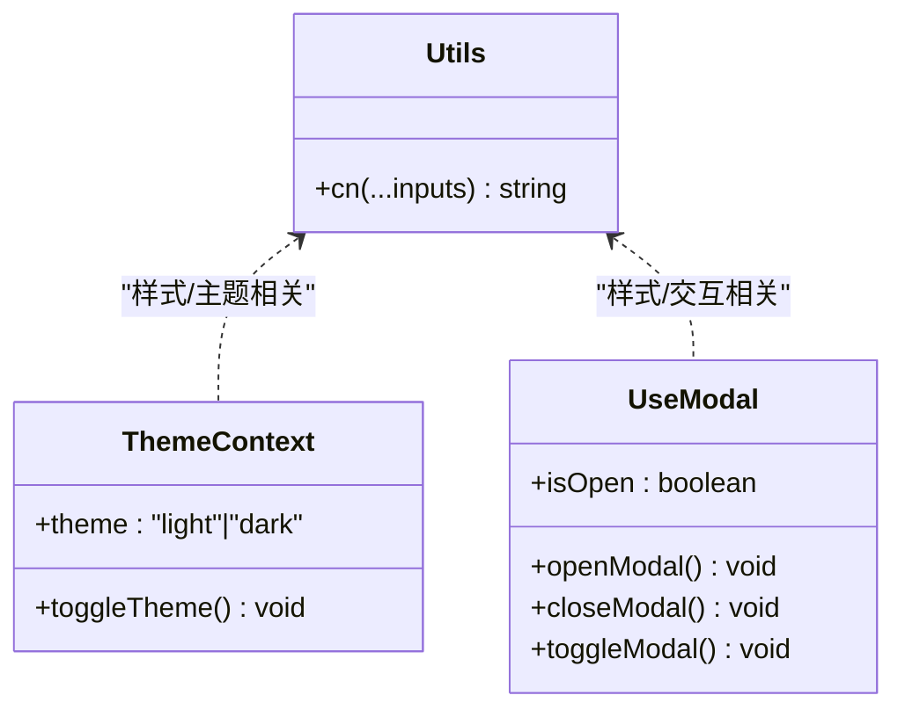
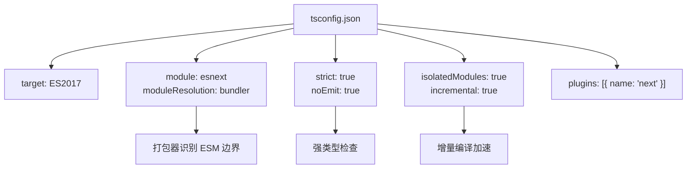
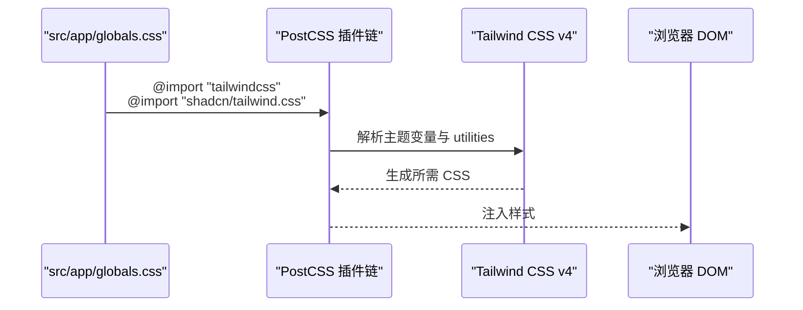
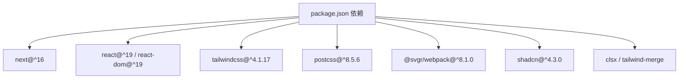

# 构建优化

<cite>
**本文引用的文件**
- [next.config.ts](file://next.config.ts)
- [postcss.config.js](file://postcss.config.js)
- [tsconfig.json](file://tsconfig.json)
- [package.json](file://package.json)
- [components.json](file://components.json)
- [src/app/globals.css](file://src/app/globals.css)
- [src/lib/utils.ts](file://src/lib/utils.ts)
- [src/context/ThemeContext.tsx](file://src/context/ThemeContext.tsx)
- [src/hooks/useModal.ts](file://src/hooks/useModal.ts)
- [eslint.config.mjs](file://eslint.config.mjs)
- [.prettierrc](file://.prettierrc)
- [prettier.config.js](file://prettier.config.js)
</cite>

## 目录
1. [简介](#简介)
2. [项目结构](#项目结构)
3. [核心组件](#核心组件)
4. [架构总览](#架构总览)
5. [详细组件分析](#详细组件分析)
6. [依赖关系分析](#依赖关系分析)
7. [性能考量](#性能考量)
8. [故障排查指南](#故障排查指南)
9. [结论](#结论)
10. [附录](#附录)

## 简介
本文件面向 Next.js 16 的构建优化，系统梳理并解释当前仓库中的构建配置与优化实践，重点覆盖以下方面：
- Webpack 配置调优：SVG 资源处理、开发/生产环境差异、与 Turbopack 的协同
- Tree Shaking 与代码压缩：打包产物体积控制与按需加载策略
- TypeScript 编译优化：编译器选项、增量编译、模块解析策略
- CSS/PostCSS 优化：Tailwind CSS v4 配置、按需生成样式、CSS 变量与主题定制
- 构建产物分析与速度优化：可操作的分析工具与技巧
- 具体配置示例路径与性能建议（以仓库现有配置为依据）

## 项目结构
该项目采用 App Router 结构，前端资源与样式集中在 src/app 下，全局样式通过 src/app/globals.css 引入；Tailwind CSS 通过 PostCSS 插件在构建期生成所需样式；TypeScript 配置集中于 tsconfig.json；Next.js 构建配置位于 next.config.ts；UI 组件库与样式由 shadcn 与 Tailwind 生态共同支撑。

图表来源
- [next.config.ts:1-25](file://next.config.ts#L1-L25)
- [postcss.config.js:1-6](file://postcss.config.js#L1-L6)
- [tsconfig.json:1-42](file://tsconfig.json#L1-L42)
- [src/app/globals.css:1-800](file://src/app/globals.css#L1-L800)
- [src/lib/utils.ts:1-7](file://src/lib/utils.ts#L1-L7)

章节来源
- [next.config.ts:1-25](file://next.config.ts#L1-L25)
- [postcss.config.js:1-6](file://postcss.config.js#L1-L6)
- [tsconfig.json:1-42](file://tsconfig.json#L1-L42)
- [src/app/globals.css:1-800](file://src/app/globals.css#L1-L800)
- [src/lib/utils.ts:1-7](file://src/lib/utils.ts#L1-L7)

## 核心组件
- Webpack 扩展与 Turbopack 规则：通过 next.config.ts 注入 SVG 处理规则，确保 SVG 作为 React 组件使用，提升 DX 并减少运行时开销。
- PostCSS 与 Tailwind CSS：通过 postcss.config.js 启用 Tailwind CSS v4 插件，结合 src/app/globals.css 中的 @import 与自定义主题变量，实现按需样式生成。
- TypeScript 编译：tsconfig.json 使用 bundler 模块解析、严格模式、增量编译等选项，配合 Next 内置插件，提升类型检查与编译效率。
- 样式工具：src/lib/utils.ts 提供 cn/twMerge 组合类名，减少重复与冲突，有利于 Tree Shaking 与 CSS 体积控制。
- 主题上下文：src/context/ThemeContext.tsx 提供暗/亮主题切换逻辑，结合 CSS 变量与 Tailwind dark 修饰符，实现无闪烁切换与按需渲染。

章节来源
- [next.config.ts:5-21](file://next.config.ts#L5-L21)
- [postcss.config.js:1-6](file://postcss.config.js#L1-L6)
- [tsconfig.json:20-24](file://tsconfig.json#L20-L24)
- [src/lib/utils.ts:4-6](file://src/lib/utils.ts#L4-L6)
- [src/context/ThemeContext.tsx:15-50](file://src/context/ThemeContext.tsx#L15-L50)

## 架构总览
下图展示从源码到最终产物的关键流程：TypeScript 编译 → PostCSS/Tailwind 处理 → Webpack/Turbopack 打包 → 产物输出。

图表来源
- [tsconfig.json:1-42](file://tsconfig.json#L1-L42)
- [postcss.config.js:1-6](file://postcss.config.js#L1-L6)
- [next.config.ts:5-21](file://next.config.ts#L5-L21)

## 详细组件分析

### Webpack 配置调优
- SVG 作为 React 组件处理：通过 next.config.ts 在 webpack 阶段对 .svg 文件应用 @svgr/webpack，避免运行时解析成本，同时支持内联或组件化使用。
- Turbopack 协同：在 turbopack.rules 中同样配置 SVG 加载器，保证开发体验一致。
- 建议补充：若存在第三方库未正确处理 SVG，可在同一位置追加规则；如需进一步 Tree Shaking，可结合外部依赖的 ESM 导出与打包器的 sideEffects 声明进行优化。

图表来源
- [next.config.ts:5-11](file://next.config.ts#L5-L11)
- [next.config.ts:13-20](file://next.config.ts#L13-L20)

章节来源
- [next.config.ts:5-21](file://next.config.ts#L5-L21)

### Tree Shaking 实现
- 模块解析与 ESM：tsconfig.json 使用 module: esnext 与 moduleResolution: bundler，利于打包器识别 ESM 边界，提升 Tree Shaking 效果。
- 样式合并工具：src/lib/utils.ts 使用 twMerge 合并类名，减少无效类组合，间接降低 CSS 体积与运行时开销。
- 组件按需：shadcn 配置 components.json 中 rsc: true，结合 TSX 与 ESM，有助于按需引入组件，避免整包引入。

图表来源
- [src/lib/utils.ts:4-6](file://src/lib/utils.ts#L4-L6)
- [src/context/ThemeContext.tsx:8-11](file://src/context/ThemeContext.tsx#L8-L11)
- [src/hooks/useModal.ts:4-12](file://src/hooks/useModal.ts#L4-L12)

章节来源
- [tsconfig.json:14-15](file://tsconfig.json#L14-L15)
- [src/lib/utils.ts:4-6](file://src/lib/utils.ts#L4-L6)
- [components.json:4](file://components.json#L4)

### 代码压缩设置
- 当前仓库未显式配置压缩器（如 Terser 或 SWC 压缩）。Next.js 16 默认在生产构建中启用压缩与最小化，建议保持默认即可获得良好效果。
- 如需进一步优化，可在 next.config.ts 中通过 webpack 钩子注入自定义压缩器配置，但需谨慎评估兼容性与构建时间。

章节来源
- [next.config.ts:3-11](file://next.config.ts#L3-L11)

### TypeScript 编译优化
- 编译器选项要点：
  - target: ES2017，lib: dom/dom.iterable/esnext，满足现代浏览器与 React 生态需求
  - strict: true，noEmit: true，配合 Next 内置编译管线
  - module: esnext，moduleResolution: bundler，提升 ESM 识别与 Tree Shaking
  - isolatedModules: true，incremental: true，提升开发体验与增量编译速度
  - plugins: [{ name: "next" }]，启用 Next 内置 TS 支持
- 建议：如需更细粒度控制，可在 next.config.ts 中通过 webpack 钩子注入自定义 TS/TSX loader 或插件，但通常无需额外配置。

图表来源
- [tsconfig.json:3-19](file://tsconfig.json#L3-L19)
- [tsconfig.json:20-24](file://tsconfig.json#L20-L24)

章节来源
- [tsconfig.json:1-42](file://tsconfig.json#L1-L42)

### TypeScript 编译器选项配置与声明文件处理
- 选项概览：target、lib、allowJs、skipLibCheck、strict、noEmit、esModuleInterop、module、moduleResolution、resolveJsonModule、isolatedModules、jsx、incremental、plugins、paths
- 声明文件：include 中已覆盖 next-env.d.ts 与 TS/TSX 文件，exclude 排除 node_modules，确保类型检查聚焦业务代码

章节来源
- [tsconfig.json:2-29](file://tsconfig.json#L2-L29)
- [tsconfig.json:31-40](file://tsconfig.json#L31-L40)

### PostCSS 优化配置与 Tailwind CSS 按需加载
- PostCSS 插件：postcss.config.js 启用 @tailwindcss/postcss，用于在构建期生成 Tailwind 规则
- 全局样式：src/app/globals.css 通过 @import 引入 Tailwind 与第三方样式，同时定义主题变量与自定义 utilities
- 按需加载：Tailwind v4 与 @import 机制配合，仅生成实际使用的样式，减少初始 CSS 体积
- 暗色主题：ThemeContext.tsx 切换 documentElement.classList，结合 Tailwind dark 修饰符实现按需渲染

图表来源
- [postcss.config.js:1-6](file://postcss.config.js#L1-L6)
- [src/app/globals.css:1-3](file://src/app/globals.css#L1-L3)
- [src/context/ThemeContext.tsx:30-39](file://src/context/ThemeContext.tsx#L30-L39)

章节来源
- [postcss.config.js:1-6](file://postcss.config.js#L1-L6)
- [src/app/globals.css:1-800](file://src/app/globals.css#L1-L800)
- [src/context/ThemeContext.tsx:15-50](file://src/context/ThemeContext.tsx#L15-L50)

### CSS 优化策略
- 类名合并：src/lib/utils.ts 使用 twMerge 合并类名，避免重复与冲突，减少无效样式
- 自定义主题变量：globals.css 定义大量 --color-*, --shadow-*, --z-index-* 等变量，统一风格并便于按需覆盖
- utilities 层：@layer utilities 与 @utility 自定义工具类，提升复用性与可维护性

章节来源
- [src/lib/utils.ts:4-6](file://src/lib/utils.ts#L4-L6)
- [src/app/globals.css:7-188](file://src/app/globals.css#L7-L188)

### 构建产物分析与 Bundle 分析工具使用
- 工具选择：推荐使用 next build 的内置报告，或安装 webpack-bundle-analyzer 进行可视化分析
- 分析步骤：
  - 运行构建：next build
  - 生成分析报告：在 next.config.ts 中临时注入 webpack 钩子以导出 stats.json
  - 可视化：使用 webpack-bundle-analyzer 查看各模块占比，定位大体积依赖与重复代码
- 优化方向：根据分析结果调整依赖拆分、按需引入、Tree Shaking 与压缩策略

章节来源
- [next.config.ts:3-11](file://next.config.ts#L3-L11)

### 构建速度优化技巧
- 使用 Turbopack：next.config.ts 中已配置 turbopack.rules，可直接体验更快的开发构建
- 增量编译：tsconfig.json 已开启 incremental 与 isolatedModules，缩短开发时重编译时间
- 模块解析：module: esnext 与 moduleResolution: bundler 提升打包器识别效率
- 资源处理：SVG 通过 @svgr/webpack 直接转为组件，减少运行时解析成本

章节来源
- [next.config.ts:13-20](file://next.config.ts#L13-L20)
- [tsconfig.json:14-19](file://tsconfig.json#L14-L19)

## 依赖关系分析
- Next.js 16 与 React 19：提供最新的 App Router 与构建能力
- Tailwind CSS v4：通过 PostCSS 插件在构建期生成样式，结合 @import 与主题变量实现按需加载
- shadcn：组件库与 Tailwind 生态集成，rsc: true 与 TSX 有助于 Tree Shaking
- SVG 处理：@svgr/webpack 将 SVG 转为 React 组件，提升 DX 与运行时性能

图表来源
- [package.json:15-49](file://package.json#L15-L49)

章节来源
- [package.json:15-67](file://package.json#L15-L67)

## 性能考量
- Tree Shaking：通过 ESM 模块解析与组件按需引入，减少未使用代码
- CSS 体积：Tailwind v4 按需生成与主题变量统一管理，降低冗余样式
- 构建速度：Turbopack 开发模式、增量编译与 SVG 直接组件化处理
- 压缩与最小化：默认生产构建已启用，如需进一步优化可考虑自定义压缩器

## 故障排查指南
- ESLint 配置：eslint.config.mjs 继承 next/core-web-vitals 与 next/typescript，确保代码质量与性能指标一致性
- Prettier 配置：.prettierrc 与 prettier.config.js 统一格式化风格，减少 CI/本地差异
- SVG 加载异常：确认 next.config.ts 中 @svgr/webpack 规则是否生效，检查文件扩展名与导入方式
- 样式未更新：检查 src/app/globals.css 的 @import 顺序与主题变量是否正确，确认 PostCSS 插件链完整

章节来源
- [eslint.config.mjs:1-19](file://eslint.config.mjs#L1-L19)
- [.prettierrc:1-10](file://.prettierrc#L1-L10)
- [prettier.config.js:1-3](file://prettier.config.js#L1-L3)
- [next.config.ts:5-21](file://next.config.ts#L5-L21)
- [src/app/globals.css:1-3](file://src/app/globals.css#L1-L3)

## 结论
本项目在 Next.js 16 下已具备良好的构建基础：Webpack 对 SVG 的组件化处理、PostCSS/Tailwind v4 的按需样式生成、TypeScript 的 ESM 与增量编译配置，以及 shadcn 的 RSC 支持，共同构成了高效的构建链路。建议在现有基础上继续：
- 使用构建分析工具定位体积热点，针对性优化依赖与按需加载
- 保持默认压缩策略，必要时再引入自定义压缩器
- 持续关注 Next.js 与生态更新，及时升级以获得更好的 Tree Shaking 与性能收益

## 附录
- 配置示例路径参考：
  - Webpack/SVG 处理：[next.config.ts:5-21](file://next.config.ts#L5-L21)
  - PostCSS/Tailwind：[postcss.config.js:1-6](file://postcss.config.js#L1-L6)，[src/app/globals.css:1-3](file://src/app/globals.css#L1-L3)
  - TypeScript 编译：[tsconfig.json:1-42](file://tsconfig.json#L1-L42)
  - 组件与工具：[components.json:1-26](file://components.json#L1-L26)，[src/lib/utils.ts:4-6](file://src/lib/utils.ts#L4-L6)
  - 主题上下文：[src/context/ThemeContext.tsx:15-50](file://src/context/ThemeContext.tsx#L15-L50)