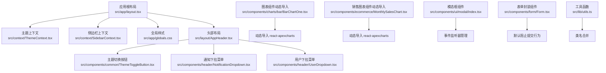
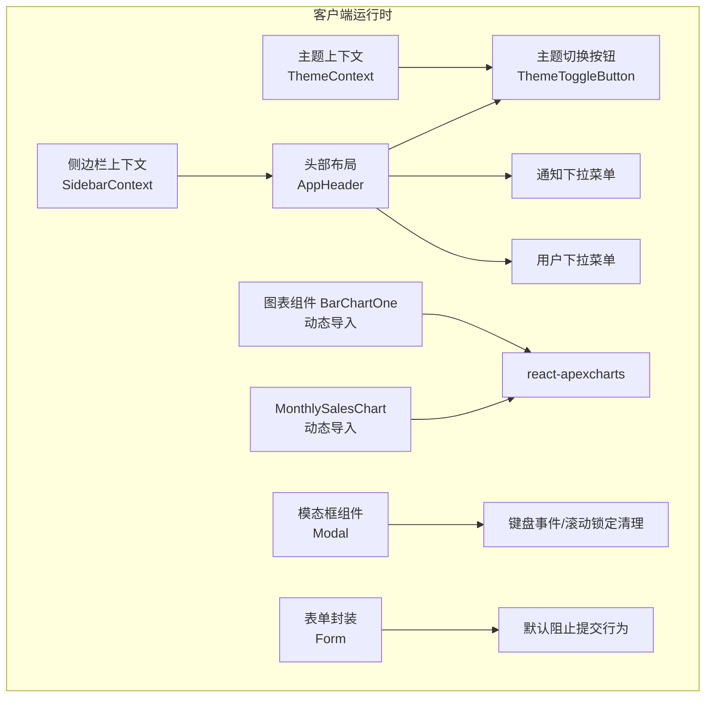
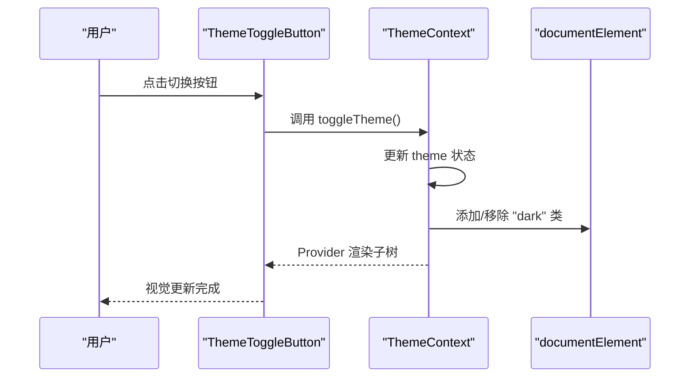
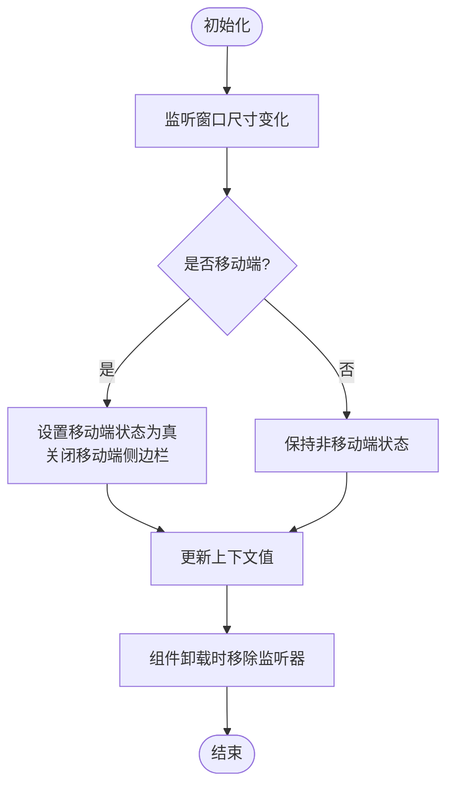
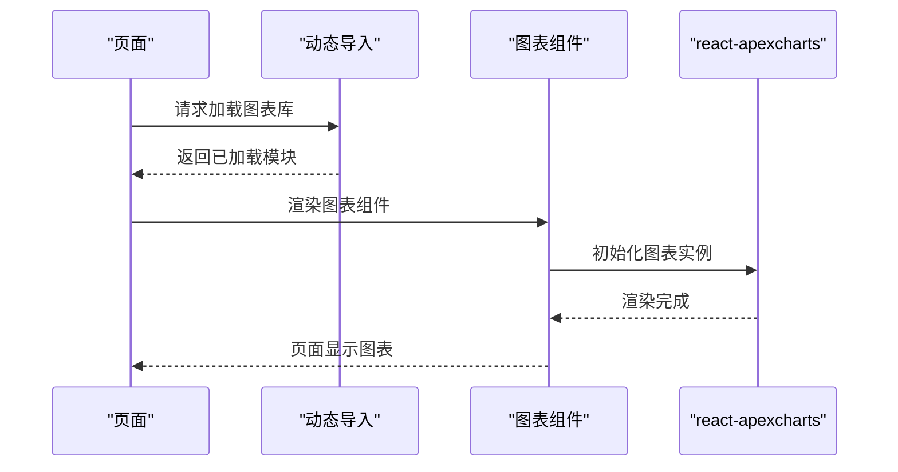
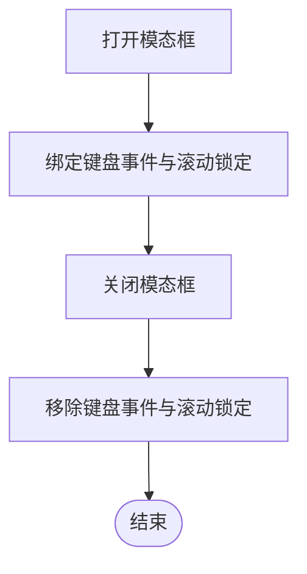
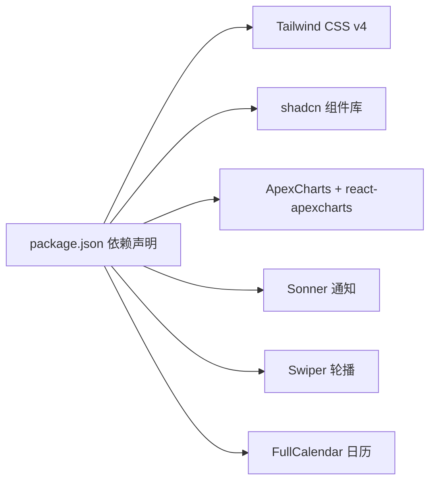

# 运行时优化

<cite>
**本文引用的文件**
- [src/app/layout.tsx](file://src/app/layout.tsx)
- [src/app/globals.css](file://src/app/globals.css)
- [src/context/ThemeContext.tsx](file://src/context/ThemeContext.tsx)
- [src/context/SidebarContext.tsx](file://src/context/SidebarContext.tsx)
- [src/hooks/useModal.ts](file://src/hooks/useModal.ts)
- [src/components/common/ThemeToggleButton.tsx](file://src/components/common/ThemeToggleButton.tsx)
- [src/components/common/ComponentCard.tsx](file://src/components/common/ComponentCard.tsx)
- [src/components/charts/bar/BarChartOne.tsx](file://src/components/charts/bar/BarChartOne.tsx)
- [src/components/ecommerce/MonthlySalesChart.tsx](file://src/components/ecommerce/MonthlySalesChart.tsx)
- [src/components/ui/modal/index.tsx](file://src/components/ui/modal/index.tsx)
- [src/components/form/Form.tsx](file://src/components/form/Form.tsx)
- [src/layout/AppHeader.tsx](file://src/layout/AppHeader.tsx)
- [src/lib/utils.ts](file://src/lib/utils.ts)
- [package.json](file://package.json)
</cite>

## 目录
1. [简介](#简介)
2. [项目结构](#项目结构)
3. [核心组件](#核心组件)
4. [架构总览](#架构总览)
5. [详细组件分析](#详细组件分析)
6. [依赖分析](#依赖分析)
7. [性能考量](#性能考量)
8. [故障排查指南](#故障排查指南)
9. [结论](#结论)
10. [附录](#附录)

## 简介
本文件聚焦于该 Next.js 管理系统在“运行时性能优化”方面的实践与建议，涵盖以下主题：
- React 组件优化：useMemo/useCallback 的正确使用、组件重渲染优化、状态提升策略
- Next.js App Router 的性能特性、路由预加载、页面缓存机制
- CSS-in-JS 与样式性能优化、动态导入与懒加载组件设计
- 内存泄漏预防、事件监听器管理、副作用清理策略
- 性能基准测试方法、运行时性能监控工具使用、常见性能瓶颈识别与解决方案

## 项目结构
该项目采用 Next.js App Router 结构，页面按功能分组组织，公共上下文与通用组件分布在独立模块中，便于复用与性能优化。

**图示来源**
- [src/app/layout.tsx:16-32](file://src/app/layout.tsx#L16-L32)
- [src/context/ThemeContext.tsx:15-49](file://src/context/ThemeContext.tsx#L15-L49)
- [src/context/SidebarContext.tsx:27-83](file://src/context/SidebarContext.tsx#L27-L83)
- [src/app/globals.css:1-226](file://src/app/globals.css#L1-L226)
- [src/layout/AppHeader.tsx:10-43](file://src/layout/AppHeader.tsx#L10-L43)
- [src/components/common/ThemeToggleButton.tsx:4-42](file://src/components/common/ThemeToggleButton.tsx#L4-L42)
- [src/components/charts/bar/BarChartOne.tsx:6-10](file://src/components/charts/bar/BarChartOne.tsx#L6-L10)
- [src/components/ecommerce/MonthlySalesChart.tsx:9-12](file://src/components/ecommerce/MonthlySalesChart.tsx#L9-L12)
- [src/components/ui/modal/index.tsx:23-49](file://src/components/ui/modal/index.tsx#L23-L49)
- [src/components/form/Form.tsx:9-21](file://src/components/form/Form.tsx#L9-L21)
- [src/lib/utils.ts:4-6](file://src/lib/utils.ts#L4-L6)

**章节来源**
- [src/app/layout.tsx:16-32](file://src/app/layout.tsx#L16-L32)
- [src/app/globals.css:1-226](file://src/app/globals.css#L1-L226)

## 核心组件
- 主题上下文与切换按钮：通过上下文在客户端维护主题状态，并持久化到本地存储；切换按钮为无状态组件，避免不必要的重渲染。
- 侧边栏上下文：集中管理展开/收起、移动端状态、子菜单等，减少跨层级 props 传递带来的重渲染。
- 动态导入图表组件：对重型图表库进行动态导入，仅在需要时加载，降低首屏 JS 体积。
- 模态框组件：对键盘事件与滚动锁定进行清理，防止内存泄漏与交互异常。
- 表单封装：统一处理默认提交行为，避免重复逻辑导致的性能浪费。
- 工具函数：类名合并工具，减少无效 DOM 属性计算。

**章节来源**
- [src/context/ThemeContext.tsx:15-49](file://src/context/ThemeContext.tsx#L15-L49)
- [src/context/SidebarContext.tsx:27-83](file://src/context/SidebarContext.tsx#L27-L83)
- [src/components/common/ThemeToggleButton.tsx:4-42](file://src/components/common/ThemeToggleButton.tsx#L4-L42)
- [src/components/charts/bar/BarChartOne.tsx:6-10](file://src/components/charts/bar/BarChartOne.tsx#L6-L10)
- [src/components/ecommerce/MonthlySalesChart.tsx:9-12](file://src/components/ecommerce/MonthlySalesChart.tsx#L9-L12)
- [src/components/ui/modal/index.tsx:23-49](file://src/components/ui/modal/index.tsx#L23-L49)
- [src/components/form/Form.tsx:9-21](file://src/components/form/Form.tsx#L9-L21)
- [src/lib/utils.ts:4-6](file://src/lib/utils.ts#L4-L6)

## 架构总览
该应用采用“上下文 + 动态导入 + 事件清理”的组合策略，以最小化重渲染与首屏体积，同时保证交互体验。

**图示来源**
- [src/context/ThemeContext.tsx:15-49](file://src/context/ThemeContext.tsx#L15-L49)
- [src/context/SidebarContext.tsx:27-83](file://src/context/SidebarContext.tsx#L27-L83)
- [src/layout/AppHeader.tsx:10-43](file://src/layout/AppHeader.tsx#L10-L43)
- [src/components/common/ThemeToggleButton.tsx:4-42](file://src/components/common/ThemeToggleButton.tsx#L4-L42)
- [src/components/charts/bar/BarChartOne.tsx:6-10](file://src/components/charts/bar/BarChartOne.tsx#L6-L10)
- [src/components/ecommerce/MonthlySalesChart.tsx:9-12](file://src/components/ecommerce/MonthlySalesChart.tsx#L9-L12)
- [src/components/ui/modal/index.tsx:23-49](file://src/components/ui/modal/index.tsx#L23-L49)
- [src/components/form/Form.tsx:9-21](file://src/components/form/Form.tsx#L9-L21)

## 详细组件分析

### 主题上下文与切换按钮
- 使用上下文在客户端保存主题状态，并持久化到本地存储；切换按钮为纯函数组件，避免闭包导致的重渲染。
- 建议：将切换逻辑与依赖项稳定化，确保回调不会在每次渲染时重新创建。

**图示来源**
- [src/context/ThemeContext.tsx:41-43](file://src/context/ThemeContext.tsx#L41-L43)
- [src/context/ThemeContext.tsx:30-39](file://src/context/ThemeContext.tsx#L30-L39)
- [src/components/common/ThemeToggleButton.tsx:4-42](file://src/components/common/ThemeToggleButton.tsx#L4-L42)

**章节来源**
- [src/context/ThemeContext.tsx:15-49](file://src/context/ThemeContext.tsx#L15-L49)
- [src/components/common/ThemeToggleButton.tsx:4-42](file://src/components/common/ThemeToggleButton.tsx#L4-L42)

### 侧边栏上下文
- 集中管理展开/收起、移动端状态、子菜单等，减少 props drilling，降低重渲染范围。
- 注意：窗口尺寸变化监听需在卸载时清理，避免内存泄漏。

**图示来源**
- [src/context/SidebarContext.tsx:37-52](file://src/context/SidebarContext.tsx#L37-L52)
- [src/context/SidebarContext.tsx:66-83](file://src/context/SidebarContext.tsx#L66-L83)

**章节来源**
- [src/context/SidebarContext.tsx:27-83](file://src/context/SidebarContext.tsx#L27-L83)

### 图表组件与动态导入
- 通过动态导入延迟加载图表库，仅在渲染图表时加载，显著降低首屏 JS 体积。
- 建议：对配置对象与数据进行稳定化处理，避免不必要的重渲染。

**图示来源**
- [src/components/charts/bar/BarChartOne.tsx:6-10](file://src/components/charts/bar/BarChartOne.tsx#L6-L10)
- [src/components/ecommerce/MonthlySalesChart.tsx:9-12](file://src/components/ecommerce/MonthlySalesChart.tsx#L9-L12)

**章节来源**
- [src/components/charts/bar/BarChartOne.tsx:6-10](file://src/components/charts/bar/BarChartOne.tsx#L6-L10)
- [src/components/ecommerce/MonthlySalesChart.tsx:9-12](file://src/components/ecommerce/MonthlySalesChart.tsx#L9-L12)

### 模态框组件与事件清理
- 对键盘事件与滚动锁定进行条件绑定与清理，防止内存泄漏与意外行为。
- 建议：在打开/关闭时分别注册/移除事件，确保副作用成对出现。

**图示来源**
- [src/components/ui/modal/index.tsx:23-49](file://src/components/ui/modal/index.tsx#L23-L49)

**章节来源**
- [src/components/ui/modal/index.tsx:23-49](file://src/components/ui/modal/index.tsx#L23-L49)

### 表单封装与默认行为
- 统一处理表单默认提交行为，避免重复逻辑与潜在性能问题。
- 建议：在表单内部使用受控组件或合理拆分状态，减少不必要的重渲染。

**章节来源**
- [src/components/form/Form.tsx:9-21](file://src/components/form/Form.tsx#L9-L21)

### 工具函数与类名合并
- 使用类名合并工具减少无效 DOM 属性计算，提升渲染效率。
- 建议：在高频组件中复用该工具，避免字符串拼接造成的额外开销。

**章节来源**
- [src/lib/utils.ts:4-6](file://src/lib/utils.ts#L4-L6)

## 依赖分析
- 样式与主题：Tailwind CSS v4、自定义主题变量、暗色模式类名切换
- 图表库：ApexCharts 与 react-apexcharts，配合动态导入
- UI 组件：基于 shadcn 组件库与 Tailwind 实现
- 交互增强：Sonner 通知、Swiper 轮播、FullCalendar 日历

**图示来源**
- [package.json:15-48](file://package.json#L15-L48)

**章节来源**
- [package.json:15-48](file://package.json#L15-L48)

## 性能考量
- React 组件优化
  - 使用 useCallback 包裹事件处理器与回调，避免子组件因引用变化而重渲染
  - 使用 useMemo 缓存昂贵计算结果，确保依赖数组稳定
  - 将高频状态上提到最近的共同父组件，减少多处状态同步导致的重渲染
- Next.js App Router 性能
  - 利用动态导入与懒加载组件，降低首屏 JS 体积
  - 合理组织页面目录，利用 App Router 的并行数据获取能力
  - 使用客户端组件标记与服务端渲染结合，平衡首屏速度与交互性
- CSS-in-JS 与样式
  - 使用 CSS 变量与 Tailwind 自定义主题，减少内联样式的重排
  - 在全局样式中集中定义主题变量与阴影、圆角等通用样式
- 事件监听器与副作用
  - 在组件卸载时清理事件监听器与定时器，防止内存泄漏
  - 对窗口尺寸变化等高频事件进行节流/防抖处理
- 基准测试与监控
  - 使用浏览器开发者工具的性能面板与内存面板进行基准测试
  - 结合 Lighthouse 或 Web Vitals 监控关键指标（CLS、FCP、LCP、INP）
  - 在生产环境集成性能监控 SDK，持续跟踪运行时性能

[本节为通用指导，不直接分析具体文件]

## 故障排查指南
- 主题切换后未生效
  - 检查主题上下文是否在根布局中包裹，以及暗色类名是否正确添加/移除
- 侧边栏尺寸变化异常
  - 确认窗口尺寸监听是否在卸载时清理，避免残留监听器影响其他组件
- 图表组件白屏或渲染失败
  - 确认动态导入路径正确且 SSR 禁用场景下仅在客户端渲染
- 模态框无法关闭或背景滚动
  - 检查键盘事件与滚动锁定是否成对绑定与清理
- 表单提交异常
  - 确认表单封装组件是否正确阻止默认提交行为并调用传入的提交处理函数

**章节来源**
- [src/context/ThemeContext.tsx:30-39](file://src/context/ThemeContext.tsx#L30-L39)
- [src/context/SidebarContext.tsx:37-52](file://src/context/SidebarContext.tsx#L37-L52)
- [src/components/charts/bar/BarChartOne.tsx:6-10](file://src/components/charts/bar/BarChartOne.tsx#L6-L10)
- [src/components/ui/modal/index.tsx:23-49](file://src/components/ui/modal/index.tsx#L23-L49)
- [src/components/form/Form.tsx:9-21](file://src/components/form/Form.tsx#L9-L21)

## 结论
通过上下文集中管理状态、动态导入重型依赖、严格清理副作用与事件监听器，以及在样式层面采用 CSS 变量与 Tailwind 自定义主题，该系统在保证良好用户体验的同时，有效降低了运行时开销。建议在后续迭代中进一步引入 useMemo/useCallback 的稳定化策略与性能监控体系，持续优化关键路径与交互响应时间。

[本节为总结，不直接分析具体文件]

## 附录
- 关键文件清单与职责
  - 应用根布局：提供全局上下文与样式入口
  - 主题上下文：维护主题状态与持久化
  - 侧边栏上下文：集中管理导航状态
  - 图表组件：动态导入图表库，按需渲染
  - 模态框组件：事件与副作用清理
  - 表单封装：统一处理提交行为
  - 工具函数：类名合并，减少无效计算

**章节来源**
- [src/app/layout.tsx:16-32](file://src/app/layout.tsx#L16-L32)
- [src/context/ThemeContext.tsx:15-49](file://src/context/ThemeContext.tsx#L15-L49)
- [src/context/SidebarContext.tsx:27-83](file://src/context/SidebarContext.tsx#L27-L83)
- [src/components/charts/bar/BarChartOne.tsx:6-10](file://src/components/charts/bar/BarChartOne.tsx#L6-L10)
- [src/components/ui/modal/index.tsx:23-49](file://src/components/ui/modal/index.tsx#L23-L49)
- [src/components/form/Form.tsx:9-21](file://src/components/form/Form.tsx#L9-L21)
- [src/lib/utils.ts:4-6](file://src/lib/utils.ts#L4-L6)