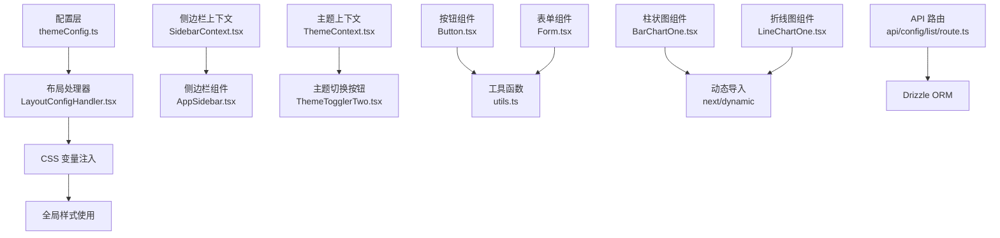
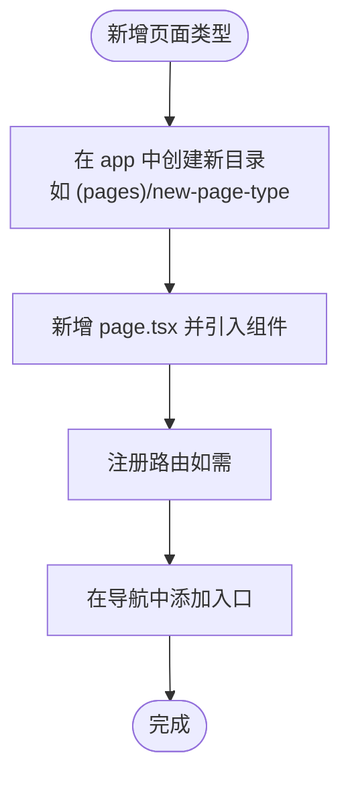
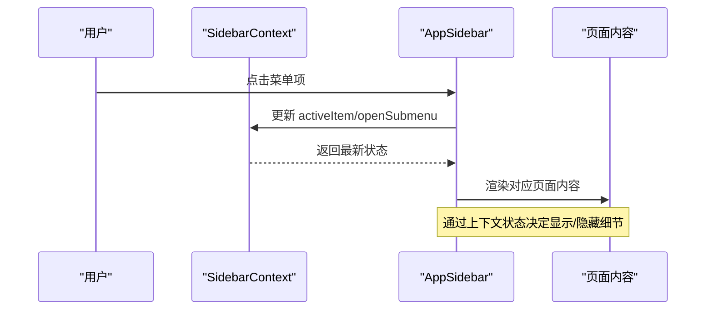
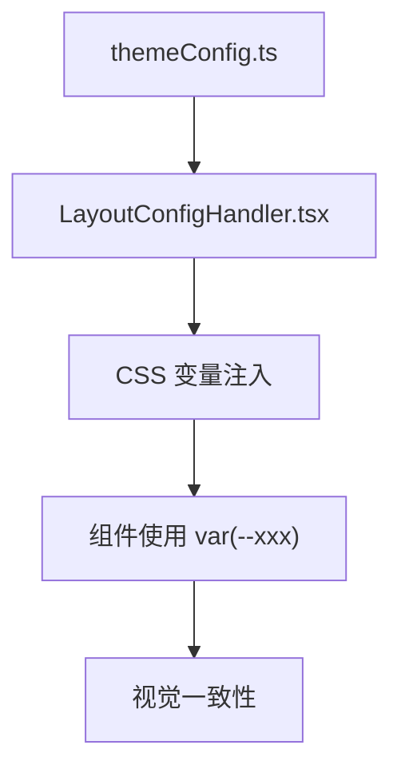
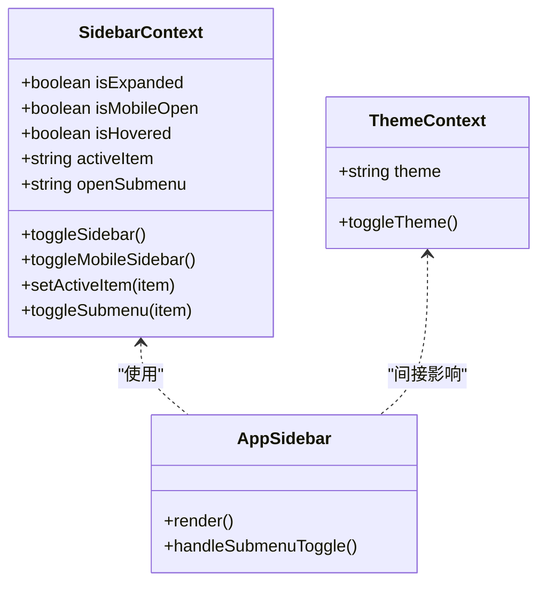
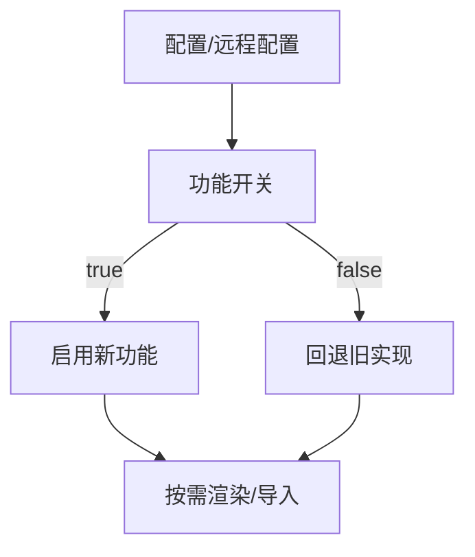
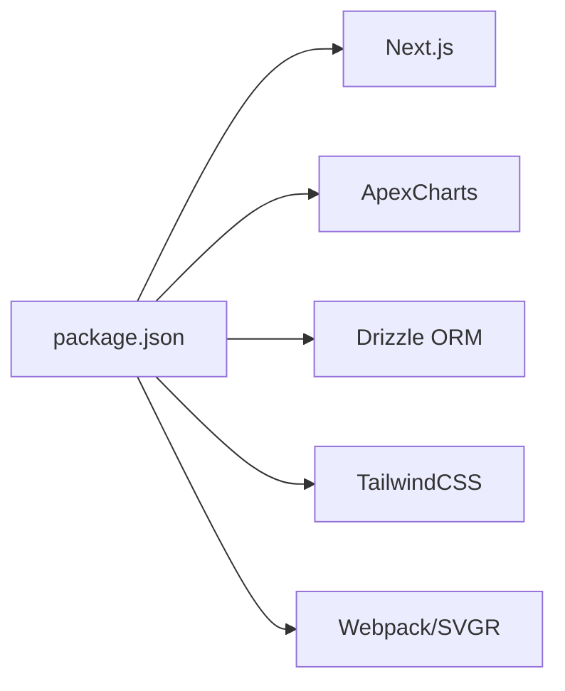

# 功能扩展模式

<cite>
**本文引用的文件**
- [src/app/layout.tsx](file://src/app/layout.tsx)
- [src/config/LayoutConfigHandler.tsx](file://src/config/LayoutConfigHandler.tsx)
- [src/config/themeConfig.ts](file://src/config/themeConfig.ts)
- [src/context/SidebarContext.tsx](file://src/context/SidebarContext.tsx)
- [src/context/ThemeContext.tsx](file://src/context/ThemeContext.tsx)
- [src/layout/AppSidebar.tsx](file://src/layout/AppSidebar.tsx)
- [src/components/charts/bar/BarChartOne.tsx](file://src/components/charts/bar/BarChartOne.tsx)
- [src/components/charts/line/LineChartOne.tsx](file://src/components/charts/line/LineChartOne.tsx)
- [src/components/form/Form.tsx](file://src/components/form/Form.tsx)
- [src/components/ui/button/Button.tsx](file://src/components/ui/button/Button.tsx)
- [src/app/api/config/list/route.ts](file://src/app/api/config/list/route.ts)
- [src/lib/utils.ts](file://src/lib/utils.ts)
- [package.json](file://package.json)
- [next.config.ts](file://next.config.ts)
</cite>

## 目录
1. [引言](#引言)
2. [项目结构](#项目结构)
3. [核心组件](#核心组件)
4. [架构总览](#架构总览)
5. [详细组件分析](#详细组件分析)
6. [依赖分析](#依赖分析)
7. [性能考虑](#性能考虑)
8. [故障排查指南](#故障排查指南)
9. [结论](#结论)
10. [附录](#附录)

## 引言
本文件系统性梳理该 Next.js 管理系统的功能扩展模式与可扩展架构设计，覆盖模块化扩展、插件化架构、配置驱动扩展三类常见方式；阐述接口定义、抽象层设计与依赖注入实践；解释功能开关、条件加载与 A/B 测试支持思路；并给出新增图表类型、扩展表单字段、添加新页面类型的实操案例，同时总结扩展点设计原则、向后兼容性与版本升级策略。

## 项目结构
该项目采用按功能域分层的组织方式：页面路由位于 app 目录，组件位于 components 目录，上下文与配置位于 context 与 config 目录，工具函数位于 lib 目录，页面侧边导航在 layout 目录中。整体结构清晰，便于按功能域进行扩展与维护。

```mermaid
graph TB
subgraph "应用入口"
L["src/app/layout.tsx"]
end
subgraph "主题与布局"
T["src/config/themeConfig.ts"]
H["src/config/LayoutConfigHandler.tsx"]
S["src/context/SidebarContext.tsx"]
Th["src/context/ThemeContext.tsx"]
end
subgraph "页面与导航"
A["src/layout/AppSidebar.tsx"]
end
subgraph "组件库"
Btn["src/components/ui/button/Button.tsx"]
F["src/components/form/Form.tsx"]
end
subgraph "图表"
BC["src/components/charts/bar/BarChartOne.tsx"]
LC["src/components/charts/line/LineChartOne.tsx"]
end
subgraph "API"
API["src/app/api/config/list/route.ts"]
end
subgraph "工具"
U["src/lib/utils.ts"]
end
L --> H
L --> S
L --> Th
H --> T
A --> S
Btn --> U
BC --> |"动态导入"| LC
API --> |"数据库访问"| U
```

**图示来源**
- [src/app/layout.tsx:16-32](file://src/app/layout.tsx#L16-L32)
- [src/config/LayoutConfigHandler.tsx:6-26](file://src/config/LayoutConfigHandler.tsx#L6-L26)
- [src/config/themeConfig.ts:4-30](file://src/config/themeConfig.ts#L4-L30)
- [src/context/SidebarContext.tsx:27-83](file://src/context/SidebarContext.tsx#L27-L83)
- [src/context/ThemeContext.tsx:15-49](file://src/context/ThemeContext.tsx#L15-L49)
- [src/layout/AppSidebar.tsx:104-376](file://src/layout/AppSidebar.tsx#L104-L376)
- [src/components/ui/button/Button.tsx:15-54](file://src/components/ui/button/Button.tsx#L15-L54)
- [src/components/form/Form.tsx:9-21](file://src/components/form/Form.tsx#L9-L21)
- [src/components/charts/bar/BarChartOne.tsx:6-10](file://src/components/charts/bar/BarChartOne.tsx#L6-L10)
- [src/components/charts/line/LineChartOne.tsx:6-10](file://src/components/charts/line/LineChartOne.tsx#L6-L10)
- [src/app/api/config/list/route.ts:7-77](file://src/app/api/config/list/route.ts#L7-L77)
- [src/lib/utils.ts:4-6](file://src/lib/utils.ts#L4-L6)

**章节来源**
- [src/app/layout.tsx:16-32](file://src/app/layout.tsx#L16-L32)
- [src/layout/AppSidebar.tsx:28-102](file://src/layout/AppSidebar.tsx#L28-L102)

## 核心组件
- 布局与主题配置
  - 主题配置集中于 themeConfig，通过 LayoutConfigHandler 将其映射为 CSS 变量，供全局样式使用。
  - 主题切换由 ThemeContext 管理，持久化到本地存储并在客户端生效。
- 导航与侧边栏
  - SidebarContext 提供展开/折叠、移动端状态、子菜单控制等能力；AppSidebar 使用该上下文渲染导航项与子菜单。
- 组件库与表单
  - Button 与 Form 组件以明确的 props 接口暴露行为，便于复用与扩展。
- 图表
  - BarChartOne 与 LineChartOne 通过动态导入减少首屏体积，支持按需加载。
- API 层
  - API 路由基于 Next.js App Router 的约定式路由，使用 Drizzle ORM 访问数据库，返回统一格式响应。

**章节来源**
- [src/config/themeConfig.ts:4-30](file://src/config/themeConfig.ts#L4-L30)
- [src/config/LayoutConfigHandler.tsx:6-26](file://src/config/LayoutConfigHandler.tsx#L6-L26)
- [src/context/ThemeContext.tsx:15-49](file://src/context/ThemeContext.tsx#L15-L49)
- [src/context/SidebarContext.tsx:27-83](file://src/context/SidebarContext.tsx#L27-L83)
- [src/layout/AppSidebar.tsx:104-376](file://src/layout/AppSidebar.tsx#L104-L376)
- [src/components/ui/button/Button.tsx:15-54](file://src/components/ui/button/Button.tsx#L15-L54)
- [src/components/form/Form.tsx:9-21](file://src/components/form/Form.tsx#L9-L21)
- [src/components/charts/bar/BarChartOne.tsx:6-10](file://src/components/charts/bar/BarChartOne.tsx#L6-L10)
- [src/components/charts/line/LineChartOne.tsx:6-10](file://src/components/charts/line/LineChartOne.tsx#L6-L10)
- [src/app/api/config/list/route.ts:7-77](file://src/app/api/config/list/route.ts#L7-L77)

## 架构总览
系统采用“配置驱动 + 上下文 + 组件化 + API 路由”的组合架构：
- 配置驱动：themeConfig 与 CSS 变量统一管理主题与布局参数，LayoutConfigHandler 在客户端注入变量，实现全局样式扩展。
- 上下文：SidebarContext 与 ThemeContext 提供跨组件的状态共享，便于扩展新的交互或主题能力。
- 组件化：Button、Form、图表组件均以 props 明确职责，利于替换与扩展。
- API 路由：约定式路由 + Drizzle ORM，统一返回结构，便于扩展数据模型与查询条件。



**图示来源**
- [src/config/themeConfig.ts:4-30](file://src/config/themeConfig.ts#L4-L30)
- [src/config/LayoutConfigHandler.tsx:6-26](file://src/config/LayoutConfigHandler.tsx#L6-L26)
- [src/context/SidebarContext.tsx:27-83](file://src/context/SidebarContext.tsx#L27-L83)
- [src/layout/AppSidebar.tsx:104-376](file://src/layout/AppSidebar.tsx#L104-L376)
- [src/context/ThemeContext.tsx:15-49](file://src/context/ThemeContext.tsx#L15-L49)
- [src/components/ui/button/Button.tsx:15-54](file://src/components/ui/button/Button.tsx#L15-L54)
- [src/components/form/Form.tsx:9-21](file://src/components/form/Form.tsx#L9-L21)
- [src/components/charts/bar/BarChartOne.tsx:6-10](file://src/components/charts/bar/BarChartOne.tsx#L6-L10)
- [src/components/charts/line/LineChartOne.tsx:6-10](file://src/components/charts/line/LineChartOne.tsx#L6-L10)
- [src/app/api/config/list/route.ts:7-77](file://src/app/api/config/list/route.ts#L7-L77)
- [src/lib/utils.ts:4-6](file://src/lib/utils.ts#L4-L6)

## 详细组件分析

### 模块化扩展（按功能域拆分）
- 页面路由与组件分离：app 下的页面按功能域组织，如 (chart)/(forms)/(ui-elements)，便于新增页面类型时仅需在对应目录新增页面。
- 组件库模块化：Button、Form 等组件以独立文件暴露接口，新增变体或尺寸时只需扩展 props 与样式映射。
- 图表模块化：BarChartOne 与 LineChartOne 各自封装配置与数据，新增图表类型时可复制现有结构并调整配置。



**章节来源**
- [src/layout/AppSidebar.tsx:28-102](file://src/layout/AppSidebar.tsx#L28-L102)
- [src/components/ui/button/Button.tsx:15-54](file://src/components/ui/button/Button.tsx#L15-L54)
- [src/components/form/Form.tsx:9-21](file://src/components/form/Form.tsx#L9-L21)

### 插件化架构（动态导入与条件渲染）
- 动态导入：图表组件通过 next/dynamic 按需加载，降低首屏体积，适合未来引入更多重型可视化库。
- 条件渲染：导航与 UI 元素根据 SidebarContext 状态动态显示/隐藏文本与图标，便于扩展更多交互状态。
- 功能开关：可在配置层增加布尔开关，结合环境变量或远程配置，控制某功能是否启用。



**图示来源**
- [src/context/SidebarContext.tsx:27-83](file://src/context/SidebarContext.tsx#L27-L83)
- [src/layout/AppSidebar.tsx:104-376](file://src/layout/AppSidebar.tsx#L104-L376)

**章节来源**
- [src/components/charts/bar/BarChartOne.tsx:6-10](file://src/components/charts/bar/BarChartOne.tsx#L6-L10)
- [src/components/charts/line/LineChartOne.tsx:6-10](file://src/components/charts/line/LineChartOne.tsx#L6-L10)
- [src/context/SidebarContext.tsx:27-83](file://src/context/SidebarContext.tsx#L27-L83)

### 配置驱动扩展（CSS 变量与主题）
- 主题配置：themeConfig 定义尺寸、间距、圆角与颜色；LayoutConfigHandler 注入为 CSS 变量，组件通过 var(...) 使用。
- 扩展点：新增主题色板或布局参数时，仅需修改 themeConfig 与相关 CSS 变量，无需改动组件内部硬编码值。
- 一致性：Button、图表等组件通过 CSS 变量统一风格，避免重复样式。



**图示来源**
- [src/config/themeConfig.ts:4-30](file://src/config/themeConfig.ts#L4-L30)
- [src/config/LayoutConfigHandler.tsx:6-26](file://src/config/LayoutConfigHandler.tsx#L6-L26)
- [src/components/ui/button/Button.tsx:43-45](file://src/components/ui/button/Button.tsx#L43-L45)

**章节来源**
- [src/config/themeConfig.ts:4-30](file://src/config/themeConfig.ts#L4-L30)
- [src/config/LayoutConfigHandler.tsx:6-26](file://src/config/LayoutConfigHandler.tsx#L6-L26)
- [src/components/ui/button/Button.tsx:43-45](file://src/components/ui/button/Button.tsx#L43-L45)

### 接口定义、抽象层与依赖注入
- 接口定义：Button、Form 等组件以明确的 props 接口定义行为，便于替换与扩展。
- 抽象层：SidebarContext 与 ThemeContext 抽象出状态与行为，组件只依赖接口，不关心实现细节。
- 依赖注入：在根布局中注入 Provider，子树自动获得上下文，形成“依赖注入”效果。



**图示来源**
- [src/context/SidebarContext.tsx:4-25](file://src/context/SidebarContext.tsx#L4-L25)
- [src/context/ThemeContext.tsx:8-11](file://src/context/ThemeContext.tsx#L8-L11)
- [src/layout/AppSidebar.tsx:104-376](file://src/layout/AppSidebar.tsx#L104-L376)

**章节来源**
- [src/context/SidebarContext.tsx:4-25](file://src/context/SidebarContext.tsx#L4-L25)
- [src/context/ThemeContext.tsx:8-11](file://src/context/ThemeContext.tsx#L8-L11)
- [src/layout/AppSidebar.tsx:104-376](file://src/layout/AppSidebar.tsx#L104-L376)

### 功能开关机制、条件加载与 A/B 测试支持
- 功能开关：在配置层增加布尔开关，结合环境变量或远程配置，控制某功能是否启用。
- 条件加载：通过动态导入与上下文状态控制组件渲染，实现按需加载与延迟初始化。
- A/B 测试：可通过远程配置下发实验组标识，组件根据标识选择不同实现或样式，保持一致的接口与行为。



[本节为概念性说明，未直接分析具体文件，故无章节来源]

### 具体扩展案例

#### 新增图表类型
- 复制现有图表组件结构，调整配置与数据源，使用动态导入减少首屏体积。
- 若需多类型图表，可在配置层统一管理选项集合，组件按类型参数渲染。

**章节来源**
- [src/components/charts/bar/BarChartOne.tsx:6-10](file://src/components/charts/bar/BarChartOne.tsx#L6-L10)
- [src/components/charts/line/LineChartOne.tsx:6-10](file://src/components/charts/line/LineChartOne.tsx#L6-L10)

#### 扩展表单字段
- 在表单组件库中新增输入组件，遵循 Form 的接口约定，确保统一的事件处理与样式。
- 通过 props 扩展尺寸、校验规则与交互行为，保持与现有组件的一致性。

**章节来源**
- [src/components/form/Form.tsx:9-21](file://src/components/form/Form.tsx#L9-L21)

#### 添加新页面类型
- 在 app 下创建新页面目录，新增 page.tsx 并在导航中注册入口。
- 如需特殊布局或上下文，可在页面内注入相应 Provider 或使用布局组件。

**章节来源**
- [src/layout/AppSidebar.tsx:28-102](file://src/layout/AppSidebar.tsx#L28-L102)

### 扩展点设计原则
- 单一职责：每个组件/模块聚焦一个功能领域。
- 开闭原则：对扩展开放，对修改关闭；通过配置与接口扩展而非硬编码。
- 依赖倒置：组件依赖抽象接口，通过上下文或配置注入实现。
- 一致性：通过 CSS 变量与统一组件库保证视觉与交互一致性。

[本节为原则性总结，未直接分析具体文件，故无章节来源]

### 版本升级策略
- 语义化版本：大版本升级时谨慎变更公共接口；小版本修复与新增功能保持向后兼容。
- 渐进迁移：通过功能开关与条件加载，逐步替换旧实现，降低风险。
- 文档与测试：完善扩展点文档与回归测试，确保升级过程可追踪与可验证。

[本节为策略性总结，未直接分析具体文件，故无章节来源]

## 依赖分析
- 运行时依赖：Next.js、ApexCharts、TailwindCSS、Drizzle ORM 等。
- 构建依赖：SVGR、PostCSS、TailwindCSS v4 等。
- Webpack 配置：SVG 资源通过 SVGR 转换为组件，便于在组件中直接使用 SVG。



**图示来源**
- [package.json:15-49](file://package.json#L15-L49)
- [next.config.ts:5-11](file://next.config.ts#L5-L11)

**章节来源**
- [package.json:15-49](file://package.json#L15-L49)
- [next.config.ts:5-11](file://next.config.ts#L5-L11)

## 性能考虑
- 动态导入：图表组件使用动态导入，减少首屏包体积，提升加载速度。
- 条件渲染：根据上下文状态决定渲染细节，避免不必要的 DOM 结构。
- CSS 变量：通过 CSS 变量统一主题与布局，减少重复样式计算。
- 工具函数：使用合并类名工具减少样式冲突与重排。

**章节来源**
- [src/components/charts/bar/BarChartOne.tsx:6-10](file://src/components/charts/bar/BarChartOne.tsx#L6-L10)
- [src/components/charts/line/LineChartOne.tsx:6-10](file://src/components/charts/line/LineChartOne.tsx#L6-L10)
- [src/lib/utils.ts:4-6](file://src/lib/utils.ts#L4-L6)

## 故障排查指南
- 主题不生效
  - 检查 LayoutConfigHandler 是否正确注入 CSS 变量。
  - 确认 themeConfig 中的键名与组件中的 var(...) 使用一致。
- 导航状态异常
  - 检查 SidebarContext 的状态更新逻辑与 AppSidebar 的订阅关系。
- 图表不显示
  - 确认动态导入路径与 SSR 配置；检查图表容器尺寸与最小宽度设置。
- API 查询失败
  - 查看请求体参数与数据库连接；确认 Drizzle ORM 查询条件与分页逻辑。

**章节来源**
- [src/config/LayoutConfigHandler.tsx:6-26](file://src/config/LayoutConfigHandler.tsx#L6-L26)
- [src/context/SidebarContext.tsx:27-83](file://src/context/SidebarContext.tsx#L27-L83)
- [src/layout/AppSidebar.tsx:104-376](file://src/layout/AppSidebar.tsx#L104-L376)
- [src/components/charts/bar/BarChartOne.tsx:99-109](file://src/components/charts/bar/BarChartOne.tsx#L99-L109)
- [src/app/api/config/list/route.ts:7-77](file://src/app/api/config/list/route.ts#L7-L77)

## 结论
该系统通过“配置驱动 + 上下文 + 组件化 + API 路由”的架构实现了良好的可扩展性。模块化扩展、插件化加载与配置驱动三者协同，既保证了开发效率，也兼顾了运行时性能与一致性。建议在后续版本中进一步完善功能开关与 A/B 测试机制，并持续沉淀扩展点文档与迁移策略。

## 附录
- 术语
  - 配置驱动：通过集中式配置与 CSS 变量实现全局样式与布局扩展。
  - 插件化：通过动态导入与条件渲染实现按需加载与功能替换。
  - 功能开关：通过布尔开关或远程配置控制功能启用/禁用。
- 最佳实践
  - 保持接口稳定，优先通过配置与上下文扩展而非破坏性修改。
  - 对重型依赖采用动态导入，优化首屏性能。
  - 使用统一的组件库与样式规范，确保一致性与可维护性。