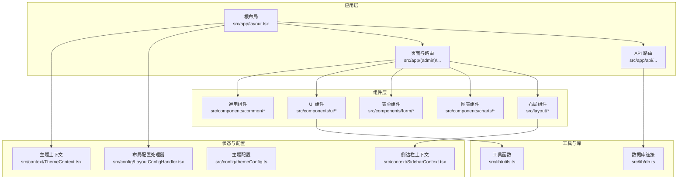
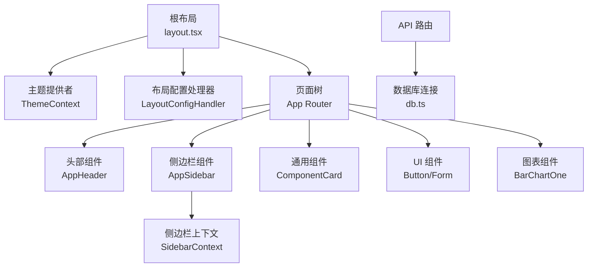
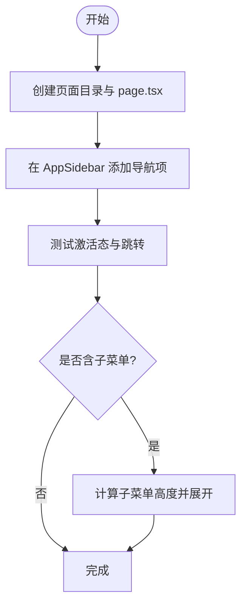
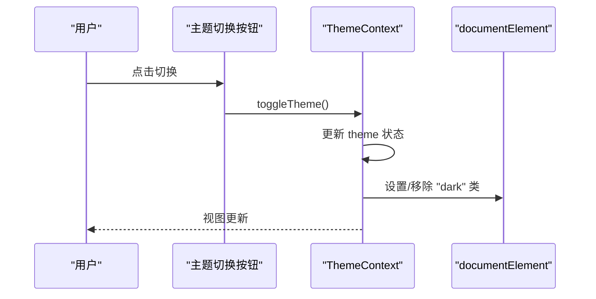
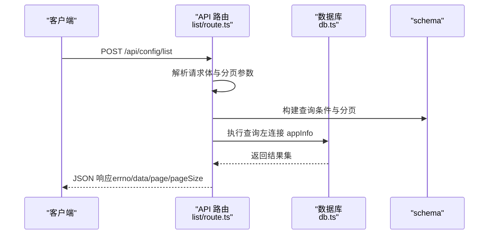
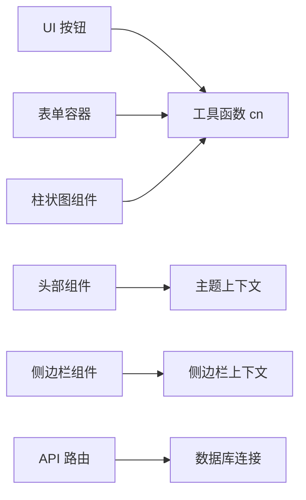

# 扩展开发指南

<cite>
**本文档引用的文件**
- [README.md](file://README.md)
- [package.json](file://package.json)
- [src/app/layout.tsx](file://src/app/layout.tsx)
- [src/config/themeConfig.ts](file://src/config/themeConfig.ts)
- [src/config/LayoutConfigHandler.tsx](file://src/config/LayoutConfigHandler.tsx)
- [src/context/ThemeContext.tsx](file://src/context/ThemeContext.tsx)
- [src/context/SidebarContext.tsx](file://src/context/SidebarContext.tsx)
- [src/lib/utils.ts](file://src/lib/utils.ts)
- [src/components/common/ComponentCard.tsx](file://src/components/common/ComponentCard.tsx)
- [src/components/ui/button/Button.tsx](file://src/components/ui/button/Button.tsx)
- [src/components/form/Form.tsx](file://src/components/form/Form.tsx)
- [src/components/charts/bar/BarChartOne.tsx](file://src/components/charts/bar/BarChartOne.tsx)
- [src/layout/AppHeader.tsx](file://src/layout/AppHeader.tsx)
- [src/layout/AppSidebar.tsx](file://src/layout/AppSidebar.tsx)
- [src/app/api/config/list/route.ts](file://src/app/api/config/list/route.ts)
- [src/lib/db.ts](file://src/lib/db.ts)
- [src/hooks/useModal.ts](file://src/hooks/useModal.ts)
- [src/hooks/useGoBack.ts](file://src/hooks/useGoBack.ts)
</cite>

## 目录
1. [简介](#简介)
2. [项目结构](#项目结构)
3. [核心组件](#核心组件)
4. [架构总览](#架构总览)
5. [详细组件分析](#详细组件分析)
6. [依赖关系分析](#依赖关系分析)
7. [性能考量](#性能考量)
8. [故障排查指南](#故障排查指南)
9. [结论](#结论)
10. [附录](#附录)

## 简介
本指南面向需要深度定制或扩展现有功能的高级开发者，系统讲解如何在现有 Next.js 管理系统中进行扩展开发。内容涵盖：新增组件与页面、扩展现有功能、集成第三方库；组件开发规范、页面路由添加流程、状态管理扩展、API 接口开发；代码结构设计原则、命名约定、文件组织、文档编写规范；扩展开发最佳实践、测试策略、版本兼容性与向后兼容性保证。

## 项目结构
该系统采用 Next.js App Router 的目录结构，页面按功能域分组，组件按复用层级组织，上下文提供主题与侧边栏状态管理，API 路由集中于 src/app/api 下，数据库通过 Drizzle ORM 连接 PostgreSQL。

**图示来源**
- [src/app/layout.tsx:16-32](file://src/app/layout.tsx#L16-L32)
- [src/context/ThemeContext.tsx:15-49](file://src/context/ThemeContext.tsx#L15-L49)
- [src/context/SidebarContext.tsx:27-83](file://src/context/SidebarContext.tsx#L27-L83)
- [src/config/LayoutConfigHandler.tsx:6-26](file://src/config/LayoutConfigHandler.tsx#L6-L26)
- [src/lib/db.ts:1-19](file://src/lib/db.ts#L1-L19)

**章节来源**
- [README.md:11-201](file://README.md#L11-L201)
- [package.json:15-79](file://package.json#L15-L79)
- [src/app/layout.tsx:16-32](file://src/app/layout.tsx#L16-L32)

## 核心组件
- 主题与布局
  - 主题上下文：提供明暗主题切换与本地持久化，确保客户端渲染安全。
  - 布局配置处理器：将主题配置映射为 CSS 变量，供组件样式使用。
  - 根布局：统一注入主题、侧边栏、全局样式与通知组件。
- 侧边栏与导航
  - 侧边栏上下文：管理展开/折叠、移动端显示、子菜单状态等。
  - 侧边栏组件：根据上下文动态控制宽度、图标与文字显示，并维护激活态。
  - 头部组件：集成搜索快捷键、主题切换、通知与用户下拉菜单。
- 组件体系
  - 通用卡片组件：统一卡片头部与内容区，支持描述文本与自定义类名。
  - UI 按钮：支持尺寸、变体、图标、禁用态与类名扩展。
  - 表单容器：统一处理默认提交行为，便于业务表单封装。
  - 图表组件：基于 ApexCharts 动态导入，避免 SSR 渲染问题。
- 工具与钩子
  - 工具函数：基于 clsx 与 tailwind-merge 合并类名，简化样式组合。
  - 钩子：useModal 提供弹窗状态管理；useGoBack 提供回退逻辑。

**章节来源**
- [src/context/ThemeContext.tsx:15-59](file://src/context/ThemeContext.tsx#L15-L59)
- [src/config/LayoutConfigHandler.tsx:6-30](file://src/config/LayoutConfigHandler.tsx#L6-L30)
- [src/app/layout.tsx:16-32](file://src/app/layout.tsx#L16-L32)
- [src/context/SidebarContext.tsx:27-85](file://src/context/SidebarContext.tsx#L27-L85)
- [src/layout/AppSidebar.tsx:104-376](file://src/layout/AppSidebar.tsx#L104-L376)
- [src/layout/AppHeader.tsx:10-182](file://src/layout/AppHeader.tsx#L10-L182)
- [src/components/common/ComponentCard.tsx:10-41](file://src/components/common/ComponentCard.tsx#L10-L41)
- [src/components/ui/button/Button.tsx:15-57](file://src/components/ui/button/Button.tsx#L15-L57)
- [src/components/form/Form.tsx:9-24](file://src/components/form/Form.tsx#L9-L24)
- [src/components/charts/bar/BarChartOne.tsx:6-111](file://src/components/charts/bar/BarChartOne.tsx#L6-L111)
- [src/lib/utils.ts:4-7](file://src/lib/utils.ts#L4-L7)
- [src/hooks/useModal.ts:4-13](file://src/hooks/useModal.ts#L4-L13)
- [src/hooks/useGoBack.ts:3-18](file://src/hooks/useGoBack.ts#L3-L18)

## 架构总览
系统采用“布局-上下文-组件-页面/API”的分层架构。布局负责全局注入与主题变量；上下文提供状态共享；组件以可复用与可组合为目标；页面与 API 路由分别承载视图与数据访问。

**图示来源**
- [src/app/layout.tsx:16-32](file://src/app/layout.tsx#L16-L32)
- [src/context/ThemeContext.tsx:15-49](file://src/context/ThemeContext.tsx#L15-L49)
- [src/config/LayoutConfigHandler.tsx:6-26](file://src/config/LayoutConfigHandler.tsx#L6-L26)
- [src/layout/AppHeader.tsx:10-182](file://src/layout/AppHeader.tsx#L10-L182)
- [src/layout/AppSidebar.tsx:104-376](file://src/layout/AppSidebar.tsx#L104-L376)
- [src/context/SidebarContext.tsx:27-83](file://src/context/SidebarContext.tsx#L27-L83)
- [src/components/common/ComponentCard.tsx:10-41](file://src/components/common/ComponentCard.tsx#L10-L41)
- [src/components/ui/button/Button.tsx:15-57](file://src/components/ui/button/Button.tsx#L15-L57)
- [src/components/form/Form.tsx:9-24](file://src/components/form/Form.tsx#L9-L24)
- [src/components/charts/bar/BarChartOne.tsx:6-111](file://src/components/charts/bar/BarChartOne.tsx#L6-L111)
- [src/lib/db.ts:1-19](file://src/lib/db.ts#L1-L19)

## 详细组件分析

### 组件开发规范与最佳实践
- 设计原则
  - 单一职责：每个组件聚焦一个功能点，避免过度耦合。
  - 可组合性：通过 children、className、disabled 等属性增强可扩展性。
  - 可访问性：提供 aria-* 属性与键盘交互（如搜索快捷键）。
  - 暗色适配：遵循主题上下文与 CSS 变量，确保深色模式一致性。
- 命名约定
  - 文件名：帕斯卡命名（如 Button.tsx），避免复数与空格。
  - 组件名：与文件名一致，导出默认组件。
  - 类名：优先使用主题变量与 Tailwind 工具类，减少内联样式。
- 文件组织
  - 通用组件放置于 common；UI 组件放置于 ui；表单组件放置于 form；图表组件放置于 charts。
  - 页面级组件置于 src/app 下对应功能域。
- 文档编写
  - 在组件注释中说明 props、行为与注意事项；复杂组件提供使用路径与示例。

**章节来源**
- [src/components/ui/button/Button.tsx:15-57](file://src/components/ui/button/Button.tsx#L15-L57)
- [src/components/common/ComponentCard.tsx:10-41](file://src/components/common/ComponentCard.tsx#L10-L41)
- [src/layout/AppHeader.tsx:28-41](file://src/layout/AppHeader.tsx#L28-L41)
- [src/config/LayoutConfigHandler.tsx:6-26](file://src/config/LayoutConfigHandler.tsx#L6-L26)

### 页面路由添加流程
- 新增页面
  - 在 src/app 下创建目标路径的目录与 page.tsx。
  - 如需分组，使用括号目录实现路由分组与布局隔离。
  - 在 AppSidebar 的导航配置中添加对应菜单项，确保激活态与跳转正确。
- 导航与激活
  - 使用 usePathname 与 isActive 判断当前激活项，保持导航一致性。
  - 子菜单高度通过 scrollHeight 计算，配合过渡动画实现平滑展开。
- 示例参考
  - 侧边栏导航项与子菜单渲染逻辑。
  - 头部组件中的搜索快捷键绑定。

**图示来源**
- [src/layout/AppSidebar.tsx:243-296](file://src/layout/AppSidebar.tsx#L243-L296)
- [src/layout/AppSidebar.tsx:104-376](file://src/layout/AppSidebar.tsx#L104-L376)

**章节来源**
- [src/layout/AppSidebar.tsx:28-102](file://src/layout/AppSidebar.tsx#L28-L102)
- [src/layout/AppSidebar.tsx:104-376](file://src/layout/AppSidebar.tsx#L104-L376)

### 状态管理扩展
- 主题状态
  - 通过 ThemeProvider 管理明暗主题，localStorage 持久化，切换时更新 documentElement 的 dark 类。
- 侧边栏状态
  - SidebarProvider 统一管理展开/折叠、移动端显示、子菜单开关与激活项。
  - 响应式处理：监听窗口尺寸，移动端自动收起侧边栏。
- 使用方式
  - 在需要的组件中使用 useTheme 与 useSidebar 获取状态与方法。
  - 通过 cn 工具函数合并条件类名，确保样式与状态联动。

**图示来源**
- [src/context/ThemeContext.tsx:41-43](file://src/context/ThemeContext.tsx#L41-L43)
- [src/context/ThemeContext.tsx:30-39](file://src/context/ThemeContext.tsx#L30-L39)

**章节来源**
- [src/context/ThemeContext.tsx:15-59](file://src/context/ThemeContext.tsx#L15-L59)
- [src/context/SidebarContext.tsx:27-85](file://src/context/SidebarContext.tsx#L27-L85)
- [src/lib/utils.ts:4-7](file://src/lib/utils.ts#L4-L7)

### API 接口开发
- 数据库连接
  - 使用 Drizzle ORM 与 PostgreSQL 连接池，支持 SSL 自动判断。
- 列表接口示例
  - 支持多条件过滤（名称模糊匹配、appId、version）、分页参数校验与限制。
  - 左连接 appInfo 查询应用名称，按创建时间倒序返回。
  - 异常捕获并返回标准化错误响应。
- 开发建议
  - 对请求体进行严格类型校验与边界值处理。
  - 分页参数限制在合理范围，防止过大请求导致性能问题。
  - 返回结构保持统一字段，便于前端消费。

**图示来源**
- [src/app/api/config/list/route.ts:7-77](file://src/app/api/config/list/route.ts#L7-L77)
- [src/lib/db.ts:1-19](file://src/lib/db.ts#L1-L19)

**章节来源**
- [src/app/api/config/list/route.ts:7-77](file://src/app/api/config/list/route.ts#L7-L77)
- [src/lib/db.ts:1-19](file://src/lib/db.ts#L1-L19)

### 扩展现有功能
- 扩展 UI 组件
  - 在现有组件基础上增加受控属性（如 size、variant、disabled），保持默认值与主题变量一致。
  - 通过 className 允许外部覆盖样式，避免破坏主题一致性。
- 扩展图表组件
  - 保持动态导入与 SSR 安全（ssr: false），并在组件内部集中配置选项。
  - 将系列数据与配置分离，便于外部传入。
- 扩展页面与导航
  - 在 AppSidebar 中注册新菜单项，确保路径与激活态逻辑生效。
  - 为新页面提供面包屑与标题，提升可发现性。

**章节来源**
- [src/components/ui/button/Button.tsx:15-57](file://src/components/ui/button/Button.tsx#L15-L57)
- [src/components/charts/bar/BarChartOne.tsx:6-111](file://src/components/charts/bar/BarChartOne.tsx#L6-L111)
- [src/layout/AppSidebar.tsx:28-102](file://src/layout/AppSidebar.tsx#L28-L102)

### 集成第三方库
- 建议遵循
  - 在 package.json 中声明依赖，避免重复安装与版本冲突。
  - 对于需要 SSR 不支持的库，采用动态导入并设置 ssr: false。
  - 通过环境变量与配置模块集中管理第三方库的初始化参数。
- 示例参考
  - 图表库：动态导入 react-apexcharts，避免 SSR 报错。
  - UI 库：使用 shadcn 组件时，遵循官方安装与配置流程。

**章节来源**
- [package.json:15-79](file://package.json#L15-L79)
- [src/components/charts/bar/BarChartOne.tsx:6-111](file://src/components/charts/bar/BarChartOne.tsx#L6-L111)

## 依赖关系分析
- 内部依赖
  - 组件依赖上下文（ThemeContext、SidebarContext）与工具函数（cn）。
  - 页面依赖布局组件与通用组件，API 路由依赖数据库连接。
- 外部依赖
  - Next.js 16、React 19、TypeScript、Tailwind CSS v4。
  - Drizzle ORM、PostgreSQL、ApexCharts、Flatpickr 等。

**图示来源**
- [src/lib/utils.ts:4-7](file://src/lib/utils.ts#L4-L7)
- [src/context/ThemeContext.tsx:15-49](file://src/context/ThemeContext.tsx#L15-L49)
- [src/context/SidebarContext.tsx:27-83](file://src/context/SidebarContext.tsx#L27-L83)
- [src/app/api/config/list/route.ts:7-77](file://src/app/api/config/list/route.ts#L7-L77)
- [src/lib/db.ts:1-19](file://src/lib/db.ts#L1-L19)

**章节来源**
- [package.json:15-79](file://package.json#L15-L79)

## 性能考量
- 组件加载
  - 对仅客户端渲染的组件使用动态导入，减少首屏体积与 SSR 成本。
- 样式与主题
  - 使用 CSS 变量与工具函数合并类名，避免运行时大量字符串拼接。
- 数据查询
  - 对列表接口限制分页大小，避免一次性返回过多数据。
- 响应式与动画
  - 侧边栏与子菜单使用过渡与高度计算，注意在大列表时的性能影响。

[本节为通用指导，无需特定文件引用]

## 故障排查指南
- 主题切换无效
  - 检查 ThemeProvider 是否包裹根布局，确认 localStorage 读取与 documentElement 类名设置。
- 侧边栏不显示或无法展开
  - 确认 SidebarProvider 包裹范围，检查窗口尺寸监听与移动端状态。
- 图表不渲染
  - 确认动态导入与 ssr: false 设置，检查客户端执行环境。
- API 查询异常
  - 检查 POSTGRES_URL 环境变量与连接池配置，查看 Drizzle ORM 错误日志。
- 回退逻辑异常
  - useGoBack 在无历史记录时会跳转首页，确认路由栈状态。

**章节来源**
- [src/context/ThemeContext.tsx:21-39](file://src/context/ThemeContext.tsx#L21-L39)
- [src/context/SidebarContext.tsx:37-52](file://src/context/SidebarContext.tsx#L37-L52)
- [src/components/charts/bar/BarChartOne.tsx:6-111](file://src/components/charts/bar/BarChartOne.tsx#L6-L111)
- [src/lib/db.ts:7-16](file://src/lib/db.ts#L7-L16)
- [src/hooks/useGoBack.ts:6-12](file://src/hooks/useGoBack.ts#L6-L12)

## 结论
本指南提供了从架构到实现细节的完整扩展开发路径。遵循组件开发规范、页面路由流程、状态管理与 API 开发的最佳实践，结合性能优化与故障排查策略，可在保证向后兼容性的前提下高效扩展系统能力。

[本节为总结，无需特定文件引用]

## 附录
- 版本与兼容性
  - Next.js 16、React 19、Tailwind CSS v4，升级时关注迁移指南与依赖兼容。
- 测试策略建议
  - 单元测试：针对纯函数与工具函数（如 cn）。
  - 组件测试：使用测试框架模拟上下文与路由，验证渲染与交互。
  - 集成测试：对 API 路由进行端到端测试，覆盖边界与异常分支。
- 文档与规范
  - 组件注释与使用示例路径，保持与源码同步更新。

**章节来源**
- [README.md:110-167](file://README.md#L110-L167)
- [package.json:15-79](file://package.json#L15-L79)