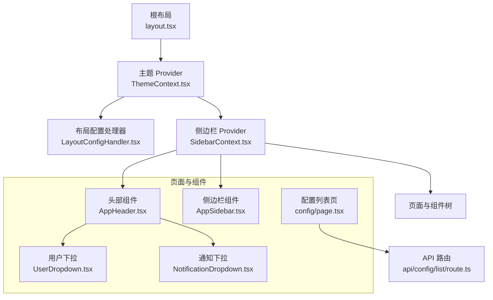
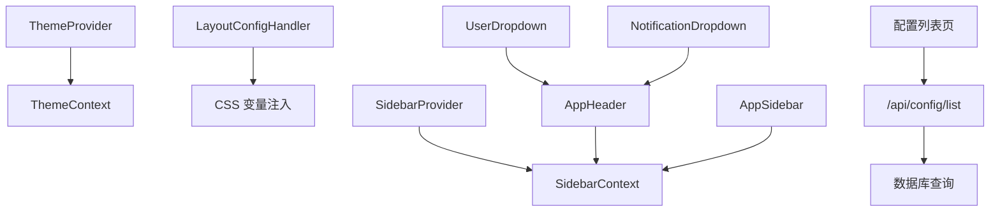
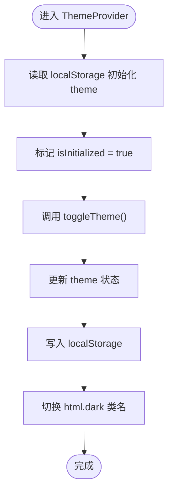
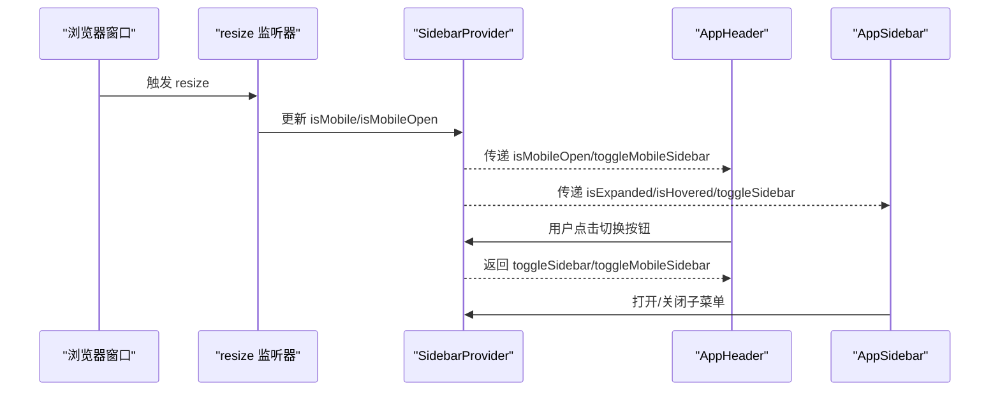
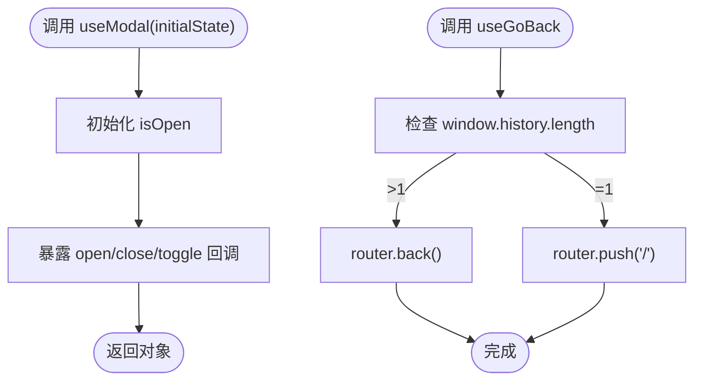
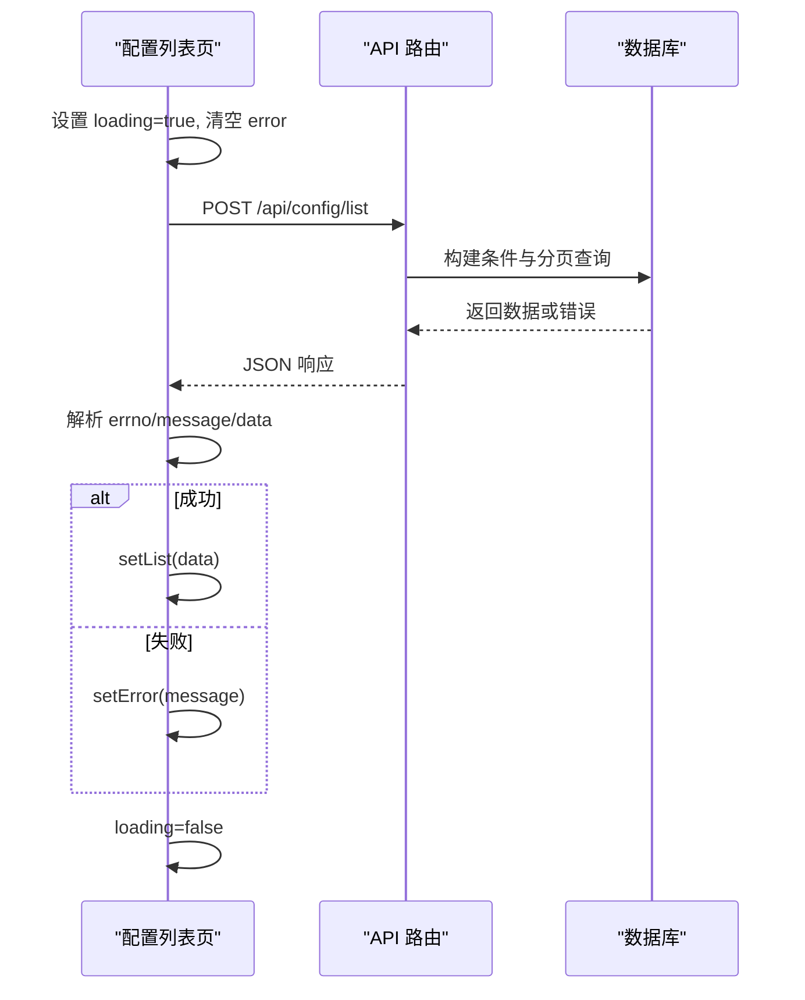
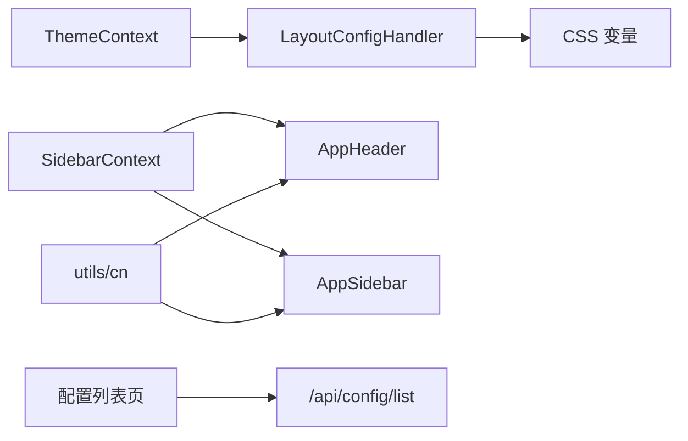

# 状态管理扩展

<cite>
**本文引用的文件**
- [src/context/SidebarContext.tsx](file://src/context/SidebarContext.tsx)
- [src/context/ThemeContext.tsx](file://src/context/ThemeContext.tsx)
- [src/hooks/useModal.ts](file://src/hooks/useModal.ts)
- [src/hooks/useGoBack.ts](file://src/hooks/useGoBack.ts)
- [src/layout/AppHeader.tsx](file://src/layout/AppHeader.tsx)
- [src/layout/AppSidebar.tsx](file://src/layout/AppSidebar.tsx)
- [src/components/header/UserDropdown.tsx](file://src/components/header/UserDropdown.tsx)
- [src/components/header/NotificationDropdown.tsx](file://src/components/header/NotificationDropdown.tsx)
- [src/app/layout.tsx](file://src/app/layout.tsx)
- [src/config/LayoutConfigHandler.tsx](file://src/config/LayoutConfigHandler.tsx)
- [src/lib/utils.ts](file://src/lib/utils.ts)
- [src/app/(admin)/(others-pages)/(scene)/config/page.tsx](file://src/app/(admin)/(others-pages)/(scene)/config/page.tsx)
- [src/app/api/config/list/route.ts](file://src/app/api/config/list/route.ts)
</cite>

## 目录
1. [引言](#引言)
2. [项目结构](#项目结构)
3. [核心组件](#核心组件)
4. [架构总览](#架构总览)
5. [详细组件分析](#详细组件分析)
6. [依赖分析](#依赖分析)
7. [性能考虑](#性能考虑)
8. [故障排查指南](#故障排查指南)
9. [结论](#结论)
10. [附录](#附录)

## 引言
本文件围绕现有 Context 系统进行状态管理扩展，系统性说明如何新增 Context、设计状态结构、编写 Reducer、开发自定义 Hook、实现状态持久化与跨组件通信，并总结状态管理最佳实践（状态提升、隔离、异步处理）、调试与性能监控、以及内存泄漏预防策略。文档以仓库中已有的 SidebarContext、ThemeContext、useModal、useGoBack 等为起点，结合页面级状态与 API 调用示例，给出可直接落地的扩展方案。

## 项目结构
Next.js 应用采用客户端组件与服务端路由并存的组织方式，状态管理主要通过 Context Provider 层叠在根布局下，子组件通过自定义 Hook 访问状态。主题与侧边栏状态由顶层 Provider 提供，页面组件在需要时组合本地状态与异步数据。

图表来源
- [src/app/layout.tsx:16-32](file://src/app/layout.tsx#L16-L32)
- [src/context/ThemeContext.tsx:15-49](file://src/context/ThemeContext.tsx#L15-L49)
- [src/config/LayoutConfigHandler.tsx:6-26](file://src/config/LayoutConfigHandler.tsx#L6-L26)
- [src/context/SidebarContext.tsx:27-83](file://src/context/SidebarContext.tsx#L27-L83)
- [src/layout/AppHeader.tsx:10-25](file://src/layout/AppHeader.tsx#L10-L25)
- [src/layout/AppSidebar.tsx:104-106](file://src/layout/AppSidebar.tsx#L104-L106)
- [src/components/header/UserDropdown.tsx:8-18](file://src/components/header/UserDropdown.tsx#L8-L18)
- [src/components/header/NotificationDropdown.tsx:8-23](file://src/components/header/NotificationDropdown.tsx#L8-L23)
- [src/app/(admin)/(others-pages)/(scene)/config/page.tsx:48-93](file://src/app/(admin)/(others-pages)/(scene)/config/page.tsx#L48-L93)
- [src/app/api/config/list/route.ts:7-26](file://src/app/api/config/list/route.ts#L7-L26)

章节来源
- [src/app/layout.tsx:16-32](file://src/app/layout.tsx#L16-L32)
- [src/context/ThemeContext.tsx:15-49](file://src/context/ThemeContext.tsx#L15-L49)
- [src/context/SidebarContext.tsx:27-83](file://src/context/SidebarContext.tsx#L27-L83)
- [src/config/LayoutConfigHandler.tsx:6-26](file://src/config/LayoutConfigHandler.tsx#L6-L26)

## 核心组件
- 主题 Context：提供主题切换与持久化，基于本地存储与 DOM 类名控制深浅色态。
- 侧边栏 Context：集中管理展开/收起、移动端开关、悬停展开、活动项与子菜单状态。
- 自定义 Hook：useModal 提供模态框状态与操作；useGoBack 提供回退导航逻辑。
- 页面级状态：配置列表页展示本地状态与异步加载流程，体现“本地状态 + 外部数据”的常见模式。

章节来源
- [src/context/ThemeContext.tsx:15-58](file://src/context/ThemeContext.tsx#L15-L58)
- [src/context/SidebarContext.tsx:27-83](file://src/context/SidebarContext.tsx#L27-L83)
- [src/hooks/useModal.ts:4-12](file://src/hooks/useModal.ts#L4-L12)
- [src/hooks/useGoBack.ts:3-14](file://src/hooks/useGoBack.ts#L3-L14)
- [src/app/(admin)/(others-pages)/(scene)/config/page.tsx:48-93](file://src/app/(admin)/(others-pages)/(scene)/config/page.tsx#L48-L93)

## 架构总览
顶层 Provider 将主题与布局配置注入全局，再由侧边栏 Provider 管理 UI 状态。页面组件通过自定义 Hook 获取状态并触发更新，同时在需要时与 API 路由交互。

图表来源
- [src/app/layout.tsx:24-28](file://src/app/layout.tsx#L24-L28)
- [src/context/ThemeContext.tsx:15-49](file://src/context/ThemeContext.tsx#L15-L49)
- [src/config/LayoutConfigHandler.tsx:6-26](file://src/config/LayoutConfigHandler.tsx#L6-L26)
- [src/context/SidebarContext.tsx:27-83](file://src/context/SidebarContext.tsx#L27-L83)
- [src/layout/AppHeader.tsx:10-25](file://src/layout/AppHeader.tsx#L10-L25)
- [src/layout/AppSidebar.tsx:104-106](file://src/layout/AppSidebar.tsx#L104-L106)
- [src/components/header/UserDropdown.tsx:8-18](file://src/components/header/UserDropdown.tsx#L8-L18)
- [src/components/header/NotificationDropdown.tsx:8-23](file://src/components/header/NotificationDropdown.tsx#L8-L23)
- [src/app/(admin)/(others-pages)/(scene)/config/page.tsx:48-93](file://src/app/(admin)/(others-pages)/(scene)/config/page.tsx#L48-L93)
- [src/app/api/config/list/route.ts:7-26](file://src/app/api/config/list/route.ts#L7-L26)

## 详细组件分析

### 主题状态扩展（ThemeContext）
- 状态结构设计
  - theme: "light" | "dark"
  - isInitialized: 布尔值，确保仅在客户端初始化一次
- Reducer 思路（如需引入）
  - 动作类型：TOGGLE_THEME、SET_THEME
  - 纯函数：根据当前状态与动作返回新状态
- 持久化策略
  - 客户端初始化读取 localStorage，设置 isInitialized 后写入 localStorage
  - 切换主题时动态添加/移除 html 的 dark 类名
- 性能优化
  - 使用 useEffect 条件写入，避免重复渲染
  - 通过 CSS 变量统一主题色系，减少样式计算开销

图表来源
- [src/context/ThemeContext.tsx:15-49](file://src/context/ThemeContext.tsx#L15-L49)

章节来源
- [src/context/ThemeContext.tsx:15-58](file://src/context/ThemeContext.tsx#L15-L58)

### 侧边栏状态扩展（SidebarContext）
- 状态结构设计
  - isExpanded: 是否展开
  - isMobileOpen: 移动端是否打开
  - isHovered: 鼠标悬停触发的展开
  - activeItem: 当前选中项
  - openSubmenu: 当前打开的子菜单索引
- Reducer 思路（如需引入）
  - 动作类型：TOGGLE_SIDEBAR、TOGGLE_MOBILE_SIDEBAR、SET_ACTIVE_ITEM、TOGGLE_SUBMENU
  - 纯函数：根据当前状态与动作返回新状态
- 响应式与副作用
  - resize 监听器根据窗口宽度设置 isMobile 并关闭移动端菜单
  - isMobile ? 展开状态强制为 false，保证移动端体验一致
- 性能优化
  - 使用 useMemo/useCallback 缓存计算结果（如路径匹配）
  - 子菜单高度通过 ref 计算并缓存，避免重复测量

图表来源
- [src/context/SidebarContext.tsx:37-52](file://src/context/SidebarContext.tsx#L37-L52)
- [src/layout/AppHeader.tsx:13-21](file://src/layout/AppHeader.tsx#L13-L21)
- [src/layout/AppSidebar.tsx:104-106](file://src/layout/AppSidebar.tsx#L104-L106)

章节来源
- [src/context/SidebarContext.tsx:27-83](file://src/context/SidebarContext.tsx#L27-L83)
- [src/layout/AppHeader.tsx:10-25](file://src/layout/AppHeader.tsx#L10-L25)
- [src/layout/AppSidebar.tsx:104-106](file://src/layout/AppSidebar.tsx#L104-L106)

### 自定义 Hook 开发（useModal、useGoBack）
- useModal
  - 输入：initialState（布尔）
  - 输出：{ isOpen, openModal, closeModal, toggleModal }
  - 设计要点：使用 useCallback 包裹方法，避免父组件重渲染导致子组件重新创建
- useGoBack
  - 输入：无
  - 输出：goBack 方法
  - 设计要点：判断历史记录长度，决定 router.back 或 router.push("/")
- 性能优化
  - 将回调函数用 useCallback 包裹，减少子组件重渲染
  - 在多处复用时，保持 Hook 粒度最小化，避免过度拆分

图表来源
- [src/hooks/useModal.ts:4-12](file://src/hooks/useModal.ts#L4-L12)
- [src/hooks/useGoBack.ts:3-14](file://src/hooks/useGoBack.ts#L3-L14)

章节来源
- [src/hooks/useModal.ts:4-12](file://src/hooks/useModal.ts#L4-L12)
- [src/hooks/useGoBack.ts:3-14](file://src/hooks/useGoBack.ts#L3-L14)

### 页面级状态与异步处理（配置列表页）
- 状态结构
  - 本地状态：name、appId、version、page、pageSize、list、loading、error
  - 删除确认：isDeleteModalOpen、deletingRow
- Reducer 思路（如需引入）
  - 动作类型：FETCH_LIST_START、FETCH_LIST_SUCCESS、FETCH_LIST_ERROR、SET_PAGE、OPEN_DELETE_MODAL、CLOSE_DELETE_MODAL
  - 纯函数：根据当前状态与动作返回新状态
- 异步处理
  - 使用 useCallback 包装 fetchList，绑定依赖数组，避免重复请求
  - 统一错误处理与 loading 状态，finally 中清理 loading
- 跨组件通信
  - 删除确认通过局部状态与回调在页面与模态之间传递
  - 列表数据通过 props 下传给表格组件

图表来源
- [src/app/(admin)/(others-pages)/(scene)/config/page.tsx:64-93](file://src/app/(admin)/(others-pages)/(scene)/config/page.tsx#L64-L93)
- [src/app/api/config/list/route.ts:7-26](file://src/app/api/config/list/route.ts#L7-L26)

章节来源
- [src/app/(admin)/(others-pages)/(scene)/config/page.tsx:48-93](file://src/app/(admin)/(others-pages)/(scene)/config/page.tsx#L48-L93)
- [src/app/api/config/list/route.ts:7-26](file://src/app/api/config/list/route.ts#L7-L26)

### 下拉菜单与临时状态（用户/通知）
- 用户下拉与通知下拉均维护 isOpen 与 notifying 状态，用于控制显示与徽标动画
- 通过事件处理与外部关闭回调实现受控显示
- 与主题切换联动时，注意避免重复渲染与类名冲突

章节来源
- [src/components/header/UserDropdown.tsx:8-18](file://src/components/header/UserDropdown.tsx#L8-L18)
- [src/components/header/NotificationDropdown.tsx:8-23](file://src/components/header/NotificationDropdown.tsx#L8-L23)

## 依赖分析
- Provider 层叠关系
  - ThemeProvider -> LayoutConfigHandler -> SidebarProvider -> 子组件树
- 组件间依赖
  - AppHeader 依赖 SidebarContext 的 isMobileOpen 与切换函数
  - AppSidebar 依赖 SidebarContext 的 isExpanded/isHovered/openSubmenu
  - 配置列表页依赖 API 路由与本地状态
- 外部依赖
  - CSS 变量通过 LayoutConfigHandler 注入，影响组件尺寸与间距
  - 工具函数 cn 用于合并类名，减少样式冲突

图表来源
- [src/context/ThemeContext.tsx:15-49](file://src/context/ThemeContext.tsx#L15-L49)
- [src/config/LayoutConfigHandler.tsx:6-26](file://src/config/LayoutConfigHandler.tsx#L6-L26)
- [src/context/SidebarContext.tsx:27-83](file://src/context/SidebarContext.tsx#L27-L83)
- [src/layout/AppHeader.tsx:10-25](file://src/layout/AppHeader.tsx#L10-L25)
- [src/layout/AppSidebar.tsx:104-106](file://src/layout/AppSidebar.tsx#L104-L106)
- [src/app/(admin)/(others-pages)/(scene)/config/page.tsx:48-93](file://src/app/(admin)/(others-pages)/(scene)/config/page.tsx#L48-L93)
- [src/app/api/config/list/route.ts:7-26](file://src/app/api/config/list/route.ts#L7-L26)
- [src/lib/utils.ts:4-6](file://src/lib/utils.ts#L4-L6)

章节来源
- [src/app/layout.tsx:24-28](file://src/app/layout.tsx#L24-L28)
- [src/lib/utils.ts:4-6](file://src/lib/utils.ts#L4-L6)

## 性能考虑
- 状态粒度
  - 将高频变化的 UI 状态（如下拉开关）与业务数据分离，避免无关重渲染
- 回调稳定化
  - 使用 useCallback 包裹事件处理与派发函数，减少子组件重建
- 渲染优化
  - 对复杂列表使用虚拟滚动或分页，降低一次性渲染压力
- 副作用控制
  - resize 等监听在组件卸载时及时清理，防止内存泄漏
- 样式与变量
  - 通过 CSS 变量统一主题与布局，减少运行时样式计算

## 故障排查指南
- “useSidebar 必须在 SidebarProvider 内使用”
  - 症状：访问 useSidebar 抛出错误
  - 排查：确认根布局已包裹 SidebarProvider
- “useTheme 必须在 ThemeProvider 内使用”
  - 症状：访问 useTheme 抛出错误
  - 排查：确认根布局已包裹 ThemeProvider
- “localStorage 未生效或主题不切换”
  - 症状：切换主题后刷新仍为默认
  - 排查：检查 isInitialized 是否为 true；确认 html 上的 dark 类名是否正确添加/移除
- “移动端侧边栏无法展开/收起”
  - 症状：点击无效或立即关闭
  - 排查：检查 isMobile 状态与 handleToggle 分支逻辑；确认移动端开关与桌面端开关区分
- “列表页重复请求”
  - 症状：输入搜索条件时频繁请求
  - 排查：检查 fetchList 的依赖数组；必要时加入防抖或去抖策略

章节来源
- [src/context/SidebarContext.tsx:19-25](file://src/context/SidebarContext.tsx#L19-L25)
- [src/context/ThemeContext.tsx:52-58](file://src/context/ThemeContext.tsx#L52-L58)
- [src/layout/AppHeader.tsx:13-21](file://src/layout/AppHeader.tsx#L13-L21)
- [src/layout/AppSidebar.tsx:104-106](file://src/layout/AppSidebar.tsx#L104-L106)
- [src/app/(admin)/(others-pages)/(scene)/config/page.tsx:64-93](file://src/app/(admin)/(others-pages)/(scene)/config/page.tsx#L64-L93)

## 结论
通过在现有 Context 体系上扩展状态结构与 Reducer、封装自定义 Hook、引入持久化与异步处理策略，可以实现清晰、可维护且高性能的状态管理。建议遵循“状态最小化、副作用可控、渲染可预测”的原则，并结合调试与监控手段持续优化用户体验。

## 附录
- 新增 Context 的步骤
  - 定义 Context 类型与初始状态
  - 实现 Provider 与 Hook
  - 在根布局中按需包裹
  - 在组件中使用 Hook 访问状态
- Reducer 编写要点
  - 动作类型枚举化
  - 纯函数不可变更新
  - 错误边界与回滚策略
- 状态持久化最佳实践
  - 仅持久化必要字段
  - 客户端初始化后再写入
  - 与 UI 同步时避免闪烁
- 调试与监控
  - 使用 React DevTools Profiler 观察渲染热点
  - 使用浏览器性能面板定位长任务
  - 为关键状态变更打点埋点