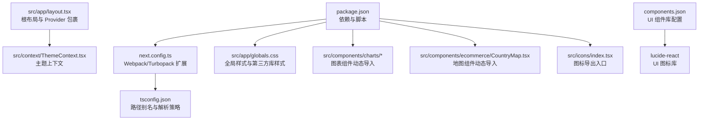
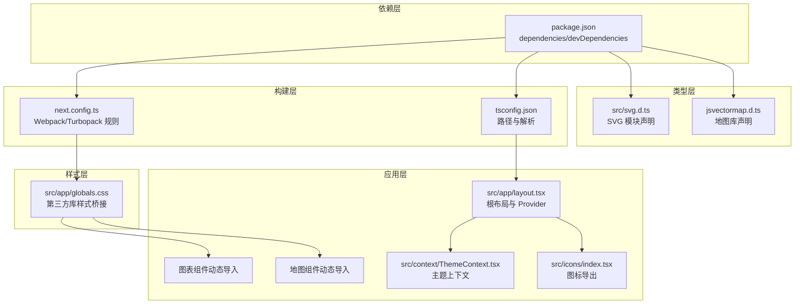
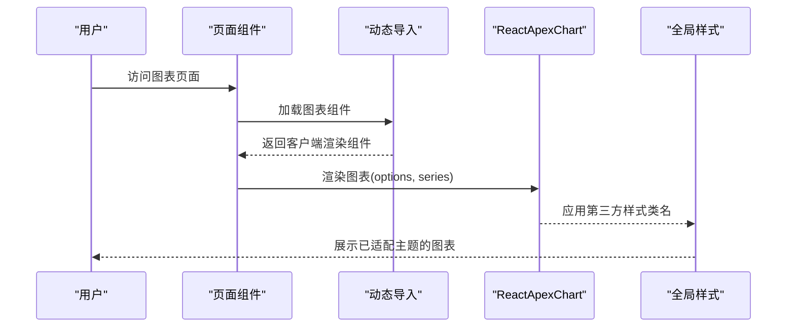
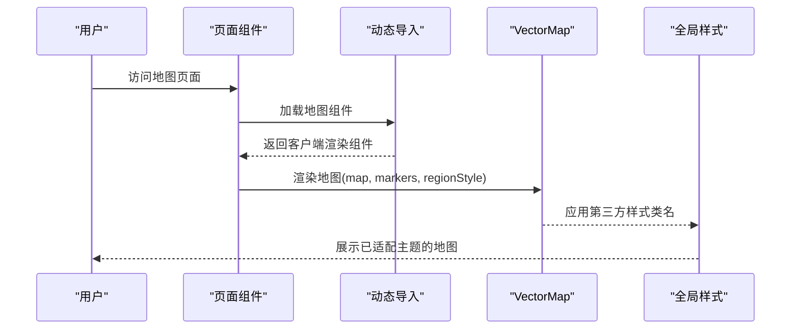
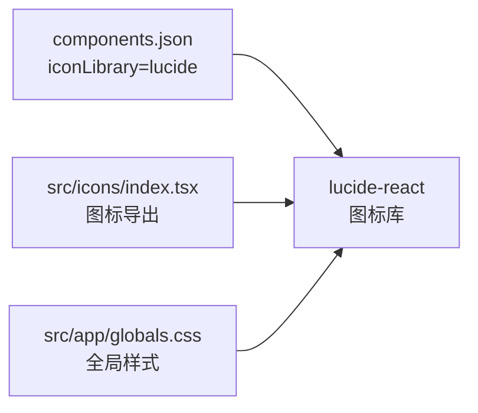
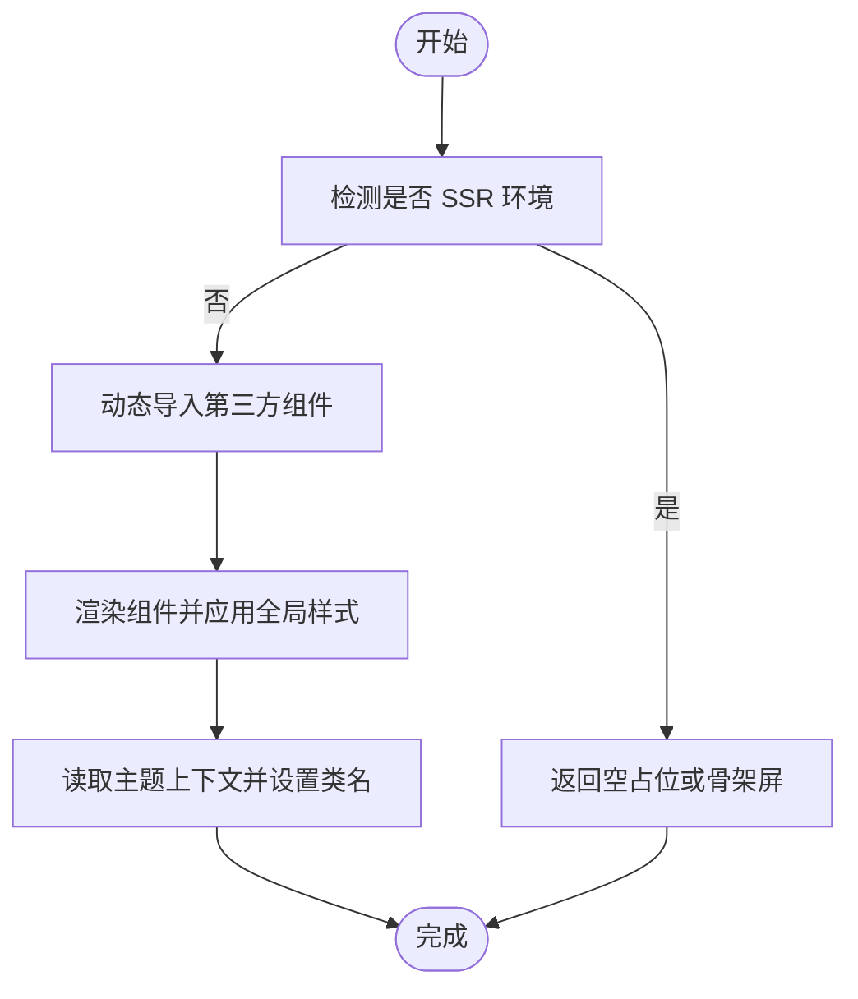
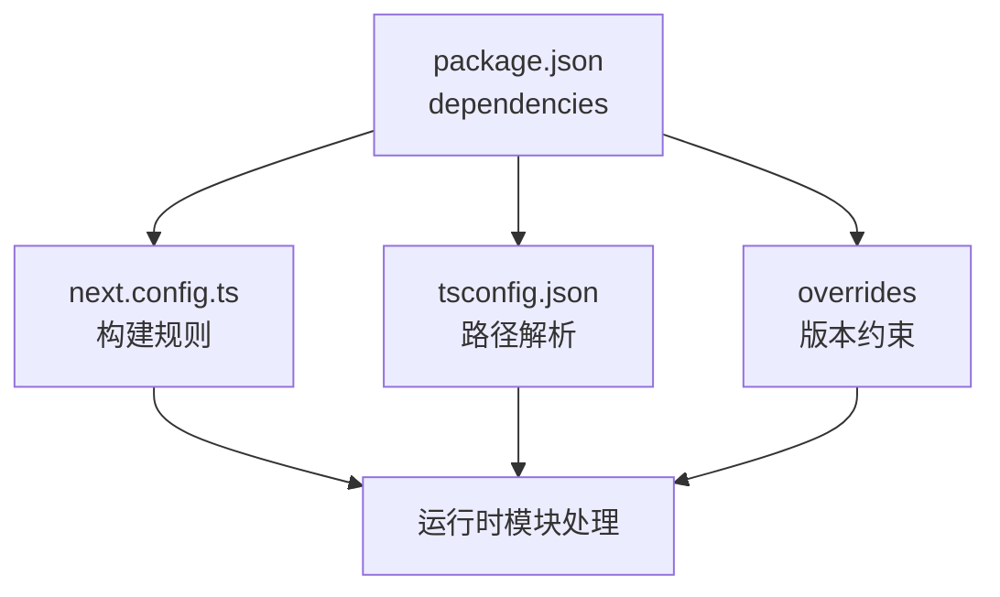

# 第三方库集成

<cite>
**本文引用的文件**
- [package.json](file://package.json)
- [next.config.ts](file://next.config.ts)
- [tsconfig.json](file://tsconfig.json)
- [src/app/globals.css](file://src/app/globals.css)
- [src/app/layout.tsx](file://src/app/layout.tsx)
- [src/svg.d.ts](file://src/svg.d.ts)
- [jsvectormap.d.ts](file://jsvectormap.d.ts)
- [components.json](file://components.json)
- [src/components/charts/bar/BarChartOne.tsx](file://src/components/charts/bar/BarChartOne.tsx)
- [src/components/charts/line/LineChartOne.tsx](file://src/components/charts/line/LineChartOne.tsx)
- [src/components/ecommerce/CountryMap.tsx](file://src/components/ecommerce/CountryMap.tsx)
- [src/icons/index.tsx](file://src/icons/index.tsx)
- [src/context/ThemeContext.tsx](file://src/context/ThemeContext.tsx)
- [src/lib/utils.ts](file://src/lib/utils.ts)
- [src/config/themeConfig.ts](file://src/config/themeConfig.ts)
</cite>

## 目录
1. [简介](#简介)
2. [项目结构](#项目结构)
3. [核心组件](#核心组件)
4. [架构总览](#架构总览)
5. [详细组件分析](#详细组件分析)
6. [依赖分析](#依赖分析)
7. [性能考虑](#性能考虑)
8. [故障排查指南](#故障排查指南)
9. [结论](#结论)
10. [附录](#附录)

## 简介
本指南面向在 Next.js 管理系统中集成第三方库的工程实践，覆盖从依赖安装、配置文件修改、类型定义添加到组件封装与性能优化的完整流程。文档以项目现有图表库（ApexCharts）、地图库（jVectorMap）与 UI 库（Lucide React）为例，总结可复用的集成模式与最佳实践，帮助开发者在不破坏现有架构的前提下安全、高效地引入新库。

## 项目结构
项目采用基于功能域的组织方式，前端资源集中在 src 下，样式通过全局 CSS 驱动，构建与模块解析由 Next.js 配置管理。核心集成点包括：
- 依赖声明与版本约束：通过包管理器统一管理
- 构建配置：Webpack/Turbopack 规则扩展（SVG 处理）
- 类型声明：为第三方模块补充 TS 声明文件
- 全局样式：Tailwind CSS 与第三方库样式兼容
- 组件封装：按需动态导入与 SSR 禁用策略
- 主题与上下文：主题切换与全局状态

**图示来源**
- [package.json:15-49](file://package.json#L15-L49)
- [next.config.ts:5-21](file://next.config.ts#L5-L21)
- [tsconfig.json:25-29](file://tsconfig.json#L25-L29)
- [src/app/globals.css:1-800](file://src/app/globals.css#L1-L800)
- [src/app/layout.tsx:16-32](file://src/app/layout.tsx#L16-L32)
- [src/context/ThemeContext.tsx:15-50](file://src/context/ThemeContext.tsx#L15-L50)
- [src/components/charts/bar/BarChartOne.tsx:6-10](file://src/components/charts/bar/BarChartOne.tsx#L6-L10)
- [src/components/ecommerce/CountryMap.tsx:6-9](file://src/components/ecommerce/CountryMap.tsx#L6-L9)
- [src/icons/index.tsx:1-110](file://src/icons/index.tsx#L1-L110)
- [components.json:13](file://components.json#L13)

**章节来源**
- [package.json:15-49](file://package.json#L15-L49)
- [next.config.ts:5-21](file://next.config.ts#L5-L21)
- [tsconfig.json:25-29](file://tsconfig.json#L25-L29)
- [src/app/globals.css:1-800](file://src/app/globals.css#L1-L800)
- [src/app/layout.tsx:16-32](file://src/app/layout.tsx#L16-L32)
- [components.json:13](file://components.json#L13)

## 核心组件
- 动态导入与 SSR 禁用：图表与地图组件通过 next/dynamic 实现客户端渲染，避免 SSR 报错或体积膨胀。
- SVG 模块化：通过 Webpack/Turbopack 规则与类型声明，将 SVG 作为 React 组件使用。
- 全局样式桥接：第三方库样式通过全局 CSS 覆盖，确保与 Tailwind 体系一致。
- 主题上下文：统一的主题切换逻辑与本地存储持久化，保证第三方库视觉一致性。
- UI 组件库：基于 shadcn 的配置，结合 lucide-react 提供图标支持。

**章节来源**
- [src/components/charts/bar/BarChartOne.tsx:6-10](file://src/components/charts/bar/BarChartOne.tsx#L6-L10)
- [src/components/charts/line/LineChartOne.tsx:6-10](file://src/components/charts/line/LineChartOne.tsx#L6-L10)
- [src/components/ecommerce/CountryMap.tsx:6-9](file://src/components/ecommerce/CountryMap.tsx#L6-L9)
- [next.config.ts:5-21](file://next.config.ts#L5-L21)
- [src/svg.d.ts:1-10](file://src/svg.d.ts#L1-L10)
- [src/app/globals.css:326-760](file://src/app/globals.css#L326-L760)
- [src/context/ThemeContext.tsx:18-39](file://src/context/ThemeContext.tsx#L18-L39)
- [components.json:13](file://components.json#L13)

## 架构总览
下图展示第三方库集成的关键交互：依赖安装后，通过构建配置处理模块与资源，类型声明完善开发体验；组件层采用动态导入与上下文注入，全局样式确保视觉一致性。

**图示来源**
- [package.json:15-49](file://package.json#L15-L49)
- [next.config.ts:5-21](file://next.config.ts#L5-L21)
- [tsconfig.json:25-29](file://tsconfig.json#L25-L29)
- [src/svg.d.ts:1-10](file://src/svg.d.ts#L1-L10)
- [jsvectormap.d.ts:1-5](file://jsvectormap.d.ts#L1-L5)
- [src/app/globals.css:326-760](file://src/app/globals.css#L326-L760)
- [src/app/layout.tsx:16-32](file://src/app/layout.tsx#L16-L32)
- [src/context/ThemeContext.tsx:15-50](file://src/context/ThemeContext.tsx#L15-L50)
- [src/icons/index.tsx:1-110](file://src/icons/index.tsx#L1-L110)

## 详细组件分析

### 图表库（ApexCharts）集成
- 安装与依赖：通过包管理器安装图表库与 React 封装组件。
- 初始化配置：在组件内部定义选项对象，控制图表类型、颜色、网格、提示等。
- 动态导入与 SSR：使用 next/dynamic 并禁用 SSR，避免服务端执行 DOM。
- 全局样式：通过全局 CSS 覆盖图例、提示框、网格线等第三方类名，保持与主题一致。
- 性能策略：按需加载、最小化数据序列大小、禁用不必要的动画。

**图示来源**
- [src/components/charts/bar/BarChartOne.tsx:6-10](file://src/components/charts/bar/BarChartOne.tsx#L6-L10)
- [src/components/charts/line/LineChartOne.tsx:6-10](file://src/components/charts/line/LineChartOne.tsx#L6-L10)
- [src/app/globals.css:326-360](file://src/app/globals.css#L326-L360)

**章节来源**
- [package.json:27, 39](file://package.json#L27,L39)
- [src/components/charts/bar/BarChartOne.tsx:12-110](file://src/components/charts/bar/BarChartOne.tsx#L12-L110)
- [src/components/charts/line/LineChartOne.tsx:12-133](file://src/components/charts/line/LineChartOne.tsx#L12-L133)
- [src/app/globals.css:326-360](file://src/app/globals.css#L326-L360)

### 地图库（jVectorMap）集成
- 安装与依赖：安装核心库与世界地图数据集。
- 动态导入与 SSR：同样采用动态导入并禁用 SSR。
- 类型声明：为第三方模块补充类型声明，确保 TS 正确推断。
- 样式桥接：通过全局 CSS 控制区域样式、标记样式与工具提示外观。
- 组件封装：以属性形式传入地图颜色、标记集合与缩放参数，增强可复用性。

**图示来源**
- [src/components/ecommerce/CountryMap.tsx:6-9](file://src/components/ecommerce/CountryMap.tsx#L6-L9)
- [jsvectormap.d.ts:1-5](file://jsvectormap.d.ts#L1-L5)
- [src/app/globals.css:744-760](file://src/app/globals.css#L744-L760)

**章节来源**
- [package.json:23, 24](file://package.json#L23,L24)
- [src/components/ecommerce/CountryMap.tsx:35-121](file://src/components/ecommerce/CountryMap.tsx#L35-L121)
- [jsvectormap.d.ts:1-5](file://jsvectormap.d.ts#L1-L5)
- [src/app/globals.css:744-760](file://src/app/globals.css#L744-L760)

### UI 库（Lucide React）集成
- 安装与依赖：安装 UI 组件库与图标库。
- 配置文件：通过组件库配置文件指定图标库为 lucide，统一生成与导入。
- 图标使用：在图标导出入口集中导出 SVG，便于按需使用。
- 样式桥接：UI 组件样式与全局 Tailwind 体系保持一致。

**图示来源**
- [components.json:13](file://components.json#L13)
- [src/icons/index.tsx:1-110](file://src/icons/index.tsx#L1-L110)
- [src/app/globals.css:1-800](file://src/app/globals.css#L1-L800)

**章节来源**
- [package.json:34, 44](file://package.json#L34,L44)
- [components.json:13](file://components.json#L13)
- [src/icons/index.tsx:1-110](file://src/icons/index.tsx#L1-L110)

### 组件封装策略
- 动态导入：所有需要浏览器 API 或大型库的组件均采用动态导入，并禁用 SSR。
- 属性化配置：将样式、数据与行为通过 props 传递，提升复用性。
- 主题适配：通过主题上下文与全局 CSS 类名，确保第三方库在深色/浅色模式下表现一致。
- 错误边界：在动态导入处捕获加载异常，提供降级提示或回退方案（建议在业务组件中实现）。

**图示来源**
- [src/components/charts/bar/BarChartOne.tsx:6-10](file://src/components/charts/bar/BarChartOne.tsx#L6-L10)
- [src/components/ecommerce/CountryMap.tsx:6-9](file://src/components/ecommerce/CountryMap.tsx#L6-L9)
- [src/context/ThemeContext.tsx:18-39](file://src/context/ThemeContext.tsx#L18-L39)

**章节来源**
- [src/components/charts/bar/BarChartOne.tsx:6-10](file://src/components/charts/bar/BarChartOne.tsx#L6-L10)
- [src/components/ecommerce/CountryMap.tsx:6-9](file://src/components/ecommerce/CountryMap.tsx#L6-L9)
- [src/context/ThemeContext.tsx:18-39](file://src/context/ThemeContext.tsx#L18-L39)

## 依赖分析
- 依赖安装：通过包管理器安装新库，同时更新类型声明与构建配置。
- 版本冲突：利用包管理器锁定文件与覆盖规则，避免版本不一致导致的运行时错误。
- 运行时加载：优先采用动态导入，减少首屏体积与阻塞时间。
- 样式隔离：通过全局 CSS 与主题上下文，确保第三方库样式与项目风格一致。

**图示来源**
- [package.json:68-77](file://package.json#L68-L77)
- [next.config.ts:5-21](file://next.config.ts#L5-L21)
- [tsconfig.json:25-29](file://tsconfig.json#L25-L29)

**章节来源**
- [package.json:68-77](file://package.json#L68-L77)
- [next.config.ts:5-21](file://next.config.ts#L5-L21)
- [tsconfig.json:25-29](file://tsconfig.json#L25-L29)

## 性能考虑
- 按需加载：仅在需要时加载第三方库，避免打包进首屏。
- 代码分割：利用动态导入自动分包，降低单页体积。
- 懒加载实现：在路由或交互触发时再加载组件，提升首屏速度。
- 样式优化：将第三方库样式集中于全局 CSS，减少重复注入。
- 主题切换：通过主题上下文统一切换类名，避免重复计算与重绘。

**章节来源**
- [src/components/charts/bar/BarChartOne.tsx:6-10](file://src/components/charts/bar/BarChartOne.tsx#L6-L10)
- [src/components/ecommerce/CountryMap.tsx:6-9](file://src/components/ecommerce/CountryMap.tsx#L6-L9)
- [src/context/ThemeContext.tsx:18-39](file://src/context/ThemeContext.tsx#L18-L39)
- [src/app/globals.css:326-760](file://src/app/globals.css#L326-L760)

## 故障排查指南
- SSR 报错：确认组件已通过动态导入并禁用 SSR。
- 样式不生效：检查全局 CSS 是否正确引入第三方类名，以及主题类名是否正确挂载。
- 类型报错：为第三方模块补充类型声明文件，确保 TS 推断正确。
- 版本冲突：查看锁定文件与覆盖规则，必要时调整依赖版本。
- 图标缺失：确认图标导出入口与组件库配置一致。

**章节来源**
- [src/components/charts/bar/BarChartOne.tsx:6-10](file://src/components/charts/bar/BarChartOne.tsx#L6-L10)
- [src/components/ecommerce/CountryMap.tsx:6-9](file://src/components/ecommerce/CountryMap.tsx#L6-L9)
- [src/svg.d.ts:1-10](file://src/svg.d.ts#L1-L10)
- [jsvectormap.d.ts:1-5](file://jsvectormap.d.ts#L1-L5)
- [package.json:68-77](file://package.json#L68-L77)
- [components.json:13](file://components.json#L13)

## 结论
通过统一的依赖管理、构建配置与类型声明，结合动态导入与主题上下文，项目实现了对第三方库（图表、地图、UI）的平滑集成。遵循本文的流程与最佳实践，可在不破坏现有架构的前提下，安全、高效地引入新库并保障性能与一致性。

## 附录
- 新库集成清单
  - 安装依赖并更新依赖声明
  - 补充类型声明文件
  - 配置构建规则（如 SVG 处理）
  - 在组件中采用动态导入并禁用 SSR
  - 引入全局样式并适配主题
  - 编写组件封装与属性化配置
  - 进行兼容性检查与版本冲突解决
  - 执行安全审计与性能评估