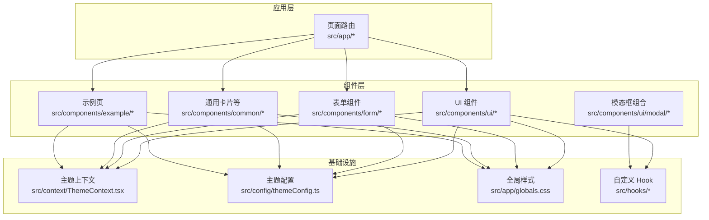
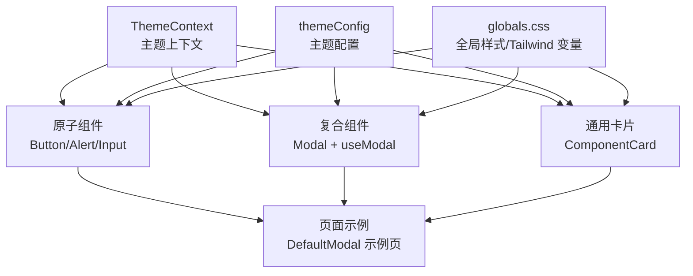
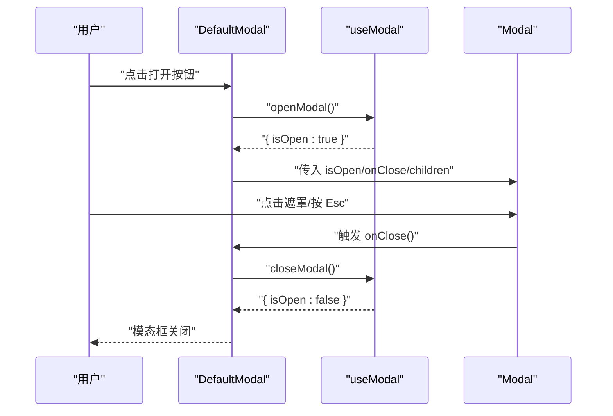
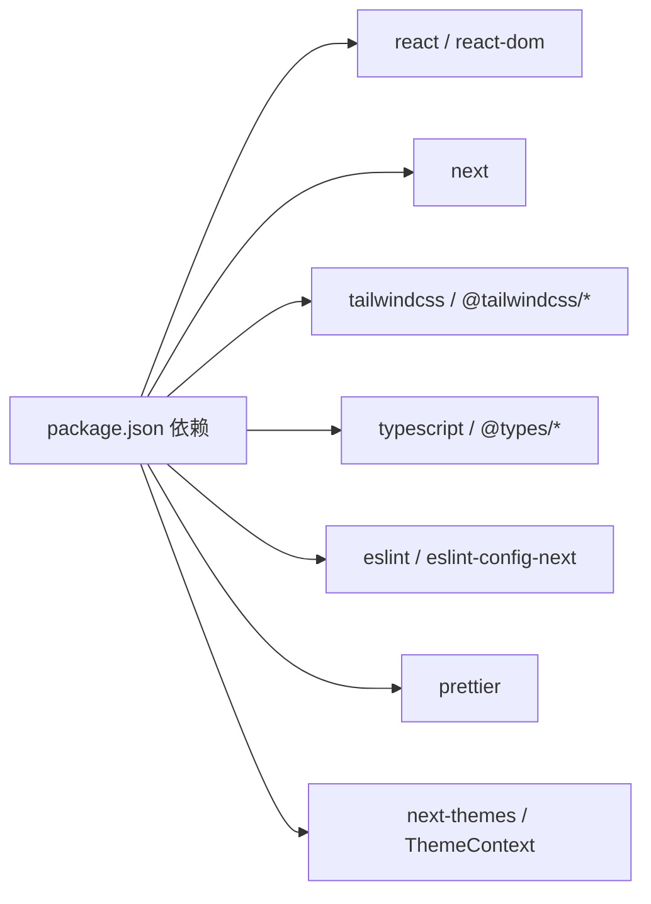

# 组件开发规范

<cite>
**本文引用的文件**
- [src/components/ui/button/Button.tsx](file://src/components/ui/button/Button.tsx)
- [src/components/ui/alert/Alert.tsx](file://src/components/ui/alert/Alert.tsx)
- [src/components/form/input/InputField.tsx](file://src/components/form/input/InputField.tsx)
- [src/components/common/ComponentCard.tsx](file://src/components/common/ComponentCard.tsx)
- [src/components/example/ModalExample/DefaultModal.tsx](file://src/components/example/ModalExample/DefaultModal.tsx)
- [src/components/ui/modal/index.tsx](file://src/components/ui/modal/index.tsx)
- [src/hooks/useModal.ts](file://src/hooks/useModal.ts)
- [src/context/ThemeContext.tsx](file://src/context/ThemeContext.tsx)
- [src/config/themeConfig.ts](file://src/config/themeConfig.ts)
- [src/app/globals.css](file://src/app/globals.css)
- [package.json](file://package.json)
- [tsconfig.json](file://tsconfig.json)
- [eslint.config.mjs](file://eslint.config.mjs)
</cite>

## 目录
1. [简介](#简介)
2. [项目结构](#项目结构)
3. [核心组件](#核心组件)
4. [架构总览](#架构总览)
5. [详细组件分析](#详细组件分析)
6. [依赖关系分析](#依赖关系分析)
7. [性能考量](#性能考量)
8. [故障排查指南](#故障排查指南)
9. [结论](#结论)
10. [附录](#附录)

## 简介
本规范面向在本项目中开发新 UI 组件的工程师，系统化地给出从“组件结构设计、TypeScript 接口定义、Props 类型声明与默认属性”到“命名约定、文件组织、样式类名规范”的全流程指导；并结合现有组件示例，提供可复用性、可访问性、响应式布局与主题适配的最佳实践，以及测试策略、文档编写与版本管理建议。

## 项目结构
本项目采用按功能域分层的目录组织方式：页面路由位于 src/app 下，通用组件集中在 src/components 中，按领域进一步细分（如 ui、form、common、example 等）。样式通过 src/app/globals.css 使用 Tailwind CSS v4 的自定义变量与工具集统一管理，主题切换通过上下文与本地存储实现。

图表来源
- [src/components/ui/button/Button.tsx:1-57](file://src/components/ui/button/Button.tsx#L1-L57)
- [src/components/ui/alert/Alert.tsx:1-146](file://src/components/ui/alert/Alert.tsx#L1-L146)
- [src/components/form/input/InputField.tsx:1-87](file://src/components/form/input/InputField.tsx#L1-L87)
- [src/components/common/ComponentCard.tsx:1-41](file://src/components/common/ComponentCard.tsx#L1-L41)
- [src/components/ui/modal/index.tsx:1-96](file://src/components/ui/modal/index.tsx#L1-L96)
- [src/hooks/useModal.ts:1-13](file://src/hooks/useModal.ts#L1-L13)
- [src/context/ThemeContext.tsx:1-59](file://src/context/ThemeContext.tsx#L1-L59)
- [src/config/themeConfig.ts:1-31](file://src/config/themeConfig.ts#L1-L31)
- [src/app/globals.css:1-899](file://src/app/globals.css#L1-L899)

章节来源
- [src/components/ui/button/Button.tsx:1-57](file://src/components/ui/button/Button.tsx#L1-L57)
- [src/components/ui/alert/Alert.tsx:1-146](file://src/components/ui/alert/Alert.tsx#L1-L146)
- [src/components/form/input/InputField.tsx:1-87](file://src/components/form/input/InputField.tsx#L1-L87)
- [src/components/common/ComponentCard.tsx:1-41](file://src/components/common/ComponentCard.tsx#L1-L41)
- [src/components/ui/modal/index.tsx:1-96](file://src/components/ui/modal/index.tsx#L1-L96)
- [src/hooks/useModal.ts:1-13](file://src/hooks/useModal.ts#L1-L13)
- [src/context/ThemeContext.tsx:1-59](file://src/context/ThemeContext.tsx#L1-L59)
- [src/config/themeConfig.ts:1-31](file://src/config/themeConfig.ts#L1-L31)
- [src/app/globals.css:1-899](file://src/app/globals.css#L1-L899)

## 核心组件
本节聚焦于现有组件的类型设计与实现模式，为新组件开发提供参考模板。

- 按钮组件 Button
  - Props 接口包含 children、type、size、variant、startIcon、endIcon、onClick、disabled、className 等字段，并对多数字段提供合理默认值，便于快速复用。
  - 样式通过 Tailwind 类拼接与 CSS 变量（如圆角）控制，支持明暗主题与禁用态。
  - 适合作为“原子组件”，用于构建更复杂的复合组件。

- 警告提示 Alert
  - Props 接口包含 variant、title、message、showLink、linkHref、linkText 等，提供多种变体与可选链接。
  - 通过条件渲染图标与容器类名实现视觉区分，支持明暗主题。

- 输入框 Input
  - Props 接口覆盖常见输入场景（type、id、name、placeholder、value、defaultValue、onChange、min/max/step、disabled、success/error/hint 等），并根据状态动态拼接样式类。
  - 支持错误/成功/禁用态的视觉反馈与可选提示文本。

- 通用卡片 ComponentCard
  - Props 接口包含 title、children、className、desc，用于承载任意子内容，常用于示例页的容器。

- 模态框 Modal 与 Hook useModal
  - Modal 提供 isOpen/onClose/className/children/showCloseButton/isFullscreen 等 Props，默认处理 Esc 键盘事件与滚动锁定。
  - useModal 提供 isOpen/openModal/closeModal/toggleModal 状态与方法，简化调用侧逻辑。

章节来源
- [src/components/ui/button/Button.tsx:3-13](file://src/components/ui/button/Button.tsx#L3-L13)
- [src/components/ui/button/Button.tsx:15-54](file://src/components/ui/button/Button.tsx#L15-L54)
- [src/components/ui/alert/Alert.tsx:4-11](file://src/components/ui/alert/Alert.tsx#L4-L11)
- [src/components/ui/alert/Alert.tsx:13-142](file://src/components/ui/alert/Alert.tsx#L13-L142)
- [src/components/form/input/InputField.tsx:3-19](file://src/components/form/input/InputField.tsx#L3-L19)
- [src/components/form/input/InputField.tsx:21-83](file://src/components/form/input/InputField.tsx#L21-L83)
- [src/components/common/ComponentCard.tsx:3-8](file://src/components/common/ComponentCard.tsx#L3-L8)
- [src/components/common/ComponentCard.tsx:10-37](file://src/components/common/ComponentCard.tsx#L10-L37)
- [src/components/ui/modal/index.tsx:4-11](file://src/components/ui/modal/index.tsx#L4-L11)
- [src/components/ui/modal/index.tsx:13-94](file://src/components/ui/modal/index.tsx#L13-L94)
- [src/hooks/useModal.ts:4-12](file://src/hooks/useModal.ts#L4-L12)

## 架构总览
组件开发遵循“原子组件 → 复合组件 → 页面示例”的层级化演进路径。主题系统通过 ThemeContext 管理明暗主题，样式体系基于 Tailwind CSS v4 自定义变量与工具集，主题配置集中于 themeConfig，全局样式在 globals.css 中定义。

图表来源
- [src/context/ThemeContext.tsx:1-59](file://src/context/ThemeContext.tsx#L1-L59)
- [src/config/themeConfig.ts:1-31](file://src/config/themeConfig.ts#L1-L31)
- [src/app/globals.css:1-899](file://src/app/globals.css#L1-L899)
- [src/components/ui/button/Button.tsx:1-57](file://src/components/ui/button/Button.tsx#L1-L57)
- [src/components/ui/alert/Alert.tsx:1-146](file://src/components/ui/alert/Alert.tsx#L1-L146)
- [src/components/form/input/InputField.tsx:1-87](file://src/components/form/input/InputField.tsx#L1-L87)
- [src/components/ui/modal/index.tsx:1-96](file://src/components/ui/modal/index.tsx#L1-L96)
- [src/hooks/useModal.ts:1-13](file://src/hooks/useModal.ts#L1-L13)
- [src/components/common/ComponentCard.tsx:1-41](file://src/components/common/ComponentCard.tsx#L1-L41)
- [src/components/example/ModalExample/DefaultModal.tsx:1-54](file://src/components/example/ModalExample/DefaultModal.tsx#L1-L54)

## 详细组件分析

### 原子组件：按钮 Button
- 设计要点
  - Props 接口明确职责边界，提供 size/variant/icon/state 等维度的可扩展点。
  - 默认值确保最小可用参数即可渲染，降低调用成本。
  - 样式通过类名拼接与 CSS 变量实现主题一致性。
- 最佳实践
  - 将按钮作为“可复用原子”，避免在组件内部耦合业务逻辑。
  - 通过 className 允许上层定制，但不破坏主题与状态样式。
- 参考路径
  - [接口定义与默认值:3-25](file://src/components/ui/button/Button.tsx#L3-L25)
  - [尺寸与变体样式映射:27-38](file://src/components/ui/button/Button.tsx#L27-L38)
  - [渲染与事件绑定:40-54](file://src/components/ui/button/Button.tsx#L40-L54)

章节来源
- [src/components/ui/button/Button.tsx:3-57](file://src/components/ui/button/Button.tsx#L3-L57)

### 复合组件：警告提示 Alert
- 设计要点
  - 通过 variant 区分视觉语义，图标与容器类名分离，便于维护。
  - 可选链接支持引导用户跳转，增强信息闭环。
- 最佳实践
  - 保持 props 粒度清晰，避免过度耦合。
  - 在明暗主题下统一使用 CSS 变量或 dark 选择器。
- 参考路径
  - [Props 接口:4-11](file://src/components/ui/alert/Alert.tsx#L4-L11)
  - [变体样式与图标映射:22-43](file://src/components/ui/alert/Alert.tsx#L22-L43)
  - [渲染结构:115-142](file://src/components/ui/alert/Alert.tsx#L115-L142)

章节来源
- [src/components/ui/alert/Alert.tsx:4-146](file://src/components/ui/alert/Alert.tsx#L4-L146)

### 表单原子：输入框 Input
- 设计要点
  - 支持多状态样式（禁用/错误/成功），并提供可选提示文本。
  - 通过 className 扩展，同时保留默认主题样式。
- 最佳实践
  - 将 onChange 与受控/非受控模式解耦，避免在组件内做过多状态管理。
  - 对 hint 文案进行可访问性标注（如 aria-describedby）。
- 参考路径
  - [Props 接口:3-19](file://src/components/form/input/InputField.tsx#L3-L19)
  - [状态样式拼接:38-50](file://src/components/form/input/InputField.tsx#L38-L50)
  - [渲染与提示:52-83](file://src/components/form/input/InputField.tsx#L52-L83)

章节来源
- [src/components/form/input/InputField.tsx:3-87](file://src/components/form/input/InputField.tsx#L3-L87)

### 通用容器：ComponentCard
- 设计要点
  - 以标题与描述作为头部，主体区域承载任意子节点，适合示例页与文档卡片。
- 最佳实践
  - 保持 children 的开放性，避免强约束其结构。
  - 通过 className 与暗色背景变量适配主题。
- 参考路径
  - [Props 接口:3-8](file://src/components/common/ComponentCard.tsx#L3-L8)
  - [渲染结构:16-37](file://src/components/common/ComponentCard.tsx#L16-L37)

章节来源
- [src/components/common/ComponentCard.tsx:3-41](file://src/components/common/ComponentCard.tsx#L3-L41)

### 复合组件：模态框 Modal 与 Hook useModal
- 设计要点
  - Modal 提供 isOpen/onClose/className/showCloseButton/isFullscreen 等 Props，内置 Esc 关闭与滚动锁定。
  - useModal 返回 isOpen/openModal/closeModal/toggleModal，简化状态管理。
- 最佳实践
  - 将 Modal 作为“可复用复合组件”，在不同页面复用同一套交互与样式。
  - 在示例页中演示典型用法（打开/关闭/保存），便于开发者快速上手。
- 参考路径
  - [Modal Props 与渲染:4-94](file://src/components/ui/modal/index.tsx#L4-L94)
  - [Hook 实现:4-12](file://src/hooks/useModal.ts#L4-L12)
  - [示例页 DefaultModal:9-53](file://src/components/example/ModalExample/DefaultModal.tsx#L9-L53)

图表来源
- [src/components/example/ModalExample/DefaultModal.tsx:9-53](file://src/components/example/ModalExample/DefaultModal.tsx#L9-L53)
- [src/hooks/useModal.ts:4-12](file://src/hooks/useModal.ts#L4-L12)
- [src/components/ui/modal/index.tsx:13-94](file://src/components/ui/modal/index.tsx#L13-L94)

章节来源
- [src/components/example/ModalExample/DefaultModal.tsx:9-53](file://src/components/example/ModalExample/DefaultModal.tsx#L9-L53)
- [src/hooks/useModal.ts:4-12](file://src/hooks/useModal.ts#L4-L12)
- [src/components/ui/modal/index.tsx:4-96](file://src/components/ui/modal/index.tsx#L4-L96)

### 主题适配与样式规范
- 主题上下文 ThemeContext
  - 提供 theme 与 toggleTheme，并持久化到 localStorage，切换时为 html 添加/移除 dark 类。
- 主题配置 themeConfig
  - 定义边栏宽度、头部高度、间距、圆角半径与主色调等全局变量。
- 全局样式 globals.css
  - 使用 @theme 定义字体、颜色、阴影、z-index、圆角等变量，并提供暗色选择器与大量第三方组件样式覆盖。
- 规范建议
  - 组件样式优先使用 CSS 变量与暗色选择器，避免硬编码颜色。
  - 通过 className 允许上层覆盖，但不破坏主题一致性。

章节来源
- [src/context/ThemeContext.tsx:1-59](file://src/context/ThemeContext.tsx#L1-L59)
- [src/config/themeConfig.ts:1-31](file://src/config/themeConfig.ts#L1-L31)
- [src/app/globals.css:1-899](file://src/app/globals.css#L1-L899)

## 依赖关系分析
- 运行时依赖
  - React、Next.js、Tailwind CSS v4、next-themes 等，为组件运行与样式系统提供基础能力。
- 开发时依赖
  - TypeScript、ESLint、Prettier、TailwindCSS 插件等，保障类型安全与代码风格。
- 依赖关系图

图表来源
- [package.json:15-79](file://package.json#L15-L79)

章节来源
- [package.json:15-79](file://package.json#L15-L79)

## 性能考量
- 组件渲染
  - 避免在渲染路径中创建新对象/函数，使用 useMemo/useCallback 缓存计算结果与回调。
  - 合理拆分组件，减少不必要的重渲染。
- 样式与主题
  - 使用 CSS 变量与暗色选择器，避免重复计算与闪烁。
  - 模态框等全屏组件仅在需要时挂载，减少 DOM 负担。
- 打包与体积
  - 通过路径别名与模块化组织，配合 Tree Shaking 减少无效代码。
  - 第三方库按需引入，避免整体打包体积膨胀。

## 故障排查指南
- TypeScript 类型错误
  - 确保 Props 接口完整且默认值与可选属性一致，必要时使用 Partial/Omit 工具类型。
  - 参考现有组件的接口定义与默认值写法。
- 样式不生效
  - 检查是否正确使用 CSS 变量与暗色选择器；确认 globals.css 是否被正确加载。
  - 验证 className 拼接顺序与 Tailwind 指令优先级。
- 主题切换异常
  - 确认 ThemeContext 的 Provider 包裹范围与 localStorage 写入时机。
  - 检查 html 上的 dark 类是否正确添加/移除。
- 模态框无法关闭
  - 确认 isOpen 状态与 onClose 回调传递无误；检查 Esc 事件监听与点击遮罩逻辑。

章节来源
- [src/context/ThemeContext.tsx:21-43](file://src/context/ThemeContext.tsx#L21-L43)
- [src/components/ui/modal/index.tsx:23-49](file://src/components/ui/modal/index.tsx#L23-L49)
- [eslint.config.mjs:1-19](file://eslint.config.mjs#L1-L19)
- [tsconfig.json:1-42](file://tsconfig.json#L1-L42)

## 结论
本规范以现有组件为蓝本，总结了从接口设计、类型声明、默认属性、样式与主题适配到复用与可访问性的开发流程。建议在新增组件时遵循“原子组件优先、复合组件聚合、页面示例验证”的路径，确保可维护性与一致性。

## 附录

### 组件开发最佳实践清单
- 可复用性
  - 明确 Props 边界，提供合理默认值；允许 className 扩展。
  - 抽象公共逻辑为 Hook 或工具函数，避免重复代码。
- 可访问性
  - 为交互元素提供语义化标签与键盘支持（如 Esc 关闭）。
  - 为提示文本提供 aria-describedby 等辅助属性。
- 响应式布局
  - 使用 Tailwind 断点与相对单位，保证在不同屏幕下的可读性与可用性。
- 主题适配
  - 使用 CSS 变量与暗色选择器，确保明暗主题一致体验。
- 测试策略
  - 单元测试：验证 Props 渲染、状态切换、事件回调。
  - 可访问性测试：使用自动化工具检测键盘可达性与语义标签。
  - 截图对比：在明暗主题下对比关键组件渲染差异。
- 文档编写
  - 组件 README：列出 Props、默认值、使用示例与注意事项。
  - 示例页：在 example 目录下提供可运行的演示页面。
- 版本管理
  - 遵循语义化版本，变更日志记录破坏性更新与新增特性。
  - 依赖升级前进行兼容性验证与回归测试。