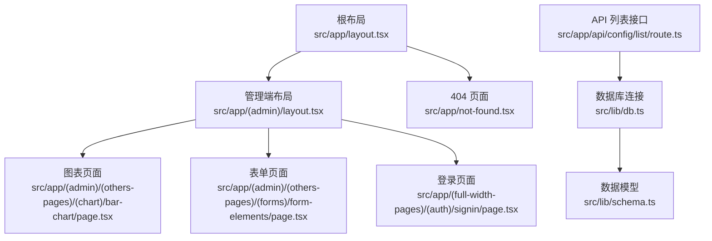
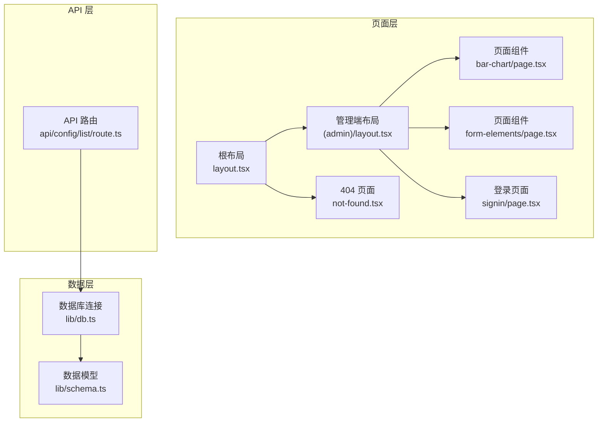
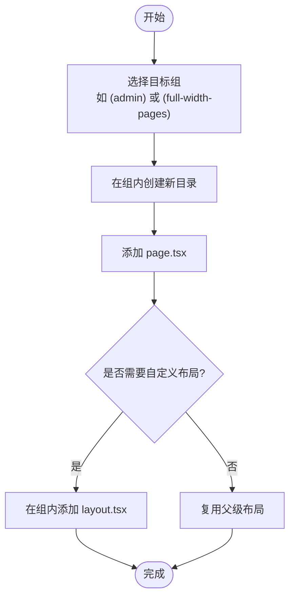
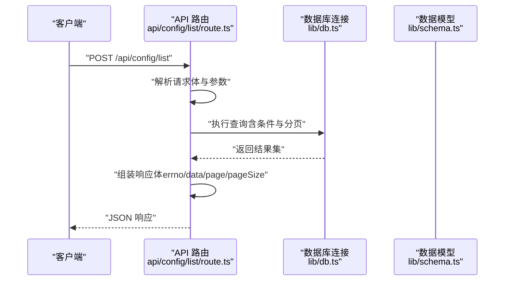
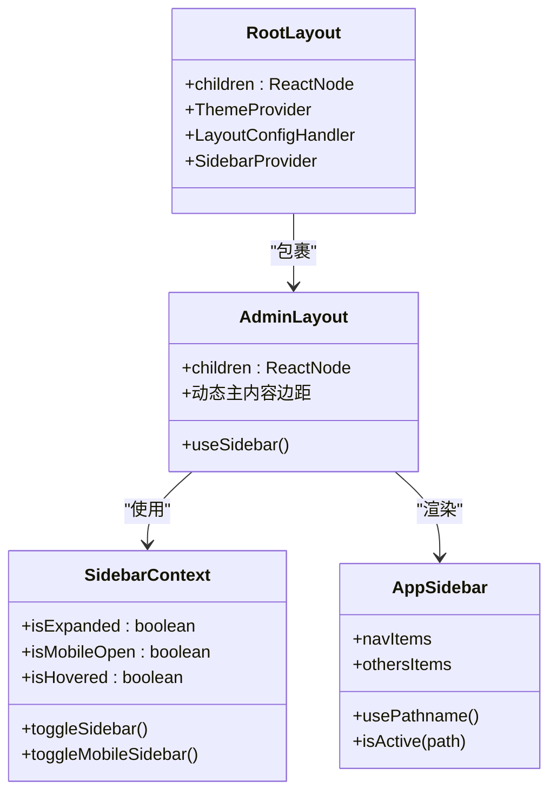
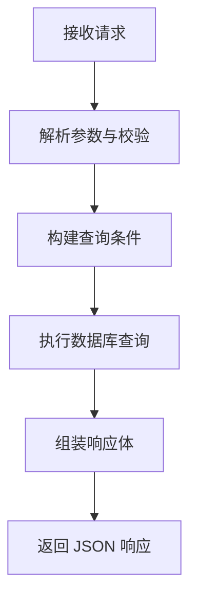
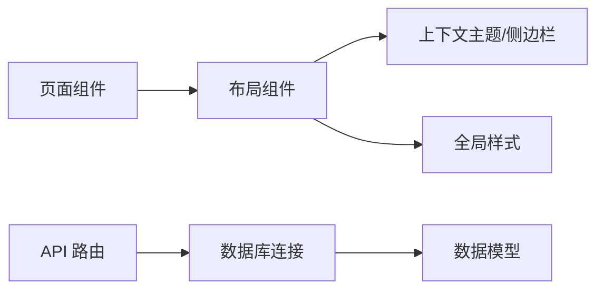

# 页面路由扩展

<cite>
**本文引用的文件**
- [src/app/layout.tsx](file://src/app/layout.tsx)
- [src/app/(admin)/layout.tsx](file://src/app/(admin)/layout.tsx)
- [src/app/(admin)/(others-pages)/(chart)/bar-chart/page.tsx](file://src/app/(admin)/(others-pages)/(chart)/bar-chart/page.tsx)
- [src/app/(admin)/(others-pages)/(forms)/form-elements/page.tsx](file://src/app/(admin)/(others-pages)/(forms)/form-elements/page.tsx)
- [src/app/(full-width-pages)/(auth)/signin/page.tsx](file://src/app/(full-width-pages)/(auth)/signin/page.tsx)
- [src/app/not-found.tsx](file://src/app/not-found.tsx)
- [src/app/api/config/list/route.ts](file://src/app/api/config/list/route.ts)
- [src/lib/db.ts](file://src/lib/db.ts)
- [src/lib/schema.ts](file://src/lib/schema.ts)
- [src/context/SidebarContext.tsx](file://src/context/SidebarContext.tsx)
- [src/layout/AppSidebar.tsx](file://src/layout/AppSidebar.tsx)
- [src/app/globals.css](file://src/app/globals.css)
</cite>

## 目录
1. [简介](#简介)
2. [项目结构](#项目结构)
3. [核心组件](#核心组件)
4. [架构总览](#架构总览)
5. [详细组件分析](#详细组件分析)
6. [依赖关系分析](#依赖关系分析)
7. [性能考虑](#性能考虑)
8. [故障排查指南](#故障排查指南)
9. [结论](#结论)
10. [附录](#附录)

## 简介
本指南面向在 Next.js App Router 中扩展页面路由的开发者，结合现有代码库（基于 App Router 的组织方式）系统讲解如何新增页面、配置嵌套路由与动态路由、实现页面布局继承与共享布局组件、配置页面元数据、开发 API 路由、以及进行路由性能优化与 SEO 建议。文档中的所有说明均以仓库中实际存在的文件为依据，避免凭空假设。

## 项目结构
该工程采用 App Router 的文件系统路由约定，页面与 API 路由分别位于 src/app 下的不同子目录中。页面通过“组”（parenthesized groups）实现逻辑分组与嵌套路由，例如 (admin)、(others-pages)、(full-width-pages) 等；API 路由位于 src/app/api 下，支持动态路由参数（如 [id]）。

- 根布局与全局样式：根级 layout.tsx 提供全局主题、上下文与通用样式注入；全局样式定义于 globals.css。
- 管理端布局：(admin)/layout.tsx 提供管理端侧边栏、头部与主内容区域的布局容器。
- 页面示例：(admin)/(others-pages)/(chart)/bar-chart/page.tsx、(admin)/(others-pages)/(forms)/form-elements/page.tsx 展示了页面组件与元数据配置。
- 认证页面：(full-width-pages)/(auth)/signin/page.tsx 展示了全宽页面与元数据配置。
- 未找到页面：not-found.tsx 提供 404 页面。
- API 路由：src/app/api/config/list/route.ts 展示了 POST 列表查询接口的实现。

**图示来源**
- [src/app/layout.tsx:16-32](file://src/app/layout.tsx#L16-L32)
- [src/app/(admin)/layout.tsx](file://src/app/(admin)/layout.tsx#L9-L44)
- [src/app/(admin)/(others-pages)/(chart)/bar-chart/page.tsx](file://src/app/(admin)/(others-pages)/(chart)/bar-chart/page.tsx#L1-L25)
- [src/app/(admin)/(others-pages)/(forms)/form-elements/page.tsx](file://src/app/(admin)/(others-pages)/(forms)/form-elements/page.tsx#L1-L44)
- [src/app/(full-width-pages)/(auth)/signin/page.tsx](file://src/app/(full-width-pages)/(auth)/signin/page.tsx#L1-L12)
- [src/app/not-found.tsx:1-50](file://src/app/not-found.tsx#L1-L50)
- [src/app/api/config/list/route.ts:1-77](file://src/app/api/config/list/route.ts#L1-L77)
- [src/lib/db.ts:1-19](file://src/lib/db.ts#L1-L19)
- [src/lib/schema.ts:1-24](file://src/lib/schema.ts#L1-L24)

**章节来源**
- [src/app/layout.tsx:1-33](file://src/app/layout.tsx#L1-L33)
- [src/app/globals.css:1-899](file://src/app/globals.css#L1-L899)

## 核心组件
- 根布局与上下文
  - 根布局负责注入主题、字体、全局样式与通知组件，并提供主题与侧边栏上下文容器。
  - 全局样式通过 globals.css 定义断点、颜色、阴影、圆角等变量，支撑布局与组件样式一致性。
- 管理端布局
  - 管理端布局通过 SidebarProvider 包裹 children，内部根据侧边栏状态动态计算主内容区的外边距，实现响应式布局。
- 页面与元数据
  - 页面组件通过导出 metadata 对象声明标题与描述，用于 SEO 与社交分享。
- API 路由
  - API 路由遵循 Next.js App Router 的约定，在 src/app/api 下创建 route.ts 文件；使用 NextResponse 返回标准化响应体。

**章节来源**
- [src/app/layout.tsx:16-32](file://src/app/layout.tsx#L16-L32)
- [src/app/globals.css:1-899](file://src/app/globals.css#L1-L899)
- [src/app/(admin)/layout.tsx](file://src/app/(admin)/layout.tsx#L9-L44)
- [src/app/(admin)/(others-pages)/(chart)/bar-chart/page.tsx](file://src/app/(admin)/(others-pages)/(chart)/bar-chart/page.tsx#L7-L11)
- [src/app/(admin)/(others-pages)/(forms)/form-elements/page.tsx](file://src/app/(admin)/(others-pages)/(forms)/form-elements/page.tsx#L15-L19)
- [src/app/(full-width-pages)/(auth)/signin/page.tsx](file://src/app/(full-width-pages)/(auth)/signin/page.tsx#L4-L7)
- [src/app/api/config/list/route.ts:7-77](file://src/app/api/config/list/route.ts#L7-L77)

## 架构总览
下图展示了页面路由与布局、API 路由与数据层之间的交互关系：

**图示来源**
- [src/app/layout.tsx:16-32](file://src/app/layout.tsx#L16-L32)
- [src/app/(admin)/layout.tsx](file://src/app/(admin)/layout.tsx#L9-L44)
- [src/app/(admin)/(others-pages)/(chart)/bar-chart/page.tsx](file://src/app/(admin)/(others-pages)/(chart)/bar-chart/page.tsx#L1-L25)
- [src/app/(admin)/(others-pages)/(forms)/form-elements/page.tsx](file://src/app/(admin)/(others-pages)/(forms)/form-elements/page.tsx#L1-L44)
- [src/app/(full-width-pages)/(auth)/signin/page.tsx](file://src/app/(full-width-pages)/(auth)/signin/page.tsx#L1-L12)
- [src/app/not-found.tsx:1-50](file://src/app/not-found.tsx#L1-L50)
- [src/app/api/config/list/route.ts:1-77](file://src/app/api/config/list/route.ts#L1-L77)
- [src/lib/db.ts:1-19](file://src/lib/db.ts#L1-L19)
- [src/lib/schema.ts:1-24](file://src/lib/schema.ts#L1-L24)

## 详细组件分析

### 页面与嵌套路由
- 组（Group）与嵌套布局
  - 通过在目录名两侧使用括号定义组，实现逻辑分组与嵌套布局。例如 (admin)、(others-pages)、(full-width-pages) 等。
  - 管理端页面位于 (admin) 组内，其子级页面可复用该组的布局（如 (admin)/layout.tsx）。
- 新增页面步骤
  - 在目标组下创建新目录并在其中放置 page.tsx。
  - 如需共享布局，确保父级组存在对应 layout.tsx。
  - 如需全宽布局或独立布局，可在相应组下创建 layout.tsx 并按需导出。
- 示例参考
  - 图表页面与表单页面展示了页面组件与元数据导出的写法。
  - 登录页面展示了全宽页面与元数据配置。

**章节来源**
- [src/app/(admin)/layout.tsx](file://src/app/(admin)/layout.tsx#L9-L44)
- [src/app/(admin)/(others-pages)/(chart)/bar-chart/page.tsx](file://src/app/(admin)/(others-pages)/(chart)/bar-chart/page.tsx#L1-L25)
- [src/app/(admin)/(others-pages)/(forms)/form-elements/page.tsx](file://src/app/(admin)/(others-pages)/(forms)/form-elements/page.tsx#L1-L44)
- [src/app/(full-width-pages)/(auth)/signin/page.tsx](file://src/app/(full-width-pages)/(auth)/signin/page.tsx#L1-L12)

### 动态路由参数处理
- 动态路由语法
  - 在 API 路由中使用方括号表示动态段，如 [id]，用于从 URL 捕获参数。
- 参数解析与校验
  - 在 API 路由中读取请求体或查询参数，对参数进行类型判断与边界约束（如分页参数的范围限制）。
- 示例参考
  - 列表接口通过 POST 接收 { page, pageSize } 等参数，并对参数进行安全校验与分页计算。

**图示来源**
- [src/app/api/config/list/route.ts:7-77](file://src/app/api/config/list/route.ts#L7-L77)
- [src/lib/db.ts:1-19](file://src/lib/db.ts#L1-L19)
- [src/lib/schema.ts:1-24](file://src/lib/schema.ts#L1-L24)

**章节来源**
- [src/app/api/config/list/route.ts:7-77](file://src/app/api/config/list/route.ts#L7-L77)

### 路由守卫与权限控制
- 当前实现
  - 项目中未发现显式的路由守卫或权限拦截中间件。认证页面位于 (full-width-pages)/(auth) 组内，但未见统一的权限检查逻辑。
- 实施建议
  - 可在根布局或特定组的 layout.tsx 中引入鉴权逻辑（如检查用户会话），在未授权时重定向至登录页。
  - 对需要保护的页面，可在其 layout.tsx 中执行权限校验，或在页面组件中进行前置校验。
  - 注意：本节为通用实践建议，不直接对应仓库中现有实现。

### 页面布局继承与共享布局组件
- 布局继承
  - 父级组的 layout.tsx 会被自动应用到该组内的所有页面，形成继承关系。
  - 管理端布局通过 SidebarProvider 与主题 Provider 注入上下文，页面仅需关注自身内容。
- 共享布局组件
  - AppSidebar 作为侧边栏组件，通过 useSidebar 获取状态并响应窗口尺寸变化，实现响应式布局。
  - 侧边栏菜单项与子菜单通过配置数组生成，支持展开/折叠与高亮当前路径。

**图示来源**
- [src/app/layout.tsx:16-32](file://src/app/layout.tsx#L16-L32)
- [src/app/(admin)/layout.tsx](file://src/app/(admin)/layout.tsx#L9-L44)
- [src/context/SidebarContext.tsx:19-25](file://src/context/SidebarContext.tsx#L19-L25)
- [src/layout/AppSidebar.tsx:104-376](file://src/layout/AppSidebar.tsx#L104-L376)

**章节来源**
- [src/app/layout.tsx:16-32](file://src/app/layout.tsx#L16-L32)
- [src/app/(admin)/layout.tsx](file://src/app/(admin)/layout.tsx#L9-L44)
- [src/context/SidebarContext.tsx:1-85](file://src/context/SidebarContext.tsx#L1-L85)
- [src/layout/AppSidebar.tsx:1-376](file://src/layout/AppSidebar.tsx#L1-L376)

### 页面元数据配置
- 元数据导出
  - 页面组件可通过导出 metadata 对象设置 title 与 description，提升 SEO 与社交分享效果。
- 示例参考
  - 图表页面、表单页面与登录页面均展示了元数据导出的写法。

**章节来源**
- [src/app/(admin)/(others-pages)/(chart)/bar-chart/page.tsx](file://src/app/(admin)/(others-pages)/(chart)/bar-chart/page.tsx#L7-L11)
- [src/app/(admin)/(others-pages)/(forms)/form-elements/page.tsx](file://src/app/(admin)/(others-pages)/(forms)/form-elements/page.tsx#L15-L19)
- [src/app/(full-width-pages)/(auth)/signin/page.tsx](file://src/app/(full-width-pages)/(auth)/signin/page.tsx#L4-L7)

### API 路由开发指南
- 设计原则
  - 遵循 RESTful 风格命名资源，使用 HTTP 方法表达操作语义。
  - 对请求参数进行严格校验与边界控制（如分页参数范围）。
- 请求处理
  - 在 route.ts 中解析请求体或查询参数，构建查询条件，调用数据库连接执行查询。
- 响应格式化
  - 使用 NextResponse.json 返回统一结构（如 errno、data、page、pageSize），便于前端消费。
- 数据访问
  - 通过 lib/db.ts 建立连接池，lib/schema.ts 定义数据模型，确保类型安全与可维护性。

**图示来源**
- [src/app/api/config/list/route.ts:7-77](file://src/app/api/config/list/route.ts#L7-L77)
- [src/lib/db.ts:1-19](file://src/lib/db.ts#L1-L19)
- [src/lib/schema.ts:1-24](file://src/lib/schema.ts#L1-L24)

**章节来源**
- [src/app/api/config/list/route.ts:1-77](file://src/app/api/config/list/route.ts#L1-L77)
- [src/lib/db.ts:1-19](file://src/lib/db.ts#L1-L19)
- [src/lib/schema.ts:1-24](file://src/lib/schema.ts#L1-L24)

## 依赖关系分析
- 页面与布局
  - 根布局提供全局上下文，管理端布局提供侧边栏与主内容容器，页面组件仅负责业务内容。
- API 与数据层
  - API 路由依赖数据库连接与数据模型，实现数据查询与返回。
- 样式与主题
  - 全局样式通过 globals.css 定义主题变量与通用样式，布局组件使用这些变量实现一致的视觉风格。

**图示来源**
- [src/app/layout.tsx:16-32](file://src/app/layout.tsx#L16-L32)
- [src/app/(admin)/layout.tsx](file://src/app/(admin)/layout.tsx#L9-L44)
- [src/context/SidebarContext.tsx:1-85](file://src/context/SidebarContext.tsx#L1-L85)
- [src/app/api/config/list/route.ts:1-77](file://src/app/api/config/list/route.ts#L1-L77)
- [src/lib/db.ts:1-19](file://src/lib/db.ts#L1-L19)
- [src/lib/schema.ts:1-24](file://src/lib/schema.ts#L1-L24)
- [src/app/globals.css:1-899](file://src/app/globals.css#L1-L899)

**章节来源**
- [src/app/layout.tsx:1-33](file://src/app/layout.tsx#L1-L33)
- [src/app/globals.css:1-899](file://src/app/globals.css#L1-L899)

## 性能考虑
- 嵌套布局与上下文
  - 将布局与上下文（主题、侧边栏）置于根布局与管理端布局中，减少重复渲染与状态提升成本。
- 样式与变量
  - 使用 CSS 变量与主题系统，避免在组件内重复定义样式，降低样式计算开销。
- API 查询与分页
  - 对分页参数进行边界控制，避免过大页大小导致数据库压力；合理使用 LIMIT/OFFSET。
- 404 页面
  - not-found.tsx 提供清晰的错误提示与返回入口，改善用户体验与 SEO。

**章节来源**
- [src/app/not-found.tsx:1-50](file://src/app/not-found.tsx#L1-L50)
- [src/app/api/config/list/route.ts:25-26](file://src/app/api/config/list/route.ts#L25-L26)

## 故障排查指南
- 404 页面
  - not-found.tsx 提供统一的 404 渲染与返回首页链接，便于定位问题页面并引导用户回到正确路径。
- API 错误处理
  - API 路由在异常时返回包含 errno 与 message 的 JSON 响应，并设置 500 状态码，便于前端捕获与展示。
- 数据库连接
  - db.ts 要求环境变量 POSTGRES_URL 存在，若缺失会导致初始化失败；请检查环境配置。

**章节来源**
- [src/app/not-found.tsx:1-50](file://src/app/not-found.tsx#L1-L50)
- [src/app/api/config/list/route.ts:67-76](file://src/app/api/config/list/route.ts#L67-L76)
- [src/lib/db.ts:7-9](file://src/lib/db.ts#L7-L9)

## 结论
本指南基于仓库现有实现，总结了在 Next.js App Router 中扩展页面路由的关键流程：通过组实现嵌套与布局继承、在页面中配置元数据、在 API 路由中进行参数校验与响应格式化，并结合上下文与全局样式实现一致的用户体验。对于路由守卫与权限控制，建议在布局或页面层面补充鉴权逻辑以满足安全需求。

## 附录
- 新增页面清单
  - 选择目标组（如 (admin)、(full-width-pages)）
  - 在组内创建新目录并添加 page.tsx
  - 如需自定义布局，在组内添加 layout.tsx
  - 在页面中导出 metadata 以优化 SEO
- API 开发清单
  - 在 src/app/api 下创建路由文件（route.ts）
  - 解析并校验请求参数
  - 使用数据库连接执行查询
  - 返回统一的 JSON 响应结构