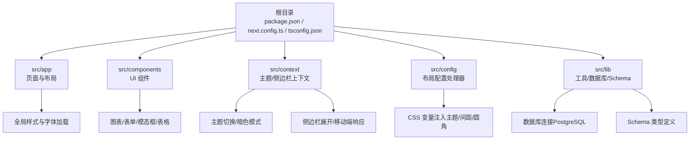
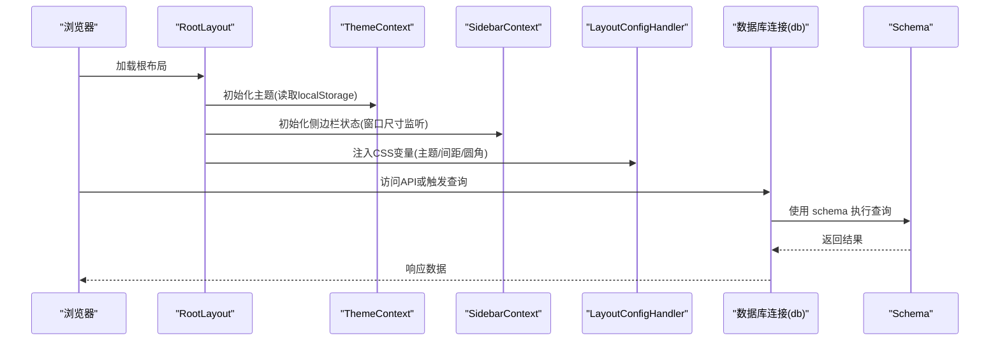
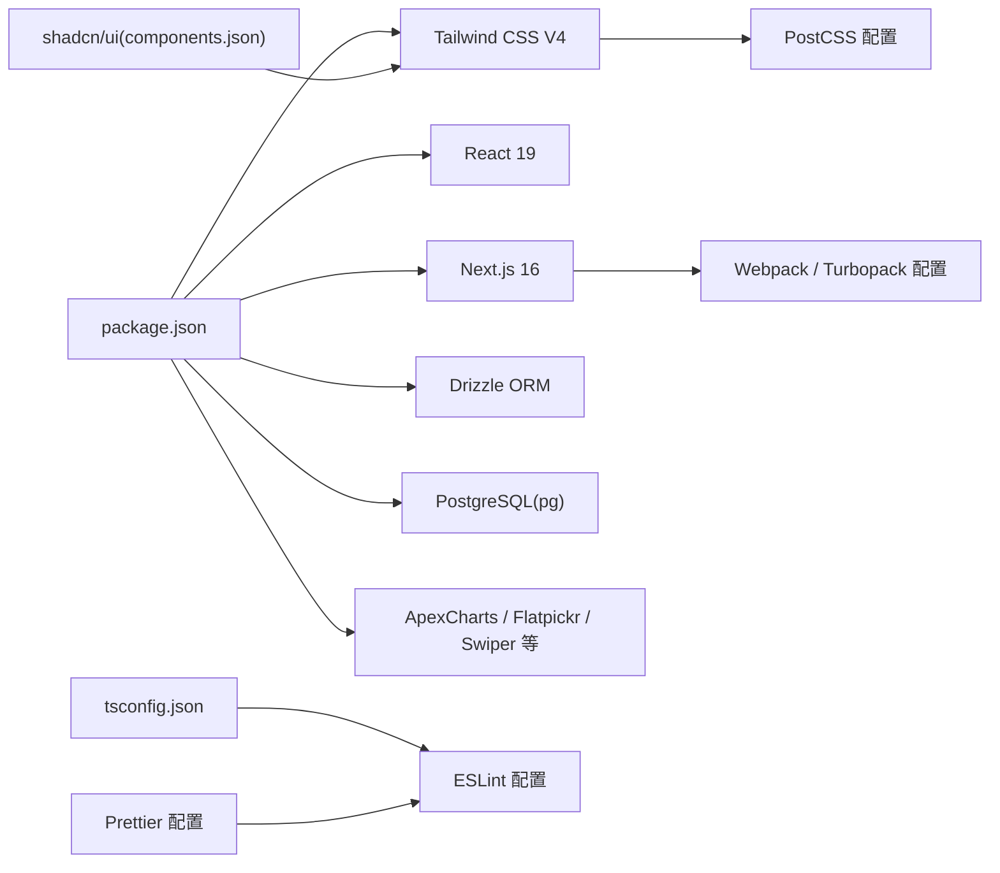

# 故障排除

<cite>
**本文引用的文件**
- [package.json](file://package.json)
- [README.md](file://README.md)
- [next.config.ts](file://next.config.ts)
- [tsconfig.json](file://tsconfig.json)
- [eslint.config.mjs](file://eslint.config.mjs)
- [components.json](file://components.json)
- [postcss.config.js](file://postcss.config.js)
- [.prettierrc](file://.prettierrc)
- [src/app/layout.tsx](file://src/app/layout.tsx)
- [src/lib/utils.ts](file://src/lib/utils.ts)
- [src/context/ThemeContext.tsx](file://src/context/ThemeContext.tsx)
- [src/context/SidebarContext.tsx](file://src/context/SidebarContext.tsx)
- [src/config/LayoutConfigHandler.tsx](file://src/config/LayoutConfigHandler.tsx)
- [src/lib/db.ts](file://src/lib/db.ts)
- [src/lib/schema.ts](file://src/lib/schema.ts)
</cite>

## 目录
1. [简介](#简介)
2. [项目结构](#项目结构)
3. [核心组件](#核心组件)
4. [架构总览](#架构总览)
5. [详细组件分析](#详细组件分析)
6. [依赖关系分析](#依赖关系分析)
7. [性能考虑](#性能考虑)
8. [故障排除指南](#故障排除指南)
9. [结论](#结论)
10. [附录](#附录)

## 简介
本指南面向在使用该 Next.js 管理面板项目时遇到问题的开发者，提供系统化的故障排除流程与解决方案，覆盖安装问题、运行时错误、构建失败、性能问题、兼容性问题、数据库连接、配置错误、网络与环境变量等。文档同时给出日志分析技巧、调试工具使用建议、错误信息解读要点，并提供问题报告模板与升级迁移参考。

## 项目结构
该项目采用 Next.js App Router 结构，前端以 React 19 + TypeScript + Tailwind CSS V4 构建，配合 shadcn/ui 组件体系与 Drizzle ORM 进行数据库访问。关键目录与文件职责概览：
- 根目录：包管理与开发脚本、ESLint/Prettier/Tailwind 配置、UI 组件库配置
- src/app：页面、布局、全局样式与 API 路由
- src/components：可复用 UI 组件（含图表、表单、模态框、表格等）
- src/context：主题与侧边栏状态上下文
- src/config：布局配置处理器（CSS 变量注入）
- src/lib：工具函数、数据库连接与 schema 定义

图示来源
- [next.config.ts:1-25](file://next.config.ts#L1-L25)
- [tsconfig.json:1-42](file://tsconfig.json#L1-L42)
- [components.json:1-26](file://components.json#L1-L26)
- [src/app/layout.tsx:1-33](file://src/app/layout.tsx#L1-L33)
- [src/context/ThemeContext.tsx:1-59](file://src/context/ThemeContext.tsx#L1-L59)
- [src/context/SidebarContext.tsx:1-85](file://src/context/SidebarContext.tsx#L1-L85)
- [src/config/LayoutConfigHandler.tsx:1-30](file://src/config/LayoutConfigHandler.tsx#L1-L30)
- [src/lib/db.ts:1-19](file://src/lib/db.ts#L1-L19)
- [src/lib/schema.ts:1-24](file://src/lib/schema.ts#L1-L24)

章节来源
- [package.json:1-79](file://package.json#L1-L79)
- [README.md:1-201](file://README.md#L1-L201)
- [next.config.ts:1-25](file://next.config.ts#L1-L25)
- [tsconfig.json:1-42](file://tsconfig.json#L1-L42)
- [components.json:1-26](file://components.json#L1-L26)
- [src/app/layout.tsx:1-33](file://src/app/layout.tsx#L1-L33)

## 核心组件
- 主题上下文：负责暗色/亮色主题切换与本地持久化，确保客户端渲染一致
- 侧边栏上下文：管理展开/折叠、移动端开关、悬停状态与子菜单
- 布局配置处理器：将主题配置映射为 CSS 变量，统一控制间距、圆角与品牌色
- 数据库连接：基于 Postgres 连接池与 Drizzle ORM，自动识别 SSL 场景
- 工具函数：类名合并与 Tailwind 合并工具，减少样式冲突

章节来源
- [src/context/ThemeContext.tsx:1-59](file://src/context/ThemeContext.tsx#L1-L59)
- [src/context/SidebarContext.tsx:1-85](file://src/context/SidebarContext.tsx#L1-L85)
- [src/config/LayoutConfigHandler.tsx:1-30](file://src/config/LayoutConfigHandler.tsx#L1-L30)
- [src/lib/db.ts:1-19](file://src/lib/db.ts#L1-L19)
- [src/lib/utils.ts:1-7](file://src/lib/utils.ts#L1-L7)

## 架构总览
下图展示从浏览器到数据库的关键调用链路与数据流：

图示来源
- [src/app/layout.tsx:1-33](file://src/app/layout.tsx#L1-L33)
- [src/context/ThemeContext.tsx:1-59](file://src/context/ThemeContext.tsx#L1-L59)
- [src/context/SidebarContext.tsx:1-85](file://src/context/SidebarContext.tsx#L1-L85)
- [src/config/LayoutConfigHandler.tsx:1-30](file://src/config/LayoutConfigHandler.tsx#L1-L30)
- [src/lib/db.ts:1-19](file://src/lib/db.ts#L1-L19)
- [src/lib/schema.ts:1-24](file://src/lib/schema.ts#L1-L24)

## 详细组件分析

### 主题与暗色模式（ThemeContext）
- 关键点
  - 客户端初始化：从 localStorage 读取主题，未设置则默认亮色
  - DOM 切换：根据当前主题添加/移除 html 的 dark 类
  - 上下文暴露：toggleTheme 用于切换主题；useTheme 确保在 Provider 内部使用
- 常见问题
  - 切换后刷新失效：检查 localStorage 是否被清理或跨标签页同步
  - SSR 与 CSR 不一致：确认在客户端组件中使用且仅在客户端执行
- 诊断步骤
  - 在浏览器控制台检查 document.documentElement 是否包含 dark 类
  - 检查 localStorage 中是否存在 "theme" 键值
  - 确认 ThemeProvider 包裹范围覆盖所有需要的主题元素

章节来源
- [src/context/ThemeContext.tsx:1-59](file://src/context/ThemeContext.tsx#L1-L59)

### 侧边栏状态（SidebarContext）
- 关键点
  - 展开/折叠、移动端开关、悬停状态、活动项与子菜单
  - 窗口尺寸监听，移动端强制关闭
- 常见问题
  - 移动端侧边栏无法打开：检查 isMobile 条件与事件监听是否生效
  - 子菜单状态异常：确认 toggleSubmenu 的参数与 openSubmenu 的比较逻辑
- 诊断步骤
  - 在 resize 事件中验证 isMobile 切换
  - 检查 isExpanded/isMobileOpen 的联动逻辑
  - 确认 SidebarProvider 包裹范围

章节来源
- [src/context/SidebarContext.tsx:1-85](file://src/context/SidebarContext.tsx#L1-L85)

### 布局配置处理器（LayoutConfigHandler）
- 关键点
  - 将主题配置映射为 CSS 变量（侧边栏宽度、容器内边距、圆角、主色）
  - 在组件挂载时一次性注入，避免重复计算
- 常见问题
  - 样式不生效：确认根节点存在且未被其他样式覆盖
  - 变量命名不一致：核对 themeConfig 与 CSS 变量映射
- 诊断步骤
  - 在浏览器开发者工具 Elements 面板检查 :root 变量
  - 在样式面板搜索对应 CSS 变量名进行定位

章节来源
- [src/config/LayoutConfigHandler.tsx:1-30](file://src/config/LayoutConfigHandler.tsx#L1-L30)

### 数据库连接（Drizzle + PostgreSQL）
- 关键点
  - 通过环境变量 POSTGRES_URL 建立连接
  - 自动识别 neon.tech 并禁用证书校验（开发场景）
  - 使用连接池提高并发与稳定性
- 常见问题
  - 连接字符串缺失：启动时报错提示缺少 POSTGRES_URL
  - SSL 连接失败：确认目标数据库是否需要 SSL 或证书策略
  - 查询超时：检查连接池大小与并发请求
- 诊断步骤
  - 在 shell 中 echo $POSTGRES_URL 校验环境变量
  - 使用最小化查询验证连通性
  - 查看数据库日志与连接池状态

章节来源
- [src/lib/db.ts:1-19](file://src/lib/db.ts#L1-L19)
- [src/lib/schema.ts:1-24](file://src/lib/schema.ts#L1-L24)

### 全局布局与字体加载（RootLayout）
- 关键点
  - 引入 flatpickr 样式与全局样式
  - 提供字体变量注入与主题包裹
  - 顶层通知组件（Sonner）用于提示
- 常见问题
  - 字体加载失败：检查 Google Fonts 可达性与网络代理
  - 样式冲突：确认全局样式与组件样式优先级
- 诊断步骤
  - 在 Network 面板检查字体与样式资源加载
  - 在 Console 查看是否有样式相关警告

章节来源
- [src/app/layout.tsx:1-33](file://src/app/layout.tsx#L1-L33)

### 工具函数（类名合并）
- 关键点
  - 使用 clsx 与 tailwind-merge 合并类名，避免重复与冲突
- 常见问题
  - 合并后样式异常：检查传入参数顺序与条件判断
- 诊断步骤
  - 在组件渲染时打印最终类名字符串进行比对

章节来源
- [src/lib/utils.ts:1-7](file://src/lib/utils.ts#L1-L7)

## 依赖关系分析
- 包管理与脚本
  - 开发脚本：dev/build/start/lint，以及数据库工具脚本
  - 依赖：Next.js 16、React 19、Tailwind CSS V4、ApexCharts、Flatpickr、Drizzle ORM、PostgreSQL 等
  - 兼容性：通过 overrides 解决 @react-jvectormap 与 React 版本的 peer 依赖冲突
- 构建与样式
  - Webpack/Next 配置：SVG 处理、Turbopack 规则
  - TypeScript：严格模式、路径别名、增量编译
  - ESLint：Next 推荐规则与自定义忽略
  - Prettier：代码风格统一
  - Tailwind V4：PostCSS 插件与 CSS 变量

图示来源
- [package.json:1-79](file://package.json#L1-L79)
- [next.config.ts:1-25](file://next.config.ts#L1-L25)
- [tsconfig.json:1-42](file://tsconfig.json#L1-L42)
- [eslint.config.mjs:1-19](file://eslint.config.mjs#L1-L19)
- [postcss.config.js:1-6](file://postcss.config.js#L1-L6)
- [components.json:1-26](file://components.json#L1-L26)
- [.prettierrc:1-10](file://.prettierrc#L1-L10)

章节来源
- [package.json:1-79](file://package.json#L1-L79)
- [next.config.ts:1-25](file://next.config.ts#L1-L25)
- [tsconfig.json:1-42](file://tsconfig.json#L1-L42)
- [eslint.config.mjs:1-19](file://eslint.config.mjs#L1-L19)
- [postcss.config.js:1-6](file://postcss.config.js#L1-L6)
- [components.json:1-26](file://components.json#L1-L26)
- [.prettierrc:1-10](file://.prettierrc#L1-L10)

## 性能考虑
- 构建与打包
  - 使用 Next.js 16 的 App Router 与 React Server Components，减少客户端传输
  - Turbopack 规则与 SVG 处理优化静态资源加载
- 样式与字体
  - Tailwind V4 与 CSS 变量减少重复样式，提升渲染效率
  - 字体按需加载，避免阻塞主线程
- 数据层
  - 连接池与最小化查询，避免长事务与无用查询
- 前端交互
  - 侧边栏与主题切换在客户端完成，避免不必要的服务端渲染

## 故障排除指南

### 安装问题
- 现象
  - 安装阶段出现 peer 依赖冲突或报错
- 根因
  - 旧版依赖与 React 19 的兼容性问题
- 解决方案
  - 使用推荐的 Node.js 版本（18.x 或 20.x）
  - 如遇 peer 依赖错误，使用 --legacy-peer-deps 标记重试
  - 若仍失败，清理缓存并重新安装
- 诊断步骤
  - 查看安装日志中的具体包名与版本
  - 核对 overrides 配置是否正确应用
- 参考
  - [README.md:43-76](file://README.md#L43-L76)
  - [package.json:68-77](file://package.json#L68-L77)

章节来源
- [README.md:43-76](file://README.md#L43-L76)
- [package.json:68-77](file://package.json#L68-L77)

### 运行时错误（主题/侧边栏/布局）
- 现象
  - 切换主题无效、侧边栏状态异常、样式不生效
- 根因
  - 上下文未正确包裹、CSS 变量未注入、字体加载失败
- 解决方案
  - 确保 ThemeProvider 与 SidebarProvider 包裹到根布局
  - 检查 LayoutConfigHandler 是否在根布局中渲染
  - 校验字体与全局样式的引入顺序
- 诊断步骤
  - 浏览器 Elements 面板检查 :root CSS 变量
  - 控制台查看上下文错误（如 useTheme/useSidebar 未在 Provider 内）
  - Network 面板检查字体与样式资源加载
- 参考
  - [src/context/ThemeContext.tsx:1-59](file://src/context/ThemeContext.tsx#L1-L59)
  - [src/context/SidebarContext.tsx:1-85](file://src/context/SidebarContext.tsx#L1-L85)
  - [src/config/LayoutConfigHandler.tsx:1-30](file://src/config/LayoutConfigHandler.tsx#L1-L30)
  - [src/app/layout.tsx:1-33](file://src/app/layout.tsx#L1-L33)

章节来源
- [src/context/ThemeContext.tsx:1-59](file://src/context/ThemeContext.tsx#L1-L59)
- [src/context/SidebarContext.tsx:1-85](file://src/context/SidebarContext.tsx#L1-L85)
- [src/config/LayoutConfigHandler.tsx:1-30](file://src/config/LayoutConfigHandler.tsx#L1-L30)
- [src/app/layout.tsx:1-33](file://src/app/layout.tsx#L1-L33)

### 构建失败（ESLint/TS/样式）
- 现象
  - 构建时报 ESLint/TS 错误或样式生成失败
- 根因
  - 严格模式下的类型错误、路径别名未解析、Tailwind V4 语法变更
- 解决方案
  - 运行 lint 修复并遵循规则
  - 检查 tsconfig 的路径别名与模块解析
  - 对照 Tailwind V4 迁移指南更新类名
- 诊断步骤
  - 查看 ESLint 输出的具体文件与行号
  - 在 tsconfig 中确认路径映射
  - 检查 PostCSS 与 Tailwind 插件配置
- 参考
  - [eslint.config.mjs:1-19](file://eslint.config.mjs#L1-L19)
  - [tsconfig.json:1-42](file://tsconfig.json#L1-L42)
  - [postcss.config.js:1-6](file://postcss.config.js#L1-L6)
  - [README.md:140-146](file://README.md#L140-L146)

章节来源
- [eslint.config.mjs:1-19](file://eslint.config.mjs#L1-L19)
- [tsconfig.json:1-42](file://tsconfig.json#L1-L42)
- [postcss.config.js:1-6](file://postcss.config.js#L1-L6)
- [README.md:140-146](file://README.md#L140-L146)

### 性能问题（首屏/交互/样式）
- 现象
  - 页面加载慢、交互卡顿、样式闪烁
- 根因
  - 字体/样式体积过大、组件渲染过多、未使用缓存
- 解决方案
  - 优化字体加载策略与懒加载
  - 减少不必要的全局样式与重复类名
  - 使用 Next.js 缓存与分块加载
- 诊断步骤
  - 使用 Performance 面板分析渲染瓶颈
  - 检查样式体积与关键 CSS 提取
  - 分析路由与组件树复杂度

### 兼容性问题（版本/依赖）
- 现象
  - 升级后功能异常、图表/日期选择器不工作
- 根因
  - React 19 与部分第三方库的兼容性变化
- 解决方案
  - 使用 overrides 保持兼容
  - 替换已废弃或不兼容的组件（如从 react-flatpickr 迁移到 flatpickr）
- 诊断步骤
  - 对照版本变更记录逐项排查
  - 在浏览器控制台查看运行时错误
- 参考
  - [README.md:120-131](file://README.md#L120-L131)
  - [package.json:68-77](file://package.json#L68-L77)

章节来源
- [README.md:120-131](file://README.md#L120-L131)
- [package.json:68-77](file://package.json#L68-L77)

### 配置错误（环境变量/路径别名）
- 现象
  - 数据库连接失败、字体/样式路径错误
- 根因
  - .env 缺失或拼写错误、tsconfig 路径别名未生效
- 解决方案
  - 补充 .env 并校验变量名
  - 确认 tsconfig 中 @/* 映射与实际目录一致
- 诊断步骤
  - 在 db 连接处断点检查环境变量
  - 在组件中打印 import 路径确认解析

章节来源
- [src/lib/db.ts:1-19](file://src/lib/db.ts#L1-L19)
- [tsconfig.json:25-29](file://tsconfig.json#L25-L29)

### 网络连接问题（数据库/外部资源）
- 现象
  - 请求超时、SSL 校验失败、跨域错误
- 根因
  - 网络策略限制、证书策略、CORS 配置
- 解决方案
  - 校验数据库地址与凭据
  - 在开发环境根据平台特性调整 SSL 设置
  - 配置正确的 CORS 与代理
- 诊断步骤
  - 使用 curl/ping 验证可达性
  - 查看浏览器 Network 面板与服务器日志

章节来源
- [src/lib/db.ts:1-19](file://src/lib/db.ts#L1-L19)

### 日志分析技巧与调试工具
- 日志与错误
  - 浏览器 Console：定位运行时错误与上下文未包裹
  - Network：定位资源加载与接口异常
  - Performance：定位渲染与内存问题
- 调试工具
  - React DevTools：检查组件树与上下文状态
  - Redux DevTools（如使用）：追踪状态变化
- 最佳实践
  - 在关键路径添加最小化断点
  - 使用浏览器内置性能分析与内存快照

### 错误信息解读
- “必须在 ThemeProvider 内使用 useTheme”
  - 说明：useTheme 未在 ThemeProvider 包裹范围内调用
  - 处理：将调用点上移至根布局或确保 Provider 范围覆盖
- “POSTGRES_URL 环境变量是必需的”
  - 说明：数据库连接未配置
  - 处理：在 .env 中补充并重启服务
- ESLint/TS 报错
  - 说明：类型或规则不满足
  - 处理：按提示修复或调整配置

章节来源
- [src/context/ThemeContext.tsx:52-58](file://src/context/ThemeContext.tsx#L52-L58)
- [src/lib/db.ts:7-9](file://src/lib/db.ts#L7-L9)
- [eslint.config.mjs:1-19](file://eslint.config.mjs#L1-L19)
- [tsconfig.json:11-18](file://tsconfig.json#L11-L18)

### 问题报告模板
- 项目版本与环境
  - Next.js 版本、React 版本、Node.js 版本、操作系统
- 复现步骤
  - 详细描述操作流程与预期/实际结果
- 日志与截图
  - 控制台错误、Network 请求、关键界面截图
- 配置信息
  - .env 关键变量、tsconfig 路径别名、关键配置片段
- 附加信息
  - 是否使用 overrides、是否启用 Turbopack、是否自定义 webpack

### 社区支持与升级迁移
- 支持渠道
  - 文档与演示站、GitHub Issues（按模板提交）、社区交流
- 升级迁移
  - 严格对照版本变更记录，逐步升级并验证
  - Tailwind V4 迁移需更新类名与语法
- 参考
  - [README.md:110-167](file://README.md#L110-L167)
  - [README.md:140-146](file://README.md#L140-L146)

章节来源
- [README.md:110-167](file://README.md#L110-L167)
- [README.md:140-146](file://README.md#L140-L146)

## 结论
本指南提供了从安装、运行、构建到性能与兼容性的系统化故障排除方法。建议在开发过程中：
- 建立标准化的环境变量与配置清单
- 使用 ESLint/TS 严格约束与 Prettier 统一风格
- 在关键路径保留最小化日志与断点
- 遇到问题先对照版本变更与依赖配置，再逐步缩小范围

## 附录

### 常用命令速查
- 启动开发：dev
- 构建生产：build
- 启动服务：start
- 代码检查：lint
- 数据库：generate/migrate/push/studio

章节来源
- [package.json:5-14](file://package.json#L5-L14)