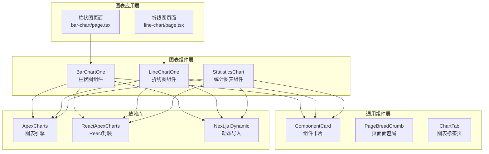
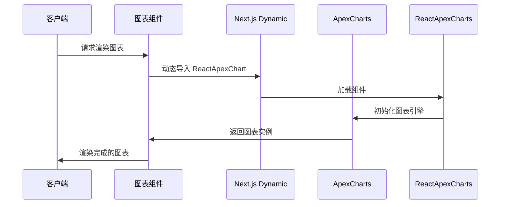
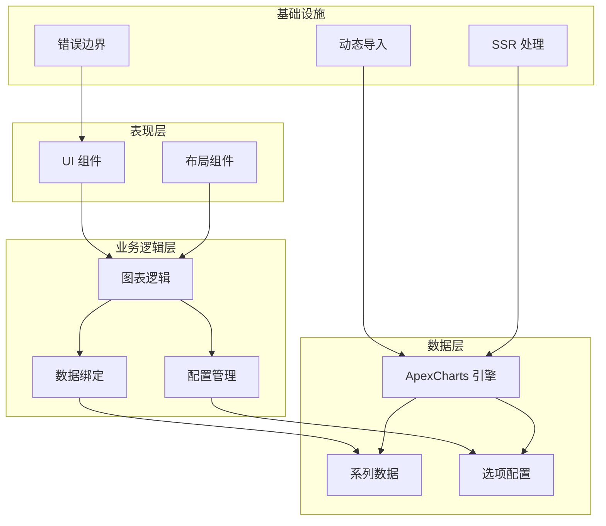
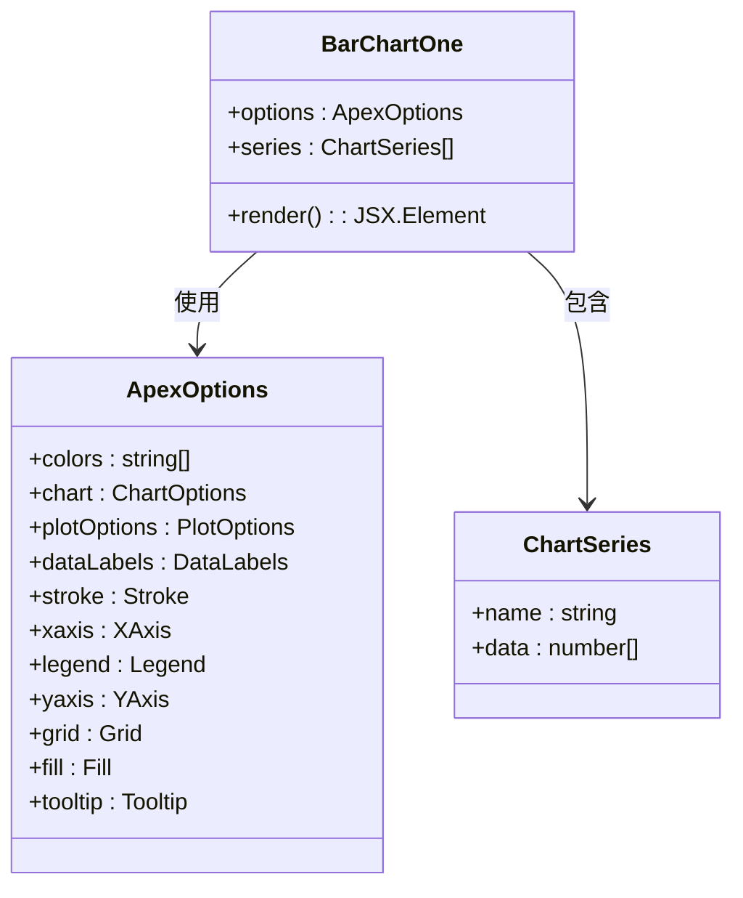
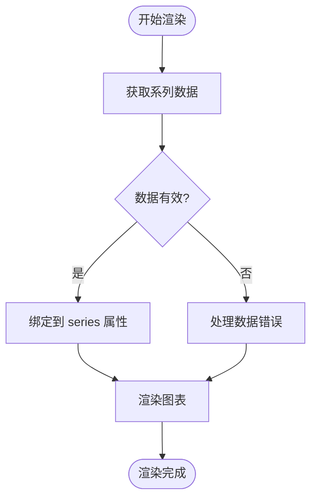
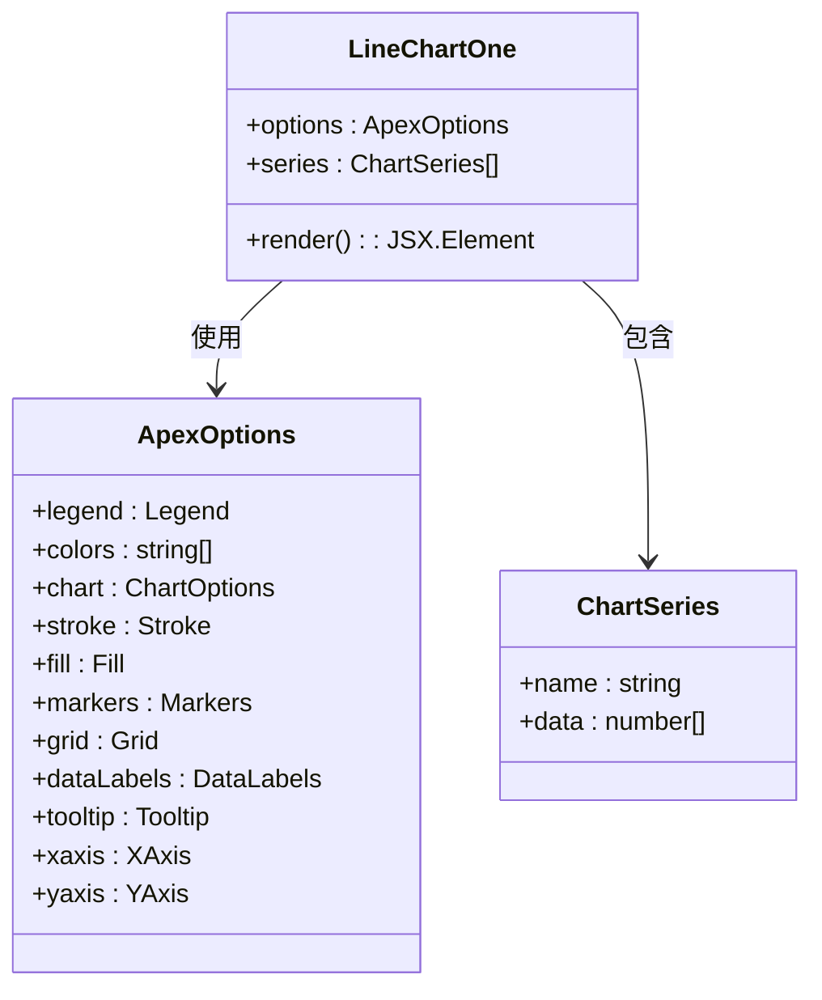
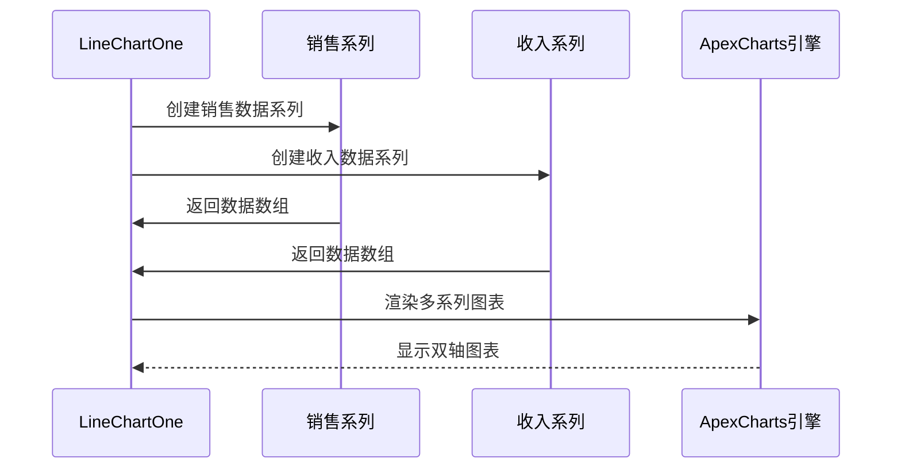
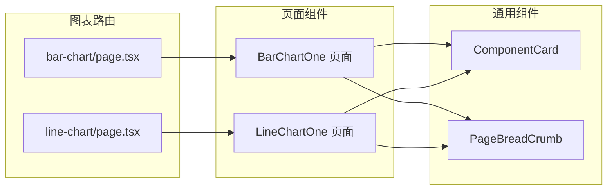
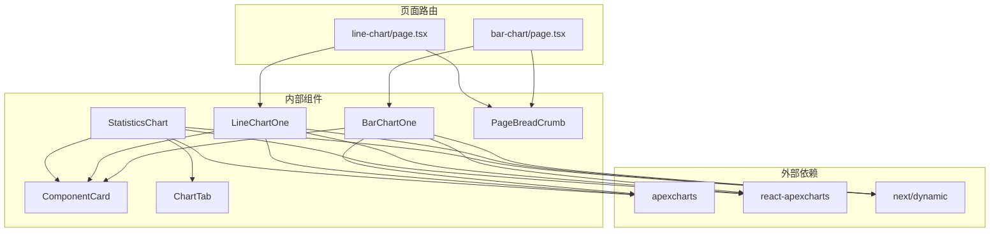
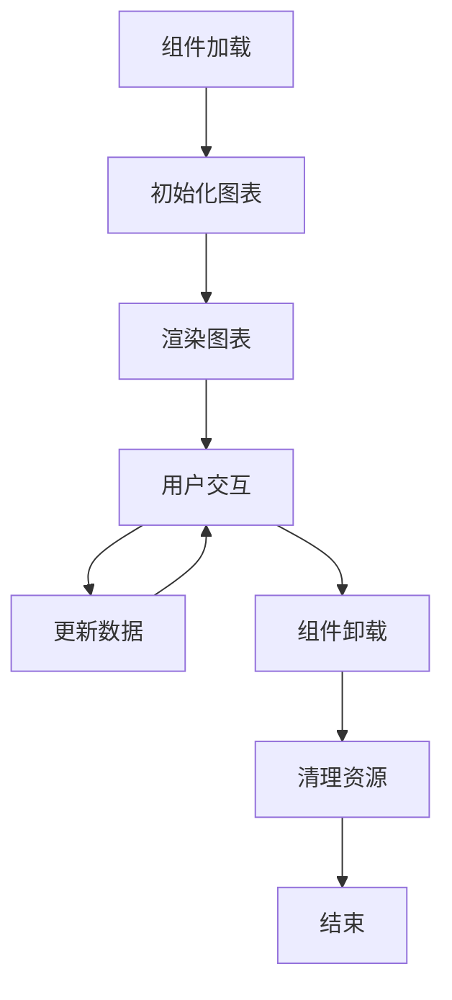

# 图表组件

<cite>
**本文档引用的文件**
- [BarChartOne.tsx](file://src/components/charts/bar/BarChartOne.tsx)
- [LineChartOne.tsx](file://src/components/charts/line/LineChartOne.tsx)
- [page.tsx](file://src/app/(admin)/(others-pages)/(chart)/bar-chart/page.tsx)
- [page.tsx](file://src/app/(admin)/(others-pages)/(chart)/line-chart/page.tsx)
- [package.json](file://package.json)
- [ComponentCard.tsx](file://src/components/common/ComponentCard.tsx)
- [PageBreadCrumb.tsx](file://src/components/common/PageBreadCrumb.tsx)
- [StatisticsChart.tsx](file://src/components/ecommerce/StatisticsChart.tsx)
- [ChartTab.tsx](file://src/components/common/ChartTab.tsx)
</cite>

## 目录
1. [简介](#简介)
2. [项目结构](#项目结构)
3. [核心组件](#核心组件)
4. [架构概览](#架构概览)
5. [详细组件分析](#详细组件分析)
6. [依赖关系分析](#依赖关系分析)
7. [性能考虑](#性能考虑)
8. [故障排除指南](#故障排除指南)
9. [结论](#结论)

## 简介

本项目实现了基于 ApexCharts 的图表组件，提供了专业的数据可视化解决方案。图表组件采用现代化的 React 架构，集成了动态导入机制以优化性能，并提供了丰富的配置选项来满足各种业务场景需求。

项目中的图表组件主要包含：
- **柱状图组件**：用于展示分类数据的对比分析
- **折线图组件**：用于展示时间序列数据的趋势变化
- **页面路由**：提供独立的图表展示页面
- **通用卡片组件**：用于包装和展示图表内容

## 项目结构

图表组件的组织结构清晰，采用了按功能模块划分的设计模式：

**图表来源**
- [BarChartOne.tsx:1-111](file://src/components/charts/bar/BarChartOne.tsx#L1-L111)
- [LineChartOne.tsx:1-134](file://src/components/charts/line/LineChartOne.tsx#L1-L134)
- [page.tsx:1-25](file://src/app/(admin)/(others-pages)/(chart)/bar-chart/page.tsx#L1-L25)
- [page.tsx:1-24](file://src/app/(admin)/(others-pages)/(chart)/line-chart/page.tsx#L1-L24)

**章节来源**
- [BarChartOne.tsx:1-111](file://src/components/charts/bar/BarChartOne.tsx#L1-L111)
- [LineChartOne.tsx:1-134](file://src/components/charts/line/LineChartOne.tsx#L1-L134)
- [page.tsx:1-25](file://src/app/(admin)/(others-pages)/(chart)/bar-chart/page.tsx#L1-L25)
- [page.tsx:1-24](file://src/app/(admin)/(others-pages)/(chart)/line-chart/page.tsx#L1-L24)

## 核心组件

### 依赖管理

项目使用以下关键依赖来支持图表功能：

| 依赖包 | 版本 | 用途 |
|--------|------|------|
| `apexcharts` | ^4.7.0 | 图表渲染引擎 |
| `react-apexcharts` | ^1.8.0 | React 组件封装 |
| `next` | ^16.1.6 | Next.js 框架 |
| `react` | ^19.2.0 | React 核心库 |
| `react-dom` | ^19.2.0 | DOM 操作 |

这些依赖确保了图表组件能够正常运行并提供丰富的交互功能。

**章节来源**
- [package.json:27-39](file://package.json#L27-L39)

### 动态导入机制

所有图表组件都采用了动态导入策略来优化性能：

**图表来源**
- [BarChartOne.tsx:6-10](file://src/components/charts/bar/BarChartOne.tsx#L6-L10)
- [LineChartOne.tsx:6-10](file://src/components/charts/line/LineChartOne.tsx#L6-L10)

**章节来源**
- [BarChartOne.tsx:6-10](file://src/components/charts/bar/BarChartOne.tsx#L6-L10)
- [LineChartOne.tsx:6-10](file://src/components/charts/line/LineChartOne.tsx#L6-L10)

## 架构概览

图表组件采用分层架构设计，确保了良好的可维护性和扩展性：

**图表来源**
- [BarChartOne.tsx:12-110](file://src/components/charts/bar/BarChartOne.tsx#L12-L110)
- [LineChartOne.tsx:12-133](file://src/components/charts/line/LineChartOne.tsx#L12-L133)

## 详细组件分析

### 柱状图组件 (BarChartOne)

柱状图组件是项目中最基础的图表实现，提供了完整的数据可视化功能：

#### 组件结构

**图表来源**
- [BarChartOne.tsx:12-110](file://src/components/charts/bar/BarChartOne.tsx#L12-L110)

#### 配置选项详解

柱状图组件的核心配置包括以下关键参数：

| 配置类别 | 参数名称 | 值 | 说明 |
|----------|----------|----|------|
| **颜色方案** | colors | ["#465fff"] | 单一蓝色主题色 |
| **图表类型** | type | "bar" | 指定为柱状图 |
| **字体家族** | fontFamily | "Outfit, sans-serif" | 使用 Outfit 字体 |
| **高度设置** | height | 180 | 图表高度为 180px |
| **边框设置** | stroke.width | 4 | 边框宽度为 4px |
| **圆角设置** | borderRadius | 5 | 柱子圆角半径为 5px |
| **网格线** | grid.yaxis.lines.show | true | 显示 Y 轴网格线 |

#### 数据绑定方式

柱状图使用静态数据进行演示，数据格式遵循 ApexCharts 规范：

**图表来源**
- [BarChartOne.tsx:92-97](file://src/components/charts/bar/BarChartOne.tsx#L92-L97)

**章节来源**
- [BarChartOne.tsx:12-110](file://src/components/charts/bar/BarChartOne.tsx#L12-L110)

### 折线图组件 (LineChartOne)

折线图组件提供了更复杂的图表功能，支持多系列数据和渐变填充：

#### 组件结构

**图表来源**
- [LineChartOne.tsx:12-133](file://src/components/charts/line/LineChartOne.tsx#L12-L133)

#### 高级配置特性

折线图组件包含了丰富的配置选项：

| 配置类别 | 参数名称 | 值 | 说明 |
|----------|----------|----|------|
| **渐变填充** | fill.type | "gradient" | 启用渐变填充 |
| **渐变透明度** | gradient.opacityFrom | 0.55 | 起始透明度 |
| **标记点** | markers.size | 0 | 不显示标记点 |
| **网格线** | grid.yaxis.lines.show | true | 显示 Y 轴网格线 |
| **工具提示** | tooltip.enabled | true | 启用工具提示 |
| **X轴格式** | tooltip.x.format | "dd MMM yyyy" | 日期格式化 |

#### 多系列数据支持

折线图组件支持同时展示多个数据系列：

**图表来源**
- [LineChartOne.tsx:111-120](file://src/components/charts/line/LineChartOne.tsx#L111-L120)

**章节来源**
- [LineChartOne.tsx:12-133](file://src/components/charts/line/LineChartOne.tsx#L12-L133)

### 页面路由组件

每个图表都有对应的页面路由，提供独立的访问入口：

#### 路由结构

**图表来源**
- [page.tsx:13-24](file://src/app/(admin)/(others-pages)/(chart)/bar-chart/page.tsx#L13-L24)
- [page.tsx:12-23](file://src/app/(admin)/(others-pages)/(chart)/line-chart/page.tsx#L12-L23)

**章节来源**
- [page.tsx:1-25](file://src/app/(admin)/(others-pages)/(chart)/bar-chart/page.tsx#L1-L25)
- [page.tsx:1-24](file://src/app/(admin)/(others-pages)/(chart)/line-chart/page.tsx#L1-L24)

## 依赖关系分析

图表组件之间的依赖关系体现了清晰的层次结构：

**图表来源**
- [BarChartOne.tsx:4-10](file://src/components/charts/bar/BarChartOne.tsx#L4-L10)
- [LineChartOne.tsx:4-10](file://src/components/charts/line/LineChartOne.tsx#L4-L10)
- [StatisticsChart.tsx:3-9](file://src/components/ecommerce/StatisticsChart.tsx#L3-L9)

**章节来源**
- [package.json:27-39](file://package.json#L27-L39)

## 性能考虑

### 动态导入优化

项目采用了多种性能优化策略：

1. **代码分割**：通过动态导入只在客户端加载图表库
2. **SSR 禁用**：避免服务器端渲染时的兼容性问题
3. **懒加载**：图表组件仅在需要时才加载

### 内存管理

### 响应式设计

图表组件支持响应式布局：

| 断点 | 最小宽度 | 行为 |
|------|----------|------|
| 默认 | 1000px | 固定宽度确保图表完整性 |
| XL 屏幕 | 全宽 | 自适应容器宽度 |
| 移动设备 | 自适应 | 水平滚动支持 |

**章节来源**
- [BarChartOne.tsx:98-109](file://src/components/charts/bar/BarChartOne.tsx#L98-L109)
- [LineChartOne.tsx:121-132](file://src/components/charts/line/LineChartOne.tsx#L121-L132)

## 故障排除指南

### 常见问题及解决方案

#### 1. 图表不显示问题

**症状**：图表空白或显示异常
**原因**：
- 服务器端渲染导致的兼容性问题
- 动态导入失败
- 数据格式不正确

**解决方案**：
- 确保使用 `"use client"` 指令
- 检查动态导入配置
- 验证数据格式符合 ApexCharts 规范

#### 2. 性能问题

**症状**：页面加载缓慢或内存占用过高
**原因**：
- 图表数据量过大
- 频繁的数据更新
- 未正确清理事件监听器

**解决方案**：
- 实现数据分页或虚拟化
- 优化数据更新频率
- 在组件卸载时清理资源

#### 3. 样式问题

**症状**：图表样式与主题不匹配
**原因**：
- CSS 变量未正确设置
- 主题切换时样式未更新
- 响应式断点配置不当

**解决方案**：
- 检查 Tailwind CSS 配置
- 实现主题切换监听
- 调整响应式断点设置

**章节来源**
- [BarChartOne.tsx:6-10](file://src/components/charts/bar/BarChartOne.tsx#L6-L10)
- [LineChartOne.tsx:6-10](file://src/components/charts/line/LineChartOne.tsx#L6-L10)

## 结论

本项目成功实现了基于 ApexCharts 的图表组件系统，具有以下特点：

### 技术优势
- **现代化架构**：采用 React Hooks 和 TypeScript 提供类型安全
- **性能优化**：通过动态导入和懒加载提升加载速度
- **可扩展性**：清晰的组件结构便于功能扩展
- **响应式设计**：适配不同屏幕尺寸的设备

### 开发体验
- **易于使用**：简单的 API 接口和配置选项
- **文档完善**：详细的注释和示例代码
- **调试友好**：清晰的错误处理和日志输出

### 适用场景
该图表组件系统适用于：
- 数据仪表板和监控界面
- 商业智能报告
- 用户行为分析
- 财务数据展示

通过合理的配置和定制，开发者可以轻松创建专业级的数据可视化应用。