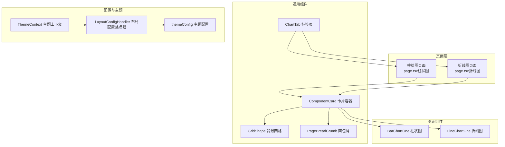
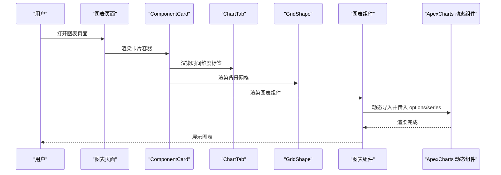
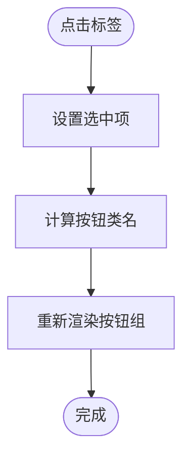
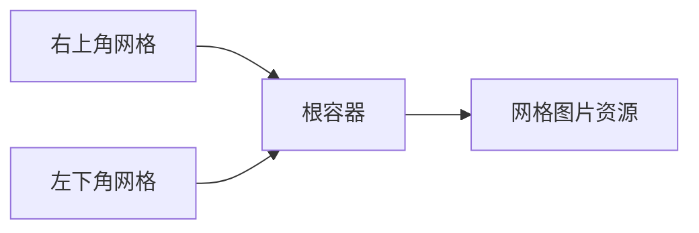
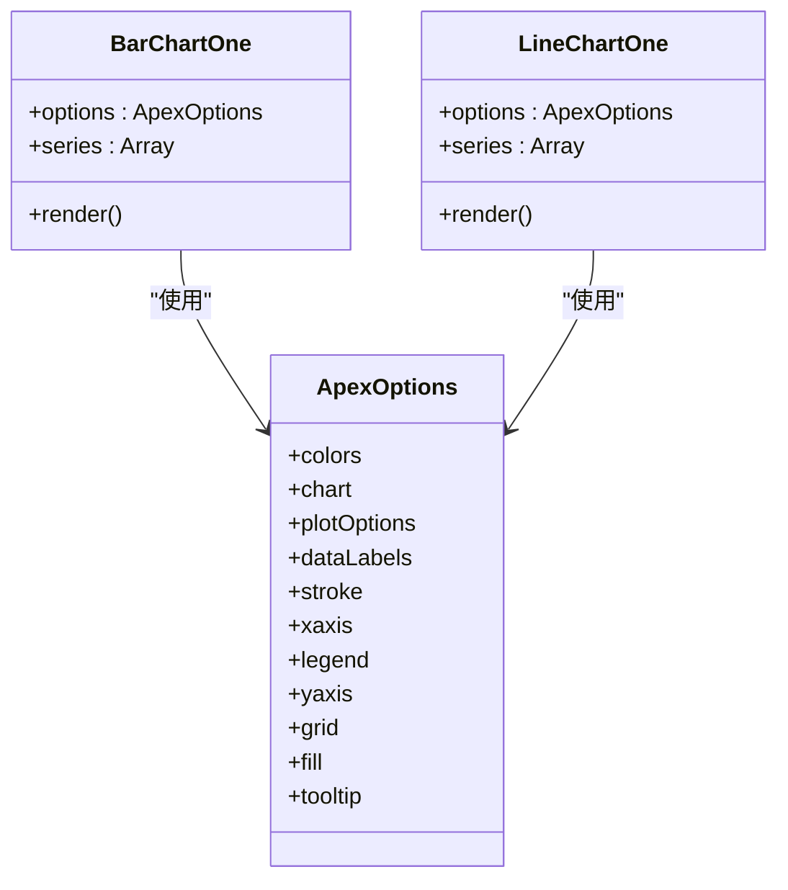
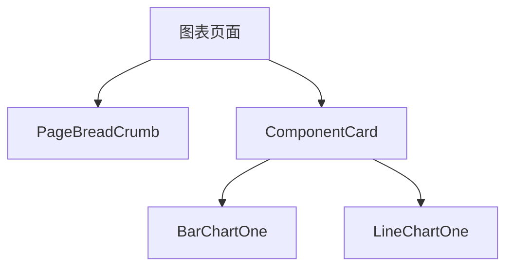
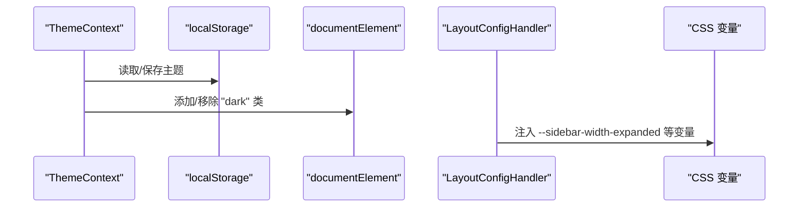
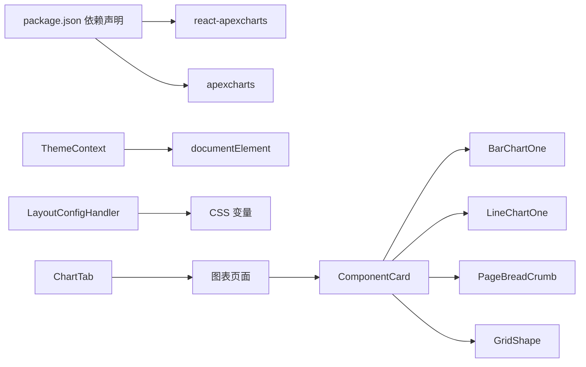

# 图表集成与配置

<cite>
**本文引用的文件**
- [ChartTab.tsx](file://src/components/common/ChartTab.tsx)
- [GridShape.tsx](file://src/components/common/GridShape.tsx)
- [BarChartOne.tsx](file://src/components/charts/bar/BarChartOne.tsx)
- [LineChartOne.tsx](file://src/components/charts/line/LineChartOne.tsx)
- [LayoutConfigHandler.tsx](file://src/config/LayoutConfigHandler.tsx)
- [themeConfig.ts](file://src/config/themeConfig.ts)
- [ThemeContext.tsx](file://src/context/ThemeContext.tsx)
- [page.tsx（柱状图）](file://src/app/(admin)/(others-pages)/(chart)/bar-chart/page.tsx)
- [page.tsx（折线图）](file://src/app/(admin)/(others-pages)/(chart)/line-chart/page.tsx)
- [ComponentCard.tsx](file://src/components/common/ComponentCard.tsx)
- [PageBreadCrumb.tsx](file://src/components/common/PageBreadCrumb.tsx)
- [package.json](file://package.json)
</cite>

## 目录
1. [简介](#简介)
2. [项目结构](#项目结构)
3. [核心组件](#核心组件)
4. [架构总览](#架构总览)
5. [详细组件分析](#详细组件分析)
6. [依赖关系分析](#依赖关系分析)
7. [性能考虑](#性能考虑)
8. [故障排查指南](#故障排查指南)
9. [结论](#结论)
10. [附录](#附录)

## 简介
本文件面向需要深度定制图表系统的开发者，系统性阐述图表组件的集成方式、配置管理与布局处理机制。重点覆盖以下内容：
- ChartTab 标签页组件：用于切换时间维度（如月度/季度/年度）的交互式标签组。
- GridShape 网格组件：为页面背景提供网格装饰元素，提升视觉层次。
- 图表配置处理器：基于 ApexCharts 的配置对象与动态渲染流程。
- 动态配置更新与主题适配：通过主题上下文与 CSS 变量实现深浅色切换与全局样式联动。
- 性能优化策略：按需加载、最小化重绘、滚动容器与固定宽度策略。
- 最佳实践与常见问题：集成步骤、调试方法与排障建议。

## 项目结构
图表相关模块主要分布在以下位置：
- 页面入口：位于应用路由下的图表页面，负责引入具体图表组件与面包屑导航。
- 组件层：通用 UI 组件（ChartTab、GridShape、ComponentCard、PageBreadCrumb）与图表组件（BarChartOne、LineChartOne）。
- 配置层：主题配置与布局配置处理器，提供 CSS 变量注入与主题状态管理。

**图表来源**
- [page.tsx（柱状图）](file://src/app/(admin)/(others-pages)/(chart)/bar-chart/page.tsx#L1-L25)
- [page.tsx（折线图）](file://src/app/(admin)/(others-pages)/(chart)/line-chart/page.tsx#L1-L24)
- [ChartTab.tsx:1-46](file://src/components/common/ChartTab.tsx#L1-L46)
- [GridShape.tsx:1-26](file://src/components/common/GridShape.tsx#L1-L26)
- [ComponentCard.tsx:1-41](file://src/components/common/ComponentCard.tsx#L1-L41)
- [PageBreadCrumb.tsx:1-53](file://src/components/common/PageBreadCrumb.tsx#L1-L53)
- [BarChartOne.tsx:1-111](file://src/components/charts/bar/BarChartOne.tsx#L1-L111)
- [LineChartOne.tsx:1-134](file://src/components/charts/line/LineChartOne.tsx#L1-L134)
- [ThemeContext.tsx:1-59](file://src/context/ThemeContext.tsx#L1-L59)
- [LayoutConfigHandler.tsx:1-30](file://src/config/LayoutConfigHandler.tsx#L1-L30)
- [themeConfig.ts:1-31](file://src/config/themeConfig.ts#L1-L31)

**章节来源**
- [page.tsx（柱状图）](file://src/app/(admin)/(others-pages)/(chart)/bar-chart/page.tsx#L1-L25)
- [page.tsx（折线图）](file://src/app/(admin)/(others-pages)/(chart)/line-chart/page.tsx#L1-L24)

## 核心组件
- ChartTab：提供三个选项按钮，用于切换时间粒度；根据当前选中项动态应用样式类名，支持深浅色模式。
- GridShape：使用绝对定位与两张网格图片，分别置于右上与左下，形成对角装饰背景。
- BarChartOne / LineChartOne：基于 ApexCharts 的动态图表组件，通过动态导入避免 SSR 渲染，提供可配置的 options 与 series。
- ComponentCard：卡片容器，统一标题、描述与内边距，承载图表组件。
- PageBreadCrumb：页面面包屑导航，提供页面标题与返回路径。
- ThemeContext：主题状态管理，持久化到本地存储并在客户端切换 HTML 根节点的 dark 类。
- LayoutConfigHandler：将主题配置映射为 CSS 变量，供组件样式引用。
- themeConfig：集中定义主题参数（侧边栏宽度、间距、圆角、主色调等）。

**章节来源**
- [ChartTab.tsx:1-46](file://src/components/common/ChartTab.tsx#L1-L46)
- [GridShape.tsx:1-26](file://src/components/common/GridShape.tsx#L1-L26)
- [BarChartOne.tsx:1-111](file://src/components/charts/bar/BarChartOne.tsx#L1-L111)
- [LineChartOne.tsx:1-134](file://src/components/charts/line/LineChartOne.tsx#L1-L134)
- [ComponentCard.tsx:1-41](file://src/components/common/ComponentCard.tsx#L1-L41)
- [PageBreadCrumb.tsx:1-53](file://src/components/common/PageBreadCrumb.tsx#L1-L53)
- [ThemeContext.tsx:1-59](file://src/context/ThemeContext.tsx#L1-L59)
- [LayoutConfigHandler.tsx:1-30](file://src/config/LayoutConfigHandler.tsx#L1-L30)
- [themeConfig.ts:1-31](file://src/config/themeConfig.ts#L1-L31)

## 架构总览
图表系统采用“页面 → 容器卡片 → 图表组件”的分层设计，配合主题上下文与布局配置处理器实现主题与样式的统一管理。图表组件通过动态导入减少首屏体积，按需渲染。

**图表来源**
- [page.tsx（柱状图）](file://src/app/(admin)/(others-pages)/(chart)/bar-chart/page.tsx#L13-L23)
- [page.tsx（折线图）](file://src/app/(admin)/(others-pages)/(chart)/line-chart/page.tsx#L12-L21)
- [ComponentCard.tsx:10-37](file://src/components/common/ComponentCard.tsx#L10-L37)
- [ChartTab.tsx:3-42](file://src/components/common/ChartTab.tsx#L3-L42)
- [GridShape.tsx:4-24](file://src/components/common/GridShape.tsx#L4-L24)
- [BarChartOne.tsx:6-10](file://src/components/charts/bar/BarChartOne.tsx#L6-L10)
- [LineChartOne.tsx:6-10](file://src/components/charts/line/LineChartOne.tsx#L6-L10)

## 详细组件分析

### ChartTab 标签页组件
- 功能要点
  - 三段式时间选择：月度、季度、年度。
  - 选中态样式：根据当前选中项动态计算按钮类名，适配深浅色模式。
  - 交互行为：点击切换状态，触发重新渲染。
- 样式与主题
  - 使用 CSS 变量与暗色类名，确保在不同主题下具备一致的对比度与可读性。
- 适用场景
  - 在页面顶部作为筛选器，配合图表组件实现数据维度切换。

**图表来源**
- [ChartTab.tsx:3-42](file://src/components/common/ChartTab.tsx#L3-L42)

**章节来源**
- [ChartTab.tsx:1-46](file://src/components/common/ChartTab.tsx#L1-L46)

### GridShape 网格组件
- 功能要点
  - 使用绝对定位与两张网格图片，分别旋转 0° 与 180°，形成对角装饰。
  - 通过响应式 max-width 控制在不同屏幕尺寸下的显示比例。
- 设计意图
  - 为页面提供轻量级背景纹理，增强视觉层次但不干扰内容阅读。

**图表来源**
- [GridShape.tsx:4-24](file://src/components/common/GridShape.tsx#L4-L24)

**章节来源**
- [GridShape.tsx:1-26](file://src/components/common/GridShape.tsx#L1-L26)

### 图表组件（BarChartOne / LineChartOne）
- 动态导入
  - 通过动态导入避免 SSR 渲染，仅在客户端执行，降低首屏负担。
- 配置对象（ApexOptions）
  - 包含颜色、字体、图表类型、高度、工具箱、网格、坐标轴、图例、填充与提示框等。
  - 提供 series 数据数组，支持多系列数据。
- 渲染容器
  - 外层容器设置最小宽度与横向滚动，保证在窄屏或长 X 轴时可平滑滚动。
- 交互与提示
  - 可按需启用/禁用图例、网格线、数据标签与工具提示，并自定义格式化函数。

**图表来源**
- [BarChartOne.tsx:13-97](file://src/components/charts/bar/BarChartOne.tsx#L13-L97)
- [LineChartOne.tsx:13-120](file://src/components/charts/line/LineChartOne.tsx#L13-L120)

**章节来源**
- [BarChartOne.tsx:1-111](file://src/components/charts/bar/BarChartOne.tsx#L1-L111)
- [LineChartOne.tsx:1-134](file://src/components/charts/line/LineChartOne.tsx#L1-L134)

### 页面与容器（页面入口、卡片容器、面包屑）
- 页面入口
  - 引入面包屑与卡片容器，内部渲染具体图表组件。
- ComponentCard
  - 统一卡片头部与主体区域，支持标题、描述与子内容。
- PageBreadCrumb
  - 提供页面标题与返回路径，增强导航体验。

**图表来源**
- [page.tsx（柱状图）](file://src/app/(admin)/(others-pages)/(chart)/bar-chart/page.tsx#L13-L23)
- [page.tsx（折线图）](file://src/app/(admin)/(others-pages)/(chart)/line-chart/page.tsx#L12-L21)
- [ComponentCard.tsx:10-37](file://src/components/common/ComponentCard.tsx#L10-L37)
- [PageBreadCrumb.tsx:8-49](file://src/components/common/PageBreadCrumb.tsx#L8-L49)

**章节来源**
- [page.tsx（柱状图）](file://src/app/(admin)/(others-pages)/(chart)/bar-chart/page.tsx#L1-L25)
- [page.tsx（折线图）](file://src/app/(admin)/(others-pages)/(chart)/line-chart/page.tsx#L1-L24)
- [ComponentCard.tsx:1-41](file://src/components/common/ComponentCard.tsx#L1-L41)
- [PageBreadCrumb.tsx:1-53](file://src/components/common/PageBreadCrumb.tsx#L1-L53)

### 主题与布局配置
- 主题上下文（ThemeContext）
  - 管理当前主题（light/dark），持久化到本地存储，并在根节点添加/移除 dark 类。
- 布局配置处理器（LayoutConfigHandler）
  - 将 themeConfig 中的参数映射为 CSS 变量，供组件样式引用（如圆角、间距、主色调等）。
- 主题配置（themeConfig）
  - 定义侧边栏宽度、容器内边距、区块间距、圆角与品牌色等。

**图表来源**
- [ThemeContext.tsx:18-39](file://src/context/ThemeContext.tsx#L18-L39)
- [LayoutConfigHandler.tsx:7-26](file://src/config/LayoutConfigHandler.tsx#L7-L26)
- [themeConfig.ts:4-30](file://src/config/themeConfig.ts#L4-L30)

**章节来源**
- [ThemeContext.tsx:1-59](file://src/context/ThemeContext.tsx#L1-L59)
- [LayoutConfigHandler.tsx:1-30](file://src/config/LayoutConfigHandler.tsx#L1-L30)
- [themeConfig.ts:1-31](file://src/config/themeConfig.ts#L1-L31)

## 依赖关系分析
- 图表依赖
  - 图表组件依赖 react-apexcharts 与 apexcharts，通过动态导入避免 SSR 渲染。
- 主题与样式
  - 主题上下文与布局配置处理器共同驱动 CSS 变量，影响组件圆角、间距与颜色。
- 页面与组件
  - 页面通过 ComponentCard 组织图表组件与面包屑，ChartTab 作为可选交互元素。

**图表来源**
- [package.json:27-39](file://package.json#L27-L39)
- [ThemeContext.tsx:18-39](file://src/context/ThemeContext.tsx#L18-L39)
- [LayoutConfigHandler.tsx:7-26](file://src/config/LayoutConfigHandler.tsx#L7-L26)
- [page.tsx（柱状图）](file://src/app/(admin)/(others-pages)/(chart)/bar-chart/page.tsx#L13-L23)
- [page.tsx（折线图）](file://src/app/(admin)/(others-pages)/(chart)/line-chart/page.tsx#L12-L21)
- [ComponentCard.tsx:10-37](file://src/components/common/ComponentCard.tsx#L10-L37)
- [ChartTab.tsx:3-42](file://src/components/common/ChartTab.tsx#L3-L42)
- [GridShape.tsx:4-24](file://src/components/common/GridShape.tsx#L4-L24)
- [BarChartOne.tsx:6-10](file://src/components/charts/bar/BarChartOne.tsx#L6-L10)
- [LineChartOne.tsx:6-10](file://src/components/charts/line/LineChartOne.tsx#L6-L10)

**章节来源**
- [package.json:15-49](file://package.json#L15-L49)

## 性能考虑
- 按需加载
  - 图表组件通过动态导入减少首屏 JS 体积，仅在客户端渲染。
- 渲染优化
  - 外层容器设置最小宽度与横向滚动，避免布局抖动与强制换行。
  - 工具箱关闭、数据标签禁用、网格线按需显示，降低绘制复杂度。
- 内存管理
  - 对于使用第三方图表库的场景，遵循其生命周期钩子进行销毁（如存在），避免内存泄漏。
- 主题切换
  - 通过 CSS 变量与根节点类名切换实现即时主题切换，避免全量重绘。

**章节来源**
- [BarChartOne.tsx:6-10](file://src/components/charts/bar/BarChartOne.tsx#L6-L10)
- [LineChartOne.tsx:6-10](file://src/components/charts/line/LineChartOne.tsx#L6-L10)
- [LayoutConfigHandler.tsx:7-26](file://src/config/LayoutConfigHandler.tsx#L7-L26)
- [ThemeContext.tsx:30-39](file://src/context/ThemeContext.tsx#L30-L39)

## 故障排查指南
- 图表不显示
  - 确认动态导入已生效且运行在客户端环境。
  - 检查容器最小宽度与横向滚动是否正确设置，避免被裁剪。
- 样式异常
  - 检查主题上下文是否正确写入 dark 类，以及 CSS 变量是否注入成功。
- 主题切换无效
  - 确认本地存储中主题值存在，且根节点类名切换逻辑正常执行。
- 数据未更新
  - 若采用外部数据源，确保在组件更新时刷新 series 或 options，并避免不必要的重渲染。

**章节来源**
- [BarChartOne.tsx:98-109](file://src/components/charts/bar/BarChartOne.tsx#L98-L109)
- [LineChartOne.tsx:121-132](file://src/components/charts/line/LineChartOne.tsx#L121-L132)
- [ThemeContext.tsx:21-39](file://src/context/ThemeContext.tsx#L21-L39)
- [LayoutConfigHandler.tsx:7-26](file://src/config/LayoutConfigHandler.tsx#L7-L26)

## 结论
该图表集成与配置系统以清晰的分层设计与主题驱动为核心，结合动态导入与 CSS 变量，实现了良好的可维护性与可扩展性。通过 ChartTab 与 GridShape 等通用组件，开发者可以快速搭建一致风格的图表页面；通过主题上下文与布局配置处理器，实现跨组件的主题一致性与全局样式管理。建议在实际项目中遵循本文最佳实践，持续优化渲染性能与交互体验。

## 附录
- 最佳实践
  - 将图表配置集中管理，便于复用与维护。
  - 使用动态导入与懒加载策略，控制首屏体积。
  - 为长 X 轴图表提供横向滚动容器，提升可用性。
  - 利用 CSS 变量与主题上下文，统一圆角、间距与色彩体系。
- 常见问题
  - SSR 渲染导致图表空白：确认动态导入与客户端执行。
  - 深浅色切换不生效：检查根节点类名与 CSS 变量注入。
  - 图表被裁剪：调整容器最小宽度与滚动设置。