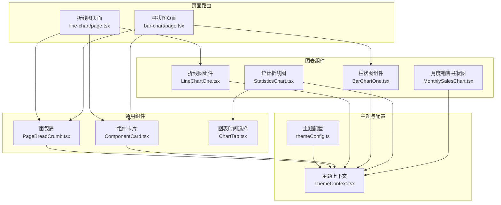
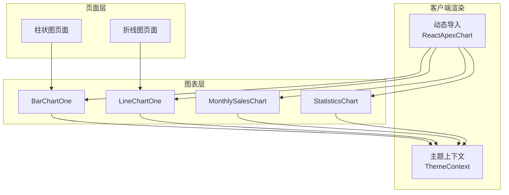
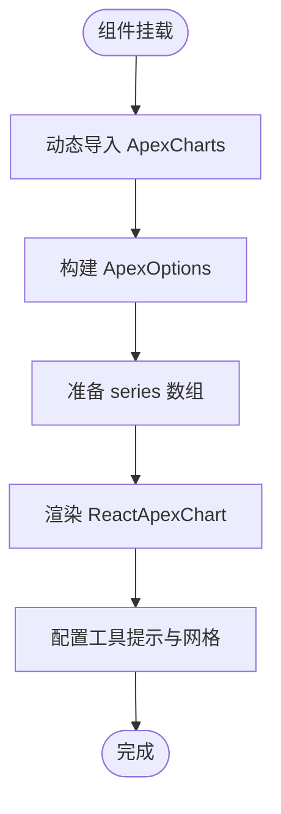
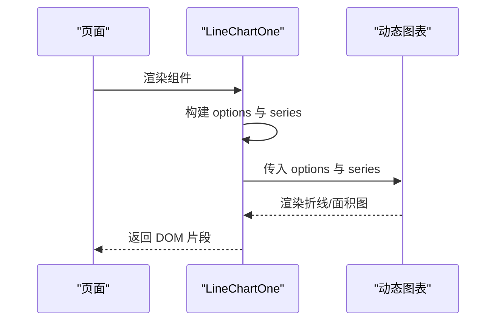
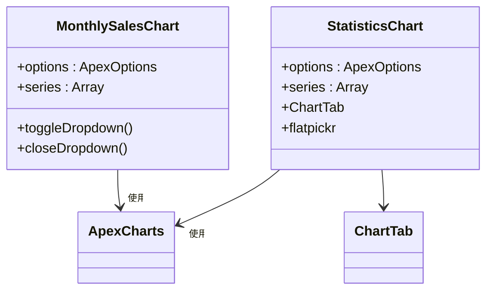
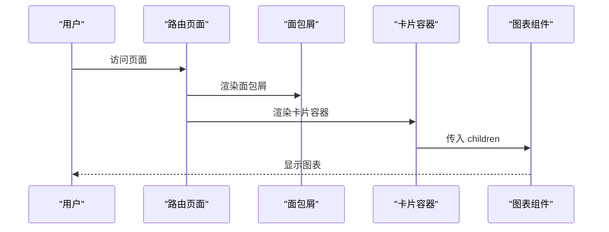
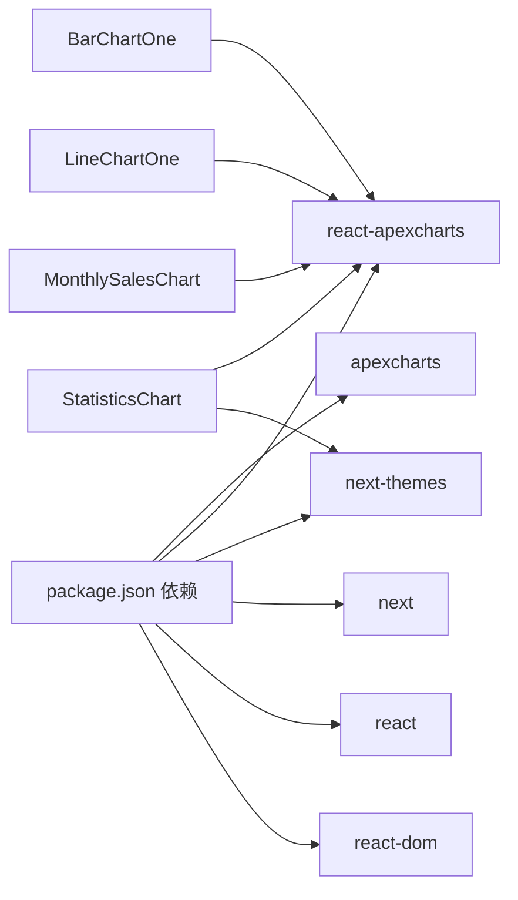

# 数据可视化

<cite>
**本文引用的文件**
- [BarChartOne.tsx](file://src/components/charts/bar/BarChartOne.tsx)
- [LineChartOne.tsx](file://src/components/charts/line/LineChartOne.tsx)
- [MonthlySalesChart.tsx](file://src/components/ecommerce/MonthlySalesChart.tsx)
- [StatisticsChart.tsx](file://src/components/ecommerce/StatisticsChart.tsx)
- [ChartTab.tsx](file://src/components/common/ChartTab.tsx)
- [ComponentCard.tsx](file://src/components/common/ComponentCard.tsx)
- [PageBreadCrumb.tsx](file://src/components/common/PageBreadCrumb.tsx)
- [bar-chart/page.tsx](file://src/app/(admin)/(others-pages)/(chart)/bar-chart/page.tsx)
- [line-chart/page.tsx](file://src/app/(admin)/(others-pages)/(chart)/line-chart/page.tsx)
- [ThemeContext.tsx](file://src/context/ThemeContext.tsx)
- [themeConfig.ts](file://src/config/themeConfig.ts)
- [package.json](file://package.json)
</cite>

## 目录
1. [简介](#简介)
2. [项目结构](#项目结构)
3. [核心组件](#核心组件)
4. [架构总览](#架构总览)
5. [详细组件分析](#详细组件分析)
6. [依赖关系分析](#依赖关系分析)
7. [性能考量](#性能考量)
8. [故障排查指南](#故障排查指南)
9. [结论](#结论)
10. [附录](#附录)

## 简介
本文件为基于 Next.js 与 ApexCharts 的数据可视化系统综合文档。内容覆盖柱状图、折线图（含面积图）等图表类型实现、数据格式与配置项说明、交互与响应式设计、主题适配机制，并提供开发最佳实践与性能优化建议，帮助开发者快速添加与定制图表。

## 项目结构
该可视化子系统采用按功能分层组织：页面路由负责导航与面包屑展示；图表组件封装 ApexCharts 配置与数据；通用卡片与标签页组件用于页面布局与时间粒度切换；主题上下文提供明暗主题切换与持久化。

**图表来源**
- [bar-chart/page.tsx](file://src/app/(admin)/(others-pages)/(chart)/bar-chart/page.tsx#L1-L25)
- [line-chart/page.tsx](file://src/app/(admin)/(others-pages)/(chart)/line-chart/page.tsx#L1-L24)
- [ComponentCard.tsx:1-41](file://src/components/common/ComponentCard.tsx#L1-L41)
- [PageBreadCrumb.tsx:1-53](file://src/components/common/PageBreadCrumb.tsx#L1-L53)
- [ChartTab.tsx:1-46](file://src/components/common/ChartTab.tsx#L1-L46)
- [BarChartOne.tsx:1-111](file://src/components/charts/bar/BarChartOne.tsx#L1-L111)
- [LineChartOne.tsx:1-134](file://src/components/charts/line/LineChartOne.tsx#L1-L134)
- [MonthlySalesChart.tsx:1-155](file://src/components/ecommerce/MonthlySalesChart.tsx#L1-L155)
- [StatisticsChart.tsx:1-180](file://src/components/ecommerce/StatisticsChart.tsx#L1-L180)
- [ThemeContext.tsx:1-59](file://src/context/ThemeContext.tsx#L1-L59)
- [themeConfig.ts:1-31](file://src/config/themeConfig.ts#L1-L31)

**章节来源**
- [bar-chart/page.tsx](file://src/app/(admin)/(others-pages)/(chart)/bar-chart/page.tsx#L1-L25)
- [line-chart/page.tsx](file://src/app/(admin)/(others-pages)/(chart)/line-chart/page.tsx#L1-L24)

## 核心组件
- 柱状图组件：BarChartOne.tsx 封装了单系列柱状图的配置与数据，支持横向柱状图、圆角列宽、透明描边、网格与工具提示等。
- 折线图组件：LineChartOne.tsx 展示双系列折线与面积填充，支持直线样式的线条、渐变填充、无标记点、Y 轴网格与日期格式化工具提示。
- 电商图表组合：MonthlySalesChart.tsx 提供带下拉菜单的柱状图；StatisticsChart.tsx 提供带日期范围选择器与时间粒度切换的面积图。
- 页面容器：ComponentCard.tsx 与 PageBreadCrumb.tsx 提供统一的卡片布局与面包屑导航。
- 时间选择：ChartTab.tsx 提供“月/季度/年”三选一的交互按钮组。

**章节来源**
- [BarChartOne.tsx:12-111](file://src/components/charts/bar/BarChartOne.tsx#L12-L111)
- [LineChartOne.tsx:12-134](file://src/components/charts/line/LineChartOne.tsx#L12-L134)
- [MonthlySalesChart.tsx:14-155](file://src/components/ecommerce/MonthlySalesChart.tsx#L14-L155)
- [StatisticsChart.tsx:11-180](file://src/components/ecommerce/StatisticsChart.tsx#L11-L180)
- [ComponentCard.tsx:10-41](file://src/components/common/ComponentCard.tsx#L10-L41)
- [PageBreadCrumb.tsx:8-53](file://src/components/common/PageBreadCrumb.tsx#L8-L53)
- [ChartTab.tsx:3-46](file://src/components/common/ChartTab.tsx#L3-L46)

## 架构总览
系统采用“页面路由 -> 组件卡片 -> 图表组件”的层次化结构，动态导入 ApexCharts 以避免 SSR 渲染问题。主题通过上下文在客户端初始化并持久化到本地存储，自动切换 HTML 根元素的明暗类名。

**图表来源**
- [BarChartOne.tsx:8-10](file://src/components/charts/bar/BarChartOne.tsx#L8-L10)
- [LineChartOne.tsx:8-10](file://src/components/charts/line/LineChartOne.tsx#L8-L10)
- [MonthlySalesChart.tsx:10-12](file://src/components/ecommerce/MonthlySalesChart.tsx#L10-L12)
- [StatisticsChart.tsx:9-9](file://src/components/ecommerce/StatisticsChart.tsx#L9-L9)
- [ThemeContext.tsx:18-39](file://src/context/ThemeContext.tsx#L18-L39)

## 详细组件分析

### 柱状图组件 BarChartOne 分析
- 动态导入与 SSR 禁用：通过动态导入避免服务端渲染时的浏览器 API 缺失。
- 配置要点：颜色、字体族、图表尺寸、是否显示工具栏、柱形参数（水平方向、列宽、圆角）、描边、坐标轴（隐藏刻度与边框、分类轴）、图例位置、网格、填充透明度、工具提示（关闭 X 值显示，Y 值格式化）。
- 数据结构：series 为数组对象，每个对象包含名称与数值数组；categories 为字符串数组，对应 X 轴类别。
- 容器与滚动：外层容器支持横向滚动与最小宽度约束，确保小屏设备可完整查看。

**图表来源**
- [BarChartOne.tsx:8-10](file://src/components/charts/bar/BarChartOne.tsx#L8-L10)
- [BarChartOne.tsx:13-91](file://src/components/charts/bar/BarChartOne.tsx#L13-L91)
- [BarChartOne.tsx:92-97](file://src/components/charts/bar/BarChartOne.tsx#L92-L97)
- [BarChartOne.tsx:98-110](file://src/components/charts/bar/BarChartOne.tsx#L98-L110)

**章节来源**
- [BarChartOne.tsx:12-111](file://src/components/charts/bar/BarChartOne.tsx#L12-L111)

### 折线图组件 LineChartOne 分析
- 类型与样式：设置为折线图，使用渐变填充与无标记点；线条宽度与曲线样式可配置。
- 坐标轴：X 轴为分类轴，Y 轴标签样式与标题样式可调；网格仅显示 Y 轴。
- 工具提示：启用工具提示，X 轴值按日期格式化；关闭 X 轴点的提示。
- 数据结构：series 为多系列数组，每系列包含名称与数值数组。

**图表来源**
- [LineChartOne.tsx:8-10](file://src/components/charts/line/LineChartOne.tsx#L8-L10)
- [LineChartOne.tsx:13-109](file://src/components/charts/line/LineChartOne.tsx#L13-L109)
- [LineChartOne.tsx:111-120](file://src/components/charts/line/LineChartOne.tsx#L111-L120)
- [LineChartOne.tsx:121-133](file://src/components/charts/line/LineChartOne.tsx#L121-L133)

**章节来源**
- [LineChartOne.tsx:12-134](file://src/components/charts/line/LineChartOne.tsx#L12-L134)

### 电商图表组合分析
- MonthlySalesChart：在柱状图基础上增加右上角下拉菜单，支持更多操作入口；容器内嵌有最小宽度与滚动控制。
- StatisticsChart：集成 ChartTab 与日期范围选择器（flatpickr），默认显示近七日范围；支持“月/季度/年”切换；使用动态导入的 Chart 组件渲染面积图。

**图表来源**
- [MonthlySalesChart.tsx:10-12](file://src/components/ecommerce/MonthlySalesChart.tsx#L10-L12)
- [MonthlySalesChart.tsx:15-93](file://src/components/ecommerce/MonthlySalesChart.tsx#L15-L93)
- [MonthlySalesChart.tsx:94-99](file://src/components/ecommerce/MonthlySalesChart.tsx#L94-L99)
- [MonthlySalesChart.tsx:110-155](file://src/components/ecommerce/MonthlySalesChart.tsx#L110-L155)
- [StatisticsChart.tsx:9-9](file://src/components/ecommerce/StatisticsChart.tsx#L9-L9)
- [StatisticsChart.tsx:41-137](file://src/components/ecommerce/StatisticsChart.tsx#L41-L137)
- [StatisticsChart.tsx:139-148](file://src/components/ecommerce/StatisticsChart.tsx#L139-L148)
- [ChartTab.tsx:3-46](file://src/components/common/ChartTab.tsx#L3-L46)

**章节来源**
- [MonthlySalesChart.tsx:14-155](file://src/components/ecommerce/MonthlySalesChart.tsx#L14-L155)
- [StatisticsChart.tsx:11-180](file://src/components/ecommerce/StatisticsChart.tsx#L11-L180)
- [ChartTab.tsx:3-46](file://src/components/common/ChartTab.tsx#L3-L46)

### 页面路由与容器组件
- 页面路由：分别引入对应的图表组件并包裹在 ComponentCard 中，使用 PageBreadCrumb 提供面包屑导航。
- 容器组件：ComponentCard 提供卡片头部标题与描述区域，以及主体内容区的间距与分隔线。

**图表来源**
- [bar-chart/page.tsx](file://src/app/(admin)/(others-pages)/(chart)/bar-chart/page.tsx#L1-L25)
- [line-chart/page.tsx](file://src/app/(admin)/(others-pages)/(chart)/line-chart/page.tsx#L1-L24)
- [PageBreadCrumb.tsx:8-53](file://src/components/common/PageBreadCrumb.tsx#L8-L53)
- [ComponentCard.tsx:10-41](file://src/components/common/ComponentCard.tsx#L10-L41)

**章节来源**
- [bar-chart/page.tsx](file://src/app/(admin)/(others-pages)/(chart)/bar-chart/page.tsx#L13-L24)
- [line-chart/page.tsx](file://src/app/(admin)/(others-pages)/(chart)/line-chart/page.tsx#L12-L23)
- [ComponentCard.tsx:10-41](file://src/components/common/ComponentCard.tsx#L10-L41)
- [PageBreadCrumb.tsx:8-53](file://src/components/common/PageBreadCrumb.tsx#L8-L53)

## 依赖关系分析
- 图表库依赖：apexcharts 与 react-apexcharts 在 package.json 中声明。
- 主题与 UI：next-themes 用于主题切换；Tailwind CSS 提供样式基础；图标与 UI 组件来自内部图标与 UI 包。
- 动态导入：所有图表组件均通过 next/dynamic 动态导入，避免 SSR 期间的浏览器 API 缺失。

**图表来源**
- [package.json:27-39](file://package.json#L27-L39)
- [BarChartOne.tsx:8-10](file://src/components/charts/bar/BarChartOne.tsx#L8-L10)
- [LineChartOne.tsx:8-10](file://src/components/charts/line/LineChartOne.tsx#L8-L10)
- [MonthlySalesChart.tsx:10-12](file://src/components/ecommerce/MonthlySalesChart.tsx#L10-L12)
- [StatisticsChart.tsx:9-9](file://src/components/ecommerce/StatisticsChart.tsx#L9-L9)

**章节来源**
- [package.json:15-49](file://package.json#L15-L49)

## 性能考量
- 动态导入：通过动态导入减少首屏 JS 体积，避免 SSR 渲染问题，提升首屏加载速度。
- 数据规模：series 与 categories 的长度直接影响渲染性能；建议对大数据集进行采样或分页展示。
- 工具提示与网格：禁用不必要的提示与网格可降低重绘开销；仅在需要时启用。
- 容器滚动：为长图表设置最小宽度与横向滚动，避免布局抖动与强制换行导致的重排。
- 主题切换：主题切换通过根元素类名切换，避免全量重绘；建议缓存主题状态于本地存储。

[本节为通用指导，无需特定文件引用]

## 故障排查指南
- 图表不显示或空白
  - 确认已使用动态导入且 ssr: false。
  - 检查容器是否存在最小宽度与横向滚动，确保图表可完整渲染。
  - 参考：[BarChartOne.tsx:8-10](file://src/components/charts/bar/BarChartOne.tsx#L8-L10)、[LineChartOne.tsx:8-10](file://src/components/charts/line/LineChartOne.tsx#L8-L10)、[MonthlySalesChart.tsx:10-12](file://src/components/ecommerce/MonthlySalesChart.tsx#L10-L12)、[StatisticsChart.tsx:9-9](file://src/components/ecommerce/StatisticsChart.tsx#L9-L9)
- 工具提示异常
  - 若需显示 X 轴日期，请启用 x.format 并确认 X 轴类型与数据格式匹配。
  - 参考：[LineChartOne.tsx:63-68](file://src/components/charts/line/LineChartOne.tsx#L63-L68)、[StatisticsChart.tsx:91-96](file://src/components/ecommerce/StatisticsChart.tsx#L91-L96)
- 明暗主题不生效
  - 确认 ThemeContext 已在应用根部提供，且本地存储存在主题键。
  - 参考：[ThemeContext.tsx:18-39](file://src/context/ThemeContext.tsx#L18-L39)
- 响应式显示不理想
  - 为图表容器设置合适的最小宽度与横向滚动，避免内容被截断。
  - 参考：[MonthlySalesChart.tsx:142-151](file://src/components/ecommerce/MonthlySalesChart.tsx#L142-L151)、[StatisticsChart.tsx:173-177](file://src/components/ecommerce/StatisticsChart.tsx#L173-L177)

**章节来源**
- [BarChartOne.tsx:8-10](file://src/components/charts/bar/BarChartOne.tsx#L8-L10)
- [LineChartOne.tsx:63-68](file://src/components/charts/line/LineChartOne.tsx#L63-L68)
- [StatisticsChart.tsx:91-96](file://src/components/ecommerce/StatisticsChart.tsx#L91-L96)
- [ThemeContext.tsx:18-39](file://src/context/ThemeContext.tsx#L18-L39)
- [MonthlySalesChart.tsx:142-151](file://src/components/ecommerce/MonthlySalesChart.tsx#L142-L151)
- [StatisticsChart.tsx:173-177](file://src/components/ecommerce/StatisticsChart.tsx#L173-L177)

## 结论
本系统以模块化方式组织图表组件，结合动态导入与主题上下文，实现了可扩展、可定制的数据可视化方案。通过统一的配置接口与容器组件，开发者可以快速集成柱状图、折线图与面积图，并根据业务需求灵活调整样式、交互与数据格式。

[本节为总结性内容，无需特定文件引用]

## 附录

### 图表类型与配置速查
- 柱状图
  - 关键配置：colors、chart.type=bar、plotOptions.bar.columnWidth、plotOptions.bar.borderRadius、stroke、xaxis.categories、yaxis.grid、tooltip.y.formatter
  - 数据格式：series 为数组，每项包含 name 与 data（数值数组）
  - 参考：[BarChartOne.tsx:13-91](file://src/components/charts/bar/BarChartOne.tsx#L13-L91)、[MonthlySalesChart.tsx:15-93](file://src/components/ecommerce/MonthlySalesChart.tsx#L15-L93)
- 折线图/面积图
  - 关键配置：chart.type=line 或 area、stroke.curve、fill.gradient、markers.size、grid.yaxis.lines、tooltip.enabled/x.format、xaxis.type/category
  - 数据格式：series 多项，每项包含 name 与 data
  - 参考：[LineChartOne.tsx:13-109](file://src/components/charts/line/LineChartOne.tsx#L13-L109)、[StatisticsChart.tsx:41-137](file://src/components/ecommerce/StatisticsChart.tsx#L41-L137)

### 主题与样式
- 主题上下文：提供明/暗主题切换与本地存储持久化。
- 主题配置：集中定义侧边栏、头部、间距与品牌色。
- 参考：[ThemeContext.tsx:18-39](file://src/context/ThemeContext.tsx#L18-L39)、[themeConfig.ts:4-30](file://src/config/themeConfig.ts#L4-L30)

### 页面与容器
- 页面路由：分别承载不同图表示例，使用面包屑与卡片容器。
- 参考：[bar-chart/page.tsx](file://src/app/(admin)/(others-pages)/(chart)/bar-chart/page.tsx#L1-L25)、[line-chart/page.tsx](file://src/app/(admin)/(others-pages)/(chart)/line-chart/page.tsx#L1-L24)、[ComponentCard.tsx:10-41](file://src/components/common/ComponentCard.tsx#L10-L41)、[PageBreadCrumb.tsx:8-53](file://src/components/common/PageBreadCrumb.tsx#L8-L53)