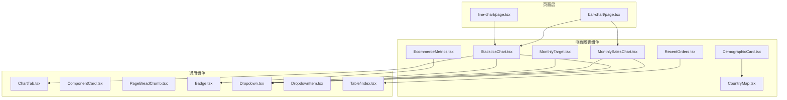
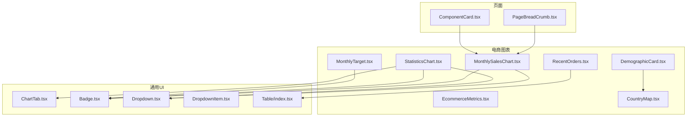
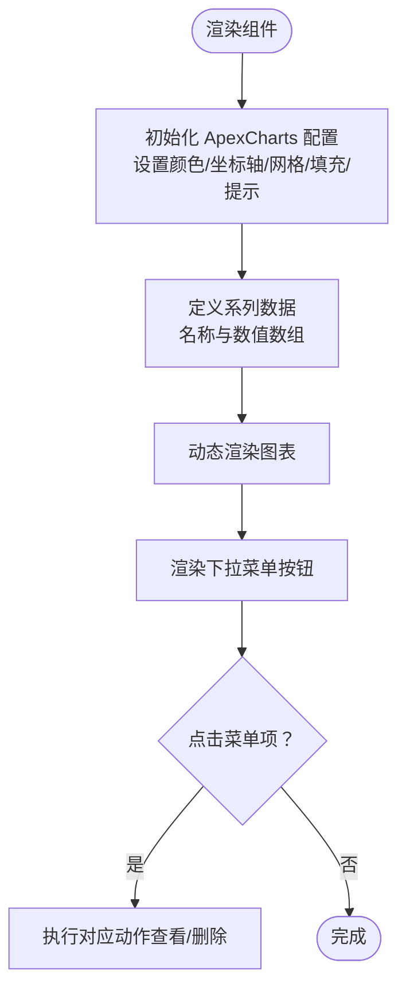
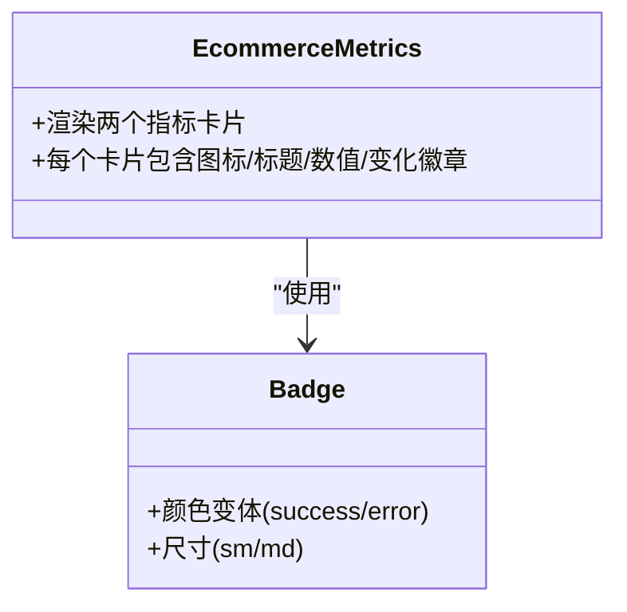
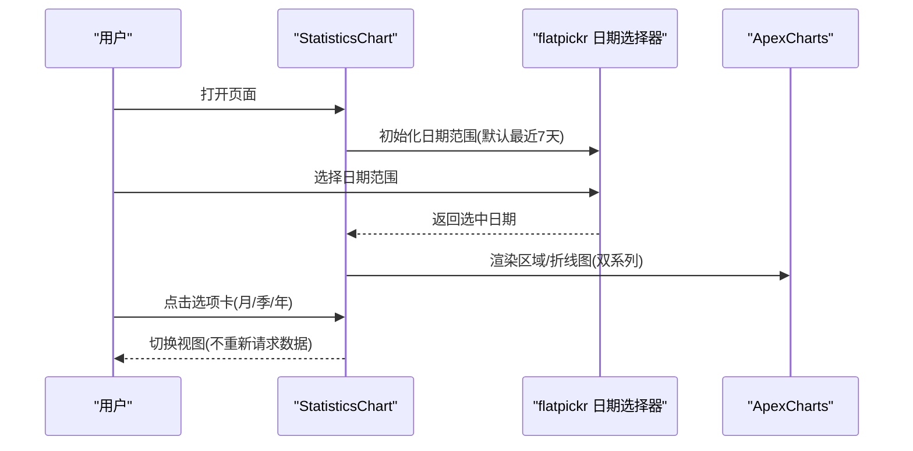
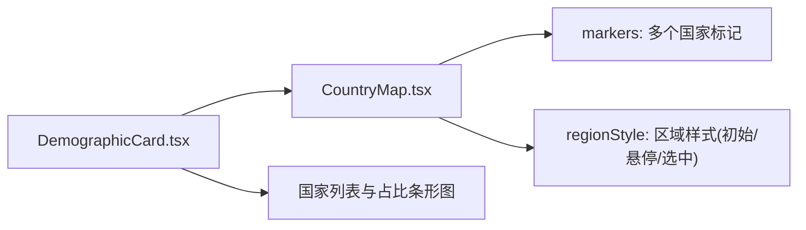
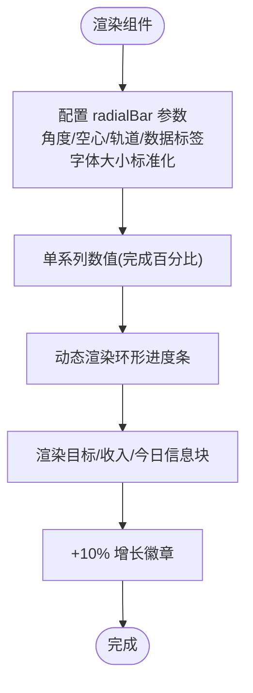
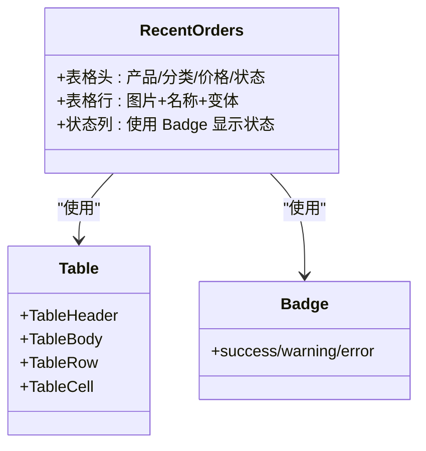
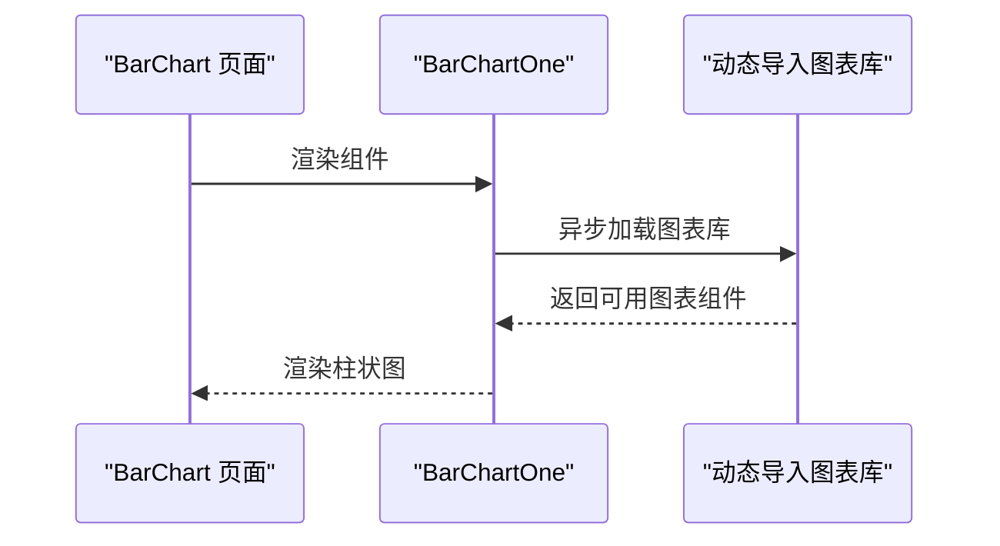
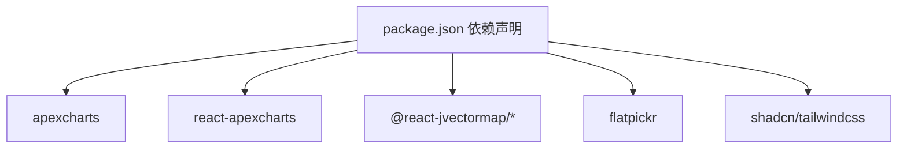

# 电商图表

<cite>
**本文引用的文件**
- [src/components/charts/bar/BarChartOne.tsx](file://src/components/charts/bar/BarChartOne.tsx)
- [src/components/charts/line/LineChartOne.tsx](file://src/components/charts/line/LineChartOne.tsx)
- [src/components/ecommerce/MonthlySalesChart.tsx](file://src/components/ecommerce/MonthlySalesChart.tsx)
- [src/components/ecommerce/EcommerceMetrics.tsx](file://src/components/ecommerce/EcommerceMetrics.tsx)
- [src/components/ecommerce/StatisticsChart.tsx](file://src/components/ecommerce/StatisticsChart.tsx)
- [src/components/ecommerce/CountryMap.tsx](file://src/components/ecommerce/CountryMap.tsx)
- [src/components/ecommerce/DemographicCard.tsx](file://src/components/ecommerce/DemographicCard.tsx)
- [src/components/ecommerce/MonthlyTarget.tsx](file://src/components/ecommerce/MonthlyTarget.tsx)
- [src/components/ecommerce/RecentOrders.tsx](file://src/components/ecommerce/RecentOrders.tsx)
- [src/components/common/ChartTab.tsx](file://src/components/common/ChartTab.tsx)
- [src/components/common/PageBreadCrumb.tsx](file://src/components/common/PageBreadCrumb.tsx)
- [src/components/common/ComponentCard.tsx](file://src/components/common/ComponentCard.tsx)
- [src/app/(admin)/(others-pages)/(chart)/bar-chart/page.tsx](file://src/app/(admin)/(others-pages)/(chart)/bar-chart/page.tsx)
- [src/app/(admin)/(others-pages)/(chart)/line-chart/page.tsx](file://src/app/(admin)/(others-pages)/(chart)/line-chart/page.tsx)
- [src/components/ui/badge/Badge.tsx](file://src/components/ui/badge/Badge.tsx)
- [src/components/ui/dropdown/Dropdown.tsx](file://src/components/ui/dropdown/Dropdown.tsx)
- [src/components/ui/dropdown/DropdownItem.tsx](file://src/components/ui/dropdown/DropdownItem.tsx)
- [src/components/ui/table/index.tsx](file://src/components/ui/table/index.tsx)
- [src/app/globals.css](file://src/app/globals.css)
- [package.json](file://package.json)
- [README.md](file://README.md)
</cite>

## 更新摘要
**变更内容**
- 更新了 DemographicCard 和 MonthlyTarget 组件的文本大小标准化说明
- 新增了字体大小标准化对进度条标签和百分比指示器的影响分析
- 增强了电商图表组件的可读性和一致性说明

## 目录
1. [简介](#简介)
2. [项目结构](#项目结构)
3. [核心组件](#核心组件)
4. [架构总览](#架构总览)
5. [详细组件分析](#详细组件分析)
6. [依赖分析](#依赖分析)
7. [性能考虑](#性能考虑)
8. [故障排查指南](#故障排查指南)
9. [结论](#结论)
10. [附录](#附录)

## 简介
本文件聚焦于电商相关的图表与指标展示组件，系统性梳理了以下能力：
- 电商指标统计图表：用于展示客户数、订单量等关键指标及其变化趋势
- 月度销售图表：以柱状图呈现月度销售数据，并支持下拉菜单操作
- 电商指标展示：以卡片形式展示核心 KPI 指标及占比
- 统计图表：支持时间范围选择（日历控件）与多系列对比（销量/收入）
- 地图可视化：基于世界地图标注国家客户分布
- 最近订单表格：展示订单状态与商品信息
- 布局与导航：面包屑、卡片容器、选项卡等通用 UI 组件

这些组件统一使用动态加载机制引入图表库，确保在客户端渲染时正常工作；同时通过 Tailwind CSS 实现主题适配与响应式布局。

**更新** 文档现已包含文本大小标准化改进的详细说明，特别是针对 DemographicCard 和 MonthlyTarget 组件的字体大小统一化。

## 项目结构
电商图表相关组件主要分布在以下位置：
- 图表基础组件：src/components/charts/bar、src/components/charts/line
- 电商专用组件：src/components/ecommerce
- 页面入口：src/app/(admin)/(others-pages)/(chart)/bar-chart、src/app/(admin)/(others-pages)/(chart)/line-chart
- 通用 UI 组件：src/components/common、src/components/ui

**图表来源**
- [src/app/(admin)/(others-pages)/(chart)/bar-chart/page.tsx](file://src/app/(admin)/(others-pages)/(chart)/bar-chart/page.tsx#L1-L25)
- [src/app/(admin)/(others-pages)/(chart)/line-chart/page.tsx](file://src/app/(admin)/(others-pages)/(chart)/line-chart/page.tsx#L1-L24)

**章节来源**
- [src/app/(admin)/(others-pages)/(chart)/bar-chart/page.tsx](file://src/app/(admin)/(others-pages)/(chart)/bar-chart/page.tsx#L1-L25)
- [src/app/(admin)/(others-pages)/(chart)/line-chart/page.tsx](file://src/app/(admin)/(others-pages)/(chart)/line-chart/page.tsx#L1-L24)

## 核心组件
- 月度销售图表：基于 ApexCharts 的柱状图，展示月度销售数据，支持下拉菜单操作
- 电商指标：展示客户数与订单数及其变化百分比
- 统计图表：区域/折线图，支持时间范围选择器与多系列对比
- 国家地图：基于世界地图标注客户分布
- 仪表目标：环形进度条展示月度目标完成率，包含标准化的文本大小
- 最近订单：表格展示订单状态与商品信息
- 通用 UI：徽章、下拉菜单、选项卡、表格等

**更新** 仪表目标组件现已包含标准化的字体大小配置，确保百分比指示器和进度条标签的一致性。

**章节来源**
- [src/components/ecommerce/MonthlySalesChart.tsx:1-155](file://src/components/ecommerce/MonthlySalesChart.tsx#L1-L155)
- [src/components/ecommerce/EcommerceMetrics.tsx:1-57](file://src/components/ecommerce/EcommerceMetrics.tsx#L1-L57)
- [src/components/ecommerce/StatisticsChart.tsx:1-180](file://src/components/ecommerce/StatisticsChart.tsx#L1-L180)
- [src/components/ecommerce/CountryMap.tsx:1-124](file://src/components/ecommerce/CountryMap.tsx#L1-L124)
- [src/components/ecommerce/MonthlyTarget.tsx:1-210](file://src/components/ecommerce/MonthlyTarget.tsx#L1-L210)
- [src/components/ecommerce/RecentOrders.tsx:1-212](file://src/components/ecommerce/RecentOrders.tsx#L1-L212)
- [src/components/ui/badge/Badge.tsx:1-80](file://src/components/ui/badge/Badge.tsx#L1-L80)
- [src/components/ui/dropdown/Dropdown.tsx:1-49](file://src/components/ui/dropdown/Dropdown.tsx#L1-L49)
- [src/components/common/ChartTab.tsx:1-46](file://src/components/common/ChartTab.tsx#L1-L46)
- [src/components/ui/table/index.tsx](file://src/components/ui/table/index.tsx)

## 架构总览
整体采用"页面入口 -> 组件组合 -> 动态图表"的架构模式：
- 页面入口负责标题元数据与容器布局
- 电商组件封装图表与交互（下拉菜单、日期选择）
- 通用 UI 组件提供复用能力（徽章、下拉、表格）
- 图表库通过动态导入避免 SSR 渲染问题

**图表来源**
- [src/components/common/PageBreadCrumb.tsx](file://src/components/common/PageBreadCrumb.tsx)
- [src/components/common/ComponentCard.tsx](file://src/components/common/ComponentCard.tsx)
- [src/components/ecommerce/MonthlySalesChart.tsx:1-155](file://src/components/ecommerce/MonthlySalesChart.tsx#L1-L155)
- [src/components/ecommerce/StatisticsChart.tsx:1-180](file://src/components/ecommerce/StatisticsChart.tsx#L1-L180)
- [src/components/ecommerce/DemographicCard.tsx:1-132](file://src/components/ecommerce/DemographicCard.tsx#L1-L132)
- [src/components/ecommerce/RecentOrders.tsx:1-212](file://src/components/ecommerce/RecentOrders.tsx#L1-L212)
- [src/components/common/ChartTab.tsx:1-46](file://src/components/common/ChartTab.tsx#L1-L46)
- [src/components/ui/badge/Badge.tsx:1-80](file://src/components/ui/badge/Badge.tsx#L1-L80)
- [src/components/ui/dropdown/Dropdown.tsx:1-49](file://src/components/ui/dropdown/Dropdown.tsx#L1-L49)
- [src/components/ui/dropdown/DropdownItem.tsx](file://src/components/ui/dropdown/DropdownItem.tsx)
- [src/components/ui/table/index.tsx](file://src/components/ui/table/index.tsx)

## 详细组件分析

### 月度销售图表（MonthlySalesChart）
- 数据来源：硬编码的月度销售数据数组
- 展示策略：柱状图，禁用工具提示 X 轴标签，启用 Y 轴数值格式化
- 交互：右上角三点菜单，支持"查看更多/删除"等操作
- 容器：卡片边框与内边距，支持暗色主题

**图表来源**
- [src/components/ecommerce/MonthlySalesChart.tsx:1-155](file://src/components/ecommerce/MonthlySalesChart.tsx#L1-L155)

**章节来源**
- [src/components/ecommerce/MonthlySalesChart.tsx:1-155](file://src/components/ecommerce/MonthlySalesChart.tsx#L1-L155)

### 电商指标（EcommerceMetrics）
- 指标类型：客户数、订单数
- 变化展示：使用徽章显示增减百分比与方向图标
- 布局：两列网格，卡片内含图标、数值与变化徽章

**图表来源**
- [src/components/ecommerce/EcommerceMetrics.tsx:1-57](file://src/components/ecommerce/EcommerceMetrics.tsx#L1-L57)
- [src/components/ui/badge/Badge.tsx:1-80](file://src/components/ui/badge/Badge.tsx#L1-L80)

**章节来源**
- [src/components/ecommerce/EcommerceMetrics.tsx:1-57](file://src/components/ecommerce/EcommerceMetrics.tsx#L1-L57)
- [src/components/ui/badge/Badge.tsx:1-80](file://src/components/ui/badge/Badge.tsx#L1-L80)

### 统计图表（StatisticsChart）
- 时间选择：集成 flatpickr 日期范围选择器，默认七天区间
- 图表类型：区域/折线图，双系列（销量/收入），渐变填充
- 交互：顶部选项卡切换"月度/季度/年度"，右侧日历选择器
- 响应式：容器宽度自适应，滚动条处理横向溢出

**图表来源**
- [src/components/ecommerce/StatisticsChart.tsx:1-180](file://src/components/ecommerce/StatisticsChart.tsx#L1-L180)
- [src/components/common/ChartTab.tsx:1-46](file://src/components/common/ChartTab.tsx#L1-L46)

**章节来源**
- [src/components/ecommerce/StatisticsChart.tsx:1-180](file://src/components/ecommerce/StatisticsChart.tsx#L1-L180)
- [src/components/common/ChartTab.tsx:1-46](file://src/components/common/ChartTab.tsx#L1-L46)

### 国家地图与人口统计（CountryMap + DemographicCard）
- 地图：使用 @react-jvectormap/world 的世界地图，支持缩放与标记
- 标记：按经纬度标注国家，支持悬停与选中样式
- 人口统计：卡片内展示国家客户数量与占比条形图

**更新** DemographicCard 组件现已采用标准化的文本大小系统，确保标题、描述、百分比标签等元素在不同屏幕尺寸下保持一致的视觉层次。

**图表来源**
- [src/components/ecommerce/DemographicCard.tsx:1-132](file://src/components/ecommerce/DemographicCard.tsx#L1-L132)
- [src/components/ecommerce/CountryMap.tsx:1-124](file://src/components/ecommerce/CountryMap.tsx#L1-L124)

**章节来源**
- [src/components/ecommerce/DemographicCard.tsx:1-132](file://src/components/ecommerce/DemographicCard.tsx#L1-L132)
- [src/components/ecommerce/CountryMap.tsx:1-124](file://src/components/ecommerce/CountryMap.tsx#L1-L124)

### 仪表目标（MonthlyTarget）
- 图表类型：环形进度条（radialBar），起始角度与结束角度控制弧形范围
- 进度展示：中心显示百分比数值，附加"+10%"徽章
- 信息面板：展示目标金额、收入与今日金额
- 字体大小：采用标准化的字体大小配置，确保百分比指示器清晰易读

**更新** MonthlyTarget 组件的字体大小配置已标准化，包括百分比数值（36px）、标签文本（14px）和辅助信息（12px），确保在不同设备上的最佳可读性。

**图表来源**
- [src/components/ecommerce/MonthlyTarget.tsx:1-210](file://src/components/ecommerce/MonthlyTarget.tsx#L1-L210)

**章节来源**
- [src/components/ecommerce/MonthlyTarget.tsx:1-210](file://src/components/ecommerce/MonthlyTarget.tsx#L1-L210)

### 最近订单（RecentOrders）
- 表格：展示产品图片、名称、价格、分类与状态
- 状态徽章：根据状态（已送达/进行中/已取消）显示不同颜色
- 交互：筛选与"查看全部"按钮

**图表来源**
- [src/components/ecommerce/RecentOrders.tsx:1-212](file://src/components/ecommerce/RecentOrders.tsx#L1-L212)
- [src/components/ui/table/index.tsx](file://src/components/ui/table/index.tsx)
- [src/components/ui/badge/Badge.tsx:1-80](file://src/components/ui/badge/Badge.tsx#L1-L80)

**章节来源**
- [src/components/ecommerce/RecentOrders.tsx:1-212](file://src/components/ecommerce/RecentOrders.tsx#L1-L212)
- [src/components/ui/table/index.tsx](file://src/components/ui/table/index.tsx)
- [src/components/ui/badge/Badge.tsx:1-80](file://src/components/ui/badge/Badge.tsx#L1-L80)

### 基础图表组件（BarChartOne / LineChartOne）
- BarChartOne：单系列柱状图，固定月份类目与数值
- LineChartOne：双系列折线/区域图，带渐变填充与网格

**图表来源**
- [src/components/charts/bar/BarChartOne.tsx:1-111](file://src/components/charts/bar/BarChartOne.tsx#L1-L111)
- [src/components/charts/line/LineChartOne.tsx:1-134](file://src/components/charts/line/LineChartOne.tsx#L1-L134)

**章节来源**
- [src/components/charts/bar/BarChartOne.tsx:1-111](file://src/components/charts/bar/BarChartOne.tsx#L1-L111)
- [src/components/charts/line/LineChartOne.tsx:1-134](file://src/components/charts/line/LineChartOne.tsx#L1-L134)

## 依赖分析
- 图表库：apexcharts、react-apexcharts
- 地图库：@react-jvectormap/core、@react-jvectormap/world
- 日期选择：flatpickr
- UI 组件：shadcn、tailwindcss v4
- 动态导入：next/dynamic 用于避免 SSR 渲染问题

**图表来源**
- [package.json:15-49](file://package.json#L15-L49)

**章节来源**
- [package.json:15-49](file://package.json#L15-L49)
- [README.md:110-167](file://README.md#L110-L167)

## 性能考虑
- 动态导入：所有图表组件均通过动态导入，减少首屏包体积，提升 SSR 友好性
- 横向滚动：图表容器使用滚动条处理超宽内容，避免布局抖动
- 选项卡切换：统计图表的"月/季/年"切换为前端状态切换，无需重新请求数据
- 地图渲染：矢量地图仅在需要时渲染，避免不必要的重绘
- 徽章与下拉：轻量级 UI 组件，尽量复用现有样式类，减少额外样式注入
- **字体大小标准化**：通过全局 CSS 变量统一管理字体大小，确保组件间的一致性

**更新** 新增字体大小标准化的性能考虑，通过全局变量管理字体大小，减少重复定义并提高维护效率。

## 故障排查指南
- 图表不显示或空白
  - 检查动态导入是否成功，确认运行环境为浏览器端
  - 确认容器高度与最小宽度设置合理，避免被裁剪
- 下拉菜单无法关闭
  - 检查点击外部关闭逻辑是否绑定到 document
  - 确保事件监听在组件卸载时正确移除
- 日期选择器异常
  - 确认 flatpickr 初始化只在客户端执行
  - 检查默认日期范围与格式是否匹配
- 地图渲染错误
  - 确认 @react-jvectormap 的版本与 React 兼容
  - 检查 markers 与经纬度数据格式
- **字体大小显示异常**
  - 检查全局 CSS 变量 `--text-theme-sm` 和 `--text-theme-xs` 是否正确配置
  - 确认组件中使用的 `text-theme-sm` 和 `text-theme-xs` 类名是否正确应用
  - 验证字体大小在不同断点下的表现是否符合预期

**更新** 新增字体大小相关的故障排查指南，帮助开发者快速定位和解决字体显示问题。

**章节来源**
- [src/components/ui/dropdown/Dropdown.tsx:1-49](file://src/components/ui/dropdown/Dropdown.tsx#L1-L49)
- [src/components/ecommerce/StatisticsChart.tsx:14-39](file://src/components/ecommerce/StatisticsChart.tsx#L14-L39)
- [src/components/ecommerce/CountryMap.tsx:1-124](file://src/components/ecommerce/CountryMap.tsx#L1-L124)
- [src/app/globals.css:31-36](file://src/app/globals.css#L31-L36)

## 结论
该电商图表体系以模块化组件为核心，结合 ApexCharts 与地图库，提供了从指标展示、趋势分析到地理分布的完整可视化方案。通过动态导入与通用 UI 组件复用，既保证了性能与可维护性，又满足了电商场景下的多样化展示需求。

**更新** 最新改进包括文本大小标准化，显著提升了组件间的一致性和可读性，特别是在 DemographicCard 和 MonthlyTarget 组件中，确保了进度条标签和百分比指示器的清晰显示。

建议在实际业务中：
- 将数据源抽象为可注入的 props 或 Context，便于替换真实后端接口
- 对图表配置进行集中管理，统一主题与样式
- 在移动端进一步优化滚动与字体大小，提升可读性
- **充分利用字体大小标准化系统**，确保所有组件遵循统一的视觉规范

## 附录
- 页面入口示例：BarChart 页面与 LineChart 页面
- 通用组件：面包屑、卡片容器、徽章、下拉菜单、表格
- **字体大小标准化系统**：通过全局 CSS 变量管理 `--text-theme-sm` (14px) 和 `--text-theme-xs` (12px)，确保组件间字体大小的一致性

**更新** 新增字体大小标准化系统的说明，包括全局变量配置和组件使用方式。

**章节来源**
- [src/app/(admin)/(others-pages)/(chart)/bar-chart/page.tsx](file://src/app/(admin)/(others-pages)/(chart)/bar-chart/page.tsx#L1-L25)
- [src/app/(admin)/(others-pages)/(chart)/line-chart/page.tsx](file://src/app/(admin)/(others-pages)/(chart)/line-chart/page.tsx#L1-L24)
- [src/components/common/PageBreadCrumb.tsx](file://src/components/common/PageBreadCrumb.tsx)
- [src/components/common/ComponentCard.tsx](file://src/components/common/ComponentCard.tsx)
- [src/components/ui/badge/Badge.tsx:1-80](file://src/components/ui/badge/Badge.tsx#L1-L80)
- [src/components/ui/dropdown/Dropdown.tsx:1-49](file://src/components/ui/dropdown/Dropdown.tsx#L1-L49)
- [src/components/ui/dropdown/DropdownItem.tsx](file://src/components/ui/dropdown/DropdownItem.tsx)
- [src/components/ui/table/index.tsx](file://src/components/ui/table/index.tsx)
- [src/app/globals.css:31-36](file://src/app/globals.css#L31-L36)