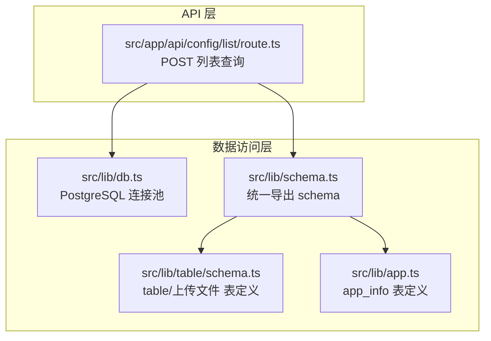
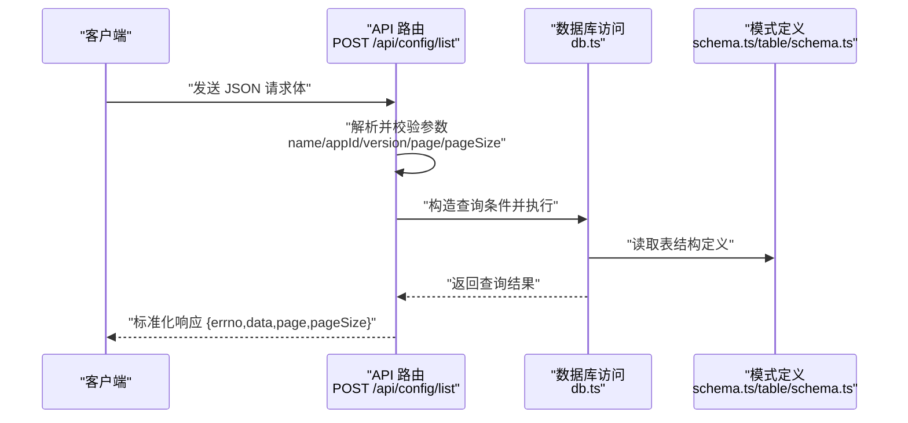
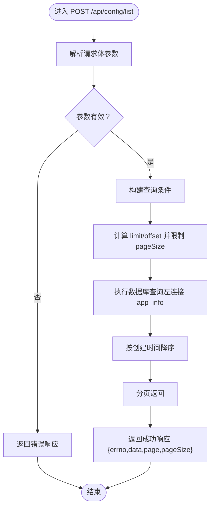
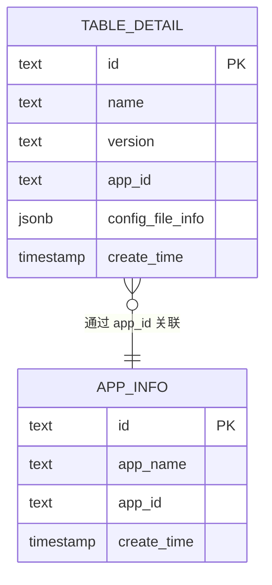
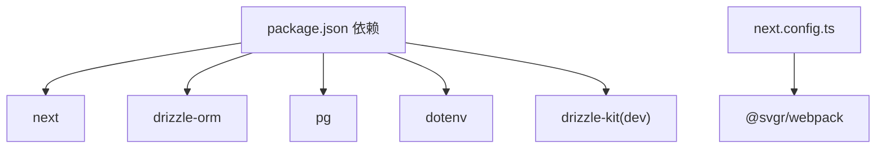

# API 接口设计

<cite>
**本文引用的文件**
- [src/app/api/config/list/route.ts](file://src/app/api/config/list/route.ts)
- [src/lib/db.ts](file://src/lib/db.ts)
- [src/lib/schema.ts](file://src/lib/schema.ts)
- [src/lib/table/schema.ts](file://src/lib/table/schema.ts)
- [src/lib/app.ts](file://src/lib/app.ts)
- [package.json](file://package.json)
- [next.config.ts](file://next.config.ts)
</cite>

## 目录
1. [简介](#简介)
2. [项目结构](#项目结构)
3. [核心组件](#核心组件)
4. [架构总览](#架构总览)
5. [详细组件分析](#详细组件分析)
6. [依赖关系分析](#依赖关系分析)
7. [性能考量](#性能考量)
8. [故障排查指南](#故障排查指南)
9. [结论](#结论)
10. [附录](#附录)

## 简介
本文件面向需要扩展或维护基于 Next.js App Router 的 API 接口的开发者，系统性梳理现有 API 设计与实现，覆盖以下要点：
- 基于 App Router 的 API 路由组织方式与方法支持（GET/POST/PUT/DELETE）
- 请求参数校验与安全处理
- 响应数据格式与错误处理机制
- 分页查询、条件筛选、排序的实现
- 数据访问层（Drizzle ORM + PostgreSQL）与连接池配置
- 安全考虑、性能优化与缓存策略建议
- 可扩展性与最佳实践

## 项目结构
本项目采用 Next.js App Router 的约定式路由，API 路由位于 src/app/api 下，按资源域划分。当前已实现的 API 路由示例为“配置列表”接口，展示完整的 CRUD 场景与数据访问模式。

图表来源
- [src/app/api/config/list/route.ts:1-77](file://src/app/api/config/list/route.ts#L1-L77)
- [src/lib/db.ts:1-19](file://src/lib/db.ts#L1-L19)
- [src/lib/schema.ts:1-24](file://src/lib/schema.ts#L1-L24)
- [src/lib/table/schema.ts:1-26](file://src/lib/table/schema.ts#L1-L26)
- [src/lib/app.ts:1-9](file://src/lib/app.ts#L1-L9)

章节来源
- [src/app/api/config/list/route.ts:1-77](file://src/app/api/config/list/route.ts#L1-L77)
- [src/lib/db.ts:1-19](file://src/lib/db.ts#L1-L19)
- [src/lib/schema.ts:1-24](file://src/lib/schema.ts#L1-L24)
- [src/lib/table/schema.ts:1-26](file://src/lib/table/schema.ts#L1-L26)
- [src/lib/app.ts:1-9](file://src/lib/app.ts#L1-L9)

## 核心组件
- API 路由：负责接收请求、解析参数、执行业务逻辑、返回标准化响应与错误处理。
- 数据库访问：通过 Drizzle ORM 与 PostgreSQL 连接池交互，提供类型安全的查询能力。
- 模式定义：集中管理数据库表结构，统一导出供路由使用。

章节来源
- [src/app/api/config/list/route.ts:1-77](file://src/app/api/config/list/route.ts#L1-L77)
- [src/lib/db.ts:1-19](file://src/lib/db.ts#L1-L19)
- [src/lib/schema.ts:1-24](file://src/lib/schema.ts#L1-L24)

## 架构总览
下图展示了从客户端到数据库的完整调用链路，以及各模块间的依赖关系。

图表来源
- [src/app/api/config/list/route.ts:7-77](file://src/app/api/config/list/route.ts#L7-L77)
- [src/lib/db.ts:1-19](file://src/lib/db.ts#L1-L19)
- [src/lib/schema.ts:1-24](file://src/lib/schema.ts#L1-L24)
- [src/lib/table/schema.ts:1-26](file://src/lib/table/schema.ts#L1-L26)

## 详细组件分析

### 配置列表 API（POST /api/config/list）
该接口实现了“列表查询 + 条件筛选 + 分页 + 排序”的典型场景，是理解本项目 API 设计的关键入口。

- 请求方法与路径
  - 方法：POST
  - 路径：/api/config/list
  - 作用：根据可选条件进行筛选、分页，并按时间倒序返回结果

- 请求参数与校验
  - 参数来源：请求体 JSON
  - 关键字段：
    - name：字符串，模糊匹配名称
    - appId：字符串，精确匹配应用标识
    - version：字符串，精确匹配版本
    - page：数字，默认 1，最小 1
    - pageSize：数字，默认 10，范围 1..100
  - 校验策略：
    - 类型检查与空值处理
    - 边界约束（page 最小 1；pageSize 限制在 1..100）
    - 条件拼装：仅当参数有效时加入 WHERE 条件

- 查询逻辑与排序
  - 表关联：主表与 app_info 左连接，补充应用名称
  - 排序：按创建时间降序
  - 分页：limit/offset 计算

- 响应格式
  - 成功：
    - errno：0
    - data：查询结果数组
    - page：当前页码
    - pageSize：实际每页条数
  - 失败：
    - errno：非 0 错误码
    - message：错误信息
    - 状态码：500

- 错误处理
  - 全局 try/catch 包裹
  - 统一错误响应结构
  - 控制台记录错误日志

图表来源
- [src/app/api/config/list/route.ts:7-77](file://src/app/api/config/list/route.ts#L7-L77)

章节来源
- [src/app/api/config/list/route.ts:1-77](file://src/app/api/config/list/route.ts#L1-L77)

### 数据访问层（Drizzle ORM + PostgreSQL）
- 连接池配置
  - 使用 pg.Pool 创建连接池
  - 自动识别特定服务（如 neon.tech）启用 SSL
  - 通过环境变量注入连接字符串
- ORM 映射
  - 通过 drizzle(pool, { schema }) 初始化数据库实例
  - schema 统一导出多个表定义，便于路由按需导入

图表来源
- [src/lib/db.ts:1-19](file://src/lib/db.ts#L1-L19)

章节来源
- [src/lib/db.ts:1-19](file://src/lib/db.ts#L1-L19)

### 模式定义（Schema）
- 统一导出
  - schema.ts 将多个表定义聚合导出，便于路由集中引入
- 表结构
  - tableDetail：配置主表，包含名称、版本、应用标识、JSON 配置信息、创建时间等
  - uploadedFileDetail：上传文件表
  - appInfo：应用信息表

图表来源
- [src/lib/schema.ts:1-24](file://src/lib/schema.ts#L1-L24)
- [src/lib/table/schema.ts:1-26](file://src/lib/table/schema.ts#L1-L26)
- [src/lib/app.ts:1-9](file://src/lib/app.ts#L1-L9)

章节来源
- [src/lib/schema.ts:1-24](file://src/lib/schema.ts#L1-L24)
- [src/lib/table/schema.ts:1-26](file://src/lib/table/schema.ts#L1-L26)
- [src/lib/app.ts:1-9](file://src/lib/app.ts#L1-L9)

### 其他 API 路由现状
- 当前目录中存在 apps 与 config 子目录，但对应路由文件为空，尚未实现具体逻辑
- 建议遵循现有 POST 列表查询的设计风格，统一参数校验、分页与响应格式

章节来源
- [src/app/api/apps/route.ts:1-1](file://src/app/api/apps/route.ts#L1-L1)
- [src/app/api/config/route.ts:1-1](file://src/app/api/config/route.ts#L1-L1)

## 依赖关系分析
- 运行时依赖
  - next：框架核心
  - drizzle-orm + pg：数据库访问与连接池
  - dotenv：环境变量加载
- 开发工具
  - drizzle-kit：迁移与建模工具
- Webpack/Turbopack 配置
  - SVG 加载器配置，确保静态资源正确打包

图表来源
- [package.json:15-49](file://package.json#L15-L49)
- [next.config.ts:5-20](file://next.config.ts#L5-L20)

章节来源
- [package.json:1-79](file://package.json#L1-L79)
- [next.config.ts:1-25](file://next.config.ts#L1-L25)

## 性能考量
- 数据库层
  - 合理使用索引：对常用筛选字段（如 appId、version）建立索引
  - 限制分页深度：避免超大 offset 导致的性能退化
  - 连接池大小：根据并发量与数据库承载能力调整
- API 层
  - 参数边界控制：严格限制 pageSize 上限，防止资源滥用
  - 查询裁剪：仅选择必要字段，减少网络与序列化开销
  - 缓存策略：对稳定查询结果（如配置清单）引入短期缓存
- 前端配合
  - 防抖与去重：避免重复请求
  - 分页懒加载：滚动到底部再请求下一页

## 故障排查指南
- 常见问题定位
  - 数据库连接失败：检查 POSTGRES_URL 是否正确设置
  - 查询异常：查看控制台错误日志，确认参数类型与边界
  - 响应异常：核对 errno 与 message 字段，定位业务异常
- 建议流程
  - 启用更详细的日志记录
  - 对外暴露健康检查端点，监控数据库连通性
  - 在网关或中间件层增加请求限流与熔断

章节来源
- [src/lib/db.ts:7-9](file://src/lib/db.ts#L7-L9)
- [src/app/api/config/list/route.ts:67-76](file://src/app/api/config/list/route.ts#L67-L76)

## 结论
本项目以清晰的目录结构与类型安全的 ORM 访问，提供了可复用的 API 设计范式。POST 列表查询接口展示了参数校验、条件拼装、分页与排序的完整闭环，可作为新增 API 的模板。后续可在以下方面持续演进：
- 补齐 apps 与 config 目录下的路由实现
- 引入鉴权与权限控制
- 增加缓存与异步任务队列
- 完善监控与可观测性

## 附录

### API 方法支持现状
- 已实现：POST（列表查询）
- 待实现：GET/PUT/DELETE（建议参考现有 POST 设计风格）

章节来源
- [src/app/api/config/list/route.ts:7-77](file://src/app/api/config/list/route.ts#L7-L77)

### 请求参数与响应规范（示例）
- 请求体字段
  - name：可选，字符串，模糊匹配
  - appId：可选，字符串，精确匹配
  - version：可选，字符串，精确匹配
  - page：可选，数字，默认 1
  - pageSize：可选，数字，默认 10，上限 100
- 成功响应字段
  - errno：数字，0 表示成功
  - data：数组，查询结果
  - page：当前页码
  - pageSize：实际每页条数
- 失败响应字段
  - errno：非 0 错误码
  - message：错误描述
  - 状态码：500

章节来源
- [src/app/api/config/list/route.ts:10-66](file://src/app/api/config/list/route.ts#L10-L66)