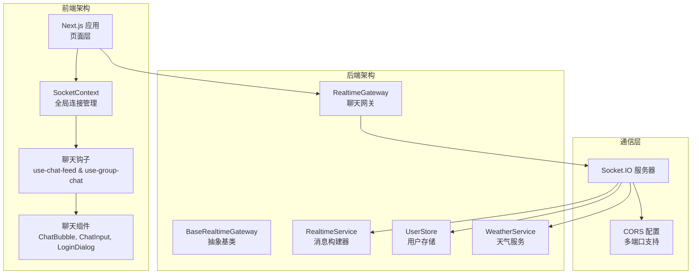
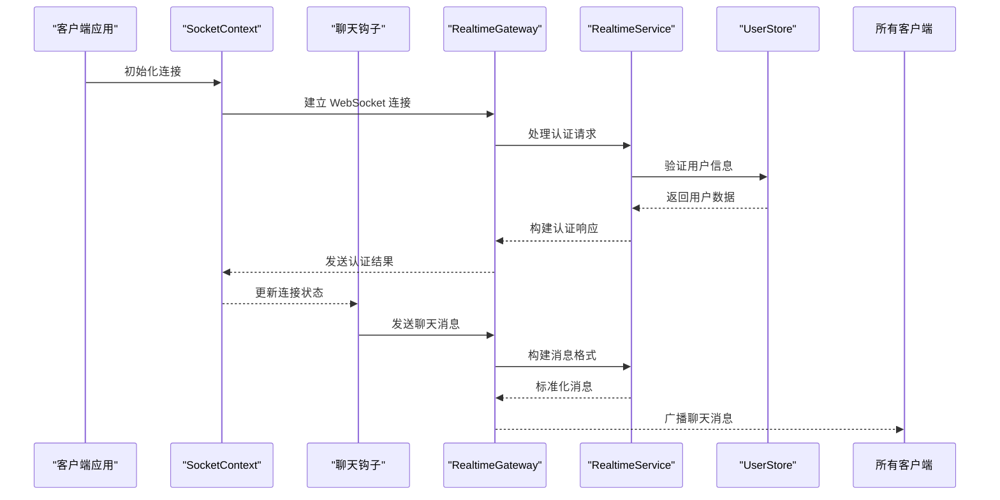
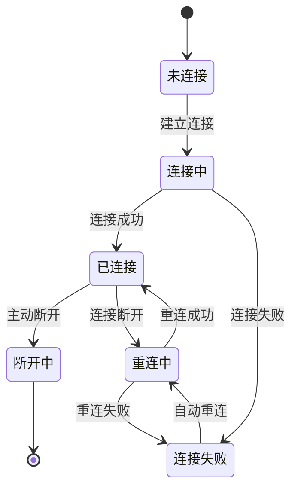

# Socket 通信 API

<cite>
**本文档引用的文件**
- [apps/web/src/context/SocketContext.tsx](file://apps/web/src/context/SocketContext.tsx)
- [apps/web/src/hooks/use-chat-feed.ts](file://apps/web/src/hooks/use-chat-feed.ts)
- [apps/web/src/hooks/use-group-chat.ts](file://apps/web/src/hooks/use-group-chat.ts)
- [apps/service/src/realtime/base-realtime.gateway.ts](file://apps/service/src/realtime/base-realtime.gateway.ts)
- [apps/service/src/realtime/realtime.gateway.ts](file://apps/service/src/realtime/realtime.gateway.ts)
- [apps/service/src/realtime/realtime.service.ts](file://apps/service/src/realtime/realtime.service.ts)
- [apps/service/src/realtime/user.store.ts](file://apps/service/src/realtime/user.store.ts)
- [apps/web/src/components/chat/ChatBubble.tsx](file://apps/web/src/components/chat/ChatBubble.tsx)
- [apps/web/src/components/chat/ChatInput.tsx](file://apps/web/src/components/chat/ChatInput.tsx)
- [apps/web/src/components/chat/LoginDialog.tsx](file://apps/web/src/components/chat/LoginDialog.tsx)
- [apps/web/src/app/(admin)/(others-pages)/(scene)/socket/page.tsx](file://apps/web/src/app/(admin)/(others-pages)/(scene)/socket/page.tsx)
- [package.json](file://package.json)
</cite>

## 更新摘要
**所做更改**
- 新增完整的 SocketContext 实现，提供全局 Socket 连接管理
- 新增聊天钩子系统，包括 use-chat-feed 和 use-group-chat
- 新增服务端实时通信网关和消息处理逻辑
- 新增聊天组件生态系统，包括消息气泡、输入框和登录对话框
- 更新实时通信架构，从简单测试页面升级为完整的聊天系统

## 目录
1. [简介](#简介)
2. [项目结构](#项目结构)
3. [核心组件](#核心组件)
4. [架构总览](#架构总览)
5. [详细组件分析](#详细组件分析)
6. [依赖分析](#依赖分析)
7. [性能考虑](#性能考虑)
8. [故障排除指南](#故障排除指南)
9. [结论](#结论)
10. [附录](#附录)

## 简介
本文件面向需要在 Next.js 应用中实现实时功能的开发者，系统性梳理与 Socket 通信 API 相关的完整实现方案。当前仓库已从简单的 Socket 测试页面升级为完整的实时通信系统，包含 SocketContext 全局状态管理、聊天钩子、服务端网关和完整的聊天组件生态。

该系统基于 Socket.IO 实现，提供用户认证、房间管理、群聊消息、在线状态管理和天气数据推送等完整功能。文档将详细说明连接建立、消息格式、事件处理机制、心跳检测、断线重连策略以及完整的用户体验流程。

## 项目结构
完整的实时通信系统由前端 SocketContext、聊天钩子、聊天组件和后端服务端网关组成：



**图表来源**
- [apps/web/src/context/SocketContext.tsx:1-72](file://apps/web/src/context/SocketContext.tsx#L1-L72)
- [apps/web/src/hooks/use-chat-feed.ts:1-91](file://apps/web/src/hooks/use-chat-feed.ts#L1-L91)
- [apps/web/src/hooks/use-group-chat.ts:1-173](file://apps/web/src/hooks/use-group-chat.ts#L1-L173)
- [apps/service/src/realtime/realtime.gateway.ts:1-179](file://apps/service/src/realtime/realtime.gateway.ts#L1-L179)

## 核心组件

### SocketContext - 全局连接管理
提供统一的 Socket 连接状态管理，支持连接状态监听、客户端 ID 获取和自动断线重连。

**章节来源**
- [apps/web/src/context/SocketContext.tsx:1-72](file://apps/web/src/context/SocketContext.tsx#L1-L72)

### 聊天钩子系统
- **use-chat-feed**: 提供基础聊天功能，支持房间加入、心跳检测和消息广播
- **use-group-chat**: 提供完整的群聊功能，包括用户认证、房间管理、消息处理和在线状态

**章节来源**
- [apps/web/src/hooks/use-chat-feed.ts:1-91](file://apps/web/src/hooks/use-chat-feed.ts#L1-L91)
- [apps/web/src/hooks/use-group-chat.ts:1-173](file://apps/web/src/hooks/use-group-chat.ts#L1-L173)

### 聊天组件生态
- **ChatBubble**: 消息气泡组件，支持用户头像、消息样式和时间显示
- **ChatInput**: 聊天输入组件，支持自动高度调整、快捷键和在线人数显示
- **LoginDialog**: 登录对话框，支持昵称设置和头像选择

**章节来源**
- [apps/web/src/components/chat/ChatBubble.tsx:1-110](file://apps/web/src/components/chat/ChatBubble.tsx#L1-L110)
- [apps/web/src/components/chat/ChatInput.tsx:1-62](file://apps/web/src/components/chat/ChatInput.tsx#L1-L62)
- [apps/web/src/components/chat/LoginDialog.tsx:1-105](file://apps/web/src/components/chat/LoginDialog.tsx#L1-L105)

### 服务端网关架构
- **BaseRealtimeGateway**: 抽象基类，提供网关初始化和客户端计数功能
- **RealtimeGateway**: 主要聊天网关，处理用户认证、房间管理和消息转发
- **RealtimeService**: 消息构建器，统一构建标准化的实时消息格式
- **UserStore**: 用户存储，管理在线用户状态和房间分配

**章节来源**
- [apps/service/src/realtime/base-realtime.gateway.ts:1-16](file://apps/service/src/realtime/base-realtime.gateway.ts#L1-L16)
- [apps/service/src/realtime/realtime.gateway.ts:1-179](file://apps/service/src/realtime/realtime.gateway.ts#L1-L179)
- [apps/service/src/realtime/realtime.service.ts:1-87](file://apps/service/src/realtime/realtime.service.ts#L1-L87)
- [apps/service/src/realtime/user.store.ts:1-59](file://apps/service/src/realtime/user.store.ts#L1-L59)

## 架构总览
完整的实时通信架构展示了从前端到后端的完整数据流：



**图表来源**
- [apps/web/src/context/SocketContext.tsx:20-63](file://apps/web/src/context/SocketContext.tsx#L20-L63)
- [apps/web/src/hooks/use-group-chat.ts:137-155](file://apps/web/src/hooks/use-group-chat.ts#L137-L155)
- [apps/service/src/realtime/realtime.gateway.ts:63-80](file://apps/service/src/realtime/realtime.gateway.ts#L63-L80)

## 详细组件分析

### SocketContext - 连接生命周期管理
SocketContext 提供了完整的连接生命周期管理，包括连接建立、状态监听和资源清理。

**核心功能**:
- 自动连接管理：使用 Socket.IO 客户端自动建立连接
- 状态同步：实时同步连接状态和客户端 ID
- 事件监听：监听连接和断开事件
- 资源清理：组件卸载时自动断开连接

**章节来源**
- [apps/web/src/context/SocketContext.tsx:20-63](file://apps/web/src/context/SocketContext.tsx#L20-L63)

### use-chat-feed - 基础聊天功能
提供简单的聊天功能，适合测试和基础演示用途。

**主要功能**:
- 房间管理：支持动态切换聊天房间
- 心跳检测：定期发送 ping 请求验证连接
- 消息广播：向指定房间广播消息
- 日志记录：记录所有聊天活动

**章节来源**
- [apps/web/src/hooks/use-chat-feed.ts:11-91](file://apps/web/src/hooks/use-chat-feed.ts#L11-L91)

### use-group-chat - 完整群聊系统
提供企业级的群聊功能，包含用户认证、房间管理和消息处理。

**核心功能**:
- 用户认证：支持昵称和头像设置
- 房间管理：动态加入/离开聊天室
- 消息处理：实时接收和发送聊天消息
- 在线状态：跟踪房间内用户状态
- 自动滚动：消息自动滚动到底部

**章节来源**
- [apps/web/src/hooks/use-group-chat.ts:31-173](file://apps/web/src/hooks/use-group-chat.ts#L31-L173)

### RealtimeGateway - 服务端消息处理
服务端的主要聊天网关，处理所有客户端消息和业务逻辑。

**消息处理流程**:
- **认证流程**: 验证用户登录状态
- **房间管理**: 处理用户加入/离开房间
- **消息转发**: 向房间内所有用户广播消息
- **心跳响应**: 处理客户端 ping 请求
- **天气推送**: 定时推送天气数据

**章节来源**
- [apps/service/src/realtime/realtime.gateway.ts:49-179](file://apps/service/src/realtime/realtime.gateway.ts#L49-L179)

### RealtimeService - 消息标准化
提供统一的消息格式构建器，确保所有实时消息遵循一致的结构。

**消息格式规范**:
```typescript
type RealtimeEvent<T> = {
  type: string;      // 事件类型
  time: number;      // 时间戳
  requestId: string; // 请求ID
  data: T;           // 消息数据
};
```

**支持的消息类型**:
- 用户认证信息
- 房间用户列表
- 聊天消息
- 天气数据
- 系统错误

**章节来源**
- [apps/service/src/realtime/realtime.service.ts:6-87](file://apps/service/src/realtime/realtime.service.ts#L6-L87)

### 聊天组件 - 用户界面层
提供完整的聊天用户界面，包括消息显示、输入和用户交互。

**组件协作**:
- **ChatBubble**: 渲染单条消息，区分用户消息和系统消息
- **ChatInput**: 处理用户输入，支持多行文本和快捷键
- **LoginDialog**: 处理用户登录，收集昵称和头像信息

**章节来源**
- [apps/web/src/components/chat/ChatBubble.tsx:94-110](file://apps/web/src/components/chat/ChatBubble.tsx#L94-L110)
- [apps/web/src/components/chat/ChatInput.tsx:14-62](file://apps/web/src/components/chat/ChatInput.tsx#L14-L62)
- [apps/web/src/components/chat/LoginDialog.tsx:24-105](file://apps/web/src/components/chat/LoginDialog.tsx#L24-L105)

## 依赖分析
实时通信系统的核心依赖关系：

```mermaid
graph LR
subgraph "前端依赖"
SocketIO["socket.io-client<br/>Socket.IO 客户端"]
React["react<br/>React 运行时"]
Typescript["typescript<br/>TypeScript 类型定义"]
CSSModules["*.css<br/>样式模块"]
End
subgraph "后端依赖"
NestJS["@nestjs/websockets<br/>WebSocket 框架"]
SocketIOServer["socket.io<br/>Socket.IO 服务器"]
NestSchedule["@nestjs/schedule<br/>定时任务"]
WeatherAPI["天气 API<br/>天气数据服务"]
End
SocketIO --> NestJS
NestJS --> SocketIOServer
SocketIOServer --> WeatherAPI
```

**图表来源**
- [package.json:1-79](file://package.json#L1-L79)

**章节来源**
- [package.json:1-79](file://package.json#L1-L79)

## 性能考虑
实时通信系统的性能优化策略：

### 前端优化
- **连接池管理**: SocketContext 统一管理连接，避免重复创建
- **消息节流**: 使用 useCallback 优化消息处理函数
- **虚拟滚动**: 限制消息列表长度，只保留最近 200 条消息
- **懒加载**: 头像图片按需加载，减少初始资源消耗

### 后端优化
- **内存管理**: UserStore 使用 Map 结构，高效管理用户状态
- **广播优化**: 使用房间广播，避免全量推送
- **定时任务**: 天气数据每 10 秒推送一次，避免频繁请求
- **错误处理**: 完善的错误捕获和日志记录

### 网络优化
- **传输协议**: 使用 WebSocket 传输，降低协议开销
- **CORS 配置**: 支持多个开发端口，提高开发效率
- **连接复用**: 单个 Socket 连接处理多种消息类型

## 故障排除指南

### 连接问题
- **连接失败**: 检查 NEXT_PUBLIC_SOCKET_URL 环境变量配置
- **跨域错误**: 确认 CORS 配置中的允许域名
- **认证失败**: 验证用户登录流程和用户存储状态

### 消息问题
- **消息丢失**: 检查房间名称和用户认证状态
- **消息重复**: 确认消息 ID 生成和去重逻辑
- **消息延迟**: 监控网络延迟和服务端处理时间

### 性能问题
- **内存泄漏**: 检查事件监听器的正确清理
- **UI 卡顿**: 优化消息渲染和组件更新
- **连接中断**: 实现自动重连和状态恢复

### 开发调试
- **日志监控**: 利用 NestJS 日志系统查看连接状态
- **网络调试**: 使用浏览器开发者工具监控 WebSocket 通信
- **消息追踪**: 添加消息 ID 和时间戳便于问题定位

## 结论
本仓库已从简单的 Socket 测试页面升级为完整的实时通信系统，提供了从连接管理到用户界面的全套解决方案。新的架构具有以下优势：

- **模块化设计**: SocketContext、聊天钩子和组件分离，职责清晰
- **可扩展性**: 基于 Socket.IO 的插件化架构，易于添加新功能
- **用户体验**: 完整的聊天功能，包括认证、房间管理和消息处理
- **性能优化**: 前后端双重优化，支持高并发场景

建议开发者基于此架构继续扩展更多实时功能，如文件传输、视频通话、实时协作编辑等高级特性。

## 附录

### 消息协议规范
实时通信采用标准化的消息格式：

**通用消息结构**:
```typescript
{
  type: string;      // 事件类型
  time: number;      // 事件时间戳
  requestId: string; // 唯一请求ID
  data: any;         // 业务数据
}
```

**客户端消息类型**:
- `client:login`: 用户登录请求
- `client:join`: 加入房间请求  
- `client:message`: 聊天消息
- `client:ping`: 心跳检测

**服务端消息类型**:
- `server:user-info`: 用户信息响应
- `server:user-joined`: 用户加入通知
- `server:user-left`: 用户离开通知
- `server:message`: 聊天消息
- `server:pong`: 心跳响应
- `server:weather`: 天气数据

### 连接状态管理
完整的连接状态机：



### 错误处理策略
- **认证错误**: 返回 server:error 类型消息
- **业务错误**: 包含 scope 和 message 字段
- **网络错误**: 自动重连和状态恢复
- **数据错误**: 完善的输入验证和错误提示

### 最佳实践建议
- **连接管理**: 使用 SocketContext 统一管理连接生命周期
- **状态同步**: 保持前端状态与服务端状态一致
- **错误处理**: 完善的错误捕获和用户提示
- **性能监控**: 监控连接状态、消息延迟和内存使用
- **安全考虑**: 实施适当的访问控制和数据验证