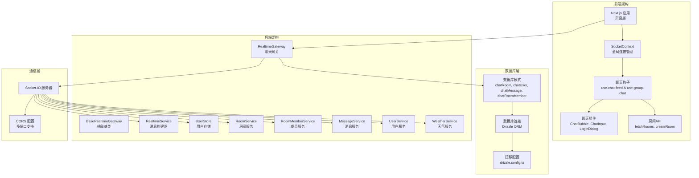
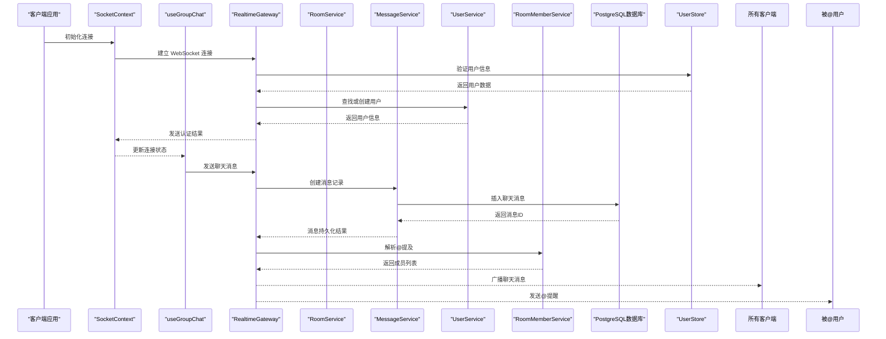
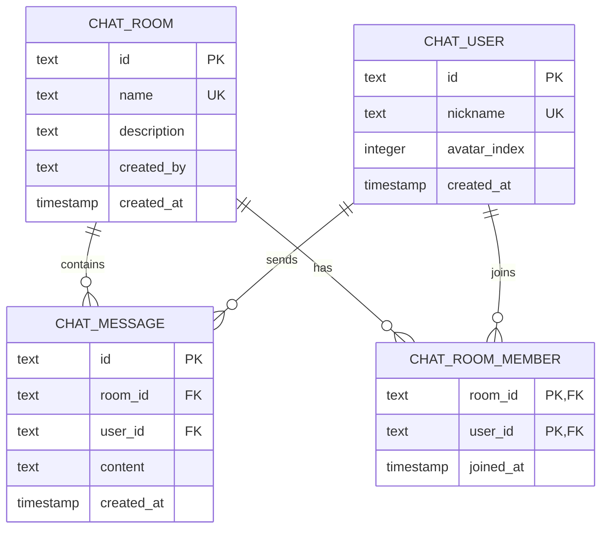
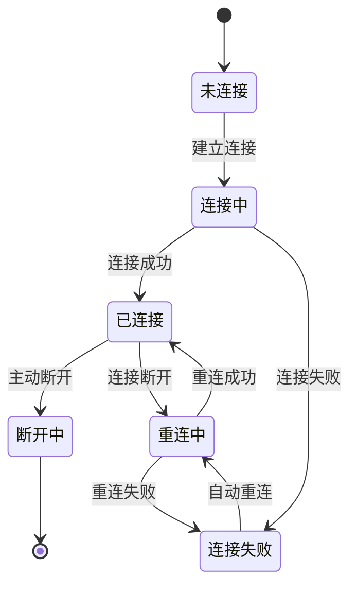

# Socket 通信 API

<cite>
**本文档引用的文件**
- [apps/web/src/context/SocketContext.tsx](file://apps/web/src/context/SocketContext.tsx)
- [apps/web/src/hooks/use-chat-feed.ts](file://apps/web/src/hooks/use-chat-feed.ts)
- [apps/web/src/hooks/use-group-chat.ts](file://apps/web/src/hooks/use-group-chat.ts)
- [apps/service/src/realtime/base-realtime.gateway.ts](file://apps/service/src/realtime/base-realtime.gateway.ts)
- [apps/service/src/realtime/realtime.gateway.ts](file://apps/service/src/realtime/realtime.gateway.ts)
- [apps/service/src/realtime/realtime.service.ts](file://apps/service/src/realtime/realtime.service.ts)
- [apps/service/src/realtime/user.store.ts](file://apps/service/src/realtime/user.store.ts)
- [apps/service/src/room/room.service.ts](file://apps/service/src/room/room.service.ts)
- [apps/service/src/room-member/room-member.service.ts](file://apps/service/src/room-member/room-member.service.ts)
- [apps/service/src/message/message.service.ts](file://apps/service/src/message/message.service.ts)
- [apps/service/src/user/user.service.ts](file://apps/service/src/user/user.service.ts)
- [apps/service/src/db/schema.ts](file://apps/service/src/db/schema.ts)
- [apps/service/src/db/connection.ts](file://apps/service/src/db/connection.ts)
- [apps/service/src/db/db.module.ts](file://apps/service/src/db/db.module.ts)
- [apps/service/drizzle.config.ts](file://apps/service/drizzle.config.ts)
- [apps/web/src/lib/room-api.ts](file://apps/web/src/lib/room-api.ts)
- [apps/web/src/components/chat/ChatBubble.tsx](file://apps/web/src/components/chat/ChatBubble.tsx)
- [apps/web/src/components/chat/ChatInput.tsx](file://apps/web/src/components/chat/ChatInput.tsx)
- [apps/web/src/components/chat/LoginDialog.tsx](file://apps/web/src/components/chat/LoginDialog.tsx)
- [apps/web/src/app/(admin)/(others-pages)/(scene)/socket/page.tsx](file://apps/web/src/app/(admin)/(others-pages)/(scene)/socket/page.tsx)
- [package.json](file://package.json)
</cite>

## 更新摘要
**所做更改**
- RealtimeGateway大幅增强，支持数据库持久化、@提及功能、房间成员管理、自动用户创建
- 新增完整的数据库集成架构，包含聊天房间、用户、消息和成员关系的完整数据模型
- 新增房间管理功能，支持房间创建、查询和成员管理
- 新增消息持久化机制，所有聊天消息保存到 PostgreSQL 数据库
- 新增@提及功能，支持用户@提醒和私信通知
- 新增Drizzle ORM配置和迁移工具
- 更新实时通信架构，从简单聊天升级为完整的多房间聊天应用

## 目录
1. [简介](#简介)
2. [项目结构](#项目结构)
3. [核心组件](#核心组件)
4. [架构总览](#架构总览)
5. [详细组件分析](#详细组件分析)
6. [数据库架构](#数据库架构)
7. [消息持久化](#消息持久化)
8. [@提及功能](#提及功能)
9. [依赖分析](#依赖分析)
10. [性能考虑](#性能考虑)
11. [故障排除指南](#故障排除指南)
12. [结论](#结论)
13. [附录](#附录)

## 简介
本文件面向需要在 Next.js 应用中实现实时功能的开发者，系统性梳理与 Socket 通信 API 相关的完整实现方案。当前仓库已从简单的 Socket 测试页面升级为完整的实时通信系统，包含 SocketContext 全局状态管理、聊天钩子、服务端网关、数据库集成和完整的聊天组件生态。

该系统基于 Socket.IO 实现，提供用户认证、房间管理、群聊消息、在线状态管理、消息持久化、@提及功能和天气数据推送等完整功能。文档将详细说明连接建立、消息格式、事件处理机制、心跳检测、断线重连策略、数据库架构以及完整的用户体验流程。

## 项目结构
完整的实时通信系统由前端 SocketContext、聊天钩子、聊天组件、数据库层和后端服务端网关组成：



**图表来源**
- [apps/web/src/context/SocketContext.tsx:1-72](file://apps/web/src/context/SocketContext.tsx#L1-L72)
- [apps/web/src/hooks/use-chat-feed.ts:1-91](file://apps/web/src/hooks/use-chat-feed.ts#L1-L91)
- [apps/web/src/hooks/use-group-chat.ts:1-271](file://apps/web/src/hooks/use-group-chat.ts#L1-L271)
- [apps/service/src/realtime/realtime.gateway.ts:1-288](file://apps/service/src/realtime/realtime.gateway.ts#L1-L288)
- [apps/service/src/db/schema.ts:1-160](file://apps/service/src/db/schema.ts#L1-L160)

## 核心组件

### SocketContext - 全局连接管理
提供统一的 Socket 连接状态管理，支持连接状态监听、客户端 ID 获取和自动断线重连。

**章节来源**
- [apps/web/src/context/SocketContext.tsx:1-72](file://apps/web/src/context/SocketContext.tsx#L1-L72)

### 聊天钩子系统
- **use-chat-feed**: 提供基础聊天功能，支持房间加入、心跳检测和消息广播
- **use-group-chat**: 提供完整的群聊功能，包括用户认证、房间管理、消息处理、在线状态、@提及管理和消息历史

**章节来源**
- [apps/web/src/hooks/use-chat-feed.ts:1-91](file://apps/web/src/hooks/use-chat-feed.ts#L1-L91)
- [apps/web/src/hooks/use-group-chat.ts:1-271](file://apps/web/src/hooks/use-group-chat.ts#L1-L271)

### 聊天组件生态
- **ChatBubble**: 消息气泡组件，支持用户头像、消息样式和时间显示
- **ChatInput**: 聊天输入组件，支持自动高度调整、快捷键、@提及自动完成和在线人数显示
- **LoginDialog**: 登录对话框，支持昵称设置和头像选择

**章节来源**
- [apps/web/src/components/chat/ChatBubble.tsx:1-110](file://apps/web/src/components/chat/ChatBubble.tsx#L1-L110)
- [apps/web/src/components/chat/ChatInput.tsx:1-168](file://apps/web/src/components/chat/ChatInput.tsx#L1-L168)
- [apps/web/src/components/chat/LoginDialog.tsx:1-105](file://apps/web/src/components/chat/LoginDialog.tsx#L1-L105)

### 服务端网关架构
- **BaseRealtimeGateway**: 抽象基类，提供网关初始化和客户端计数功能
- **RealtimeGateway**: 主要聊天网关，处理用户认证、房间管理、消息转发、@提及解析和消息持久化
- **RealtimeService**: 消息构建器，统一构建标准化的实时消息格式
- **UserStore**: 用户存储，管理在线用户状态和房间分配

**章节来源**
- [apps/service/src/realtime/base-realtime.gateway.ts:1-16](file://apps/service/src/realtime/base-realtime.gateway.ts#L1-L16)
- [apps/service/src/realtime/realtime.gateway.ts:1-288](file://apps/service/src/realtime/realtime.gateway.ts#L1-L288)
- [apps/service/src/realtime/realtime.service.ts:1-122](file://apps/service/src/realtime/realtime.service.ts#L1-L122)
- [apps/service/src/realtime/user.store.ts:1-68](file://apps/service/src/realtime/user.store.ts#L1-L68)

### 房间管理系统
- **RoomService**: 房间业务逻辑，支持房间创建、查询和管理
- **RoomMemberService**: 成员管理服务，处理房间成员添加、移除和查询
- **RoomController**: 房间API控制器，提供RESTful接口
- **UserService**: 用户服务，支持用户查找、创建和自动用户创建

**章节来源**
- [apps/service/src/room/room.service.ts:1-44](file://apps/service/src/room/room.service.ts#L1-L44)
- [apps/service/src/room-member/room-member.service.ts:1-43](file://apps/service/src/room-member/room-member.service.ts#L1-L43)
- [apps/service/src/user/user.service.ts:1-63](file://apps/service/src/user/user.service.ts#L1-L63)

## 架构总览
完整的实时通信架构展示了从前端到后端再到数据库的完整数据流：



**图表来源**
- [apps/web/src/context/SocketContext.tsx:20-63](file://apps/web/src/context/SocketContext.tsx#L20-L63)
- [apps/web/src/hooks/use-group-chat.ts:243-248](file://apps/web/src/hooks/use-group-chat.ts#L243-L248)
- [apps/service/src/realtime/realtime.gateway.ts:192-265](file://apps/service/src/realtime/realtime.gateway.ts#L192-L265)
- [apps/service/src/message/message.service.ts:14-24](file://apps/service/src/message/message.service.ts#L14-L24)

## 详细组件分析

### SocketContext - 连接生命周期管理
SocketContext 提供了完整的连接生命周期管理，包括连接建立、状态监听和资源清理。

**核心功能**:
- 自动连接管理：使用 Socket.IO 客户端自动建立连接
- 状态同步：实时同步连接状态和客户端 ID
- 事件监听：监听连接和断开事件
- 资源清理：组件卸载时自动断开连接

**章节来源**
- [apps/web/src/context/SocketContext.tsx:20-63](file://apps/web/src/context/SocketContext.tsx#L20-L63)

### use-group-chat - 完整群聊系统
提供企业级的群聊功能，包含用户认证、房间管理、消息处理、@提及管理和消息历史。

**核心功能**:
- 用户认证：支持昵称和头像设置
- 房间管理：动态加入/离开聊天室
- 消息处理：实时接收和发送聊天消息
- 在线状态：跟踪房间内用户状态
- @提及管理：解析@提醒并通知目标用户
- 消息历史：加载房间历史消息
- 自动滚动：消息自动滚动到底部

**章节来源**
- [apps/web/src/hooks/use-group-chat.ts:38-271](file://apps/web/src/hooks/use-group-chat.ts#L38-L271)

### RealtimeGateway - 服务端消息处理
服务端的主要聊天网关，处理所有客户端消息和业务逻辑，包含完整的数据库集成。

**消息处理流程**:
- **认证流程**: 验证用户登录状态，支持自动用户创建
- **房间管理**: 处理用户加入/离开房间，加载房间历史
- **消息持久化**: 将聊天消息保存到数据库
- **@提及解析**: 分析消息中的@提醒并通知目标用户
- **消息转发**: 向房间内所有用户广播消息
- **心跳响应**: 处理客户端 ping 请求
- **天气推送**: 定时推送天气数据

**增强功能**:
- **自动用户创建**: 通过 `userService.findOrCreate` 实现用户自动创建和更新
- **房间成员管理**: 通过 `roomMemberService` 管理房间成员关系
- **数据库持久化**: 所有操作都支持数据库持久化
- **@提及功能**: 完整的@提醒系统

**章节来源**
- [apps/service/src/realtime/realtime.gateway.ts:150-288](file://apps/service/src/realtime/realtime.gateway.ts#L150-L288)

### RealtimeService - 消息标准化
提供统一的消息格式构建器，确保所有实时消息遵循一致的结构。

**消息格式规范**:
```typescript
type RealtimeEvent<T> = {
  type: string;      // 事件类型
  time: number;      // 时间戳
  requestId: string; // 请求ID
  data: T;           // 消息数据
};
```

**支持的消息类型**:
- 用户认证信息
- 房间用户列表
- 聊天消息
- 房间历史消息
- 天气数据
- @提醒通知
- 房间成员列表
- 系统错误

**新增消息类型**:
- `server.room-db-members`: 房间数据库成员列表
- `server.mention`: @提醒通知

**章节来源**
- [apps/service/src/realtime/realtime.service.ts:6-122](file://apps/service/src/realtime/realtime.service.ts#L6-L122)

### 聊天组件 - 用户界面层
提供完整的聊天用户界面，包括消息显示、输入和用户交互。

**组件协作**:
- **ChatBubble**: 渲染单条消息，区分用户消息和系统消息
- **ChatInput**: 处理用户输入，支持多行文本、快捷键和@提及自动完成
- **LoginDialog**: 处理用户登录，收集昵称和头像信息

**章节来源**
- [apps/web/src/components/chat/ChatBubble.tsx:94-110](file://apps/web/src/components/chat/ChatBubble.tsx#L94-L110)
- [apps/web/src/components/chat/ChatInput.tsx:53-168](file://apps/web/src/components/chat/ChatInput.tsx#L53-L168)
- [apps/web/src/components/chat/LoginDialog.tsx:24-105](file://apps/web/src/components/chat/LoginDialog.tsx#L24-L105)

## 数据库架构
完整的数据库架构支持多房间聊天应用的所有数据需求。

### 数据表设计


**图表来源**
- [apps/service/src/db/schema.ts:17-66](file://apps/service/src/db/schema.ts#L17-L66)

### 数据库连接配置
- **Drizzle ORM**: 使用 Node.js PostgreSQL 连接池
- **环境配置**: 支持本地开发和云数据库（如 Neon.tech）
- **SSL支持**: 自动检测并配置SSL连接
- **全局提供者**: 数据库实例作为全局服务提供

**章节来源**
- [apps/service/src/db/connection.ts:1-20](file://apps/service/src/db/connection.ts#L1-L20)
- [apps/service/src/db/db.module.ts:1-17](file://apps/service/src/db/db.module.ts#L1-L17)

## 消息持久化
完整的消息持久化机制确保所有聊天数据安全存储和快速检索。

### 消息存储流程
```mermaid
flowchart TD
A[客户端发送消息] --> B[RealtimeGateway 接收]
B --> C[查找用户和房间]
C --> D[MessageService.create]
D --> E[插入数据库]
E --> F[返回消息ID]
F --> G[构建实时消息]
G --> H[广播到房间]
H --> I[更新@提及]
I --> J[通知被@用户]
```

**图表来源**
- [apps/service/src/realtime/realtime.gateway.ts:219-243](file://apps/service/src/realtime/realtime.gateway.ts#L219-L243)
- [apps/service/src/message/message.service.ts:14-24](file://apps/service/src/message/message.service.ts#L14-L24)

### 历史消息加载
- **批量加载**: 默认加载最近50条消息
- **时间排序**: 按创建时间升序排列（最旧在前）
- **用户信息**: 关联查询用户昵称和头像索引
- **内存优化**: 限制消息列表长度，只保留最近200条

**章节来源**
- [apps/service/src/message/message.service.ts:30-71](file://apps/service/src/message/message.service.ts#L30-L71)
- [apps/web/src/hooks/use-group-chat.ts:143-155](file://apps/web/src/hooks/use-group-chat.ts#L143-L155)

## @提及功能
完整的@提及功能支持用户间的智能提醒和通知。

### @提及解析流程
```mermaid
flowchart TD
A[用户发送消息] --> B{检查@符号}
B --> |找到@| C[提取用户名]
C --> D[获取房间成员]
D --> E[查找目标用户]
E --> |找到| F[获取用户Socket]
F --> G[发送@提醒]
G --> H[更新提醒列表]
B --> |无@| I[正常广播]
E --> |未找到| I
```

**图表来源**
- [apps/service/src/realtime/realtime.gateway.ts:245-264](file://apps/service/src/realtime/realtime.gateway.ts#L245-L264)

### @提及功能特性
- **自动完成**: 输入@时显示可用用户列表
- **键盘导航**: 支持上下箭头和Tab键选择
- **智能匹配**: 实时过滤匹配的用户名
- **提醒通知**: 私信提醒被@的用户
- **视觉反馈**: 显示未读@提醒数量

**新增功能**:
- **数据库成员查询**: 通过 `roomMemberService.getMembers` 获取房间成员
- **@提醒持久化**: @提醒通过数据库成员关系实现
- **成员列表更新**: 房间成员变更时更新所有用户

**章节来源**
- [apps/web/src/hooks/use-group-chat.ts:172-177](file://apps/web/src/hooks/use-group-chat.ts#L172-L177)
- [apps/web/src/components/chat/ChatInput.tsx:53-168](file://apps/web/src/components/chat/ChatInput.tsx#L53-L168)

## 依赖分析
实时通信系统的核心依赖关系：

```mermaid
graph LR
subgraph "前端依赖"
SocketIO["socket.io-client<br/>Socket.IO 客户端"]
React["react<br/>React 运行时"]
Typescript["typescript<br/>TypeScript 类型定义"]
CSSModules["*.css<br/>样式模块"]
Drizzle["drizzle-orm<br/>ORM框架"]
PostgreSQL["pg<br/>PostgreSQL驱动"]
End
subgraph "后端依赖"
NestJS["@nestjs/websockets<br/>WebSocket 框架"]
SocketIOServer["socket.io<br/>Socket.IO 服务器"]
NestSchedule["@nestjs/schedule<br/>定时任务"]
WeatherAPI["天气 API<br/>天气数据服务"]
DrizzleServer["drizzle-orm/node-postgres<br/>Node.js适配"]
PGPool["pg.Pool<br/>连接池"]
End
SocketIO --> NestJS
NestJS --> SocketIOServer
SocketIOServer --> WeatherAPI
Drizzle --> DrizzleServer
DrizzleServer --> PGPool
```

**图表来源**
- [package.json:1-79](file://package.json#L1-L79)

**章节来源**
- [package.json:1-79](file://package.json#L1-L79)

## 性能考虑
实时通信系统的性能优化策略：

### 前端优化
- **连接池管理**: SocketContext 统一管理连接，避免重复创建
- **消息节流**: 使用 useCallback 优化消息处理函数
- **虚拟滚动**: 限制消息列表长度，只保留最近 200 条消息
- **懒加载**: 头像图片按需加载，减少初始资源消耗
- **@提及缓存**: 缓存房间成员列表，避免重复查询

### 后端优化
- **内存管理**: UserStore 使用 Map 结构，高效管理用户状态
- **广播优化**: 使用房间广播，避免全量推送
- **数据库连接池**: 复用数据库连接，减少连接开销
- **消息批处理**: 批量处理@提及，减少数据库查询次数
- **定时任务**: 天气数据每 10 秒推送一次，避免频繁请求
- **错误处理**: 完善的错误捕获和日志记录

### 数据库优化
- **索引优化**: 为常用查询字段建立索引
- **连接池配置**: 合理配置连接池大小和超时
- **查询优化**: 使用JOIN查询减少数据库往返
- **数据归档**: 定期清理历史数据，保持表大小可控

### 网络优化
- **传输协议**: 使用 WebSocket 传输，降低协议开销
- **CORS 配置**: 支持多个开发端口，提高开发效率
- **连接复用**: 单个 Socket 连接处理多种消息类型

## 故障排除指南

### 连接问题
- **连接失败**: 检查 NEXT_PUBLIC_SOCKET_URL 环境变量配置
- **跨域错误**: 确认 CORS 配置中的允许域名
- **认证失败**: 验证用户登录流程和用户存储状态

### 消息问题
- **消息丢失**: 检查房间名称和用户认证状态
- **消息重复**: 确认消息 ID 生成和去重逻辑
- **消息延迟**: 监控网络延迟和服务端处理时间
- **历史消息不完整**: 检查数据库连接和查询参数

### 数据库问题
- **连接失败**: 检查 POSTGRES_URL 环境变量配置
- **查询超时**: 优化SQL查询和索引
- **连接池耗尽**: 调整连接池大小配置
- **数据不一致**: 检查事务处理和并发控制

### @提及问题
- **@提醒无效**: 检查房间成员查询和用户状态
- **自动完成不工作**: 验证成员列表获取和过滤逻辑
- **提醒通知延迟**: 监控@提及解析和通知发送

### 性能问题
- **内存泄漏**: 检查事件监听器的正确清理
- **UI 卡顿**: 优化消息渲染和组件更新
- **连接中断**: 实现自动重连和状态恢复
- **数据库性能**: 监控查询执行时间和连接使用率

### 开发调试
- **日志监控**: 利用 NestJS 日志系统查看连接状态
- **网络调试**: 使用浏览器开发者工具监控 WebSocket 通信
- **数据库调试**: 使用PostgreSQL客户端查看数据状态
- **消息追踪**: 添加消息 ID 和时间戳便于问题定位

## 结论
本仓库已从简单的 Socket 测试页面升级为完整的实时通信系统，提供了从连接管理到用户界面、从消息处理到数据库持久化的全套解决方案。新的架构具有以下优势：

- **模块化设计**: SocketContext、聊天钩子、组件和数据库服务分离，职责清晰
- **可扩展性**: 基于 Socket.IO 和 Drizzle ORM 的插件化架构，易于添加新功能
- **数据完整性**: 完整的数据库设计和消息持久化，确保数据安全
- **用户体验**: 完整的聊天功能，包括认证、房间管理、@提及和消息历史
- **性能优化**: 前后端双重优化，支持高并发场景
- **@提及功能**: 智能的用户提醒系统，提升协作效率
- **自动用户创建**: 通过 `findOrCreate` 方法实现无缝用户注册
- **房间成员管理**: 完整的成员关系管理，支持动态成员变更

建议开发者基于此架构继续扩展更多实时功能，如文件传输、视频通话、实时协作编辑、权限管理等高级特性。

## 附录

### 消息协议规范
实时通信采用标准化的消息格式：

**通用消息结构**:
```typescript
{
  type: string;      // 事件类型
  time: number;      // 事件时间戳
  requestId: string; // 唯一请求ID
  data: any;         // 业务数据
}
```

**客户端消息类型**:
- `client:login`: 用户登录请求
- `client:join`: 加入房间请求  
- `client:message`: 聊天消息
- `client:ping`: 心跳检测

**服务端消息类型**:
- `server:user-info`: 用户信息响应
- `server:user-joined`: 用户加入通知
- `server:user-left`: 用户离开通知
- `server:message`: 聊天消息
- `server:room-history`: 房间历史消息
- `server:weather`: 天气数据
- `server:mention`: @提醒通知
- `server:room-db-members`: 房间成员列表
- `server:pong`: 心跳响应
- `server:error`: 错误响应

### 数据库迁移
```bash
# 生成迁移文件
npx drizzle-kit generate

# 执行迁移
npx drizzle-kit migrate

# 查看迁移状态
npx drizzle-kit status
```

### 房间API使用
```typescript
// 获取所有房间
const rooms = await fetchRooms();

// 创建新房间
const newRoom = await createRoom('开发组', 'user123', '开发团队专用');

// 获取房间成员
const members = await fetchRoomMembers('room456');
```

### 连接状态管理
完整的连接状态机：



### 错误处理策略
- **认证错误**: 返回 server:error 类型消息
- **业务错误**: 包含 scope 和 message 字段
- **网络错误**: 自动重连和状态恢复
- **数据库错误**: 完善的事务回滚和错误提示
- **@提及错误**: 优雅降级，不影响主消息功能

### 最佳实践建议
- **连接管理**: 使用 SocketContext 统一管理连接生命周期
- **状态同步**: 保持前端状态与服务端状态一致
- **错误处理**: 完善的错误捕获和用户提示
- **性能监控**: 监控连接状态、消息延迟、内存使用和数据库性能
- **安全考虑**: 实施适当的访问控制、数据验证和SQL注入防护
- **可扩展性**: 设计模块化的架构，便于添加新功能
- **数据备份**: 定期备份数据库，确保数据安全