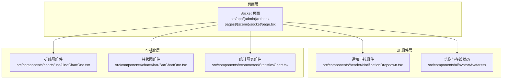
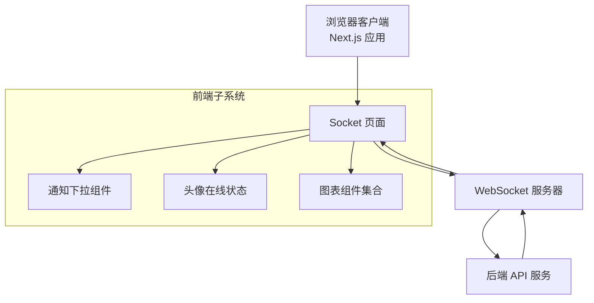
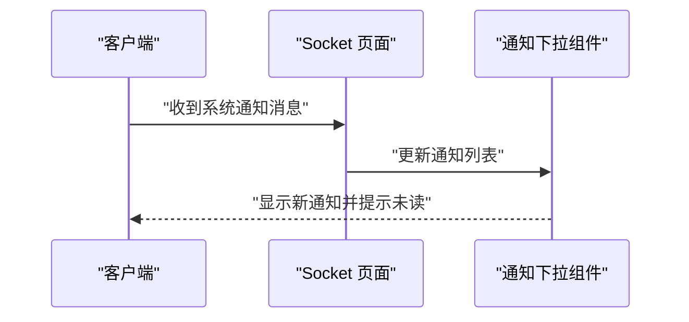
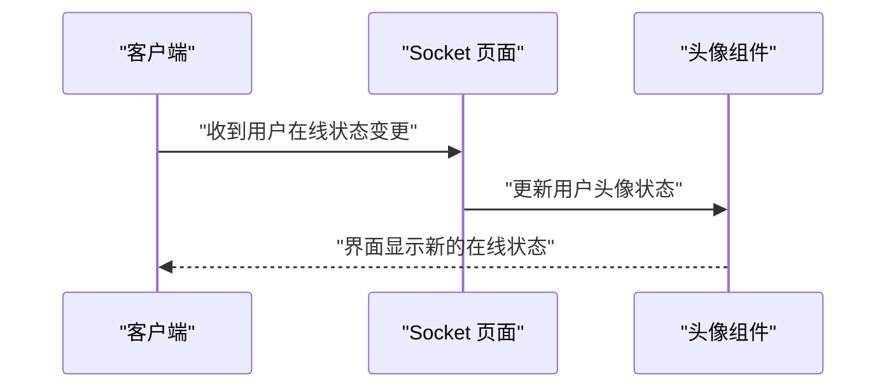
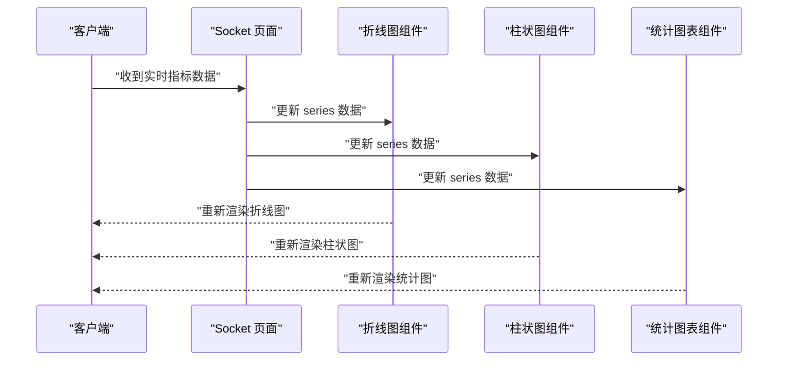
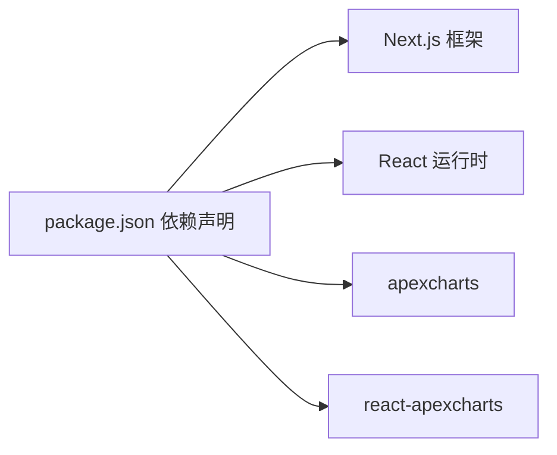

# Socket 通信 API

<cite>
**本文档引用的文件**
- [src/app/(admin)/(others-pages)/(scene)/socket/page.tsx](file://src/app/(admin)/(others-pages)/(scene)/socket/page.tsx)
- [package.json](file://package.json)
- [src/components/header/NotificationDropdown.tsx](file://src/components/header/NotificationDropdown.tsx)
- [src/components/ui/avatar/Avatar.tsx](file://src/components/ui/avatar/Avatar.tsx)
- [src/components/ecommerce/StatisticsChart.tsx](file://src/components/ecommerce/StatisticsChart.tsx)
- [src/components/charts/line/LineChartOne.tsx](file://src/components/charts/line/LineChartOne.tsx)
- [src/components/charts/bar/BarChartOne.tsx](file://src/components/charts/bar/BarChartOne.tsx)
</cite>

## 目录
1. [简介](#简介)
2. [项目结构](#项目结构)
3. [核心组件](#核心组件)
4. [架构总览](#架构总览)
5. [详细组件分析](#详细组件分析)
6. [依赖分析](#依赖分析)
7. [性能考虑](#性能考虑)
8. [故障排除指南](#故障排除指南)
9. [结论](#结论)
10. [附录](#附录)

## 简介
本文件面向需要在 Next.js 应用中实现实时功能的开发者，系统性梳理与 Socket 通信 API 相关的前端实现思路与最佳实践。当前仓库中存在一个占位页面用于承载 Socket 功能入口，并配套了通知栏、在线状态指示器以及多种图表组件，这些均可作为实时数据展示与交互的基础。

需要注意的是：本仓库未包含实际的 WebSocket 客户端或服务端实现代码。本文档将以现有文件为基础，给出可扩展到真实 Socket 通信的架构设计、消息格式、事件处理、心跳与重连策略、状态管理与性能优化建议，帮助你在不改变现有结构的前提下接入真实的实时通信能力。

## 项目结构
与 Socket 通信 API 相关的前端结构要点如下：
- 页面入口：位于场景页下的 Socket 页面，作为实时功能的挂载点
- 通知与状态：通知下拉组件用于系统通知推送；头像组件支持在线状态指示
- 图表组件：折线图、柱状图等可视化组件可用于实时数据的动态更新

**图表来源**
- [src/app/(admin)/(others-pages)/(scene)/socket/page.tsx](file://src/app/(admin)/(others-pages)/(scene)/socket/page.tsx#L1-L13)
- [src/components/header/NotificationDropdown.tsx:1-392](file://src/components/header/NotificationDropdown.tsx#L1-L392)
- [src/components/ui/avatar/Avatar.tsx:1-65](file://src/components/ui/avatar/Avatar.tsx#L1-L65)
- [src/components/charts/line/LineChartOne.tsx:1-134](file://src/components/charts/line/LineChartOne.tsx#L1-L134)
- [src/components/charts/bar/BarChartOne.tsx:1-111](file://src/components/charts/bar/BarChartOne.tsx#L1-L111)
- [src/components/ecommerce/StatisticsChart.tsx:1-180](file://src/components/ecommerce/StatisticsChart.tsx#L1-L180)

**章节来源**
- [src/app/(admin)/(others-pages)/(scene)/socket/page.tsx](file://src/app/(admin)/(others-pages)/(scene)/socket/page.tsx#L1-L13)

## 核心组件
- Socket 页面（占位）：作为实时功能的挂载容器，负责初始化与调度相关逻辑
- 通知下拉组件：用于接收系统通知类消息，可映射为 Socket 推送的系统公告
- 头像组件：支持在线/离线/忙碌状态，可映射为用户在线状态变更
- 图表组件：提供动态数据更新接口，可映射为 Socket 推送的实时指标数据

**章节来源**
- [src/app/(admin)/(others-pages)/(scene)/socket/page.tsx](file://src/app/(admin)/(others-pages)/(scene)/socket/page.tsx#L1-L13)
- [src/components/header/NotificationDropdown.tsx:1-392](file://src/components/header/NotificationDropdown.tsx#L1-L392)
- [src/components/ui/avatar/Avatar.tsx:1-65](file://src/components/ui/avatar/Avatar.tsx#L1-L65)
- [src/components/ecommerce/StatisticsChart.tsx:1-180](file://src/components/ecommerce/StatisticsChart.tsx#L1-L180)
- [src/components/charts/line/LineChartOne.tsx:1-134](file://src/components/charts/line/LineChartOne.tsx#L1-L134)
- [src/components/charts/bar/BarChartOne.tsx:1-111](file://src/components/charts/bar/BarChartOne.tsx#L1-L111)

## 架构总览
以下为基于现有组件的实时通信架构示意。该图为概念性架构，展示页面、通知、状态与图表如何协同工作以呈现实时数据与系统通知。

[此图为概念性架构，无需图表来源]

## 详细组件分析

### Socket 页面（实时入口）
- 职责：作为实时功能的挂载点，负责初始化 WebSocket 连接、注册事件处理器、触发数据更新与状态同步
- 建议：在此页面内维护连接状态机（未连接/已连接/重连中），并在卸载时清理资源

**章节来源**
- [src/app/(admin)/(others-pages)/(scene)/socket/page.tsx](file://src/app/(admin)/(others-pages)/(scene)/socket/page.tsx#L1-L13)

### 通知下拉组件（系统通知）
- 职责：渲染系统通知列表，支持标记已读、展开/收起
- 与实时通信的映射：可将 WebSocket 推送的系统公告映射为通知项，动态插入列表并控制“未读”徽标

**图表来源**
- [src/components/header/NotificationDropdown.tsx:1-392](file://src/components/header/NotificationDropdown.tsx#L1-L392)

**章节来源**
- [src/components/header/NotificationDropdown.tsx:1-392](file://src/components/header/NotificationDropdown.tsx#L1-L392)

### 头像与在线状态（用户在线状态）
- 职责：根据传入的状态值渲染在线/离线/忙碌等状态指示
- 与实时通信的映射：WebSocket 推送用户在线状态变更时，更新对应用户的头像状态

**图表来源**
- [src/components/ui/avatar/Avatar.tsx:1-65](file://src/components/ui/avatar/Avatar.tsx#L1-L65)

**章节来源**
- [src/components/ui/avatar/Avatar.tsx:1-65](file://src/components/ui/avatar/Avatar.tsx#L1-L65)

### 图表组件（实时数据更新）
- 职责：提供动态数据更新接口，支持折线图、柱状图等可视化
- 与实时通信的映射：WebSocket 推送指标数据时，调用图表组件的更新方法刷新视图

**图表来源**
- [src/components/charts/line/LineChartOne.tsx:1-134](file://src/components/charts/line/LineChartOne.tsx#L1-L134)
- [src/components/charts/bar/BarChartOne.tsx:1-111](file://src/components/charts/bar/BarChartOne.tsx#L1-L111)
- [src/components/ecommerce/StatisticsChart.tsx:1-180](file://src/components/ecommerce/StatisticsChart.tsx#L1-L180)

**章节来源**
- [src/components/charts/line/LineChartOne.tsx:1-134](file://src/components/charts/line/LineChartOne.tsx#L1-L134)
- [src/components/charts/bar/BarChartOne.tsx:1-111](file://src/components/charts/bar/BarChartOne.tsx#L1-L111)
- [src/components/ecommerce/StatisticsChart.tsx:1-180](file://src/components/ecommerce/StatisticsChart.tsx#L1-L180)

## 依赖分析
- 项目依赖：Next.js、React、apexcharts、react-apexcharts 等
- Socket 通信 API 的实现建议：
  - 客户端：使用标准 WebSocket 或封装库（如 Socket.IO 客户端），在页面中集中管理连接生命周期
  - 服务端：提供 REST API 与 WebSocket 服务，统一认证与鉴权
  - 可视化：复用现有图表组件，通过数据更新接口实现动态刷新

**图表来源**
- [package.json:1-79](file://package.json#L1-L79)

**章节来源**
- [package.json:1-79](file://package.json#L1-L79)

## 性能考虑
- 连接池与复用：避免频繁创建/销毁连接，尽量复用单个长连接
- 批量更新：对高频指标数据采用批量合并策略，减少图表重绘次数
- 防抖与节流：对用户交互与数据到达进行防抖/节流，降低 UI 压力
- 懒加载与按需渲染：仅在可见区域渲染图表，使用虚拟滚动优化大数据集
- 内存管理：在组件卸载时清理定时器、事件监听器与缓存

[本节为通用性能建议，无需章节来源]

## 故障排除指南
- 连接失败
  - 检查网络与代理配置，确认 WebSocket 地址可达
  - 在页面中记录连接状态与错误码，便于定位问题
- 心跳异常
  - 确认心跳间隔设置合理，避免过于频繁导致带宽压力
  - 在客户端实现超时检测与自动重连
- 数据不同步
  - 对关键指标引入版本号或时间戳，确保后进先出的数据不会覆盖最新值
- UI 卡顿
  - 将数据更新与 UI 渲染分离，使用 requestAnimationFrame 或微任务队列
  - 对图表更新进行节流，避免每条消息都触发重绘

[本节为通用故障排除建议，无需章节来源]

## 结论
本仓库提供了良好的实时功能入口与配套 UI 组件，可作为接入 WebSocket 通信 API 的基础。建议在 Socket 页面中集中实现连接管理、事件分发与状态同步，并通过通知、在线状态与图表组件完成完整的实时体验闭环。结合本文档的架构设计与最佳实践，可在不破坏现有结构的前提下快速集成真实的服务端实时能力。

[本节为总结性内容，无需章节来源]

## 附录

### 连接协议与消息格式建议
- 协议选择
  - WebSocket：轻量、低延迟，适合高频率数据推送
  - Socket.IO：内置广播、房间、重连等高级特性，适合复杂业务
- 认证与握手
  - 连接建立时携带认证信息（如令牌），服务端校验通过后返回会话标识
- 消息格式
  - JSON 结构：包含类型、主题、负载与时间戳
  - 示例字段：type（事件类型）、topic（频道/房间）、payload（数据体）、ts（时间戳）

[本节为规范建议，无需章节来源]

### 心跳检测与断线重连策略
- 心跳
  - 客户端与服务端约定固定间隔的心跳包（如 25 秒）
  - 超过阈值未收到心跳则判定连接异常
- 重连
  - 指数退避策略（1s、2s、4s…上限 60s）
  - 最大重试次数限制与失败回调
  - 重连成功后请求增量同步或全量同步

[本节为策略建议，无需章节来源]

### 连接状态管理与错误恢复
- 状态机
  - 未连接 → 已连接 → 重连中 → 已断开
  - 每个状态绑定对应的 UI 提示与行为
- 错误恢复
  - 记录错误日志与上下文信息
  - 对可恢复错误（网络抖动）自动重试
  - 对不可恢复错误（认证失败）引导用户重新登录

[本节为流程建议，无需章节来源]