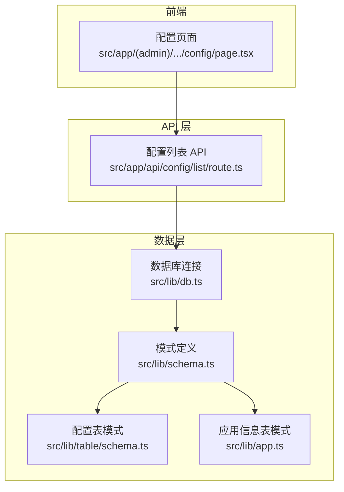
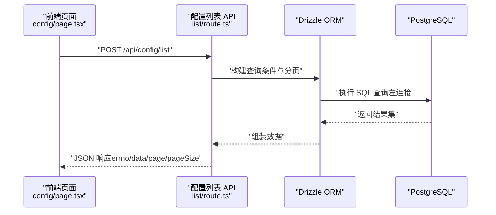
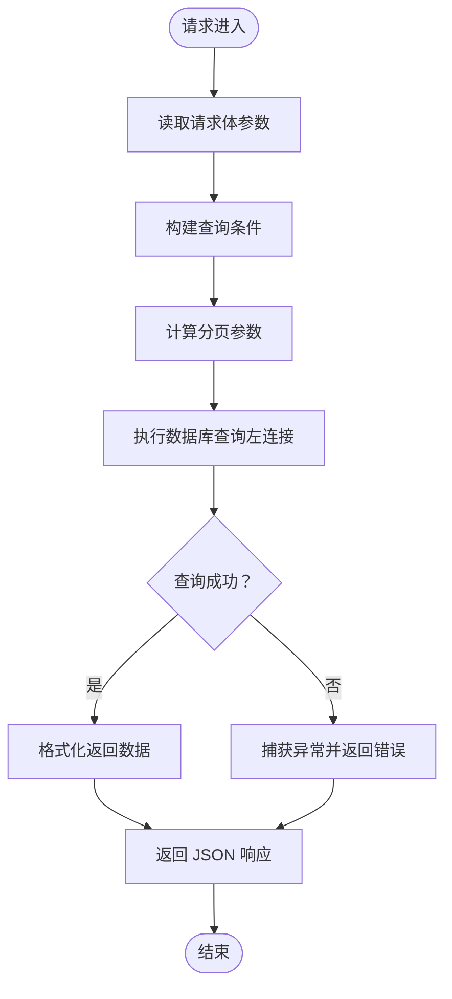
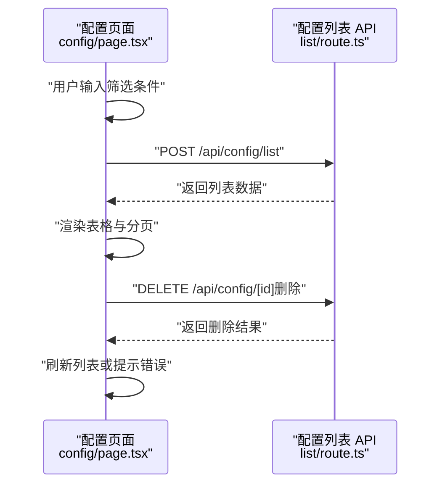
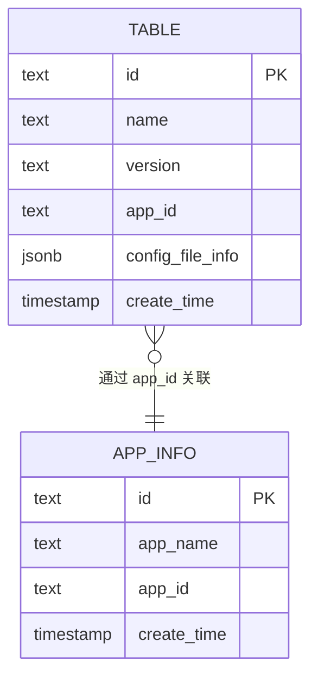
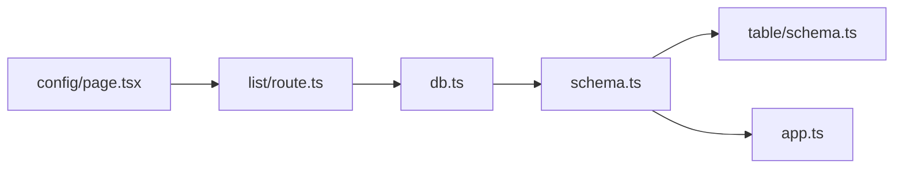

# 应用管理 API

<cite>
**本文档引用的文件**
- [src/app/api/config/list/route.ts](file://src/app/api/config/list/route.ts)
- [src/app/(admin)/(others-pages)/(scene)/config/page.tsx](file://src/app/(admin)/(others-pages)/(scene)/config/page.tsx)
- [src/lib/db.ts](file://src/lib/db.ts)
- [src/lib/schema.ts](file://src/lib/schema.ts)
- [src/lib/table/schema.ts](file://src/lib/table/schema.ts)
- [src/lib/app.ts](file://src/lib/app.ts)
</cite>

## 目录
1. [简介](#简介)
2. [项目结构](#项目结构)
3. [核心组件](#核心组件)
4. [架构总览](#架构总览)
5. [详细组件分析](#详细组件分析)
6. [依赖关系分析](#依赖关系分析)
7. [性能考虑](#性能考虑)
8. [故障排除指南](#故障排除指南)
9. [结论](#结论)
10. [附录](#附录)

## 简介
本文件面向需要管理多个应用实例的开发者，系统性梳理并文档化“应用管理 API”的设计与实现，包括：
- 应用注册与配置：通过配置表记录应用信息与版本，支持按名称、应用 ID、版本进行筛选。
- 配置生命周期管理：提供配置列表查询、新增配置（前端页面）、编辑与删除等能力。
- 权限控制与安全：当前实现未包含鉴权逻辑，建议在生产环境增加认证与授权中间件。
- 数据同步机制：基于 PostgreSQL 的关系型数据模型，通过 Drizzle ORM 进行读写操作。
- 应用间通信与数据共享：通过配置表中的 appId 字段关联到应用信息表，实现跨应用的数据映射。

## 项目结构
该应用采用 Next.js App Router 结构，API 路由位于 src/app/api 下，数据库访问与模式定义位于 src/lib 中。前端页面位于 src/app/(admin)/... 路径下，负责调用 API 并展示结果。

**图表来源**
- [src/app/api/config/list/route.ts:1-77](file://src/app/api/config/list/route.ts#L1-L77)
- [src/app/(admin)/(others-pages)/(scene)/config/page.tsx](file://src/app/(admin)/(others-pages)/(scene)/config/page.tsx#L1-L370)
- [src/lib/db.ts:1-19](file://src/lib/db.ts#L1-L19)
- [src/lib/schema.ts:1-24](file://src/lib/schema.ts#L1-L24)
- [src/lib/table/schema.ts:1-26](file://src/lib/table/schema.ts#L1-L26)
- [src/lib/app.ts:1-9](file://src/lib/app.ts#L1-L9)

**章节来源**
- [src/app/api/config/list/route.ts:1-77](file://src/app/api/config/list/route.ts#L1-L77)
- [src/app/(admin)/(others-pages)/(scene)/config/page.tsx](file://src/app/(admin)/(others-pages)/(scene)/config/page.tsx#L1-L370)
- [src/lib/db.ts:1-19](file://src/lib/db.ts#L1-L19)
- [src/lib/schema.ts:1-24](file://src/lib/schema.ts#L1-L24)
- [src/lib/table/schema.ts:1-26](file://src/lib/table/schema.ts#L1-L26)
- [src/lib/app.ts:1-9](file://src/lib/app.ts#L1-L9)

## 核心组件
- 配置列表 API：接收分页与筛选参数，返回配置列表，并通过左连接关联应用信息。
- 前端配置页面：提供搜索、分页、编辑、详情与删除操作入口。
- 数据库连接与模式：使用 Drizzle ORM 连接 PostgreSQL，定义配置表与应用信息表。
- 数据模型：配置表包含名称、版本、应用 ID、配置文件元信息与创建时间；应用信息表包含应用 ID 与应用名。

关键实现要点：
- 列表查询支持名称模糊匹配、应用 ID 精确匹配、版本精确匹配。
- 分页参数限制在合理范围内，避免过大请求量。
- 返回结构包含 errno、data、page、pageSize，便于前端统一处理。

**章节来源**
- [src/app/api/config/list/route.ts:7-77](file://src/app/api/config/list/route.ts#L7-L77)
- [src/app/(admin)/(others-pages)/(scene)/config/page.tsx](file://src/app/(admin)/(others-pages)/(scene)/config/page.tsx#L64-L93)
- [src/lib/db.ts:1-19](file://src/lib/db.ts#L1-L19)
- [src/lib/schema.ts:15-24](file://src/lib/schema.ts#L15-L24)
- [src/lib/table/schema.ts:15-26](file://src/lib/table/schema.ts#L15-L26)
- [src/lib/app.ts:3-8](file://src/lib/app.ts#L3-L8)

## 架构总览
整体架构遵循“前端页面 → API 路由 → 数据库”的分层设计。前端通过 fetch 调用 API，API 使用 Drizzle ORM 查询数据库，返回标准化响应。

**图表来源**
- [src/app/(admin)/(others-pages)/(scene)/config/page.tsx](file://src/app/(admin)/(others-pages)/(scene)/config/page.tsx#L75-L81)
- [src/app/api/config/list/route.ts:7-77](file://src/app/api/config/list/route.ts#L7-L77)

## 详细组件分析

### 配置列表 API（POST /api/config/list）
职责与流程：
- 接收请求体中的 name、appId、version、page、pageSize 参数。
- 动态构建查询条件：名称模糊匹配、应用 ID 精确匹配、版本精确匹配。
- 计算分页参数，限制每页最大条数，防止资源滥用。
- 执行查询：从配置表左连接应用信息表，选择必要字段。
- 返回标准化响应：errno=0 表示成功，否则携带错误信息与 500 状态码。

**图表来源**
- [src/app/api/config/list/route.ts:7-77](file://src/app/api/config/list/route.ts#L7-L77)

**章节来源**
- [src/app/api/config/list/route.ts:7-77](file://src/app/api/config/list/route.ts#L7-L77)

### 前端配置页面（配置列表）
职责与交互：
- 提供名称、版本、应用 ID 的筛选输入框与重置按钮。
- 调用 /api/config/list 发起查询，展示表格数据与分页控件。
- 支持编辑、详情、删除操作，删除前弹出确认对话框。
- 将配置表中的 appId 映射为应用链接，点击跳转至对应应用详情。

**图表来源**
- [src/app/(admin)/(others-pages)/(scene)/config/page.tsx](file://src/app/(admin)/(others-pages)/(scene)/config/page.tsx#L64-L132)
- [src/app/api/config/list/route.ts:7-77](file://src/app/api/config/list/route.ts#L7-L77)

**章节来源**
- [src/app/(admin)/(others-pages)/(scene)/config/page.tsx](file://src/app/(admin)/(others-pages)/(scene)/config/page.tsx#L48-L370)

### 数据模型与表结构
- 配置表（table）：包含 id、name、version、appId、configFileInfo、createTime。
- 应用信息表（app_info）：包含 id、appName、appId、createTime。
- 类型定义：导出表的 Select/Insert 类型，便于 TypeScript 强类型约束。

**图表来源**
- [src/lib/table/schema.ts:15-26](file://src/lib/table/schema.ts#L15-L26)
- [src/lib/app.ts:3-8](file://src/lib/app.ts#L3-L8)
- [src/lib/schema.ts:15-24](file://src/lib/schema.ts#L15-L24)

**章节来源**
- [src/lib/table/schema.ts:1-26](file://src/lib/table/schema.ts#L1-L26)
- [src/lib/app.ts:1-9](file://src/lib/app.ts#L1-L9)
- [src/lib/schema.ts:1-24](file://src/lib/schema.ts#L1-L24)

## 依赖关系分析
- 前端页面依赖 API 路由进行数据交互。
- API 路由依赖数据库连接与模式定义。
- 模式定义同时引用配置表与应用信息表，形成跨表查询基础。
- 数据库连接使用 Drizzle ORM 与 PostgreSQL Pool，确保连接复用与稳定性。

**图表来源**
- [src/app/(admin)/(others-pages)/(scene)/config/page.tsx](file://src/app/(admin)/(others-pages)/(scene)/config/page.tsx#L1-L370)
- [src/app/api/config/list/route.ts:1-77](file://src/app/api/config/list/route.ts#L1-L77)
- [src/lib/db.ts:1-19](file://src/lib/db.ts#L1-L19)
- [src/lib/schema.ts:1-24](file://src/lib/schema.ts#L1-L24)
- [src/lib/table/schema.ts:1-26](file://src/lib/table/schema.ts#L1-L26)
- [src/lib/app.ts:1-9](file://src/lib/app.ts#L1-L9)

**章节来源**
- [src/app/(admin)/(others-pages)/(scene)/config/page.tsx](file://src/app/(admin)/(others-pages)/(scene)/config/page.tsx#L1-L370)
- [src/app/api/config/list/route.ts:1-77](file://src/app/api/config/list/route.ts#L1-L77)
- [src/lib/db.ts:1-19](file://src/lib/db.ts#L1-L19)
- [src/lib/schema.ts:1-24](file://src/lib/schema.ts#L1-L24)
- [src/lib/table/schema.ts:1-26](file://src/lib/table/schema.ts#L1-L26)
- [src/lib/app.ts:1-9](file://src/lib/app.ts#L1-L9)

## 性能考虑
- 分页参数校验：API 对 page 与 pageSize 进行边界限制，避免超大分页导致数据库压力。
- 查询条件动态拼装：仅在参数有效时添加过滤条件，减少不必要的索引扫描。
- 左连接查询：通过 appId 关联应用信息，避免重复查询，提升列表渲染效率。
- 数据库连接池：使用 PostgreSQL Pool 复用连接，降低连接开销。
- 建议优化点：
  - 为 appId、name、version 添加合适索引，加速查询。
  - 在高并发场景下，结合缓存策略（如 Redis）缓存热门配置列表。
  - 对返回字段进行裁剪，避免传输冗余数据。

**章节来源**
- [src/app/api/config/list/route.ts:25-26](file://src/app/api/config/list/route.ts#L25-L26)
- [src/lib/db.ts:13-16](file://src/lib/db.ts#L13-L16)

## 故障排除指南
- 环境变量缺失：若未设置 POSTGRES_URL，数据库连接会抛出错误。请检查环境变量配置。
- 请求参数异常：当传入的 page 或 pageSize 非法时，API 会进行边界修正；若查询失败，返回 errno=-1 与错误消息。
- 网络错误：前端 fetch 抛出异常时，页面会显示“网络错误，请稍后重试”提示。
- 删除失败：删除接口返回非 errno=0 时，页面会显示具体错误消息。

排查步骤：
- 确认数据库连接字符串正确且可达。
- 检查 API 请求体参数格式与类型。
- 查看浏览器网络面板与服务端日志定位问题。

**章节来源**
- [src/lib/db.ts:7-9](file://src/lib/db.ts#L7-L9)
- [src/app/api/config/list/route.ts:67-76](file://src/app/api/config/list/route.ts#L67-L76)
- [src/app/(admin)/(others-pages)/(scene)/config/page.tsx](file://src/app/(admin)/(others-pages)/(scene)/config/page.tsx#L86-L87)

## 结论
本应用管理 API 以简洁清晰的方式实现了配置列表查询与基础的增删改查能力，配合前端页面提供了良好的用户体验。当前实现未包含鉴权与授权逻辑，建议在生产环境中补充认证中间件与权限控制，以保障数据安全。后续可扩展包括应用注册、状态更新、配置同步与审计日志等功能，进一步完善应用生命周期管理。

## 附录
- API 响应约定：
  - 成功：errno=0，data 为查询结果数组，page 与 pageSize 为当前分页信息。
  - 失败：errno=-1，message 为错误描述。
- 前端调用示例路径：
  - 列表查询：/api/config/list（POST）
  - 删除配置：/api/config/[id]（DELETE）

**章节来源**
- [src/app/api/config/list/route.ts:61-76](file://src/app/api/config/list/route.ts#L61-L76)
- [src/app/(admin)/(others-pages)/(scene)/config/page.tsx](file://src/app/(admin)/(others-pages)/(scene)/config/page.tsx#L75-L119)