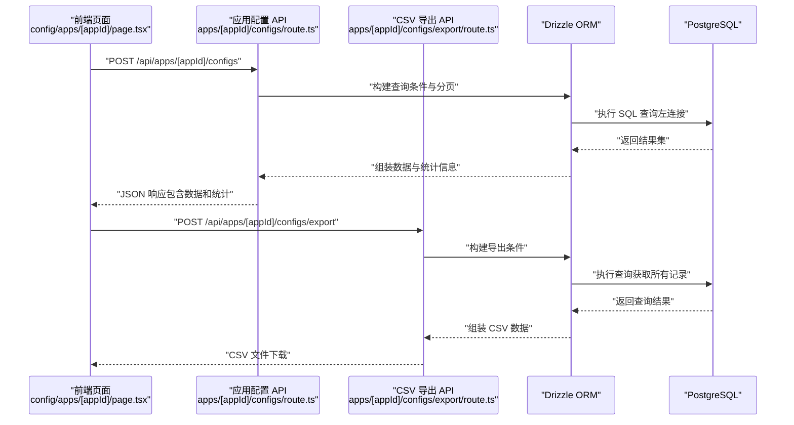
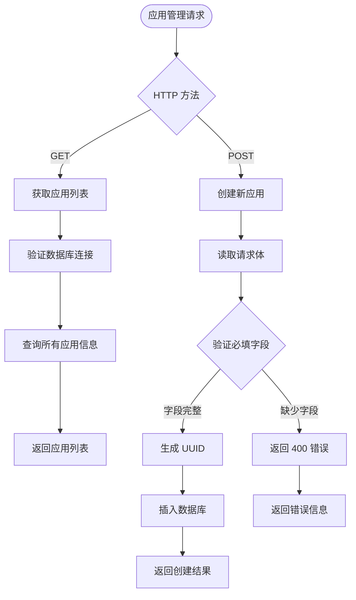
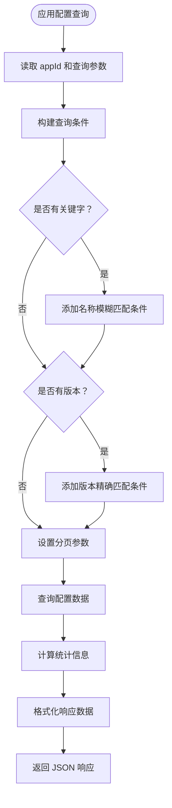
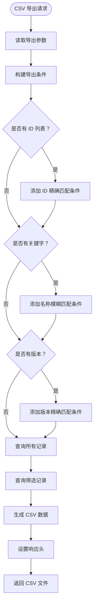
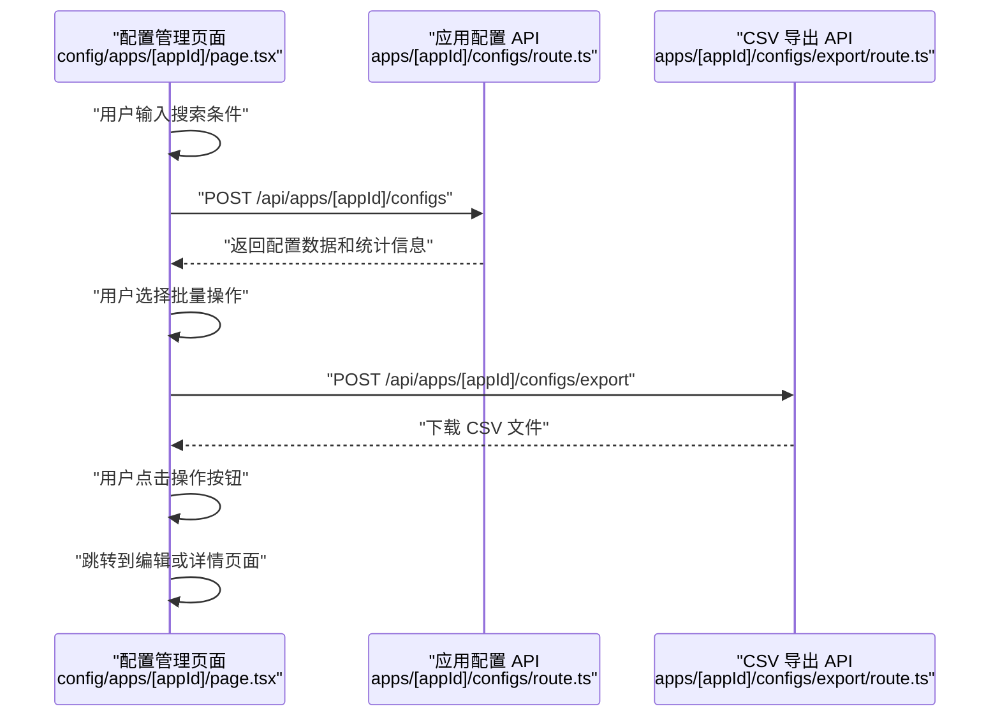
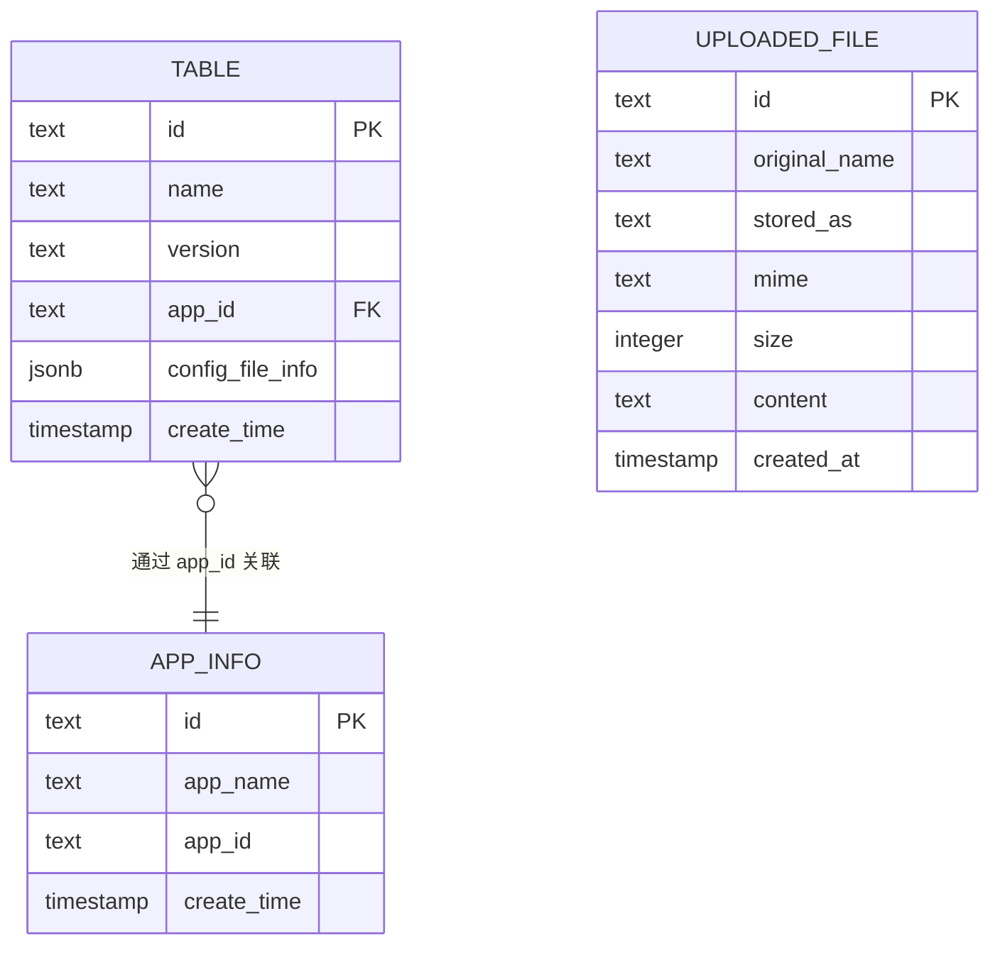
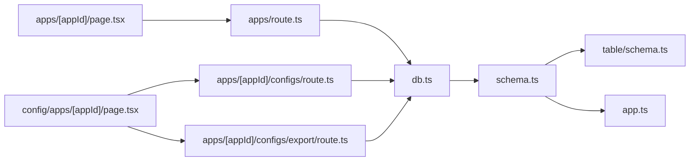

# 应用管理 API

<cite>
**本文档引用的文件**
- [apps/route.ts](file://apps/web/src/app/api/apps/route.ts)
- [apps/[appId]/configs/route.ts](file://apps/web/src/app/api/apps/[appId]/configs/route.ts)
- [apps/[appId]/configs/export/route.ts](file://apps/web/src/app/api/apps/[appId]/configs/export/route.ts)
- [config/[id]/route.ts](file://apps/web/src/app/api/config/[id]/route.ts)
- [config/list/route.ts](file://apps/web/src/app/api/config/list/route.ts)
- [lib/db.ts](file://apps/web/src/lib/db.ts)
- [lib/schema.ts](file://apps/web/src/lib/schema.ts)
- [lib/table/schema.ts](file://apps/web/src/lib/table/schema.ts)
- [lib/app.ts](file://apps/web/src/lib/app.ts)
- [config/apps/[appId]/page.tsx](file://apps/web/src/app/(admin)/(others-pages)/(scene)/config/apps/[appId]/page.tsx)
</cite>

## 更新摘要
**所做更改**
- 新增完整的应用管理 CRUD 操作文档
- 添加 UUID 生成机制说明
- 更新数据库集成架构描述
- 新增 CSV 导出功能文档
- 扩展应用配置管理功能说明
- 更新前端应用配置页面实现

## 目录
1. [简介](#简介)
2. [项目结构](#项目结构)
3. [核心组件](#核心组件)
4. [架构总览](#架构总览)
5. [详细组件分析](#详细组件分析)
6. [依赖关系分析](#依赖关系分析)
7. [性能考虑](#性能考虑)
8. [故障排除指南](#故障排除指南)
9. [结论](#结论)
10. [附录](#附录)

## 简介
本文件面向需要管理多个应用实例的开发者，系统性梳理并文档化"应用管理 API"的完整设计与实现，包括：
- **应用注册与管理**：完整的 CRUD 操作，支持 UUID 自动生成、应用信息存储与查询
- **配置管理**：应用级配置列表查询、统计信息、版本管理与批量操作
- **数据导出**：CSV 格式导出功能，支持多条件筛选与批量选择
- **权限控制与安全**：当前实现未包含鉴权逻辑，建议在生产环境增加认证与授权中间件
- **数据同步机制**：基于 PostgreSQL 的关系型数据模型，通过 Drizzle ORM 进行读写操作
- **应用间通信**：通过 appId 字段实现应用与配置的关联管理

## 项目结构
该应用采用 Next.js App Router 结构，API 路由位于 apps/web/src/app/api 下，数据库访问与模式定义位于 apps/web/src/lib 中。前端页面位于 apps/web/src/app/(admin)/... 路径下，负责调用 API 并展示结果。

```mermaid
graph TB
subgraph "前端"
APPS_PAGE["应用管理页面<br/>apps/[appId]/page.tsx"]
CONFIG_PAGE["配置管理页面<br/>config/apps/[appId]/page.tsx"]
END
subgraph "应用管理 API"
APPS_API["应用 API<br/>apps/route.ts"]
APPS_CONFIG_API["应用配置 API<br/>apps/[appId]/configs/route.ts"]
APPS_EXPORT_API["CSV 导出 API<br/>apps/[appId]/configs/export/route.ts"]
END
subgraph "通用配置 API"
CONFIG_ID_API["配置 CRUD API<br/>config/[id]/route.ts"]
CONFIG_LIST_API["配置列表 API<br/>config/list/route.ts"]
END
subgraph "数据层"
DB["数据库连接<br/>lib/db.ts"]
SCHEMA["模式定义<br/>lib/schema.ts"]
TABLE_SCHEMA["配置表模式<br/>lib/table/schema.ts"]
APP_SCHEMA["应用信息表模式<br/>lib/app.ts"]
END
APPS_PAGE --> APPS_API
CONFIG_PAGE --> APPS_CONFIG_API
CONFIG_PAGE --> APPS_EXPORT_API
APPS_CONFIG_API --> DB
APPS_EXPORT_API --> DB
CONFIG_ID_API --> DB
CONFIG_LIST_API --> DB
DB --> SCHEMA
SCHEMA --> TABLE_SCHEMA
SCHEMA --> APP_SCHEMA
```

**图表来源**
- [apps/web/src/app/api/apps/route.ts:1-53](file://apps/web/src/app/api/apps/route.ts#L1-L53)
- [apps/web/src/app/api/apps/[appId]/configs/route.ts:1-77](file://apps/web/src/app/api/apps/[appId]/configs/route.ts#L1-L77)
- [apps/web/src/app/api/apps/[appId]/configs/export/route.ts:1-78](file://apps/web/src/app/api/apps/[appId]/configs/export/route.ts#L1-L78)
- [apps/web/src/app/api/config/[id]/route.ts:1-81](file://apps/web/src/app/api/config/[id]/route.ts#L1-L81)
- [apps/web/src/app/api/config/list/route.ts:1-77](file://apps/web/src/app/api/config/list/route.ts#L1-L77)
- [apps/web/src/lib/db.ts:1-19](file://apps/web/src/lib/db.ts#L1-L19)
- [apps/web/src/lib/schema.ts:1-23](file://apps/web/src/lib/schema.ts#L1-L23)
- [apps/web/src/lib/table/schema.ts:1-26](file://apps/web/src/lib/table/schema.ts#L1-L26)
- [apps/web/src/lib/app.ts:1-9](file://apps/web/src/lib/app.ts#L1-L9)

## 核心组件
- **应用管理 API**：提供应用的完整 CRUD 操作，支持 UUID 自动生成、应用信息存储与查询
- **应用配置 API**：支持应用级配置列表查询、统计信息、版本管理和分页查询
- **CSV 导出 API**：提供配置数据的批量导出功能，支持多条件筛选
- **通用配置 API**：提供单个配置的 CRUD 操作和全局配置列表查询
- **前端管理页面**：提供应用和配置的可视化管理界面，支持搜索、分页、批量操作

关键实现要点：
- **UUID 生成**：使用 crypto.randomUUID() 和 crypto.randomUUID() 生成唯一标识符
- **数据库集成**：使用 Drizzle ORM 连接 PostgreSQL，支持连接池和事务处理
- **分页与筛选**：支持多条件筛选、分页参数校验和统计信息返回
- **CSV 导出**：支持批量选择、条件筛选和标准 CSV 格式输出

**章节来源**
- [apps/web/src/app/api/apps/route.ts:26-52](file://apps/web/src/app/api/apps/route.ts#L26-L52)
- [apps/web/src/app/api/apps/[appId]/configs/route.ts:10-77](file://apps/web/src/app/api/apps/[appId]/configs/route.ts#L10-L77)
- [apps/web/src/app/api/apps/[appId]/configs/export/route.ts:6-78](file://apps/web/src/app/api/apps/[appId]/configs/export/route.ts#L6-L78)
- [apps/web/src/lib/table/schema.ts:15-26](file://apps/web/src/lib/table/schema.ts#L15-L26)
- [apps/web/src/lib/app.ts:3-8](file://apps/web/src/lib/app.ts#L3-L8)

## 架构总览
整体架构遵循"前端页面 → API 路由 → 数据库"的分层设计。前端通过 fetch 调用 API，API 使用 Drizzle ORM 查询数据库，返回标准化响应。



**图表来源**
- [apps/web/src/app/(admin)/(others-pages)/(scene)/config/apps/[appId]/page.tsx:60-95](file://apps/web/src/app/(admin)/(others-pages)/(scene)/config/apps/[appId]/page.tsx#L60-L95)
- [apps/web/src/app/api/apps/[appId]/configs/route.ts:29-77](file://apps/web/src/app/api/apps/[appId]/configs/route.ts#L29-L77)
- [apps/web/src/app/api/apps/[appId]/configs/export/route.ts:33-78](file://apps/web/src/app/api/apps/[appId]/configs/export/route.ts#L33-L78)

## 详细组件分析

### 应用管理 API（GET/POST /api/apps）
职责与流程：
- **GET 方法**：获取所有应用列表，返回标准化响应
- **POST 方法**：创建新应用，自动生成 UUID，验证必填字段
- **UUID 生成**：使用 crypto.randomUUID() 生成唯一标识符
- **错误处理**：包含完整的异常捕获和错误响应



**图表来源**
- [apps/web/src/app/api/apps/route.ts:7-52](file://apps/web/src/app/api/apps/route.ts#L7-L52)

**章节来源**
- [apps/web/src/app/api/apps/route.ts:7-52](file://apps/web/src/app/api/apps/route.ts#L7-L52)

### 应用配置 API（POST /api/apps/[appId]/configs）
职责与流程：
- **应用级配置查询**：支持关键字搜索、版本筛选、分页查询
- **统计信息**：返回总数、最后更新时间、版本分布
- **多条件筛选**：支持名称模糊匹配、版本精确匹配
- **分页控制**：限制每页最大条数，防止资源滥用



**图表来源**
- [apps/web/src/app/api/apps/[appId]/configs/route.ts:10-77](file://apps/web/src/app/api/apps/[appId]/configs/route.ts#L10-L77)

**章节来源**
- [apps/web/src/app/api/apps/[appId]/configs/route.ts:10-77](file://apps/web/src/app/api/apps/[appId]/configs/route.ts#L10-L77)

### CSV 导出 API（POST /api/apps/[appId]/configs/export）
职责与流程：
- **批量导出**：支持按 ID 列表、关键字、版本进行筛选导出
- **CSV 格式**：生成标准 CSV 文件，包含表头和数据行
- **文件下载**：设置正确的 Content-Type 和 Content-Disposition 头
- **数据处理**：对特殊字符进行转义处理



**图表来源**
- [apps/web/src/app/api/apps/[appId]/configs/export/route.ts:6-78](file://apps/web/src/app/api/apps/[appId]/configs/export/route.ts#L6-L78)

**章节来源**
- [apps/web/src/app/api/apps/[appId]/configs/export/route.ts:6-78](file://apps/web/src/app/api/apps/[appId]/configs/export/route.ts#L6-L78)

### 通用配置 API（GET/PUT/DELETE /api/config/[id]）
职责与流程：
- **GET 方法**：根据 ID 获取单个配置详情
- **PUT 方法**：更新配置信息，验证必填字段
- **DELETE 方法**：删除指定配置，处理不存在的情况
- **标准化响应**：统一的 errno、message、data 结构

**章节来源**
- [apps/web/src/app/api/config/[id]/route.ts:6-81](file://apps/web/src/app/api/config/[id]/route.ts#L6-L81)

### 前端应用配置管理页面
职责与交互：
- **搜索功能**：支持名称关键字和版本精确匹配
- **统计展示**：显示配置总数、最后更新时间和版本分布
- **批量操作**：支持批量删除和批量导出 CSV
- **导航功能**：提供新建、编辑、详情查看功能



**图表来源**
- [apps/web/src/app/(admin)/(others-pages)/(scene)/config/apps/[appId]/page.tsx:60-171](file://apps/web/src/app/(admin)/(others-pages)/(scene)/config/apps/[appId]/page.tsx#L60-L171)

**章节来源**
- [apps/web/src/app/(admin)/(others-pages)/(scene)/config/apps/[appId]/page.tsx:29-315](file://apps/web/src/app/(admin)/(others-pages)/(scene)/config/apps/[appId]/page.tsx#L29-L315)

### 数据模型与表结构
- **应用信息表（app_info）**：包含 id、appName、appId、createTime
- **配置表（table）**：包含 id、name、version、appId、configFileInfo、createTime
- **上传文件表（uploaded_file）**：包含 id、originalName、storedAs、mime、size、content、createdAt
- **类型定义**：导出表的 Select/Insert 类型，便于 TypeScript 强类型约束



**图表来源**
- [apps/web/src/lib/app.ts:3-8](file://apps/web/src/lib/app.ts#L3-L8)
- [apps/web/src/lib/table/schema.ts:15-26](file://apps/web/src/lib/table/schema.ts#L15-L26)
- [apps/web/src/lib/table/schema.ts:3-13](file://apps/web/src/lib/table/schema.ts#L3-L13)

**章节来源**
- [apps/web/src/lib/app.ts:1-9](file://apps/web/src/lib/app.ts#L1-L9)
- [apps/web/src/lib/table/schema.ts:1-26](file://apps/web/src/lib/table/schema.ts#L1-L26)
- [apps/web/src/lib/schema.ts:15-23](file://apps/web/src/lib/schema.ts#L15-L23)

## 依赖关系分析
- **前端页面依赖**：应用管理页面依赖应用 API，配置管理页面依赖应用配置 API 和 CSV 导出 API
- **API 路由依赖**：所有 API 路由依赖数据库连接与模式定义
- **模式定义依赖**：schema.ts 同时引用配置表、应用信息表和上传文件表
- **数据库连接**：使用 Drizzle ORM 与 PostgreSQL Pool，支持连接复用和 SSL 配置



**图表来源**
- [apps/web/src/app/(admin)/(others-pages)/(scene)/config/apps/[appId]/page.tsx:1-315](file://apps/web/src/app/(admin)/(others-pages)/(scene)/config/apps/[appId]/page.tsx#L1-L315)
- [apps/web/src/app/api/apps/route.ts:1-53](file://apps/web/src/app/api/apps/route.ts#L1-L53)
- [apps/web/src/app/api/apps/[appId]/configs/route.ts:1-77](file://apps/web/src/app/api/apps/[appId]/configs/route.ts#L1-L77)
- [apps/web/src/app/api/apps/[appId]/configs/export/route.ts:1-78](file://apps/web/src/app/api/apps/[appId]/configs/export/route.ts#L1-L78)
- [apps/web/src/lib/db.ts:1-19](file://apps/web/src/lib/db.ts#L1-L19)
- [apps/web/src/lib/schema.ts:1-23](file://apps/web/src/lib/schema.ts#L1-L23)
- [apps/web/src/lib/table/schema.ts:1-26](file://apps/web/src/lib/table/schema.ts#L1-L26)
- [apps/web/src/lib/app.ts:1-9](file://apps/web/src/lib/app.ts#L1-L9)

**章节来源**
- [apps/web/src/app/(admin)/(others-pages)/(scene)/config/apps/[appId]/page.tsx:1-315](file://apps/web/src/app/(admin)/(others-pages)/(scene)/config/apps/[appId]/page.tsx#L1-L315)
- [apps/web/src/app/api/apps/route.ts:1-53](file://apps/web/src/app/api/apps/route.ts#L1-L53)
- [apps/web/src/app/api/apps/[appId]/configs/route.ts:1-77](file://apps/web/src/app/api/apps/[appId]/configs/route.ts#L1-L77)
- [apps/web/src/app/api/apps/[appId]/configs/export/route.ts:1-78](file://apps/web/src/app/api/apps/[appId]/configs/export/route.ts#L1-L78)
- [apps/web/src/lib/db.ts:1-19](file://apps/web/src/lib/db.ts#L1-L19)
- [apps/web/src/lib/schema.ts:1-23](file://apps/web/src/lib/schema.ts#L1-L23)
- [apps/web/src/lib/table/schema.ts:1-26](file://apps/web/src/lib/table/schema.ts#L1-L26)
- [apps/web/src/lib/app.ts:1-9](file://apps/web/src/lib/app.ts#L1-L9)

## 性能考虑
- **分页参数校验**：API 对 page 与 pageSize 进行边界限制，避免超大分页导致数据库压力
- **查询条件动态拼装**：仅在参数有效时添加过滤条件，减少不必要的索引扫描
- **统计信息优化**：分别计算总数、获取最新更新时间和版本分布，避免重复查询
- **CSV 导出优化**：支持条件筛选，避免导出全量数据造成内存压力
- **数据库连接池**：使用 PostgreSQL Pool 复用连接，降低连接开销
- **UUID 生成**：使用原生 crypto 模块生成 UUID，性能优于 JavaScript 实现
- **建议优化点**：
  - 为 appId、name、version 添加合适索引，加速查询
  - 在高并发场景下，结合缓存策略（如 Redis）缓存热门应用配置
  - 对返回字段进行裁剪，避免传输冗余数据
  - 实现查询结果缓存机制

**章节来源**
- [apps/web/src/app/api/apps/[appId]/configs/route.ts:26-27](file://apps/web/src/app/api/apps/[appId]/configs/route.ts#L26-L27)
- [apps/web/src/lib/db.ts:13-18](file://apps/web/src/lib/db.ts#L13-L18)
- [apps/web/src/lib/table/schema.ts:4-6](file://apps/web/src/lib/table/schema.ts#L4-L6)

## 故障排除指南
- **环境变量缺失**：若未设置 POSTGRES_URL，数据库连接会抛出错误。请检查环境变量配置
- **UUID 生成失败**：crypto 模块不可用时，检查 Node.js 版本和运行环境
- **请求参数异常**：当传入的 page 或 pageSize 非法时，API 会进行边界修正
- **CSV 导出失败**：检查导出条件和数据库连接状态
- **网络错误**：前端 fetch 抛出异常时，页面会显示"网络错误，请稍后重试"提示
- **权限问题**：当前实现未包含鉴权逻辑，建议在生产环境中补充认证中间件

排查步骤：
- 确认数据库连接字符串正确且可达
- 检查 API 请求体参数格式与类型
- 验证 UUID 生成模块可用性
- 查看浏览器网络面板与服务端日志定位问题

**章节来源**
- [apps/web/src/lib/db.ts:7-9](file://apps/web/src/lib/db.ts#L7-L9)
- [apps/web/src/app/api/apps/route.ts:28](file://apps/web/src/app/api/apps/route.ts#L28)
- [apps/web/src/app/api/apps/[appId]/configs/export/route.ts:68-77](file://apps/web/src/app/api/apps/[appId]/configs/export/route.ts#L68-L77)

## 结论
新的应用管理 API 提供了完整的 CRUD 操作能力，包括 UUID 生成、数据库集成、CSV 导出等功能，完全替代了原有的简单应用列表功能。系统以简洁清晰的方式实现了应用注册、配置管理、统计分析和数据导出等核心功能，配合前端页面提供了良好的用户体验。

当前实现未包含鉴权与授权逻辑，建议在生产环境中补充认证中间件与权限控制，以保障数据安全。后续可扩展包括应用状态管理、配置同步与审计日志等功能，进一步完善应用生命周期管理。

## 附录
- **API 响应约定**：
  - 成功：errno=0，data 为查询结果数组，page 与 pageSize 为当前分页信息
  - 失败：errno=-1，message 为错误描述
- **前端调用示例路径**：
  - 应用列表：/api/apps（GET）
  - 创建应用：/api/apps（POST）
  - 应用配置列表：/api/apps/[appId]/configs（POST）
  - CSV 导出：/api/apps/[appId]/configs/export（POST）
  - 单个配置：/api/config/[id]（GET/PUT/DELETE）
  - 全局配置列表：/api/config/list（POST）

**章节来源**
- [apps/web/src/app/api/apps/route.ts:10-23](file://apps/web/src/app/api/apps/route.ts#L10-L23)
- [apps/web/src/app/api/apps/[appId]/configs/route.ts:55-65](file://apps/web/src/app/api/apps/[appId]/configs/route.ts#L55-L65)
- [apps/web/src/app/api/apps/[appId]/configs/export/route.ts:62-67](file://apps/web/src/app/api/apps/[appId]/configs/export/route.ts#L62-L67)
- [apps/web/src/app/api/config/[id]/route.ts:14-23](file://apps/web/src/app/api/config/[id]/route.ts#L14-L23)
- [apps/web/src/app/api/config/list/route.ts:61-76](file://apps/web/src/app/api/config/list/route.ts#L61-L76)