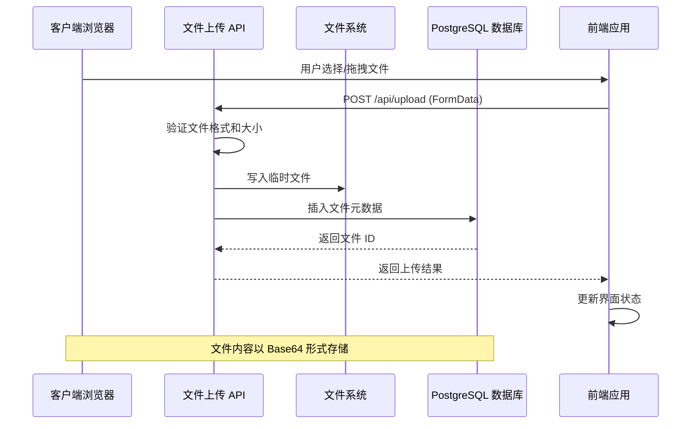
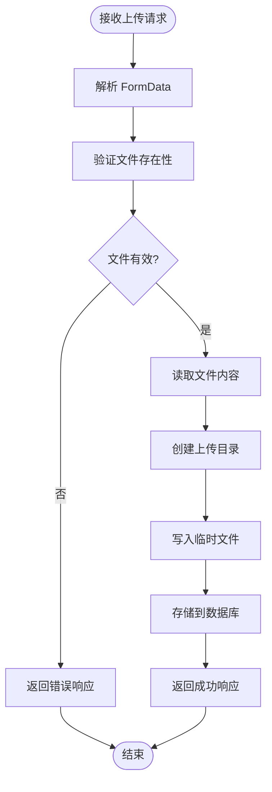
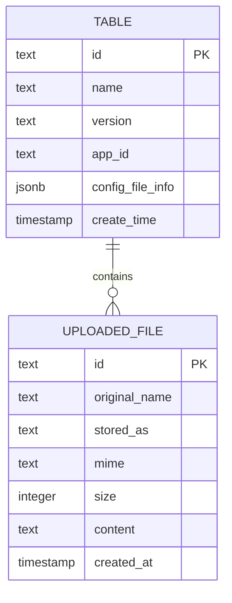
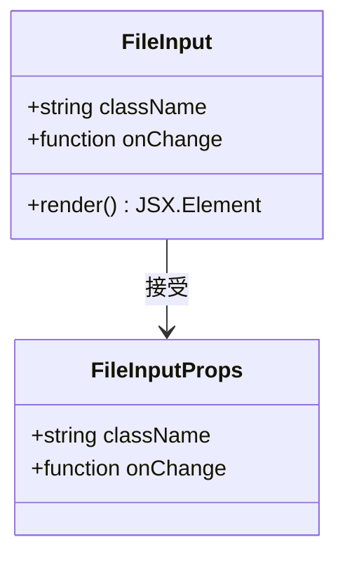
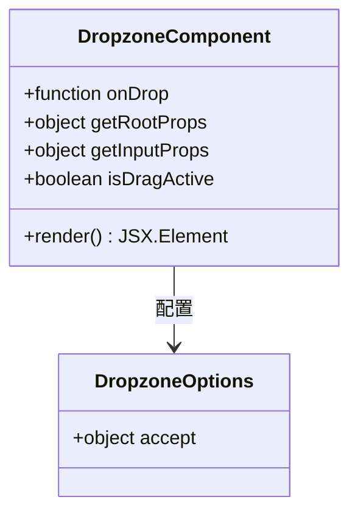
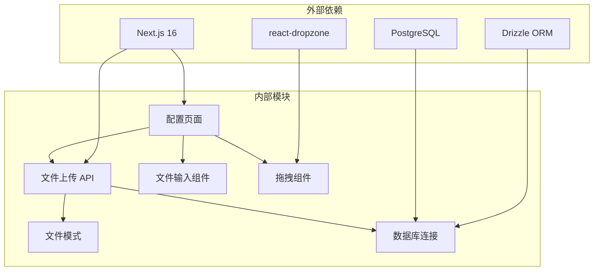

# 文件上传 API 文档

<cite>
**本文档引用的文件**
- [src/app/api/upload/route.ts](file://src/app/api/upload/route.ts)
- [src/lib/file/schema.ts](file://src/lib/file/schema.ts)
- [src/lib/schema.ts](file://src/lib/schema.ts)
- [src/lib/db.ts](file://src/lib/db.ts)
- [src/app/(admin)/(others-pages)/(scene)/config/new/page.tsx](file://src/app/(admin)/(others-pages)/(scene)/config/new/page.tsx)
- [src/components/form/input/FileInput.tsx](file://src/components/form/input/FileInput.tsx)
- [src/components/form/form-elements/DropZone.tsx](file://src/components/form/form-elements/DropZone.tsx)
- [src/lib/table/schema.ts](file://src/lib/table/schema.ts)
- [package.json](file://package.json)
</cite>

## 目录
1. [简介](#简介)
2. [项目结构](#项目结构)
3. [核心组件](#核心组件)
4. [架构概览](#架构概览)
5. [详细组件分析](#详细组件分析)
6. [依赖关系分析](#依赖关系分析)
7. [性能考虑](#性能考虑)
8. [故障排除指南](#故障排除指南)
9. [结论](#结论)

## 简介

本文档详细介绍了 Next.js 管理系统中的文件上传 API。该系统实现了完整的文件上传、存储和管理功能，支持多种文件格式，包括图片（PNG、JPG、WebP、SVG）和其他类型的文件。

系统采用现代化的技术栈，使用 Next.js 16、Drizzle ORM、PostgreSQL 数据库和 React 组件库构建。文件上传功能通过 API 路由实现，支持前端拖拽上传和传统文件选择两种方式。

## 项目结构

文件上传功能涉及以下关键目录和文件：

```mermaid
graph TB
subgraph "API 层"
UploadRoute[src/app/api/upload/route.ts<br/>文件上传 API 路由]
end
subgraph "数据层"
Schema[src/lib/file/schema.ts<br/>文件表结构定义]
DBSchema[src/lib/schema.ts<br/>数据库模式导出]
DBConfig[src/lib/db.ts<br/>数据库连接配置]
end
subgraph "前端组件层"
ConfigPage[src/app/(admin)/(others-pages)/(scene)/config/new/page.tsx<br/>配置页面]
FileInput[src/components/form/input/FileInput.tsx<br/>文件输入组件]
DropZone[src/components/form/form-elements/DropZone.tsx<br/>拖拽上传组件]
end
subgraph "数据库层"
Postgres[(PostgreSQL 数据库)]
end
UploadRoute --> Schema
UploadRoute --> DBConfig
DBConfig --> Postgres
ConfigPage --> UploadRoute
FileInput --> ConfigPage
DropZone --> ConfigPage
```

**图表来源**
- [src/app/api/upload/route.ts:1-63](file://src/app/api/upload/route.ts#L1-L63)
- [src/lib/file/schema.ts:1-14](file://src/lib/file/schema.ts#L1-L14)
- [src/lib/db.ts:1-19](file://src/lib/db.ts#L1-L19)

**章节来源**
- [src/app/api/upload/route.ts:1-63](file://src/app/api/upload/route.ts#L1-L63)
- [src/lib/file/schema.ts:1-14](file://src/lib/file/schema.ts#L1-L14)
- [src/lib/db.ts:1-19](file://src/lib/db.ts#L1-L19)

## 核心组件

### 文件上传 API 路由

文件上传功能的核心是位于 `src/app/api/upload/route.ts` 的 API 路由。该路由处理客户端的文件上传请求，执行文件验证、存储和数据库记录操作。

主要功能特性：
- 支持多种文件格式（图片和非图片文件）
- 文件大小验证和错误处理
- 临时文件存储到系统临时目录
- 数据库存储文件元数据
- Base64 编码文件内容存储

### 数据库模式定义

文件信息存储在 PostgreSQL 数据库中，使用 Drizzle ORM 进行类型安全的数据库操作。文件表包含以下字段：
- `id`: 主键，UUID 格式
- `originalName`: 原始文件名
- `storedAs`: 存储后的文件名
- `mime`: MIME 类型
- `size`: 文件大小（字节）
- `content`: Base64 编码的文件内容
- `createdAt`: 创建时间戳

### 前端上传组件

系统提供了多种前端上传组件：
- **FileInput**: 基础文件输入组件，支持自定义样式
- **DropZone**: 拖拽上传组件，支持拖拽操作和文件预览
- **配置页面**: 集成上传功能的完整配置界面

**章节来源**
- [src/app/api/upload/route.ts:9-62](file://src/app/api/upload/route.ts#L9-L62)
- [src/lib/file/schema.ts:3-13](file://src/lib/file/schema.ts#L3-L13)
- [src/components/form/input/FileInput.tsx:1-19](file://src/components/form/input/FileInput.tsx#L1-L19)
- [src/components/form/form-elements/DropZone.tsx:1-78](file://src/components/form/form-elements/DropZone.tsx#L1-L78)

## 架构概览

文件上传系统的整体架构采用分层设计：



**图表来源**
- [src/app/api/upload/route.ts:9-49](file://src/app/api/upload/route.ts#L9-L49)
- [src/app/(admin)/(others-pages)/(scene)/config/new/page.tsx:84-108](file://src/app/(admin)/(others-pages)/(scene)/config/new/page.tsx#L84-L108)

系统架构特点：
- **异步处理**: 所有文件操作都是异步执行
- **错误处理**: 完善的错误捕获和用户友好的错误消息
- **安全性**: 文件类型验证和大小限制
- **可扩展性**: 支持未来添加更多文件处理功能

## 详细组件分析

### API 路由实现

文件上传 API 路由实现了完整的文件处理流程：



**图表来源**
- [src/app/api/upload/route.ts:9-62](file://src/app/api/upload/route.ts#L9-L62)

关键实现细节：
- **文件验证**: 检查文件是否存在且为有效的 File 对象
- **临时存储**: 将文件写入系统临时目录，使用时间戳确保文件名唯一性
- **数据库存储**: 插入文件元数据，包括原始名称、存储路径、MIME 类型、大小等
- **Base64 编码**: 将文件内容转换为 Base64 字符串存储

### 数据库模式设计

文件表结构设计考虑了以下需求：



**图表来源**
- [src/lib/file/schema.ts:3-13](file://src/lib/file/schema.ts#L3-L13)
- [src/lib/table/schema.ts:15-25](file://src/lib/table/schema.ts#L15-L25)

设计特点：
- **UUID 主键**: 确保全局唯一性和安全性
- **JSONB 存储**: 支持灵活的配置文件信息存储
- **索引优化**: 关键字段建立适当的索引提高查询性能

### 前端上传组件

前端提供了多种文件上传体验：

#### FileInput 组件
基础文件输入组件，支持自定义样式和事件处理：



**图表来源**
- [src/components/form/input/FileInput.tsx:3-18](file://src/components/form/input/FileInput.tsx#L3-L18)

#### DropZone 组件
高级拖拽上传组件，提供更好的用户体验：



**图表来源**
- [src/components/form/form-elements/DropZone.tsx:6-20](file://src/components/form/form-elements/DropZone.tsx#L6-L20)

**章节来源**
- [src/app/api/upload/route.ts:9-62](file://src/app/api/upload/route.ts#L9-L62)
- [src/lib/file/schema.ts:3-13](file://src/lib/file/schema.ts#L3-L13)
- [src/components/form/input/FileInput.tsx:1-19](file://src/components/form/input/FileInput.tsx#L1-L19)
- [src/components/form/form-elements/DropZone.tsx:1-78](file://src/components/form/form-elements/DropZone.tsx#L1-L78)

## 依赖关系分析

系统依赖关系图展示了各组件之间的相互作用：



**图表来源**
- [package.json:15-49](file://package.json#L15-L49)
- [src/app/api/upload/route.ts:1-7](file://src/app/api/upload/route.ts#L1-L7)

主要依赖说明：
- **Next.js**: 提供 API 路由和服务器端渲染能力
- **Drizzle ORM**: 类型安全的数据库操作库
- **PostgreSQL**: 关系型数据库存储
- **react-dropzone**: 拖拽上传功能实现
- **dotenv**: 环境变量管理

**章节来源**
- [package.json:1-79](file://package.json#L1-L79)
- [src/app/api/upload/route.ts:1-7](file://src/app/api/upload/route.ts#L1-L7)

## 性能考虑

### 存储策略

系统采用混合存储策略：
- **临时文件存储**: 使用系统临时目录进行快速文件写入
- **数据库存储**: 存储文件元数据和 Base64 编码的内容
- **内存管理**: 大文件可能导致内存压力，需要考虑优化

### 性能优化建议

1. **文件大小限制**: 当前实现没有明确的文件大小限制，建议添加合理的大小限制
2. **并发处理**: 考虑添加并发上传限制，避免系统过载
3. **缓存机制**: 对于频繁访问的文件，可以考虑添加缓存层
4. **CDN 集成**: 生产环境中建议集成 CDN 提升文件访问速度

### 错误处理和监控

系统实现了完善的错误处理机制：
- **文件验证错误**: 返回清晰的错误信息
- **数据库连接错误**: 提供友好的错误提示
- **文件写入错误**: 记录详细的错误日志
- **网络异常处理**: 前端组件处理各种网络异常情况

**章节来源**
- [src/app/api/upload/route.ts:50-61](file://src/app/api/upload/route.ts#L50-L61)
- [src/app/(admin)/(others-pages)/(scene)/config/new/page.tsx:104-108](file://src/app/(admin)/(others-pages)/(scene)/config/new/page.tsx#L104-L108)

## 故障排除指南

### 常见问题及解决方案

#### 1. 文件上传失败
**症状**: 上传过程中出现错误，无法完成文件上传
**可能原因**:
- 文件格式不被支持
- 文件大小超过限制
- 数据库连接失败
- 磁盘空间不足

**解决方法**:
- 检查文件格式是否在允许列表内
- 验证文件大小是否合理
- 确认数据库连接正常
- 检查磁盘空间和权限

#### 2. 数据库连接问题
**症状**: 上传成功但数据库记录缺失
**可能原因**:
- POSTGRES_URL 环境变量未正确设置
- 数据库连接池配置错误
- 网络连接不稳定

**解决方法**:
- 验证环境变量配置
- 检查数据库服务状态
- 确认网络连接稳定

#### 3. 前端上传组件问题
**症状**: 拖拽上传或文件选择功能异常
**可能原因**:
- react-dropzone 版本兼容性问题
- 权限设置不当
- 浏览器兼容性问题

**解决方法**:
- 更新 react-dropzone 到最新版本
- 检查文件权限设置
- 测试不同浏览器的兼容性

### 调试技巧

1. **启用详细日志**: 在开发环境中启用更详细的错误日志
2. **检查网络请求**: 使用浏览器开发者工具检查 API 请求和响应
3. **验证数据库状态**: 确认文件记录已正确插入数据库
4. **测试文件完整性**: 下载上传的文件验证内容完整性

**章节来源**
- [src/app/api/upload/route.ts:50-61](file://src/app/api/upload/route.ts#L50-L61)
- [src/lib/db.ts:7-9](file://src/lib/db.ts#L7-L9)

## 结论

文件上传 API 是一个功能完整、设计合理的系统组件，具有以下优点：

**技术优势**:
- 采用现代化的技术栈和最佳实践
- 实现了完整的错误处理和用户反馈机制
- 支持多种文件格式和上传方式
- 具备良好的可扩展性和维护性

**功能特性**:
- 支持拖拽上传和传统文件选择
- 完整的文件元数据管理
- Base64 编码的内容存储
- 类型安全的数据库操作

**改进建议**:
- 添加文件大小限制和类型验证
- 考虑实现分块上传以支持大文件
- 集成 CDN 和缓存机制提升性能
- 添加文件预览和缩略图生成功能

该系统为后续的功能扩展奠定了良好的基础，可以根据具体需求进一步完善和优化。