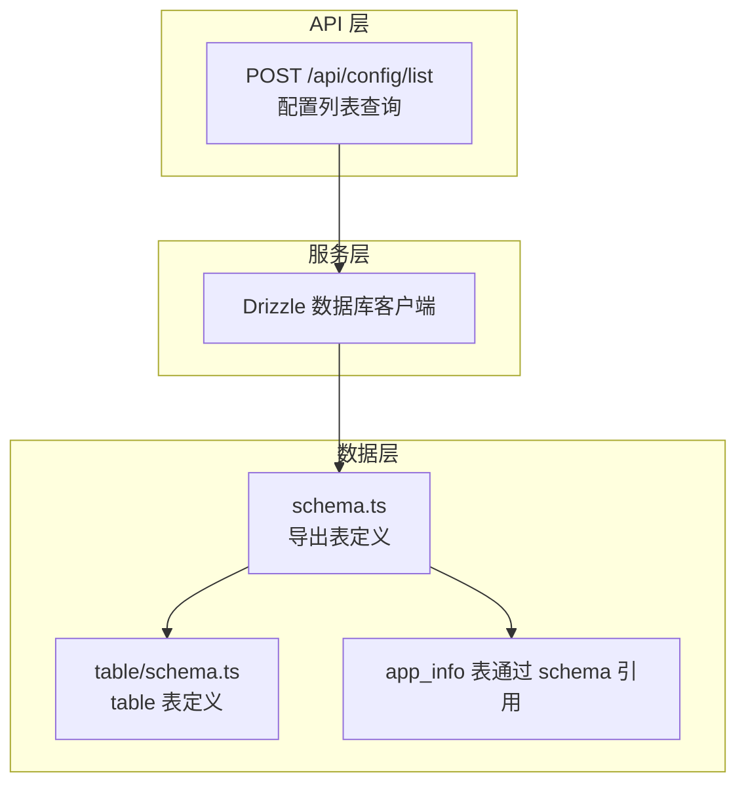
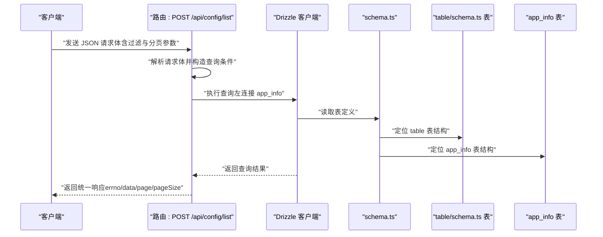
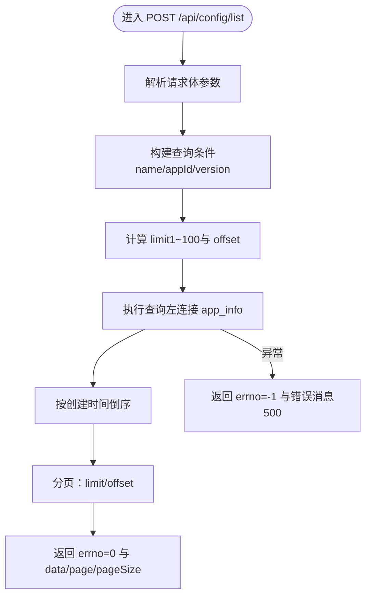
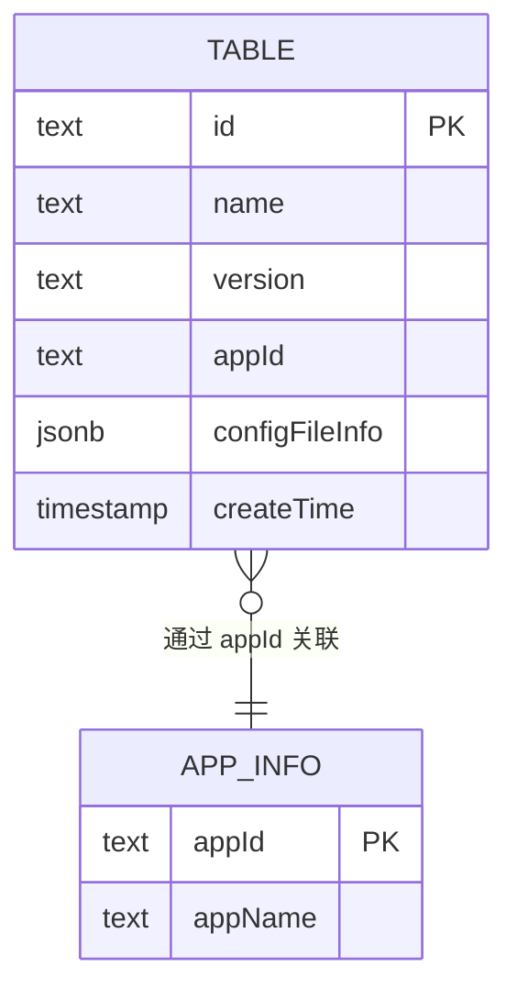
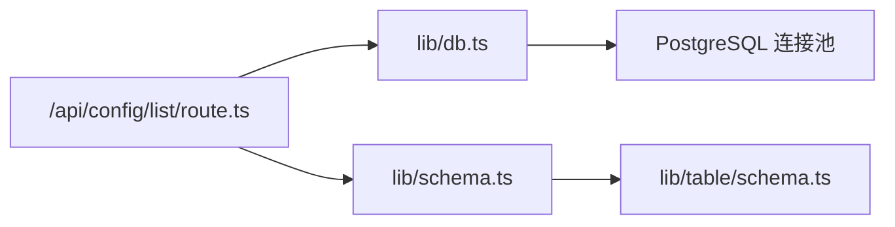

# 配置管理 API

<cite>
**本文引用的文件**
- [src/app/api/config/list/route.ts](file://src/app/api/config/list/route.ts)
- [src/lib/db.ts](file://src/lib/db.ts)
- [src/lib/schema.ts](file://src/lib/schema.ts)
- [src/lib/table/schema.ts](file://src/lib/table/schema.ts)
</cite>

## 目录
1. [简介](#简介)
2. [项目结构](#项目结构)
3. [核心组件](#核心组件)
4. [架构总览](#架构总览)
5. [详细组件分析](#详细组件分析)
6. [依赖关系分析](#依赖关系分析)
7. [性能考虑](#性能考虑)
8. [故障排除指南](#故障排除指南)
9. [结论](#结论)

## 简介
本文件面向需要管理应用配置的开发者，系统性地文档化“配置管理 API”的设计与实现，覆盖以下能力：
- 单个配置获取（通过 ID）
- 配置列表查询（支持分页、排序、过滤）
- 配置创建（新增）
- 配置更新（修改）
- 配置删除（移除）

同时，文档明确请求参数格式、响应数据结构、HTTP 状态码含义，并给出错误处理示例与常见问题解决方案。

## 项目结构
配置管理 API 的核心路由位于 Next.js App Router 的 API 路径中，配合 Drizzle ORM 进行数据库访问，数据模型定义在独立的 schema 文件中。

图表来源
- [src/app/api/config/list/route.ts:1-77](file://src/app/api/config/list/route.ts#L1-L77)
- [src/lib/db.ts:1-19](file://src/lib/db.ts#L1-L19)
- [src/lib/schema.ts:1-24](file://src/lib/schema.ts#L1-L24)
- [src/lib/table/schema.ts:1-26](file://src/lib/table/schema.ts#L1-L26)

章节来源
- [src/app/api/config/list/route.ts:1-77](file://src/app/api/config/list/route.ts#L1-L77)
- [src/lib/db.ts:1-19](file://src/lib/db.ts#L1-L19)
- [src/lib/schema.ts:1-24](file://src/lib/schema.ts#L1-L24)
- [src/lib/table/schema.ts:1-26](file://src/lib/table/schema.ts#L1-L26)

## 核心组件
- 列表查询接口：POST /api/config/list
  - 支持按名称模糊匹配、按应用 ID 精确匹配、按版本精确匹配
  - 支持分页参数 page、pageSize（最大 100 条/页）
  - 默认按创建时间倒序返回
  - 返回结构包含 errno、data、page、pageSize

章节来源
- [src/app/api/config/list/route.ts:7-77](file://src/app/api/config/list/route.ts#L7-L77)

## 架构总览
下图展示从客户端到数据库的调用链路与数据流：

图表来源
- [src/app/api/config/list/route.ts:7-77](file://src/app/api/config/list/route.ts#L7-L77)
- [src/lib/db.ts:1-19](file://src/lib/db.ts#L1-L19)
- [src/lib/schema.ts:1-24](file://src/lib/schema.ts#L1-L24)
- [src/lib/table/schema.ts:1-26](file://src/lib/table/schema.ts#L1-L26)

## 详细组件分析

### 接口：配置列表查询（POST /api/config/list）
- 方法与路径
  - POST /api/config/list
- 功能描述
  - 支持多条件过滤（名称模糊、应用 ID、版本）、分页、默认按创建时间倒序
- 请求体参数
  - name: 可选，字符串，用于名称模糊匹配
  - appId: 可选，字符串，用于应用 ID 精确匹配
  - version: 可选，字符串，用于版本精确匹配
  - page: 可选，默认 1，数值型
  - pageSize: 可选，默认 10，数值型，上限 100
- 响应体字段
  - errno: 数值，0 表示成功，非 0 表示失败
  - data: 数组，每项包含 id、name、version、appId、configFileInfo、createTime、appName
  - page: 当前页码
  - pageSize: 实际每页条数
- HTTP 状态码
  - 200 成功
  - 500 服务器内部错误（当发生异常时）
- 错误处理
  - 捕获异常后返回 errno=-1 与错误消息，状态码 500

图表来源
- [src/app/api/config/list/route.ts:7-77](file://src/app/api/config/list/route.ts#L7-L77)

章节来源
- [src/app/api/config/list/route.ts:7-77](file://src/app/api/config/list/route.ts#L7-L77)

### 数据模型与表结构
- 表：table
  - 字段：id、name、version、appId、configFileInfo、createTime
  - configFileInfo 类型为 JSONB，包含 id 与 filename
- 表：app_info
  - 通过 schema 引用，用于与 table 左连接获取 appName
- 关系
  - table.appId → app_info.appId

图表来源
- [src/lib/table/schema.ts:15-25](file://src/lib/table/schema.ts#L15-L25)
- [src/lib/schema.ts:10-17](file://src/lib/schema.ts#L10-L17)

章节来源
- [src/lib/table/schema.ts:1-26](file://src/lib/table/schema.ts#L1-L26)
- [src/lib/schema.ts:1-24](file://src/lib/schema.ts#L1-L24)

### 其他 CRUD 接口（概念说明）
当前仓库仅提供“配置列表查询”接口。若需实现其他 CRUD 操作（单个配置获取、创建、更新、删除），可参考以下通用设计建议（概念性内容，不绑定具体源码）：
- 获取单个配置
  - GET /api/config/[id]：根据 id 查询，返回单条记录或 404
- 创建配置
  - POST /api/config：接收 name、version、appId、configFileInfo 等，校验必填并写入数据库
- 更新配置
  - PUT /api/config/[id]：按 id 更新，支持部分字段更新
- 删除配置
  - DELETE /api/config/[id]：按 id 删除，返回删除结果

上述接口的实现应遵循与现有列表接口一致的错误处理风格（errno、message、状态码）。

## 依赖关系分析
- 路由依赖 Drizzle ORM 与数据库连接
- Drizzle 依赖 PostgreSQL 连接池（Pool）
- schema.ts 统一导出表定义，供路由与查询使用
- table/schema.ts 定义实际表结构与字段类型

图表来源
- [src/app/api/config/list/route.ts:1-77](file://src/app/api/config/list/route.ts#L1-L77)
- [src/lib/db.ts:1-19](file://src/lib/db.ts#L1-L19)
- [src/lib/schema.ts:1-24](file://src/lib/schema.ts#L1-L24)
- [src/lib/table/schema.ts:1-26](file://src/lib/table/schema.ts#L1-L26)

章节来源
- [src/app/api/config/list/route.ts:1-77](file://src/app/api/config/list/route.ts#L1-L77)
- [src/lib/db.ts:1-19](file://src/lib/db.ts#L1-L19)
- [src/lib/schema.ts:1-24](file://src/lib/schema.ts#L1-L24)
- [src/lib/table/schema.ts:1-26](file://src/lib/table/schema.ts#L1-L26)

## 性能考虑
- 分页限制
  - 每页最大 100 条，避免过大查询负载
- 排序策略
  - 默认按创建时间倒序，利于快速获取最新配置
- 查询优化建议（概念性）
  - 为 appId、version 建立索引以提升过滤效率
  - 对 name 使用 ILIKE 时考虑建立文本索引或使用更高效的全文检索方案
  - 合理使用 LIMIT/OFFSET，避免超大偏移导致的性能退化

## 故障排除指南
- 环境变量缺失
  - 现象：启动时报错提示缺少 POSTGRES_URL
  - 处理：确保环境变量已正确设置
- 数据库连接失败
  - 现象：路由执行报错或超时
  - 处理：检查连接串、网络连通性、SSL 设置（neon.tech 场景已内置 SSL 适配）
- 查询异常
  - 现象：返回 errno=-1 与错误消息，状态码 500
  - 处理：查看服务端日志中的错误堆栈，确认 SQL 条件与表结构是否匹配
- 参数非法
  - 现象：分页参数越界或超出上限
  - 处理：确保 page≥1，pageSize 在 1~100 范围内

章节来源
- [src/lib/db.ts:7-9](file://src/lib/db.ts#L7-L9)
- [src/app/api/config/list/route.ts:67-76](file://src/app/api/config/list/route.ts#L67-L76)

## 结论
本仓库提供了配置管理 API 的基础能力：通过 POST /api/config/list 实现带过滤与分页的配置列表查询。后续如需完善功能，可在现有 Drizzle 与 schema 基础上扩展单个配置获取、创建、更新、删除等接口，并保持一致的错误处理与响应格式。