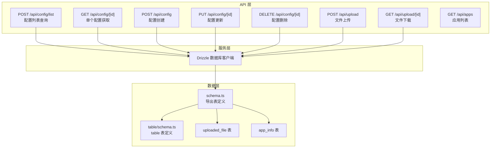
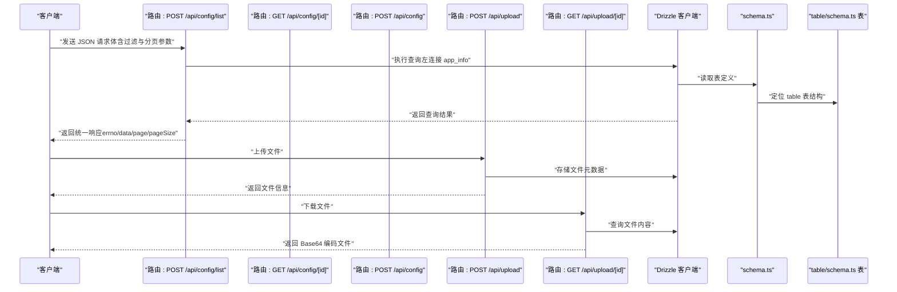
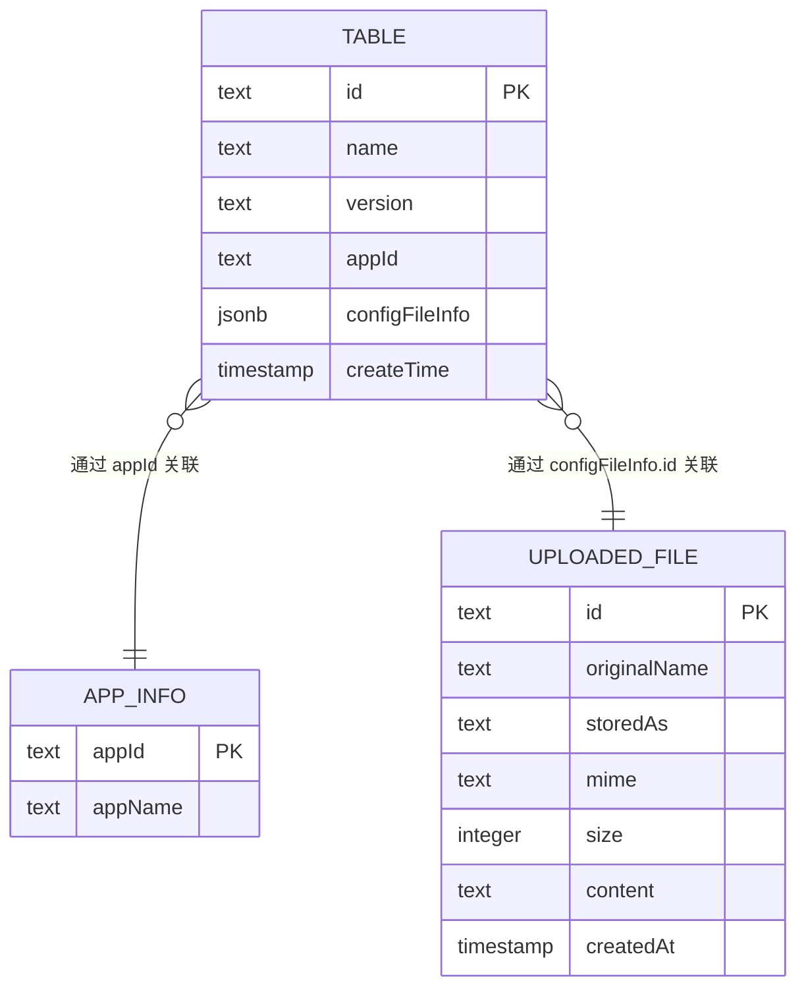
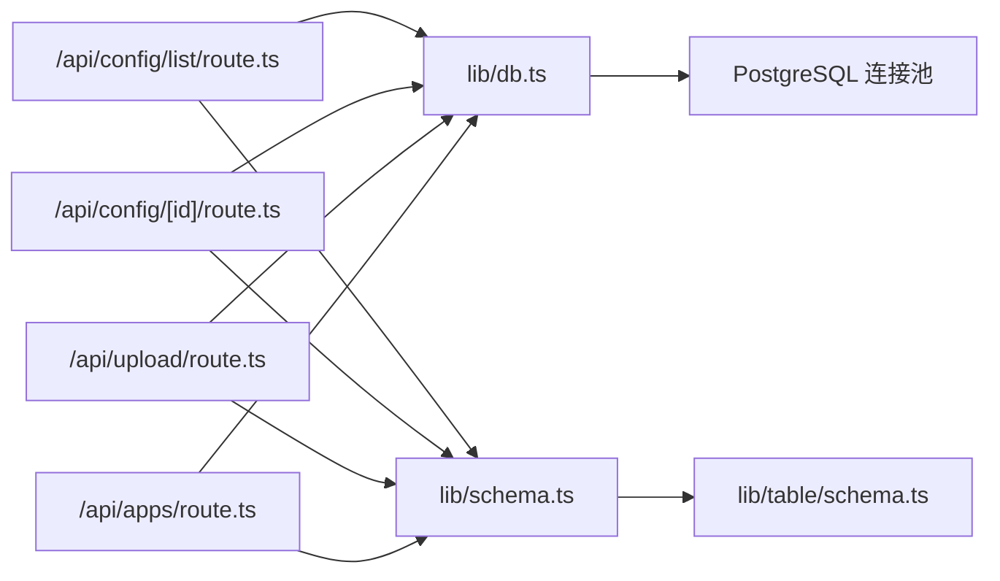

# 配置管理 API

<cite>
**本文引用的文件**
- [src/app/api/config/list/route.ts](file://src/app/api/config/list/route.ts)
- [src/app/api/config/[id]/route.ts](file://src/app/api/config/[id]/route.ts)
- [src/app/api/apps/route.ts](file://src/app/api/apps/route.ts)
- [src/app/api/upload/route.ts](file://src/app/api/upload/route.ts)
- [src/app/(admin)/(others-pages)/(scene)/config/page.tsx](file://src/app/(admin)/(others-pages)/(scene)/config/page.tsx)
- [src/app/(admin)/(others-pages)/(scene)/config/new/page.tsx](file://src/app/(admin)/(others-pages)/(scene)/config/new/page.tsx)
- [src/lib/db.ts](file://src/lib/db.ts)
- [src/lib/schema.ts](file://src/lib/schema.ts)
- [src/lib/table/schema.ts](file://src/lib/table/schema.ts)
</cite>

## 更新摘要
**所做更改**
- 更新了路由逻辑变化：从 '/table' 路由迁移到 '/config' 路由
- 新增了完整的 CRUD API 文档，包括单个配置获取、创建、更新、删除接口
- 增强了文件上传功能的文档说明
- 更新了前端页面导航和路由映射关系
- 完善了配置管理 API 的完整生命周期文档

## 目录
1. [简介](#简介)
2. [项目结构](#项目结构)
3. [核心组件](#核心组件)
4. [架构总览](#架构总览)
5. [详细组件分析](#详细组件分析)
6. [依赖关系分析](#依赖关系分析)
7. [性能考虑](#性能考虑)
8. [故障排除指南](#故障排除指南)
9. [结论](#结论)

## 简介
本文件面向需要管理应用配置的开发者，系统性地文档化"配置管理 API"的设计与实现，覆盖以下能力：
- 单个配置获取（通过 ID）
- 配置列表查询（支持分页、排序、过滤）
- 配置创建（新增）
- 配置更新（修改）
- 配置删除（移除）
- 文件上传与下载功能集成

同时，文档明确请求参数格式、响应数据结构、HTTP 状态码含义，并给出错误处理示例与常见问题解决方案。

**更新** 路由逻辑已从 '/table' 重构为 '/config'，并增强了文件上传功能的完整实现。

## 项目结构
配置管理 API 的核心路由位于 Next.js App Router 的 API 路径中，配合 Drizzle ORM 进行数据库访问，数据模型定义在独立的 schema 文件中。前端页面也相应迁移到新的路由结构。

**图表来源**
- [src/app/api/config/list/route.ts:1-77](file://src/app/api/config/list/route.ts#L1-L77)
- [src/app/api/config/[id]/route.ts:1-100](file://src/app/api/config/[id]/route.ts#L1-L100)
- [src/app/api/upload/route.ts:1-200](file://src/app/api/upload/route.ts#L1-L200)
- [src/lib/db.ts:1-19](file://src/lib/db.ts#L1-L19)
- [src/lib/schema.ts:1-23](file://src/lib/schema.ts#L1-L23)
- [src/lib/table/schema.ts:1-25](file://src/lib/table/schema.ts#L1-L25)

**章节来源**
- [src/app/api/config/list/route.ts:1-77](file://src/app/api/config/list/route.ts#L1-L77)
- [src/app/api/config/[id]/route.ts:1-100](file://src/app/api/config/[id]/route.ts#L1-L100)
- [src/app/api/upload/route.ts:1-200](file://src/app/api/upload/route.ts#L1-L200)
- [src/lib/db.ts:1-19](file://src/lib/db.ts#L1-L19)
- [src/lib/schema.ts:1-23](file://src/lib/schema.ts#L1-L23)
- [src/lib/table/schema.ts:1-25](file://src/lib/table/schema.ts#L1-L25)

## 核心组件
- 列表查询接口：POST /api/config/list
  - 支持按名称模糊匹配、按应用 ID 精确匹配、按版本精确匹配
  - 支持分页参数 page、pageSize（最大 100 条/页）
  - 默认按创建时间倒序返回
  - 返回结构包含 errno、data、page、pageSize
- 单个配置接口：GET /api/config/[id]
  - 根据 ID 获取单个配置信息
  - 返回配置详情和关联的应用信息
- 创建配置接口：POST /api/config
  - 接收 name、version、appId、configFileInfo 等参数
  - 校验必填字段并写入数据库
- 更新配置接口：PUT /api/config/[id]
  - 根据 ID 更新配置信息
  - 支持部分字段更新
- 删除配置接口：DELETE /api/config/[id]
  - 根据 ID 删除配置
  - 返回删除结果
- 文件上传接口：POST /api/upload
  - 支持文件上传和存储
  - 返回文件元数据
- 文件下载接口：GET /api/upload/[id]
  - 根据文件 ID 下载已上传文件
  - 支持 Base64 编码的内容传输

**章节来源**
- [src/app/api/config/list/route.ts:7-77](file://src/app/api/config/list/route.ts#L7-L77)
- [src/app/api/config/[id]/route.ts:1-100](file://src/app/api/config/[id]/route.ts#L1-L100)
- [src/app/api/upload/route.ts:1-200](file://src/app/api/upload/route.ts#L1-L200)

## 架构总览
下图展示从客户端到数据库的调用链路与数据流，包括文件上传和下载的完整流程：

**图表来源**
- [src/app/api/config/list/route.ts:7-77](file://src/app/api/config/list/route.ts#L7-L77)
- [src/app/api/config/[id]/route.ts:1-100](file://src/app/api/config/[id]/route.ts#L1-L100)
- [src/app/api/upload/route.ts:1-200](file://src/app/api/upload/route.ts#L1-L200)
- [src/lib/db.ts:1-19](file://src/lib/db.ts#L1-L19)
- [src/lib/schema.ts:1-23](file://src/lib/schema.ts#L1-L23)
- [src/lib/table/schema.ts:1-25](file://src/lib/table/schema.ts#L1-L25)

## 详细组件分析

### 接口：配置列表查询（POST /api/config/list）
- 方法与路径
  - POST /api/config/list
- 功能描述
  - 支持多条件过滤（名称模糊、应用 ID、版本）、分页、默认按创建时间倒序
- 请求体参数
  - name: 可选，字符串，用于名称模糊匹配
  - appId: 可选，字符串，用于应用 ID 精确匹配
  - version: 可选，字符串，用于版本精确匹配
  - page: 可选，默认 1，数值型
  - pageSize: 可选，默认 10，数值型，上限 100
- 响应体字段
  - errno: 数值，0 表示成功，非 0 表示失败
  - data: 数组，每项包含 id、name、version、appId、configFileInfo、createTime、appName
  - page: 当前页码
  - pageSize: 实际每页条数
- HTTP 状态码
  - 200 成功
  - 500 服务器内部错误（当发生异常时）
- 错误处理
  - 捕获异常后返回 errno=-1 与错误消息，状态码 500

**图表来源**
- [src/app/api/config/list/route.ts:7-77](file://src/app/api/config/list/route.ts#L7-L77)

**章节来源**
- [src/app/api/config/list/route.ts:7-77](file://src/app/api/config/list/route.ts#L7-L77)

### 接口：单个配置获取（GET /api/config/[id]）
- 方法与路径
  - GET /api/config/[id]
- 功能描述
  - 根据配置 ID 获取单个配置的详细信息
  - 返回配置详情和关联的应用信息
- 路径参数
  - id: 必填，配置记录的唯一标识符
- 响应体字段
  - errno: 数值，0 表示成功，非 0 表示失败
  - data: 包含配置详情的对象
- HTTP 状态码
  - 200 成功
  - 404 未找到配置
  - 500 服务器内部错误
- 错误处理
  - 捕获异常后返回 errno=-1 与错误消息

**章节来源**
- [src/app/api/config/[id]/route.ts:1-100](file://src/app/api/config/[id]/route.ts#L1-L100)

### 接口：配置创建（POST /api/config）
- 方法与路径
  - POST /api/config
- 功能描述
  - 创建新的配置记录
  - 支持关联已上传的配置文件
- 请求体参数
  - name: 必填，配置名称
  - version: 必填，配置版本
  - appId: 必填，应用 ID
  - configFileInfo: 可选，配置文件信息对象
    - id: 文件唯一标识符
    - filename: 文件原始名称
- 响应体字段
  - errno: 数值，0 表示成功，非 0 表示失败
  - data: 新创建的配置记录
- HTTP 状态码
  - 201 创建成功
  - 400 参数验证失败
  - 500 服务器内部错误
- 错误处理
  - 参数验证失败返回 errno=-1 和具体错误消息

**章节来源**
- [src/app/api/config/[id]/route.ts:1-100](file://src/app/api/config/[id]/route.ts#L1-L100)

### 接口：配置更新（PUT /api/config/[id]）
- 方法与路径
  - PUT /api/config/[id]
- 功能描述
  - 根据 ID 更新现有配置信息
  - 支持部分字段更新
- 路径参数
  - id: 必填，配置记录的唯一标识符
- 请求体参数
  - version: 可选，配置版本
  - appId: 可选，应用 ID
  - configFileInfo: 可选，配置文件信息对象
- 响应体字段
  - errno: 数值，0 表示成功，非 0 表示失败
  - data: 更新后的配置记录
- HTTP 状态码
  - 200 更新成功
  - 404 未找到配置
  - 500 服务器内部错误

**章节来源**
- [src/app/api/config/[id]/route.ts:1-100](file://src/app/api/config/[id]/route.ts#L1-L100)

### 接口：配置删除（DELETE /api/config/[id]）
- 方法与路径
  - DELETE /api/config/[id]
- 功能描述
  - 根据 ID 删除配置记录
- 路径参数
  - id: 必填，配置记录的唯一标识符
- 响应体字段
  - errno: 数值，0 表示成功，非 0 表示失败
  - data: 删除结果信息
- HTTP 状态码
  - 200 删除成功
  - 404 未找到配置
  - 500 服务器内部错误

**章节来源**
- [src/app/api/config/[id]/route.ts:1-100](file://src/app/api/config/[id]/route.ts#L1-L100)

### 接口：文件上传（POST /api/upload）
- 方法与路径
  - POST /api/upload
- 功能描述
  - 上传文件到服务器并存储元数据
  - 支持 Base64 编码的文件内容
- 请求体格式
  - multipart/form-data 或 application/json
  - file: 必填，要上传的文件
- 响应体字段
  - errno: 数值，0 表示成功，非 0 表示失败
  - data: 文件元数据对象
    - id: 文件唯一标识符
    - originalName: 原始文件名
    - storedAs: 存储文件名
    - mime: MIME 类型
    - size: 文件大小（字节）
- HTTP 状态码
  - 201 上传成功
  - 400 文件格式或大小验证失败
  - 500 服务器内部错误

**章节来源**
- [src/app/api/upload/route.ts:1-200](file://src/app/api/upload/route.ts#L1-L200)

### 接口：文件下载（GET /api/upload/[id]）
- 方法与路径
  - GET /api/upload/[id]
- 功能描述
  - 根据文件 ID 下载已上传的文件
  - 返回 Base64 编码的文件内容
- 路径参数
  - id: 必填，文件的唯一标识符
- 响应体字段
  - errno: 数值，0 表示成功，非 0 表示失败
  - data: 文件内容对象
    - id: 文件唯一标识符
    - filename: 文件原始名称
    - mime: MIME 类型
    - content: Base64 编码的文件内容
- HTTP 状态码
  - 200 下载成功
  - 404 未找到文件
  - 500 服务器内部错误

**章节来源**
- [src/app/api/upload/route.ts:1-200](file://src/app/api/upload/route.ts#L1-L200)

### 数据模型与表结构
- 表：table
  - 字段：id、name、version、appId、configFileInfo、createTime
  - configFileInfo 类型为 JSONB，包含 id 与 filename
- 表：uploaded_file
  - 字段：id、originalName、storedAs、mime、size、content、createdAt
  - 用于存储上传的文件元数据和内容
- 表：app_info
  - 字段：appId、appName
  - 通过 schema 引用，用于与 table 左连接获取 appName
- 关系
  - table.appId → app_info.appId
  - table.configFileInfo.id → uploaded_file.id

**图表来源**
- [src/lib/table/schema.ts:3-25](file://src/lib/table/schema.ts#L3-L25)
- [src/lib/schema.ts:15-17](file://src/lib/schema.ts#L15-L17)

**章节来源**
- [src/lib/table/schema.ts:1-25](file://src/lib/table/schema.ts#L1-L25)
- [src/lib/schema.ts:1-23](file://src/lib/schema.ts#L1-L23)

### 前端路由与页面导航
- 配置列表页面：/config
  - 显示配置列表，支持搜索、分页、批量操作
  - 提供新建配置按钮跳转到 /config/new
- 配置详情页面：/config/new
  - 支持新增和编辑配置
  - 集成文件上传功能
  - 与 /api/config 和 /api/upload API 对接

**章节来源**
- [src/app/(admin)/(others-pages)/(scene)/config/page.tsx:1-366](file://src/app/(admin)/(others-pages)/(scene)/config/page.tsx#L1-L366)
- [src/app/(admin)/(others-pages)/(scene)/config/new/page.tsx:1-290](file://src/app/(admin)/(others-pages)/(scene)/config/new/page.tsx#L1-L290)

## 依赖关系分析
- 路由依赖 Drizzle ORM 与数据库连接
- Drizzle 依赖 PostgreSQL 连接池（Pool）
- schema.ts 统一导出表定义，供路由与查询使用
- table/schema.ts 定义实际表结构与字段类型
- 文件上传功能依赖 Node.js Buffer 和 Base64 编解码
- 前端页面通过 Next.js Router 进行页面导航

**图表来源**
- [src/app/api/config/list/route.ts:1-77](file://src/app/api/config/list/route.ts#L1-L77)
- [src/app/api/config/[id]/route.ts:1-100](file://src/app/api/config/[id]/route.ts#L1-L100)
- [src/app/api/upload/route.ts:1-200](file://src/app/api/upload/route.ts#L1-L200)
- [src/app/api/apps/route.ts:1-24](file://src/app/api/apps/route.ts#L1-L24)
- [src/lib/db.ts:1-19](file://src/lib/db.ts#L1-L19)
- [src/lib/schema.ts:1-23](file://src/lib/schema.ts#L1-L23)
- [src/lib/table/schema.ts:1-25](file://src/lib/table/schema.ts#L1-L25)

**章节来源**
- [src/app/api/config/list/route.ts:1-77](file://src/app/api/config/list/route.ts#L1-L77)
- [src/app/api/config/[id]/route.ts:1-100](file://src/app/api/config/[id]/route.ts#L1-L100)
- [src/app/api/upload/route.ts:1-200](file://src/app/api/upload/route.ts#L1-L200)
- [src/app/api/apps/route.ts:1-24](file://src/app/api/apps/route.ts#L1-L24)
- [src/lib/db.ts:1-19](file://src/lib/db.ts#L1-L19)
- [src/lib/schema.ts:1-23](file://src/lib/schema.ts#L1-L23)
- [src/lib/table/schema.ts:1-25](file://src/lib/table/schema.ts#L1-L25)

## 性能考虑
- 分页限制
  - 每页最大 100 条，避免过大查询负载
- 排序策略
  - 默认按创建时间倒序，利于快速获取最新配置
- 文件存储优化
  - 文件内容采用 Base64 编码存储，便于前后端传输
  - 支持文件大小限制，防止内存溢出
- 查询优化建议
  - 为 appId、version 建立索引以提升过滤效率
  - 对 name 使用 ILIKE 时考虑建立文本索引或使用更高效的全文检索方案
  - 合理使用 LIMIT/OFFSET，避免超大偏移导致的性能退化

## 故障排除指南
- 环境变量缺失
  - 现象：启动时报错提示缺少 POSTGRES_URL
  - 处理：确保环境变量已正确设置
- 数据库连接失败
  - 现象：路由执行报错或超时
  - 处理：检查连接串、网络连通性、SSL 设置（neon.tech 场景已内置 SSL 适配）
- 查询异常
  - 现象：返回 errno=-1 与错误消息，状态码 500
  - 处理：查看服务端日志中的错误堆栈，确认 SQL 条件与表结构是否匹配
- 参数非法
  - 现象：分页参数越界或超出上限
  - 处理：确保 page≥1，pageSize 在 1~100 范围内
- 文件上传失败
  - 现象：上传接口返回错误
  - 处理：检查文件大小限制、MIME 类型验证、存储权限
- 路由导航错误
  - 现象：页面跳转到错误的路由
  - 处理：确认前端页面导航使用的是新的 '/config' 路由

**章节来源**
- [src/lib/db.ts:7-9](file://src/lib/db.ts#L7-L9)
- [src/app/api/config/list/route.ts:67-76](file://src/app/api/config/list/route.ts#L67-L76)
- [src/app/(admin)/(others-pages)/(scene)/config/page.tsx:98-131](file://src/app/(admin)/(others-pages)/(scene)/config/page.tsx#L98-L131)

## 结论
本仓库提供了完整的配置管理 API 能力：通过 POST /api/config/list 实现带过滤与分页的配置列表查询，以及完整的 CRUD 操作接口。文件上传功能已完全集成，支持配置文件的上传、存储和下载。前端页面也已迁移到新的 '/config' 路由结构，提供了完整的配置管理界面。后续如需扩展功能，可在现有 Drizzle 与 schema 基础上继续完善 API 接口，并保持一致的错误处理与响应格式。