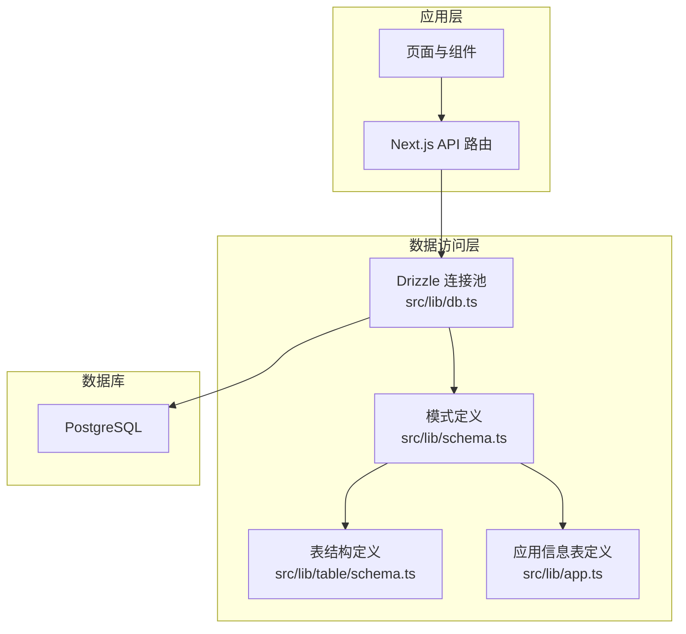
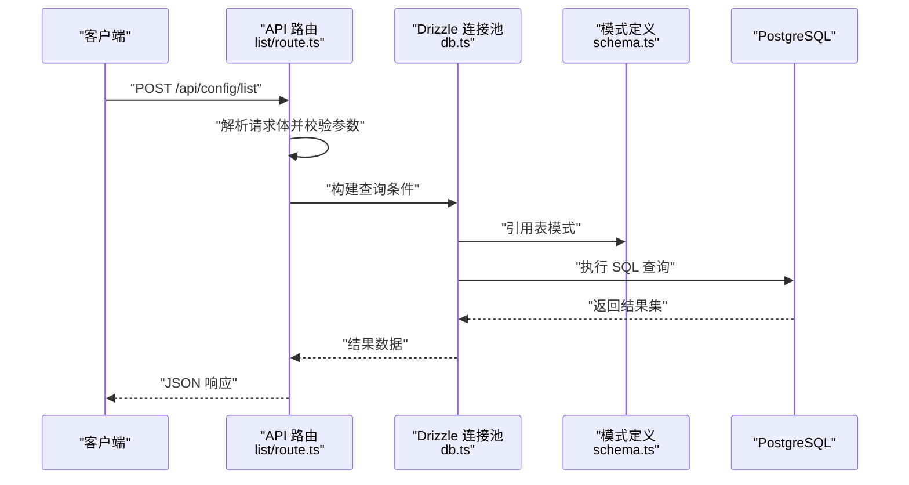
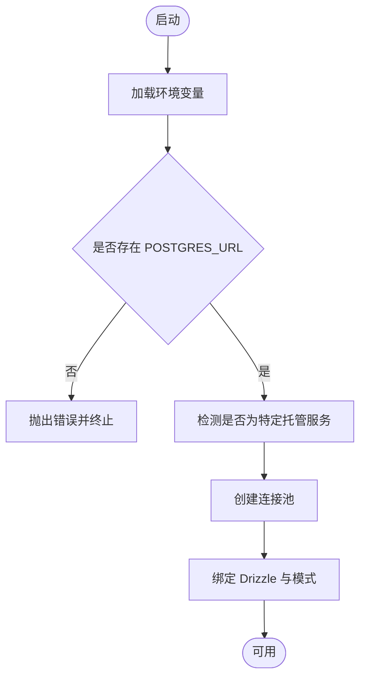
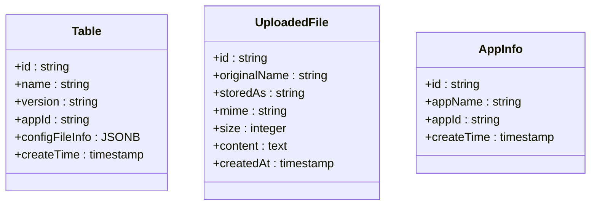
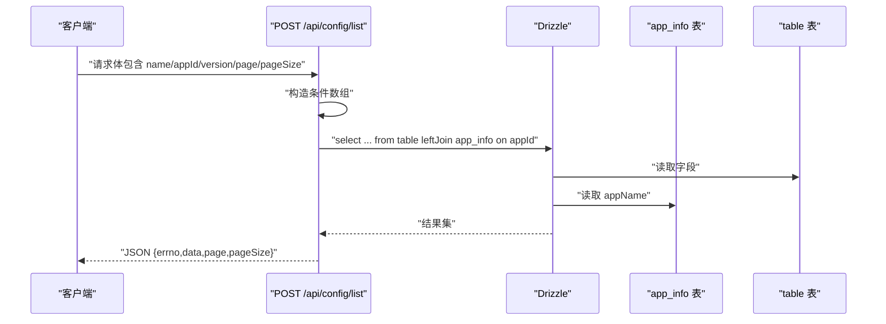
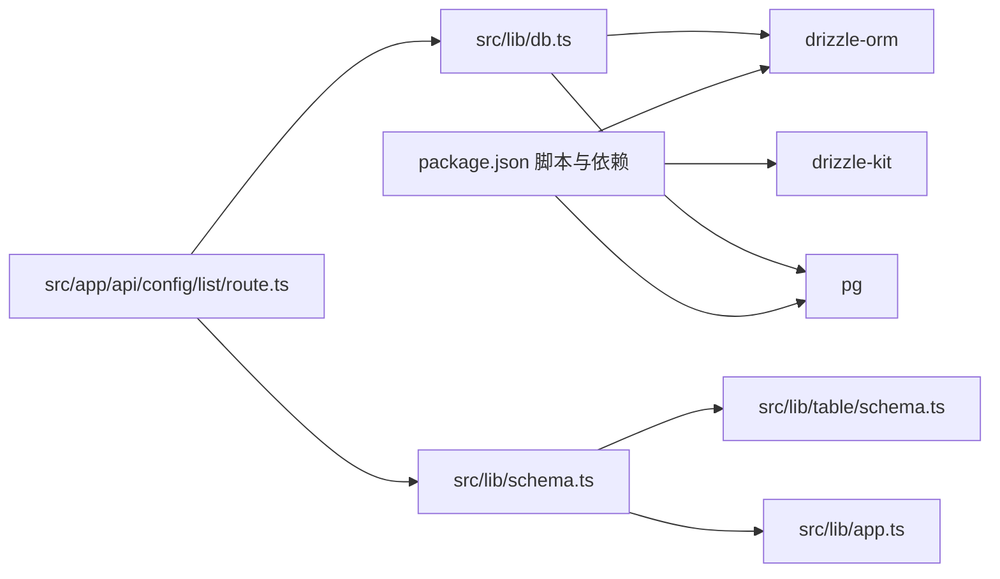

# CRUD 操作实现

<cite>
**本文档引用的文件**
- [src/lib/db.ts](file://src/lib/db.ts)
- [src/lib/schema.ts](file://src/lib/schema.ts)
- [src/lib/table/schema.ts](file://src/lib/table/schema.ts)
- [src/lib/app.ts](file://src/lib/app.ts)
- [src/app/api/config/list/route.ts](file://src/app/api/config/list/route.ts)
- [package.json](file://package.json)
</cite>

## 目录
1. [简介](#简介)
2. [项目结构](#项目结构)
3. [核心组件](#核心组件)
4. [架构总览](#架构总览)
5. [详细组件分析](#详细组件分析)
6. [依赖关系分析](#依赖关系分析)
7. [性能考虑](#性能考虑)
8. [故障排除指南](#故障排除指南)
9. [结论](#结论)
10. [附录](#附录)

## 简介
本文件面向需要在 Next.js 应用中实现数据操作逻辑的开发者，系统性梳理基于 Drizzle ORM 的 CRUD（创建、读取、更新、删除）实现与扩展能力，涵盖：
- 基础增删改查语句构建
- 复杂查询、联表查询、条件拼装
- 事务处理与批量操作的实践路径
- 数据验证与错误处理
- 性能优化技巧、查询计划分析与索引建议
- 与现有代码库的映射关系与最佳实践

## 项目结构
该项目采用分层组织方式：
- 数据访问层：通过 Drizzle ORM 连接 PostgreSQL，统一在数据库连接池中执行 SQL
- 模式定义层：集中定义表结构与类型推断，便于跨模块复用
- API 层：REST 风格路由封装，负责请求解析、参数校验、调用数据层并返回响应

**图表来源**
- [src/lib/db.ts:1-19](file://src/lib/db.ts#L1-L19)
- [src/lib/schema.ts:1-24](file://src/lib/schema.ts#L1-L24)
- [src/lib/table/schema.ts:1-26](file://src/lib/table/schema.ts#L1-L26)
- [src/lib/app.ts:1-9](file://src/lib/app.ts#L1-L9)

**章节来源**
- [src/lib/db.ts:1-19](file://src/lib/db.ts#L1-L19)
- [src/lib/schema.ts:1-24](file://src/lib/schema.ts#L1-L24)
- [src/lib/table/schema.ts:1-26](file://src/lib/table/schema.ts#L1-L26)
- [src/lib/app.ts:1-9](file://src/lib/app.ts#L1-L9)

## 核心组件
- 数据库连接与初始化
  - 通过环境变量配置连接字符串，自动识别特定服务提供商并设置 SSL
  - 将 Drizzle 与连接池绑定，并注入模式对象，确保类型安全
- 模式与类型推断
  - 统一导出多个表的模式对象，同时提供 Select/Insert 类型别名，便于在业务层进行类型约束
- API 路由示例
  - 提供列表查询接口，演示条件拼装、联表查询、排序与分页

**章节来源**
- [src/lib/db.ts:1-19](file://src/lib/db.ts#L1-L19)
- [src/lib/schema.ts:15-24](file://src/lib/schema.ts#L15-L24)
- [src/app/api/config/list/route.ts:7-77](file://src/app/api/config/list/route.ts#L7-L77)

## 架构总览
下图展示从 API 请求到数据库查询的整体流程，以及 Drizzle 在其中的角色。

**图表来源**
- [src/app/api/config/list/route.ts:7-77](file://src/app/api/config/list/route.ts#L7-L77)
- [src/lib/db.ts:1-19](file://src/lib/db.ts#L1-L19)
- [src/lib/schema.ts:15-17](file://src/lib/schema.ts#L15-L17)

## 详细组件分析

### 数据库连接与初始化
- 连接池配置
  - 自动检测连接字符串中的特定标识以启用或禁用 SSL
  - 通过 Drizzle 将连接池与模式对象绑定，确保类型安全与一致的命名空间
- 环境变量校验
  - 若缺少必要的连接信息则直接抛错，避免静默失败

**图表来源**
- [src/lib/db.ts:6-18](file://src/lib/db.ts#L6-L18)

**章节来源**
- [src/lib/db.ts:1-19](file://src/lib/db.ts#L1-L19)

### 模式定义与类型推断
- 表结构
  - 定义了多个表（如上传文件、配置表、应用信息），包含主键、非空字段、时间戳等
  - JSONB 字段用于存储结构化配置信息，配合类型泛型保证运行时安全
- 类型导出
  - 导出 Select/Insert 类型别名，便于在路由与服务层进行参数校验与返回值约束

**图表来源**
- [src/lib/table/schema.ts:15-25](file://src/lib/table/schema.ts#L15-L25)
- [src/lib/table/schema.ts:3-13](file://src/lib/table/schema.ts#L3-L13)
- [src/lib/app.ts:3-8](file://src/lib/app.ts#L3-L8)

**章节来源**
- [src/lib/table/schema.ts:1-26](file://src/lib/table/schema.ts#L1-L26)
- [src/lib/app.ts:1-9](file://src/lib/app.ts#L1-L9)
- [src/lib/schema.ts:15-24](file://src/lib/schema.ts#L15-L24)

### 列表查询 API（复杂查询、联表、分页）
- 条件拼装
  - 支持多字段过滤（名称模糊匹配、应用 ID、版本号精确匹配），使用 AND 组合
  - 动态拼接 WHERE 条件，避免无效条件带来的性能损耗
- 联表查询
  - 左连接应用信息表，补充应用名称字段，满足前端展示需求
- 排序与分页
  - 按创建时间倒序排列，支持页码与每页条数限制，计算偏移量
- 错误处理
  - 捕获异常并返回标准化错误响应，包含错误码与消息

**图表来源**
- [src/app/api/config/list/route.ts:7-77](file://src/app/api/config/list/route.ts#L7-L77)

**章节来源**
- [src/app/api/config/list/route.ts:7-77](file://src/app/api/config/list/route.ts#L7-L77)

### 插入、更新、删除语句构建（基于 Drizzle ORM）
- 插入（INSERT）
  - 使用模式对象的 Insert 类型进行参数校验，调用 insert 语句写入
  - 可结合默认值生成器（如主键默认函数）减少显式赋值
- 更新（UPDATE）
  - 通过 where 条件定位记录，使用 set 方法批量更新字段
  - 建议结合乐观锁字段（如版本号）防止并发覆盖
- 删除（DELETE）
  - 通过 where 条件删除目标记录，注意级联删除与外键约束
- 批量操作
  - 可使用多次调用或原生 SQL 批处理提升吞吐；Drizzle 支持事务包裹批量写入
- 事务处理
  - 将多个写操作放入单个事务中，保证一致性；失败时回滚
- 数据验证
  - 在路由层对输入参数进行基础校验（类型、长度、格式）
  - 在 Drizzle 层利用模式定义的非空与类型约束进行二次校验

（本节为通用实现指导，未直接分析具体文件）

### 复杂查询、联表查询、聚合查询
- 复杂查询
  - 使用条件数组动态拼接，结合 ILIKE、范围查询、空值判断等
- 联表查询
  - 左连接、内连接均可，按需选择；注意字段重名时使用别名
- 聚合查询
  - 可通过 select({ count: count() }) 等聚合函数实现统计
  - 结合 groupBy 与 having 进行分组统计与筛选

（本节为通用实现指导，未直接分析具体文件）

### 事务处理与批量操作
- 事务
  - 在数据层封装事务函数，将多个写操作包裹在事务中
  - 发生异常时回滚，成功后提交
- 批量
  - 对于大量写入场景，优先使用批量插入/更新
  - 注意内存占用与数据库超时设置

（本节为通用实现指导，未直接分析具体文件）

## 依赖关系分析
- Drizzle ORM 与 PostgreSQL
  - 通过 pg 连接池与 Drizzle 绑定，提供类型安全的查询能力
- 模式与路由
  - 路由依赖模式定义进行类型约束与查询构建
- 开发工具链
  - drizzle-kit 提供迁移、推送与可视化工具，辅助数据库演进

**图表来源**
- [package.json:15-49](file://package.json#L15-L49)
- [src/lib/db.ts:1-19](file://src/lib/db.ts#L1-L19)
- [src/lib/schema.ts:15-17](file://src/lib/schema.ts#L15-L17)
- [src/lib/table/schema.ts:1-26](file://src/lib/table/schema.ts#L1-L26)
- [src/lib/app.ts:1-9](file://src/lib/app.ts#L1-L9)
- [src/app/api/config/list/route.ts:1-77](file://src/app/api/config/list/route.ts#L1-L77)

**章节来源**
- [package.json:15-49](file://package.json#L15-L49)
- [src/lib/db.ts:1-19](file://src/lib/db.ts#L1-L19)
- [src/lib/schema.ts:15-17](file://src/lib/schema.ts#L15-L17)

## 性能考虑
- 查询优化
  - 合理使用索引：在频繁过滤与排序的列上建立索引（如 appId、createTime）
  - 避免 SELECT *，仅选择必要字段，减少网络与解析开销
  - 分页参数限制：对 pageSize 设置上下限，防止过大分页导致性能问题
- 连接池与并发
  - 根据实例规格调整连接池大小，避免过度连接造成资源争用
- 查询计划分析
  - 使用 EXPLAIN/EXPLAIN ANALYZE 观察执行计划，关注全表扫描与排序成本
- 索引建议
  - 常见过滤字段（name、appId、version）可考虑复合索引
  - 时间字段（createTime）用于排序与范围查询，建议单独索引

（本节为通用指导，未直接分析具体文件）

## 故障排除指南
- 环境变量缺失
  - 现象：应用启动时报错提示缺少连接字符串
  - 处理：检查环境变量配置，确保 POSTGRES_URL 正确
- 查询异常
  - 现象：列表查询返回错误响应
  - 处理：查看日志输出，确认条件拼装与联表连接是否正确
- 参数越界
  - 现象：分页参数异常导致查询失败
  - 处理：在路由层对 page 与 pageSize 进行边界校验与转换

**章节来源**
- [src/lib/db.ts:7-9](file://src/lib/db.ts#L7-L9)
- [src/app/api/config/list/route.ts:67-76](file://src/app/api/config/list/route.ts#L67-L76)

## 结论
本项目以 Drizzle ORM 为核心，结合模式定义与 API 路由，提供了清晰的 CRUD 实现范式。通过动态条件拼装、联表查询与分页机制，能够满足常见的数据管理需求。建议在生产环境中进一步完善：
- 引入更严格的输入验证与权限控制
- 使用事务与批量操作提升一致性与性能
- 基于查询计划持续优化索引与 SQL 设计

## 附录
- 开发命令
  - 数据库生成、迁移、推送与可视化工具可通过脚本调用 drizzle-kit
- 版本与依赖
  - 项目明确依赖 drizzle-orm 与 pg，确保数据库驱动与 ORM 版本兼容

**章节来源**
- [package.json:5-14](file://package.json#L5-L14)
- [package.json:32-37](file://package.json#L32-L37)