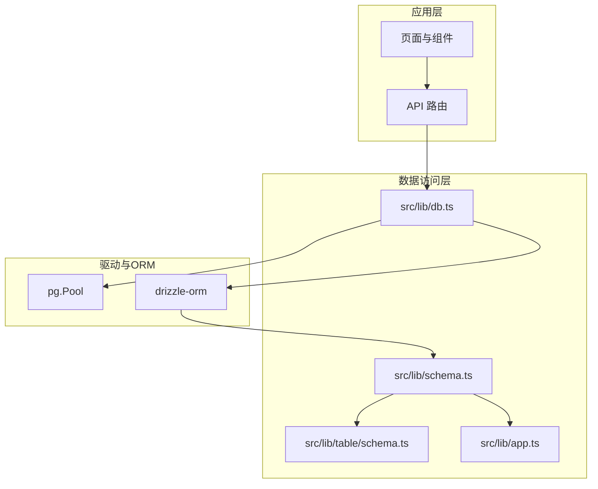
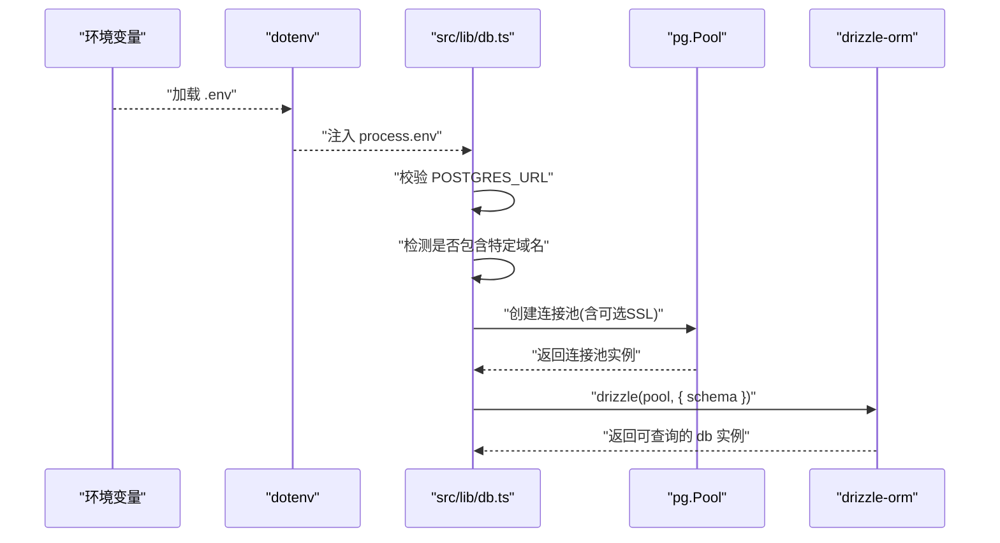
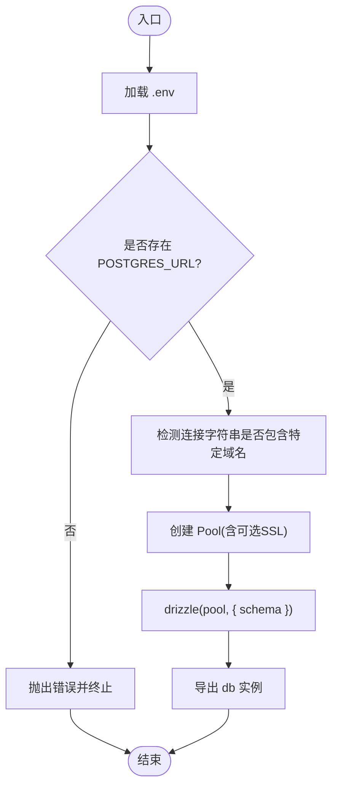
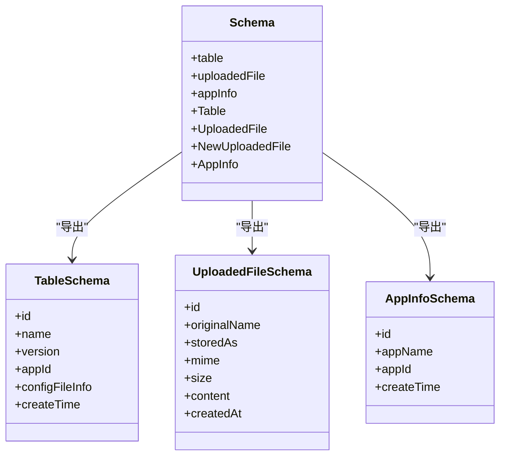
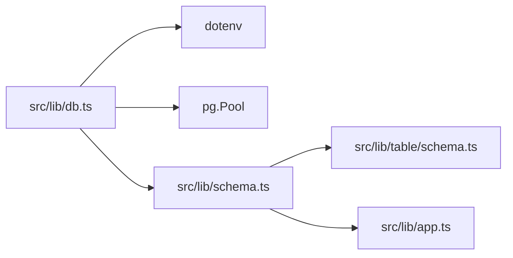

# 数据库连接配置

<cite>
**本文引用的文件**
- [src/lib/db.ts](file://src/lib/db.ts)
- [src/lib/schema.ts](file://src/lib/schema.ts)
- [src/lib/table/schema.ts](file://src/lib/table/schema.ts)
- [src/lib/app.ts](file://src/lib/app.ts)
- [package.json](file://package.json)
</cite>

## 目录
1. [简介](#简介)
2. [项目结构](#项目结构)
3. [核心组件](#核心组件)
4. [架构总览](#架构总览)
5. [详细组件分析](#详细组件分析)
6. [依赖关系分析](#依赖关系分析)
7. [性能考虑](#性能考虑)
8. [故障排查指南](#故障排查指南)
9. [结论](#结论)
10. [附录](#附录)

## 简介
本文件面向需要在 Next.js 项目中配置与维护 PostgreSQL 数据库连接的开发者，重点围绕基于 Drizzle ORM 与 node-postgres 的连接实现，覆盖以下主题：
- 连接字符串格式与环境变量管理
- 连接池参数与 SSL 配置策略
- 云数据库服务（如 Neon.tech）的特殊处理
- 常见连接问题排查与性能优化建议
- 代码级实现与数据模型映射关系

## 项目结构
与数据库连接直接相关的文件集中在 src/lib 目录下：
- 连接与初始化：src/lib/db.ts
- 数据模型聚合：src/lib/schema.ts
- 实体表定义：src/lib/table/schema.ts、src/lib/app.ts
- 依赖声明：package.json

图表来源
- [src/lib/db.ts:1-19](file://src/lib/db.ts#L1-L19)
- [src/lib/schema.ts:1-24](file://src/lib/schema.ts#L1-L24)
- [src/lib/table/schema.ts:1-26](file://src/lib/table/schema.ts#L1-L26)
- [src/lib/app.ts:1-9](file://src/lib/app.ts#L1-L9)

章节来源
- [src/lib/db.ts:1-19](file://src/lib/db.ts#L1-L19)
- [src/lib/schema.ts:1-24](file://src/lib/schema.ts#L1-L24)
- [src/lib/table/schema.ts:1-26](file://src/lib/table/schema.ts#L1-L26)
- [src/lib/app.ts:1-9](file://src/lib/app.ts#L1-L9)
- [package.json:15-49](file://package.json#L15-L49)

## 核心组件
- 数据库连接初始化与池化
  - 通过 dotenv 加载环境变量，校验 POSTGRES_URL 是否存在
  - 基于 node-postgres 的 Pool 创建连接池
  - 对包含特定域名的连接字符串启用 SSL（rejectUnauthorized=false）
  - 将 Pool 注入 drizzle-orm，绑定 schema
- 数据模型聚合
  - 在 schema.ts 中统一导出多个表模型，供 drizzle 使用
- 表结构定义
  - uploaded_file、table、app_info 等实体的字段与类型定义

章节来源
- [src/lib/db.ts:6-18](file://src/lib/db.ts#L6-L18)
- [src/lib/schema.ts:15-24](file://src/lib/schema.ts#L15-L24)
- [src/lib/table/schema.ts:3-25](file://src/lib/table/schema.ts#L3-L25)
- [src/lib/app.ts:3-8](file://src/lib/app.ts#L3-L8)

## 架构总览
Drizzle ORM 通过 node-postgres 的 Pool 提供连接池能力，结合 schema 定义完成类型安全的数据访问。连接初始化流程如下：

图表来源
- [src/lib/db.ts:6-18](file://src/lib/db.ts#L6-L18)

## 详细组件分析

### 组件一：数据库连接初始化（src/lib/db.ts）
- 功能要点
  - 环境变量加载与校验：使用 dotenv 加载 .env；若缺少 POSTGRES_URL 则抛出错误
  - 连接池创建：基于 node-postgres 的 Pool，传入连接字符串
  - SSL 自动化：当连接字符串包含特定域名时，启用 ssl 并设置 rejectUnauthorized=false
  - ORM 绑定：将 Pool 注入 drizzle-orm，并传入 schema
- 关键行为
  - 连接字符串格式：遵循 node-postgres 的连接字符串规范
  - SSL 配置：仅对特定域名启用 SSL，避免对非云服务的误用
  - 错误处理：缺失关键环境变量时立即失败，防止静默异常

图表来源
- [src/lib/db.ts:6-18](file://src/lib/db.ts#L6-L18)

章节来源
- [src/lib/db.ts:6-18](file://src/lib/db.ts#L6-L18)

### 组件二：数据模型聚合（src/lib/schema.ts）
- 功能要点
  - 聚合多个表模型（uploadedFile、table、appInfo），统一导出
  - 暴露 TypeScript 类型别名，便于上层使用
- 与 drizzle 的关系
  - 作为 drizzle 初始化时的 schema 参数，确保类型安全与自动补全

图表来源
- [src/lib/schema.ts:15-24](file://src/lib/schema.ts#L15-L24)
- [src/lib/table/schema.ts:3-25](file://src/lib/table/schema.ts#L3-L25)
- [src/lib/app.ts:3-8](file://src/lib/app.ts#L3-L8)

章节来源
- [src/lib/schema.ts:15-24](file://src/lib/schema.ts#L15-L24)
- [src/lib/table/schema.ts:3-25](file://src/lib/table/schema.ts#L3-L25)
- [src/lib/app.ts:3-8](file://src/lib/app.ts#L3-L8)

### 组件三：实体表定义（src/lib/table/schema.ts、src/lib/app.ts）
- uploaded_file
  - 主键：id（默认随机生成）
  - 字段：原始文件名、存储路径、MIME 类型、大小、内容文本、创建时间
- table
  - 主键：id
  - 字段：名称、版本、应用标识、配置文件信息（JSONB）、创建时间
- app_info
  - 主键：id
  - 字段：应用名称、应用标识、创建时间

章节来源
- [src/lib/table/schema.ts:3-25](file://src/lib/table/schema.ts#L3-L25)
- [src/lib/app.ts:3-8](file://src/lib/app.ts#L3-L8)

### 组件四：依赖与脚本（package.json）
- 关键依赖
  - drizzle-orm：ORM 核心
  - pg：PostgreSQL 驱动（node-postgres）
  - dotenv：环境变量加载
- 开发工具
  - drizzle-kit：迁移与建模工具链
- 脚本命令
  - db:generate、db:migrate、db:push、db:studio：与 drizzle-kit 集成

章节来源
- [package.json:15-49](file://package.json#L15-L49)
- [package.json:5-14](file://package.json#L5-L14)

## 依赖关系分析
- 组件耦合
  - db.ts 依赖 dotenv、pg.Pool、schema.ts
  - schema.ts 依赖各实体表定义文件
- 外部依赖
  - drizzle-orm 与 pg 版本需满足兼容性要求
- 可能的循环依赖
  - 当前结构为单向依赖（db.ts -> schema.ts -> 实体定义），无循环

图表来源
- [src/lib/db.ts:1-4](file://src/lib/db.ts#L1-L4)
- [src/lib/schema.ts:11-12](file://src/lib/schema.ts#L11-L12)

章节来源
- [src/lib/db.ts:1-4](file://src/lib/db.ts#L1-L4)
- [src/lib/schema.ts:11-12](file://src/lib/schema.ts#L11-L12)

## 性能考虑
- 连接池参数
  - 当前实现未显式设置 Pool 参数，依赖默认值。生产环境建议根据并发量、查询负载与数据库规格调优最大连接数、空闲超时等参数
- SSL 配置
  - 仅对特定域名启用 SSL，避免不必要的证书验证开销；如需更严格的 TLS，可在部署环境调整证书信任策略
- 查询与事务
  - 使用 drizzle-orm 的类型安全查询减少运行时错误；合理拆分读写操作，避免长事务占用连接
- 迁移与建模
  - 使用 drizzle-kit 管理 schema 变更，保持开发与生产一致性

[本节为通用指导，不直接分析具体文件]

## 故障排查指南
- 缺少环境变量
  - 现象：启动时报错提示缺少连接字符串
  - 排查：确认 .env 文件中已设置 POSTGRES_URL；确保 dotenv 已正确加载
  - 参考
    - [src/lib/db.ts:6-9](file://src/lib/db.ts#L6-L9)
- 云数据库（如 Neon.tech）连接失败
  - 现象：连接超时或证书验证失败
  - 排查：确认连接字符串包含特定域名；当前实现会自动启用 SSL（rejectUnauthorized=false）；如仍失败，检查网络策略与防火墙
  - 参考
    - [src/lib/db.ts:12-16](file://src/lib/db.ts#L12-L16)
- 连接池耗尽或超时
  - 现象：请求堆积、超时错误
  - 排查：检查并发请求峰值、数据库最大连接限制；必要时增加 Pool 最大连接数或优化查询
  - 参考
    - [src/lib/db.ts:13-16](file://src/lib/db.ts#L13-L16)
- schema 不一致导致查询异常
  - 现象：类型推断错误或查询结果不符合预期
  - 排查：使用 drizzle-kit 生成/迁移 schema，确保本地与数据库一致
  - 参考
    - [src/lib/schema.ts:15-24](file://src/lib/schema.ts#L15-L24)
- 网络与证书问题
  - 现象：TLS 握手失败或被中间 CA 拦截
  - 排查：在受控环境中允许自签名证书（当前实现允许跳过授权校验）；生产环境建议使用受信 CA 证书
  - 参考
    - [src/lib/db.ts:15](file://src/lib/db.ts#L15)

章节来源
- [src/lib/db.ts:6-16](file://src/lib/db.ts#L6-L16)
- [src/lib/schema.ts:15-24](file://src/lib/schema.ts#L15-L24)

## 结论
本项目采用轻量且明确的数据库连接方案：通过 dotenv 管理连接字符串，基于 node-postgres 的 Pool 提供连接池能力，并在特定云服务场景下自动启用 SSL。配合 drizzle-orm 的类型安全与 schema 聚合，形成清晰、可维护的数据访问层。生产部署时建议补充连接池参数与监控告警，确保稳定性与可观测性。

[本节为总结性内容，不直接分析具体文件]

## 附录

### A. 连接字符串格式与环境变量
- 格式要求
  - 遵循 node-postgres 的连接字符串规范
  - 包含主机、端口、数据库名、用户名、密码等必要信息
- 环境变量
  - POSTGRES_URL：数据库连接字符串
  - .env 文件需与项目根目录同级放置

章节来源
- [src/lib/db.ts:6-16](file://src/lib/db.ts#L6-L16)

### B. Pool 参数配置建议（实践参考）
- 建议项（示例）
  - max：最大连接数（依据并发与数据库规格设定）
  - min：最小连接数
  - idleTimeoutMillis：空闲超时
  - connectionTimeoutMillis：连接超时
- 注意事项
  - 生产环境应结合监控指标动态调整
  - 与数据库的最大连接限制保持平衡

[本节为通用指导，不直接分析具体文件]

### C. 云数据库服务（Neon.tech 等）特殊处理
- 自动 SSL：当连接字符串包含特定域名时，启用 ssl 并设置 rejectUnauthorized=false
- 建议
  - 在受控环境下使用；生产环境优先使用受信 CA 证书
  - 如需更强的安全策略，可在部署平台配置证书信任

章节来源
- [src/lib/db.ts:12-16](file://src/lib/db.ts#L12-L16)