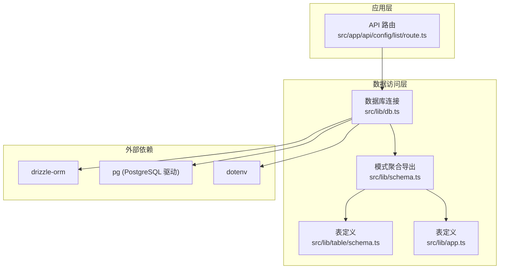
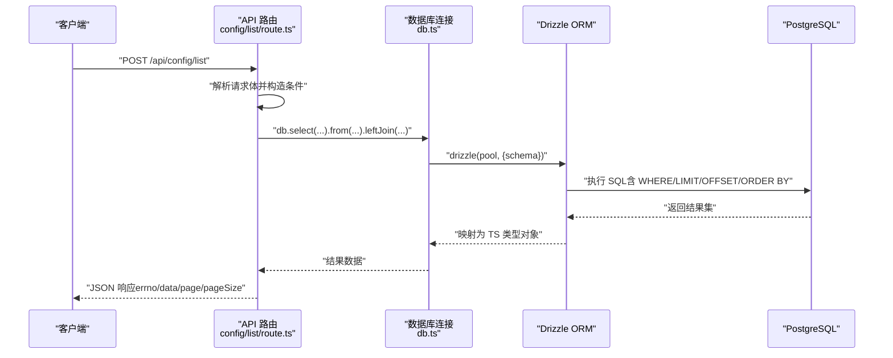
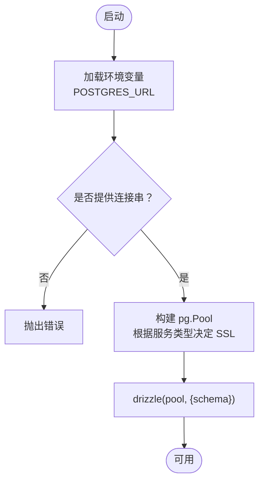
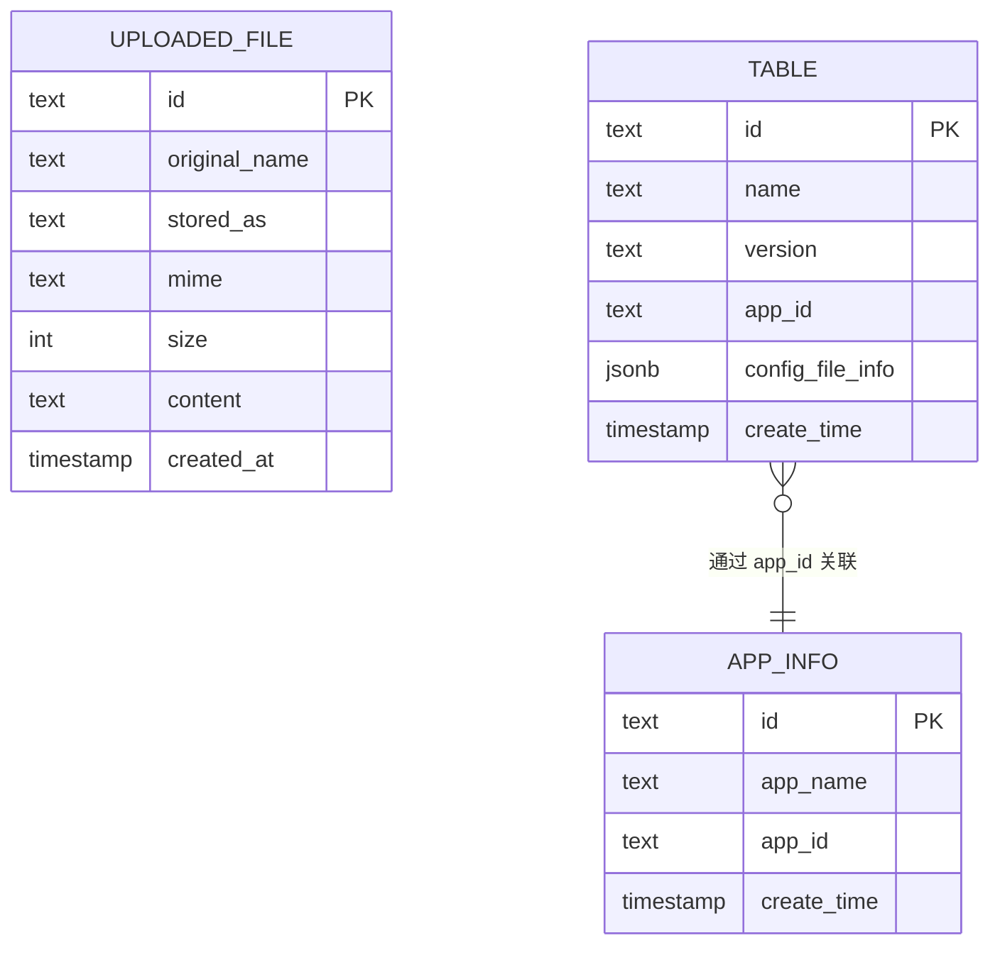
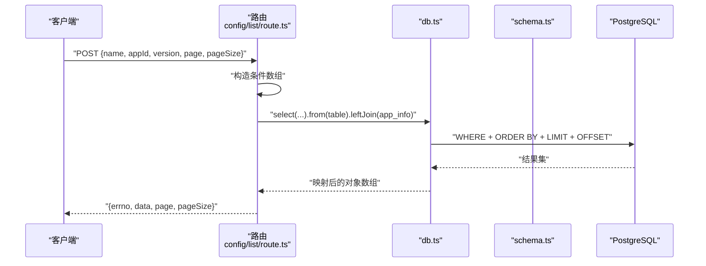
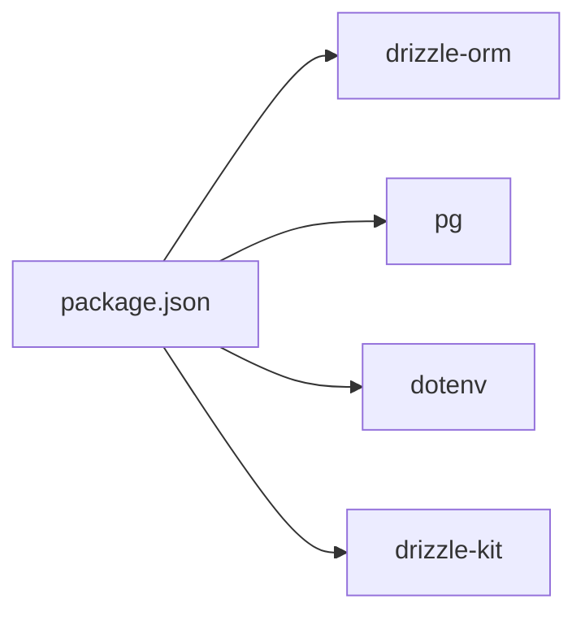

# 数据库集成

<cite>
**本文引用的文件**
- [src/lib/db.ts](file://src/lib/db.ts)
- [src/lib/schema.ts](file://src/lib/schema.ts)
- [src/lib/table/schema.ts](file://src/lib/table/schema.ts)
- [src/lib/app.ts](file://src/lib/app.ts)
- [src/app/api/config/list/route.ts](file://src/app/api/config/list/route.ts)
- [package.json](file://package.json)
</cite>

## 目录
1. [简介](#简介)
2. [项目结构](#项目结构)
3. [核心组件](#核心组件)
4. [架构总览](#架构总览)
5. [详细组件分析](#详细组件分析)
6. [依赖分析](#依赖分析)
7. [性能考虑](#性能考虑)
8. [故障排查指南](#故障排查指南)
9. [结论](#结论)
10. [附录](#附录)

## 简介
本文件面向需要理解与扩展数据层功能的开发者，系统化梳理基于 Drizzle ORM 的数据库集成方案。内容涵盖：数据库连接配置（含连接池与 SSL 处理）、数据模型设计（表结构、字段类型、索引策略）、CRUD 实现（查询、分页、条件拼装）、查询优化策略、事务处理机制建议、数据迁移方案以及 API 设计与错误处理规范。

## 项目结构
数据库相关代码集中在以下位置：
- 连接与初始化：src/lib/db.ts
- 模式聚合导出：src/lib/schema.ts
- 表定义：src/lib/table/schema.ts、src/lib/app.ts
- API 查询接口：src/app/api/config/list/route.ts
- 工具链脚本：package.json 中的 drizzle-kit 命令

**图表来源**
- [src/lib/db.ts:1-19](file://src/lib/db.ts#L1-L19)
- [src/lib/schema.ts:1-24](file://src/lib/schema.ts#L1-L24)
- [src/lib/table/schema.ts:1-26](file://src/lib/table/schema.ts#L1-L26)
- [src/lib/app.ts:1-9](file://src/lib/app.ts#L1-L9)
- [package.json:10-13](file://package.json#L10-L13)

**章节来源**
- [src/lib/db.ts:1-19](file://src/lib/db.ts#L1-L19)
- [src/lib/schema.ts:1-24](file://src/lib/schema.ts#L1-L24)
- [src/lib/table/schema.ts:1-26](file://src/lib/table/schema.ts#L1-L26)
- [src/lib/app.ts:1-9](file://src/lib/app.ts#L1-L9)
- [package.json:10-13](file://package.json#L10-L13)

## 核心组件
- 数据库连接与连接池
  - 使用 pg.Pool 创建连接池，并通过环境变量控制 SSL；通过 drizzle 初始化 ORM。
  - 关键点：POSTGRES_URL 必填；neon.tech 场景自动关闭证书校验。
- 模式聚合与导出
  - 将多个表定义统一导出，便于在应用中按需使用。
- 表定义
  - uploaded_file：文件元信息与内容存储。
  - table：应用配置表，包含 JSON 字段用于存放结构化配置片段。
  - app_info：应用基础信息表。
- API 查询接口
  - 支持多条件过滤（名称模糊匹配、appId、version）、分页（page/pageSize）、排序（按创建时间倒序）。

**章节来源**
- [src/lib/db.ts:1-19](file://src/lib/db.ts#L1-L19)
- [src/lib/schema.ts:15-24](file://src/lib/schema.ts#L15-L24)
- [src/lib/table/schema.ts:3-25](file://src/lib/table/schema.ts#L3-L25)
- [src/lib/app.ts:3-8](file://src/lib/app.ts#L3-L8)
- [src/app/api/config/list/route.ts:7-77](file://src/app/api/config/list/route.ts#L7-L77)

## 架构总览
下图展示从 API 请求到数据库查询的整体流程，包括连接池、模式映射与查询执行。

**图表来源**
- [src/app/api/config/list/route.ts:7-77](file://src/app/api/config/list/route.ts#L7-L77)
- [src/lib/db.ts:18](file://src/lib/db.ts#L18)
- [src/lib/schema.ts:15-17](file://src/lib/schema.ts#L15-L17)

## 详细组件分析

### 组件一：数据库连接与连接池
- 连接池初始化
  - 通过环境变量 POSTGRES_URL 提供连接字符串；若未设置则抛出错误。
  - 若连接字符串包含特定标识，则启用 SSL 并关闭证书校验以适配某些托管服务。
  - 使用 drizzle(pool, { schema }) 将连接与模式绑定。
- 连接池参数
  - 仓库未显式设置最大连接数、空闲超时等参数，默认由 pg.Pool 决定。
- 适用场景
  - 适用于 Vercel、Railway、Neon 等平台的 Postgres 托管服务。

**图表来源**
- [src/lib/db.ts:6-18](file://src/lib/db.ts#L6-L18)

**章节来源**
- [src/lib/db.ts:1-19](file://src/lib/db.ts#L1-L19)

### 组件二：数据模型与表关系
- 表定义概览
  - uploaded_file：主键 id、原始名、存储名、MIME、大小、内容文本、创建时间。
  - table：主键 id、名称、版本、appId、JSON 结构化配置片段、创建时间。
  - app_info：主键 id、应用名、appId、创建时间。
- 类型推断
  - 通过 schema.ts 聚合导出各表的 Select/Insert 类型，便于在业务层进行类型安全操作。
- 关系设计
  - table.appId 与 app_info.appId 存在逻辑关联（路由中通过 leftJoin 实现跨表查询）。

**图表来源**
- [src/lib/table/schema.ts:3-25](file://src/lib/table/schema.ts#L3-L25)
- [src/lib/app.ts:3-8](file://src/lib/app.ts#L3-L8)
- [src/lib/schema.ts:15-17](file://src/lib/schema.ts#L15-L17)

**章节来源**
- [src/lib/table/schema.ts:1-26](file://src/lib/table/schema.ts#L1-L26)
- [src/lib/app.ts:1-9](file://src/lib/app.ts#L1-L9)
- [src/lib/schema.ts:15-24](file://src/lib/schema.ts#L15-L24)

### 组件三：CRUD 实现（查询与分页）
- 查询入口
  - POST /api/config/list 接收 name、appId、version、page、pageSize 参数。
- 条件拼装
  - name 使用 ILIKE 模糊匹配；appId/version 使用精确匹配。
- 分页与排序
  - 限制每页最大 100，最小 1；计算 offset；按创建时间倒序。
- 跨表联查
  - leftJoin app_info，补充应用名称字段。
- 返回格式
  - 统一 errno=0 成功，包含 data、page、pageSize 字段；异常时 errno=-1 并返回 500。

**图表来源**
- [src/app/api/config/list/route.ts:7-77](file://src/app/api/config/list/route.ts#L7-L77)
- [src/lib/db.ts:18](file://src/lib/db.ts#L18)
- [src/lib/schema.ts:15-17](file://src/lib/schema.ts#L15-L17)

**章节来源**
- [src/app/api/config/list/route.ts:7-77](file://src/app/api/config/list/route.ts#L7-L77)

### 组件四：事务处理机制
- 当前实现
  - 查询接口未显式开启事务，采用单条查询完成。
- 建议
  - 对于需要强一致性的写操作或批量操作，可使用 drizzle 的事务 API 包裹，确保原子性与一致性。
  - 在 Next.js App Router 中，可在路由 handler 内部使用事务上下文，结合错误捕获进行回滚。

[本节为通用实践建议，不直接分析具体文件，故无“章节来源”]

### 组件五：查询优化策略
- 索引建议
  - table.appId：用于按应用过滤。
  - table.name：配合 ILIKE 模糊匹配，可考虑 GIN 或 trigram 索引提升模糊查询性能。
  - table.version：用于按版本过滤。
  - table.create_time：用于排序与分页。
- 查询建议
  - 仅选择必要字段，避免 SELECT *。
  - 使用 LIMIT 和 OFFSET 控制分页范围，避免全量扫描。
  - 对高频过滤字段建立合适索引，减少排序成本。
- 缓存建议
  - 对稳定查询结果（如应用列表）可引入短期缓存，降低数据库压力。

[本节为通用优化建议，不直接分析具体文件，故无“章节来源”]

### 组件六：数据迁移方案
- 工具链
  - 使用 drizzle-kit 提供的命令进行迁移与推送。
- 常用命令
  - 生成迁移：db:generate
  - 应用迁移：db:migrate
  - 推送变更：db:push
  - 启动可视化工具：db:studio
- 流程建议
  - 开发阶段：db:generate -> db:studio 校验 -> db:migrate 应用。
  - 生产阶段：db:generate 生成迁移脚本后，先在预生产验证，再执行 db:migrate。

**章节来源**
- [package.json:10-13](file://package.json#L10-L13)

### 组件七：API 接口设计与数据验证
- 接口路径
  - POST /api/config/list
- 请求体字段
  - name: string（可选，模糊匹配）
  - appId: string（可选，精确匹配）
  - version: string（可选，精确匹配）
  - page: number（默认 1，最小 1）
  - pageSize: number（默认 10，最大 100）
- 响应结构
  - errno: number（0 表示成功）
  - data: array（包含 id/name/version/appId/configFileInfo/createTime/appName）
  - page: number
  - pageSize: number
- 错误处理
  - 异常时返回 errno=-1 与错误消息，并设置状态码 500。

**章节来源**
- [src/app/api/config/list/route.ts:7-77](file://src/app/api/config/list/route.ts#L7-L77)

## 依赖分析
- 运行时依赖
  - drizzle-orm：ORM 核心库。
  - pg：PostgreSQL 驱动，提供连接池能力。
  - dotenv：加载环境变量。
- 开发依赖
  - drizzle-kit：迁移与建模工具。
- 版本与兼容性
  - drizzle-orm 与 @types/pg、pg 的组合在锁文件中明确声明。

**图表来源**
- [package.json:32](file://package.json#L32)
- [package.json:37](file://package.json#L37)
- [package.json:31](file://package.json#L31)
- [package.json:58](file://package.json#L58)

**章节来源**
- [package.json:15-79](file://package.json#L15-L79)

## 性能考虑
- 连接池
  - 默认池参数可能无法满足高并发场景，建议根据实例规格与 QPS 调整最大连接数、空闲超时等参数。
- 查询
  - 对 ILIKE 模糊匹配建议使用 trigram 或 GIN 索引；对高频过滤列建立索引。
  - 分页使用 LIMIT/OFFSET 时，大偏移可能导致性能下降，可考虑游标分页或基于唯一索引的“下一页”策略。
- 缓存
  - 对只读列表与静态配置引入短期缓存，减少数据库压力。
- 事务
  - 写操作尽量合并为单事务，减少锁竞争与往返开销。

[本节为通用性能建议，不直接分析具体文件，故无“章节来源”]

## 故障排查指南
- 环境变量缺失
  - 现象：启动时报错提示缺少 POSTGRES_URL。
  - 处理：在运行环境中正确配置 POSTGRES_URL。
- SSL 连接问题
  - 现象：连接被拒绝或证书校验失败。
  - 处理：确认托管服务类型，必要时允许自签名证书（当前代码已针对特定域名自动关闭校验）。
- 查询异常
  - 现象：接口返回 errno=-1 与错误信息。
  - 处理：检查请求体参数类型与长度限制；查看服务端日志定位具体异常。
- 迁移失败
  - 现象：db:migrate 报错。
  - 处理：使用 db:studio 检查差异，修正迁移脚本后重试。

**章节来源**
- [src/lib/db.ts:7-9](file://src/lib/db.ts#L7-L9)
- [src/app/api/config/list/route.ts:67-76](file://src/app/api/config/list/route.ts#L67-L76)

## 结论
本项目以 Drizzle ORM 为核心，结合 pg 驱动与连接池，实现了简洁而可扩展的数据访问层。通过模式聚合与类型推断，提升了开发效率与安全性；通过 API 路由实现了灵活的查询、分页与联表能力。建议后续在事务处理、索引优化与缓存策略方面进一步完善，以支撑更高并发与更复杂的数据需求。

## 附录
- 命令速查
  - 生成迁移：pnpm db:generate
  - 应用迁移：pnpm db:migrate
  - 推送变更：pnpm db:push
  - 启动可视化：pnpm db:studio

**章节来源**
- [package.json:10-13](file://package.json#L10-L13)