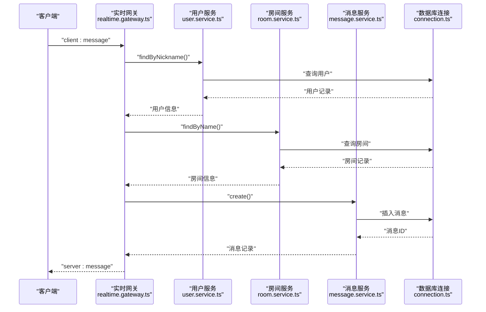
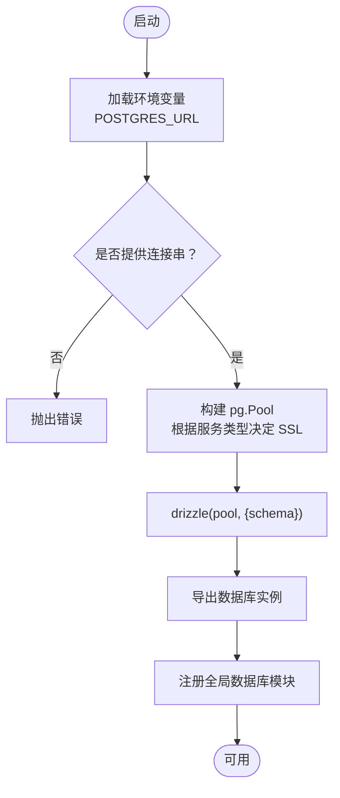
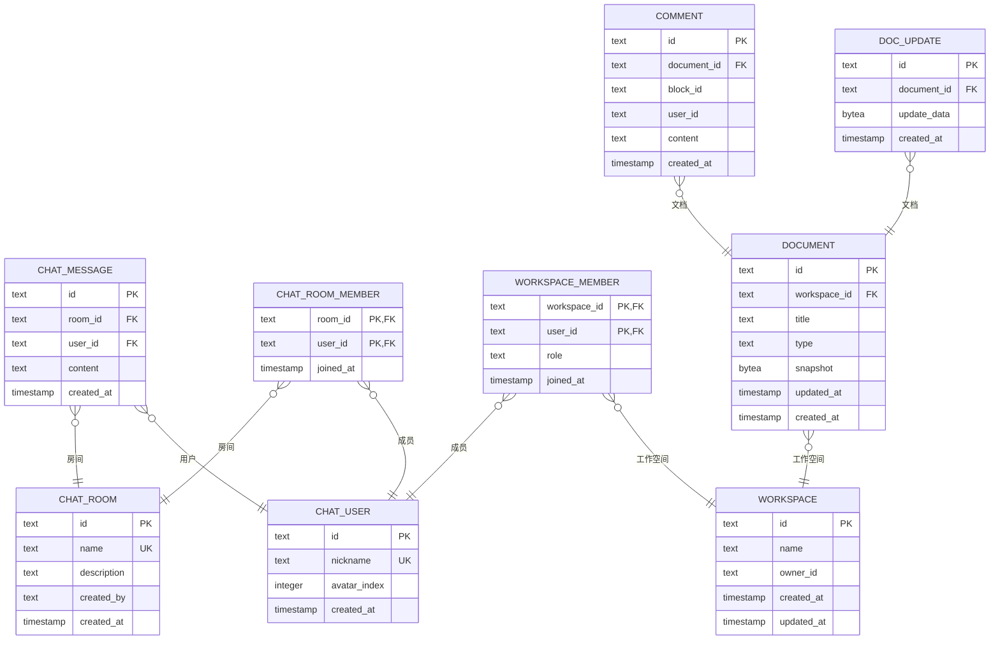
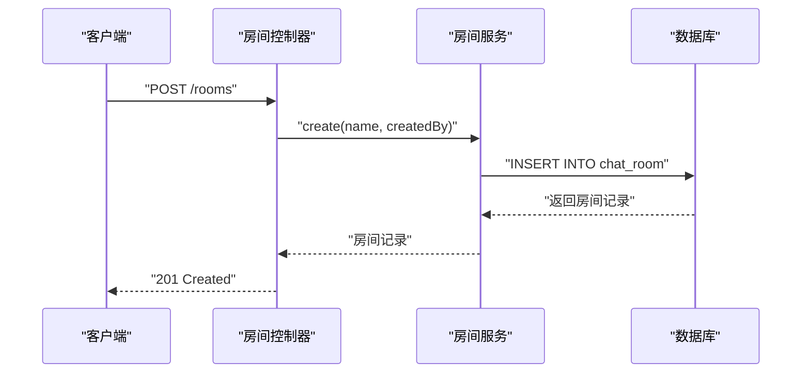
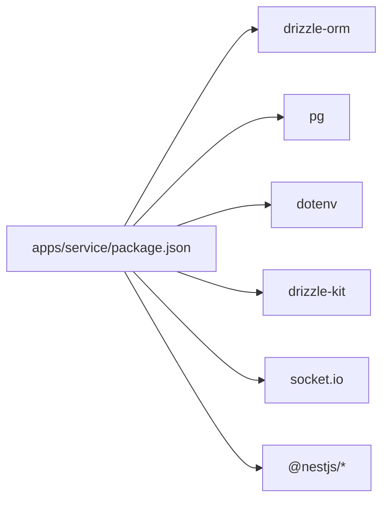

# 数据库集成

<cite>
**本文引用的文件**
- [apps/service/src/db/connection.ts](file://apps/service/src/db/connection.ts)
- [apps/service/src/db/schema.ts](file://apps/service/src/db/schema.ts)
- [apps/service/drizzle.config.ts](file://apps/service/drizzle.config.ts)
- [apps/service/src/db/db.module.ts](file://apps/service/src/db/db.module.ts)
- [apps/service/src/user/user.service.ts](file://apps/service/src/user/user.service.ts)
- [apps/service/src/room/room.service.ts](file://apps/service/src/room/room.service.ts)
- [apps/service/src/message/message.service.ts](file://apps/service/src/message/message.service.ts)
- [apps/service/src/room-member/room-member.service.ts](file://apps/service/src/room-member/room-member.service.ts)
- [apps/service/src/room/room.controller.ts](file://apps/service/src/room/room.controller.ts)
- [apps/service/src/realtime/realtime.gateway.ts](file://apps/service/src/realtime/realtime.gateway.ts)
- [apps/service/src/realtime/realtime.service.ts](file://apps/service/src/realtime/realtime.service.ts)
- [apps/service/src/realtime/user.store.ts](file://apps/service/src/realtime/user.store.ts)
- [apps/service/package.json](file://apps/service/package.json)
- [apps/service/drizzle/0000_lovely_blink.sql](file://apps/service/drizzle/0000_lovely_blink.sql)
</cite>

## 更新摘要
**变更内容**
- 新增完整的 Drizzle ORM 数据库集成方案，包含连接池管理和 SSL 处理
- 引入用户、房间、消息和房间成员的完整数据库模型设计
- 新增工作空间、文档、评论等协同编辑相关表结构
- 实现基于 NestJS 的服务层架构，支持 CRUD 操作和实时聊天功能
- 新增 drizzle-kit 迁移工具配置和数据库模式管理
- 集成 WebSocket 实时通信与数据库持久化
- 新增全局数据库模块提供依赖注入支持

## 目录
1. [简介](#简介)
2. [项目结构](#项目结构)
3. [核心组件](#核心组件)
4. [架构总览](#架构总览)
5. [详细组件分析](#详细组件分析)
6. [依赖分析](#依赖分析)
7. [性能考虑](#性能考虑)
8. [故障排查指南](#故障排查指南)
9. [结论](#结论)
10. [附录](#附录)

## 简介
本文件面向需要理解与扩展数据层功能的开发者，系统化梳理基于 Drizzle ORM 的数据库集成方案。内容涵盖：数据库连接配置（含连接池与 SSL 处理）、数据模型设计（用户、房间、消息、房间成员表结构与关系）、CRUD 实现（查询、分页、条件拼装）、查询优化策略、事务处理机制建议、数据迁移方案以及 API 设计与错误处理规范。该方案支持实时聊天功能，包含用户认证、房间管理、消息传递和成员关系管理。**更新** 新增了工作空间、文档、评论等协同编辑功能的完整数据库模型设计。

## 项目结构
数据库相关代码集中在以下位置：
- 连接与初始化：apps/service/src/db/connection.ts
- 模式定义：apps/service/src/db/schema.ts
- 全局模块：apps/service/src/db/db.module.ts
- 配置文件：apps/service/drizzle.config.ts
- 迁移文件：apps/service/drizzle/0000_lovely_blink.sql
- 用户服务：apps/service/src/user/user.service.ts
- 房间服务：apps/service/src/room/room.service.ts
- 消息服务：apps/service/src/message/message.service.ts
- 房间成员服务：apps/service/src/room-member/room-member.service.ts
- 房间控制器：apps/service/src/room/room.controller.ts
- 实时网关：apps/service/src/realtime/realtime.gateway.ts
- 实时服务：apps/service/src/realtime/realtime.service.ts
- 用户存储：apps/service/src/realtime/user.store.ts
- 工具链配置：apps/service/package.json

```mermaid
graph TB
subgraph "应用层"
CONTROLLER["房间控制器<br/>room.controller.ts"]
REALTIME_GATEWAY["实时网关<br/>realtime.gateway.ts"]
USER_STORE["用户存储<br/>user.store.ts"]
END
subgraph "服务层"
USER_SERVICE["用户服务<br/>user.service.ts"]
ROOM_SERVICE["房间服务<br/>room.service.ts"]
MESSAGE_SERVICE["消息服务<br/>message.service.ts"]
MEMBER_SERVICE["房间成员服务<br/>room-member.service.ts"]
REALTIME_SERVICE["实时服务<br/>realtime.service.ts"]
END
subgraph "数据访问层"
DB_CONNECTION["数据库连接<br/>connection.ts"]
DB_SCHEMA["数据库模式<br/>schema.ts"]
DB_MODULE["数据库模块<br/>db.module.ts"]
DRIZZLE_CONFIG["Drizzle配置<br/>drizzle.config.ts"]
MIGRATION["数据库迁移<br/>0000_lovely_blink.sql"]
END
subgraph "外部依赖"
DRIZZLE["drizzle-orm"]
PG["pg (PostgreSQL 驱动)"]
DOTENV["dotenv"]
KIT["drizzle-kit"]
SOCKETIO["socket.io"]
NESTJS["@nestjs/*"]
END
CONTROLLER --> ROOM_SERVICE
CONTROLLER --> MEMBER_SERVICE
REALTIME_GATEWAY --> USER_SERVICE
REALTIME_GATEWAY --> ROOM_SERVICE
REALTIME_GATEWAY --> MESSAGE_SERVICE
REALTIME_GATEWAY --> MEMBER_SERVICE
REALTIME_GATEWAY --> REALTIME_SERVICE
USER_SERVICE --> DB_CONNECTION
ROOM_SERVICE --> DB_CONNECTION
MESSAGE_SERVICE --> DB_CONNECTION
MEMBER_SERVICE --> DB_CONNECTION
DB_CONNECTION --> DB_SCHEMA
DB_CONNECTION --> PG
DB_CONNECTION --> DOTENV
DB_MODULE --> DB_CONNECTION
DRIZZLE_CONFIG --> KIT
DRIZZLE_CONFIG --> MIGRATION
REALTIME_GATEWAY --> SOCKETIO
USER_STORE --> NESTJS
```

**图表来源**
- [apps/service/src/room/room.controller.ts:13-63](file://apps/service/src/room/room.controller.ts#L13-L63)
- [apps/service/src/realtime/realtime.gateway.ts:34-51](file://apps/service/src/realtime/realtime.gateway.ts#L34-L51)
- [apps/service/src/db/connection.ts:18](file://apps/service/src/db/connection.ts#L18)
- [apps/service/src/db/schema.ts:1-68](file://apps/service/src/db/schema.ts#L1-L68)
- [apps/service/src/db/db.module.ts:1-17](file://apps/service/src/db/db.module.ts#L1-L17)
- [apps/service/drizzle.config.ts:1-11](file://apps/service/drizzle.config.ts#L1-L11)
- [apps/service/drizzle/0000_lovely_blink.sql:1-82](file://apps/service/drizzle/0000_lovely_blink.sql#L1-L82)

## 核心组件
- **数据库连接与连接池**
  - 使用 pg.Pool 创建连接池，并通过环境变量控制 SSL；通过 drizzle 初始化 ORM
  - 关键点：POSTGRES_URL 必填；neon.tech 场景自动关闭证书校验
  - **新增** 全局数据库模块提供依赖注入支持
- **数据模型设计**
  - chatUser：用户表，包含唯一昵称和头像索引
  - chatRoom：房间表，包含房间名称和创建者信息
  - chatMessage：消息表，关联用户和房间，支持内容存储
  - chatRoomMember：房间成员关联表，实现多对多关系
  - **新增** workspace：工作空间表，支持团队协作
  - **新增** workspaceMember：工作空间成员表，支持角色管理
  - **新增** document：文档表，支持富文本和多维表格
  - **新增** docUpdate：Yjs增量更新表
  - **新增** comment：评论表，支持文档评论功能
- **服务层架构**
  - 用户服务：提供用户查找、创建和查找或创建功能
  - 房间服务：提供房间创建、查询和查找功能
  - 消息服务：提供消息创建和房间历史查询功能
  - 房间成员服务：提供成员添加、删除和查询功能
- **实时聊天集成**
  - WebSocket 网关处理用户登录、加入房间和消息发送
  - 用户存储管理内存中的用户状态
  - 实时服务构建各种事件格式

**章节来源**
- [apps/service/src/db/connection.ts:1-20](file://apps/service/src/db/connection.ts#L1-L20)
- [apps/service/src/db/schema.ts:9-160](file://apps/service/src/db/schema.ts#L9-L160)
- [apps/service/src/db/db.module.ts:1-17](file://apps/service/src/db/db.module.ts#L1-L17)
- [apps/service/src/user/user.service.ts:6-63](file://apps/service/src/user/user.service.ts#L6-L63)
- [apps/service/src/room/room.service.ts:6-44](file://apps/service/src/room/room.service.ts#L6-L44)
- [apps/service/src/message/message.service.ts:10-71](file://apps/service/src/message/message.service.ts#L10-L71)
- [apps/service/src/room-member/room-member.service.ts:6-43](file://apps/service/src/room-member/room-member.service.ts#L6-L43)
- [apps/service/src/realtime/realtime.gateway.ts:34-51](file://apps/service/src/realtime/realtime.gateway.ts#L34-L51)

## 架构总览
下图展示从 WebSocket 消息到数据库持久化的整体流程，包括连接池、模式映射与查询执行。



**图表来源**
- [apps/service/src/realtime/realtime.gateway.ts:192-265](file://apps/service/src/realtime/realtime.gateway.ts#L192-L265)
- [apps/service/src/user/user.service.ts:10-26](file://apps/service/src/user/user.service.ts#L10-L26)
- [apps/service/src/room/room.service.ts:35-42](file://apps/service/src/room/room.service.ts#L35-L42)
- [apps/service/src/message/message.service.ts:14-24](file://apps/service/src/message/message.service.ts#L14-L24)
- [apps/service/src/db/connection.ts:18](file://apps/service/src/db/connection.ts#L18)

## 详细组件分析

### 组件一：数据库连接与连接池
- **连接池初始化**
  - 通过环境变量 POSTGRES_URL 提供连接字符串；若未设置则抛出错误
  - 若连接字符串包含特定标识，则启用 SSL 并关闭证书校验以适配某些托管服务
  - 使用 drizzle(pool, { schema }) 将连接与模式绑定
- **连接池参数**
  - 仓库未显式设置最大连接数、空闲超时等参数，默认由 pg.Pool 决定
- **全局模块支持**
  - **新增** 通过 DbModule 提供全局数据库连接实例，支持依赖注入
- **适用场景**
  - 适用于 Vercel、Railway、Neon 等平台的 Postgres 托管服务



**图表来源**
- [apps/service/src/db/connection.ts:6-18](file://apps/service/src/db/connection.ts#L6-L18)
- [apps/service/src/db/db.module.ts:6-16](file://apps/service/src/db/db.module.ts#L6-L16)

**章节来源**
- [apps/service/src/db/connection.ts:1-20](file://apps/service/src/db/connection.ts#L1-L20)
- [apps/service/src/db/db.module.ts:1-17](file://apps/service/src/db/db.module.ts#L1-L17)

### 组件二：数据模型与表关系
- **聊天系统表定义**
  - chatUser：主键 id、唯一昵称、头像索引、创建时间
  - chatRoom：主键 id、唯一名称、描述、创建者、创建时间
  - chatMessage：主键 id、房间ID外键、用户ID外键、内容、创建时间
  - chatRoomMember：复合主键（房间ID、用户ID）、加入时间
- **协同编辑系统表定义**
  - workspace：主键 id、名称、所有者ID、创建/更新时间
  - workspaceMember：复合主键（工作空间ID、用户ID）、角色、加入时间
  - document：主键 id、工作空间ID外键、标题、类型、快照、创建/更新时间
  - docUpdate：主键 id、文档ID外键、更新数据、创建时间
  - comment：主键 id、文档ID外键、块ID、用户ID、内容、创建时间
- **关系设计**
  - 聊天系统：消息-房间-用户多表关联，支持级联删除
  - 协同编辑：文档-工作空间-成员关联，支持级联删除
  - 角色管理：工作空间成员支持 owner/editor/viewer 三种角色
- **类型推断**
  - 通过 schema.ts 导出 Select/Insert 类型，便于在业务层进行类型安全操作



**图表来源**
- [apps/service/src/db/schema.ts:18-160](file://apps/service/src/db/schema.ts#L18-L160)
- [apps/service/drizzle/0000_lovely_blink.sql:1-82](file://apps/service/drizzle/0000_lovely_blink.sql#L1-L82)

**章节来源**
- [apps/service/src/db/schema.ts:1-160](file://apps/service/src/db/schema.ts#L1-L160)

### 组件三：用户服务与 CRUD 操作
- **用户查找**
  - findByNickname：按昵称精确查找，返回唯一用户
  - findById：按ID精确查找，返回唯一用户
- **用户创建**
  - create：创建新用户，自动生成 UUID 主键
  - findOrCreate：查找或创建用户，支持头像索引更新
- **数据验证**
  - 自动去除昵称前后空白字符
  - 头像索引默认值为 1



**图表来源**
- [apps/service/src/room/room.controller.ts:20-41](file://apps/service/src/room/room.controller.ts#L20-L41)
- [apps/service/src/room/room.service.ts:10-20](file://apps/service/src/room/room.service.ts#L10-L20)

**章节来源**
- [apps/service/src/user/user.service.ts:6-63](file://apps/service/src/user/user.service.ts#L6-L63)

### 组件四：房间服务与 CRUD 操作
- **房间管理**
  - create：创建新房间，自动生成 UUID 主键
  - findAll：查询所有房间，按创建时间倒序排列
  - findById：按ID查找房间
  - findByName：按名称查找房间
- **业务逻辑**
  - 房间名称唯一约束
  - 自动处理房间描述的 null 值

**章节来源**
- [apps/service/src/room/room.service.ts:6-44](file://apps/service/src/room/room.service.ts#L6-L44)

### 组件五：消息服务与历史查询
- **消息创建**
  - create：创建消息记录，支持内容存储
- **历史查询**
  - findByRoom：查询房间历史消息，支持限制数量
  - 内连接用户表获取用户信息
  - 按创建时间倒序排列，然后反转以获得时间顺序

**章节来源**
- [apps/service/src/message/message.service.ts:10-71](file://apps/service/src/message/message.service.ts#L10-L71)

### 组件六：房间成员服务
- **成员管理**
  - addMember：添加房间成员，使用 ON CONFLICT DO NOTHING 避免重复
  - removeMember：移除房间成员
  - getMembers：查询房间所有成员，按加入时间排序
- **数据关联**
  - 通过内连接获取用户详细信息（ID、昵称、头像索引）

**章节来源**
- [apps/service/src/room-member/room-member.service.ts:6-43](file://apps/service/src/room-member/room-member.service.ts#L6-L43)

### 组件七：实时聊天集成
- **WebSocket 网关**
  - 处理用户登录、加入房间、发送消息等事件
  - 管理用户会话状态和房间切换
  - 持久化用户和房间关系到数据库
- **用户存储**
  - 内存中的用户状态管理
  - 支持按房间查询用户列表
  - 支持按昵称查找用户

**章节来源**
- [apps/service/src/realtime/realtime.gateway.ts:34-287](file://apps/service/src/realtime/realtime.gateway.ts#L34-L287)
- [apps/service/src/realtime/user.store.ts:9-68](file://apps/service/src/realtime/user.store.ts#L9-L68)

### 组件八：API 接口设计与数据验证
- **房间管理接口**
  - POST /rooms：创建房间，验证 name 和 createdBy 字段
  - GET /rooms：获取所有房间
  - GET /rooms/:id：按ID获取房间
  - GET /rooms/:id/members：获取房间成员
- **数据验证规则**
  - 字段必须非空且去除前后空白
  - 房间名称唯一性检查
  - 错误响应包含 errno 和 message 字段

**章节来源**
- [apps/service/src/room/room.controller.ts:13-63](file://apps/service/src/room/room.controller.ts#L13-L63)

### 组件九：事务处理机制
- **当前实现**
  - 查询接口未显式开启事务，采用单条查询完成
  - 用户登录和房间加入操作涉及多个数据库操作，但未使用事务包装
- **建议**
  - 对于需要强一致性的写操作或批量操作，可使用 drizzle 的事务 API 包裹
  - 在 NestJS 中，可在服务方法内部使用事务上下文，结合错误捕获进行回滚

### 组件十：查询优化策略
- **索引建议**
  - chatUser.nickname：唯一索引，支持快速查找
  - chatRoom.name：唯一索引，支持快速查找
  - chatMessage.roomId：普通索引，支持房间消息查询
  - chatMessage.userId：普通索引，支持用户消息查询
  - chatRoomMember.roomId：普通索引，支持房间成员查询
  - chatRoomMember.userId：普通索引，支持用户房间查询
  - **新增** workspaceMember.workspaceId：普通索引，支持工作空间成员查询
  - **新增** document.workspaceId：普通索引，支持文档查询
  - **新增** comment.documentId：普通索引，支持评论查询
- **查询建议**
  - 使用 LIMIT 控制消息历史数量
  - 仅选择必要字段，避免 SELECT *
  - 对高频查询建立合适索引
- **缓存建议**
  - 对房间列表和用户信息引入短期缓存
  - 对不经常变化的配置数据进行缓存

### 组件十一：数据迁移方案
- **工具链**
  - 使用 drizzle-kit 提供的命令进行迁移与推送
- **常用命令**
  - 生成迁移：pnpm db:generate
  - 应用迁移：pnpm db:migrate
  - 推送变更：pnpm db:push
- **流程建议**
  - 开发阶段：db:generate -> 验证 -> db:migrate 应用
  - 生产阶段：db:generate 生成迁移脚本后，在预生产验证，再执行 db:migrate
- **迁移文件结构**
  - **新增** 0000_lovely_blink.sql 包含完整的初始数据库结构
  - 支持增量迁移和模式同步

**章节来源**
- [apps/service/package.json:22-24](file://apps/service/package.json#L22-L24)
- [apps/service/drizzle.config.ts:1-11](file://apps/service/drizzle.config.ts#L1-L11)
- [apps/service/drizzle/0000_lovely_blink.sql:1-82](file://apps/service/drizzle/0000_lovely_blink.sql#L1-L82)

## 依赖分析
- **运行时依赖**
  - drizzle-orm：ORM 核心库
  - pg：PostgreSQL 驱动，提供连接池能力
  - dotenv：加载环境变量
  - @nestjs/websockets：WebSocket 支持
  - socket.io：实时通信框架
- **开发依赖**
  - drizzle-kit：迁移与建模工具
- **版本与兼容性**
  - drizzle-orm 与 @types/pg、pg 的组合在锁文件中明确声明



**图表来源**
- [apps/service/package.json:26-38](file://apps/service/package.json#L26-L38)
- [apps/service/package.json:51](file://apps/service/package.json#L51)

**章节来源**
- [apps/service/package.json:1-88](file://apps/service/package.json#L1-L88)

## 性能考虑
- **连接池**
  - 默认池参数可能无法满足高并发场景，建议根据实例规格与 QPS 调整最大连接数、空闲超时等参数
- **查询优化**
  - 为高频查询字段建立索引，特别是房间名称、用户昵称和消息查询
  - 使用 LIMIT 控制消息历史数量，避免大量数据传输
  - 对 JOIN 查询使用适当的索引
- **缓存策略**
  - 对只读列表与静态配置引入短期缓存
  - 对用户信息和房间信息进行缓存
- **事务处理**
  - 写操作尽量合并为单事务，减少锁竞争与往返开销
  - 对于复杂的多表操作，使用事务确保一致性
- **协同编辑优化**
  - **新增** docUpdate 表使用 bytea 类型存储二进制增量数据
  - **新增** document 表支持快照存储，优化并发编辑性能

## 故障排查指南
- **环境变量缺失**
  - 现象：启动时报错提示缺少 POSTGRES_URL
  - 处理：在运行环境中正确配置 POSTGRES_URL
- **SSL 连接问题**
  - 现象：连接被拒绝或证书校验失败
  - 处理：确认托管服务类型，必要时允许自签名证书
- **数据库连接失败**
  - 现象：应用启动时数据库连接超时
  - 处理：检查连接字符串格式，确认数据库服务可用性
- **迁移失败**
  - 现象：db:migrate 报错
  - 处理：检查数据库权限，确认连接字符串正确，查看具体错误信息
- **WebSocket 连接问题**
  - 现象：实时聊天功能异常
  - 处理：检查 CORS 配置，确认客户端和服务端版本兼容
- **协同编辑功能异常**
  - **新增** 现象：文档协作功能异常
  - **新增** 处理：检查 Yjs 配置，确认 docUpdate 表结构正确

**章节来源**
- [apps/service/src/db/connection.ts:8-10](file://apps/service/src/db/connection.ts#L8-L10)
- [apps/service/src/realtime/realtime.gateway.ts:23-33](file://apps/service/src/realtime/realtime.gateway.ts#L23-L33)

## 结论
本项目以 Drizzle ORM 为核心，结合 PostgreSQL 和 NestJS，实现了完整的数据库集成方案。通过精心设计的用户、房间、消息和房间成员模型，支持实时聊天功能的完整生命周期。**更新** 新增了工作空间、文档、评论等协同编辑功能的完整数据库模型设计，支持富文本和多维表格的实时协作。连接池管理、SSL 处理和 drizzle-kit 迁移工具的集成，提供了可靠的基础设施。服务层架构清晰，支持类型安全的 CRUD 操作和复杂的业务逻辑。建议后续在事务处理、索引优化、缓存策略和监控告警方面进一步完善，以支撑更高并发和更复杂的数据需求。

## 附录
- **命令速查**
  - 生成迁移：pnpm db:generate
  - 应用迁移：pnpm db:migrate
  - 推送变更：pnpm db:push
- **API 接口**
  - POST /rooms：创建房间
  - GET /rooms：获取房间列表
  - GET /rooms/:id：获取房间详情
  - GET /rooms/:id/members：获取房间成员
- **实时事件**
  - client:login：用户登录
  - client:join：加入房间
  - client:message：发送消息
  - server:message：广播消息
- **新增功能**
  - **新增** 协同编辑接口：支持文档创建、更新、评论功能
  - **新增** 工作空间管理：支持团队协作和权限控制
  - **新增** Yjs 实时协作：支持富文本和多维表格的实时编辑

**章节来源**
- [apps/service/package.json:22-24](file://apps/service/package.json#L22-L24)
- [apps/service/src/room/room.controller.ts:13-63](file://apps/service/src/room/room.controller.ts#L13-L63)
- [apps/service/src/realtime/realtime.gateway.ts:77-265](file://apps/service/src/realtime/realtime.gateway.ts#L77-L265)