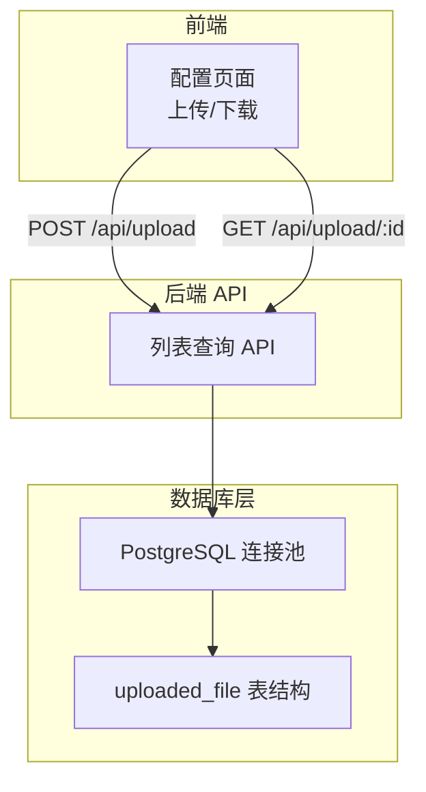
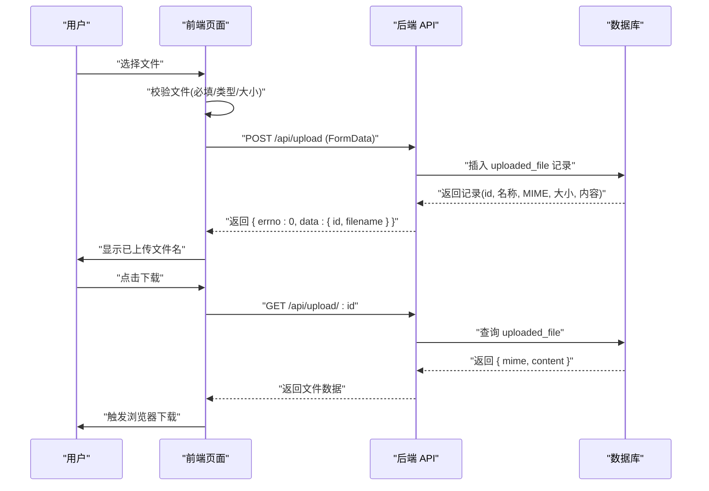
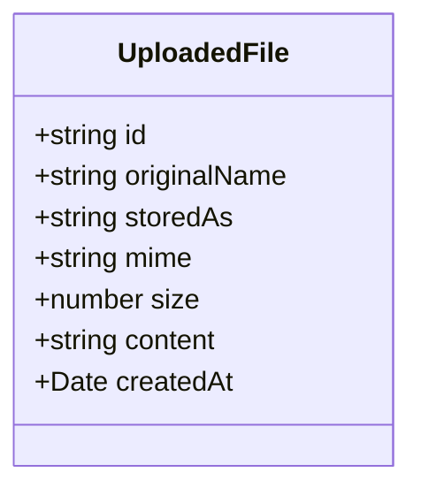
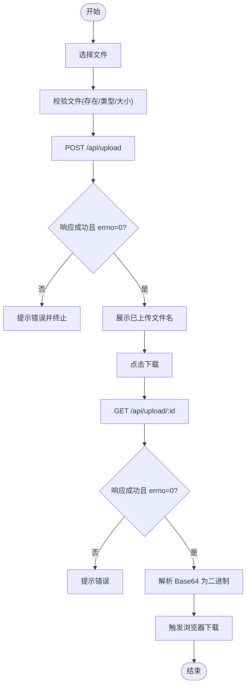
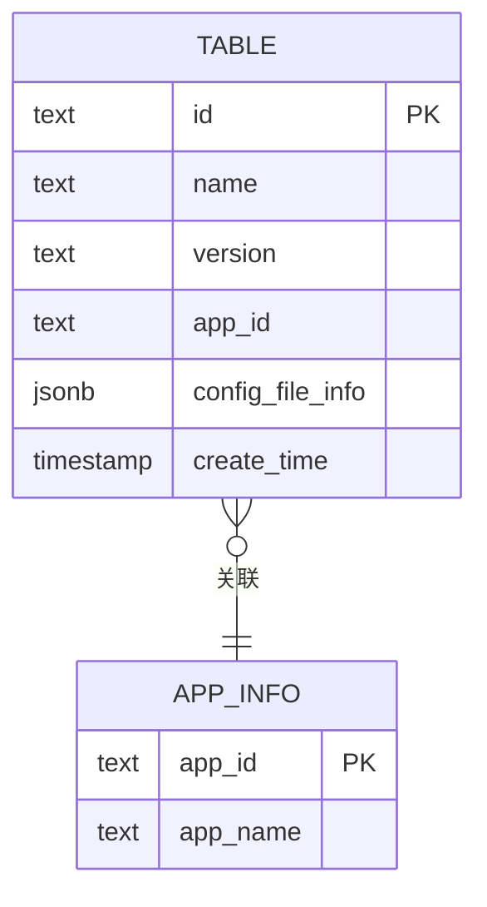
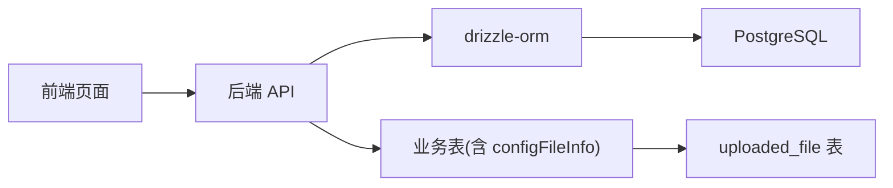

# 上传文件模型

<cite>
**本文档引用的文件**
- [src/lib/table/schema.ts](file://src/lib/table/schema.ts)
- [src/lib/schema.ts](file://src/lib/schema.ts)
- [src/lib/db.ts](file://src/lib/db.ts)
- [src/app/(admin)/(others-pages)/(scene)/config/new/page.tsx](file://src/app/(admin)/(others-pages)/(scene)/config/new/page.tsx)
- [src/app/api/config/list/route.ts](file://src/app/api/config/list/route.ts)
</cite>

## 目录
1. [简介](#简介)
2. [项目结构](#项目结构)
3. [核心组件](#核心组件)
4. [架构总览](#架构总览)
5. [详细组件分析](#详细组件分析)
6. [依赖关系分析](#依赖关系分析)
7. [性能考量](#性能考量)
8. [故障排查指南](#故障排查指南)
9. [结论](#结论)
10. [附录](#附录)

## 简介
本文件围绕 uploadedFile 表的数据库模型与前端上传流程进行系统化说明，覆盖以下方面：
- 数据表结构设计：字段定义、约束与索引建议
- 文件元数据与存储：原始文件名、存储名、MIME 类型、大小、内容（Base64）与创建时间
- 上传流程：前端选择文件、构造表单、调用后端接口、接收并展示上传结果
- 数据验证规则：必填校验、类型校验、范围校验
- 安全性考虑：输入过滤、MIME 类型校验、大小限制、传输安全
- 使用示例：如何在业务表中引用 uploaded_file 记录
- 查询优化策略：分页、条件过滤、连接查询
- 存储管理最佳实践：内容存储方式、清理策略
- 删除与更新操作：如何安全地更新或删除关联记录

## 项目结构
与上传文件模型直接相关的文件组织如下：
- 数据库模型定义：src/lib/table/schema.ts
- 模型导出与类型声明：src/lib/schema.ts
- 数据库连接与 drizzle 配置：src/lib/db.ts
- 前端上传页面与下载逻辑：src/app/(admin)/(others-pages)/(scene)/config/new/page.tsx
- 列表查询 API（演示如何关联 appInfo 与 uploaded_file 引用）：src/app/api/config/list/route.ts

图表来源
- [src/app/(admin)/(others-pages)/(scene)/config/new/page.tsx](file://src/app/(admin)/(others-pages)/(scene)/config/new/page.tsx#L84-L146)
- [src/app/api/config/list/route.ts:1-77](file://src/app/api/config/list/route.ts#L1-L77)
- [src/lib/db.ts:1-19](file://src/lib/db.ts#L1-L19)
- [src/lib/table/schema.ts:1-26](file://src/lib/table/schema.ts#L1-L26)

章节来源
- [src/lib/table/schema.ts:1-26](file://src/lib/table/schema.ts#L1-L26)
- [src/lib/schema.ts:1-24](file://src/lib/schema.ts#L1-L24)
- [src/lib/db.ts:1-19](file://src/lib/db.ts#L1-L19)
- [src/app/(admin)/(others-pages)/(scene)/config/new/page.tsx](file://src/app/(admin)/(others-pages)/(scene)/config/new/page.tsx#L1-L293)
- [src/app/api/config/list/route.ts:1-77](file://src/app/api/config/list/route.ts#L1-L77)

## 核心组件
- uploadedFile 表模型：定义 uploaded_file 表的字段、主键、默认值与约束
- 类型导出：通过 schema.ts 统一导出表对象与 TypeScript 类型
- 数据库连接：使用 drizzle-orm 与 PostgreSQL 连接池
- 前端上传页面：负责文件选择、上传、下载与错误提示
- 列表查询 API：演示如何在查询中连接 appInfo 并返回 uploaded_file 引用

章节来源
- [src/lib/table/schema.ts:3-13](file://src/lib/table/schema.ts#L3-L13)
- [src/lib/schema.ts:15-23](file://src/lib/schema.ts#L15-L23)
- [src/lib/db.ts:1-19](file://src/lib/db.ts#L1-L19)
- [src/app/(admin)/(others-pages)/(scene)/config/new/page.tsx](file://src/app/(admin)/(others-pages)/(scene)/config/new/page.tsx#L84-L146)
- [src/app/api/config/list/route.ts:28-59](file://src/app/api/config/list/route.ts#L28-L59)

## 架构总览
下图展示了从用户选择文件到后端入库、再到前端展示与下载的整体流程。

图表来源
- [src/app/(admin)/(others-pages)/(scene)/config/new/page.tsx](file://src/app/(admin)/(others-pages)/(scene)/config/new/page.tsx#L84-L146)
- [src/lib/table/schema.ts:3-13](file://src/lib/table/schema.ts#L3-L13)

## 详细组件分析

### uploadedFile 表结构设计
uploaded_file 表用于存储上传文件的元数据与内容摘要，字段定义如下：
- id：主键，UUID，默认值为随机生成
- originalName：原始文件名，非空
- storedAs：存储后的文件名，非空
- mime：MIME 类型，非空
- size：文件大小（字节），非空
- content：文件内容的 Base64 字符串，非空
- createdAt：创建时间，默认当前时间，非空

字段约束与类型说明：
- 主键约束：id 为主键，确保唯一性
- 非空约束：originalName、storedAs、mime、size、content、createdAt 均为非空
- 默认值：id 使用随机 UUID；createdAt 使用默认当前时间
- 类型：id/text、originalName/text、storedAs/text、mime/text、size/integer、content/text、createdAt/timestamp

复杂度与存储特性：
- 插入/查询：O(1) 主键查找；按 createdAt 排序为 O(n log n)
- 存储成本：content 以 Base64 文本存储，占用约 1.33 × 原始字节数 + 开销
- 建议：对大文件可考虑外部存储（如对象存储），仅保留元数据在数据库中

章节来源
- [src/lib/table/schema.ts:3-13](file://src/lib/table/schema.ts#L3-L13)

### 数据模型类图

图表来源
- [src/lib/table/schema.ts:3-13](file://src/lib/table/schema.ts#L3-L13)
- [src/lib/schema.ts:20-23](file://src/lib/schema.ts#L20-L23)

### 上传流程与前端交互
- 文件选择：用户通过 input[type=file] 选择文件
- 表单构建：使用 FormData 将 file 字段附加到请求体
- 上传请求：POST /api/upload，后端返回 { errno, data: { id, filename } }
- 下载请求：GET /api/upload/:id，后端返回 { mime, content }，前端将其转换为 Blob 并触发下载
- 错误处理：对 errno 非 0、响应非 ok、content 为空等情况进行统一错误提示

图表来源
- [src/app/(admin)/(others-pages)/(scene)/config/new/page.tsx](file://src/app/(admin)/(others-pages)/(scene)/config/new/page.tsx#L81-L146)

章节来源
- [src/app/(admin)/(others-pages)/(scene)/config/new/page.tsx](file://src/app/(admin)/(others-pages)/(scene)/config/new/page.tsx#L81-L146)

### 数据验证规则
- 必填校验：originalName、storedAs、mime、size、content、createdAt 必须存在
- 类型校验：size 必须为整数；mime 必须为字符串；content 必须为字符串（Base64）
- 范围校验：size 必须为正数；建议在后端增加最大文件大小限制
- 文件类型校验：前端可限制扩展名或 MIME 类型；后端应再次校验
- 传输安全：建议使用 HTTPS，避免明文传输敏感元数据

章节来源
- [src/lib/table/schema.ts:7-12](file://src/lib/table/schema.ts#L7-L12)
- [src/app/(admin)/(others-pages)/(scene)/config/new/page.tsx](file://src/app/(admin)/(others-pages)/(scene)/config/new/page.tsx#L87-L90)

### 安全性考虑
- 输入过滤：对 originalName、storedAs、mime 进行长度与字符集限制
- MIME 类型校验：后端根据实际内容二次确认 MIME 类型
- 大小限制：后端设置最大文件大小阈值，防止内存溢出
- 传输安全：强制 HTTPS，避免中间人攻击
- 权限控制：对上传/下载接口进行鉴权与授权
- 内容净化：对 content 字段进行 Base64 合法性检查

章节来源
- [src/lib/table/schema.ts:7-12](file://src/lib/table/schema.ts#L7-L12)
- [src/app/(admin)/(others-pages)/(scene)/config/new/page.tsx](file://src/app/(admin)/(others-pages)/(scene)/config/new/page.tsx#L95-L98)

### 使用示例：在业务表中引用 uploaded_file
- 在业务表（例如 table）中，通过 JSON 字段保存对 uploaded_file 的引用，包含 id 与 filename
- 列表查询时，通过 LEFT JOIN appInfo 获取应用名称，并返回 configFileInfo 作为文件引用
- 提交时，将 uploadedInfo（包含 id 与 filename）写入业务表的 configFileInfo 字段

图表来源
- [src/lib/table/schema.ts:15-25](file://src/lib/table/schema.ts#L15-L25)
- [src/app/api/config/list/route.ts:28-59](file://src/app/api/config/list/route.ts#L28-L59)

章节来源
- [src/lib/table/schema.ts:15-25](file://src/lib/table/schema.ts#L15-L25)
- [src/app/api/config/list/route.ts:28-59](file://src/app/api/config/list/route.ts#L28-L59)

### 查询优化策略
- 分页：限制每页数量（建议 10~100），计算 offset 与 limit
- 条件过滤：支持按 name、appId、version 进行模糊/精确匹配
- 排序：按 createTime 降序排列，保证最新记录优先
- 连接：LEFT JOIN appInfo 获取应用名称，减少多次查询
- 索引建议：为 appId、createTime 建立索引；为 configFileInfo 中的 id 建立 GIN 索引（如使用 JSONB）

章节来源
- [src/app/api/config/list/route.ts:10-26](file://src/app/api/config/list/route.ts#L10-L26)
- [src/app/api/config/list/route.ts:28-59](file://src/app/api/config/list/route.ts#L28-L59)

### 存储管理最佳实践
- 内容存储：当前采用 Base64 文本存储 content，适合中小文件；大文件建议改为外部对象存储（如 S3），数据库仅存元数据与访问链接
- 清理策略：定期清理超过生命周期的 uploaded_file 记录；删除业务记录时同步删除对应文件（若采用外部存储）
- 备份与恢复：对 uploaded_file 表进行周期性备份；确保备份包含 content 字段
- 性能监控：监控数据库大小增长与查询延迟，必要时迁移至外部存储

章节来源
- [src/lib/table/schema.ts:10-11](file://src/lib/table/schema.ts#L10-L11)

### 删除与更新操作指南
- 更新：当需要替换文件时，先上传新文件获取新 id，再更新业务表中的 configFileInfo 为新的 { id, filename }，最后删除旧记录（若不再使用）
- 删除：删除业务记录前，先判断是否仍有其他引用；若无引用，删除对应的 uploaded_file 记录；若采用外部存储，还需删除对象存储中的文件
- 并发控制：在高并发场景下，使用事务保证上传与引用更新的一致性

章节来源
- [src/app/(admin)/(others-pages)/(scene)/config/new/page.tsx](file://src/app/(admin)/(others-pages)/(scene)/config/new/page.tsx#L147-L189)
- [src/app/api/config/list/route.ts:114-132](file://src/app/api/config/list/route.ts#L114-L132)

## 依赖关系分析
- 前端页面依赖后端 API 提供的上传与下载能力
- 后端 API 依赖 drizzle-orm 与 PostgreSQL 连接池
- uploaded_file 表被业务表（如 table）通过 JSON 字段引用

图表来源
- [src/app/(admin)/(others-pages)/(scene)/config/new/page.tsx](file://src/app/(admin)/(others-pages)/(scene)/config/new/page.tsx#L84-L146)
- [src/lib/db.ts:1-19](file://src/lib/db.ts#L1-L19)
- [src/lib/schema.ts:15-17](file://src/lib/schema.ts#L15-L17)
- [src/lib/table/schema.ts:15-25](file://src/lib/table/schema.ts#L15-L25)

章节来源
- [src/app/(admin)/(others-pages)/(scene)/config/new/page.tsx](file://src/app/(admin)/(others-pages)/(scene)/config/new/page.tsx#L1-L293)
- [src/lib/db.ts:1-19](file://src/lib/db.ts#L1-L19)
- [src/lib/schema.ts:1-24](file://src/lib/schema.ts#L1-L24)
- [src/lib/table/schema.ts:1-26](file://src/lib/table/schema.ts#L1-L26)

## 性能考量
- Base64 存储：content 以文本形式存储，会放大存储空间；建议对大文件采用外部存储
- 查询性能：为高频查询字段建立索引；合理设置分页大小
- 连接池：使用连接池复用数据库连接，降低连接开销
- 缓存：对热点文件元数据进行缓存，减少数据库压力

## 故障排查指南
- 上传失败：检查 errno 是否为 0；确认文件是否存在、类型是否正确、大小是否超限
- 下载失败：确认 /api/upload/:id 返回的 mime 与 content 是否存在；检查 Base64 解码是否成功
- 数据库异常：查看连接池配置与 SSL 设置；确认 POSTGRES_URL 环境变量是否正确
- 列表查询异常：检查条件拼装与排序字段；确认 LEFT JOIN 的关联键是否一致

章节来源
- [src/app/(admin)/(others-pages)/(scene)/config/new/page.tsx](file://src/app/(admin)/(others-pages)/(scene)/config/new/page.tsx#L97-L108)
- [src/app/(admin)/(others-pages)/(scene)/config/new/page.tsx](file://src/app/(admin)/(others-pages)/(scene)/config/new/page.tsx#L115-L146)
- [src/lib/db.ts:7-16](file://src/lib/db.ts#L7-L16)
- [src/app/api/config/list/route.ts:67-76](file://src/app/api/config/list/route.ts#L67-L76)

## 结论
uploaded_file 表提供了简洁而完整的文件元数据与内容摘要存储方案。结合前端上传/下载流程与后端 API，能够满足大多数配置文件的上传与引用需求。对于大文件与高并发场景，建议采用外部对象存储并优化数据库索引与查询策略，以获得更好的性能与可维护性。

## 附录
- 字段清单与含义
  - id：文件唯一标识
  - originalName：原始文件名
  - storedAs：存储后的文件名
  - mime：MIME 类型
  - size：文件大小（字节）
  - content：文件内容的 Base64 字符串
  - createdAt：创建时间

- 建议的索引
  - uploaded_file(id)
  - table(appId)
  - table(createTime)
  - table(configFileInfo) GIN（如使用 JSONB）