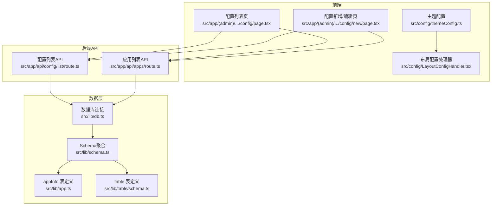
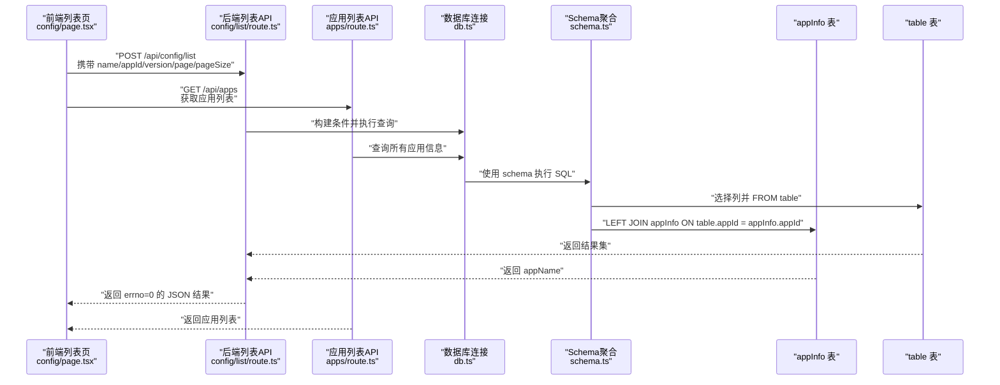
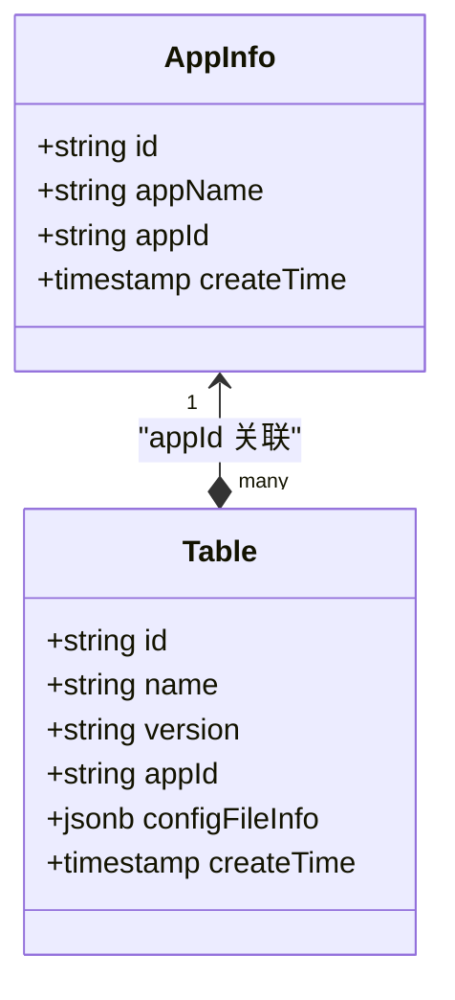
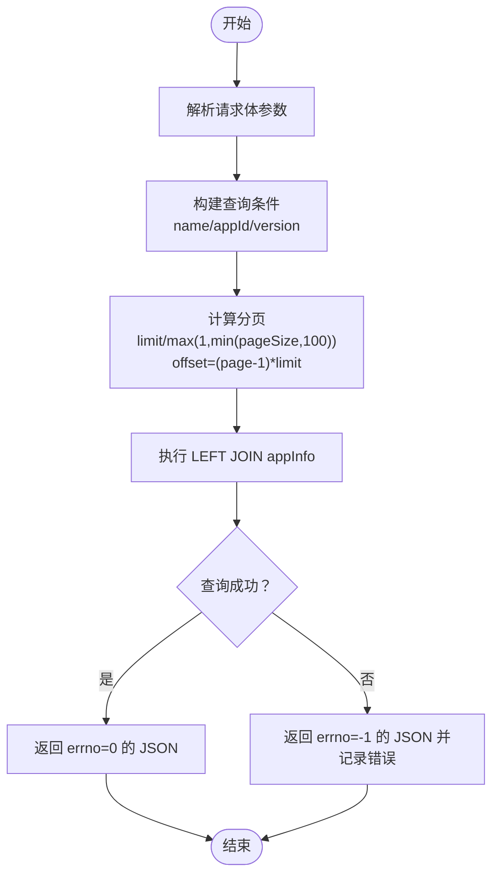
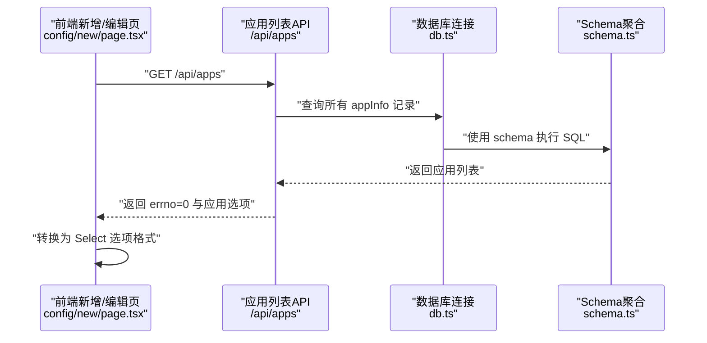
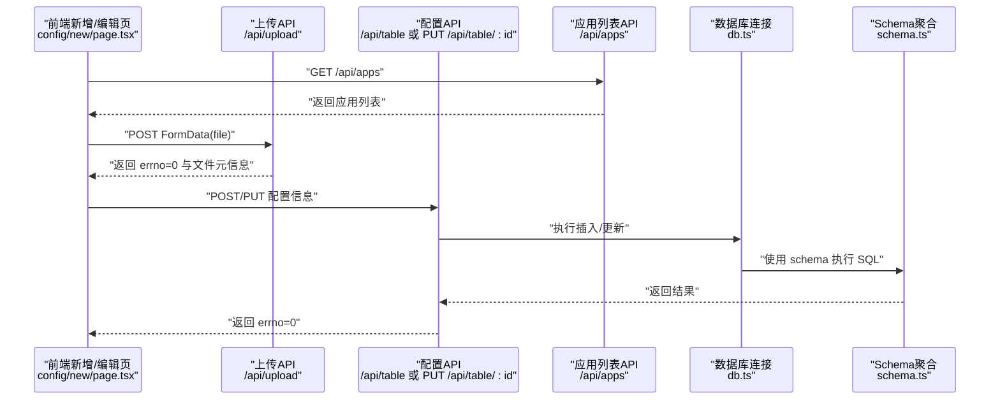
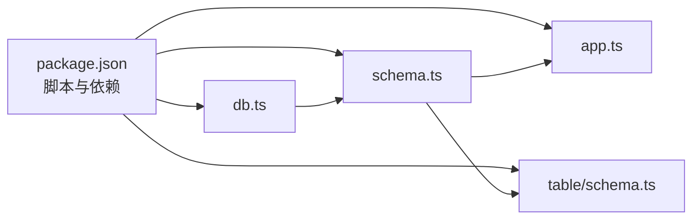

# 应用信息模型

<cite>
**本文档引用的文件**
- [src/lib/app.ts](file://src/lib/app.ts)
- [src/lib/schema.ts](file://src/lib/schema.ts)
- [src/lib/db.ts](file://src/lib/db.ts)
- [src/lib/table/schema.ts](file://src/lib/table/schema.ts)
- [src/app/api/config/list/route.ts](file://src/app/api/config/list/route.ts)
- [src/app/api/apps/route.ts](file://src/app/api/apps/route.ts)
- [src/app/(admin)/(others-pages)/(scene)/config/page.tsx](file://src/app/(admin)/(others-pages)/(scene)/config/page.tsx)
- [src/app/(admin)/(others-pages)/(scene)/config/new/page.tsx](file://src/app/(admin)/(others-pages)/(scene)/config/new/page.tsx)
- [src/config/LayoutConfigHandler.tsx](file://src/config/LayoutConfigHandler.tsx)
- [src/config/themeConfig.ts](file://src/config/themeConfig.ts)
- [package.json](file://package.json)
</cite>

## 更新摘要
**所做更改**
- 新增应用管理API端点 `/api/apps` 的文档说明
- 更新配置页面重构对应用信息处理的影响分析
- 完善应用列表获取与应用ID选择器的实现细节
- 增强应用信息与配置页面的集成关系说明

## 目录
1. [简介](#简介)
2. [项目结构](#项目结构)
3. [核心组件](#核心组件)
4. [架构总览](#架构总览)
5. [详细组件分析](#详细组件分析)
6. [依赖分析](#依赖分析)
7. [性能考虑](#性能考虑)
8. [故障排查指南](#故障排查指南)
9. [结论](#结论)
10. [附录](#附录)

## 简介
本文件围绕"应用信息模型"展开，重点说明 appInfo 表的数据结构设计与使用方式，涵盖以下方面：
- 数据结构定义：字段含义、约束与类型
- 配置参数与版本信息：如何在表结构中表达与关联
- 状态管理：前端页面如何维护与展示状态
- 存储方式：基于 PostgreSQL 与 Drizzle ORM 的持久化
- 动态配置更新机制：前后端交互流程与校验
- 配置验证规则：输入校验与边界控制
- 读取与更新操作示例：接口调用与前端行为
- 配置缓存策略：建议与注意事项
- 版本兼容性处理：版本字段与迁移思路
- 应用生命周期管理与监控指标：可扩展建议

## 项目结构
本项目采用分层组织方式：
- 前端页面与组件位于 src/app 与 src/components 下
- 数据访问层位于 src/lib，包含数据库连接、Schema 定义与表结构
- 配置与主题相关逻辑位于 src/config

**图表来源**
- [src/app/(admin)/(others-pages)/(scene)/config/page.tsx:1-367](file://src/app/(admin)/(others-pages)/(scene)/config/page.tsx#L1-L367)
- [src/app/(admin)/(others-pages)/(scene)/config/new/page.tsx:1-290](file://src/app/(admin)/(others-pages)/(scene)/config/new/page.tsx#L1-L290)
- [src/app/api/config/list/route.ts:1-77](file://src/app/api/config/list/route.ts#L1-L77)
- [src/app/api/apps/route.ts:1-24](file://src/app/api/apps/route.ts#L1-L24)
- [src/lib/db.ts:1-19](file://src/lib/db.ts#L1-L19)
- [src/lib/schema.ts:1-24](file://src/lib/schema.ts#L1-L24)
- [src/lib/app.ts:1-9](file://src/lib/app.ts#L1-L9)
- [src/lib/table/schema.ts:1-26](file://src/lib/table/schema.ts#L1-L26)
- [src/config/LayoutConfigHandler.tsx:1-30](file://src/config/LayoutConfigHandler.tsx#L1-L30)
- [src/config/themeConfig.ts:1-31](file://src/config/themeConfig.ts#L1-L31)

**章节来源**
- [src/lib/db.ts:1-19](file://src/lib/db.ts#L1-L19)
- [src/lib/schema.ts:1-24](file://src/lib/schema.ts#L1-L24)
- [src/lib/app.ts:1-9](file://src/lib/app.ts#L1-L9)
- [src/lib/table/schema.ts:1-26](file://src/lib/table/schema.ts#L1-L26)
- [src/app/api/config/list/route.ts:1-77](file://src/app/api/config/list/route.ts#L1-L77)
- [src/app/api/apps/route.ts:1-24](file://src/app/api/apps/route.ts#L1-L24)
- [src/app/(admin)/(others-pages)/(scene)/config/page.tsx:1-367](file://src/app/(admin)/(others-pages)/(scene)/config/page.tsx#L1-L367)
- [src/app/(admin)/(others-pages)/(scene)/config/new/page.tsx:1-290](file://src/app/(admin)/(others-pages)/(scene)/config/new/page.tsx#L1-L290)
- [src/config/LayoutConfigHandler.tsx:1-30](file://src/config/LayoutConfigHandler.tsx#L1-L30)
- [src/config/themeConfig.ts:1-31](file://src/config/themeConfig.ts#L1-L31)

## 核心组件
本节聚焦 appInfo 表与其在系统中的角色，以及与 table 表的关联关系。

- appInfo 表
  - 字段与约束
    - id：主键，文本类型
    - appName：非空文本，应用名称
    - appId：非空文本，应用唯一标识
    - createTime：非空时间戳，默认当前时间
  - 设计意图
    - 作为"应用"的元信息表，用于与"配置表"进行关联
    - appId 作为跨表关联键，支持多配置对应同一应用

- table 表（与 appInfo 关联）
  - 字段与约束
    - id：主键
    - name：非空文本，配置名称
    - version：非空文本，配置版本
    - appId：非空文本，外键关联 appInfo.appId
    - configFileInfo：JSONB，存储已上传配置文件的元信息（id、filename）
    - createTime：非空时间戳，默认当前时间
  - 关联关系
    - 通过 table.appId 与 appInfo.appId 进行左连接，以在查询时同时返回应用名

- Schema 聚合
  - 在 schema.ts 中导出 appInfo 与 table，并提供类型推断，便于在 TypeScript 中获得强类型支持

**章节来源**
- [src/lib/app.ts:1-9](file://src/lib/app.ts#L1-L9)
- [src/lib/table/schema.ts:1-26](file://src/lib/table/schema.ts#L1-L26)
- [src/lib/schema.ts:1-24](file://src/lib/schema.ts#L1-L24)

## 架构总览
下图展示了从前端到数据库的完整链路，以及 appInfo 与 table 的关联查询路径。

**图表来源**
- [src/app/(admin)/(others-pages)/(scene)/config/page.tsx:63-92](file://src/app/(admin)/(others-pages)/(scene)/config/page.tsx#L63-L92)
- [src/app/api/config/list/route.ts:7-77](file://src/app/api/config/list/route.ts#L7-L77)
- [src/app/api/apps/route.ts:6-23](file://src/app/api/apps/route.ts#L6-L23)
- [src/lib/db.ts:1-19](file://src/lib/db.ts#L1-L19)
- [src/lib/schema.ts:12-17](file://src/lib/schema.ts#L12-L17)
- [src/lib/app.ts:3-8](file://src/lib/app.ts#L3-L8)
- [src/lib/table/schema.ts:15-25](file://src/lib/table/schema.ts#L15-L25)

## 详细组件分析

### 数据模型类图

**图表来源**
- [src/lib/app.ts:3-8](file://src/lib/app.ts#L3-L8)
- [src/lib/table/schema.ts:15-25](file://src/lib/table/schema.ts#L15-L25)

**章节来源**
- [src/lib/app.ts:1-9](file://src/lib/app.ts#L1-L9)
- [src/lib/table/schema.ts:1-26](file://src/lib/table/schema.ts#L1-L26)
- [src/lib/schema.ts:17-24](file://src/lib/schema.ts#L17-L24)

### 列表查询与关联读取
- 查询入口
  - 前端通过 POST /api/config/list 发起请求，传入 name、appId、version、page、pageSize 等参数
- 后端处理
  - 解析参数并构造查询条件（支持模糊/精确匹配）
  - 限定分页范围（最小 1，最大 100）
  - 执行 LEFT JOIN appInfo，返回 appName 与配置信息
- 返回格式
  - 统一 errno=0 成功，errno=-1 失败；成功时返回 data、page、pageSize

**图表来源**
- [src/app/api/config/list/route.ts:7-77](file://src/app/api/config/list/route.ts#L7-L77)

**章节来源**
- [src/app/api/config/list/route.ts:1-77](file://src/app/api/config/list/route.ts#L1-L77)
- [src/app/(admin)/(others-pages)/(scene)/config/page.tsx:63-92](file://src/app/(admin)/(others-pages)/(scene)/config/page.tsx#L63-L92)

### 应用列表管理与应用ID选择器
- 应用列表API
  - GET /api/apps：获取所有应用信息，返回 appInfo 表的完整数据
  - 用于配置页面的下拉选择器，提供应用选项
- 前端集成
  - 新增/编辑页面在加载时调用 /api/apps 获取应用列表
  - 将返回的应用信息转换为 Select 组件的选项格式
  - 支持应用名称与ID的显示，便于用户选择

**图表来源**
- [src/app/(admin)/(others-pages)/(scene)/config/new/page.tsx:65-77](file://src/app/(admin)/(others-pages)/(scene)/config/new/page.tsx#L65-L77)
- [src/app/api/apps/route.ts:6-23](file://src/app/api/apps/route.ts#L6-L23)
- [src/lib/db.ts:1-19](file://src/lib/db.ts#L1-L19)
- [src/lib/schema.ts:12-17](file://src/lib/schema.ts#L12-L17)

**章节来源**
- [src/app/api/apps/route.ts:1-24](file://src/app/api/apps/route.ts#L1-L24)
- [src/app/(admin)/(others-pages)/(scene)/config/new/page.tsx:1-290](file://src/app/(admin)/(others-pages)/(scene)/config/new/page.tsx#L1-L290)

### 新增/编辑配置与文件上传
- 文件上传
  - 前端选择文件后，POST /api/upload 提交二进制文件
  - 后端返回文件元信息（id、filename），写入 configFileInfo
- 提交配置
  - 新增：POST /api/table，携带 name、version、appId、configFileInfo
  - 编辑：PUT /api/table/:id，仅携带 version、appId、configFileInfo
- 输入校验
  - 必填项校验：name、version、appId
  - 文件存在性校验：若选择文件则必须上传成功

**图表来源**
- [src/app/(admin)/(others-pages)/(scene)/config/new/page.tsx:84-189](file://src/app/(admin)/(others-pages)/(scene)/config/new/page.tsx#L84-L189)
- [src/app/api/config/list/route.ts:1-77](file://src/app/api/config/list/route.ts#L1-L77)
- [src/lib/db.ts:1-19](file://src/lib/db.ts#L1-L19)
- [src/lib/schema.ts:12-17](file://src/lib/schema.ts#L12-L17)

**章节来源**
- [src/app/(admin)/(others-pages)/(scene)/config/new/page.tsx:1-290](file://src/app/(admin)/(others-pages)/(scene)/config/new/page.tsx#L1-L290)

### 主题与布局配置（与应用信息模型的关系）
- 主题配置
  - themeConfig.ts 定义了全局主题参数（如颜色、圆角、间距等）
- 布局配置处理器
  - LayoutConfigHandler.tsx 将主题配置映射为 CSS 变量，注入到 :root
- 与 appInfo 的关系
  - 本项目中 appInfo 与主题配置无直接字段关联；但可通过 appInfo.appName 与界面展示结合，形成"应用维度的主题/布局偏好"（建议）

**章节来源**
- [src/config/themeConfig.ts:1-31](file://src/config/themeConfig.ts#L1-L31)
- [src/config/LayoutConfigHandler.tsx:1-30](file://src/config/LayoutConfigHandler.tsx#L1-L30)

## 依赖分析
- 外部依赖
  - 数据库：PostgreSQL（通过 pg 连接池）
  - ORM：Drizzle ORM（node-postgres 实现）
  - 环境变量：POSTGRES_URL（用于连接字符串）
- 内部依赖
  - schema.ts 聚合 appInfo 与 table，供 API 层使用
  - db.ts 提供统一的 drizzle 实例，供 API 层查询

**图表来源**
- [package.json:1-79](file://package.json#L1-L79)
- [src/lib/db.ts:1-19](file://src/lib/db.ts#L1-L19)
- [src/lib/schema.ts:1-24](file://src/lib/schema.ts#L1-L24)
- [src/lib/app.ts:1-9](file://src/lib/app.ts#L1-L9)
- [src/lib/table/schema.ts:1-26](file://src/lib/table/schema.ts#L1-L26)

**章节来源**
- [package.json:1-79](file://package.json#L1-L79)
- [src/lib/db.ts:1-19](file://src/lib/db.ts#L1-L19)
- [src/lib/schema.ts:1-24](file://src/lib/schema.ts#L1-L24)

## 性能考虑
- 分页与限制
  - 后端对 pageSize 进行边界控制（最小 1，最大 100），避免过大请求影响性能
- 连接池与 SSL
  - db.ts 使用 pg.Pool 并根据连接串自动判断是否启用 SSL，提升连接稳定性
- 查询优化
  - 建议在 appId 上建立索引，以加速 LEFT JOIN 与过滤
  - 对 createTime 建立索引，优化排序与分页
- 前端缓存
  - 列表页可在内存中缓存最近一次查询结果，减少重复请求
  - 对于高频筛选（name/appId/version），可引入防抖与去重策略
  - 应用列表可缓存 5 分钟，减少重复拉取

**章节来源**
- [src/app/api/config/list/route.ts:25-26](file://src/app/api/config/list/route.ts#L25-L26)
- [src/lib/db.ts:12-16](file://src/lib/db.ts#L12-L16)

## 故障排查指南
- 环境变量缺失
  - POSTGRES_URL 未设置会导致启动时报错，需在运行环境中提供
- 数据库连接异常
  - 检查连接串格式与目标数据库可达性；neon.tech 场景会自动启用 SSL
- 查询失败
  - API 返回 errno=-1 时，检查请求参数合法性与数据库权限
- 前端错误提示
  - 列表页与新增页均对错误进行统一提示，可据此定位问题
- 应用列表获取失败
  - 检查 /api/apps 端点是否正确部署
  - 确认 appInfo 表中是否存在有效数据

**章节来源**
- [src/lib/db.ts:7-9](file://src/lib/db.ts#L7-L9)
- [src/app/api/config/list/route.ts:67-76](file://src/app/api/config/list/route.ts#L67-L76)
- [src/app/(admin)/(others-pages)/(scene)/config/page.tsx:85-86](file://src/app/(admin)/(others-pages)/(scene)/config/page.tsx#L85-L86)
- [src/app/(admin)/(others-pages)/(scene)/config/new/page.tsx:96-97](file://src/app/(admin)/(others-pages)/(scene)/config/new/page.tsx#L96-L97)
- [src/app/api/apps/route.ts:13-22](file://src/app/api/apps/route.ts#L13-L22)

## 结论
- appInfo 表承担"应用元信息"的职责，与 table 表通过 appId 建立稳定关联
- 通过 Drizzle ORM 与 PostgreSQL，系统实现了清晰的数据模型与可靠的查询能力
- 前端提供了完整的 CRUD 体验，配合统一的 errno 协议，便于错误处理与用户反馈
- 新增的应用管理API端点 `/api/apps` 为配置页面提供了应用列表支持
- 建议后续增强点：在 appId 上增加唯一索引、完善版本号语义与迁移策略、引入配置缓存与监控埋点

## 附录

### 数据结构与字段说明
- appInfo
  - id：应用唯一标识（主键）
  - appName：应用名称
  - appId：应用 ID（与 table.appId 关联）
  - createTime：创建时间
- table
  - id：配置唯一标识（主键）
  - name：配置名称
  - version：配置版本
  - appId：所属应用 ID
  - configFileInfo：JSONB，文件元信息（id、filename）
  - createTime：创建时间

**章节来源**
- [src/lib/app.ts:3-8](file://src/lib/app.ts#L3-L8)
- [src/lib/table/schema.ts:15-25](file://src/lib/table/schema.ts#L15-L25)

### 读取与更新操作示例（步骤说明）
- 读取配置列表
  - 步骤：前端发起 POST /api/config/list，携带 name/appId/version/page/pageSize
  - 后端：解析参数、构造条件、分页、LEFT JOIN appInfo、返回结果
- 获取应用列表
  - 步骤：前端发起 GET /api/apps，获取所有应用信息
  - 后端：查询 appInfo 表，返回应用列表
- 新增配置
  - 步骤：前端上传文件 -> 获取文件元信息 -> 提交 POST /api/table
- 编辑配置
  - 步骤：前端选择新文件或复用旧文件 -> 提交 PUT /api/table/:id
- 删除配置
  - 步骤：前端发起 DELETE /api/config/:id，后端返回 errno=0 表示成功

**章节来源**
- [src/app/api/config/list/route.ts:7-77](file://src/app/api/config/list/route.ts#L7-L77)
- [src/app/api/apps/route.ts:1-24](file://src/app/api/apps/route.ts#L1-L24)
- [src/app/(admin)/(others-pages)/(scene)/config/page.tsx:113-131](file://src/app/(admin)/(others-pages)/(scene)/config/page.tsx#L113-L131)
- [src/app/(admin)/(others-pages)/(scene)/config/new/page.tsx:147-189](file://src/app/(admin)/(others-pages)/(scene)/config/new/page.tsx#L147-L189)

### 配置验证规则
- 必填校验
  - 新增时：name、version、appId 必填
  - 编辑时：version、appId 必填；configFileInfo 可选
- 参数边界
  - page 最小 1，pageSize 最小 1、最大 100
- 类型校验
  - name、appId、version 期望为字符串且非空（trim 后）
- 文件校验
  - 若选择文件，需先上传成功再提交配置
- 应用选择校验
  - appId 必须来自 /api/apps 返回的有效选项

**章节来源**
- [src/app/api/config/list/route.ts:10-26](file://src/app/api/config/list/route.ts#L10-L26)
- [src/app/(admin)/(others-pages)/(scene)/config/new/page.tsx:149-152](file://src/app/(admin)/(others-pages)/(scene)/config/new/page.tsx#L149-L152)

### 配置缓存策略
- 建议
  - 列表页：缓存当前筛选条件下的结果，避免重复请求
  - 应用选项：在新增页缓存 /api/apps 的结果，减少重复拉取（缓存5分钟）
  - 失效策略：当发生新增/编辑/删除后，主动失效相关缓存
- 注意
  - 缓存应与筛选条件绑定（page/pageSize/name/appId/version）
  - 应用列表缓存过期时间可根据实际业务调整

**章节来源**
- [src/app/(admin)/(others-pages)/(scene)/config/page.tsx:63-92](file://src/app/(admin)/(others-pages)/(scene)/config/page.tsx#L63-L92)
- [src/app/(admin)/(others-pages)/(scene)/config/new/page.tsx:65-77](file://src/app/(admin)/(others-pages)/(scene)/config/new/page.tsx#L65-L77)

### 版本兼容性处理
- 版本字段
  - table.version 用于标识配置版本，建议采用语义化版本（如 MAJOR.MINOR.PATCH）
- 兼容策略
  - 读取时按版本排序（默认按 createTime 降序），必要时可增加 version 排序
  - 迁移时保留历史版本，提供回滚能力
- 建议
  - 在 appInfo 中增加 version 字段以表达"应用版本"，并与 table 的 version 协同管理

**章节来源**
- [src/lib/table/schema.ts:18](file://src/lib/table/schema.ts#L18)
- [src/app/api/config/list/route.ts:56-59](file://src/app/api/config/list/route.ts#L56-L59)

### 应用生命周期管理与监控指标
- 生命周期
  - 新建：生成 appInfo 记录（appName、appId）
  - 关联：table 通过 appId 关联 appInfo
  - 更新：编辑 appInfo 或 table
  - 删除：删除 table 记录；谨慎删除 appInfo（需检查外键约束）
- 监控指标（建议）
  - 查询 QPS/RT：统计 /api/config/list 的请求量与耗时
  - 应用列表 QPS/RT：统计 /api/apps 的请求量与耗时
  - 错误率：errno=-1 的比例
  - 文件上传成功率：/api/upload 的成功/失败计数
  - 缓存命中率：列表页缓存命中次数/总查询次数

**章节来源**
- [src/app/api/config/list/route.ts:7-77](file://src/app/api/config/list/route.ts#L7-L77)
- [src/app/api/apps/route.ts:1-24](file://src/app/api/apps/route.ts#L1-L24)
- [src/app/(admin)/(others-pages)/(scene)/config/new/page.tsx:95-109](file://src/app/(admin)/(others-pages)/(scene)/config/new/page.tsx#L95-L109)