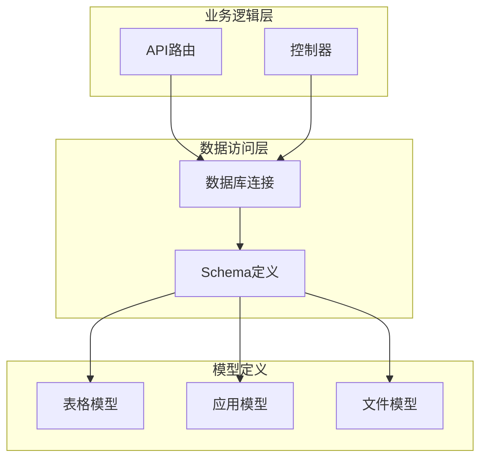
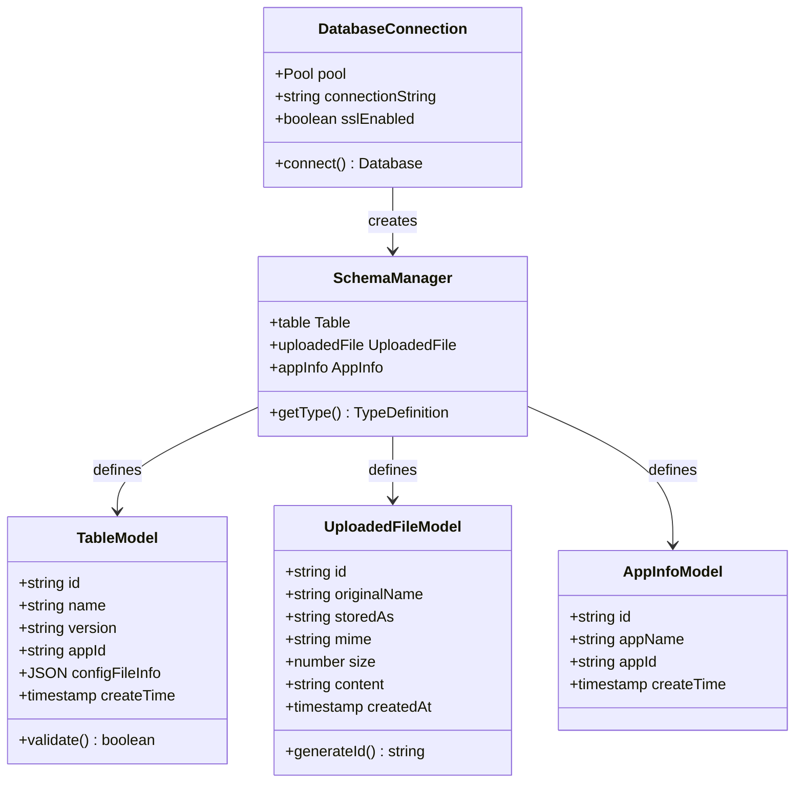
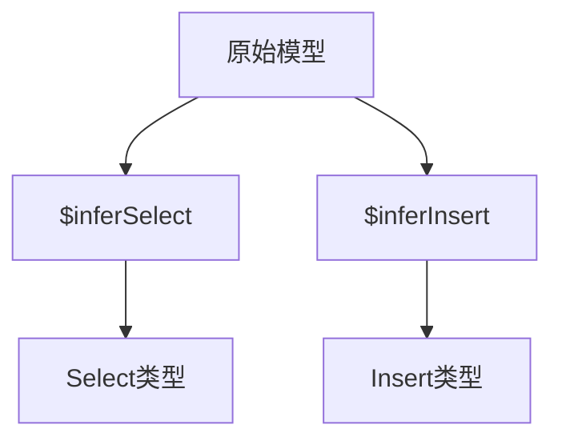
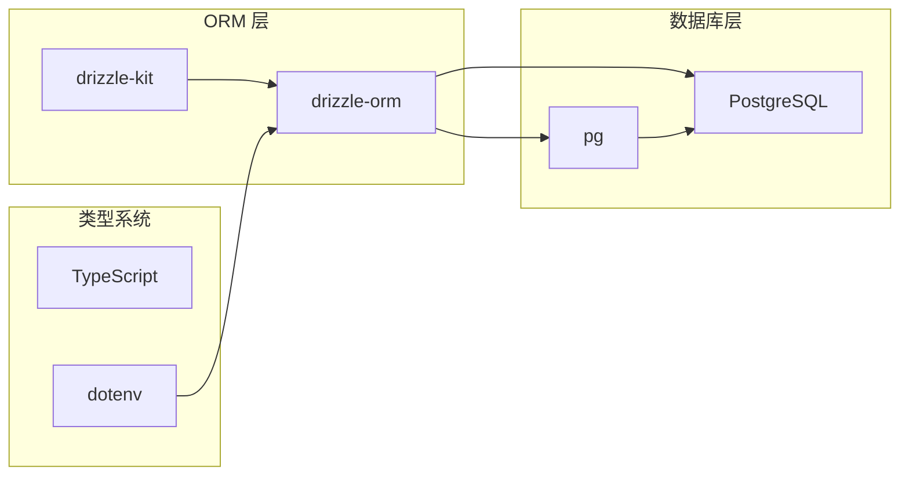
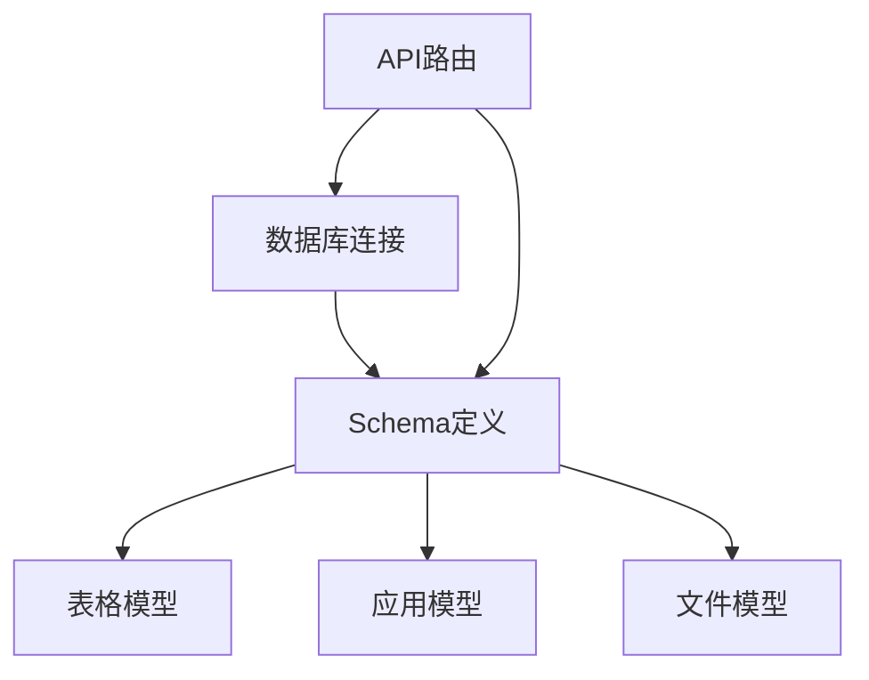

# 数据模型设计

<cite>
**本文档引用的文件**
- [src/lib/db.ts](file://src/lib/db.ts)
- [src/lib/schema.ts](file://src/lib/schema.ts)
- [src/lib/table/schema.ts](file://src/lib/table/schema.ts)
- [src/lib/app.ts](file://src/lib/app.ts)
- [src/app/api/config/list/route.ts](file://src/app/api/config/list/route.ts)
- [package.json](file://package.json)
</cite>

## 目录
1. [简介](#简介)
2. [项目结构](#项目结构)
3. [核心组件](#核心组件)
4. [架构概览](#架构概览)
5. [详细组件分析](#详细组件分析)
6. [依赖分析](#依赖分析)
7. [性能考虑](#性能考虑)
8. [故障排除指南](#故障排除指南)
9. [结论](#结论)

## 简介

本项目采用 Drizzle ORM 作为数据访问层，实现了基于 PostgreSQL 的数据模型设计。项目提供了完整的数据模型定义，包括表结构设计、字段类型选择、主外键关系、约束定义和索引设计。本文档将详细介绍基于 Drizzle ORM 的数据模型实现，包括模型与数据库表的映射关系、数据验证规则、默认值设置、时间戳字段处理，并提供模型扩展指南和版本迁移策略。

## 项目结构

项目采用模块化的设计模式，将数据模型按功能进行组织：

**图表来源**
- [src/lib/db.ts:1-18](file://src/lib/db.ts#L1-L18)
- [src/lib/schema.ts:10-17](file://src/lib/schema.ts#L10-L17)

**章节来源**
- [src/lib/db.ts:1-18](file://src/lib/db.ts#L1-L18)
- [src/lib/schema.ts:10-17](file://src/lib/schema.ts#L10-L17)

## 核心组件

### 数据库连接配置

项目使用 Drizzle ORM 的 node-postgres 适配器建立数据库连接：

- **连接池管理**: 通过 pg 库的 Pool 创建连接池，支持 SSL 连接配置
- **环境变量**: 通过 POSTGRES_URL 环境变量配置数据库连接字符串
- **SSL 支持**: 自动检测 neon.tech 域名并配置相应的 SSL 设置

### Schema 组织结构

项目采用集中式 Schema 管理方式，将不同功能域的数据模型统一导出：

- **table**: 表格配置模型
- **uploadedFile**: 文件上传模型  
- **appInfo**: 应用信息模型

**章节来源**
- [src/lib/db.ts:12-18](file://src/lib/db.ts#L12-L18)
- [src/lib/schema.ts:15-17](file://src/lib/schema.ts#L15-L17)

## 架构概览

**图表来源**
- [src/lib/db.ts:13-18](file://src/lib/db.ts#L13-L18)
- [src/lib/schema.ts:15-23](file://src/lib/schema.ts#L15-L23)

## 详细组件分析

### 表格配置模型 (table)

表格配置模型用于存储应用程序的表格配置信息：

#### 字段设计

| 字段名 | 类型 | 约束 | 描述 |
|--------|------|------|------|
| id | text | 主键 | 唯一标识符，默认自动生成 |
| name | text | 非空 | 表格名称 |
| version | text | 非空 | 版本号 |
| appId | text | 非空 | 应用程序标识符 |
| configFileInfo | jsonb | 类型定义 | JSON 配置信息，包含 id 和 filename |
| createTime | timestamp | 默认当前时间 | 创建时间戳 |

#### 数据验证规则

- 所有文本字段均设置为非空约束
- 主键自动设置为 UUID 格式
- JSONB 字段通过 TypeScript 类型系统进行结构验证

#### 时间戳处理

- 使用 `defaultNow()` 函数设置默认创建时间
- 自动记录数据的创建时间

**章节来源**
- [src/lib/table/schema.ts:15-25](file://src/lib/table/schema.ts#L15-L25)

### 文件上传模型 (uploaded_file)

文件上传模型用于管理用户上传的文件信息：

#### 字段设计

| 字段名 | 类型 | 约束 | 描述 |
|--------|------|------|------|
| id | text | 主键 | 唯一标识符，自动生成 |
| originalName | text | 非空 | 原始文件名 |
| storedAs | text | 非空 | 存储后的文件名 |
| mime | text | 非空 | MIME 类型 |
| size | integer | 非空 | 文件大小（字节） |
| content | text | 非空 | 文件内容 |
| createdAt | timestamp | 默认当前时间 | 创建时间戳 |

#### 默认值设置

- ID 字段使用 `crypto.randomUUID()` 生成唯一标识符
- 创建时间使用 `defaultNow()` 自动设置

#### 数据类型选择

- **text**: 适用于所有文本字段，支持任意长度
- **integer**: 适用于文件大小等数值字段
- **timestamp**: 适用于时间戳字段

**章节来源**
- [src/lib/table/schema.ts:3-13](file://src/lib/table/schema.ts#L3-L13)

### 应用信息模型 (app_info)

应用信息模型用于存储应用程序的基本信息：

#### 字段设计

| 字段名 | 类型 | 约束 | 描述 |
|--------|------|------|------|
| id | text | 主键 | 唯一标识符 |
| appName | text | 非空 | 应用程序名称 |
| appId | text | 非空 | 应用程序标识符 |
| createTime | timestamp | 默认当前时间 | 创建时间戳 |

**章节来源**
- [src/lib/app.ts:3-8](file://src/lib/app.ts#L3-L8)

### 模型类型定义

项目使用 Drizzle ORM 的类型推断功能生成强类型定义：

**图表来源**
- [src/lib/schema.ts:20-23](file://src/lib/schema.ts#L20-L23)

**章节来源**
- [src/lib/schema.ts:20-23](file://src/lib/schema.ts#L20-L23)

## 依赖分析

### 外部依赖

项目依赖以下关键包：

**图表来源**
- [package.json:32-37](file://package.json#L32-L37)
- [package.json:58](file://package.json#L58)

### 内部依赖关系

**图表来源**
- [src/lib/db.ts:4](file://src/lib/db.ts#L4)
- [src/lib/schema.ts:11-12](file://src/lib/schema.ts#L11-L12)

**章节来源**
- [package.json:32-37](file://package.json#L32-L37)
- [src/lib/db.ts:4](file://src/lib/db.ts#L4)

## 性能考虑

### 查询优化

项目在 API 层面实现了多种查询优化策略：

1. **条件过滤**: 支持多条件组合查询
2. **分页机制**: 实现了合理的分页限制（1-100 条）
3. **排序优化**: 默认按创建时间倒序排列
4. **连接优化**: 使用 LEFT JOIN 进行关联查询

### 索引设计建议

虽然当前实现未显式定义索引，但建议在生产环境中添加以下索引：

- `table.appId`: 提高关联查询性能
- `table.name`: 支持名称搜索
- `table.version`: 支持版本过滤
- `uploaded_file.originalName`: 支持文件名搜索
- `app_info.appId`: 提高应用查询效率

### 连接池配置

- **SSL 检测**: 自动识别 neon.tech 并配置 SSL
- **连接复用**: 使用连接池减少连接开销
- **环境变量**: 通过 POSTGRES_URL 配置连接参数

## 故障排除指南

### 常见问题及解决方案

#### 数据库连接问题

**症状**: 启动时抛出 POSTGRES_URL 缺失错误

**解决方案**: 
1. 确保 `.env` 文件中正确设置 `POSTGRES_URL`
2. 验证数据库连接字符串格式
3. 检查网络连接和防火墙设置

#### 类型不匹配错误

**症状**: TypeScript 编译时报错，提示类型不匹配

**解决方案**:
1. 检查 JSONB 字段的类型定义
2. 确保 `$type<T>()` 泛型参数正确
3. 验证数据库中的实际数据结构

#### 查询性能问题

**症状**: API 响应时间过长

**解决方案**:
1. 添加适当的数据库索引
2. 优化 WHERE 条件的顺序
3. 调整分页参数
4. 考虑查询缓存策略

**章节来源**
- [src/lib/db.ts:7-9](file://src/lib/db.ts#L7-L9)
- [src/app/api/config/list/route.ts:67-76](file://src/app/api/config/list/route.ts#L67-L76)

## 结论

本项目展示了基于 Drizzle ORM 的现代化数据模型设计实践。通过模块化的 Schema 组织、强类型的模型定义和完善的查询优化策略，项目实现了高效、可维护的数据访问层。

### 设计优势

1. **类型安全**: 全面的 TypeScript 类型定义确保编译时类型检查
2. **模块化**: 清晰的文件组织便于维护和扩展
3. **性能优化**: 合理的查询策略和连接池配置
4. **可扩展性**: 易于添加新的数据模型和字段

### 改进建议

1. **索引优化**: 在生产环境中添加必要的数据库索引
2. **约束增强**: 考虑添加外键约束和唯一性约束
3. **事务管理**: 在复杂操作中使用数据库事务
4. **监控指标**: 添加数据库查询性能监控

该数据模型设计为后续的功能扩展奠定了良好的基础，开发者可以在此基础上继续完善数据访问层的功能。