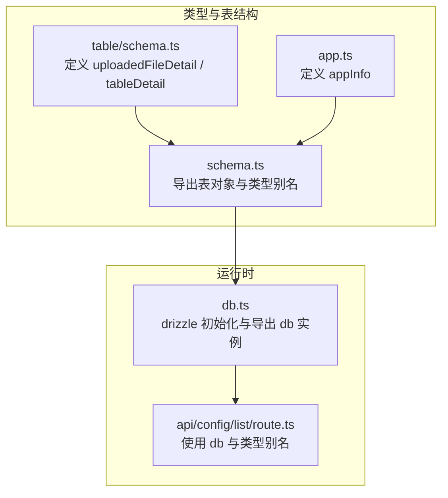
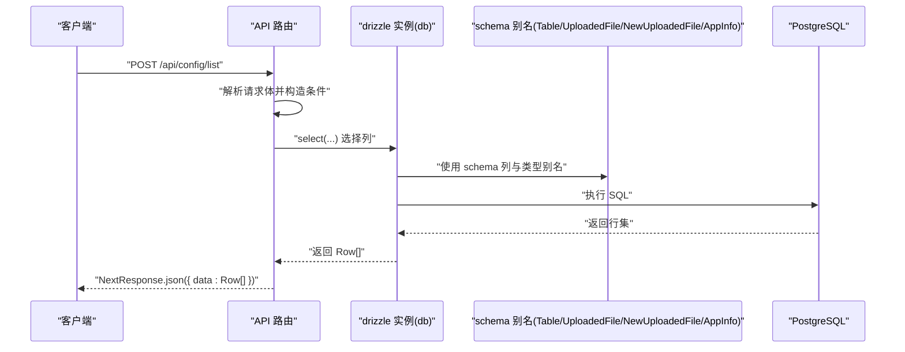
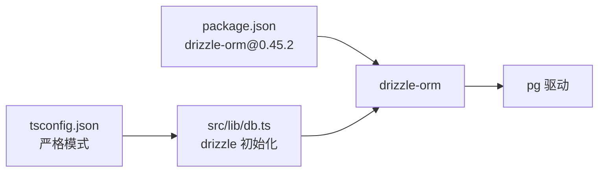

# 类型定义

<cite>
**本文引用的文件**
- [src/lib/db.ts](file://src/lib/db.ts)
- [src/lib/schema.ts](file://src/lib/schema.ts)
- [src/lib/table/schema.ts](file://src/lib/table/schema.ts)
- [src/lib/app.ts](file://src/lib/app.ts)
- [src/app/api/config/list/route.ts](file://src/app/api/config/list/route.ts)
- [package.json](file://package.json)
- [tsconfig.json](file://tsconfig.json)
</cite>

## 目录
1. [引言](#引言)
2. [项目结构](#项目结构)
3. [核心组件](#核心组件)
4. [架构总览](#架构总览)
5. [详细组件分析](#详细组件分析)
6. [依赖分析](#依赖分析)
7. [性能考虑](#性能考虑)
8. [故障排查指南](#故障排查指南)
9. [结论](#结论)
10. [附录](#附录)

## 引言
本章节聚焦于基于 Drizzle ORM 的 TypeScript 类型推导体系，系统阐述以下主题：
- Select 类型与 Insert 类型的区别与使用场景
- $inferSelect 与 $inferInsert 的类型推导机制与泛型参数用法
- 类型安全的数据库操作示例与最佳实践
- 自定义类型扩展与联合类型的处理方法

通过仓库中的实际文件，我们将展示如何在 Next.js 应用中以强类型方式访问数据库表结构，并在 API 层安全地进行查询与返回。

## 项目结构
本项目的类型定义主要分布在以下位置：
- 数据库连接与初始化：src/lib/db.ts
- 表结构与类型别名：src/lib/table/schema.ts、src/lib/app.ts、src/lib/schema.ts
- API 层使用类型进行查询与返回：src/app/api/config/list/route.ts
- 工程配置：package.json（drizzle-orm 版本）、tsconfig.json（严格模式）

图表来源
- [src/lib/table/schema.ts:1-26](file://src/lib/table/schema.ts#L1-L26)
- [src/lib/app.ts:1-9](file://src/lib/app.ts#L1-L9)
- [src/lib/schema.ts:15-23](file://src/lib/schema.ts#L15-L23)
- [src/lib/db.ts:18](file://src/lib/db.ts#L18)
- [src/app/api/config/list/route.ts:1-77](file://src/app/api/config/list/route.ts#L1-L77)

章节来源
- [src/lib/db.ts:1-19](file://src/lib/db.ts#L1-L19)
- [src/lib/schema.ts:15-23](file://src/lib/schema.ts#L15-L23)
- [src/lib/table/schema.ts:1-26](file://src/lib/table/schema.ts#L1-L26)
- [src/lib/app.ts:1-9](file://src/lib/app.ts#L1-L9)
- [src/app/api/config/list/route.ts:1-77](file://src/app/api/config/list/route.ts#L1-L77)
- [package.json:32](file://package.json#L32)
- [tsconfig.json:11](file://tsconfig.json#L11)

## 核心组件
- 表结构定义
  - uploadedFileDetail：用于存储上传文件信息，包含主键 id、原始名称、存储路径、MIME 类型、大小、内容文本与创建时间等字段。
  - tableDetail：用于存储表格配置信息，包含主键 id、名称、版本、应用标识、JSONB 类型的配置文件信息以及创建时间。
  - appInfo：用于存储应用信息，包含主键 id、应用名称、应用标识与创建时间。
- 类型别名导出
  - Table：通过 $inferSelect 推导为表的“查询结果”类型，即 Select 类型。
  - UploadedFile：同上，表示 uploadedFileDetail 的 Select 类型。
  - NewUploadedFile：通过 $inferInsert 推导为“插入/新增”时的类型，即 Insert 类型。
  - AppInfo：appInfo 的 Select 类型。
- 运行时数据库实例
  - db：使用 drizzle 初始化，绑定 schema 并暴露给 API 层使用。

章节来源
- [src/lib/table/schema.ts:3-13](file://src/lib/table/schema.ts#L3-L13)
- [src/lib/table/schema.ts:15-25](file://src/lib/table/schema.ts#L15-L25)
- [src/lib/app.ts:3-8](file://src/lib/app.ts#L3-L8)
- [src/lib/schema.ts:20-23](file://src/lib/schema.ts#L20-L23)
- [src/lib/db.ts:18](file://src/lib/db.ts#L18)

## 架构总览
下图展示了从表结构到类型别名再到 API 查询的完整链路，体现 Drizzle ORM 的类型推导如何贯穿整个数据访问层。

图表来源
- [src/app/api/config/list/route.ts:7-77](file://src/app/api/config/list/route.ts#L7-L77)
- [src/lib/db.ts:18](file://src/lib/db.ts#L18)
- [src/lib/schema.ts:20-23](file://src/lib/schema.ts#L20-L23)

## 详细组件分析

### Select 类型与 Insert 类型：概念与区别
- Select 类型（$inferSelect）
  - 描述：从表结构推导出“查询结果”的类型，通常包含所有可查询的字段，且字段类型与数据库一致。
  - 场景：用于 SELECT 查询返回值、联表查询的投影结果、分页列表等。
- Insert 类型（$inferInsert）
  - 描述：从表结构推导出“插入/新增”时的类型，通常包含所有非生成字段（如自增或默认值字段可能不包含在内）。
  - 场景：用于 INSERT 操作的 payload 校验、表单提交数据校验、批量导入等。

章节来源
- [src/lib/schema.ts:20-23](file://src/lib/schema.ts#L20-L23)

### $inferSelect 与 $inferInsert 的推导机制与泛型参数
- 推导机制
  - 通过 typeof 表对象（例如 typeof table 或 typeof uploadedFileDetail）访问其静态属性 $inferSelect/$inferInsert，Drizzle ORM 在编译期根据表结构生成精确的类型。
- 泛型参数
  - 在当前项目中未直接使用泛型参数显式指定类型；$inferSelect/$inferInsert 默认基于表结构推导。
  - 若需自定义类型映射或扩展，可在类型层面通过工具类型实现，但本项目未展示该用法。

章节来源
- [src/lib/schema.ts:20-23](file://src/lib/schema.ts#L20-L23)

### 类型安全的数据库操作示例
- 查询列表（类型安全的 select 投影）
  - 在 API 中使用 db.select(...) 选择列，列来自 schema 对象（如 tableSchema.id、tableSchema.name 等），返回类型由 $inferSelect 决定，确保响应结构与表结构一致。
  - 示例参考：[src/app/api/config/list/route.ts:31-54](file://src/app/api/config/list/route.ts#L31-L54)
- 条件拼接与联表
  - 使用 and、eq、sql 等组合条件，联表 leftJoin，最终返回 Row[]，类型由 Select 类型保证。
  - 示例参考：[src/app/api/config/list/route.ts:28-59](file://src/app/api/config/list/route.ts#L28-L59)
- 插入操作（Insert 类型）
  - 新增数据时，使用 Insert 类型作为输入约束，确保只传入允许的字段，避免多余或缺失字段导致的错误。
  - 本项目未在现有 API 中直接展示插入示例，但类型别名已提供 NewUploadedFile 作为 Insert 类型，可用于后续新增接口的类型约束。

章节来源
- [src/app/api/config/list/route.ts:28-77](file://src/app/api/config/list/route.ts#L28-L77)
- [src/lib/schema.ts:22](file://src/lib/schema.ts#L22)

### 自定义类型扩展与联合类型的处理
- 自定义类型扩展
  - 可在现有类型基础上进行扩展，例如为 Select 类型添加派生字段或计算字段，但需保持与数据库返回结构一致。
  - 本项目未展示具体扩展示例，但类型别名的存在为扩展提供了基础。
- 联合类型处理
  - 当需要对多个表的查询结果进行统一处理时，可将不同 Select 类型合并为联合类型，再在消费端进行分支判断与收窄。
  - 本项目未展示联合类型用法，但类型别名的存在为该实践提供了类型支撑。

章节来源
- [src/lib/schema.ts:20-23](file://src/lib/schema.ts#L20-L23)

### 类型约束的最佳实践
- 使用 schema 别名进行查询投影，避免硬编码字符串，提升可维护性与安全性。
- 在 API 层对请求体进行类型化解析，结合 Insert 类型进行新增数据校验。
- 在复杂查询中，优先使用 and、eq、sql 等类型安全的条件构建器，减少字符串拼接带来的错误。
- 严格模式下启用 tsconfig.json 的严格选项，确保类型推导更严谨。

章节来源
- [src/app/api/config/list/route.ts:12-23](file://src/app/api/config/list/route.ts#L12-L23)
- [tsconfig.json:11](file://tsconfig.json#L11)

## 依赖分析
- drizzle-orm 版本
  - 项目使用 drizzle-orm@0.45.2，提供 $inferSelect/$inferInsert 等类型推导能力。
- 运行时驱动
  - 使用 pg 驱动与连接池，配合 drizzle 初始化数据库实例。
- 工程配置
  - tsconfig.json 启用严格模式，有助于类型推导与错误发现。

图表来源
- [package.json:32](file://package.json#L32)
- [src/lib/db.ts:1-19](file://src/lib/db.ts#L1-L19)
- [tsconfig.json:11](file://tsconfig.json#L11)

章节来源
- [package.json:32](file://package.json#L32)
- [src/lib/db.ts:1-19](file://src/lib/db.ts#L1-L19)
- [tsconfig.json:11](file://tsconfig.json#L11)

## 性能考虑
- 类型推导在编译期完成，运行时不产生额外开销。
- 使用 schema 别名进行查询投影，可减少不必要的字段传输，降低网络与序列化成本。
- 在 API 层对分页参数进行限制（如最大每页条数），避免过大的查询负载。

## 故障排查指南
- 环境变量缺失
  - 若未设置 POSTGRES_URL，数据库初始化会抛出错误。请检查环境变量配置。
  - 参考：[src/lib/db.ts:7-9](file://src/lib/db.ts#L7-L9)
- 类型不匹配
  - 若 API 返回的数据结构与 Select 类型不一致，TypeScript 将报错。请核对 db.select(...) 的列选择与 schema 别名是否一致。
  - 参考：[src/app/api/config/list/route.ts:31-54](file://src/app/api/config/list/route.ts#L31-L54)
- 严格模式下的编译错误
  - 启用严格模式后，任何类型不明确或潜在问题都会被放大。请根据提示完善类型注解或修复逻辑。
  - 参考：[tsconfig.json:11](file://tsconfig.json#L11)

章节来源
- [src/lib/db.ts:7-9](file://src/lib/db.ts#L7-L9)
- [src/app/api/config/list/route.ts:31-54](file://src/app/api/config/list/route.ts#L31-L54)
- [tsconfig.json:11](file://tsconfig.json#L11)

## 结论
本项目通过 Drizzle ORM 的 $inferSelect/$inferInsert 类型推导，实现了从表结构到运行时查询结果的强类型闭环。配合 schema 别名与严格模式，能够在 API 层安全地进行数据库操作，并为后续扩展（如自定义类型与联合类型）提供坚实基础。建议在新增功能时遵循现有模式，优先使用类型别名与 Insert 类型进行约束，确保类型安全与可维护性。

## 附录
- 关键文件速览
  - 表结构与类型别名：[src/lib/table/schema.ts:1-26](file://src/lib/table/schema.ts#L1-L26)、[src/lib/app.ts:1-9](file://src/lib/app.ts#L1-L9)、[src/lib/schema.ts:15-23](file://src/lib/schema.ts#L15-L23)
  - 数据库实例：[src/lib/db.ts:1-19](file://src/lib/db.ts#L1-L19)
  - API 查询示例：[src/app/api/config/list/route.ts:1-77](file://src/app/api/config/list/route.ts#L1-L77)
  - 工程配置：[package.json](file://package.json#L32)、[tsconfig.json](file://tsconfig.json#L11)