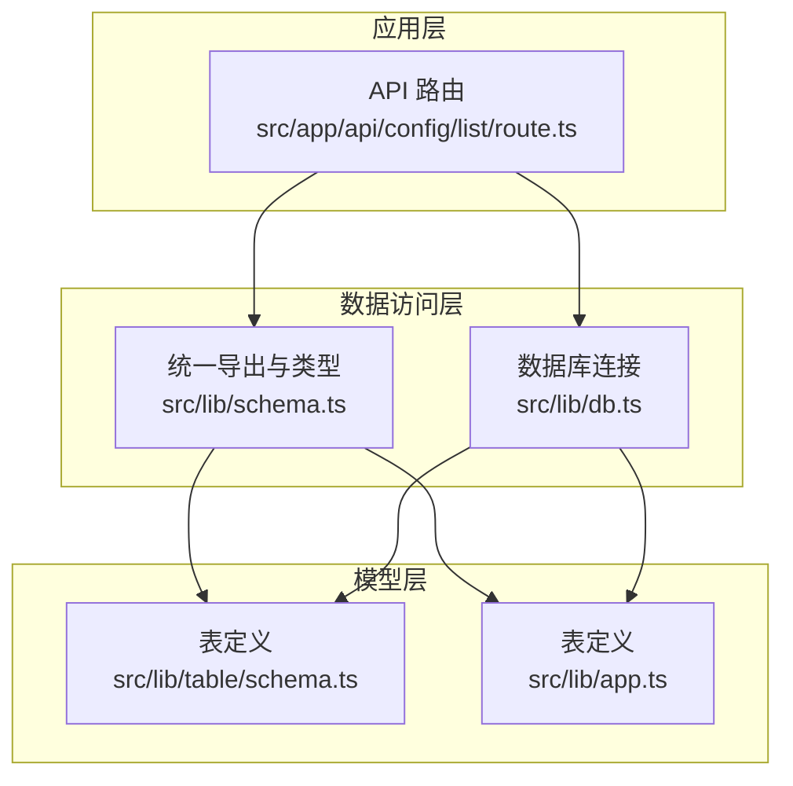
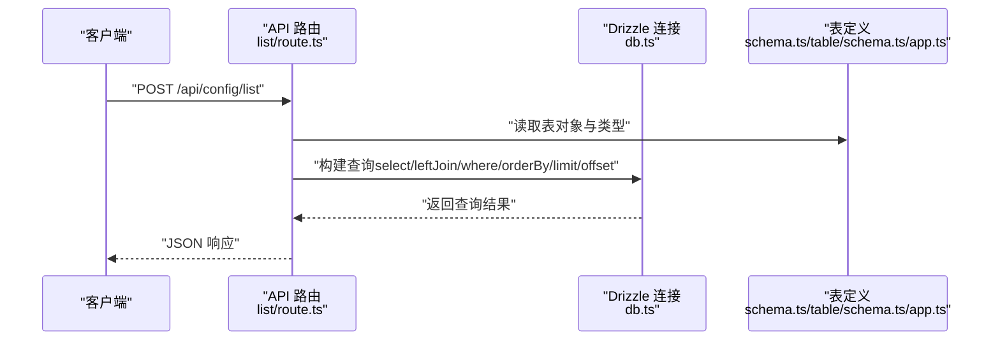
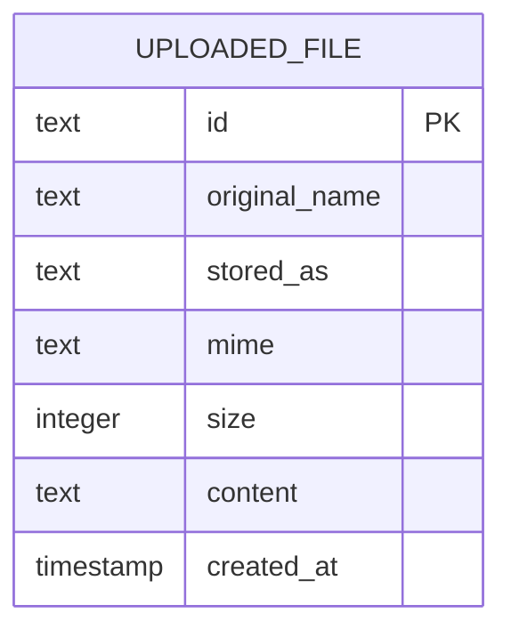
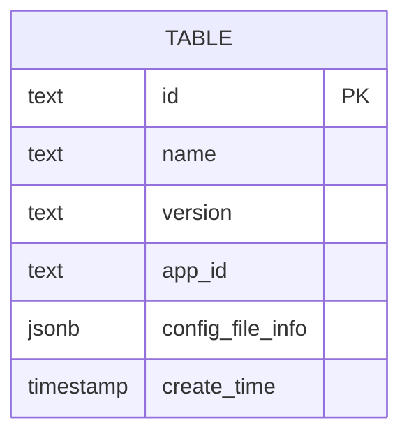
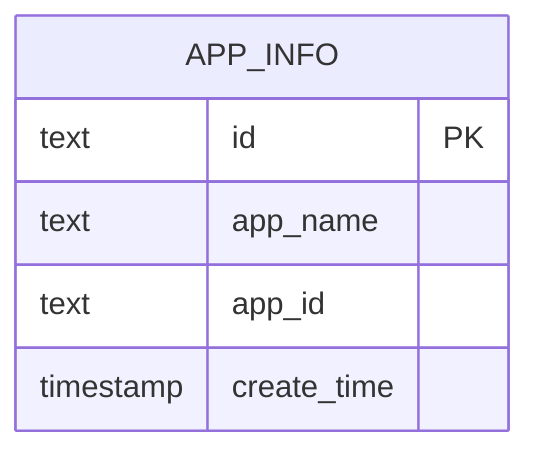
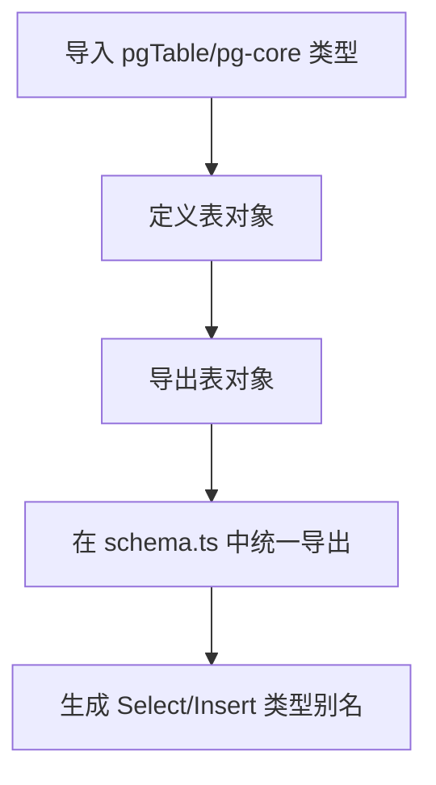
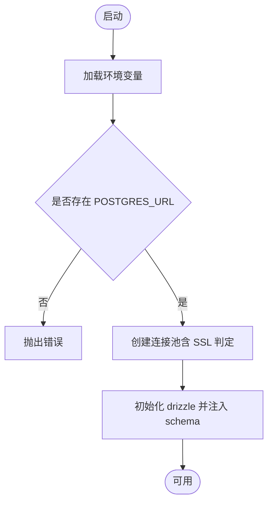
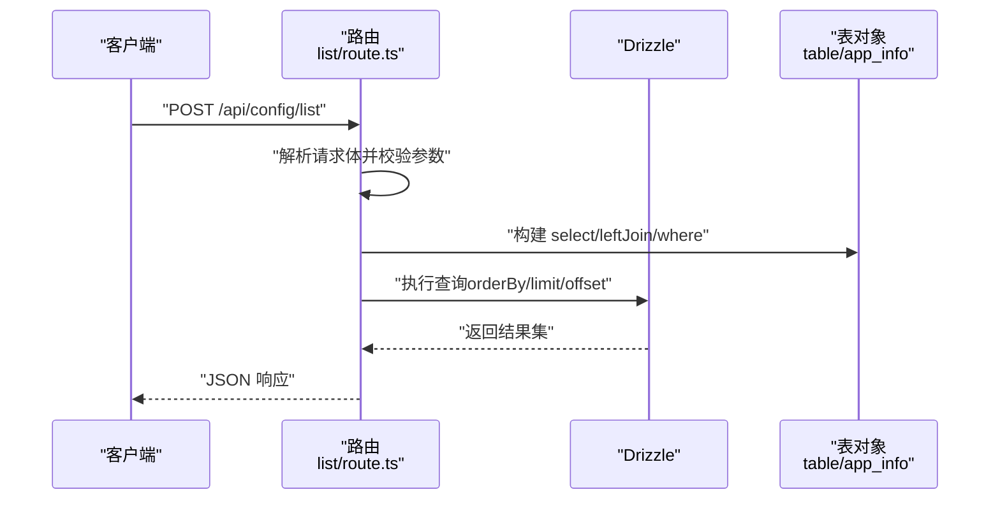
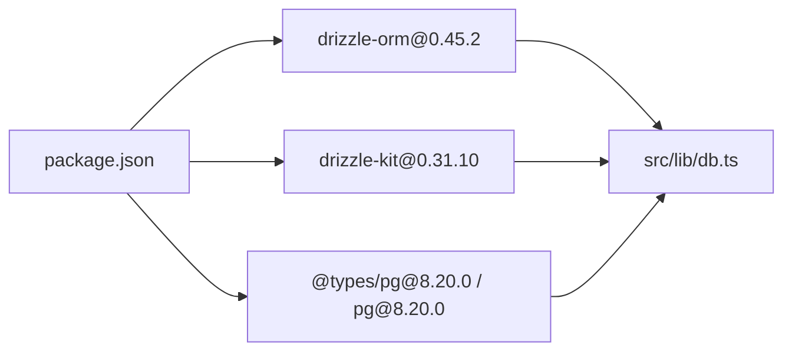

# 表结构定义

<cite>
**本文引用的文件**
- [src/lib/table/schema.ts](file://src/lib/table/schema.ts)
- [src/lib/app.ts](file://src/lib/app.ts)
- [src/lib/schema.ts](file://src/lib/schema.ts)
- [src/lib/db.ts](file://src/lib/db.ts)
- [package.json](file://package.json)
- [src/app/api/config/list/route.ts](file://src/app/api/config/list/route.ts)
</cite>

## 目录
1. [简介](#简介)
2. [项目结构](#项目结构)
3. [核心组件](#核心组件)
4. [架构总览](#架构总览)
5. [详细组件分析](#详细组件分析)
6. [依赖分析](#依赖分析)
7. [性能考虑](#性能考虑)
8. [故障排查指南](#故障排查指南)
9. [结论](#结论)
10. [附录：表结构定义与最佳实践](#附录表结构定义与最佳实践)

## 简介
本章节面向数据库表结构设计与 Drizzle ORM 使用，聚焦于基于 PostgreSQL 的表定义语法与约束、索引、默认值等特性在代码中的落地方式。结合项目现有实现，系统性说明：
- 字段类型映射（text、timestamp、integer、boolean、jsonb）
- 约束定义（主键、非空、外键、唯一索引）
- 默认值设置（数据库默认、函数默认）
- 表与数据库表的映射关系
- 类型推断与 TypeScript 集成
- 实际表定义示例与扩展指南
- 字段类型选择原则与最佳实践

## 项目结构
本项目采用“按功能模块组织”的结构，数据库相关代码集中在 src/lib 下：
- 数据库连接与初始化：src/lib/db.ts
- 表结构定义：src/lib/table/schema.ts、src/lib/app.ts
- 统一导出与类型推断：src/lib/schema.ts
- API 层使用示例：src/app/api/config/list/route.ts
- 依赖与脚手架工具：package.json（包含 drizzle-orm、drizzle-kit）

图表来源
- [src/app/api/config/list/route.ts:1-77](file://src/app/api/config/list/route.ts#L1-L77)
- [src/lib/db.ts:1-18](file://src/lib/db.ts#L1-L18)
- [src/lib/schema.ts:1-24](file://src/lib/schema.ts#L1-L24)
- [src/lib/table/schema.ts:1-26](file://src/lib/table/schema.ts#L1-L26)
- [src/lib/app.ts:1-9](file://src/lib/app.ts#L1-L9)

章节来源
- [src/lib/db.ts:1-18](file://src/lib/db.ts#L1-L18)
- [src/lib/schema.ts:1-24](file://src/lib/schema.ts#L1-L24)
- [src/lib/table/schema.ts:1-26](file://src/lib/table/schema.ts#L1-L26)
- [src/lib/app.ts:1-9](file://src/lib/app.ts#L1-L9)
- [package.json:1-79](file://package.json#L1-L79)

## 核心组件
- 数据库连接与模式绑定：通过 drizzle 初始化连接池，并将自定义 schema 注入到 drizzle 中，使查询时可直接使用表对象进行类型安全操作。
- 表结构定义：使用 pgTable 定义表，字段使用 text、timestamp、integer、jsonb 等类型；通过 primaryKey、notNull、defaultNow、$defaultFn 等方法定义约束与默认值。
- 统一导出与类型推断：将多个表导出为命名常量，并提供 Select/Insert 类型别名，便于在 API 层与 UI 层复用。

章节来源
- [src/lib/db.ts:1-18](file://src/lib/db.ts#L1-L18)
- [src/lib/schema.ts:1-24](file://src/lib/schema.ts#L1-L24)
- [src/lib/table/schema.ts:1-26](file://src/lib/table/schema.ts#L1-L26)
- [src/lib/app.ts:1-9](file://src/lib/app.ts#L1-L9)

## 架构总览
Drizzle ORM 在本项目中的工作流如下：
- 启动时加载环境变量并建立连接池
- 将自定义 schema 注入 drizzle，形成类型安全的查询入口
- API 层通过 schema 对象进行 select、join、where、orderBy、limit/offset 等操作
- 返回结果经 NextResponse.json 序列化给前端

图表来源
- [src/app/api/config/list/route.ts:1-77](file://src/app/api/config/list/route.ts#L1-L77)
- [src/lib/db.ts:1-18](file://src/lib/db.ts#L1-L18)
- [src/lib/schema.ts:1-24](file://src/lib/schema.ts#L1-L24)
- [src/lib/table/schema.ts:1-26](file://src/lib/table/schema.ts#L1-L26)
- [src/lib/app.ts:1-9](file://src/lib/app.ts#L1-L9)

## 详细组件分析

### 表定义：上传文件表（uploaded_file）
- 表名映射：数据库表名为 uploaded_file
- 主键：id 字段为主键
- 默认值：id 使用函数默认值（随机 UUID），createdAt 使用数据库默认值（当前时间）
- 非空约束：originalName、storedAs、mime、size、content 均为非空
- 字段类型：id/text、originalName/text、storedAs/text、mime/text、size/integer、content/text、createdAt/timestamp
- JSONB 类型：未在此表中使用

图表来源
- [src/lib/table/schema.ts:3-13](file://src/lib/table/schema.ts#L3-L13)

章节来源
- [src/lib/table/schema.ts:3-13](file://src/lib/table/schema.ts#L3-L13)

### 表定义：表格配置表（table）
- 表名映射：数据库表名为 table
- 主键：id 字段为主键
- 非空约束：name、version、appId 均为非空
- 默认值：createTime 使用数据库默认值（当前时间）
- JSONB 类型与类型推断：configFileInfo 为 jsonb，使用 $type 指定 TypeScript 类型为包含 id 与 filename 的对象
- 字段类型：id/text、name/text、version/text、appId/text、configFileInfo/jsonb、createTime/timestamp

图表来源
- [src/lib/table/schema.ts:15-25](file://src/lib/table/schema.ts#L15-L25)

章节来源
- [src/lib/table/schema.ts:15-25](file://src/lib/table/schema.ts#L15-L25)

### 表定义：应用信息表（app_info）
- 表名映射：数据库表名为 app_info
- 主键：id 字段为主键
- 非空约束：appName、appId、createTime 均为非空
- 字段类型：id/text、appName/text、appId/text、createTime/timestamp

图表来源
- [src/lib/app.ts:3-8](file://src/lib/app.ts#L3-L8)

章节来源
- [src/lib/app.ts:3-8](file://src/lib/app.ts#L3-L8)

### 统一导出与类型推断
- 统一导出：schema.ts 将多个表导出为命名常量，便于在 API 层集中使用
- 类型推断：通过 $inferSelect/$inferInsert 获取 Select/Insert 类型别名，提升类型安全

图表来源
- [src/lib/schema.ts:1-24](file://src/lib/schema.ts#L1-L24)

章节来源
- [src/lib/schema.ts:1-24](file://src/lib/schema.ts#L1-L24)

### 数据库连接与模式绑定
- 连接池：使用 pg 的 Pool 创建连接池，并根据连接字符串自动判断是否启用 SSL
- 模式注入：将自定义 schema 注入 drizzle，使查询时可直接使用表对象

图表来源
- [src/lib/db.ts:1-18](file://src/lib/db.ts#L1-L18)

章节来源
- [src/lib/db.ts:1-18](file://src/lib/db.ts#L1-L18)

### API 查询流程示例（列表查询）
- 请求体解析：从请求体提取 name、appId、version、page、pageSize
- 动态条件：根据传入参数动态拼接 where 条件
- 左连接：与 app_info 表通过 appId 进行左连接，获取 appName
- 排序与分页：按 createTime 倒序，限制条数并计算偏移
- 响应：返回 errno、data、page、pageSize

图表来源
- [src/app/api/config/list/route.ts:7-77](file://src/app/api/config/list/route.ts#L7-L77)

章节来源
- [src/app/api/config/list/route.ts:1-77](file://src/app/api/config/list/route.ts#L1-L77)

## 依赖分析
- Drizzle ORM 版本：0.45.2
- Drizzle Kit：0.31.10（用于生成迁移、推送、本地调试）
- PostgreSQL 驱动：pg 8.20.0
- 类型支持：@types/pg 8.20.0

图表来源
- [package.json:32-37](file://package.json#L32-L37)
- [package.json:58-66](file://package.json#L58-L66)
- [src/lib/db.ts:1-18](file://src/lib/db.ts#L1-L18)

章节来源
- [package.json:1-79](file://package.json#L1-L79)
- [src/lib/db.ts:1-18](file://src/lib/db.ts#L1-L18)

## 性能考虑
- 连接池：使用 pg 的 Pool 提升并发与资源利用率
- 分页：API 层对 pageSize 进行边界控制（最小 1、最大 100），避免过大分页导致数据库压力
- 排序：对 createTime 倒序排序，建议在该列上建立索引以提升排序性能
- 查询：按需 select 字段，减少网络传输与序列化开销

## 故障排查指南
- 环境变量缺失：若未设置 POSTGRES_URL，初始化时会抛出错误
- 连接异常：检查连接字符串格式与 SSL 配置（neon.tech 场景自动禁用校验）
- 类型不匹配：确保 schema.ts 中导出的表对象与实际数据库一致
- 查询错误：核对 API 层 where 条件拼接逻辑与字段名映射

章节来源
- [src/lib/db.ts:7-9](file://src/lib/db.ts#L7-L9)
- [src/app/api/config/list/route.ts:67-76](file://src/app/api/config/list/route.ts#L67-L76)

## 结论
本项目基于 Drizzle ORM 的 PostgreSQL 方案，实现了类型安全的表结构定义与查询流程。通过统一导出与类型推断，API 层能够以强类型方式访问数据库；通过连接池与分页策略，兼顾了性能与稳定性。后续可在现有基础上扩展索引、外键与更复杂的 JSONB 结构，进一步完善数据模型与查询能力。

## 附录：表结构定义与最佳实践

### 字段类型映射与约束
- text：适用于短文本、标识符、名称等
- timestamp：适用于时间戳，默认值可使用数据库默认或函数默认
- integer：适用于数值型字段，如大小、计数等
- jsonb：适用于半结构化数据，配合 $type 指定 TypeScript 类型
- boolean：适用于布尔值（在 schema.ts 中已导入，可按需使用）

章节来源
- [src/lib/table/schema.ts:1-26](file://src/lib/table/schema.ts#L1-L26)
- [src/lib/app.ts:1-9](file://src/lib/app.ts#L1-L9)
- [src/lib/schema.ts:2-10](file://src/lib/schema.ts#L2-L10)

### 约束定义与默认值
- 主键：通过 primaryKey() 定义
- 非空：通过 notNull() 定义
- 函数默认：通过 $defaultFn(() => ...) 定义（如 UUID）
- 数据库默认：通过 defaultNow() 定义（如时间戳）
- 唯一索引：通过 uniqueIndex() 定义（在 schema.ts 中已导入，可按需使用）
- 外键：通过 foreignKey() 定义（在 schema.ts 中已导入，可按需使用）

章节来源
- [src/lib/table/schema.ts:4-12](file://src/lib/table/schema.ts#L4-L12)
- [src/lib/table/schema.ts:15-25](file://src/lib/table/schema.ts#L15-L25)
- [src/lib/app.ts:3-8](file://src/lib/app.ts#L3-L8)
- [src/lib/schema.ts:6-10](file://src/lib/schema.ts#L6-L10)

### 表与数据库表的映射关系
- 表对象名与数据库表名一一对应
- 字段名与数据库列名一一对应
- 类型推断：$inferSelect/$inferInsert 保证 TypeScript 与数据库一致

章节来源
- [src/lib/schema.ts:15-23](file://src/lib/schema.ts#L15-L23)

### 扩展指南与字段类型选择原则
- 扩展步骤
  - 在对应文件中新增表对象定义（如 app.ts 或 table/schema.ts）
  - 在 schema.ts 中导出新表对象并生成类型别名
  - 在 API 层引入并使用新表对象进行查询
- 类型选择原则
  - 标识符与枚举：优先 text
  - 数值：integer
  - 时间：timestamp
  - 半结构化数据：jsonb，并使用 $type 指定接口
  - 布尔值：boolean（按需添加）
- 约束与默认值
  - 主键：每个表至少一个主键
  - 非空：业务必需字段
  - 默认值：尽量使用数据库默认，减少应用层逻辑
- 索引建议
  - 高频查询字段（如 appId、name、version）建议建立索引
  - 复合条件查询建议复合索引

章节来源
- [src/lib/table/schema.ts:1-26](file://src/lib/table/schema.ts#L1-L26)
- [src/lib/app.ts:1-9](file://src/lib/app.ts#L1-L9)
- [src/lib/schema.ts:1-24](file://src/lib/schema.ts#L1-L24)
- [src/app/api/config/list/route.ts:12-23](file://src/app/api/config/list/route.ts#L12-L23)