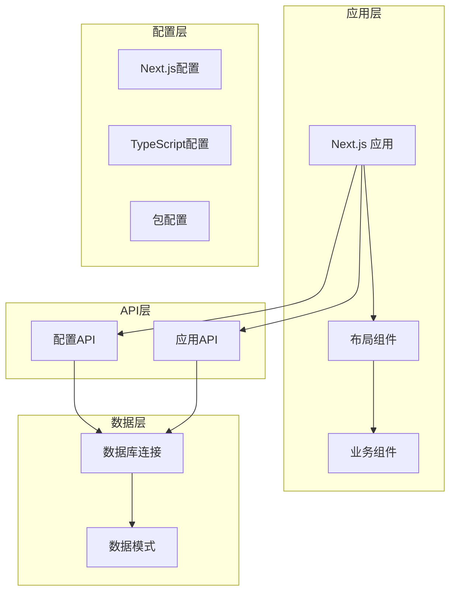
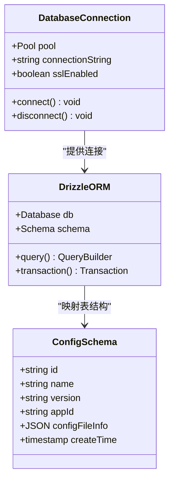
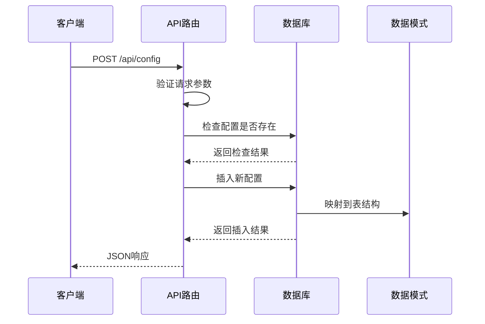
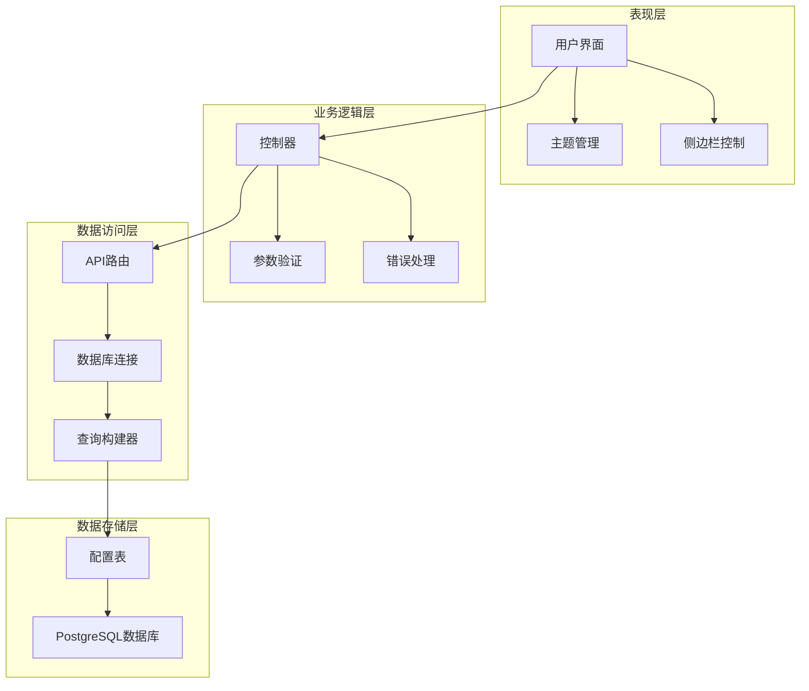
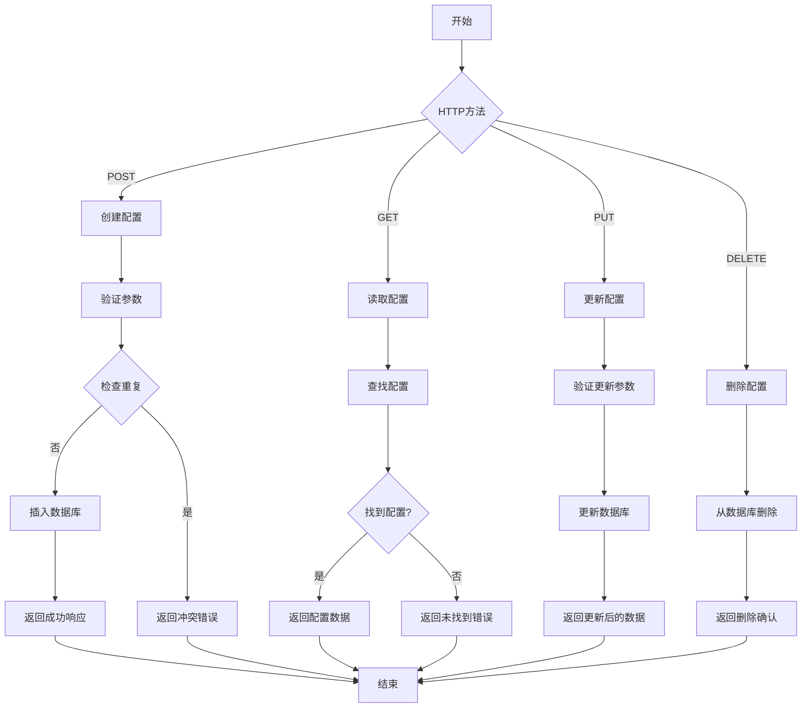
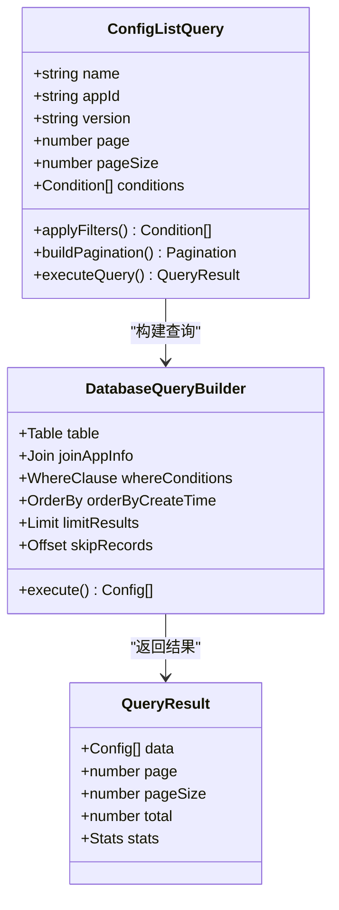
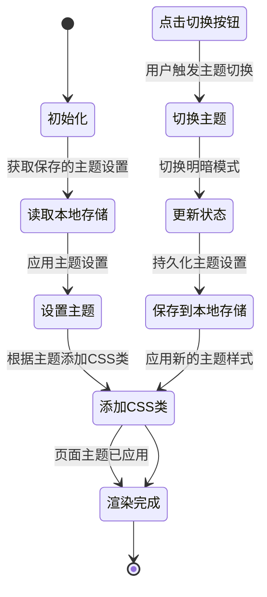
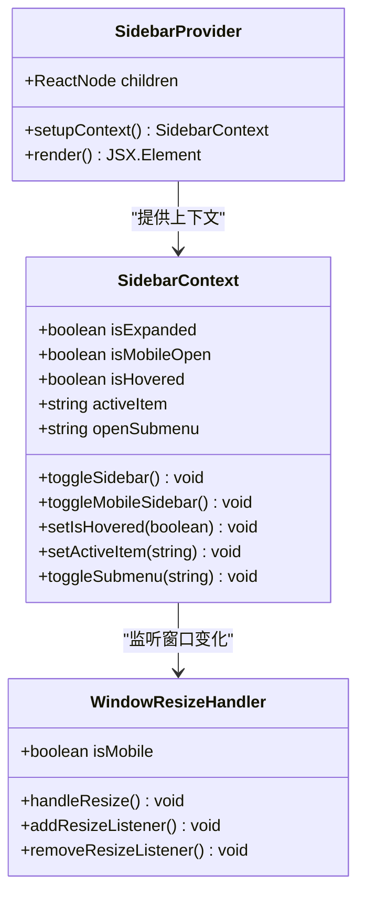

# 配置管理系统

<cite>
**本文档中引用的文件**
- [package.json](file://package.json)
- [next.config.ts](file://next.config.ts)
- [tsconfig.json](file://tsconfig.json)
- [README.md](file://README.md)
- [src/lib/db.ts](file://src/lib/db.ts)
- [src/lib/schema.ts](file://src/lib/schema.ts)
- [src/lib/table/schema.ts](file://src/lib/table/schema.ts)
- [src/lib/app.ts](file://src/lib/app.ts)
- [src/app/api/config/route.ts](file://src/app/api/config/route.ts)
- [src/app/api/config/[id]/route.ts](file://src/app/api/config/[id]/route.ts)
- [src/app/api/config/list/route.ts](file://src/app/api/config/list/route.ts)
- [src/app/api/apps/[appId]/configs/route.ts](file://src/app/api/apps/[appId]/configs/route.ts)
- [src/context/ThemeContext.tsx](file://src/context/ThemeContext.tsx)
- [src/context/SidebarContext.tsx](file://src/context/SidebarContext.tsx)
- [src/layout/AppHeader.tsx](file://src/layout/AppHeader.tsx)
</cite>

## 目录
1. [项目概述](#项目概述)
2. [项目结构](#项目结构)
3. [核心组件](#核心组件)
4. [架构概览](#架构概览)
5. [详细组件分析](#详细组件分析)
6. [依赖关系分析](#依赖关系分析)
7. [性能考虑](#性能考虑)
8. [故障排除指南](#故障排除指南)
9. [结论](#结论)

## 项目概述

这是一个基于Next.js构建的配置管理系统，主要功能包括应用程序配置的增删改查操作、配置版本管理、以及用户界面的主题切换和侧边栏控制。系统采用现代化的技术栈，包括TypeScript、Drizzle ORM、PostgreSQL数据库等。

**章节来源**
- [README.md:1-5](file://README.md#L1-L5)

## 项目结构

项目采用模块化的文件组织方式，主要分为以下几个部分：



**图表来源**
- [next.config.ts:1-25](file://next.config.ts#L1-L25)
- [tsconfig.json:1-42](file://tsconfig.json#L1-L42)
- [package.json:1-79](file://package.json#L1-L79)

**章节来源**
- [next.config.ts:1-25](file://next.config.ts#L1-L25)
- [tsconfig.json:1-42](file://tsconfig.json#L1-L42)
- [package.json:1-79](file://package.json#L1-L79)

## 核心组件

### 数据库配置组件

系统使用Drizzle ORM进行数据库操作，支持PostgreSQL数据库连接池管理。



**图表来源**
- [src/lib/db.ts:1-19](file://src/lib/db.ts#L1-L19)
- [src/lib/table/schema.ts:15-26](file://src/lib/table/schema.ts#L15-L26)

### API路由组件

系统提供完整的RESTful API接口，支持配置的CRUD操作。



**图表来源**
- [src/app/api/config/route.ts:7-55](file://src/app/api/config/route.ts#L7-L55)

**章节来源**
- [src/lib/db.ts:1-19](file://src/lib/db.ts#L1-L19)
- [src/lib/table/schema.ts:15-26](file://src/lib/table/schema.ts#L15-L26)
- [src/app/api/config/route.ts:1-56](file://src/app/api/config/route.ts#L1-L56)

## 架构概览

系统采用分层架构设计，清晰分离了表现层、业务逻辑层和数据访问层：



**图表来源**
- [src/context/ThemeContext.tsx:1-59](file://src/context/ThemeContext.tsx#L1-L59)
- [src/context/SidebarContext.tsx:1-85](file://src/context/SidebarContext.tsx#L1-L85)
- [src/app/api/config/list/route.ts:1-77](file://src/app/api/config/list/route.ts#L1-L77)

## 详细组件分析

### 配置管理API组件

系统提供了完整的配置管理API，支持多种查询和操作模式：

#### CRUD操作流程



**图表来源**
- [src/app/api/config/[id]/route.ts:6-80](file://src/app/api/config/[id]/route.ts#L6-L80)

#### 列表查询组件

系统支持复杂的配置列表查询，包括多条件过滤、分页和排序功能：



**图表来源**
- [src/app/api/config/list/route.ts:7-77](file://src/app/api/config/list/route.ts#L7-L77)

**章节来源**
- [src/app/api/config/[id]/route.ts:1-81](file://src/app/api/config/[id]/route.ts#L1-L81)
- [src/app/api/config/list/route.ts:1-77](file://src/app/api/config/list/route.ts#L1-L77)

### 主题管理系统

系统实现了完整的主题切换功能，支持明暗主题的自动切换和持久化存储：



**图表来源**
- [src/context/ThemeContext.tsx:15-59](file://src/context/ThemeContext.tsx#L15-L59)

**章节来源**
- [src/context/ThemeContext.tsx:1-59](file://src/context/ThemeContext.tsx#L1-L59)
- [src/layout/AppHeader.tsx:1-174](file://src/layout/AppHeader.tsx#L1-L174)

### 侧边栏控制系统

系统提供了灵活的侧边栏控制机制，支持桌面端和移动端的不同交互模式：



**图表来源**
- [src/context/SidebarContext.tsx:27-85](file://src/context/SidebarContext.tsx#L27-L85)

**章节来源**
- [src/context/SidebarContext.tsx:1-85](file://src/context/SidebarContext.tsx#L1-L85)

## 依赖关系分析

系统的关键依赖关系如下所示：

```mermaid
graph LR
subgraph "运行时依赖"
NEXT[next.js]
DRIZZLE[drizzle-orm]
PG[pg]
REACT[react]
TYPESCRIPT[typescript]
end
subgraph "开发时依赖"
ESLINT[eslint]
PRETTIER[prettier]
TAILWIND[tailwindcss]
TSX[tsx]
end
subgraph "配置管理"
DOTENV[dotenv]
SVGR[@svgr/webpack]
POSTCSS[postcss]
end
NEXT --> DRIZZLE
DRIZZLE --> PG
NEXT --> REACT
TYPESCRIPT --> NEXT
ESLINT --> NEXT
PRETTIER --> NEXT
TAILWIND --> NEXT
DOTENV --> NEXT
SVGR --> NEXT
POSTCSS --> NEXT
```

**图表来源**
- [package.json:15-79](file://package.json#L15-L79)

**章节来源**
- [package.json:1-79](file://package.json#L1-L79)

## 性能考虑

系统在设计时充分考虑了性能优化：

1. **数据库连接池管理**：使用PostgreSQL连接池减少连接开销
2. **查询优化**：实现分页查询和条件过滤，避免全表扫描
3. **缓存策略**：主题设置存储在localStorage中，减少服务器请求
4. **按需加载**：组件采用懒加载机制，提升首屏加载速度
5. **资源优化**：SVG图标通过@svgr/webpack进行优化处理

## 故障排除指南

### 常见问题及解决方案

#### 数据库连接问题
- **症状**：应用启动时报数据库连接错误
- **原因**：POSTGRES_URL环境变量未正确配置
- **解决**：检查环境变量配置，确保连接字符串格式正确

#### API请求失败
- **症状**：配置API调用返回错误
- **原因**：请求参数验证失败或数据库操作异常
- **解决**：检查请求体格式，确保必需字段完整

#### 主题切换失效
- **症状**：主题切换后页面样式未更新
- **原因**：localStorage访问受限或CSS类名不匹配
- **解决**：检查浏览器隐私设置，确认CSS类名正确

**章节来源**
- [src/lib/db.ts:7-9](file://src/lib/db.ts#L7-L9)
- [src/app/api/config/route.ts:11-16](file://src/app/api/config/route.ts#L11-L16)
- [src/context/ThemeContext.tsx:32-38](file://src/context/ThemeContext.tsx#L32-L38)

## 结论

该配置管理系统采用了现代化的技术架构，具有以下特点：

1. **模块化设计**：清晰的分层架构便于维护和扩展
2. **类型安全**：完整的TypeScript支持确保代码质量
3. **性能优化**：合理的数据库设计和查询优化策略
4. **用户体验**：流畅的主题切换和响应式布局
5. **可扩展性**：良好的架构设计支持功能扩展

系统为配置管理提供了完整的技术解决方案，适合在生产环境中部署和使用。