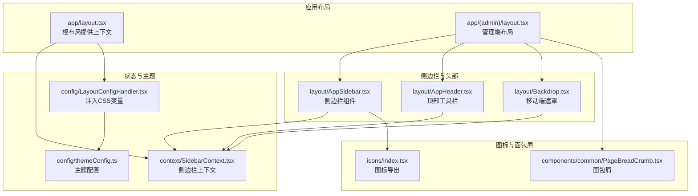
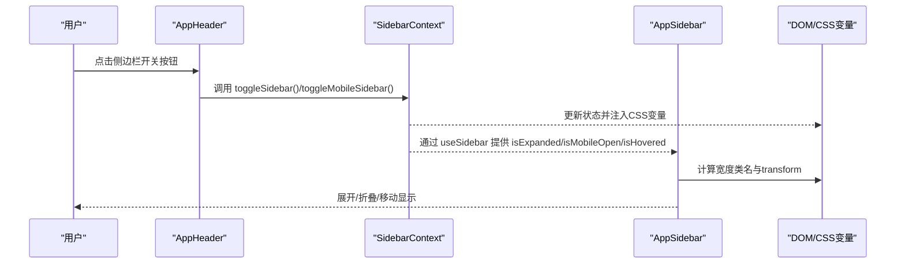
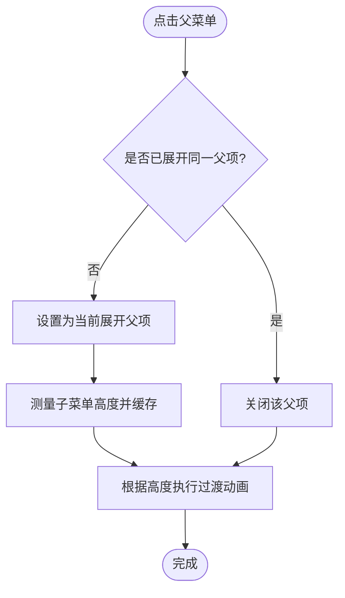
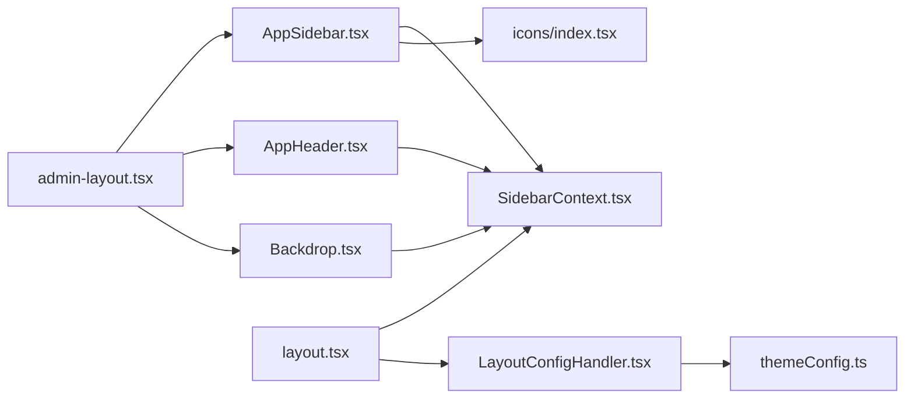

# 侧边栏 AppSidebar

<cite>
**本文引用的文件**
- [AppSidebar.tsx](file://src/layout/AppSidebar.tsx)
- [SidebarContext.tsx](file://src/context/SidebarContext.tsx)
- [AppHeader.tsx](file://src/layout/AppHeader.tsx)
- [Backdrop.tsx](file://src/layout/Backdrop.tsx)
- [layout.tsx](file://src/app/layout.tsx)
- [admin-layout.tsx](file://src/app/(admin)/layout.tsx)
- [PageBreadCrumb.tsx](file://src/components/common/PageBreadCrumb.tsx)
- [index.tsx](file://src/icons/index.tsx)
- [themeConfig.ts](file://src/config/themeConfig.ts)
- [LayoutConfigHandler.tsx](file://src/config/LayoutConfigHandler.tsx)
</cite>

## 目录
1. [简介](#简介)
2. [项目结构](#项目结构)
3. [核心组件](#核心组件)
4. [架构总览](#架构总览)
5. [组件详解](#组件详解)
6. [依赖关系分析](#依赖关系分析)
7. [性能考量](#性能考量)
8. [故障排查指南](#故障排查指南)
9. [结论](#结论)
10. [附录](#附录)

## 简介
本文件系统性解析侧边栏导航组件 AppSidebar 的设计与实现，涵盖：
- 导航菜单结构与路由链接生成
- 活动状态管理与子菜单展开/收起动画
- 与 SidebarContext 的协作与状态同步
- 面包屑导航集成方式
- 响应式行为、移动端手势支持、键盘导航
- 菜单配置选项、图标集成方案、权限控制机制
- 定制与扩展实践示例（以路径引用代替代码片段）

## 项目结构
AppSidebar 所在目录与上下文、布局、图标、主题配置的关系如下图所示：

图表来源
- [layout.tsx:1-33](file://src/app/layout.tsx#L1-L33)
- [admin-layout.tsx](file://src/app/(admin)/layout.tsx#L1-L44)
- [AppSidebar.tsx:1-376](file://src/layout/AppSidebar.tsx#L1-L376)
- [AppHeader.tsx:1-182](file://src/layout/AppHeader.tsx#L1-L182)
- [Backdrop.tsx:1-18](file://src/layout/Backdrop.tsx#L1-L18)
- [SidebarContext.tsx:1-85](file://src/context/SidebarContext.tsx#L1-L85)
- [index.tsx:1-110](file://src/icons/index.tsx#L1-L110)
- [themeConfig.ts:1-31](file://src/config/themeConfig.ts#L1-L31)
- [LayoutConfigHandler.tsx:1-29](file://src/config/LayoutConfigHandler.tsx#L1-L29)

章节来源
- [layout.tsx:1-33](file://src/app/layout.tsx#L1-L33)
- [admin-layout.tsx](file://src/app/(admin)/layout.tsx#L1-L44)

## 核心组件
- AppSidebar：负责渲染主菜单与“其他”菜单、子菜单展开/收起、活动项高亮、响应式宽度与移动端滑动显示。
- SidebarContext：提供全局侧边栏状态（展开/折叠、移动端打开、悬停）、切换函数与事件监听。
- AppHeader：触发侧边栏开关（桌面端/移动端），提供快捷键聚焦输入框等交互。
- Backdrop：移动端侧边栏打开时的遮罩层，点击关闭侧边栏。
- PageBreadCrumb：页面级面包屑，用于页面标题与导航层级展示。
- Icons：统一的图标集合，供菜单项使用。
- 主题配置与CSS变量注入：通过 LayoutConfigHandler 将主题配置映射为CSS变量，驱动侧边栏宽度与间距。

章节来源
- [AppSidebar.tsx:1-376](file://src/layout/AppSidebar.tsx#L1-L376)
- [SidebarContext.tsx:1-85](file://src/context/SidebarContext.tsx#L1-L85)
- [AppHeader.tsx:1-182](file://src/layout/AppHeader.tsx#L1-L182)
- [Backdrop.tsx:1-18](file://src/layout/Backdrop.tsx#L1-L18)
- [PageBreadCrumb.tsx:1-53](file://src/components/common/PageBreadCrumb.tsx#L1-L53)
- [index.tsx:1-110](file://src/icons/index.tsx#L1-L110)
- [LayoutConfigHandler.tsx:1-29](file://src/config/LayoutConfigHandler.tsx#L1-L29)

## 架构总览
AppSidebar 与 SidebarContext 的协作流程如下：

图表来源
- [AppHeader.tsx:13-21](file://src/layout/AppHeader.tsx#L13-L21)
- [SidebarContext.tsx:54-64](file://src/context/SidebarContext.tsx#L54-L64)
- [AppSidebar.tsx:299-312](file://src/layout/AppSidebar.tsx#L299-L312)
- [LayoutConfigHandler.tsx:7-26](file://src/config/LayoutConfigHandler.tsx#L7-L26)

## 组件详解

### 1) 导航菜单结构与路由链接生成
- 菜单项类型定义包含名称、图标、可选路径与子项数组；支持二级子菜单。
- 主菜单与“其他”菜单分别维护两组数据，便于分组展示。
- 路由链接使用 Next.js 的 Link 组件，结合当前路径进行活动状态判断。
- 子菜单项支持“new/pro”徽标提示，用于标识新功能或付费功能。

章节来源
- [AppSidebar.tsx:21-26](file://src/layout/AppSidebar.tsx#L21-L26)
- [AppSidebar.tsx:28-102](file://src/layout/AppSidebar.tsx#L28-L102)
- [AppSidebar.tsx:153-172](file://src/layout/AppSidebar.tsx#L153-L172)
- [AppSidebar.tsx:190-224](file://src/layout/AppSidebar.tsx#L190-L224)

### 2) 活动状态管理
- 使用浏览器路径（usePathname）与菜单项路径对比，确定当前活动项。
- 对于带子菜单的项，若其任一子项匹配当前路径，则该父项保持展开状态。
- 活动态样式通过类名切换实现，确保视觉反馈一致。

章节来源
- [AppSidebar.tsx:5-6](file://src/layout/AppSidebar.tsx#L5-L6)
- [AppSidebar.tsx:243-244](file://src/layout/AppSidebar.tsx#L243-L244)
- [AppSidebar.tsx:246-270](file://src/layout/AppSidebar.tsx#L246-L270)

### 3) 与 SidebarContext 的协作与状态同步
- AppSidebar 通过 useSidebar 获取 isExpanded、isMobileOpen、isHovered，并在鼠标悬停时动态切换。
- AppHeader 根据窗口宽度选择调用桌面端或移动端的切换逻辑。
- 布局层 admin-layout 动态计算主内容区的左边距，基于 SidebarContext 的状态决定是否应用展开/折叠宽度。

章节来源
- [AppSidebar.tsx:105-106](file://src/layout/AppSidebar.tsx#L105-L106)
- [AppSidebar.tsx:310-311](file://src/layout/AppSidebar.tsx#L310-L311)
- [AppHeader.tsx:13-21](file://src/layout/AppHeader.tsx#L13-L21)
- [admin-layout.tsx](file://src/app/(admin)/layout.tsx#L17-L23)

### 4) 菜单展开/收起动画与响应式行为
- 侧边栏宽度由 CSS 变量控制，通过 LayoutConfigHandler 注入，支持展开/折叠两种尺寸。
- 侧边栏宽度与 transform 结合，实现平滑过渡与移动端从左侧滑出。
- 悬停时在非展开状态下临时展开，提升交互体验。
- 移动端窗口小于阈值时自动切换到移动端模式，关闭侧边栏并启用遮罩。

章节来源
- [AppSidebar.tsx:299-309](file://src/layout/AppSidebar.tsx#L299-L309)
- [AppSidebar.tsx:300-307](file://src/layout/AppSidebar.tsx#L300-L307)
- [AppSidebar.tsx:310-311](file://src/layout/AppSidebar.tsx#L310-L311)
- [SidebarContext.tsx:37-52](file://src/context/SidebarContext.tsx#L37-L52)
- [LayoutConfigHandler.tsx:10-12](file://src/config/LayoutConfigHandler.tsx#L10-L12)
- [themeConfig.ts:6-9](file://src/config/themeConfig.ts#L6-L9)

### 5) 面包屑导航集成
- 页面级组件通过引入 PageBreadCrumb 并传入页面标题，即可在页面顶部展示面包屑。
- 侧边栏不直接渲染面包屑，但与页面面包屑配合，形成完整的导航体系。

章节来源
- [PageBreadCrumb.tsx:8-16](file://src/components/common/PageBreadCrumb.tsx#L8-L16)
- [bar-chart/page.tsx](file://src/app/(admin)/(others-pages)/(chart)/bar-chart/page.tsx#L16)
- [line-chart/page.tsx](file://src/app/(admin)/(others-pages)/(chart)/line-chart/page.tsx#L15)

### 6) 响应式行为与移动端手势支持
- 响应式断点：当窗口宽度小于阈值时，侧边栏默认折叠且移动端打开状态为关闭；窗口变宽时自动恢复。
- 移动端遮罩：侧边栏打开时显示遮罩，点击遮罩关闭侧边栏。
- 移动端滑动：侧边栏采用 translateX 实现滑出/隐藏，配合遮罩增强触控体验。

章节来源
- [SidebarContext.tsx:37-52](file://src/context/SidebarContext.tsx#L37-L52)
- [Backdrop.tsx:4-14](file://src/layout/Backdrop.tsx#L4-L14)
- [AppSidebar.tsx:308-309](file://src/layout/AppSidebar.tsx#L308-L309)

### 7) 键盘导航功能
- AppHeader 提供全局快捷键组合，用于快速聚焦搜索输入框，改善键盘可达性。
- 侧边栏本身未实现键盘焦点管理，建议在需要时扩展为可聚焦元素并添加键盘事件处理。

章节来源
- [AppHeader.tsx:28-41](file://src/layout/AppHeader.tsx#L28-L41)

### 8) 图标集成方案
- 图标集中导出，AppSidebar 中直接使用对应图标组件，保证一致性与可维护性。
- 支持在菜单项中为每个条目设置图标，提升识别度。

章节来源
- [index.tsx:55-109](file://src/icons/index.tsx#L55-L109)
- [AppSidebar.tsx:8-19](file://src/layout/AppSidebar.tsx#L8-L19)

### 9) 权限控制机制
- 当前实现未内置权限校验逻辑。建议在菜单数据层增加权限字段（如 roles 或 requireAuth），在渲染前过滤不可见项；或在路由层进行守卫检查。
- 若需按角色显示“new/pro”徽标，可在菜单数据中加入相应标记并在渲染时条件显示。

章节来源
- [AppSidebar.tsx:25-26](file://src/layout/AppSidebar.tsx#L25-L26)
- [AppSidebar.tsx:200-222](file://src/layout/AppSidebar.tsx#L200-L222)

### 10) 菜单配置选项
- 菜单项支持：名称、图标、路径、子项数组、徽标（new/pro）。
- 可扩展：新增菜单项只需在现有数据结构中添加对象；若需要更复杂的权限/可见性控制，可引入权限字段并配合渲染逻辑。

章节来源
- [AppSidebar.tsx:21-26](file://src/layout/AppSidebar.tsx#L21-L26)
- [AppSidebar.tsx:28-102](file://src/layout/AppSidebar.tsx#L28-L102)

### 11) 子菜单展开/收起算法
- 状态：openSubmenu 记录当前展开的父级索引与类型。
- 计算高度：通过 ref 获取子菜单容器 scrollHeight 并缓存，避免重复测量。
- 动画：使用 overflow + transition + style.height 控制高度变化，实现平滑展开/收起。

图表来源
- [AppSidebar.tsx:234-296](file://src/layout/AppSidebar.tsx#L234-L296)
- [AppSidebar.tsx:272-283](file://src/layout/AppSidebar.tsx#L272-L283)

章节来源
- [AppSidebar.tsx:174-186](file://src/layout/AppSidebar.tsx#L174-L186)
- [AppSidebar.tsx:187-227](file://src/layout/AppSidebar.tsx#L187-L227)

### 12) 侧边栏与主内容区联动
- admin-layout 动态计算主内容区的 marginLeft，依据 isExpanded/isHovered/isMobileOpen 决定应用展开/折叠宽度。
- 通过 CSS 变量与 LayoutConfigHandler 注入，确保两侧宽度一致。

章节来源
- [admin-layout.tsx](file://src/app/(admin)/layout.tsx#L17-L23)
- [LayoutConfigHandler.tsx:10-12](file://src/config/LayoutConfigHandler.tsx#L10-L12)

## 依赖关系分析
- 组件耦合
  - AppSidebar 依赖 SidebarContext 提供的状态与切换函数。
  - AppHeader 依赖 SidebarContext 进行开关操作。
  - Backdrop 依赖 SidebarContext 控制遮罩显示与关闭。
  - 主题配置通过 LayoutConfigHandler 注入 CSS 变量，影响侧边栏宽度与间距。
- 外部依赖
  - Next.js Link/Navigation 用于路由跳转与路径判断。
  - Tailwind CSS 类名用于样式与响应式布局。

图表来源
- [AppSidebar.tsx:1-376](file://src/layout/AppSidebar.tsx#L1-L376)
- [SidebarContext.tsx:1-85](file://src/context/SidebarContext.tsx#L1-L85)
- [AppHeader.tsx:1-182](file://src/layout/AppHeader.tsx#L1-L182)
- [Backdrop.tsx:1-18](file://src/layout/Backdrop.tsx#L1-L18)
- [admin-layout.tsx](file://src/app/(admin)/layout.tsx#L1-L44)
- [layout.tsx:1-33](file://src/app/layout.tsx#L1-L33)
- [LayoutConfigHandler.tsx:1-29](file://src/config/LayoutConfigHandler.tsx#L1-L29)
- [themeConfig.ts:1-31](file://src/config/themeConfig.ts#L1-L31)

章节来源
- [layout.tsx:1-33](file://src/app/layout.tsx#L1-L33)
- [admin-layout.tsx](file://src/app/(admin)/layout.tsx#L1-L44)

## 性能考量
- 渲染优化
  - 使用 useCallback 缓存路径比较函数，减少无效重渲染。
  - 子菜单高度仅在展开时计算并缓存，避免频繁测量。
- 动画性能
  - 使用 transform 与 height 过渡，尽量避免触发布局抖动。
  - 通过 CSS 变量控制宽度，减少 JS 计算。
- 响应式监听
  - resize 事件监听在卸载时清理，防止内存泄漏。

章节来源
- [AppSidebar.tsx:243-244](file://src/layout/AppSidebar.tsx#L243-L244)
- [AppSidebar.tsx:272-283](file://src/layout/AppSidebar.tsx#L272-L283)
- [SidebarContext.tsx:47-51](file://src/context/SidebarContext.tsx#L47-L51)

## 故障排查指南
- 侧边栏不显示/宽度异常
  - 检查 CSS 变量是否正确注入（LayoutConfigHandler 是否生效）。
  - 确认主题配置中的宽度值是否合理。
- 移动端无法关闭侧边栏
  - 检查 Backdrop 是否渲染以及点击事件是否绑定。
  - 确认 isMobileOpen 状态是否被正确更新。
- 子菜单无法展开/收起
  - 检查 openSubmenu 状态与 ref 引用是否正确。
  - 确认高度缓存逻辑是否在展开时执行。
- 活动项高亮不准确
  - 检查 usePathname 返回的路径与菜单项路径是否一致（含末尾斜杠）。
  - 确认 isActive 回调是否稳定。

章节来源
- [LayoutConfigHandler.tsx:7-26](file://src/config/LayoutConfigHandler.tsx#L7-L26)
- [Backdrop.tsx:4-14](file://src/layout/Backdrop.tsx#L4-L14)
- [AppSidebar.tsx:234-296](file://src/layout/AppSidebar.tsx#L234-L296)
- [AppSidebar.tsx:246-270](file://src/layout/AppSidebar.tsx#L246-L270)

## 结论
AppSidebar 通过清晰的菜单结构、与 SidebarContext 的紧密协作、响应式与动画优化，构建了可扩展、可定制的侧边栏导航体系。结合 PageBreadCrumb 与主题配置，能够满足大多数后台管理系统的导航需求。后续可在权限控制、键盘导航、国际化与无障碍方面进一步增强。

## 附录

### A. 定制与扩展实践（以路径引用代替代码）
- 新增菜单项
  - 在主菜单或“其他”菜单数组中添加新的 NavItem 对象，参考现有结构。
  - 路径与子项请与实际页面路由保持一致。
  - 参考路径：[AppSidebar.tsx:28-102](file://src/layout/AppSidebar.tsx#L28-L102)
- 自定义图标
  - 在图标导出文件中引入新图标并导出，然后在菜单项中使用。
  - 参考路径：[index.tsx:1-110](file://src/icons/index.tsx#L1-L110)
- 权限控制
  - 在菜单数据中增加权限字段（如 roles），在渲染前过滤不可见项。
  - 参考路径：[AppSidebar.tsx:21-26](file://src/layout/AppSidebar.tsx#L21-L26)
- 主题宽度调整
  - 修改主题配置中的宽度值，确保 LayoutConfigHandler 生效。
  - 参考路径：[themeConfig.ts:6-9](file://src/config/themeConfig.ts#L6-L9)，[LayoutConfigHandler.tsx:10-12](file://src/config/LayoutConfigHandler.tsx#L10-L12)
- 面包屑集成
  - 在页面组件中引入 PageBreadCrumb 并传入页面标题。
  - 参考路径：[PageBreadCrumb.tsx:8-16](file://src/components/common/PageBreadCrumb.tsx#L8-L16)