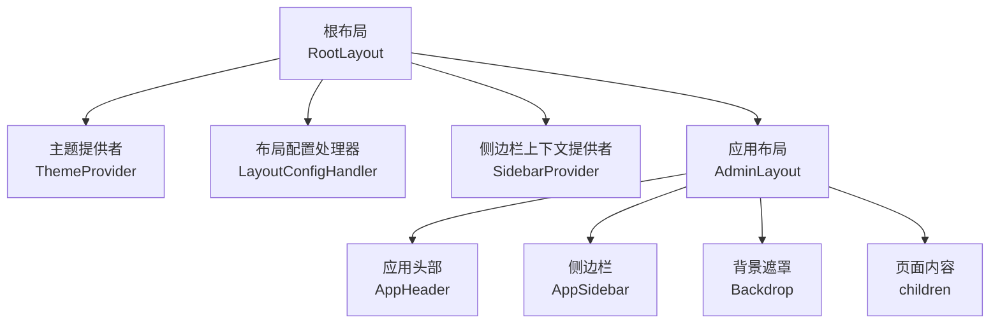
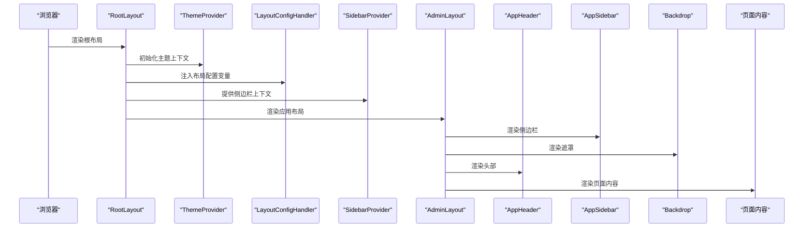
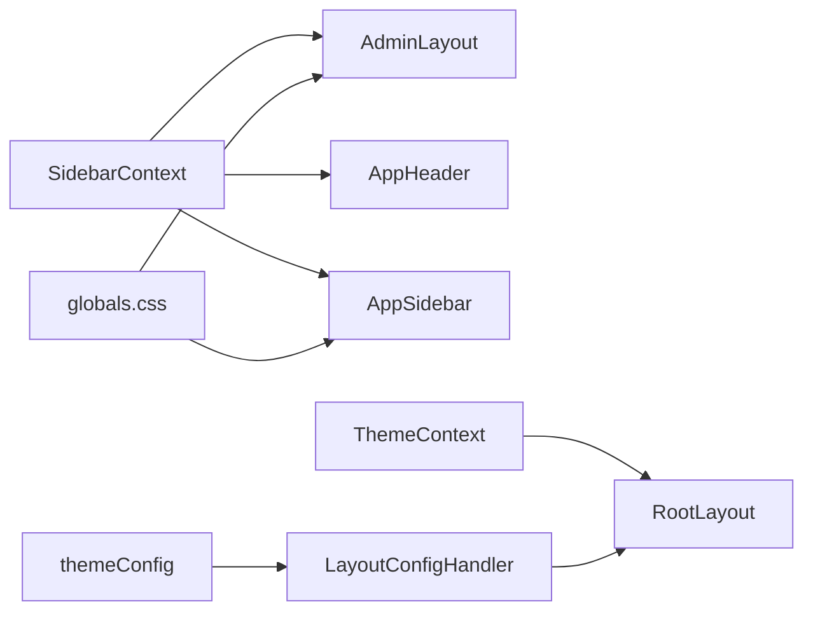

# 布局系统

<cite>
**本文引用的文件列表**
- [src/app/layout.tsx](file://src/app/layout.tsx)
- [src/app/(admin)/layout.tsx](file://src/app/(admin)/layout.tsx)
- [src/layout/AppHeader.tsx](file://src/layout/AppHeader.tsx)
- [src/layout/AppSidebar.tsx](file://src/layout/AppSidebar.tsx)
- [src/layout/Backdrop.tsx](file://src/layout/Backdrop.tsx)
- [src/context/SidebarContext.tsx](file://src/context/SidebarContext.tsx)
- [src/context/ThemeContext.tsx](file://src/context/ThemeContext.tsx)
- [src/config/LayoutConfigHandler.tsx](file://src/config/LayoutConfigHandler.tsx)
- [src/config/themeConfig.ts](file://src/config/themeConfig.ts)
- [src/app/globals.css](file://src/app/globals.css)
- [src/app/(admin)/page.tsx](file://src/app/(admin)/page.tsx)
- [src/app/(admin)/(others-pages)/(chart)/bar-chart/page.tsx](file://src/app/(admin)/(others-pages)/(chart)/bar-chart/page.tsx)
</cite>

## 目录
1. [简介](#简介)
2. [项目结构](#项目结构)
3. [核心组件](#核心组件)
4. [架构总览](#架构总览)
5. [详细组件分析](#详细组件分析)
6. [依赖关系分析](#依赖关系分析)
7. [性能考量](#性能考量)
8. [故障排查指南](#故障排查指南)
9. [结论](#结论)
10. [附录](#附录)

## 简介
本文件系统性解析该 Next.js 管理系统的布局体系，重点覆盖：
- 根布局 RootLayout 的职责与初始化流程
- 应用布局 AdminLayout 的层级结构、状态管理与动态样式
- 应用头部 AppHeader 的功能特性与快捷键交互
- 侧边栏 AppSidebar 的导航逻辑与子菜单展开动画
- 背景遮罩 Backdrop 的移动端交互行为
- 布局组件间的嵌套关系、props 传递机制与样式系统集成
- 布局配置选项、响应式设计与移动端适配策略
- 提供可复用的使用模式与扩展建议

## 项目结构
该系统采用 Next.js App Router 的文件系统路由与分组目录组织页面与布局。布局层级自顶向下为：
- 根布局：负责全局主题、上下文提供者与全局样式注入
- 应用布局：承载 AdminHeader、AppSidebar、Backdrop 与主内容区域
- 页面：具体业务页面在 Admin 命名组内渲染

图表来源
- [src/app/layout.tsx:16-32](file://src/app/layout.tsx#L16-L32)
- [src/app/(admin)/layout.tsx:9-44](file://src/app/(admin)/layout.tsx#L9-L44)

章节来源
- [src/app/layout.tsx:16-32](file://src/app/layout.tsx#L16-L32)
- [src/app/(admin)/layout.tsx:9-44](file://src/app/(admin)/layout.tsx#L9-L44)

## 核心组件
- 根布局 RootLayout：注入字体、主题提供者、布局配置处理器、侧边栏提供者与全局提示组件；统一管理全局样式类与主题切换。
- 应用布局 AdminLayout：根据侧边栏状态动态计算主内容区外边距，渲染侧边栏、遮罩与页面内容；处理移动端与桌面端的交互差异。
- 应用头部 AppHeader：提供侧边栏开关、移动端菜单、搜索框（支持快捷键）、通知与用户下拉菜单。
- 侧边栏 AppSidebar：维护导航项与子菜单状态，基于路径高亮当前项，支持展开/折叠与悬停展开；移动端通过 translateX 控制显示。
- 背景遮罩 Backdrop：仅在移动端侧边栏打开时显示，点击关闭侧边栏，避免误触穿透。

章节来源
- [src/app/layout.tsx:16-32](file://src/app/layout.tsx#L16-L32)
- [src/app/(admin)/layout.tsx:9-44](file://src/app/(admin)/layout.tsx#L9-L44)
- [src/layout/AppHeader.tsx:10-182](file://src/layout/AppHeader.tsx#L10-L182)
- [src/layout/AppSidebar.tsx:104-376](file://src/layout/AppSidebar.tsx#L104-L376)
- [src/layout/Backdrop.tsx:4-18](file://src/layout/Backdrop.tsx#L4-L18)

## 架构总览
布局系统以“根布局 + 应用布局 + 头部 + 侧边栏 + 遮罩 + 页面”为主线，配合上下文提供者实现跨组件的状态共享与联动。

图表来源
- [src/app/layout.tsx:16-32](file://src/app/layout.tsx#L16-L32)
- [src/config/LayoutConfigHandler.tsx:6-29](file://src/config/LayoutConfigHandler.tsx#L6-L29)
- [src/context/SidebarContext.tsx:27-84](file://src/context/SidebarContext.tsx#L27-L84)
- [src/app/(admin)/layout.tsx:25-43](file://src/app/(admin)/layout.tsx#L25-L43)

## 详细组件分析

### 根布局 RootLayout
- 职责
  - 引入 Google 字体与全局样式
  - 包裹主题提供者与布局配置处理器
  - 提供侧边栏上下文与全局提示组件
  - 设置 html/body 的基础类名与暗色模式根类
- 关键点
  - 使用 cn 合并类名，确保字体变量生效
  - LayoutConfigHandler 将主题配置映射到 CSS 变量
  - SidebarProvider 为 AdminLayout 及其子树提供状态

章节来源
- [src/app/layout.tsx:16-32](file://src/app/layout.tsx#L16-L32)
- [src/config/LayoutConfigHandler.tsx:6-29](file://src/config/LayoutConfigHandler.tsx#L6-L29)

### 应用布局 AdminLayout
- 职责
  - 读取侧边栏上下文状态，动态计算主内容区的 marginLeft
  - 渲染侧边栏、遮罩与页面内容容器
  - 在桌面端与移动端之间切换交互策略
- 动态样式
  - 根据 isMobileOpen、isExpanded、isHovered 计算侧边栏宽度与主内容区外边距
  - 主内容区使用过渡动画保证宽度变化的顺滑
- 结构
  - 侧边栏与遮罩位于主内容之前，确保遮罩覆盖全屏且不影响主内容
  - 页面内容容器设置最大宽度与内边距，适配不同断点

章节来源
- [src/app/(admin)/layout.tsx:9-44](file://src/app/(admin)/layout.tsx#L9-L44)

### 应用头部 AppHeader
- 功能特性
  - 侧边栏开关：桌面端切换展开/折叠，移动端切换打开/关闭
  - 移动端菜单：在小屏设备上显示汉堡菜单
  - 搜索框：支持快捷键组合聚焦输入框
  - 通知与用户下拉菜单：右侧工具区
- 交互细节
  - 根据窗口宽度选择不同的切换行为
  - 使用 useRef 获取输入框引用，结合键盘事件实现快捷键
  - 头部固定定位，z-index 较高，确保不被遮挡

章节来源
- [src/layout/AppHeader.tsx:10-182](file://src/layout/AppHeader.tsx#L10-L182)

### 侧边栏 AppSidebar
- 导航数据
  - 定义两类导航项：主菜单与 Others
  - 支持带子菜单的分组与独立链接
- 状态与高亮
  - 使用 pathname 判断当前激活项
  - 子菜单展开时记录高度，实现平滑收起/展开动画
- 展开/折叠逻辑
  - 展开/折叠：isExpanded
  - 悬停展开：isHovered
  - 移动端：isMobileOpen 控制 translateX
- 样式与图标
  - 条目样式通过工具类实现，区分激活/非激活状态
  - 图标与文字在不同尺寸下按条件显示

章节来源
- [src/layout/AppSidebar.tsx:104-376](file://src/layout/AppSidebar.tsx#L104-L376)

### 背景遮罩 Backdrop
- 行为
  - 仅在移动端侧边栏打开时渲染
  - 点击遮罩关闭侧边栏
- 设计
  - 固定定位，z-index 低于侧边栏但高于内容
  - 半透明背景，提升交互反馈

章节来源
- [src/layout/Backdrop.tsx:4-18](file://src/layout/Backdrop.tsx#L4-L18)

### 上下文与配置
- SidebarContext
  - 管理 isExpanded、isMobileOpen、isHovered、activeItem、openSubmenu
  - 提供 toggleSidebar、toggleMobileSidebar、toggleSubmenu 等方法
  - 响应式监听窗口尺寸，移动端自动关闭侧边栏
- ThemeContext
  - 管理主题状态与本地存储同步
  - 切换主题时更新 documentElement 的类名
- LayoutConfigHandler
  - 将 themeConfig 映射为 CSS 变量，供布局与组件使用
- themeConfig
  - 定义侧边栏宽度、头部高度、间距与颜色等全局配置

章节来源
- [src/context/SidebarContext.tsx:19-84](file://src/context/SidebarContext.tsx#L19-L84)
- [src/context/ThemeContext.tsx:15-59](file://src/context/ThemeContext.tsx#L15-L59)
- [src/config/LayoutConfigHandler.tsx:6-29](file://src/config/LayoutConfigHandler.tsx#L6-L29)
- [src/config/themeConfig.ts:4-31](file://src/config/themeConfig.ts#L4-L31)

## 依赖关系分析
- 组件间依赖
  - AdminLayout 依赖 SidebarContext 读取状态并传递给 AppSidebar 与 Backdrop
  - AppHeader 依赖 SidebarContext 进行侧边栏切换
  - AppSidebar 依赖 usePathname 与 SidebarContext 实现导航与高亮
  - RootLayout 依赖 ThemeContext 与 LayoutConfigHandler
- 样式系统
  - 全局 CSS 定义了大量 CSS 变量与工具类，布局组件通过变量与类名控制外观
  - LayoutConfigHandler 将 themeConfig 的值写入 CSS 变量，实现主题与布局的解耦

图表来源
- [src/context/SidebarContext.tsx:19-84](file://src/context/SidebarContext.tsx#L19-L84)
- [src/context/ThemeContext.tsx:15-59](file://src/context/ThemeContext.tsx#L15-L59)
- [src/config/LayoutConfigHandler.tsx:6-29](file://src/config/LayoutConfigHandler.tsx#L6-L29)
- [src/app/globals.css:171-188](file://src/app/globals.css#L171-L188)

章节来源
- [src/context/SidebarContext.tsx:19-84](file://src/context/SidebarContext.tsx#L19-L84)
- [src/context/ThemeContext.tsx:15-59](file://src/context/ThemeContext.tsx#L15-L59)
- [src/config/LayoutConfigHandler.tsx:6-29](file://src/config/LayoutConfigHandler.tsx#L6-L29)
- [src/app/globals.css:171-188](file://src/app/globals.css#L171-L188)

## 性能考量
- 渲染优化
  - AdminLayout 使用内联样式动态计算 marginLeft，避免频繁重排；过渡动画时间较短，保证流畅度
  - AppSidebar 对子菜单高度进行缓存，仅在展开时计算一次，减少回流
- 事件处理
  - SidebarContext 在 resize 时统一处理移动端状态，避免每个组件重复监听
  - AppHeader 的键盘事件在组件卸载时清理，防止内存泄漏
- 样式与变量
  - 通过 CSS 变量集中管理布局参数，减少样式层的重复计算与重绘

## 故障排查指南
- 侧边栏无法展开/折叠
  - 检查 SidebarContext 是否正确包裹 AdminLayout
  - 确认 isExpanded/isHovered 状态是否被外部逻辑覆盖
- 移动端侧边栏不消失
  - 确认 isMobileOpen 是否由 Backdrop 的点击事件触发
  - 检查遮罩的 z-index 是否低于侧边栏
- 主内容区留白异常
  - 检查 CSS 变量是否正确注入（LayoutConfigHandler）
  - 确认 AdminLayout 的 mainContentStyle 计算逻辑
- 搜索框快捷键无效
  - 确认 AppHeader 中键盘事件绑定与输入框 ref 是否正确
- 主题切换不生效
  - 检查 ThemeContext 是否正确设置 documentElement 的类名
  - 确认本地存储中是否存在主题键值

章节来源
- [src/context/SidebarContext.tsx:19-84](file://src/context/SidebarContext.tsx#L19-L84)
- [src/layout/Backdrop.tsx:4-18](file://src/layout/Backdrop.tsx#L4-L18)
- [src/app/(admin)/layout.tsx:16-23](file://src/app/(admin)/layout.tsx#L16-L23)
- [src/layout/AppHeader.tsx:28-41](file://src/layout/AppHeader.tsx#L28-L41)
- [src/context/ThemeContext.tsx:21-39](file://src/context/ThemeContext.tsx#L21-L39)

## 结论
该布局系统通过清晰的分层与上下文共享，实现了可配置、可扩展的管理端布局。根布局负责全局初始化，应用布局承担容器职责，头部与侧边栏提供交互入口，遮罩保障移动端体验。配合 CSS 变量与工具类，系统在视觉与交互上保持一致性和可维护性。建议在扩展新页面或新增导航项时，遵循现有命名与上下文约定，确保一致性与可测试性。

## 附录

### 布局配置选项与样式系统
- 布局配置
  - 侧边栏宽度：展开/折叠两种尺寸
  - 头部高度：用于计算主内容区顶部偏移
  - 间距：容器内边距、断点下的内边距、模块间距
  - 圆角：基础与大圆角
  - 主题色：品牌主色与悬停色
- 样式系统
  - 全局 CSS 变量定义于根节点，布局组件通过 LayoutConfigHandler 注入
  - 工具类用于菜单项与下拉项的激活/非激活状态，便于复用

章节来源
- [src/config/themeConfig.ts:4-31](file://src/config/themeConfig.ts#L4-L31)
- [src/config/LayoutConfigHandler.tsx:6-29](file://src/config/LayoutConfigHandler.tsx#L6-L29)
- [src/app/globals.css:171-188](file://src/app/globals.css#L171-L188)

### 响应式设计与移动端适配
- 断点与尺寸
  - 使用 Tailwind CSS 断点与自定义断点，适配多终端
- 移动端策略
  - SidebarContext 在窗口小于阈值时强制关闭移动端侧边栏
  - AppSidebar 通过 translateX 控制显隐，Backdrop 仅在移动端打开时出现
  - 头部在小屏设备隐藏部分元素，保留汉堡菜单与搜索框

章节来源
- [src/context/SidebarContext.tsx:37-52](file://src/context/SidebarContext.tsx#L37-L52)
- [src/layout/AppSidebar.tsx:299-312](file://src/layout/AppSidebar.tsx#L299-L312)
- [src/layout/Backdrop.tsx:4-18](file://src/layout/Backdrop.tsx#L4-L18)
- [src/layout/AppHeader.tsx:86-103](file://src/layout/AppHeader.tsx#L86-L103)

### 使用模式与扩展建议
- 新增页面
  - 将页面放入对应命名组（如 (admin)/(others-pages)/(chart)/...），AdminLayout 自动包裹
  - 如需特殊头部或侧边栏行为，可在页面内部局部调整，但建议通过上下文或 props 传入
- 新增导航项
  - 在 AppSidebar 的导航数组中添加条目，支持子菜单与图标
  - 若需要特定权限或新标签标识，可在子菜单项中扩展字段
- 自定义主题
  - 修改 themeConfig 或通过 LayoutConfigHandler 注入新的变量值
  - 使用全局 CSS 变量覆盖默认值，保持一致性

章节来源
- [src/layout/AppSidebar.tsx:28-102](file://src/layout/AppSidebar.tsx#L28-L102)
- [src/config/LayoutConfigHandler.tsx:6-29](file://src/config/LayoutConfigHandler.tsx#L6-L29)
- [src/app/(admin)/page.tsx:16-42](file://src/app/(admin)/page.tsx#L16-L42)
- [src/app/(admin)/(others-pages)/(chart)/bar-chart/page.tsx:13-24](file://src/app/(admin)/(others-pages)/(chart)/bar-chart/page.tsx#L13-L24)