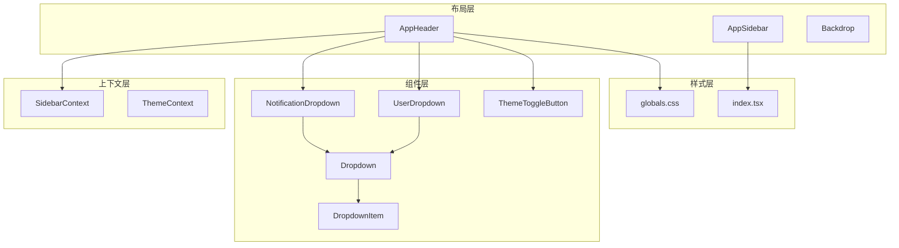
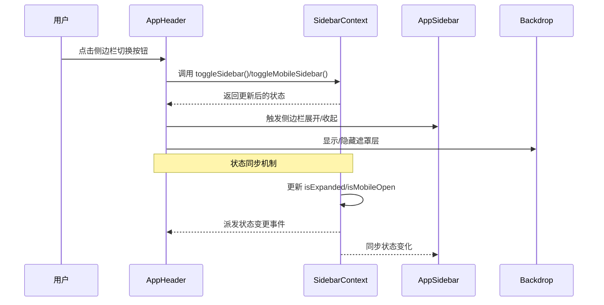
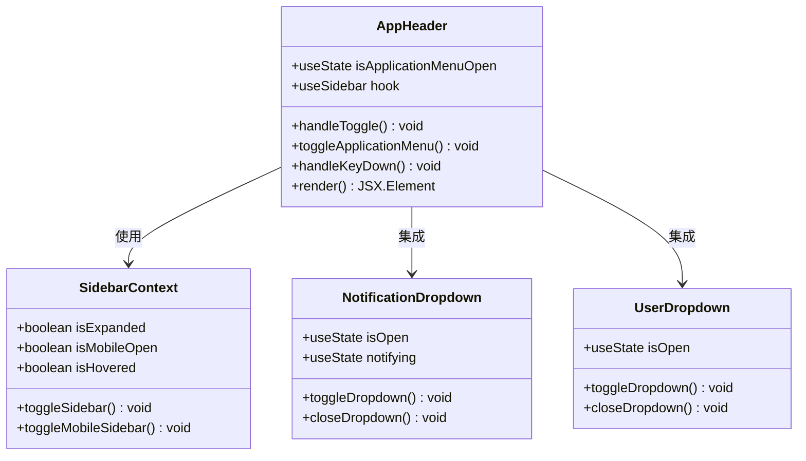
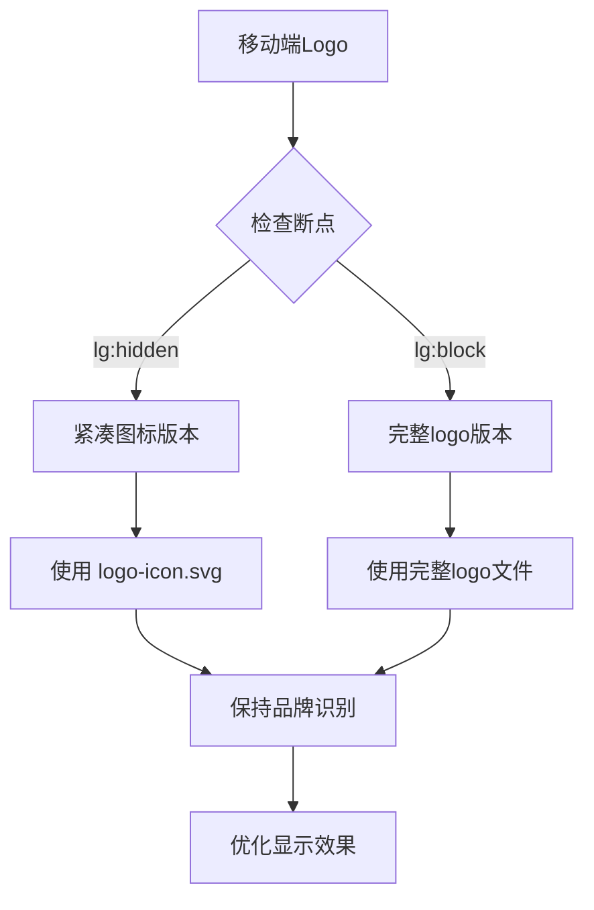
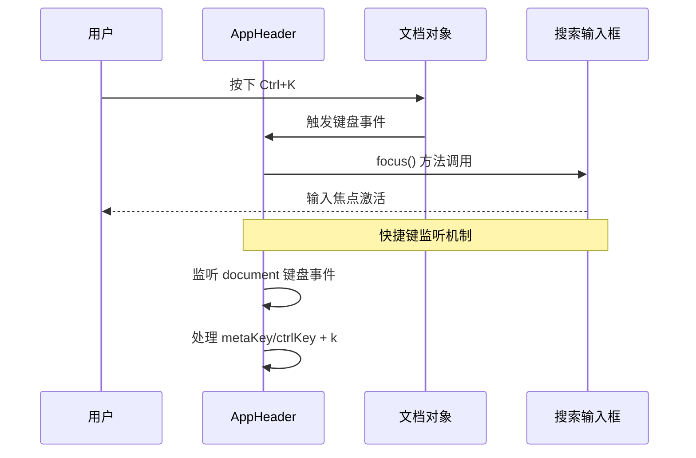
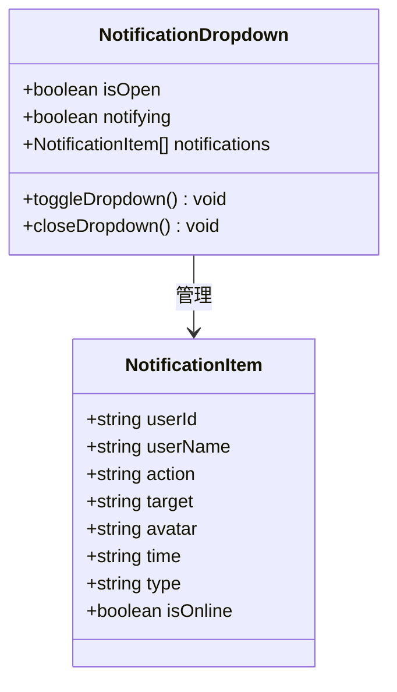
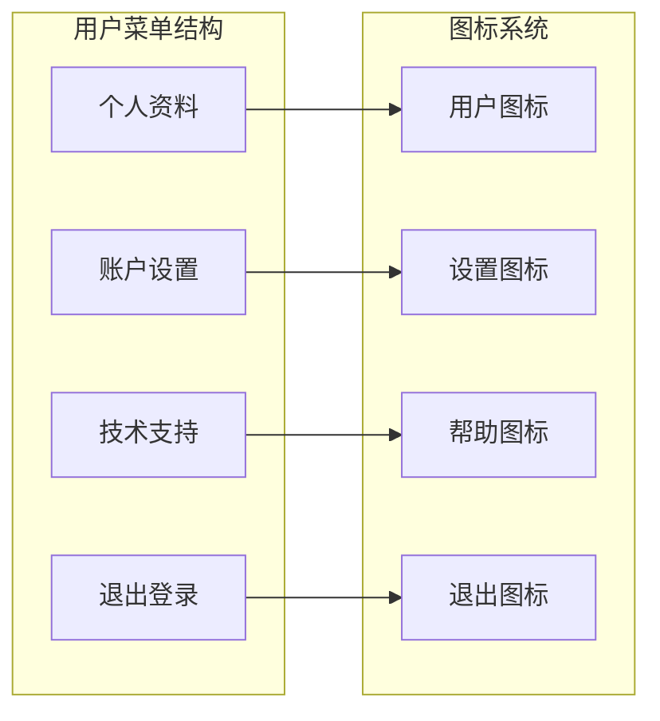
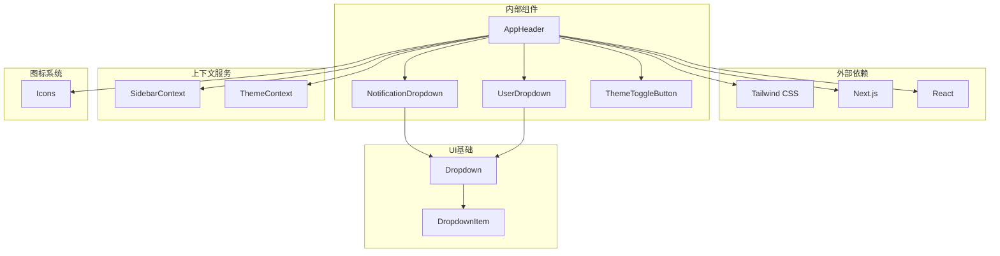
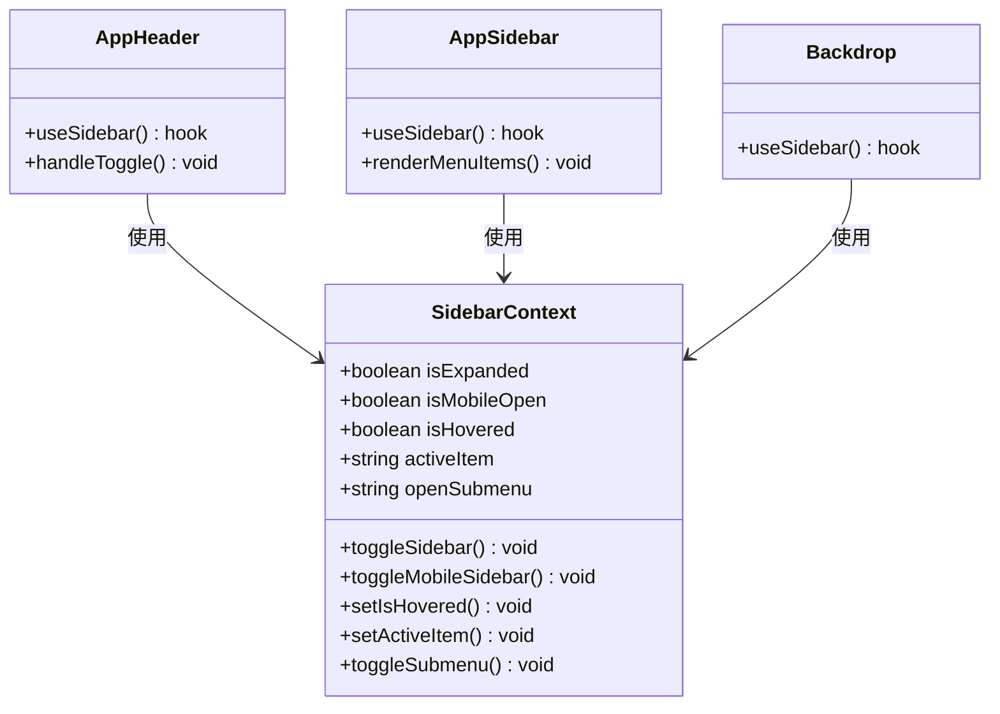

# 应用头部 AppHeader

<cite>
**本文档引用的文件**
- [AppHeader.tsx](file://src/layout/AppHeader.tsx)
- [SidebarContext.tsx](file://src/context/SidebarContext.tsx)
- [AppSidebar.tsx](file://src/layout/AppSidebar.tsx)
- [Backdrop.tsx](file://src/layout/Backdrop.tsx)
- [NotificationDropdown.tsx](file://src/components/header/NotificationDropdown.tsx)
- [UserDropdown.tsx](file://src/components/header/UserDropdown.tsx)
- [ThemeToggleButton.tsx](file://src/components/common/ThemeToggleButton.tsx)
- [Dropdown.tsx](file://src/components/ui/dropdown/Dropdown.tsx)
- [DropdownItem.tsx](file://src/components/ui/dropdown/DropdownItem.tsx)
- [ThemeContext.tsx](file://src/context/ThemeContext.tsx)
- [layout.tsx](file://src/app/(admin)/layout.tsx)
- [layout.tsx](file://src/app/layout.tsx)
- [globals.css](file://src/app/globals.css)
- [index.tsx](file://src/icons/index.tsx)
</cite>

## 更新摘要
**所做更改**
- 更新了响应式设计部分，详细说明移动端紧凑图标版本的实现
- 新增了移动端logo切换机制的技术分析
- 完善了响应式断点和布局策略的说明
- 增强了移动端用户体验的描述

## 目录
1. [简介](#简介)
2. [项目结构](#项目结构)
3. [核心组件](#核心组件)
4. [架构概览](#架构概览)
5. [详细组件分析](#详细组件分析)
6. [依赖关系分析](#依赖关系分析)
7. [性能考虑](#性能考虑)
8. [故障排除指南](#故障排除指南)
9. [结论](#结论)
10. [附录](#附录)

## 简介
AppHeader 是 Next.js 管理系统的应用头部导航组件，负责提供品牌标识、导航菜单、用户操作区域等核心功能。该组件实现了先进的响应式设计，支持桌面端和移动端的不同布局策略。通过智能的移动端紧凑图标版本替代完整logo机制，优化了移动设备的显示效果和用户体验。

## 项目结构
AppHeader 组件位于 `src/layout/` 目录下，采用模块化设计，与其他组件通过上下文和依赖注入的方式进行解耦。



**图表来源**
- [AppHeader.tsx:1-174](file://src/layout/AppHeader.tsx#L1-L174)
- [SidebarContext.tsx:1-85](file://src/context/SidebarContext.tsx#L1-L85)
- [AppSidebar.tsx:1-363](file://src/layout/AppSidebar.tsx#L1-L363)

**章节来源**
- [AppHeader.tsx:1-174](file://src/layout/AppHeader.tsx#L1-L174)
- [layout.tsx:16-32](file://src/app/layout.tsx#L16-L32)

## 核心组件
AppHeader 组件提供了以下核心功能：

### 响应式布局设计
- **桌面端布局**：使用 `lg:` 前缀的 Tailwind CSS 类实现桌面端布局
- **移动端布局**：在小屏幕设备上提供专门的移动端适配，使用紧凑图标版本替代完整logo
- **动态宽度调整**：根据窗口大小动态切换布局模式，实现最优的用户体验

### 智能移动端logo切换机制
- **紧凑图标版本**：移动端使用 `/images/logo/logo-icon.svg` 图标文件
- **条件渲染**：通过 `className="lg:hidden"` 实现桌面端和移动端的差异化显示
- **品牌识别**：即使使用图标版本，仍保持品牌的一致性和可识别性

### 侧边栏控制集成
- **智能切换逻辑**：根据屏幕尺寸自动选择合适的侧边栏切换方式
- **状态同步**：与 SidebarContext 保持状态同步
- **过渡动画**：提供流畅的展开/收起动画效果

### 用户界面元素
- **品牌标识**：集成洋葱头 Logo 和品牌名称
- **搜索功能**：提供全局搜索输入框，支持快捷键触发
- **通知系统**：集成通知下拉菜单，显示未读通知状态
- **用户菜单**：提供用户头像、用户名和下拉菜单选项
- **主题切换**：支持明暗主题切换功能

**章节来源**
- [AppHeader.tsx:10-174](file://src/layout/AppHeader.tsx#L10-L174)
- [SidebarContext.tsx:19-25](file://src/context/SidebarContext.tsx#L19-L25)

## 架构概览
AppHeader 采用基于上下文的架构模式，通过 React Context 实现组件间的状态共享和通信。



**图表来源**
- [AppHeader.tsx:15-21](file://src/layout/AppHeader.tsx#L15-L21)
- [SidebarContext.tsx:54-64](file://src/context/SidebarContext.tsx#L54-L64)
- [Backdrop.tsx:4-14](file://src/layout/Backdrop.tsx#L4-L14)

## 详细组件分析

### AppHeader 主组件分析

#### 结构设计
AppHeader 采用 Flexbox 布局，实现了响应式的设计模式：



**图表来源**
- [AppHeader.tsx:10-25](file://src/layout/AppHeader.tsx#L10-L25)
- [SidebarContext.tsx:4-15](file://src/context/SidebarContext.tsx#L4-L15)
- [NotificationDropdown.tsx:8-23](file://src/components/header/NotificationDropdown.tsx#L8-L23)
- [UserDropdown.tsx:8-18](file://src/components/header/UserDropdown.tsx#L8-L18)

#### 侧边栏交互机制
AppHeader 通过智能的侧边栏切换逻辑实现跨设备的一致体验：

```mermaid
flowchart TD
Start([用户点击侧边栏按钮]) --> CheckWidth{检查窗口宽度}
CheckWidth --> |≥ 1024px| Desktop[桌面端切换]
CheckWidth --> |< 1024px| Mobile[移动端切换]
Desktop --> CallToggleDesktop[toggleSidebar()]
Mobile --> CallToggleMobile[toggleMobileSidebar()]
CallToggleDesktop --> UpdateState[更新侧边栏状态]
CallToggleMobile --> UpdateState
UpdateState --> ApplyTransition[应用过渡动画]
ApplyTransition --> End([完成切换])
```

**图表来源**
- [AppHeader.tsx:15-21](file://src/layout/AppHeader.tsx#L15-L21)
- [SidebarContext.tsx:54-64](file://src/context/SidebarContext.tsx#L54-L64)

#### 移动端响应式logo切换机制
AppHeader 实现了智能的移动端logo切换功能：



**图表来源**
- [AppHeader.tsx:86-96](file://src/layout/AppHeader.tsx#L86-L96)
- [AppSidebar.tsx:307-320](file://src/layout/AppSidebar.tsx#L307-L320)

#### 搜索功能实现
AppHeader 集成了全局搜索功能，支持键盘快捷键触发：



**图表来源**
- [AppHeader.tsx:28-41](file://src/layout/AppHeader.tsx#L28-L41)

**章节来源**
- [AppHeader.tsx:10-174](file://src/layout/AppHeader.tsx#L10-L174)

### 通知下拉菜单分析

#### 功能特性
NotificationDropdown 提供了完整的通知管理功能：

- **未读状态指示**：通过红色圆点显示新通知
- **动态内容加载**：支持多种类型的通知消息
- **用户状态显示**：集成用户在线状态徽章
- **响应式布局**：支持不同屏幕尺寸的显示优化

#### 数据结构设计
通知项采用统一的数据模型：



**图表来源**
- [NotificationDropdown.tsx:8-393](file://src/components/header/NotificationDropdown.tsx#L8-L393)

**章节来源**
- [NotificationDropdown.tsx:1-393](file://src/components/header/NotificationDropdown.tsx#L1-L393)

### 用户下拉菜单分析

#### 用户信息管理
UserDropdown 提供了用户账户管理的核心功能：

- **头像显示**：支持用户头像图片展示
- **账户设置**：提供编辑资料、账户设置等功能入口
- **退出登录**：集成安全的登出流程
- **状态指示**：显示用户当前的在线状态

#### 导航项设计
用户菜单采用统一的图标+文本设计模式：



**图表来源**
- [UserDropdown.tsx:71-173](file://src/components/header/UserDropdown.tsx#L71-L173)

**章节来源**
- [UserDropdown.tsx:1-173](file://src/components/header/UserDropdown.tsx#L1-L173)

### 主题切换组件分析

#### ThemeToggleButton 设计
ThemeToggleButton 提供了直观的主题切换功能：

- **双态图标**：太阳/月亮图标分别代表明/暗主题
- **平滑过渡**：支持主题切换时的视觉过渡效果
- **状态同步**：与 ThemeContext 保持状态同步

**章节来源**
- [ThemeToggleButton.tsx:1-43](file://src/components/common/ThemeToggleButton.tsx#L1-L43)
- [ThemeContext.tsx:1-59](file://src/context/ThemeContext.tsx#L1-L59)

## 依赖关系分析

### 组件依赖图
AppHeader 的依赖关系体现了清晰的分层架构：



**图表来源**
- [AppHeader.tsx:1-8](file://src/layout/AppHeader.tsx#L1-L8)
- [Dropdown.tsx:1-49](file://src/components/ui/dropdown/Dropdown.tsx#L1-L49)
- [DropdownItem.tsx:1-47](file://src/components/ui/dropdown/DropdownItem.tsx#L1-L47)

### 上下文依赖关系
SidebarContext 作为核心状态管理服务，为多个组件提供状态共享：



**图表来源**
- [SidebarContext.tsx:4-25](file://src/context/SidebarContext.tsx#L4-L25)
- [AppHeader.tsx:13](file://src/layout/AppHeader.tsx#L13)
- [AppSidebar.tsx:105](file://src/layout/AppSidebar.tsx#L105)
- [Backdrop.tsx:5](file://src/layout/Backdrop.tsx#L5)

**章节来源**
- [SidebarContext.tsx:1-85](file://src/context/SidebarContext.tsx#L1-L85)

## 性能考虑

### 渲染优化策略
AppHeader 采用了多项性能优化措施：

- **条件渲染**：使用 `lg:` 前缀类实现响应式条件渲染，减少不必要的DOM节点
- **懒加载**：下拉菜单采用延迟加载机制
- **事件节流**：键盘事件监听器使用防抖处理
- **内存管理**：组件卸载时清理事件监听器

### 移动端性能优化
- **图标文件优化**：移动端使用压缩的SVG图标文件
- **条件显示**：通过断点控制不同设备的显示内容
- **资源加载**：避免在移动端加载完整的logo文件

### 状态管理优化
通过 Context API 实现高效的状态共享：

- **局部状态**：仅管理必要的组件状态
- **状态合并**：避免重复的状态更新
- **订阅优化**：精确的订阅范围控制

## 故障排除指南

### 常见问题及解决方案

#### 侧边栏切换失效
**问题描述**：点击侧边栏按钮无响应
**可能原因**：
- SidebarContext 未正确初始化
- 窗口尺寸检测异常
- 事件监听器冲突

**解决方案**：
1. 检查 SidebarProvider 是否正确包裹应用
2. 验证窗口尺寸断点设置
3. 确认事件监听器未被其他组件覆盖

#### 移动端logo显示异常
**问题描述**：移动端logo无法正常显示或显示错误
**可能原因**：
- 图标文件路径错误
- 断点条件设置不当
- 图片加载失败

**解决方案**：
1. 检查 `/images/logo/logo-icon.svg` 文件是否存在
2. 验证 `lg:hidden` 断点类的应用是否正确
3. 确认图片资源的可访问性

#### 下拉菜单显示异常
**问题描述**：通知或用户菜单无法正常显示
**可能原因**：
- Dropdown 组件状态管理问题
- 点击外部区域检测失败
- 样式冲突导致的定位错误

**解决方案**：
1. 检查 Dropdown 组件的 isOpen 状态
2. 验证 handleClickOutside 事件处理
3. 确认 z-index 层级设置

#### 主题切换不生效
**问题描述**：切换主题后界面未更新
**可能原因**：
- ThemeContext 状态未正确更新
- localStorage 存储异常
- CSS 变量未正确应用

**解决方案**：
1. 验证 ThemeProvider 包裹范围
2. 检查 localStorage 权限设置
3. 确认 CSS 自定义属性应用

**章节来源**
- [AppHeader.tsx:28-41](file://src/layout/AppHeader.tsx#L28-L41)
- [Dropdown.tsx:20-35](file://src/components/ui/dropdown/Dropdown.tsx#L20-L35)

## 结论
AppHeader 作为 Next.js 管理系统的核心组件，展现了优秀的架构设计和用户体验。通过合理的组件拆分、上下文管理和响应式设计，实现了跨设备的一致性体验。其模块化的结构为后续的功能扩展和维护提供了良好的基础。特别是移动端紧凑图标版本的实现，体现了对移动设备性能和用户体验的深度考量。

## 附录

### 样式定制指南

#### 自定义头部样式
可以通过修改以下 CSS 变量来自定义头部外观：
- `--header-height`: 头部高度
- `--header-background`: 背景色
- `--header-border-color`: 边框颜色

#### 响应式断点配置
- `lg:` 断点：1024px（桌面端）
- `md:` 断点：768px（平板端）
- `sm:` 断点：640px（移动端）

### 扩展开发建议

#### 添加新的头部功能
1. 在 AppHeader 中添加新的按钮或组件
2. 创建对应的子组件文件
3. 在 AppHeader 中导入并集成
4. 添加相应的样式和交互逻辑

#### 集成第三方服务
- **认证服务**：集成 OAuth 登录
- **推送通知**：集成 Web Push API
- **实时通信**：集成 WebSocket 连接

### 国际化支持
当前组件支持基本的国际化需求，可通过以下方式进行扩展：
- 使用 i18n 库实现多语言支持
- 添加语言切换功能
- 支持 RTL（从右到左）布局

### 响应式设计最佳实践

#### 移动端优化策略
- **触摸友好**：确保按钮和交互元素适合触摸操作
- **加载优化**：使用适当的图片格式和尺寸
- **性能优先**：减少移动端的资源消耗

#### 断点设计原则
- **渐进增强**：从小屏幕开始，逐步增加复杂度
- **一致性**：保持不同设备间的用户体验一致
- **可访问性**：确保所有用户都能正常使用