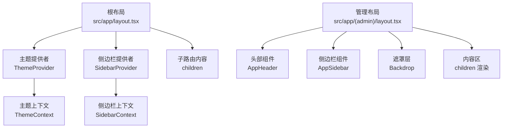
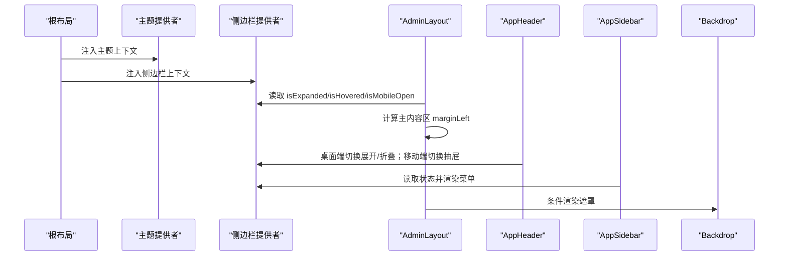
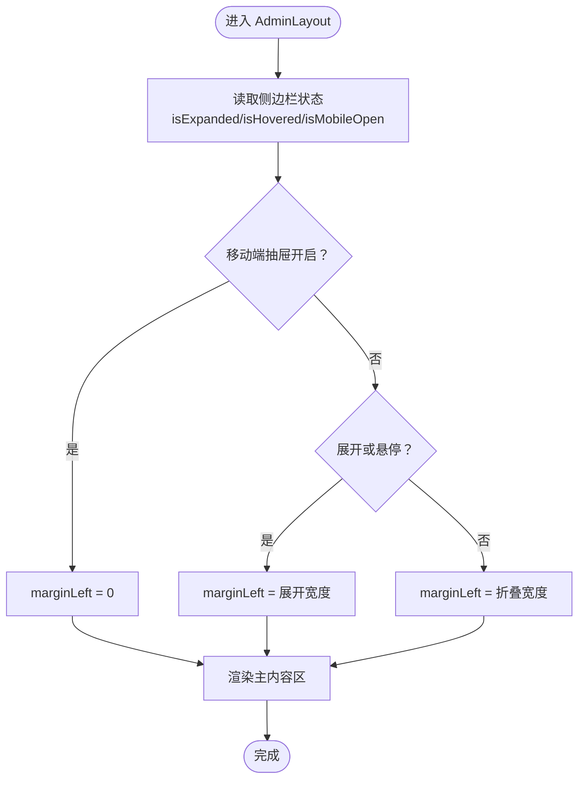
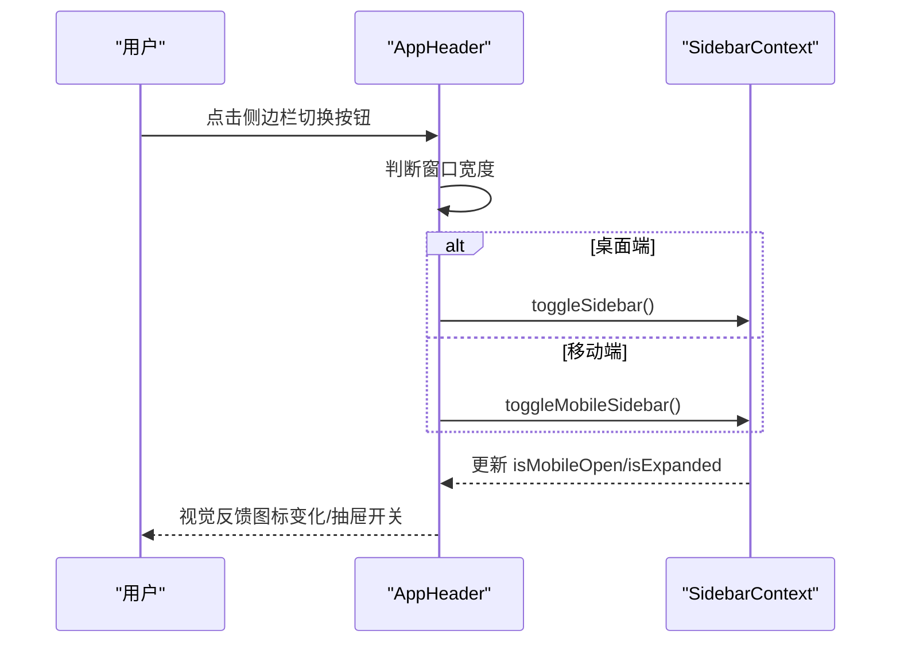
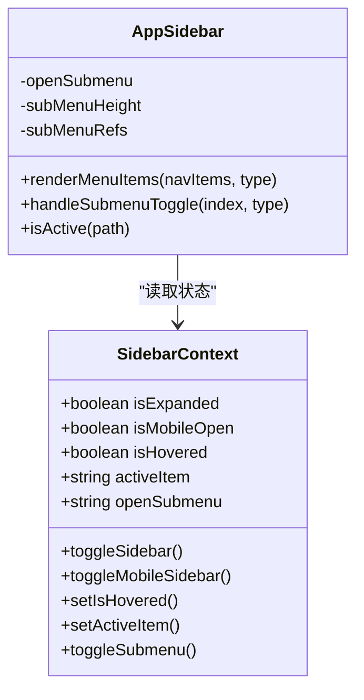
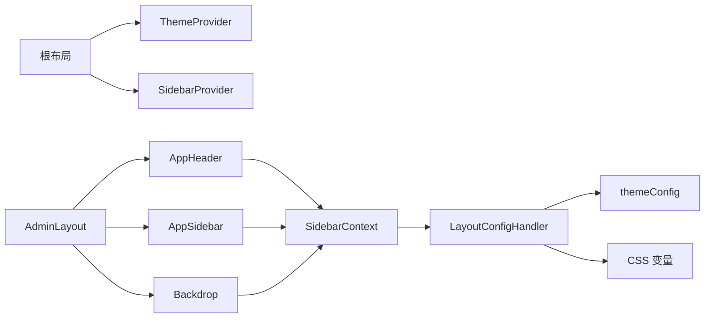

# 应用布局 AdminLayout

<cite>
**本文引用的文件列表**
- [src/app/layout.tsx](file://src/app/layout.tsx)
- [src/app/(admin)/layout.tsx](file://src/app/(admin)/layout.tsx)
- [src/layout/AppHeader.tsx](file://src/layout/AppHeader.tsx)
- [src/layout/AppSidebar.tsx](file://src/layout/AppSidebar.tsx)
- [src/layout/Backdrop.tsx](file://src/layout/Backdrop.tsx)
- [src/context/SidebarContext.tsx](file://src/context/SidebarContext.tsx)
- [src/context/ThemeContext.tsx](file://src/context/ThemeContext.tsx)
- [src/config/LayoutConfigHandler.tsx](file://src/config/LayoutConfigHandler.tsx)
- [src/config/themeConfig.ts](file://src/config/themeConfig.ts)
- [src/app/globals.css](file://src/app/globals.css)
- [src/app/(admin)/page.tsx](file://src/app/(admin)/page.tsx)
- [src/app/(admin)/(others-pages)/(chart)/bar-chart/page.tsx](file://src/app/(admin)/(others-pages)/(chart)/bar-chart/page.tsx)
</cite>

## 目录
1. [简介](#简介)
2. [项目结构](#项目结构)
3. [核心组件](#核心组件)
4. [架构总览](#架构总览)
5. [详细组件分析](#详细组件分析)
6. [依赖关系分析](#依赖关系分析)
7. [性能考量](#性能考量)
8. [故障排查指南](#故障排查指南)
9. [结论](#结论)
10. [附录：使用示例与定制指南](#附录使用示例与定制指南)

## 简介
本文件系统性解析管理面板专用布局 AdminLayout 的设计与实现，涵盖：
- 布局容器结构与子组件组织方式
- 响应式断点配置与移动端/桌面端显示模式
- 组件间通信机制（上下文）与状态同步策略
- 布局配置项、自定义属性传递与样式覆盖方法
- 实际使用示例与布局定制指南

## 项目结构
AdminLayout 所在的路由层级为 `(admin)`，其父级根布局负责注入全局主题与侧边栏上下文；AdminLayout 负责组织头部、侧边栏、内容区，并通过 CSS 变量与主题配置驱动尺寸与配色。

图表来源
- [src/app/layout.tsx:16-32](file://src/app/layout.tsx#L16-L32)
- [src/app/(admin)/layout.tsx:9-44](file://src/app/(admin)/layout.tsx#L9-L44)
- [src/layout/AppHeader.tsx:10-179](file://src/layout/AppHeader.tsx#L10-L179)
- [src/layout/AppSidebar.tsx:104-376](file://src/layout/AppSidebar.tsx#L104-L376)
- [src/layout/Backdrop.tsx:4-17](file://src/layout/Backdrop.tsx#L4-L17)
- [src/context/SidebarContext.tsx:27-84](file://src/context/SidebarContext.tsx#L27-L84)
- [src/context/ThemeContext.tsx:15-50](file://src/context/ThemeContext.tsx#L15-L50)

章节来源
- [src/app/layout.tsx:16-32](file://src/app/layout.tsx#L16-L32)
- [src/app/(admin)/layout.tsx:9-44](file://src/app/(admin)/layout.tsx#L9-L44)

## 核心组件
- 管理布局 AdminLayout：负责整体容器、主内容区边距计算、子组件挂载与移动端遮罩联动
- 头部 AppHeader：包含侧边栏切换按钮、搜索框、通知与用户下拉菜单等
- 侧边栏 AppSidebar：导航菜单、子菜单展开/收起、移动端抽屉效果
- 遮罩 Backdrop：移动端侧边栏打开时的背景遮罩，点击关闭侧边栏
- 上下文 SidebarContext：统一管理侧边栏展开/折叠、移动端开关、悬停展开、活动项与子菜单状态
- 主题上下文 ThemeContext：主题切换与持久化
- 布局配置处理器 LayoutConfigHandler：将主题配置映射到 CSS 变量
- 全局样式 globals.css：定义断点、阴影、颜色、圆角、布局变量等

章节来源
- [src/app/(admin)/layout.tsx:9-44](file://src/app/(admin)/layout.tsx#L9-L44)
- [src/layout/AppHeader.tsx:10-179](file://src/layout/AppHeader.tsx#L10-L179)
- [src/layout/AppSidebar.tsx:104-376](file://src/layout/AppSidebar.tsx#L104-L376)
- [src/layout/Backdrop.tsx:4-17](file://src/layout/Backdrop.tsx#L4-L17)
- [src/context/SidebarContext.tsx:27-84](file://src/context/SidebarContext.tsx#L27-L84)
- [src/context/ThemeContext.tsx:15-50](file://src/context/ThemeContext.tsx#L15-L50)
- [src/config/LayoutConfigHandler.tsx:6-29](file://src/config/LayoutConfigHandler.tsx#L6-L29)
- [src/app/globals.css:171-188](file://src/app/globals.css#L171-L188)

## 架构总览
AdminLayout 采用“容器 + 子组件”的分层架构，配合上下文与 CSS 变量实现响应式与主题化布局。核心流程如下：
- 根布局注入 ThemeProvider 与 SidebarProvider，确保全局主题与侧边栏状态可用
- AdminLayout 读取侧边栏状态，动态计算主内容区的左侧边距
- AppHeader 通过 SidebarContext 切换侧边栏（桌面端与移动端逻辑区分）
- AppSidebar 根据状态渲染菜单、子菜单与移动端抽屉
- Backdrop 在移动端打开侧边栏时显示，点击关闭
- LayoutConfigHandler 将 themeConfig 映射为 CSS 变量，供布局与组件使用

图表来源
- [src/app/layout.tsx:22-29](file://src/app/layout.tsx#L22-L29)
- [src/app/(admin)/layout.tsx:14-23](file://src/app/(admin)/layout.tsx#L14-L23)
- [src/layout/AppHeader.tsx:13-21](file://src/layout/AppHeader.tsx#L13-L21)
- [src/layout/AppSidebar.tsx:105-106](file://src/layout/AppSidebar.tsx#L105-L106)
- [src/layout/Backdrop.tsx:5-14](file://src/layout/Backdrop.tsx#L5-L14)

## 详细组件分析

### AdminLayout 容器与主内容区
- 责任边界
  - 组织头部、侧边栏、遮罩与内容区
  - 动态计算主内容区 marginLeft，适配不同侧边栏状态
- 关键行为
  - 依据 isMobileOpen 决定是否清空 marginLeft（移动端抽屉全宽）
  - 依据 isExpanded 或 isHovered 决定使用展开宽度或折叠宽度
  - 使用 CSS 变量控制间距与断点
- 嵌套层次
  - 顶层容器包裹侧边栏与遮罩
  - 内层容器承载头部与内容区
- 状态同步
  - 通过 SidebarContext 获取状态，避免 props 下传
- 自定义属性与样式覆盖
  - 通过 CSS 变量覆盖布局尺寸与间距
  - 通过类名控制过渡动画与阴影

图表来源
- [src/app/(admin)/layout.tsx:14-23](file://src/app/(admin)/layout.tsx#L14-L23)

章节来源
- [src/app/(admin)/layout.tsx:9-44](file://src/app/(admin)/layout.tsx#L9-L44)

### AppHeader 头部组件
- 责任边界
  - 提供侧边栏切换入口（桌面端/移动端区分）
  - 提供搜索框与快捷键支持
  - 提供通知与用户下拉菜单
- 响应式行为
  - 桌面端：点击切换侧边栏展开/折叠
  - 移动端：点击切换侧边栏抽屉
- 键盘快捷键
  - 支持 Command/Ctrl + K 聚焦搜索输入框
- 交互细节
  - 侧边栏图标根据当前状态显示不同 SVG
  - 应用菜单（移动端）可显隐，用于放置工具栏等

图表来源
- [src/layout/AppHeader.tsx:13-21](file://src/layout/AppHeader.tsx#L13-L21)
- [src/context/SidebarContext.tsx:54-64](file://src/context/SidebarContext.tsx#L54-L64)

章节来源
- [src/layout/AppHeader.tsx:10-179](file://src/layout/AppHeader.tsx#L10-L179)

### AppSidebar 侧边栏组件
- 责任边界
  - 渲染主菜单与“其他”菜单
  - 控制子菜单展开/收起与高度动画
  - 移动端抽屉模式与悬停展开
- 导航数据结构
  - 两类菜单项：main 与 others
  - 支持带子项的分组菜单与独立链接
- 状态与交互
  - 通过 SidebarContext 获取 isExpanded/isHovered/isMobileOpen
  - 子菜单高度通过 ref 计算并动画过渡
  - 当前路径高亮
- 响应式行为
  - 桌面端：展开/折叠宽度由 CSS 变量控制
  - 悬停时临时展开
  - 移动端：抽屉全屏，隐藏滚动条

图表来源
- [src/context/SidebarContext.tsx:4-15](file://src/context/SidebarContext.tsx#L4-L15)
- [src/layout/AppSidebar.tsx:104-376](file://src/layout/AppSidebar.tsx#L104-L376)

章节来源
- [src/layout/AppSidebar.tsx:104-376](file://src/layout/AppSidebar.tsx#L104-L376)

### Backdrop 遮罩层
- 责任边界
  - 在移动端侧边栏打开时显示遮罩
  - 点击遮罩关闭侧边栏
- 条件渲染
  - 仅当 isMobileOpen 为真时渲染

章节来源
- [src/layout/Backdrop.tsx:4-17](file://src/layout/Backdrop.tsx#L4-L17)

### SidebarContext 与 ThemeContext
- SidebarContext
  - 管理侧边栏状态与切换函数
  - 响应式判断移动端宽度并自动关闭抽屉
- ThemeContext
  - 主题切换与本地存储持久化
  - 通过类名切换 dark 模式

章节来源
- [src/context/SidebarContext.tsx:27-84](file://src/context/SidebarContext.tsx#L27-L84)
- [src/context/ThemeContext.tsx:15-50](file://src/context/ThemeContext.tsx#L15-L50)

### 布局配置与样式覆盖
- LayoutConfigHandler
  - 将 themeConfig 中的 sidebar、spacing、borderRadius、colors 映射为 CSS 变量
- themeConfig
  - 定义侧边栏展开/折叠宽度、头部高度、间距、圆角与品牌色
- globals.css
  - 定义断点、颜色体系、阴影、z-index、布局变量
  - 提供菜单项与下拉项的样式工具类

章节来源
- [src/config/LayoutConfigHandler.tsx:6-29](file://src/config/LayoutConfigHandler.tsx#L6-L29)
- [src/config/themeConfig.ts:4-30](file://src/config/themeConfig.ts#L4-L30)
- [src/app/globals.css:171-188](file://src/app/globals.css#L171-L188)

## 依赖关系分析
- AdminLayout 依赖 SidebarContext 读取状态并计算主内容区边距
- AppHeader 依赖 SidebarContext 进行侧边栏切换
- AppSidebar 依赖 SidebarContext 渲染菜单与子菜单
- Backdrop 依赖 SidebarContext 控制遮罩显示
- 根布局同时注入 ThemeProvider 与 SidebarProvider，保证全局可用
- LayoutConfigHandler 与 themeConfig 为布局提供 CSS 变量支撑

图表来源
- [src/app/layout.tsx:22-29](file://src/app/layout.tsx#L22-L29)
- [src/app/(admin)/layout.tsx:14-23](file://src/app/(admin)/layout.tsx#L14-L23)
- [src/layout/AppHeader.tsx:13](file://src/layout/AppHeader.tsx#L13)
- [src/layout/AppSidebar.tsx:105](file://src/layout/AppSidebar.tsx#L105)
- [src/layout/Backdrop.tsx:5](file://src/layout/Backdrop.tsx#L5)
- [src/config/LayoutConfigHandler.tsx:6-29](file://src/config/LayoutConfigHandler.tsx#L6-L29)
- [src/config/themeConfig.ts:4-30](file://src/config/themeConfig.ts#L4-L30)

章节来源
- [src/app/layout.tsx:16-32](file://src/app/layout.tsx#L16-L32)
- [src/app/(admin)/layout.tsx:9-44](file://src/app/(admin)/layout.tsx#L9-L44)

## 性能考量
- 状态集中管理：通过 SidebarContext 避免多层 props 传递，减少重渲染
- 动画与过渡：侧边栏宽度与子菜单高度使用 CSS 过渡，保持流畅体验
- 移动端优化：移动端抽屉全屏，避免复杂定位与滚动冲突
- CSS 变量：通过 LayoutConfigHandler 注入，减少运行时计算与样式抖动
- 图标与图片：SVG 图标内联，图片懒加载与尺寸固定，降低首屏压力

## 故障排查指南
- 侧边栏不响应切换
  - 检查根布局是否正确注入 SidebarProvider
  - 确认 SidebarContext 的切换函数未被覆盖
- 移动端抽屉无法关闭
  - 检查 Backdrop 是否渲染以及点击事件绑定
  - 确认 SidebarContext 的 isMobileOpen 状态更新
- 主内容区边距异常
  - 检查 CSS 变量是否正确注入（LayoutConfigHandler）
  - 确认 AdminLayout 的 marginLeft 计算逻辑
- 主题切换无效
  - 检查 ThemeProvider 是否包裹根布局
  - 确认 ThemeContext 的主题状态与本地存储同步

章节来源
- [src/app/layout.tsx:22-29](file://src/app/layout.tsx#L22-L29)
- [src/layout/Backdrop.tsx:5-14](file://src/layout/Backdrop.tsx#L5-L14)
- [src/config/LayoutConfigHandler.tsx:6-29](file://src/config/LayoutConfigHandler.tsx#L6-L29)
- [src/context/ThemeContext.tsx:15-50](file://src/context/ThemeContext.tsx#L15-L50)

## 结论
AdminLayout 以清晰的容器-子组件分层、上下文集中管理与 CSS 变量驱动为核心，实现了可配置、可扩展且响应式的管理面板布局。通过 SidebarContext 与 ThemeContext 的协同，布局在桌面端与移动端之间平滑切换，满足不同设备与主题下的使用需求。

## 附录：使用示例与定制指南

### 使用示例
- 在管理页面中直接使用 AdminLayout 包裹内容
  - 示例路径：[src/app/(admin)/page.tsx](file://src/app/(admin)/page.tsx#L16-L42)
  - 示例路径：[src/app/(admin)/(others-pages)/(chart)/bar-chart/page.tsx](file://src/app/(admin)/(others-pages)/(chart)/bar-chart/page.tsx#L13-L24)

### 布局配置选项
- 侧边栏宽度
  - 展开宽度：通过 themeConfig.sidebar.widthExpanded 设置
  - 折叠宽度：通过 themeConfig.sidebar.widthCollapsed 设置
  - 对应 CSS 变量：--sidebar-width-expanded、--sidebar-width-collapsed
- 头部高度
  - 通过 themeConfig.header.height 设置
  - 对应 CSS 变量：--header-height
- 间距与断点
  - 容器内边距：--main-padding、--main-padding-md
  - 区块间距：--section-gap
  - 断点：--breakpoint-*
- 圆角与阴影
  - --border-radius-base、--border-radius-large
  - 阴影：--shadow-theme-*

章节来源
- [src/config/themeConfig.ts:4-30](file://src/config/themeConfig.ts#L4-L30)
- [src/config/LayoutConfigHandler.tsx:6-29](file://src/config/LayoutConfigHandler.tsx#L6-L29)
- [src/app/globals.css:171-188](file://src/app/globals.css#L171-L188)

### 自定义属性传递
- 通过 SidebarContext 的切换函数控制侧边栏状态
  - 切换展开/折叠：toggleSidebar()
  - 切换移动端抽屉：toggleMobileSidebar()
  - 设置悬停状态：setIsHovered()
- 通过 ThemeContext 切换主题
  - 切换主题：toggleTheme()

章节来源
- [src/context/SidebarContext.tsx:54-64](file://src/context/SidebarContext.tsx#L54-L64)
- [src/context/ThemeContext.tsx:41-43](file://src/context/ThemeContext.tsx#L41-L43)

### 样式覆盖方法
- 覆盖布局变量
  - 在页面或组件中设置 CSS 变量，优先于默认值
  - 示例：:root { --sidebar-width-expanded: 260px; }
- 覆盖断点与间距
  - 修改 --breakpoint-* 与 --main-padding 等变量
- 覆盖颜色与阴影
  - 修改 --color-brand-500、--color-brand-600 等变量
- 菜单样式
  - 使用已定义的工具类：menu-item、menu-item-active、menu-dropdown-item 等

章节来源
- [src/app/globals.css:228-286](file://src/app/globals.css#L228-L286)
- [src/app/globals.css:171-188](file://src/app/globals.css#L171-L188)